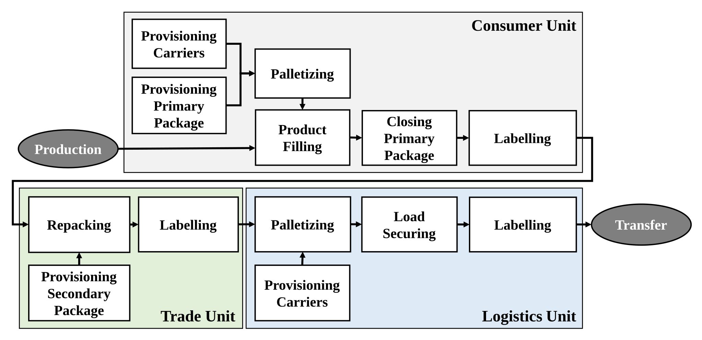
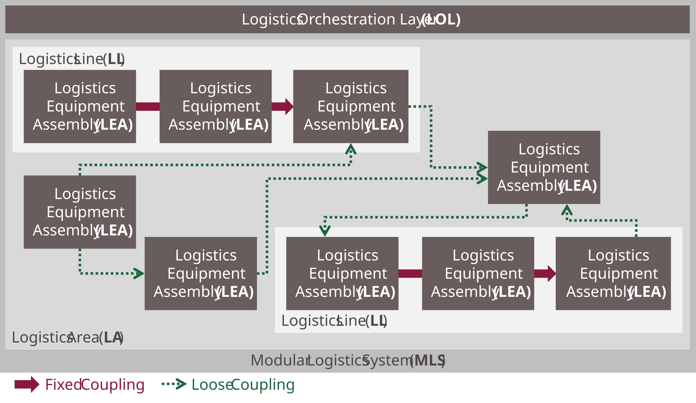
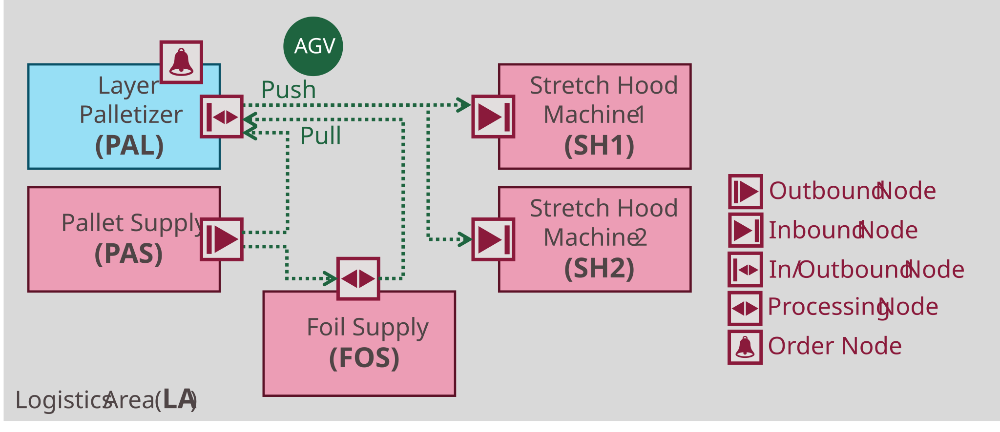
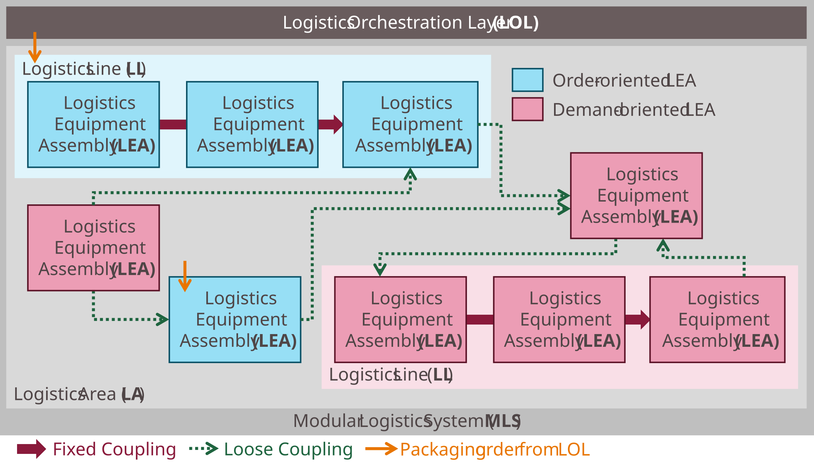

<!-- TODO: Bilder anpassen und übersetzen -->

## 2 Modular Logistics Systems

## 2.1 Context: Production-Related Logistics and Packaging Processes

This work focuses on packaging processes in the process industry as a part of production-related logistics. Production-related logistics encompasses the supply of production processes with raw materials and the packaging of finished products [[NE 171]](../08_References/README.md#namur-ak-419-2020). The core task of packaging processes is the discretization of product streams, e.g., bulk or liquid goods, into individual, uniquely identifiable units referred to as **Logistics Objects (LOs)**, e.g., bags or pallets [[NE 171]](../08_References/README.md#namur-ak-419-2020).

Within the ENPRO 2.0 research project "Modular Production-Related Logistics (MoProLog)", process chains of packaging processes were analyzed in collaboration with end users as well as equipment manufacturers and a reference model was derived [[GPL23]](../08_References/README.md#gryczycha-et-al-2023). This model abstracts typical packaging steps, categorized according to whether they contribute to the primary packaging (Consumer Unit), secondary packaging (Trade Unit), or transport packaging (Logistics Unit) [[DIN 55405]](../08_References/README.md#din-55405). A concrete packaging process typically involves only a subset of these steps, as illustrated in [Figure 2.1](#figure-21-reference-process-model-for-packaging-processes).

##### Figure 2.1: Reference Process Model for Packaging Processes [[GPL23]](../08_References/README.md#gryczycha-et-al-2023)

## 2.2 Structure of a Modular Logistics System

The goal of the MoProLog project was to implement such production-related logistics processes using modular logistics systems. The fundamental idea of modularization is the decomposition of a system into clearly bounded modules, which can in turn be broken down into sub-modules. This hierarchical decomposition yields a set of **structural levels**. The structural levels described below were developed within the MoProLog project and are partially published in [[BFG+21]](../08_References/README.md#blumenstein-et-al-design-principles).

[Figure 2.2](#figure-22-structure-of-a-modular-logistics-system) illustrates an exemplary **Modular Logistics System (MLS)**. The structural levels relevant to this work, i.e., Modular Logistics System, Logistics Area, Logistics Line, and Logistics Equipment Assembly, are described in the following.

##### Figure 2.2: Structure of a Modular Logistics System

**Modular Logistics System (MLS):** The MLS is the highest aggregation level and serves the execution of one or more logistics processes (here: packaging processes) on the basis of packaging orders. It differs from conventional packaging systems through its modular structure. An MLS consists of a Logistics Area and a **Logistics Orchestration Layer (LOL)**, which takes over control, management, and monitoring functions for the entire system.

**Logistics Area (LA):** A Logistics Area is a grouping of loosely coupled Logistics Equipment Assemblies and Logistics Lines within a shared workspace (e.g., the same production hall). It is characterized by flexible material flows that are only determined at runtime. The loose coupling results in low interdependencies between the contained elements, enabling high flexibility.

**Logistics Line (LL):** A Logistics Line is a grouping of rigidly coupled Logistics Equipment Assemblies with a fixed material flow. Transport paths are determined by the physical layout at engineering time and are immutable during operation. The rigid coupling creates strong dependencies between the constituent Logistics Equipment Assemblies.

**Logistics Equipment Assembly (LEA):** A LEA is a replaceable constituent of an MLS. It performs logistics functions (e.g., filling, palletizing, wrapping) and processes LOs such as bags or pallets. A LEA comprises all necessary hardware and software to execute its function largely autonomously and provides its functionality via standardized interfaces, enabling automated integration into an MLS. Unlike conventional packaging units, each LEA has its own controller and can communicate both with the LOL and directly with other LEAs. The direct LEA-to-LEA interaction is a key distinction from today's MTP-based Process Equipment Assemblies.

A LEA may be further subdivided into **Functional Equipment Assemblies (FEAs)**, which extend the LEA hardware- and software-wise and are exclusively assigned to one LEA. FEAs may have their own controller and communicate only with their parent LEA. At the lowest level, **Components (COMPs)** represent atomic, non-decomposable units (e.g., individual sensors or actuators) and communicate only with their parent FEA.

> **Scope of this work:** This work deals with the modular automation of MLS and the effortless automation integration of all necessary elements. The integration challenges in MLS automation lie primarily in the interaction of LEAs with each other and with higher-level systems [[NE 171]](../08_References/README.md#namur-ak-419-2020). This work therefore focuses on the automation of LEAs, their interaction in Logistics Lines and Logistics Areas, and their integration into a LOL.

## 2.3 Transport Systems

Two types of couplings between LEAs are distinguished in an MLS, each associated with a different transport mechanism:

- **Rigid couplings** (within Logistics Lines) are implemented by continuous conveyors, typically conveyor belts. This conveyor technology either forms part of a LEA or is implemented as a dedicated conveyor-LEA.
- **Loose couplings** (within a Logistics Area) are implemented by discontinuous transport technology, typically **Automated Guided Vehicle (AGV) systems**. An AGV system consists of a fleet of vehicles managed by a fleet manager. The flexibility of AGV systems enables LOs to be routed dynamically along varying paths through a Logistics Area.

LEAs expose physical handover points, referred to as **Transport Nodes**, for interaction with AGV systems:

- **Outbound nodes:** LOs are transferred from the LEA to an AGV.
- **Inbound nodes:** LOs are received by the LEA from an AGV.
- **InOutbound nodes:** Both transfer directions are possible at the same node.
- **Processing nodes:** The LEA processes an LO while it remains on the AGV (e.g., applying a foil sheet).

[Figure 2.3](#figure-23-transport-nodes-and-transports-in-an-exemplary-logistics-system) illustrates the transport nodes of LEAs and the transports between them using an exemplary logistics system.

##### Figure 2.3: Transport Nodes and Transports in an Exemplary Logistics System

Transport processes between nodes are initiated by **transport demands**, which a producing LEA signals as a *push demand* (finished LO ready for pickup) or a requesting LEA signals as a *pull demand* (material required). The sequence of transport nodes to be visited by an AGV can be defined either *statically* as a default route or *dynamically* at runtime via material flow management in the LOL.

LEAs use **Order nodes** to indicate, that they have a demand for a push or a pull transport. In contrast to the other transport nodes mentioned above, order node are *virtual* nodes, not *physical* ones.

## 2.4 Operating Modes of LEAs and Logistics Lines

Two fundamental operating modes of LEAs are distinguished [[BFG+21]](../08_References/README.md#blumenstein-et-al-design-principles):

**Order-oriented operation:** A LEA continuously processes a single packaging order. It receives all order data at the start and processes all LOs of the order in the same manner (e.g., continuous bag filling). Multiple LOs may be present in the LEA simultaneously. The focus is on high throughput. During execution, the LEA is bound to *one* order and performs *one* task.

**Demand-oriented operation:** A LEA adapts its function to each arriving LO. It is started without order-specific parameters; upon arrival of an LO, the LO is identified and processed according to its specific order data. Only *one* LO is present in the LEA at a time. The focus is on high flexibility (e.g., applying or omitting a foil hood depending on the LO type). A demand-oriented LEA can contribute to *multiple* orders and/or perform *multiple* tasks.

All LEAs within a Logistics Line must operate uniformly in one mode, since the rigid coupling creates strong interdependencies. Consequently, entire Logistics Lines also exhibit an order-oriented or demand-oriented character. A Logistics Area, by contrast, allows a flexible combination of both operating modes, provided that at least one order-oriented LEA or Logistics Line exists to accept packaging orders.

## 2.5 Execution of Logistics Processes

[Figure 2.4](#figure-24-execution-of-logistics-processes-in-an-mls) illustrates the execution of logistics processes in an MLS, as described in the following.

##### Figure 2.4: Execution of Logistics Processes in an MLS

Each logistics process in an MLS is initiated by a packaging order (e.g., fill and palletize 500 bags onto 10 pallets). Packaging orders are managed by the order management function of the LOL or entered ad hoc via a Human Machine Interface (HMI). To execute an order, the LOL assigns it to an order-oriented LEA or Logistics Line, which then processes all required LOs according to the order data and drives the order forward.

The order-oriented instance may source material (e.g., empty pallets) from demand-oriented instances: an AGV retrieves the material and transports it to the requesting LEA. Once an LO is completed by an order-oriented instance, it is handed over to an AGV and transported to the next demand-oriented instance for further processing (e.g., applying a stretch hood). The routing, i.e., which instance to visit next, is either determined dynamically by material flow management in the LOL or defined statically as a default route.

Demand-oriented instances are started without order data. Upon receiving an LO, they identify it and process it according to its individual order data, then hand it back to an AGV for further processing. The maximum number of packaging orders that can be executed in parallel equals the number of order-oriented LEAs and Logistics Lines in the MLS.

## 2.6 Automation Requirements

The automation of an MLS places specific requirements on its constituent elements. The requirements summarized below are derived from [[NE 171]](../08_References/README.md#namur-ak-419-2020) and enriched with findings from the MoProLog project [[BGB+23]](../08_References/README.md#blumenstein-et-al-moprolog).

#### Logistics Equipment Assemblies

- **REQ-LEA-1 – Service-based LEA Automation:** Logistics functions shall be encapsulated as parameterizable services with a uniform, vendor-neutral state model, enabling standardized invocation and monitoring by the LOL.
- **REQ-LEA-2 – Operator Screen Concept for LEAs:** LEAs shall provide equipment-specific operator screens for visualization and manipulation of relevant process variables, including static images for identification and dynamic elements for service control and parameterization.
- **REQ-LEA-3 – Standardized Interfaces for LOL Communication to LEAs:** Uniform, vendor-neutral communication interfaces shall be provided for service interaction, parameterization, process value exchange, and HMI access.
- **REQ-LEA-4 – Standardized Information Models for Describing LEA Automation:** The automation-relevant properties of a LEA, including services, parameters, process values, and HMI, shall be described in standardized, machine-readable information models that the LOL can import and process.

#### Logistics Lines

- **REQ-LL-1 – Choreography-based Association of LEAs Forming a Logistics Line:** LEAs within a Logistics Line shall be coordinated via a distributed (choreography-based) control approach, enabling horizontal information exchange and configurable behavioral rules between arbitrary LEAs without a central broker.
- **REQ-LL-2 – Standardized Interfaces for Configuring Logistics Lines:** Uniform interfaces shall enable a LOL configurator to establish the choreographed coupling of LEAs into a Logistics Line.
- **REQ-LL-3 – Integration of Logistics Lines into a Higer-level LOL:** A choreographed Logistics Line shall be integrable into a LOL via a common line interface and a shared HMI screen; conflicts between vertical LOL control and horizontal choreography shall be resolved unambiguously.
- **REQ-LL-4 – Standardized Information Models for Describing the Choreography-based Automation of Logistics Lines:** The configuration and integration interfaces of choreographed Logistics Lines shall be described in standardized, machine-readable information models.

#### Logistics Areas

- **REQ-LA-1 – Standardized Interaction Between LEAs and AGV Systems:** Uniform mechanisms shall support the management of transport orders, recognition of push and pull transport demands, handling of all transport node types, and both static and dynamic material flow routing.
- **REQ-LA-2 – Standardized Interface for Coupling of AGV system to LEAs:** Uniform interfaces shall allow configuration of LEA–AGV communication connections and support all interactions required by the defined interaction mechanism.
- **REQ-LA-3 – Standardized Information Models for Describing Transport-related LEA Information:** Transport-relevant LEA properties, including communication configuration and transport nodes, shall be described in standardized, machine-readable information models.

#### Logistics Orchestration Layer

The LOL is responsible for management, coordination, and monitoring functions in the MLS. Which specific functions are required depends on the MLS configuration and the operator's needs. A modular LOL architecture is considered appropriate [[BJF+23]](../08_References/README.md#blumenstein-et-al-automationlol). The LOL shall be able to obtain all information about the LEAs it needs entirely from the LEAs' standardized information models (MTP files), without requiring vendor-specific adaptations.

> **Scope of this work:** This work specifies the automation-relevant concepts, interfaces and information models for LEAs, Logistics Lines, and Logistics Areas. An exemplary LOL implementation is provided in the application examples to demonstrate feasibility; however, generic LOL implementation concepts are outside the scope of this work.
