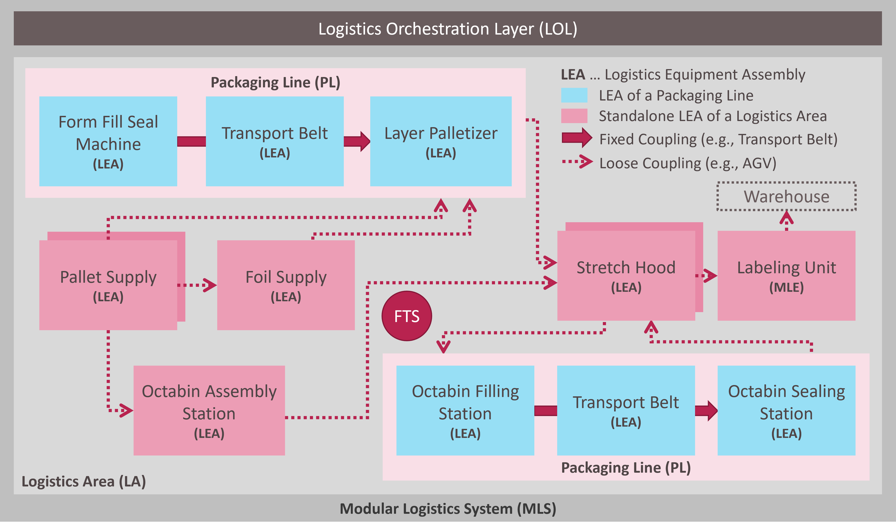

[< Previous](../README.md) | [Home](../README.md) | [Next >](../03_Logistics_Equipment_Assemblies/README.md)

## 2 Modular Logistics Systems
Figure 2.1 shows an exemplary Modular Logistic System (MLS), which is used for filling and palletizing bags and octabins. This has been investigated and the findings have been published in [6].

*Figure 2.1: Structure of a Modular Logistics System*

This system consists of Logistics Equipment Assemblies (LEAs) that can pack and process various Logistics Objects (LOs), such as bags and pallets. The LEAs can be integrated into fixed Logistics Lines (LLs) (see Figure 2.1, blue rectangles), in which the path an LO takes through the line is predefined. Necessary transports are executed e.g., by conveyor belts. In addition, LEAs and Logistics Lines can be arranged so-called Logistics Areas (LA) where they are loosely coupled with each other (see Figure 2.1, red rectangles). The path of an LO through a Logistics Area is only determined at runtime. Flexible transport systems, such as Automated Guided Vehicles (AGVs), are used in this case. A higher-level system, the Logistics Orchestration Layer (LOL), is provided for orchestrating the Modular Logistics System. The LOL takes over functions for order and parameter management, central control and monitoring or track & trace, although not all these functions are always necessary and/or available.

[< Previous](../README.md) | [Home](../README.md) | [Next >](../03_Logistics_Equipment_Assemblies/README.md)