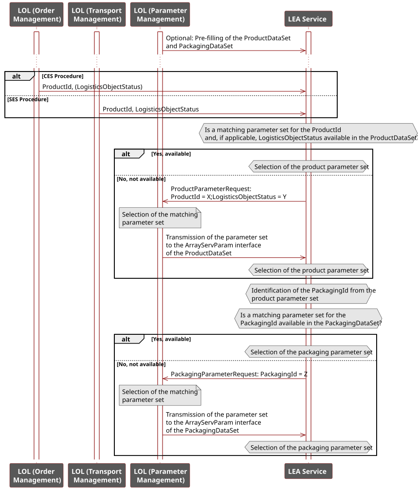
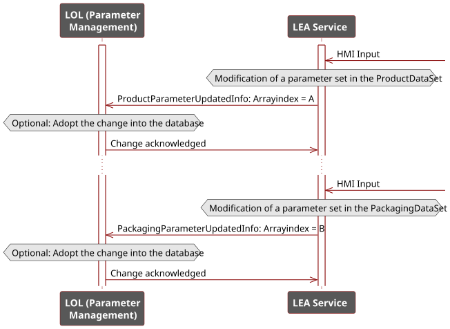

## 3.3 Parameterization

### 3.3.1 Parameter Types

Four types of LEA parameters are distinguished [[BFS+22]](../08_References/README.md#blumenstein-et-al-2022-atp), [[BGB+23]](../08_References/README.md#blumenstein-et-al-moprolog):

##### Table 3.1: Parameter Types of Logistics Equipment Assemblies

<table>
  <tr>
    <th align="left">Type</th>
    <th align="left">Description</th>
  </tr>
  <tr>
    <td align="left"><strong>Order-specific</strong></td>
    <td align="left">Derived from customer orders; include order number, target product, and quantity. Only present for CES procedures (order-oriented operation).</td>
  </tr>
  <tr>
    <td align="left"><strong>Product-specific</strong></td>
    <td align="left">Derived from the LO to be packaged and its customer- or country-specific variants (e.g., stretch parameters, packing patterns). Must be updated when the product changes.</td>
  </tr>
  <tr>
    <td align="left"><strong>Packaging-specific</strong></td>
    <td align="left">Derived from the packaging material used (e.g., pallet or film type). Must be updated when the packaging material changes.</td>
  </tr>
  <tr>
    <td align="left"><strong>Construction-specific</strong></td>
    <td align="left">Reflect the physical build of the LEA or fundamental settings (e.g., speed setpoints, loaded consumables). Change only when the LEA is reconfigured or restocked.</td>
  </tr>
</table>

### 3.3.2 Parameter Transfer Mechanisms

Three mechanisms for transferring parameters to a LEA service are identified:

##### Table 3.2: Parameter Transfer Mechanisms

<table>
  <tr>
    <th align="left" colspan="2">Individual parameters</th>
  </tr>
  <tr>
    <td align="left" colspan="2">Each LEA parameter is transferred as a single primitive value via a separate parameter interface to the LEA service.</td>
  </tr>
  <tr>
    <td align="left"><strong>Pros</strong></td>
    <td align="left">Metadata (e.g. min/max limits, unit) can be assigned per parameter. Only the currently used parameter values need to be stored, keeping memory requirements low.</td>
  </tr>
  <tr>
    <td align="left"><strong>Cons</strong></td>
    <td align="left">LEA parameterization can require many parameters, resulting in large service interfaces and high parameterization effort. Since parameters are transferred individually, consistency across all parameters must always be ensured. A failure of parameter management prevents automated parameterization.</td>
  </tr>
  <tr>
    <th align="left" colspan="2">Single parameter set</th>
  </tr>
  <tr>
    <td align="left" colspan="2">All LEA parameters are transferred as a structured parameter set via one interface (<em>StructServParam</em>) to the LEA service.</td>
  </tr>
  <tr>
    <td align="left"><strong>Pros</strong></td>
    <td align="left">This simplifies the service interface for large parameter sets and reduces parameterization effort. Consistent write and adoption of the complete parameter set is possible. Only the currently used values need to be stored, keeping memory requirements low.</td>
  </tr>
  <tr>
    <td align="left"><strong>Cons</strong></td>
    <td align="left">No per-parameter metadata can be assigned. A structure cannot mix read-only and read/write fields; writing to a structured element would also write to read-only variables, which is technically unsound. Additionally, the entire parameter set must always be transmitted rather than individual values, potentially causing high network load. A failure of parameter management prevents automated parameterization.</td>
  </tr>
  <tr>
    <th align="left" colspan="2">Selection of parameter sets</th>
  </tr>
  <tr>
    <td align="left" colspan="2">Multiple parameter sets for different products are transferred to the LEA and managed in LEA-internal storage. An ID selects the active parameter set for the current operation at runtime.</td>
  </tr>
  <tr>
    <td align="left"><strong>Pros</strong></td>
    <td align="left">Fast and simple selection of the active parameter set with very low communication effort is achieved. Consistency of parameter sets is always ensured. Storing parameter sets enables automated parameterization even during a failure of parameter management.</td>
  </tr>
  <tr>
    <td align="left"><strong>Cons</strong></td>
    <td align="left">Two interfaces are required — one for loading parameter sets into the LEA (<em>ArrayServParam</em>) and one for ID-based selection (<em>DIntServParam</em>); no means to model the relationship between them yet exists. Storing multiple parameter sets requires more LEA memory than the other two mechanisms.</td>
  </tr>
</table>

#### MTP implementation:

- **Individual parameters:** This mechanism corresponds to existing MTP parameterization. The *DIntServParam*, *AnaServParam*, *BinServParam*, and *StringServParam* interfaces from [[MTP Specification Part 4]](../08_References/README.md#mtp-specification-part-4) are directly applicable; no extension is required.
- **Single parameter set:** Existing MTP concepts do not provide parameter interfaces for structured data types. Therefore, the *StructServParam* interface ([Table 7.29](../07_MTP%20Extensions/07-04_ServiceSet.md#table-729-dataassembly-definition-of-suc-structservparam)) is newly specified to transfer a parameter set with a LEA-specific structured data type. A method for modeling the required complex data types in the MTP ([Section 7.3.2](../07_MTP%20Extensions/07-03_DataAssemblySet.md#732-dataassembly-definitions)) and in the OPC UA server of a LEA ([Section 7.6](../07_MTP%20Extensions/07-06_ServerAssemblySet.md#76-mtp-extension-of-the-serverassemblyset)) is also described.
- **Selection of parameter sets:** For the ID-based selection interface, the *DIntServParam* interface from [[MTP Specification Part 4]](../08_References/README.md#mtp-specification-part-4) is reused. For loading parameter sets into LEA-internal array storage, no suitable interface exists in the current MTP concept; the *ArrayServParam* interface ([Table 7.30](../07_MTP%20Extensions/07-04_ServiceSet.md#table-730-dataassembly-definition-of-suc-arrayservparam)) is therefore newly specified. Each array element uses the same LEA-specific structured data type as for single parameter set transfer.

### 3.3.3 Parameterization Initiation

Three modes to initiate parameterization are distinguished:

##### Table 3.3: Parameterization Initiation Modes for Logistics Equipment Assemblies

<table>
  <tr>
    <th align="left" colspan="2">LOL-initiated</th>
  </tr>
  <tr>
    <td align="left" colspan="2">The LOL holds the knowledge of when to transfer which parameters to the LEAs and initiates parameterization accordingly.</td>
  </tr>
  <tr>
    <td align="left"><strong>Pros</strong></td>
    <td align="left">The LOL manages all parameter values and transfers them directly to the LEAs, keeping the complexity of parameter transfer low on the LEA side, especially in order-driven execution.</td>
  </tr>
  <tr>
    <td align="left"><strong>Cons</strong></td>
    <td align="left">The LOL must continuously track the status of (demand-driven) LEAs to determine when parameterization is required. When transferring a selection of parameter sets, the LOL must also track which sets are already present in each LEA's local storage.</td>
  </tr>
  <tr>
    <th align="left" colspan="2">LEA-requested</th>
  </tr>
  <tr>
    <td align="left" colspan="2">The LEA itself can detect when it is missing parameters and requests them from the LOL.</td>
  </tr>
  <tr>
    <td align="left"><strong>Pros</strong></td>
    <td align="left">The LEA autonomously detects its own parameterization needs and which parameters are missing, keeping the complexity of signaling parameterization demands to the LOL low, especially in demand-driven execution.</td>
  </tr>
  <tr>
    <td align="left"><strong>Cons</strong></td>
    <td align="left">Although the LEA identifies its own parameterization needs, all parameter values are managed in the LOL's parameter management. Consequently, the LEA must first report its need to the LOL, which then transfers the required parameters.</td>
  </tr>
  <tr>
    <th align="left" colspan="2">Local HMI entry</th>
  </tr>
  <tr>
    <td align="left" colspan="2">Parameters are entered locally by an operator at the LEA HMI. It must be considered that parameter changes may need to be read back into the LOL.</td>
  </tr>
  <tr>
    <td align="left"><strong>Pros</strong></td>
    <td align="left">The operator holds the knowledge of the required parameters and transfers them directly to the LEA, keeping the complexity of parameter transfer low on the LEA , especially in order-driven operation.</td>
  </tr>
  <tr>
    <td align="left"><strong>Cons</strong></td>
    <td align="left">The operator must continuously track the status of (demand-driven) LEAs to determine when parameterization is required. When transferring a selection of parameter sets, the operator must also track which sets are already present in each LEA's local storage.</td>
  </tr>
</table>

#### MTP implementation:

- **LOL-initiated:** The LOL writes parameters to the LEA directly. This corresponds to existing MTP behavior [[MTP Specification Part 4]](../08_References/README.md#mtp-specification-part-4); no extension is required.
- **LEA-requested:** The LEA detects a missing parameter set and requests it from the LOL. For this *ProductParameterRequest* ([Table 7.36](../07_MTP%20Extensions/07-04_ServiceSet.md#table-736-model-definition-of-suc-productparameterrequest)) and *PackagingParameterRequest* ([Table 7.37](../07_MTP%20Extensions/07-04_ServiceSet.md#table-737-model-definition-of-suc-packagingparameterrequest)) are introduced in this work. Those follow similar mechanism to the MTP *Service Interaction* mechanism. 
- **Local HMI entry:** An operator enters parameters directly at the LEA HMI. To propagate local changes back to the LOL, *ProductParameterUpdatedInfo* ([Table 7.38](../07_MTP%20Extensions/07-04_ServiceSet.md#table-738-model-definition-of-suc-productparameterupdatedinfo)) and *PackagingParameterUpdatedInfo* ([Table 7.39](../07_MTP%20Extensions/07-04_ServiceSet.md#table-739-model-definition-of-suc-packagingparameterupdatedinfo)) models specified in this work, also based on the MTP *Service Interaction* mechanism [[MTP Specification Part 4]](../08_References/README.md#mtp-specification-part-4).

### 3.3.4 Recommended Parameterization Mechanism

The previously described mechanisms for parameter transfer and initiation of parameterization can be combined in any way. However, in the following an recommendation is given, of how to use these mechanisms for the different parameter types of LEA services.

For **order-specific** parameters, transfer as individual parameters via existing interfaces is recommended, as LEAs typically receive only a small number of such parameters. If a more comprehensive set is required, transfer as a single *StructServParam* set reduces parameterization effort. Due to their order-related nature, these parameters are modeled as procedure parameters per [[MTP Specification Part 4]](../08_References/README.md#mtp-specification-part-4). Parameterization is typically initiated by a LOL order management system; in small-scale MLSs it may alternatively be set by an operator via the LOL HMI.

**Product- and packaging-specific parameters** are managed by a LOL parameter management system, which maintains a structured database of all required parameters for the products and packaging materials in use. Since these parameter sets are typically large and numerous, parameter set selection from LEA-internal storage is recommended to minimize parameterization and communication effort. [Figure 3.6](#figure-36-recommended-parameterization-mechanism-for-product--and-packaging-specific-parameters) illustrates this mechanism.

##### Figure 3.6: Recommended Parameterization Mechanism for Product- and Packaging-Specific Parameters

**LEA-internal parameter store:** Two arrays are maintained in the LEA — a *ProductDataSet* for product-specific and a *PackagingDataSet* for packaging-specific parameter sets ([Figure 3.7](#figure-37-structure-of-the-lea-internal-parameter-store)). The elements of each array are from a LEA-specific structured data type. A *ProductDataSet* entry is keyed by *ProductId* and *LogisticsObjectStatus*; a *PackagingDataSet* entry is keyed by *PackagingId*. Product parameter sets contain a *PackagingId* reference that links to the required packaging parameter set.

##### Figure 3.7: Structure of the LEA-Internal Parameter Store

**Filling the arrays** can be done proactively by the LOL (recommended for fixed product portfolios) or on demand via LEA requests at runtime (recommended for frequently changing or large portfolios). In either case, consistency between product and packaging sets must be ensured: whenever a new product parameter set is transferred, the corresponding packaging parameter set must already be present or be transferred alongside it.

**Parameter set selection** differs by service execution mode (CES / SES): in **CES**, *ProductId* is provided as an order-specific procedure parameter (type *DIntServParam*); in **SES**, *ProductId* and *LogisticsObjectStatus* are transmitted with the transport order data when an LO arrives. In both modes, the *PackagingId* is then read from the selected product parameter set to retrieve the packaging parameter set.

**Local HMI changes** are reported to the LOL via *ProductParameterUpdatedInfo* / *PackagingParameterUpdatedInfo*, specifying the array index of the changed parameter set ([Figure 3.8](#figure-38-reporting-parameter-set-changes-to-the-lol)). The LOL acknowledges receipt and decides whether to adopt the change into its parameter management.

##### Figure 3.8: Reporting Parameter Set Changes to the LOL

To enable the LOL's parameter management to identify the purpose of each interface unambiguously, *FunctionClassificationAttributes* are introduced for parameters, which were previously only defined for services and procedures in [[MTP Specification Part 4]](../08_References/README.md#mtp-specification-part-4). Concrete attributes are specified for *ProductId*, *LogisticsObjectStatus*, *ProductDataSet*, *PackagingId*, and *PackagingDataSet* ([Section 7.4.1](../07_MTP%20Extensions/07-04_ServiceSet.md#741-overview)).

**Construction-specific parameters** concern the physical setup of a LEA (e.g. the installed filling nozzle type) or its current configuration (e.g. the loaded pallet type). They are independent of any particular order and of whether the LEA operates in CES or SES mode, instead defining fundamental settings for service execution. Since they are typically few in number and set at commissioning time by an operator, they are modeled as configuration parameters per [[MTP Specification Part 4]](../08_References/README.md#mtp-specification-part-4) and transferred as individual values via existing interfaces.

For LEA types that use a specific packaging material, a construction-specific *DIntServParam* parameter specifies which packaging material (e.g. pallet type) is currently loaded in the LEA. Based on this value, the corresponding packaging-specific information can be retrieved from the LEA-internal *PackagingDataSet* or requested from the LOL. This value is semantically equivalent to the *PackagingId* described above and must be verified against the *PackagingId* required by the selected product parameter set before processing a logistics object. A mismatch means the LEA cannot process the order or must be equipped with different packaging material. To allow unambiguous semantic identification of this parameter, a corresponding *FunctionClassificationAttribute* is introduced ([Section 7.4.1](../07_MTP%20Extensions/07-04_ServiceSet.md#741-overview)).
