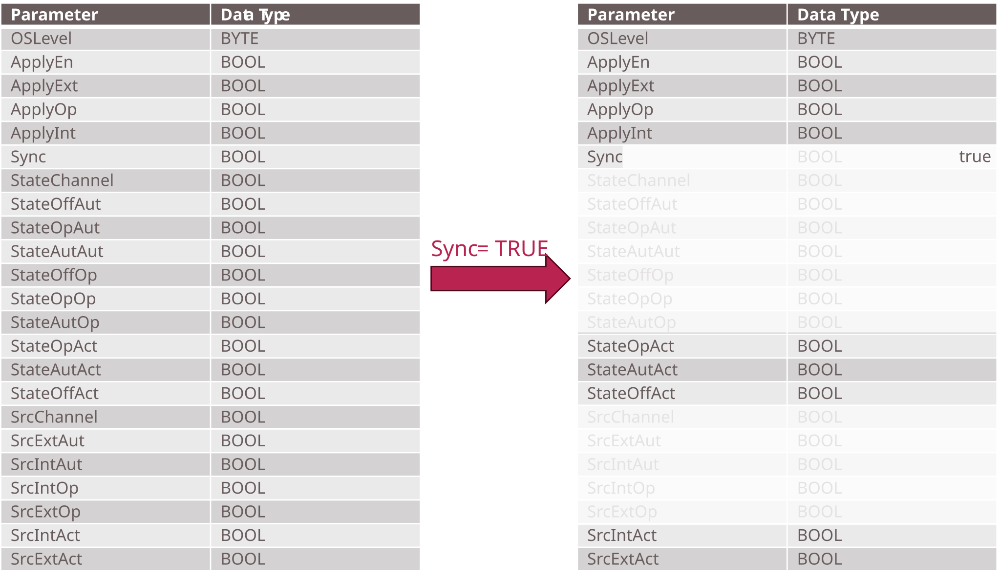

## 3.7 Complexity Reduction of Interfaces

The DataAssembly definitions of [[MTP Specification Part 3]](../08_References/README.md#mtp-specification-part-3) and [[MTP Specification Part 4]](../08_References/README.md#mtp-specification-part-4) are designed for a wide range of process-industry use cases — from laboratory to production scale. While this breadth is necessary for process engineering applications, many of these interface variables are irrelevant in production-related logistics, where operating conditions are more constrained. To reduce implementation effort without modifying the existing MTP interfaces, complexity can be reduced by specifying fixed default values for variables that are not needed in LEA automation.

[Figure 3.11](#figure-311-complexity-reduction-of-the-parameterelement-interface) illustrates this principle using the *ParameterElement* interface from [[MTP Specification Part 4]](../08_References/README.md#mtp-specification-part-4), which is part of every MTP parameter interface. In process engineering, parameters can be operated in a mode that differs from the mode of the superimposed service. In production-related logistics, however, parameters always share the operation mode of their service. Setting the variable `Sync` to `true` by default makes a large number of dependent variables irrelevant, reducing the active interface from 23 to 10 variables.

##### Figure 3.11: Complexity Reduction of the *ParameterElement* Interface

Variables that become irrelevant through this defaulting (shown greyed out in [Figure 3.11](#figure-311-complexity-reduction-of-the-parameterelement-interface)) no longer need to be provided in the OPC UA server of the LEA controller; they are instead set to constant values within the MTP itself. Beyond simplifying the LOL-LEA interface, this yields a significant saving in controller memory: even fixing a single Boolean variable saves more than 100 bytes, since each OPC UA node requires substantial metadata overhead.

This pattern of complexity reduction through default values is applicable to further DataAssembly definitions and may be extended as additional LEA types and their specific constraints are analyzed.
