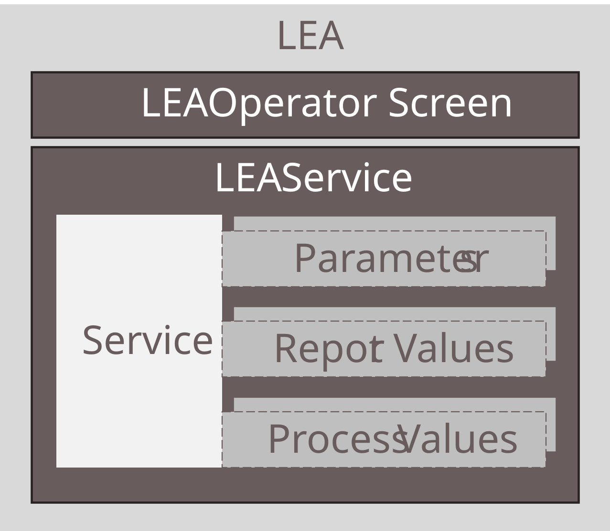

## 3 MTP-Based Automation of Logistics Equipment Assemblies

This chapter presents the MTP-based automation and integration of Logistics Equipment Assemblies (LEAs). Parts of these concepts were published in [[BFS+22]](../08_References/README.md#blumenstein-et-al-2022-atp) and [[BGB+23]](../08_References/README.md#blumenstein-et-al-moprolog); parametrization mechanisms were additionally investigated in student theses [[Jan23]](../08_References/README.md#janzen-2023) and in [[BJF+23]](../08_References/README.md#blumenstein-et-al-automationlol). 

 [Sections 3.9](03-09_Application_Example_PalletizingLEA.md#39-application-example-palletizing-lea) and [3.10](03-10_Application_Example_StretchHoodLEA.md#310-application-example-stretch-hood-lea) show the application of the described concepts to a palletizer LEA and a stretch-hood LEA. [Chapter 7](../07_MTP%20Extensions/07-00_Intro.md#7-enhancements-of-the-module-type-package-concept) provides detailed specifications of the introduced MTP extensions.

## 3.1 Artifact Overview

The MTP-based automation of LEAs comprises the same building blocks as the automation of PEAs in modular production processes. [Figure 3.1](#figure-31-components-of-lea-automation) gives an overview of these components.

##### Figure 3.1: Components of LEA Automation

The foundation is a **service-based automation** with exactly one MTP service per LEA ([Section 3.2](03-02_Service_Based_Automation.md#32-service-based-automation)). This service can be executed as an order-oriented *Cyclic Execution Service* (CES) or a demand-oriented *Single Execution Service* (SES), implementing the two LEA operating modes introduced in [Section 2.4](../02_Modular_Logistics_System/02_Modular_Logistics_System.md#24-operating-modes-of-leas-and-logistics-lines). **Parameterization** of these services ([Section 3.3](03-03_Parameterization.md#33-parameterization)) employs different mechanisms depending on parameter type. For order-specific and construction-specific parameters existing MTP mechanisms are reused; product- and packaging-specific parameters are managed via a newly introduced LEA-internal parameter store that enables the transfer of complete parameter sets. Further LEAs are able to request the parameter sets they need from a LOL. Beyond the existing MTP specification, this artifact introduces structured and array-based data types for **parameters** ([Section 3.3](03-03_Parameterization.md#33-parameterization)), **report values** ([Section 3.4](03-04_Report_Values.md#34-report-values)) and **process values** ([Section 3.5](03-05_Process_Values.md#35-process-values)). **LEA operator displays** ([Section 3.6](03-06_Operator_Displays.md#36-operator-displays)) support existing MTP HMI concepts, newly introduced custom symbols and variables with complex data types. Finally, **complexity reduction** ([Section 3.7](03-07_Complexity_Reduction.md#37-complexity-reduction-of-interfaces)) addresses how the breadth of standard MTP DataAssembly definitions can be reduced for the logistics domain by specifying fixed default values for variables that are irrelevant in LEA automation.

The following sections describe the technical implementation of these concepts.

- [Section 3.2 — Service-Based Automation](./03-02_Service_Based_Automation.md#32-service-based-automation): Service-based automation with one MTP service per LEA
- [Section 3.3 — Parameterization](./03-03_Parameterization.md#33-parameterization): Parameterization mechanisms for LEA services
- [Section 3.4 — Report Values](./03-04_Report_Values.md#34-report-values): Report values for LEA services
- [Section 3.5 — Process Values](./03-05_Process_Values.md#35-process-values): Process values for LEA services
- [Section 3.6 — Operator Displays](./03-06_Operator_Displays.md#36-operator-displays): LEA operator displays and HMI concepts
- [Section 3.7 — Complexity Reduction](./03-07_Complexity_Reduction.md#37-complexity-reduction-of-interfaces): Complexity reduction of MTP DataAssembly definitions for the logistics domain
- [Section 3.8 — MTP Extensions](./03-08_MTP_Extensions.md#38-mtp-extensions): Necessary extensions of the MTP concept for LEA automation
- [Section 3.9 — Application Example: Palletizing LEA](./03-09_Application_Example_PalletizingLEA.md#39-application-example-palletizing-lea): Application of the described concepts to a palletizer LEA
- [Section 3.10 — Application Example: Stretch Hood LEA](./03-10_Application_Example_StretchHoodLEA.md#310-application-example-stretch-hood-lea): Application of the described concepts to a stretch-hood LEA
