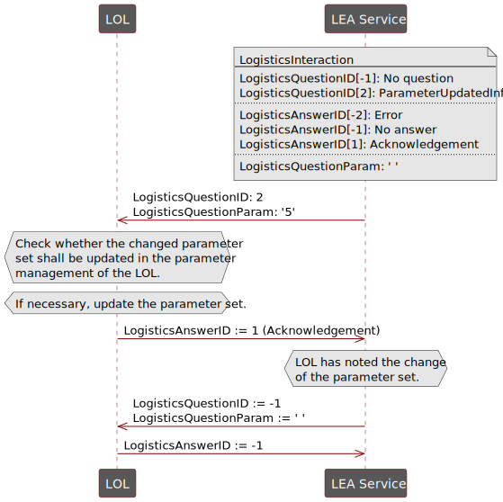
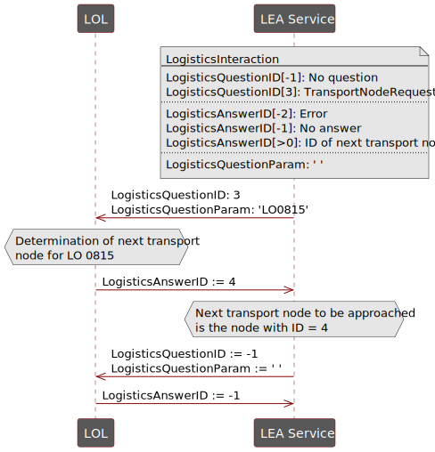

[< Previous](../02_Modular_Logistics_System/README.md) | [Home](../README.md) | [Next >](../04_Logistics_HMI/README.md)

## 3 Automation Services for Logistics Equipment Assemblies
### 3.1 State-based Automation
Since LEAs usually implement only one specific logistical function, such as filling, transporting, or palletizing, it is reasonable to equip each LEA with only one service in the sense of the MTP concept. According to [6], this can be operated in two execution types – the order-oriented Cyclic Execution Service (CES) and the demand-oriented Single Execution Service (SES).

For some LEA types, it is useful to offer their logistics functionality as both CES and SES operations [6]. Since CES and SES cannot be executed simultaneously, they are implemented as different procedures of the MTP service of a LEA. CES and SES procedures conform to the existing MTP concept. However, they are based on special interpretations of the MTP state machine, which are described in more detail in Sections 3.1.1 and 3.1.2 and are published in [7].

For the unique identification of CES and SES procedures, corresponding *FunctionClassificationAttributes* according to VDI/VDE/NAMUR 2658-4 [3] are added to each procedure of a logistics service. In Table 3.1 and Table 3.2, *FunctionClassificationAttributes* for CES and SES procedures are proposed to be discussed in future MTP standardization work. "10" in this case stands for version 1.0 in major-minor format and can be incremented accordingly when changes are made to the *FunctionClassificationAttributes*.

*Table 3.1: FunctionClassificationAttribute for a CES procedure*

*Table 3.2: FunctionClassificationAttribute for a SES procedure*

#### 3.1.1 Cyclic Execution Service
The Cyclic Execution Service (CES) is used to automate LEAs of a Logistics Line. It is designed to accept an order and then process all LOs belonging to this order identically. For example, in the case of the order "pack 500 bags on 10 pallets", the service of a Form Fill Seal machine (see Figure 2.1) would cyclically fill 500 bags in one service run. A characteristic feature of CES operation is that the service is parameterized once at the start of a service run according to the order data and then cyclically processes a specific or unspecified number of identical LOs. The necessary interpretation of the MTP state machine for a normal service run (without exception handling) is depicted in Figure 3.1.

*Figure 3.1: Operation of a Cyclic Execution Service*

Like every MTP service, a logistics service in CES mode initially is in IDLE state. Since a CES procedure works in an order-oriented manner, all order data required for execution must be transferred to it before it can be started. For this purpose, a corresponding parameterization must be carried out according to Section 3.2. After starting the procedure in the STARTING state, LOs are processed cyclically with the same previously set order data in the EXECUTE state. CES procedures can be self-completing or continuous. Accordingly, the processing can be terminated by a Complete command or after a defined number of processed LOs. The LO currently being processed may be finished in COMPLETING state and afterwards the completion is signalled with COMPLETED state. Finally, a Reset command sets the procedure back to IDLE state. 

The orange-marked states in Figure 3.1 represent the state of the LEA and not the state of the LO processing, in contrast to MTP applications in the process industry. The unmarked states, in particular the pause, hold, stop and abort loops, follow the semantics described in VDI/VDE/NAMUR 2658-4 [3].

#### 3.1.2 Single Execution Service
The Single Execution Service (SES) is used to automate stand-alone LEAs in a Logistics Area. It is designed to process individual LOs on demand according to their individual order data. For example, the stretch hood machine shown in Figure 2.1 must be able to stretch both pallets with bags and pallets with an octa-bin with different parameters. For this purpose, a SES is parameterized individually for each LO. In this way, LOs from different orders can be processed according to their different order data. The number and se-quence of LOs that are processed within a service run is undefined when the service is started and is de-termined on demand at runtime. The necessary operation of an SES is illustrated in Figure 3.2.

*Figure 3.2: Operation of a Single Execution Service*

At the beginning, a logistics service in SES mode is in the initial state IDLE. In this state, all parameters that are independent of the type of LO to be processed can be passed to the service using the parameterization mechanisms described in Section 3.2. Subsequently, the SES procedure is started independently of any order and changes through the STARTING, EXECUTE and PAUSING states to PAUSED state. Now the SES waits for an external trigger that indicates the demand to process a LO. Such a trigger could be, for example, an incoming AGV that intends to pick up a LO or to transfer it to the LEA. If such a trigger occurs, the service state changes to RESUMING and the SES is parameterized for the individual processing of the respective LO. In the following EXECUTE state, the processing of the LO is executed as required. After processing has been completed, the SES switches back to PAUSED state via PAUSING state and waits for the next trigger. If no further LOs need to be processed, the SES can be terminated by means of a Complete command. If necessary, the LO currently being processed is completed in the COMPLETING state. SES procedures are always executed continuously, since at the beginning of a service run it is not known how many LOs must be processed in which order.

The states marked in orange in Figure 3.2 reflect the state of the LEA, like in the CES case. The states marked in green, on the other hand, reflect the current processing state of an LO. The unmarked states, in particular the hold, stop and abort loops, follow the semantics described in VDI/VDE/NAMUR 2658-4 [3].

### 3.2 Parameters
This section specifies all relevant topics regarding parameterization of logistic services. Therefore, logistic-specific parameter types and the applicable parameterization mechanism are introduced as well as defined parameter requests in the context of production-related logistics. Parts of this concept are also published in [7].

#### 3.2.1 Parameter Types
To adapt logistics functions to order-, product- and machine-specific conditions, appropriate parameterization is required. Accordingly, three types of parameters can be differentiated.

**Order-specific parameters** are used to transfer order data to a service. They result from customer orders and therefore change with each order. Essentially, they specify the organizational data of an order (e.g., the order number), the product to be packed and its quantity (e.g., the number of bags or pallets). 

**Product-specific parameters** result from the LO to be packaged including its customer- and country-specific characteristics (hereinafter referred to as “product”). These parameters must be adapted if a different product needs to be packed. Examples are stretch parameters or packing patterns. 

**Construction-specific** parameters are dependent on the physical structure of the LEA. They change when the LEA is physically modified or equipped. Essentially, they specify which functional equipment assemblies (FEAs) are assigned to the LEA (e.g., which filling nozzle is connected) or which supplies (e.g., pallet type) the LEA is equipped with.

#### 3.2.2	Parameter Transfer
Parameters in modular plants can be transferred to the modules (here: LEAs) by different parameterization mechanisms. In particular, the following mechanisms can be distinguished.

##### Mechanisms 1 - Transfer of Individual Variables
This mechanism is based on transferring all parameters to the service via separate parameter interfaces. 
- **Advantages:** Metainformation (e.g., minimum/maximum value or unit) can be provided for each parameter. 
- **Disadvantages:** A large number of parameters may be required for parameterizing a LEA, making the service interface extensive and the parameterization time-consuming. In addition, each parameter is transferred individually to the LEA service. Thus, it must always be ensured that a consistent, valid data set is available at the service across all parameters. 
- **MTP implementation:** This mechanism corresponds to the parameterization envisaged in the previous MTP concepts. Thus, corresponding parameter interfaces are already available in VDI/VDE/NAMUR 2658-4 [3].

##### Mechanisms 2 - Transfer of Parameter Sets
This mechanism envisages that parameters are not transferred to the service as individual variables but as a parameter set with an LEA-specific structured data type. 

- ***Advantages:** Especially for LEAs with large parameter sets, the service interface is simplified, and the effort required for parameterization is reduced. In addition, consistent writing and applying of the complete parameter set is possible. 
- **Disadvantages:** No meta information can be given to the individual parameters of the parameter set. This would require read and write access to individual variables in the parameter set, which is not possible in complex data types according to VDI/VDE/NAMUR 2658-1 [8]. In addition, the en-tire parameter set must always be transferred for parameterization, which can lead to a high network load.
- **MTP implementation:** So far, no parameter interfaces for structured data types are provided in the MTP concept. However, VDI/VDE/NAMUR 2658-1 [8] describes the possibility of modelling complex data types. Based on this, a *StructServParam* interface is presented in Section 10.8.1.

##### Mechanisms 3 - Selection of Parameter Sets
This mechanism combines the use of structured data types with the possibility of parameterization via a single variable. Parameter sets for different products are stored in the LEA in the form of an array. These parameter sets can be downloaded into the LEA at any time. An ID can then be used to select which parameter set should be applied for the current packaging process. This principle has already been implemented in many logistics systems (proprietarily). 
- **Advantages:** A quick and easy selection of the parameter set to be used is possible. In addition, the consistency of the parameter sets is always ensured. 
- **Disadvantages:** Two interfaces are necessary for this – one for loading the parameter sets into the LEA and one for the ID-based selection of one parameter set. Currently, there is no way to model the relationship between these two interfaces.
- **MTP implementation:** For the MTP-based implementation of the interface for ID selection, the *DIntServParam* interface specified in VDI/VDE/NAMUR 2658-4 [3] can be used. For loading the parameter sets, a configuration parameter is required to access an array located in the LEA. A corresponding interface is currently not provided in the MTP concept and is therefore specified in Section 10.8.1 as *ArrayServParam*. The individual parameter sets of the array can have a basic MTP data type (BOOL, DINT, REAL, STRING) or a LEA-specific structured data type, as described in mechanism 2.

Based on the parameterization mechanisms described above as well as their advantages and disadvantages, the following parameterization concept is recommended in the context of production-related logistics.

For the transmission of **order-specific** and **construction-specific** parameters, the parameterization method currently intended in the MTP concept is suitable. It uses a parameterization by individual variables, which is initiated from the LOL or carried out by an operator directly on the local panel of the LEA. In the case of more complex order interfaces, the transfer of a parameter set in the form of a structured data type (via *StructServParam*) can also be useful in order to reduce the parameterization effort. Due to their order-specific character, order-specific parameters are always to be implemented as procedure parameters according to VDI/VDE/NAMUR 2658-4 [3]. Construction-specific parameters are set at the time of commissioning of a LEA and must therefore be implemented by means of configuration parameters according to VDI/VDE/NAMUR 2658-4 [3].

For the transmission of **product-specific parameters**, the mechanism "selection of parameter sets" is recommended, since it enables parameterization with minimal communication effort and is also used in a similar way in today's logistics systems. Parameter sets for several products are stored in a LEA-internal data management, e.g., an LEA-internal data block.  This data management can be loaded before the start of an order by the LOL via the *ArrayServParam* interface (initiative from the LOL), or the LEA can request the data sets from the LOL (initiative from the LEA). Thereupon, the LOL transfers the data sets to the LEA via the *ArrayServParam* interface. Which variant is the more meaningful, depends on the specific use case. Since the loading of the array takes place independently of a concrete packaging order, the array interfaces shall be implemented as configuration parameters in the sense of VDI/VDE/NAMUR 2658-4 [3]. 

Using a unique product ID, the LEA can select and apply a corresponding data set for an order. In the case of a CES, the product ID is entered by means of a procedure parameter of type DINT as defined in VDI/VDE/NAMUR 2658-4 [3]. In the case of an SES, the product ID is transmitted to the LEA as part of the transport order data and does not require a separate parameter interface at the service of a LEA (see also Section 7). 

Where applicable, packaging-specific parameters that are part of the product-specific parameters can be stored in a separate array and selected by a Packaging ID accordingly.

To implement this mechanism, a LOL must know which *ArrayServParam* interfaces are used to manage the product and packaging data sets, and which *DIntServParam* interfaces are intended to enter product and packaging IDs. For this purpose, semantic information at service parameter level are required. According to VDI/VDE/NAMUR 2658-4 [3], such information is currently only available at service and procedure level in the form of *FunctionClassificationAttributes*. Table 3.3 to Table 3.6 suggest the necessary *FunctionClassificationAttributes* as a basis for discussions in MTP standardization work. "10" in this case stands for version 1.0 in major-minor format and can be incremented accordingly when changes are made to the *FunctionClassificationAttributes*.

*Table 3.3: FunctionClassificationAttribute for Product ID*

*Table 3.4: FunctionClassificationAttribute for a Product Data Set*

*Table 3.5: FunctionClassificationAttribute for Packaging ID*

*Table 3.6: FunctionClassificationAttribute for a Packaging Data Set*

### 3.2.3 Initiation of Parameterization

In addition to the mechanisms for transferring parameters, the parameterization of LEAs can be distinguished by whether it is initiated by the LOL or by the LEA.

**Parameterization by the LOL** is equivalent to the variant currently provided in the MTP environment. Here, the LOL knows when which parameters are to be transferred to the LEAs and initiates the parameterization accordingly.

Since in logistics systems there is sometimes no continuous control from the LOL, but the LEAs operate largely autonomously, a **request for parameters by the LEA** is also useful in some cases. Such a variant is not yet foreseen in the MTP specification, but can be implemented similar to the service interaction mechanism described in VDI/VDE/NAMUR 2658-4 [3].

It became apparent that in the context of parameterization context, three defined requests from the LEAs to a LOL are useful:
- Request of parameter sets (**ParameterRequest**): If a LEA shall process a LO with a ProductID that is not available in the LEA-internal database, the LEA can request the corresponding data set from the LOL by means of a *ParameterRequest*.
- Information about a parameter update (**ParameterUpdatedInfo**): The LEA-internal data management of product-specific parameter sets may be changed not only by the parameter management of the LOL, but also at the local panel of the LEA. In this case, the LEA informs the LOL via a *ParameterUpdatedInfo* interaction that parameter values have changed.
- Request for the next transport node to be approached (**TransportNodeRequest**): In the course of coordinating flexible transports in a Logistics Area (see also Section 7), it may be necessary to request the next transport node to be approached from the LOL. This request is referred to as a *TransportNodeRequest*.

#### ParameterRequest

To query a parameter set by a LEA, the mechanism shown in Figure 3.3 is used.

*Figure 3.3: Sequence of the logistics interaction of a ParameterRequest*

The LEA sends a *ParameterRequest* to the LOL by means of a corresponding *LogisticsQuestionID* (here: *LogisticsQuestionID* = 1) and transmits the ID of the LO currently being processed as *LogisticsQuestionParam*. The LOL then determines the necessary parameters for the desired LO and parameterizes the LEA service accordingly via its *ArrayServParm* interface. If the parameterization is successful, the LOL returns a *LogisticsAnswerID* >= 0 (here: *LogisticsAnswerID* = 3) to the LEA, which reflects the index in the LEA-internal data management, to which the new parameter set has been written. A faulty parameterization is signalled with *LogisticsAnswerID* = -2. Subsequently, the *LogisticsQuestionID* and the *LogisticsAnswerID* are set to -1, which signals that there is currently no question or answer. In contrast to the existing concept of the *Questions*, the *ParameterRequest* does not have any answers defined in the MTP, but values of the number space >=0 that can be represented with DINT (maximum in the size of the LEA-internal array) as well as the values -1 and -2 can be returned as *LogisticsAnswerIDs*.

#### ParameterUpdatedInfo 

To inform the parameter management of the LOL about the change of parameter values in the LEA, the mechanism shown in Figure 3.4 is used.

*Figure 3.4: Sequence of the logistics interaction of a ParameterUpdatedInfo*

The LEA sends a *ParameterUpdatedInfo* to the LOL by means of a corresponding *LogisticsQuestionID* (here: *LogisticsQuestionnID* = 2) and transmits the array index (here: array index = 5) of the changed parameter values as *LogisticsQuestionParam* to the LOL. The LOL's parameter management then determines whether the corresponding parameter data set should also be adjusted in the LOL (if necessary, by user query) and updates the parameter set as required. The LOL then acknowledges the parameter change by sending *LogisticsAnswerID* = 1 to the LEA. If an error has occurred, this is signalled by *LogisticsAnswerID* = -2. Subsequently, *LogisticsQuestionID* and *LogisticsAnswerID* are set to -1, which signals that there is currently no question or answer. In contrast to the existing concept of *Questions*, the *ParameterUpdatedInfo* does not have any answers defined in the MTP, but the defined values -2, -1 and 1 can be returned.

#### TransportNodeRequest

To query the next transport node to be approached in the Logistics Area, the sequence shown in Figure 3.5 is used.

*Figure 3.5: Sequence of the logistics interaction of a TransportNodeRequest*

The LEA reports an information demand for the next transport node to be approached to the LOL by means of a corresponding *LogisticsQuestionID* (here: *LogisticsQuestionID* = 3) and transmits the ID of the LO currently being processed as *LogisticsQuestionParam*. In order not to require a separate parameter for setting the next node, the *LogisticsAnswerID* is directly interpreted as the ID of the next node to be approached. In Figure 3.5, the response of *LogisticsAnswerID* = 4 thus means that the transport node with ID = 4 should be approached next. If an error has occurred, this is signalled by *LogisticsAnswerID* = -2. Subsequently, the *LogisticsQuestionID* and the *LogisticsAnswerID* are set to -1, which signals that there is currently no question or answer. In contrast to the existing concept of *Questions*, the *TransportNodeRequest* has no answers defined in the MTP, but values of the number space >0 that can be represented with DINT (and correspond to a transport node ID in the logistics system) as well as the values -1 and -2 can be returned as *LogisticsAnswerIDs*.

For all three logistics-specific interactions – *ParameterRequest*, *ParameterUpdatedInfo* and *TransportNodeRequest* – the necessary *Questions* and possible *Answers* can be predefined. They do not differ for different LEAs. Thus, in contrast to the existing service interaction specified in VDI/VDE/NAMUR 2658-4 [3], the structure of the logistics interactions can be standardized and does not have to be modelled in the MTPs of the individual LEAs. This results in new model and interface definitions that enable those interactions. These are specified in detail in Sections 10.7 and 10.8.

### 3.3 Report Values and Process Information
According to current knowledge, the already specified mechanism for report values is also suitable for the use in the area of production-related logistics. Similar to the parameter interfaces, the possibility of processing structures and arrays should also be foreseen in the context of report values. Accordingly, Sections 10.8.9 and 10.8.10 specify corresponding interface definitions.

### 3.4 Process Values
According to current knowledge, the already specified mechanism for process values is also suitable for the use in the area of production-related logistics. Similar to the parameter interfaces, the possibility of processing structures and arrays should also be foreseen in the context of process values. Accordingly, Sections 10.8.11 and 10.8.12 specify corresponding interface definitions.

[< Previous](../02_Modular_Logistics_System/README.md) | [Home](../README.md) | [Next >](../04_Logistics_HMI/README.md)