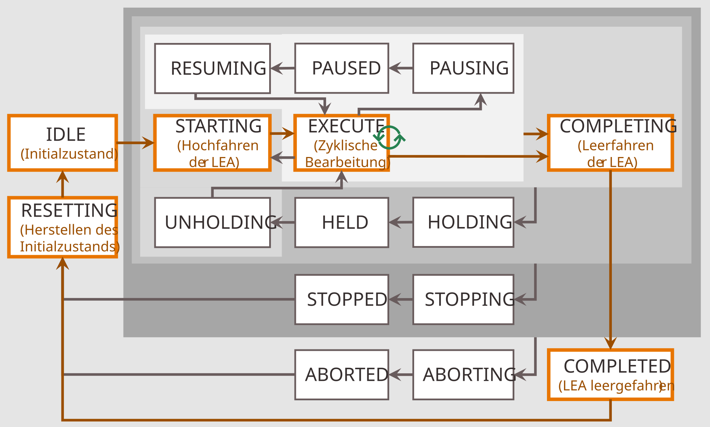
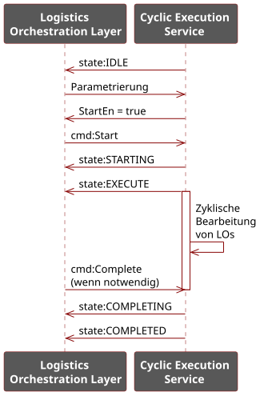
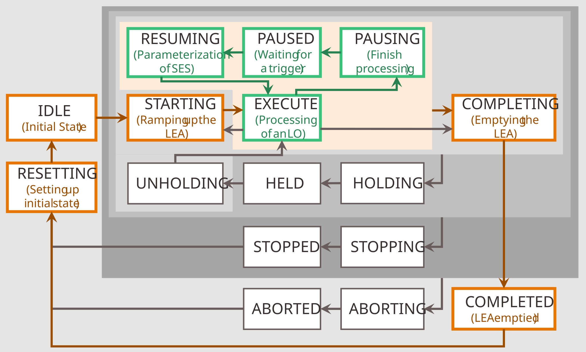
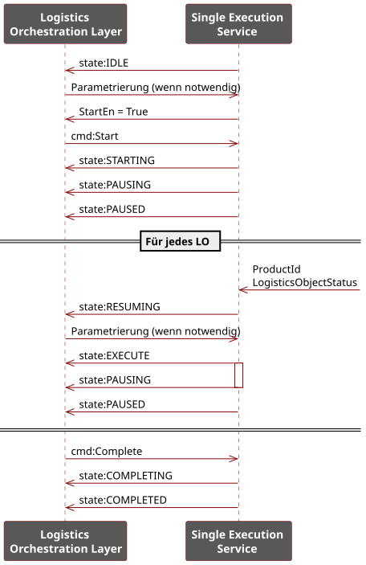

## 3.2 Service-Based Automation

Each LEA exposes exactly one (main) MTP service. Unlike PEAs, which may offer several functionally distinct services, a LEA has a predefined physical structure whose axes can only be varied in speed and sequencing through parameterization. A fundamentally different motion pattern is not achievable; hence each LEA provides one main function that is adapted primarily via parameterization [[BFG+21]](../98_References/README.md#blumenstein-et-al-design-principles).

To accommodate both order-oriented and demand-oriented operation ([Section 2.4](../02_Modular_Logistics_System_NEW/02_Modular_Logistics_System.md#24-operating-modes-of-leas-and-logistics-lines)), two service execution modes are defined:

- **Cyclic Execution Service (CES)** — for order-oriented operation
- **Single Execution Service (SES)** — for demand-oriented operation

As a LEA service can either run in CES mode or in SES mode, those execution modes are implemented as separate procedures of the LEA service. A LEA may offer both CES and SES procedures, enabling usage in different MLS contexts, though never both simultaneously. CES and SES procedures are conformant with [[MTP Part 4]](../98_References/README.md#mtp-specification-part-4) but carry specific interpretations of the MTP state machine. To allow a LOL to distinguish CES from SES procedures, *FunctionClassificationAttributes* per [[MTP Part 4]](../98_References/README.md#mtp-specification-part-4) are specified for both service execution modes ([Section 7.4.1](../07_MTP%20Extensions/07-04_ServiceSet.md#741-overview)).

#### Cyclic Execution Service (CES)

The CES is designed to accept a single packaging order and then process all LOs of that order in a uniform manner. Characteristic of a service in CES mode is that it is parameterized once at the start of its execution according to the order data and then cyclically processes a defined or indefinite number of identical LOs. This enables fast throughput and minimal communication overhead with the LOL.

[Figure 3.2](#figure-32-mtp-state-machine-interpretation-for-a-ces-procedure) shows the interpretation of the MTP state machine main loop for a procedure in CES mode. The state of a CES procedure represents the state of the LEA, not the processing state of an individual LO ([Figure 3.2](#figure-32-mtp-state-machine-interpretation-for-a-ces-procedure), orange boxes). LO processing takes place within the EXECUTE state ([Figure 3.2](#figure-32-mtp-state-machine-interpretation-for-a-ces-procedure), green arrows). [Figure 3.3](#figure-33-interaction-of-a-ces-service-with-the-lol) illustrates the interaction with the LOL during a service run.

##### Figure 3.2: MTP State Machine Interpretation for a CES Procedure

##### Figure 3.3: Interaction of a CES Service with the LOL

Like any MTP service, a LEA service in CES mode begins its execution in the IDLE state. In this state, all order data required for execution are transferred to the service by an order management system in the LOL or by an operator. No re-parameterization is foreseen during subsequent execution under normal operating conditions. The order data are assigned via parameterization as described in [Section 3.3](03-03_Parameterization.md#33-parameterization). After the CES procedure has signaled start-readiness (*StartEn = true*), a *Start* command can be issued and the LEA ramps up through STARTING. In the subsequent EXECUTE state, LOs are processed cyclically based on the previously configured order data, so that all LOs of the order are handled in the same way. Depending on whether a continuous or self-completing CES procedure is used, processing is ended by a *Complete* command or upon a defined condition (e.g., a specified number of processed LOs). In COMPLETING, any LOs still in processing are finished and the LEA is emptied. The COMPLETED state signals that processing has fully concluded. A *Reset* command returns the procedure to IDLE, where it can accept a new order. The pause, hold, stop, and abort loops can be traversed according to the conventions described in [[MTP Part 4]](../98_References/README.md#mtp-specification-part-4).

#### Single Execution Service (SES)

The SES is designed to process LOs in different ways according to their individual order data. Characteristic of a service in SES mode is that its parameterization is specifically adapted for each LO to be processed. This enables flexible handling of LOs that belong to different orders and/or have different processing states.

[Figure 3.4](#figure-34-mtp-state-machine-interpretation-for-an-ses-procedure) shows the interpretation of the main loop and pause loop of the MTP state machine for a procedure in SES mode. The orange-marked states represent the current state of the LEA, analogous to CES procedures. The green-marked states, by contrast, represent the processing state of an LO that may currently be present in the LEA. [Figure 3.5](#figure-35-interaction-of-an-ses-service-with-the-lol) shows the LOL interaction during a service run.

##### Figure 3.4: MTP State Machine Interpretation for an SES Procedure

##### Figure 3.5: Interaction of an SES Service with the LOL

A LEA service in SES mode also begins its execution in the IDLE state. In this state, a subset of the necessary parameters can be transferred to the service using the parameterization mechanisms described in [Section 3.3](03-03_Parameterization.md#33-parameterization). At this point, however, it is not yet known which LOs will arrive at the SES or in which order. Therefore, only parameters that are independent of the type and processing state of the LO to be handled can be transferred at this stage, e.g., configuration parameters relating to the structural setup of the LEA. In addition, parameter sets for various LO types and processing states can already be passed to the SES procedure, to be selected later when a corresponding LO arrives.

After the SES procedure has signaled start-readiness (*StartEn = true*), a *Start* command can be issued and the LEA ramps up through STARTING without a concrete order. Subsequently, the SES procedure transitions via EXECUTE and PAUSING into the PAUSED state. This state signals that the SES is active and awaiting an external trigger indicating that an LO is to be processed, e.g., the arrival of an AGV tasked with handing over an LO to the LEA in question. Upon detection of such a trigger, the LEA service transitions to RESUMING, where the type (*ProductId*) and processing state (*LogisticsObjectStatus*) of the LO to be handled are identified. The SES procedure is then parameterized according to the individual order data of that LO. In the subsequent EXECUTE state, the processing of the individual LO is carried out in a demand-oriented manner. After processing is complete, the SES transitions back via PAUSING into PAUSED and waits for the next trigger.

SES procedures always run continuously, since the number and order of incoming LOs are unknown at startup. When no further LOs are to be processed, the SES procedure is terminated via a *Complete* command. If an LO is still present in the LEA at that point, its processing is completed in COMPLETING and the LEA is emptied. The COMPLETED state signals that processing has fully concluded. A *Reset* command returns the procedure to IDLE, from where the LEA can be started again when demand arises. The hold, stop, and abort loops can be traversed according to the conventions described in [[MTP Part 4]](../98_References/README.md#mtp-specification-part-4).
