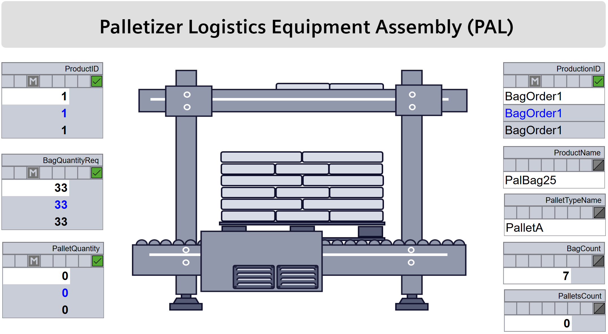
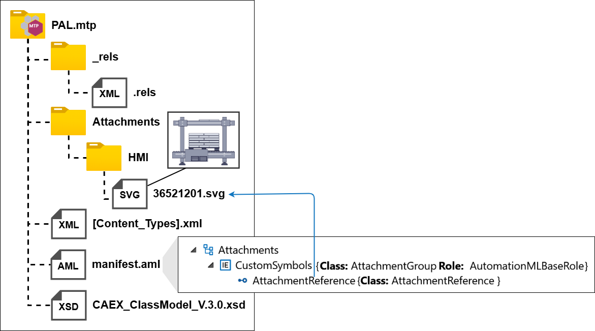

### 3.6 Operator Displays

The LOL provides an operator display for monitoring and manually controlling LEAs, into which the displays of individual LEAs are automatically integrated following the concepts of [[MTP Part 2]](../98_References/README.md#mtp-specification-part-2). While [[MTP Part 2]](../98_References/README.md#mtp-specification-part-2) targets P&ID-style displays, machine-oriented displays are customary in production-related logistics. These displays contain a static representation of the LEA and multiple dynamic display objects for the LEA service, parameters, report values, process values, and further LEA-internal values. [Figure 3.9](#figure-39-operator-display-of-a-palletizer-lea) shows an example display for a palletizer LEA.

##### Figure 3.9: Operator Display of a Palletizer LEA

#### Dynamic Display Objects

Dynamic display objects can fundamentally be implemented using the mechanisms of [[MTP Part 2]](../98_References/README.md#mtp-specification-part-2). For displaying and manipulating LEA-internal variables, the interface definitions from [[MTP Part 3]](../98_References/README.md#mtp-specification-part-3) and [[MTP Part 4]](../98_References/README.md#mtp-specification-part-4) are used. In addition, interface definitions for variables with structured and array-based data types are introduced, following the same principles as the interfaces already defined in the MTP specification for primitive data types. [Table 3.4](#table-34-new-interface-definitions-for-dynamic-display-objects) summarizes these newly introduced interfaces:

##### Table 3.4: New Interface Definitions for Dynamic Display Objects

<table>
  <tr>
    <th align="left">Interface</th>
    <th align="left">Purpose</th>
    <th align="left">Specification Reference</th>
  </tr>
  <tr>
    <td align="left"><em>StructView</em></td>
    <td align="left">Display of (report) values and process value outputs with structured data types</td>
    <td align="left"><a href="../07_MTP%20Extensions/07-03_DataAssemblySet.md#table-78-dataassembly-definition-of-suc-structview">Table 7.8</a></td>
  </tr>
  <tr>
    <td align="left"><em>ArrayView</em></td>
    <td align="left">Display of (report) values with array data types</td>
    <td align="left"><a href="../07_MTP%20Extensions/07-03_DataAssemblySet.md#table-79-dataassembly-definition-of-suc-arrayview">Table 7.9</a></td>
  </tr>
  <tr>
    <td align="left"><em>StructMan</em></td>
    <td align="left">Operator manipulation of structured-type values</td>
    <td align="left"><a href="../07_MTP%20Extensions/07-03_DataAssemblySet.md#table-710-dataassembly-definition-of-suc-structman">Table 7.10</a></td>
  </tr>
  <tr>
    <td align="left"><em>StructManInt</em></td>
    <td align="left">Operator or LEA-internal manipulation of structured-type values</td>
    <td align="left"><a href="../07_MTP%20Extensions/07-03_DataAssemblySet.md#table-711-dataassembly-definition-of-suc-structmanint">Table 7.11</a></td>
  </tr>
  <tr>
    <td align="left"><em>ArrayMan</em></td>
    <td align="left">Operator manipulation of array-type values</td>
    <td align="left"><a href="../07_MTP%20Extensions/07-03_DataAssemblySet.md#table-712-dataassembly-definition-of-suc-arrayman">Table 7.12</a></td>
  </tr>
  <tr>
    <td align="left"><em>ArrayManInt</em></td>
    <td align="left">Operator or LEA-internal manipulation of array-type values</td>
    <td align="left"><a href="../07_MTP%20Extensions/07-03_DataAssemblySet.md#table-713-dataassembly-definition-of-suc-arraymanint">Table 7.13</a></td>
  </tr>
  <tr>
    <td align="left"><em>StructServParam</em></td>
    <td align="left">Display and manipulation of service parameters with structured data types</td>
    <td align="left"><a href="../07_MTP%20Extensions/07-04_ServiceSet.md#table-725-dataassembly-definition-of-suc-structservparam">Table 7.25</a></td>
  </tr>
  <tr>
    <td align="left"><em>ArrayServParam</em></td>
    <td align="left">Display and manipulation of service parameters with array data types</td>
    <td align="left"><a href="../07_MTP%20Extensions/07-04_ServiceSet.md#table-726-dataassembly-definition-of-suc-arrayservparam">Table 7.26</a></td>
  </tr>
  <tr>
    <td align="left"><em>StructProcessValueIn</em></td>
    <td align="left">Display of process value inputs with structured data types</td>
    <td align="left"><a href="../07_MTP%20Extensions/07-05_ProcessValueSet.md#table-739-dataassembly-definition-of-suc-structprocessvaluein">Table 7.39</a></td>
  </tr>
  <tr>
    <td align="left"><em>ArrayProcessValueIn</em></td>
    <td align="left">Display of process value inputs with array data types</td>
    <td align="left"><a href="../07_MTP%20Extensions/07-05_ProcessValueSet.md#table-740-dataassembly-definition-of-suc-arrayprocessvaluein">Table 7.40</a></td>
  </tr>
  <tr>
    <td align="left"><em>ArrayProcessValueOut</em></td>
    <td align="left">Display of process value outputs with array data types</td>
    <td align="left"><a href="../07_MTP%20Extensions/07-05_ProcessValueSet.md#table-742-dataassembly-definition-of-suc-arrayprocessvalueout">Table 7.42</a></td>
  </tr>
</table>

Monitor (*\*Mon*) interfaces are not specified for structured or array types, as threshold monitoring is not meaningful for multi-value containers.

The subsequent artifacts on the automation of Logistics Lines ([Chapter 4](../04_Logistics_Line_NEW/04_Logistics_Line.md#4-choreography-based-automation-and-mtp-based-integration-of-logistics-lines)) and on the automation of flexible transports in Logistics Areas ([Chapter 5](../05_Logistics_Area_NEW/05_Logistics_Area.md#5-mtp-based-automation-of-flexible-transport-in-logistics-areas)) introduce further interfaces for which dynamic display objects in LEA operator displays may likewise be provided.

#### Static Display Objects

Static display objects representing the physical appearance of a LEA are modeled as *VisualObjects* with an ECLASS reference per [[MTP Part 2]](../98_References/README.md#mtp-specification-part-2). The graphic should resemble the real machine as closely as possible to create a recognizable visual relationship between the operator display and the physical equipment. Since a LOL cannot maintain graphics for every possible LEA type, the **CustomSymbols** mechanism is introduced: LEA-specific SVG images are attached to the MTP as file attachments per [[MTP Part 1]](../98_References/README.md#mtp-specification-part-1), organized in a dedicated *AttachmentGroup* named `CustomSymbols`, with an `HMI` subfolder recommended for clarity.

##### Figure 3.10: LEA Image as a CustomSymbol in a Palletizer MTP

From a modeling perspective, CustomSymbols are treated identically to graphics from the LOL's own library. Each SVG file name is set to the 8-digit numeric ECLASS reference string. The same reference is used in the *VisualObject* definition and for referencing via *AttachmentReference*. This enables the LOL to unambiguously match the graphic to the visual object. 

For selecting the ECLASS number, two cases are distinguished:

- **No suitable ECLASS exists for the LEA:** Numbers in the reserved range 9090XXXX (not officially assigned) are selected as the ECLASS reference. When the LOL encounters a *VisualObject* with a reference in this range, it obtains the graphic directly from the MTP attachment's `CustomSymbols` group rather than its own graphics library ([Figure 3.10](#figure-310-lea-image-as-a-customsymbol-in-a-palletizer-mtp)).
- **A suitable ECLASS exists for the LEA:** The module vendor may still provide a machine-specific graphic in the MTP attachment using the standard ECLASS reference as file name. If the LOL's graphics library does not contain a graphic for the given ECLASS, it falls back to the MTP attachment. If a graphic exists in both the LOL library and the MTP attachment for the same ECLASS, the LOL decides which one to use.

This mechanism has been adopted into the *ModuleTypePackage:HMISet.Base V2.0.0* profile of [[MTP Part 2]](../98_References/README.md#mtp-specification-part-2).
