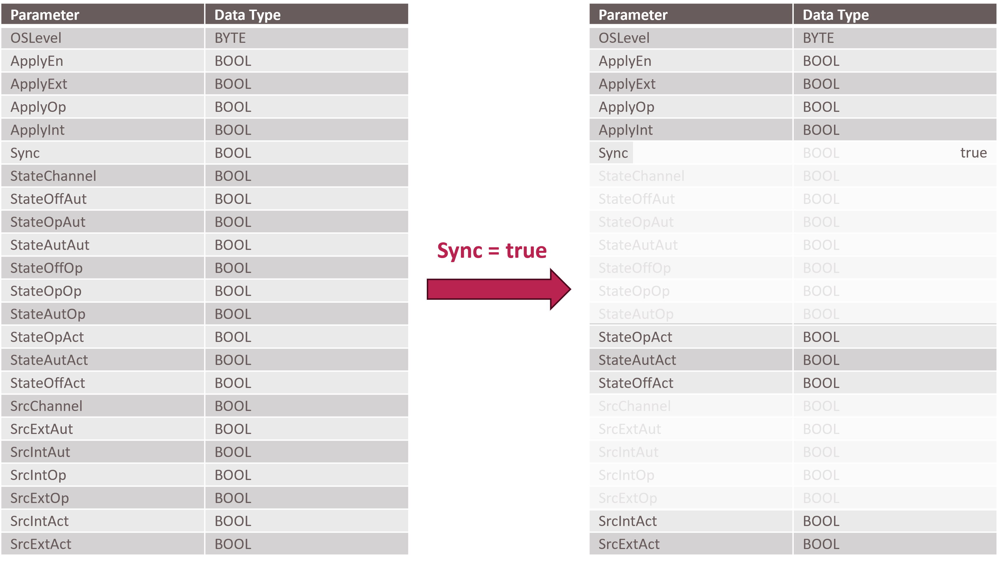

## 3 MTP-Based Automation of Logistics Equipment Assemblies

This chapter presents the MTP-based automation and integration of Logistics Equipment Assemblies (LEAs). Parts of these concepts were published in [[BFS+22]](../98_References/README.md#blumenstein-et-al-2022-atp) and [[BGB+23]](../98_References/README.md#blumenstein-et-al-moprolog); parametrization mechanisms were additionally investigated in a student thesis [[BJF+23]](../98_References/README.md#blumenstein-et-al-automationlol). 

X provides detailed specifications of the introduced MTP extensions and a more thorough description of their application to a palletizer LEA and a stretch-hooding LEA.

### 3.1 Artifact Overview

The MTP-based automation of LEAs comprises the same building blocks as the automation of Process Equipment Assemblies (PEAs). [Figure 3.1](#figure-31-components-of-lea-automation) gives an overview of these components.

##### Figure 3.1: Components of LEA Automation

The foundation is a **service-based automation** with exactly one MTP service per LEA (Section [3.2](#32-service-based-automation)). This service can be executed as an order-oriented *Cyclic Execution Service* (CES) or a demand-oriented *Single Execution Service* (SES), realizing the two LEA operating modes. **Parameterization** of these services (Section [3.3](#33-parameterization)) employs different mechanisms depending on parameter type. Order-specific and construction-specific parameters reuse existing MTP mechanisms; product- and packaging-specific parameters are managed via a newly introduced LEA-internal parameter store that enables the transfer of complete parameter sets. Beyond the existing MTP specification, this artifact introduces structured and array-based data types for **report values** (Section [3.4](#34-report-values)) and **process values** (Section [3.5](#35-process-values)). **LEA operator displays** (Section [3.6](#36-operator-displays)) support both existing MTP HMI concepts and newly introduced static display objects and variables with complex data types. Finally, **complexity reduction** (Section [3.7](#37-complexity-reduction-of-interfaces)) addresses how the breadth of standard MTP interface definitions can be reduced for the logistics domain by specifying fixed default values for variables that are irrelevant in LEA automation.

### 3.2 Service-Based Automation

Each LEA exposes exactly one (main) MTP service. Unlike PEAs — which may offer several functionally distinct services — an LEA has a predefined physical structure whose axes can only be varied in speed and sequencing through parameterization. A fundamentally different motion pattern is not achievable; hence each LEA provides one main function that is adapted primarily via parameterization [[BFG+21]](../98_References/README.md#blumenstein-et-al-design-principles).

To accommodate both order-oriented and demand-oriented operation, two service execution modes are defined as separate procedures of one LEA service:

- **Cyclic Execution Service (CES)** — for order-oriented operation
- **Single Execution Service (SES)** — for demand-oriented operation

A LEA may offer both CES and SES procedures, enabling deployment in different MLS contexts, though never both simultaneously. CES and SES procedures are conformant with [[MTP Part 4]](../98_References/README.md#mtp-specification-part-4) but carry specific interpretations of the MTP state machine. To allow a Logistics Orchestration Layer (LOL) to distinguish CES from SES procedures, *FunctionClassificationAttributes* per [[MTP Part 4]](../98_References/README.md#mtp-specification-part-4) are specified for each procedure.

#### Cyclic Execution Service (CES)

The CES processes all Logistics Objects (LOs) of a single order uniformly. The service is parameterized once with the order data at startup and then cyclically processes an equal or indefinite number of LOs, minimizing communication overhead with the LOL.

##### Figure 3.2: MTP State Machine Interpretation for a CES Procedure

[Figure 3.2](#figure-32-mtp-state-machine-interpretation-for-a-ces-procedure) shows the state machine interpretation: the orange states represent the LEA state; the green transitions depict LO processing within EXECUTE. [Figure 3.3](#figure-33-interaction-of-a-ces-service-with-the-lol) illustrates the interaction with the LOL during a service run.

##### Figure 3.3: Interaction of a CES Service with the LOL

The service starts in IDLE, where all order data are transferred. After signaling start-readiness (*StartEn = true*), a *Start* command transitions the LEA through STARTING into EXECUTE, where LOs are processed cyclically. Depending on whether the procedure is continuous or self-terminating, execution ends via a *Complete* command or upon a defined condition (e.g., target LO count reached). In COMPLETING, remaining LOs are finished and the LEA is emptied; COMPLETED signals full completion. A *Reset* returns the service to IDLE for the next order.

#### Single Execution Service (SES)

The SES adapts its parameterization to each arriving LO individually, enabling flexible processing of LOs from different orders or with different processing states.

##### Figure 3.4: MTP State Machine Interpretation for an SES Procedure

[Figure 3.4](#figure-34-mtp-state-machine-interpretation-for-an-ses-procedure) shows the SES state machine: orange states represent the LEA state; green states represent the processing state of an LO currently in the LEA. [Figure 3.5](#figure-35-interaction-of-an-ses-service-with-the-lol) shows the LOL interaction.

##### Figure 3.5: Interaction of an SES Service with the LOL

After startup via IDLE → STARTING → EXECUTE, the SES transitions into PAUSED, signaling that it is active and awaiting an external trigger (e.g., arrival of an AGV). Upon trigger detection, the service moves to RESUMING, identifies the LO's *ProductId* and *LogisticsObjectStatus*, and parameterizes accordingly. After processing in EXECUTE, the service returns to PAUSED for the next LO. SES procedures always run continuously, since the number and order of incoming LOs are unknown at startup. Execution is terminated via a *Complete* command when no further LOs are to be processed.

### 3.3 Parameterization

#### Parameter Types

Four types of LEA parameters are distinguished [[BFG+21]](../98_References/README.md#blumenstein-et-al-design-principles), [[BGB+23]](../98_References/README.md#blumenstein-et-al-moprolog):

##### Table 3.1: Parameter Types of Logistics Equipment Assemblies

<table>
  <tr>
    <th align="left">Type</th>
    <th align="left">Description</th>
  </tr>
  <tr>
    <td align="left"><strong>Order-specific</strong></td>
    <td align="left">Derived from customer orders; include order number, target product, and quantity. Only present for CES procedures (order-oriented operation).</td>
  </tr>
  <tr>
    <td align="left"><strong>Product-specific</strong></td>
    <td align="left">Derived from the LO to be packaged and its customer- or country-specific variants (e.g., stretch parameters, packing patterns). Must be updated when the product changes.</td>
  </tr>
  <tr>
    <td align="left"><strong>Packaging-specific</strong></td>
    <td align="left">Derived from the packaging material used (e.g., pallet or film type). Must be updated when the packaging material changes.</td>
  </tr>
  <tr>
    <td align="left"><strong>Construction-specific</strong></td>
    <td align="left">Reflect the physical build of the LEA or fundamental settings (e.g., speed setpoints, loaded consumables). Change only when the LEA is reconfigured or restocked.</td>
  </tr>
</table>

#### Parameter Transfer Mechanisms

Three mechanisms for transferring parameters to an LEA service are identified:

##### Table 3.2: Parameter Transfer Mechanisms

<table>
  <tr>
    <th align="left">Mechanism</th>
    <th align="left">Principle</th>
    <th align="left">Pros / Cons</th>
  </tr>
  <tr>
    <td align="left"><strong>Individual parameters</strong></td>
    <td align="left">Each parameter transferred as a single primitive value via separate parameter interfaces</td>
    <td align="left">Metadata (limits, unit) assignable per parameter; many parameters yield large interfaces and consistency effort</td>
  </tr>
  <tr>
    <td align="left"><strong>Single parameter set</strong></td>
    <td align="left">All parameters transferred as one structured object via one interface (<em>StructServParam</em>)</td>
    <td align="left">Simplifies interface for large sets; no per-parameter metadata; writing mixed read/write fields is technically unsound</td>
  </tr>
  <tr>
    <td align="left"><strong>Selection of parameter sets</strong></td>
    <td align="left">Multiple parameter sets loaded into LEA-internal storage; selected at runtime via ID (<em>ArrayServParam</em> + <em>DIntServParam</em>)</td>
    <td align="left">Fast, low-communication selection; resilient against LOL outages; requires two interfaces and higher memory</td>
  </tr>
</table>

**MTP realization:** Individual parameter transfer uses existing *DIntServParam*, *RealServParam*, *BoolServParam*, and *StringServParam* interfaces from [[MTP Part 4]](../98_References/README.md#mtp-specification-part-4). The *StructServParam* and *ArrayServParam* interfaces are newly specified to support structured and array-based data types respectively.

#### Parameterization Initiation

Three initiation modes are distinguished:

- **LOL-initiated:** The LOL writes parameters to the LEA directly. Corresponds to existing MTP behavior; no extension required.
- **LEA-requested:** The LEA detects a missing parameter set and requests it from the LOL. Realized as an extension of the MTP *Service Operator Interaction* mechanism via new *ProductParameterRequest* and *PackagingParameterRequest* models.
- **Local HMI entry:** An operator enters parameters directly at the LEA display. To propagate local changes back to the LOL, *ProductParameterUpdatedInfo* and *PackagingParameterUpdatedInfo* models are newly specified.

#### Recommended Parameterization Mechanism

For order-specific parameters, transfer as individual parameters via existing interfaces (or as a *StructServParam* set for large numbers) is recommended. These are modeled as procedure parameters per [[MTP Part 4]](../98_References/README.md#mtp-specification-part-4).

For product- and packaging-specific parameters — typically numerous and complex — parameter-set selection from LEA-internal storage is recommended. [Figure 3.6](#figure-36-recommended-parameterization-mechanism-for-product--and-packaging-specific-parameters) illustrates this mechanism.

##### Figure 3.6: Recommended Parameterization Mechanism for Product- and Packaging-Specific Parameters

**LEA-internal parameter store:** Two arrays are maintained in the LEA — a *ProductDataSet* for product-specific and a *PackagingDataSet* for packaging-specific parameter sets ([Figure 3.7](#figure-37-structure-of-the-lea-internal-parameter-store)). Each array element is a LEA-specific structured data type. A *ProductDataSet* entry is keyed by *ProductId* and *LogisticsObjectStatus*; a *PackagingDataSet* entry is keyed by *PackagingId*. Product parameter sets contain a *PackagingId* reference that links to the required packaging parameter set.

##### Figure 3.7: Structure of the LEA-Internal Parameter Store

**Filling the arrays** can be done proactively by the LOL (recommended for fixed product portfolios) or on demand via LEA requests at runtime (recommended for frequently changing or large portfolios). In either case, consistency between product and packaging sets must be ensured: whenever a new product parameter set is transferred, the corresponding packaging parameter set must already be present or be transferred alongside it.

**Parameter set selection** differs by service mode: in CES, *ProductId* is provided as an order-specific procedure parameter (type *DIntServParam*); in SES, *ProductId* and *LogisticsObjectStatus* are transmitted with the transport order data when the LO arrives. In both modes, the *PackagingId* is then read from the selected product parameter set to retrieve the packaging parameter set.

**Local HMI changes** are reported to the LOL via *ProductParameterUpdatedInfo* / *PackagingParameterUpdatedInfo*, specifying the array index of the changed set ([Figure 3.8](#figure-38-reporting-parameter-set-changes-to-the-lol)). The LOL acknowledges receipt and decides whether to adopt the change into its parameter management.

##### Figure 3.8: Reporting Parameter Set Changes to the LOL

To enable the LOL's parameter management to identify the purpose of each interface unambiguously, *FunctionClassificationAttributes* are introduced for parameters — previously only defined for services and procedures in [[MTP Part 4]](../98_References/README.md#mtp-specification-part-4). Concrete attributes are specified for *ProductId*, *LogisticsObjectStatus*, *ProductDataSet*, *PackagingId*, and *PackagingDataSet*.

Construction-specific parameters are typically few in number, independent of any particular order, and set at commissioning time. They are modeled as configuration parameters per [[MTP Part 4]](../98_References/README.md#mtp-specification-part-4) and transferred as individual values via existing interfaces.

### 3.4 Report Values

The report value concept defined in [[MTP Part 4]](../98_References/README.md#mtp-specification-part-4) is suitable for production-related logistics without conceptual changes. Extensions are limited to new data types: *StructView* and *ArrayView* interfaces are introduced as new derivations of *SUC IndicatorElement* (defined in [[MTP Part 3]](../98_References/README.md#mtp-specification-part-3)) to enable reporting of structured and array-typed values (e.g., the parameter sets currently stored in the LEA). Freezing semantics and the optional *MissedValueFlag* from [[MTP Part 4]](../98_References/README.md#mtp-specification-part-4) are adopted for these new types; for array types, all array elements are frozen simultaneously.

### 3.5 Process Values

The process value concept from [[MTP Part 4]](../98_References/README.md#mtp-specification-part-4) is also directly applicable. No need for structured or array-typed process values was identified in MLS automation practice; however, to maintain completeness across all data types consistent with MTP conventions, the interfaces *StructProcessValueIn*, *ArrayProcessValueIn*, and *ArrayProcessValueOut* are specified. The structured process value output corresponds to *StructView* and requires no separate specification.

### 3.6 Operator Displays

The LOL provides an operator display integrating the displays of all LEAs. For production-related logistics, machine-oriented displays are customary — in contrast to the P&ID-style displays targeted by [[MTP Part 2]](../98_References/README.md#mtp-specification-part-2). [Figure 3.9](#figure-39-operator-display-of-a-palletizer-lea) shows an example display for a palletizer LEA.

##### Figure 3.9: Operator Display of a Palletizer LEA

#### Dynamic Display Objects

Dynamic display objects leverage the mechanisms of [[MTP Part 2]](../98_References/README.md#mtp-specification-part-2). For primitive data types, existing interface definitions from [[MTP Part 3]](../98_References/README.md#mtp-specification-part-3) and [[MTP Part 4]](../98_References/README.md#mtp-specification-part-4) are used. For structured and array-based types, the following new interfaces are introduced:

##### Table 3.3: New Interface Definitions for Dynamic Display Objects

<table>
  <tr>
    <th align="left">Interface</th>
    <th align="left">Purpose</th>
  </tr>
  <tr>
    <td align="left"><em>StructView</em></td>
    <td align="left">Display of (report) values and process value outputs with structured data types</td>
  </tr>
  <tr>
    <td align="left"><em>ArrayView</em></td>
    <td align="left">Display of (report) values with array data types</td>
  </tr>
  <tr>
    <td align="left"><em>StructMan</em></td>
    <td align="left">Operator manipulation of structured-type values</td>
  </tr>
  <tr>
    <td align="left"><em>StructManInt</em></td>
    <td align="left">Operator or LEA-internal manipulation of structured-type values</td>
  </tr>
  <tr>
    <td align="left"><em>ArrayMan</em></td>
    <td align="left">Operator manipulation of array-type values</td>
  </tr>
  <tr>
    <td align="left"><em>ArrayManInt</em></td>
    <td align="left">Operator or LEA-internal manipulation of array-type values</td>
  </tr>
  <tr>
    <td align="left"><em>StructServParam</em></td>
    <td align="left">Display and manipulation of service parameters with structured data types</td>
  </tr>
  <tr>
    <td align="left"><em>ArrayServParam</em></td>
    <td align="left">Display and manipulation of service parameters with array data types</td>
  </tr>
  <tr>
    <td align="left"><em>StructProcessValueIn</em></td>
    <td align="left">Display of process value inputs with structured data types</td>
  </tr>
  <tr>
    <td align="left"><em>ArrayProcessValueIn</em></td>
    <td align="left">Display of process value inputs with array data types</td>
  </tr>
  <tr>
    <td align="left"><em>ArrayProcessValueOut</em></td>
    <td align="left">Display of process value outputs with array data types</td>
  </tr>
</table>

Monitor (*\*Mon*) interfaces are not specified for structured or array types, as threshold monitoring is not meaningful for multi-value containers.

#### Static Display Objects

Static display objects representing the physical appearance of a LEA are modeled as *VisualObjects* with an ECLASS reference per [[MTP Part 2]](../98_References/README.md#mtp-specification-part-2). The graphic should resemble the real machine as closely as possible to create a recognizable visual relationship between the operator display and the physical equipment. Since an LOL cannot maintain graphics for every possible LEA type, the **CustomSymbols** mechanism is introduced: LEA-specific SVG images are attached to the MTP package as file attachments per [[MTP Part 1]](../98_References/README.md#mtp-specification-part-1), organized in a dedicated *AttachmentGroup* named `CustomSymbols`.

##### Figure 3.10: LEA Image as a CustomSymbol in a Palletizer MTP

The ECLASS reference used for HMI modeling also serves as the SVG file name in the attachment, enabling the LOL to match the graphic to the visual object. Two cases are distinguished:

- **No suitable ECLASS exists:** Numbers in the reserved range 9090XXXX (not officially assigned) are selected as the ECLASS reference. When the LOL encounters a *VisualObject* with a reference in this range, it obtains the graphic directly from the MTP attachment's `CustomSymbols` group rather than its own graphics library ([Figure 3.10](#figure-310-lea-image-as-a-customsymbol-in-a-palletizer-mtp)).
- **A suitable ECLASS exists:** The module vendor may still provide a machine-specific graphic in the MTP attachment using the standard ECLASS reference as file name. If the LOL's graphics library does not contain a graphic for the given ECLASS, it falls back to the MTP attachment. If a graphic exists in both the LOL library and the MTP attachment for the same ECLASS, the LOL decides which one to use.

This mechanism has been adopted into the *ModuleTypePackage:HMISet.Base V2.0.0* profile of [[MTP Part 2]](../98_References/README.md#mtp-specification-part-2).

### 3.7 Complexity Reduction of Interfaces

The interface definitions of [[MTP Part 3]](../98_References/README.md#mtp-specification-part-3) and [[MTP Part 4]](../98_References/README.md#mtp-specification-part-4) are designed for a wide range of process-industry use cases — from laboratory to production scale. While this breadth is necessary for process engineering applications, many of these interface variables are irrelevant in production-related logistics, where operating conditions are more constrained. To reduce implementation effort without modifying the existing MTP interfaces, complexity can be reduced by specifying fixed default values for variables that are not needed in LEA automation.

[Figure 3.11](#figure-311-complexity-reduction-of-the-parameterelement-interface) illustrates this principle using the *ParameterElement* interface from [[MTP Part 4]](../98_References/README.md#mtp-specification-part-4), which is part of every MTP parameter interface. In process engineering, parameters can be operated in a mode that differs from the mode of the superimposed service. In production-related logistics, however, parameters always share the operation mode of their service. Setting the variable `Sync` to `true` by default makes a large number of dependent variables irrelevant, reducing the active interface from 23 to 10 variables.

##### Figure 3.11: Complexity Reduction of the *ParameterElement* Interface

Variables that become irrelevant through this defaulting (shown greyed out in [Figure 3.11](#figure-311-complexity-reduction-of-the-parameterelement-interface)) no longer need to be provided in the OPC UA server of the LEA controller; they are instead set to constant values within the MTP itself. Beyond simplifying the LOL–LEA interface, this yields a significant saving in controller memory: even fixing a single Boolean variable saves more than 100 bytes, since each OPC UA node requires substantial metadata overhead.

This pattern of complexity reduction through default values is applicable to further interface definitions and may be extended as additional LEA types and their specific constraints are analyzed.

### 3.8 Summary of MTP Extensions

[Table 3.4](#table-34-mtp-extensions-for-lea-automation) summarizes the new and extended interface and model definitions introduced by this artifact.

##### Table 3.4: MTP Extensions for LEA Automation

<table>
  <tr>
    <th align="left" colspan="3">Interface Definitions</th>
  </tr>
  <tr>
    <th align="left">Profile</th>
    <th align="left">Definition</th>
    <th align="left">Description</th>
  </tr>
  <tr>
    <td align="left">ModuleTypePackage: ServiceSet.ComplexTypes V2.0.0</td>
    <td align="left"><em>SUC StructServParam</em></td>
    <td align="left">Transfer of service parameters with structured data types</td>
  </tr>
  <tr>
    <td align="left">ModuleTypePackage: ServiceSet.ComplexTypes V2.0.0</td>
    <td align="left"><em>SUC ArrayServParam</em></td>
    <td align="left">Transfer of service parameters with array data types</td>
  </tr>
  <tr>
    <td align="left">ModuleTypePackage: ServiceSet.Logistics V2.0.0</td>
    <td align="left"><em>RC LogisticsInteractionExtension</em></td>
    <td align="left">Extension of the ServiceControl interface for logistics interaction variables</td>
  </tr>
  <tr>
    <td align="left">ModuleTypePackage: DataAssemblySet.ComplexTypes V2.0.0</td>
    <td align="left"><em>SUC StructView</em></td>
    <td align="left">Display of structured values</td>
  </tr>
  <tr>
    <td align="left">ModuleTypePackage: DataAssemblySet.ComplexTypes V2.0.0</td>
    <td align="left"><em>SUC ArrayView</em></td>
    <td align="left">Display of array-managed values</td>
  </tr>
  <tr>
    <td align="left">ModuleTypePackage: DataAssemblySet.ComplexTypes V2.0.0</td>
    <td align="left"><em>SUC StructMan / StructManInt</em></td>
    <td align="left">Operator (and internal) manipulation of structured-type values</td>
  </tr>
  <tr>
    <td align="left">ModuleTypePackage: DataAssemblySet.ComplexTypes V2.0.0</td>
    <td align="left"><em>SUC ArrayMan / ArrayManInt</em></td>
    <td align="left">Operator (and internal) manipulation of array-type values</td>
  </tr>
  <tr>
    <td align="left">ModuleTypePackage: ProcessValueSet.ComplexTypes V2.0.0</td>
    <td align="left"><em>SUC StructProcessValueIn</em></td>
    <td align="left">Reading a structured-type value from another LEA</td>
  </tr>
  <tr>
    <td align="left">ModuleTypePackage: ProcessValueSet.ComplexTypes V2.0.0</td>
    <td align="left"><em>SUC ArrayProcessValueIn</em></td>
    <td align="left">Reading an array managed by another LEA</td>
  </tr>
  <tr>
    <td align="left">ModuleTypePackage: ProcessValueSet.ComplexTypes V2.0.0</td>
    <td align="left"><em>SUC OutputElement</em></td>
    <td align="left">Abstract base for typed process value outputs</td>
  </tr>
  <tr>
    <td align="left">ModuleTypePackage: ProcessValueSet.ComplexTypes V2.0.0</td>
    <td align="left"><em>SUC ArrayProcessValueOut</em></td>
    <td align="left">Providing an LEA-internal array to another LEA</td>
  </tr>
  <tr>
    <th align="left" colspan="3">Model Definitions</th>
  </tr>
  <tr>
    <th align="left">Profile</th>
    <th align="left">Definition</th>
    <th align="left">Description</th>
  </tr>
  <tr>
    <td align="left">ModuleTypePackage: ServiceSet.Base V2.0.0</td>
    <td align="left"><em>SUC ServiceParameter</em> (extension)</td>
    <td align="left">Extension with <em>FunctionClassificationAttributes</em> for parameters</td>
  </tr>
  <tr>
    <td align="left">ModuleTypePackage: ServiceSet.Logistics V2.0.0</td>
    <td align="left"><em>SUC LogisticsInteraction</em></td>
    <td align="left">Aggregation of all logistics-specific LEA requests to the LOL</td>
  </tr>
  <tr>
    <td align="left">ModuleTypePackage: ServiceSet.Logistics V2.0.0</td>
    <td align="left"><em>SUC LogisticsQuestion</em></td>
    <td align="left">Base model for a LEA request to the LOL</td>
  </tr>
  <tr>
    <td align="left">ModuleTypePackage: ServiceSet.Logistics V2.0.0</td>
    <td align="left"><em>SUC ProductParameterRequest</em></td>
    <td align="left">LEA request for product-specific parameters</td>
  </tr>
  <tr>
    <td align="left">ModuleTypePackage: ServiceSet.Logistics V2.0.0</td>
    <td align="left"><em>SUC PackagingParameterRequest</em></td>
    <td align="left">LEA request for packaging-specific parameters</td>
  </tr>
  <tr>
    <td align="left">ModuleTypePackage: ServiceSet.Logistics V2.0.0</td>
    <td align="left"><em>SUC ProductParameterUpdatedInfo</em></td>
    <td align="left">LEA notification to the LOL of a changed product parameter set</td>
  </tr>
  <tr>
    <td align="left">ModuleTypePackage: ServiceSet.Logistics V2.0.0</td>
    <td align="left"><em>SUC PackagingParameterUpdatedInfo</em></td>
    <td align="left">LEA notification to the LOL of a changed packaging parameter set</td>
  </tr>
  <tr>
    <td align="left">ModuleTypePackage: ServiceSet.Logistics V2.0.0</td>
    <td align="left"><em>RC HasLogisticsInteraction</em></td>
    <td align="left">Association of a <em>LogisticsInteraction</em> to a LEA service</td>
  </tr>
</table>

In addition to these definitions, *FunctionClassificationAttributes* are introduced for CES and SES procedures as well as for the parameters *ProductId*, *LogisticsObjectStatus*, *ProductDataSet*, *PackagingId*, and *PackagingDataSet*. A mechanism for modeling complex data types in an OPC UA server is also specified as a supplementary artifact.
