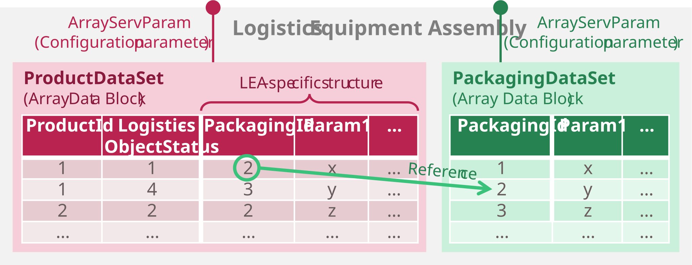

## 3 MTP-Based Automation of Logistics Equipment Assemblies

This chapter presents the MTP-based automation and integration of Logistics Equipment Assemblies (LEAs). Parts of these concepts were published in [[BFS+22]](../98_References/README.md#blumenstein-et-al-2022-atp) and [[BGB+23]](../98_References/README.md#blumenstein-et-al-moprolog); parametrization mechanisms were additionally investigated in student theses [[Jan23]](../98_References/README.md#janzen-2023) and in [[BJF+23]](../98_References/README.md#blumenstein-et-al-automationlol). 

 [Sections 6.1](../06_Application_Examples/06-01_PalletizingLEA.md) and [6.2](../06_Application_Examples/06-02_StretchHoodLEA.md) show the application of the described concepts to a palletizer LEA and a stretch-hood LEA. [Chapter 7](../07_MTP%20Extensions/07-00_Intro.md) provides detailed specifications of the introduced MTP extensions.

### 3.1 Artifact Overview

The MTP-based automation of LEAs comprises the same building blocks as the automation of PEAs in modular production processes. [Figure 3.1](#figure-31-components-of-lea-automation) gives an overview of these components.

##### Figure 3.1: Components of LEA Automation

The foundation is a **service-based automation** with exactly one MTP service per LEA ([Section 3.2](#32-service-based-automation)). This service can be executed as an order-oriented *Cyclic Execution Service* (CES) or a demand-oriented *Single Execution Service* (SES), implementing the two LEA operating modes introduced in [Section 2.4](../02_Modular_Logistics_System_NEW/02_Modular_Logistics_System.md#24-operating-modes-of-leas-and-logistics-lines). **Parameterization** of these services ([Section 3.3](#33-parameterization)) employs different mechanisms depending on parameter type. For order-specific and construction-specific parameters existing MTP mechanisms are reused; product- and packaging-specific parameters are managed via a newly introduced LEA-internal parameter store that enables the transfer of complete parameter sets. Further LEAs are able to request the parameter sets they need from a LOL. Beyond the existing MTP specification, this artifact introduces structured and array-based data types for **parameters** ([Section 3.3](#33-parameterization)), **report values** ([Section 3.4](#34-report-values)) and **process values** ([Section 3.5](#35-process-values)). **LEA operator displays** ([Section 3.6](#36-operator-displays)) support existing MTP HMI concepts, newly introduced custom symbols and variables with complex data types. Finally, **complexity reduction** ([Section 3.7](#37-complexity-reduction-of-interfaces)) addresses how the breadth of standard MTP interface definitions can be reduced for the logistics domain by specifying fixed default values for variables that are irrelevant in LEA automation.

### 3.2 Service-Based Automation

Each LEA exposes exactly one (main) MTP service. Unlike PEAs, which may offer several functionally distinct services, a LEA has a predefined physical structure whose axes can only be varied in speed and sequencing through parameterization. A fundamentally different motion pattern is not achievable; hence each LEA provides one main function that is adapted primarily via parameterization [[BFG+21]](../98_References/README.md#blumenstein-et-al-design-principles).

To accommodate both order-oriented and demand-oriented operation ([Section 2.4](../02_Modular_Logistics_System_NEW/02_Modular_Logistics_System.md#24-operating-modes-of-leas-and-logistics-lines)), two service execution modes are defined:

- **Cyclic Execution Service (CES)** — for order-oriented operation
- **Single Execution Service (SES)** — for demand-oriented operation

As a LEA service can either run in CES mode or in SES mode, those execution modes are implemented as separate procedures of the LEA service. A LEA may offer both CES and SES procedures, enabling usage in different MLS contexts, though never both simultaneously. CES and SES procedures are conformant with [[MTP Part 4]](../98_References/README.md#mtp-specification-part-4) but carry specific interpretations of the MTP state machine. To allow a LOL to distinguish CES from SES procedures, *FunctionClassificationAttributes* per [[MTP Part 4]](../98_References/README.md#mtp-specification-part-4) are specified for both service execution modes ([Section 7.4.1](../07_MTP%20Extensions/07-04_ServiceSet.md#741-overview)).

#### Cyclic Execution Service (CES)

The CES is designed to accept a single packaging order and then process all LOs of that order in a uniform manner. Characteristic of a service in CES mode is that it is parameterized once at the start of its execution according to the order data and then cyclically processes a defined or indefinite number of identical LOs. This enables fast throughput and minimal communication overhead with the LOL.

[Figure 3.2](#figure-32-mtp-state-machine-interpretation-for-a-ces-procedure) shows the interpretation of the MTP state machine main loop for a procedure in CES mode. The state of a CES procedure represents the state of the LEA, not the processing state of an individual LO ([Figure 3.2](#figure-32-mtp-state-machine-interpretation-for-a-ces-procedure), orange boxes). LO processing takes place within the EXECUTE state ([Figure 3.2](#figure-32-mtp-state-machine-interpretation-for-a-ces-procedure), green arrows). [Figure 3.3](#figure-33-interaction-of-a-ces-service-with-the-lol) illustrates the interaction with the LOL during a service run.

##### Figure 3.2: MTP State Machine Interpretation for a CES Procedure

##### Figure 3.3: Interaction of a CES Service with the LOL

Like any MTP service, a LEA service in CES mode begins its execution in the IDLE state. In this state, all order data required for execution are transferred to the service by an order management system in the LOL or by an operator. No re-parameterization is foreseen during subsequent execution under normal operating conditions. The order data are assigned via parameterization as described in [Section 3.3](#33-parameterization). After the CES procedure has signaled start-readiness (*StartEn = true*), a *Start* command can be issued and the LEA ramps up through STARTING. In the subsequent EXECUTE state, LOs are processed cyclically based on the previously configured order data, so that all LOs of the order are handled in the same way. Depending on whether a continuous or self-completing CES procedure is used, processing is ended by a *Complete* command or upon a defined condition (e.g., a specified number of processed LOs). In COMPLETING, any LOs still in processing are finished and the LEA is emptied. The COMPLETED state signals that processing has fully concluded. A *Reset* command returns the procedure to IDLE, where it can accept a new order. The pause, hold, stop, and abort loops can be traversed according to the conventions described in [[MTP Part 4]](../98_References/README.md#mtp-specification-part-4).

#### Single Execution Service (SES)

The SES is designed to process LOs in different ways according to their individual order data. Characteristic of a service in SES mode is that its parameterization is specifically adapted for each LO to be processed. This enables flexible handling of LOs that belong to different orders and/or have different processing states.

[Figure 3.4](#figure-34-mtp-state-machine-interpretation-for-an-ses-procedure) shows the interpretation of the main loop and pause loop of the MTP state machine for a procedure in SES mode. The orange-marked states represent the current state of the LEA, analogous to CES procedures. The green-marked states, by contrast, represent the processing state of an LO that may currently be present in the LEA. [Figure 3.5](#figure-35-interaction-of-an-ses-service-with-the-lol) shows the LOL interaction during a service run.

##### Figure 3.4: MTP State Machine Interpretation for an SES Procedure

##### Figure 3.5: Interaction of an SES Service with the LOL

A LEA service in SES mode also begins its execution in the IDLE state. In this state, a subset of the necessary parameters can be transferred to the service using the parameterization mechanisms described in [Section 3.3](#33-parameterization). At this point, however, it is not yet known which LOs will arrive at the SES or in which order. Therefore, only parameters that are independent of the type and processing state of the LO to be handled can be transferred at this stage, e.g., configuration parameters relating to the structural setup of the LEA. In addition, parameter sets for various LO types and processing states can already be passed to the SES procedure, to be selected later when a corresponding LO arrives.

After the SES procedure has signaled start-readiness (*StartEn = true*), a *Start* command can be issued and the LEA ramps up through STARTING without a concrete order. Subsequently, the SES procedure transitions via EXECUTE and PAUSING into the PAUSED state. This state signals that the SES is active and awaiting an external trigger indicating that an LO is to be processed, e.g., the arrival of an AGV tasked with handing over an LO to the LEA in question. Upon detection of such a trigger, the LEA service transitions to RESUMING, where the type (*ProductId*) and processing state (*LogisticsObjectStatus*) of the LO to be handled are identified. The SES procedure is then parameterized according to the individual order data of that LO. In the subsequent EXECUTE state, the processing of the individual LO is carried out in a demand-oriented manner. After processing is complete, the SES transitions back via PAUSING into PAUSED and waits for the next trigger.

SES procedures always run continuously, since the number and order of incoming LOs are unknown at startup. When no further LOs are to be processed, the SES procedure is terminated via a *Complete* command. If an LO is still present in the LEA at that point, its processing is completed in COMPLETING and the LEA is emptied. The COMPLETED state signals that processing has fully concluded. A *Reset* command returns the procedure to IDLE, from where the LEA can be started again when demand arises. The hold, stop, and abort loops can be traversed according to the conventions described in [[MTP Part 4]](../98_References/README.md#mtp-specification-part-4).

### 3.3 Parameterization

#### 3.3.1 Parameter Types

Four types of LEA parameters are distinguished [[BFS+22]](../98_References/README.md#blumenstein-et-al-2022-atp), [[BGB+23]](../98_References/README.md#blumenstein-et-al-moprolog):

##### Table 3.1: Parameter Types of Logistics Equipment Assemblies

<table>
  <tr>
    <th align="left">Type</th>
    <th align="left">Description</th>
  </tr>
  <tr>
    <td align="left"><strong>Order-specific</strong></td>
    <td align="left">Derived from customer orders; include order number, target product, and quantity. Only present for CES procedures (order-oriented operation).</td>
  </tr>
  <tr>
    <td align="left"><strong>Product-specific</strong></td>
    <td align="left">Derived from the LO to be packaged and its customer- or country-specific variants (e.g., stretch parameters, packing patterns). Must be updated when the product changes.</td>
  </tr>
  <tr>
    <td align="left"><strong>Packaging-specific</strong></td>
    <td align="left">Derived from the packaging material used (e.g., pallet or film type). Must be updated when the packaging material changes.</td>
  </tr>
  <tr>
    <td align="left"><strong>Construction-specific</strong></td>
    <td align="left">Reflect the physical build of the LEA or fundamental settings (e.g., speed setpoints, loaded consumables). Change only when the LEA is reconfigured or restocked.</td>
  </tr>
</table>

#### 3.3.2 Parameter Transfer Mechanisms

Three mechanisms for transferring parameters to a LEA service are identified:

##### Table 3.2: Parameter Transfer Mechanisms

<table>
  <tr>
    <th align="left" colspan="2">Individual parameters</th>
  </tr>
  <tr>
    <td align="left" colspan="2">Each LEA parameter is transferred as a single primitive value via a separate parameter interface to the LEA service.</td>
  </tr>
  <tr>
    <td align="left"><strong>Pros</strong></td>
    <td align="left">Metadata (e.g. min/max limits, unit) can be assigned per parameter. Only the currently used parameter values need to be stored, keeping memory requirements low.</td>
  </tr>
  <tr>
    <td align="left"><strong>Cons</strong></td>
    <td align="left">LEA parameterization can require many parameters, resulting in large service interfaces and high parameterization effort. Since parameters are transferred individually, consistency across all parameters must always be ensured. A failure of parameter management prevents automated parameterization.</td>
  </tr>
  <tr>
    <th align="left" colspan="2">Single parameter set</th>
  </tr>
  <tr>
    <td align="left" colspan="2">All LEA parameters are transferred as a structured parameter set via one interface (<em>StructServParam</em>) to the LEA service.</td>
  </tr>
  <tr>
    <td align="left"><strong>Pros</strong></td>
    <td align="left">This simplifies the service interface for large parameter sets and reduces parameterization effort. Consistent write and adoption of the complete parameter set is possible. Only the currently used values need to be stored, keeping memory requirements low.</td>
  </tr>
  <tr>
    <td align="left"><strong>Cons</strong></td>
    <td align="left">No per-parameter metadata can be assigned. A structure cannot mix read-only and read/write fields; writing to a structured element would also write to read-only variables, which is technically unsound. Additionally, the entire parameter set must always be transmitted rather than individual values, potentially causing high network load. A failure of parameter management prevents automated parameterization.</td>
  </tr>
  <tr>
    <th align="left" colspan="2">Selection of parameter sets</th>
  </tr>
  <tr>
    <td align="left" colspan="2">Multiple parameter sets for different products are transferred to the LEA and managed in LEA-internal storage. An ID selects the active parameter set for the current operation at runtime.</td>
  </tr>
  <tr>
    <td align="left"><strong>Pros</strong></td>
    <td align="left">Fast and simple selection of the active parameter set with very low communication effort is achieved. Consistency of parameter sets is always ensured. Storing parameter sets enables automated parameterization even during a failure of parameter management.</td>
  </tr>
  <tr>
    <td align="left"><strong>Cons</strong></td>
    <td align="left">Two interfaces are required — one for loading parameter sets into the LEA (<em>ArrayServParam</em>) and one for ID-based selection (<em>DIntServParam</em>); no means to model the relationship between them yet exists. Storing multiple parameter sets requires more LEA memory than the other two mechanisms.</td>
  </tr>
</table>

##### MTP implementation:

- **Individual parameters:** This mechanism corresponds to existing MTP parameterization. The *DIntServParam*, *AnaServParam*, *BinServParam*, and *StringServParam* interfaces from [[MTP Part 4]](../98_References/README.md#mtp-specification-part-4) are directly applicable; no extension is required.
- **Single parameter set:** Existing MTP concepts do not provide parameter interfaces for structured data types. Therefore, the *StructServParam* interface ([Table 7.25](../07_MTP%20Extensions/07-04_ServiceSet.md#table-725-dataassembly-definition-of-suc-structservparam)) is newly specified to transfer a parameter set with a LEA-specific structured data type. A method for modeling the required complex data types in the MTP ([Section 7.3.2](../07_MTP%20Extensions/07-03_DataAssemblySet.md#732-dataassembly-definitions)) and in the OPC UA server of a LEA ([Section 7.6](../07_MTP%20Extensions/07-06_ServerAssemblySet.md#76-mtp-extension-of-the-serverassemblyset)) is also described.
- **Selection of parameter sets:** For the ID-based selection interface, the *DIntServParam* interface from [[MTP Part 4]](../98_References/README.md#mtp-specification-part-4) is reused. For loading parameter sets into LEA-internal array storage, no suitable interface exists in the current MTP concept; the *ArrayServParam* interface ([Table 7.26](../07_MTP%20Extensions/07-04_ServiceSet.md#table-726-dataassembly-definition-of-suc-arrayservparam)) is therefore newly specified. Each array element uses the same LEA-specific structured data type as for single parameter set transfer.

#### 3.3.3 Parameterization Initiation

Three modes to initiate parameterization are distinguished:

##### Table 3.3: Parameterization Initiation Modes for Logistics Equipment Assemblies

<table>
  <tr>
    <th align="left" colspan="2">LOL-initiated</th>
  </tr>
  <tr>
    <td align="left" colspan="2">The LOL holds the knowledge of when to transfer which parameters to the LEAs and initiates parameterization accordingly.</td>
  </tr>
  <tr>
    <td align="left"><strong>Pros</strong></td>
    <td align="left">The LOL manages all parameter values and transfers them directly to the LEAs, keeping the complexity of parameter transfer low on the LEA side, especially in order-driven execution.</td>
  </tr>
  <tr>
    <td align="left"><strong>Cons</strong></td>
    <td align="left">The LOL must continuously track the status of (demand-driven) LEAs to determine when parameterization is required. When transferring a selection of parameter sets, the LOL must also track which sets are already present in each LEA's local storage.</td>
  </tr>
  <tr>
    <th align="left" colspan="2">LEA-requested</th>
  </tr>
  <tr>
    <td align="left" colspan="2">The LEA itself can detect when it is missing parameters and requests them from the LOL.</td>
  </tr>
  <tr>
    <td align="left"><strong>Pros</strong></td>
    <td align="left">The LEA autonomously detects its own parameterization needs and which parameters are missing, keeping the complexity of signaling parameterization demands to the LOL low, especially in demand-driven execution.</td>
  </tr>
  <tr>
    <td align="left"><strong>Cons</strong></td>
    <td align="left">Although the LEA identifies its own parameterization needs, all parameter values are managed in the LOL's parameter management. Consequently, the LEA must first report its need to the LOL, which then transfers the required parameters.</td>
  </tr>
  <tr>
    <th align="left" colspan="2">Local HMI entry</th>
  </tr>
  <tr>
    <td align="left" colspan="2">Parameters are entered locally by an operator at the LEA HMI. It must be considered that parameter changes may need to be read back into the LOL.</td>
  </tr>
  <tr>
    <td align="left"><strong>Pros</strong></td>
    <td align="left">The operator holds the knowledge of the required parameters and transfers them directly to the LEA, keeping the complexity of parameter transfer low on the LEA , especially in order-driven operation.</td>
  </tr>
  <tr>
    <td align="left"><strong>Cons</strong></td>
    <td align="left">The operator must continuously track the status of (demand-driven) LEAs to determine when parameterization is required. When transferring a selection of parameter sets, the operator must also track which sets are already present in each LEA's local storage.</td>
  </tr>
</table>

##### MTP implementation:

- **LOL-initiated:** The LOL writes parameters to the LEA directly. This corresponds to existing MTP behavior [[MTP Part 4]](../98_References/README.md#mtp-specification-part-4); no extension is required.
- **LEA-requested:** The LEA detects a missing parameter set and requests it from the LOL. For this *ProductParameterRequest* ([Table 7.32](../07_MTP%20Extensions/07-04_ServiceSet.md#table-732-model-definition-of-suc-productparameterrequest)) and *PackagingParameterRequest* ([Table 7.33](../07_MTP%20Extensions/07-04_ServiceSet.md#table-733-model-definition-of-suc-packagingparameterrequest)) are introduced in this work. Those follow similar mechanism to the MTP *Service Interaction* mechanism. 
- **Local HMI entry:** An operator enters parameters directly at the LEA HMI. To propagate local changes back to the LOL, *ProductParameterUpdatedInfo* ([Table 7.34](../07_MTP%20Extensions/07-04_ServiceSet.md#table-734-model-definition-of-suc-productparameterupdatedinfo)) and *PackagingParameterUpdatedInfo* ([Table 7.35](../07_MTP%20Extensions/07-04_ServiceSet.md#table-735-model-definition-of-suc-packagingparameterupdatedinfo)) models specified in this work, also based on the MTP *Service Interaction* mechanism [[MTP Part 4]](../98_References/README.md#mtp-specification-part-4).

#### 3.3.4 Recommended Parameterization Mechanism

The previously described mechanisms for parameter transfer and initiation of parameterization can be combined in any way. However, in the following an recommendation is given, of how to use these mechanisms for the different parameter types of LEA services.

For **order-specific** parameters, transfer as individual parameters via existing interfaces is recommended, as LEAs typically receive only a small number of such parameters. If a more comprehensive set is required, transfer as a single *StructServParam* set reduces parameterization effort. Due to their order-related nature, these parameters are modeled as procedure parameters per [[MTP Part 4]](../98_References/README.md#mtp-specification-part-4). Parameterization is typically initiated by a LOL order management system; in small-scale MLSs it may alternatively be set by an operator via the LOL HMI.

**Product- and packaging-specific parameters** are managed by a LOL parameter management system, which maintains a structured database of all required parameters for the products and packaging materials in use. Since these parameter sets are typically large and numerous, parameter set selection from LEA-internal storage is recommended to minimize parameterization and communication effort. [Figure 3.6](#figure-36-recommended-parameterization-mechanism-for-product--and-packaging-specific-parameters) illustrates this mechanism.

##### Figure 3.6: Recommended Parameterization Mechanism for Product- and Packaging-Specific Parameters

**LEA-internal parameter store:** Two arrays are maintained in the LEA — a *ProductDataSet* for product-specific and a *PackagingDataSet* for packaging-specific parameter sets ([Figure 3.7](#figure-37-structure-of-the-lea-internal-parameter-store)). The elements of each array are from a LEA-specific structured data type. A *ProductDataSet* entry is keyed by *ProductId* and *LogisticsObjectStatus*; a *PackagingDataSet* entry is keyed by *PackagingId*. Product parameter sets contain a *PackagingId* reference that links to the required packaging parameter set.

##### Figure 3.7: Structure of the LEA-Internal Parameter Store

**Filling the arrays** can be done proactively by the LOL (recommended for fixed product portfolios) or on demand via LEA requests at runtime (recommended for frequently changing or large portfolios). In either case, consistency between product and packaging sets must be ensured: whenever a new product parameter set is transferred, the corresponding packaging parameter set must already be present or be transferred alongside it.

**Parameter set selection** differs by service execution mode (CES / SES): in **CES**, *ProductId* is provided as an order-specific procedure parameter (type *DIntServParam*); in **SES**, *ProductId* and *LogisticsObjectStatus* are transmitted with the transport order data when an LO arrives. In both modes, the *PackagingId* is then read from the selected product parameter set to retrieve the packaging parameter set.

**Local HMI changes** are reported to the LOL via *ProductParameterUpdatedInfo* / *PackagingParameterUpdatedInfo*, specifying the array index of the changed parameter set ([Figure 3.8](#figure-38-reporting-parameter-set-changes-to-the-lol)). The LOL acknowledges receipt and decides whether to adopt the change into its parameter management.

##### Figure 3.8: Reporting Parameter Set Changes to the LOL

To enable the LOL's parameter management to identify the purpose of each interface unambiguously, *FunctionClassificationAttributes* are introduced for parameters, which were previously only defined for services and procedures in [[MTP Part 4]](../98_References/README.md#mtp-specification-part-4). Concrete attributes are specified for *ProductId*, *LogisticsObjectStatus*, *ProductDataSet*, *PackagingId*, and *PackagingDataSet* ([Section 7.4.1](../07_MTP%20Extensions/07-04_ServiceSet.md#741-overview)).

**Construction-specific parameters** concern the physical setup of a LEA (e.g. the installed filling nozzle type) or its current configuration (e.g. the loaded pallet type). They are independent of any particular order and of whether the LEA operates in CES or SES mode, instead defining fundamental settings for service execution. Since they are typically few in number and set at commissioning time by an operator, they are modeled as configuration parameters per [[MTP Part 4]](../98_References/README.md#mtp-specification-part-4) and transferred as individual values via existing interfaces.

For LEA types that use a specific packaging material, a construction-specific *DIntServParam* parameter specifies which packaging material (e.g. pallet type) is currently loaded in the LEA. Based on this value, the corresponding packaging-specific information can be retrieved from the LEA-internal *PackagingDataSet* or requested from the LOL. This value is semantically equivalent to the *PackagingId* described above and must be verified against the *PackagingId* required by the selected product parameter set before processing a logistics object. A mismatch means the LEA cannot process the order or must be equipped with different packaging material. To allow unambiguous semantic identification of this parameter, a corresponding *FunctionClassificationAttribute* is introduced ([Section 7.4.1](../07_MTP%20Extensions/07-04_ServiceSet.md#741-overview)).

### 3.4 Report Values

The report value concept defined in [[MTP Part 4]](../98_References/README.md#mtp-specification-part-4) is suitable for production-related logistics without conceptual changes. Extensions are limited to new data types: since the structured data types and arrays introduced in [Section 3.3](#33-parameterization) should also be reportable, e.g., to document the parameter sets currently stored in a LEA, two new interfaces are introduced. Following the MTP convention that report value interfaces are derived from *SUC IndicatorElement* (defined in [[MTP Part 3]](../98_References/README.md#mtp-specification-part-3)), *StructView* ([Table 7.8](../07_MTP%20Extensions/07-03_DataAssemblySet.md#table-78-dataassembly-definition-of-suc-structview)) and *ArrayView* ([Table 7.9](../07_MTP%20Extensions/07-03_DataAssemblySet.md#table-79-dataassembly-definition-of-suc-arrayview)) are specified as new derivations of this base type.

Per [[MTP Part 4]](../98_References/README.md#mtp-specification-part-4), report values can be "frozen", i.e., the current value is retained for a defined period. The optional *MissedValueFlag* signals whether the report value changed at least twice while it was frozen. Both principles are adopted for the new structured and array-typed interfaces. For array types, freezing applies to all array elements simultaneously; individual frozen elements remain accessible by index selection.

### 3.5 Process Values

The process value concept defined in [[MTP Part 4]](../98_References/README.md#mtp-specification-part-4) is suitable for production-related logistics without conceptual changes. Unlike parameters and report values, no need for structured or array-typed process values was identified in MLS automation practice. However, since MTP conventions define process value interfaces for every supported data type, corresponding interface definitions are specified for completeness: *StructProcessValueIn* ([Table 7.39](../07_MTP%20Extensions/07-05_ProcessValueSet.md#table-739-dataassembly-definition-of-suc-structprocessvaluein)), *ArrayProcessValueIn* ([Table 7.40](../07_MTP%20Extensions/07-05_ProcessValueSet.md#table-740-dataassembly-definition-of-suc-arrayprocessvaluein)), and *ArrayProcessValueOut* ([Table 7.42](../07_MTP%20Extensions/07-05_ProcessValueSet.md#table-742-dataassembly-definition-of-suc-arrayprocessvalueout)). The process value output for structured data types corresponds to *StructView* and requires no separate specification.

### 3.6 Operator Displays

The LOL provides an operator display for monitoring and manually controlling LEAs, into which the displays of individual LEAs are automatically integrated following the concepts of [[MTP Part 2]](../98_References/README.md#mtp-specification-part-2). While [[MTP Part 2]](../98_References/README.md#mtp-specification-part-2) targets P&ID-style displays, machine-oriented displays are customary in production-related logistics. These displays contain a static representation of the LEA and multiple dynamic display objects for the LEA service, parameters, report values, process values, and further LEA-internal values. [Figure 3.9](#figure-39-operator-display-of-a-palletizer-lea) shows an example display for a palletizer LEA.

##### Figure 3.9: Operator Display of a Palletizer LEA

#### Dynamic Display Objects

Dynamic display objects can fundamentally be implemented using the mechanisms of [[MTP Part 2]](../98_References/README.md#mtp-specification-part-2). For displaying and manipulating LEA-internal variables, the interface definitions from [[MTP Part 3]](../98_References/README.md#mtp-specification-part-3) and [[MTP Part 4]](../98_References/README.md#mtp-specification-part-4) are used. In addition, interface definitions for variables with structured and array-based data types are introduced, following the same principles as the interfaces already defined in the MTP specification for primitive data types. [Table 3.4](#table-34-new-interface-definitions-for-dynamic-display-objects) summarizes these newly introduced interfaces:

##### Table 3.4: New Interface Definitions for Dynamic Display Objects

<table>
  <tr>
    <th align="left">Interface</th>
    <th align="left">Purpose</th>
    <th align="left">Specification Reference</th>
  </tr>
  <tr>
    <td align="left"><em>StructView</em></td>
    <td align="left">Display of (report) values and process value outputs with structured data types</td>
    <td align="left"><a href="../07_MTP%20Extensions/07-03_DataAssemblySet.md#table-78-dataassembly-definition-of-suc-structview">Table 7.8</a></td>
  </tr>
  <tr>
    <td align="left"><em>ArrayView</em></td>
    <td align="left">Display of (report) values with array data types</td>
    <td align="left"><a href="../07_MTP%20Extensions/07-03_DataAssemblySet.md#table-79-dataassembly-definition-of-suc-arrayview">Table 7.9</a></td>
  </tr>
  <tr>
    <td align="left"><em>StructMan</em></td>
    <td align="left">Operator manipulation of structured-type values</td>
    <td align="left"><a href="../07_MTP%20Extensions/07-03_DataAssemblySet.md#table-710-dataassembly-definition-of-suc-structman">Table 7.10</a></td>
  </tr>
  <tr>
    <td align="left"><em>StructManInt</em></td>
    <td align="left">Operator or LEA-internal manipulation of structured-type values</td>
    <td align="left"><a href="../07_MTP%20Extensions/07-03_DataAssemblySet.md#table-711-dataassembly-definition-of-suc-structmanint">Table 7.11</a></td>
  </tr>
  <tr>
    <td align="left"><em>ArrayMan</em></td>
    <td align="left">Operator manipulation of array-type values</td>
    <td align="left"><a href="../07_MTP%20Extensions/07-03_DataAssemblySet.md#table-712-dataassembly-definition-of-suc-arrayman">Table 7.12</a></td>
  </tr>
  <tr>
    <td align="left"><em>ArrayManInt</em></td>
    <td align="left">Operator or LEA-internal manipulation of array-type values</td>
    <td align="left"><a href="../07_MTP%20Extensions/07-03_DataAssemblySet.md#table-713-dataassembly-definition-of-suc-arraymanint">Table 7.13</a></td>
  </tr>
  <tr>
    <td align="left"><em>StructServParam</em></td>
    <td align="left">Display and manipulation of service parameters with structured data types</td>
    <td align="left"><a href="../07_MTP%20Extensions/07-04_ServiceSet.md#table-725-dataassembly-definition-of-suc-structservparam">Table 7.25</a></td>
  </tr>
  <tr>
    <td align="left"><em>ArrayServParam</em></td>
    <td align="left">Display and manipulation of service parameters with array data types</td>
    <td align="left"><a href="../07_MTP%20Extensions/07-04_ServiceSet.md#table-726-dataassembly-definition-of-suc-arrayservparam">Table 7.26</a></td>
  </tr>
  <tr>
    <td align="left"><em>StructProcessValueIn</em></td>
    <td align="left">Display of process value inputs with structured data types</td>
    <td align="left"><a href="../07_MTP%20Extensions/07-05_ProcessValueSet.md#table-739-dataassembly-definition-of-suc-structprocessvaluein">Table 7.39</a></td>
  </tr>
  <tr>
    <td align="left"><em>ArrayProcessValueIn</em></td>
    <td align="left">Display of process value inputs with array data types</td>
    <td align="left"><a href="../07_MTP%20Extensions/07-05_ProcessValueSet.md#table-740-dataassembly-definition-of-suc-arrayprocessvaluein">Table 7.40</a></td>
  </tr>
  <tr>
    <td align="left"><em>ArrayProcessValueOut</em></td>
    <td align="left">Display of process value outputs with array data types</td>
    <td align="left"><a href="../07_MTP%20Extensions/07-05_ProcessValueSet.md#table-742-dataassembly-definition-of-suc-arrayprocessvalueout">Table 7.42</a></td>
  </tr>
</table>

Monitor (*\*Mon*) interfaces are not specified for structured or array types, as threshold monitoring is not meaningful for multi-value containers.

The subsequent artifacts on the automation of Logistics Lines ([Chapter 4](../04_Logistics_Line_NEW/04_Logistics_Line.md#4-choreography-based-automation-and-mtp-based-integration-of-logistics-lines)) and on the automation of flexible transports in Logistics Areas ([Chapter 5](../05_Logistics_Area_NEW/05_Logistics_Area.md#5-mtp-based-automation-of-flexible-transport-in-logistics-areas)) introduce further interfaces for which dynamic display objects in LEA operator displays may likewise be provided.

#### Static Display Objects

Static display objects representing the physical appearance of a LEA are modeled as *VisualObjects* with an ECLASS reference per [[MTP Part 2]](../98_References/README.md#mtp-specification-part-2). The graphic should resemble the real machine as closely as possible to create a recognizable visual relationship between the operator display and the physical equipment. Since a LOL cannot maintain graphics for every possible LEA type, the **CustomSymbols** mechanism is introduced: LEA-specific SVG images are attached to the MTP as file attachments per [[MTP Part 1]](../98_References/README.md#mtp-specification-part-1), organized in a dedicated *AttachmentGroup* named `CustomSymbols`, with an `HMI` subfolder recommended for clarity.

##### Figure 3.10: LEA Image as a CustomSymbol in a Palletizer MTP

From a modeling perspective, CustomSymbols are treated identically to graphics from the LOL's own library. Each SVG file name is set to the 8-digit numeric ECLASS reference string. The same reference is used in the *VisualObject* definition and for referencing via *AttachmentReference*. This enables the LOL to unambiguously match the graphic to the visual object. 

For selecting the ECLASS number, two cases are distinguished:

- **No suitable ECLASS exists for the LEA:** Numbers in the reserved range 9090XXXX (not officially assigned) are selected as the ECLASS reference. When the LOL encounters a *VisualObject* with a reference in this range, it obtains the graphic directly from the MTP attachment's `CustomSymbols` group rather than its own graphics library ([Figure 3.10](#figure-310-lea-image-as-a-customsymbol-in-a-palletizer-mtp)).
- **A suitable ECLASS exists for the LEA:** The module vendor may still provide a machine-specific graphic in the MTP attachment using the standard ECLASS reference as file name. If the LOL's graphics library does not contain a graphic for the given ECLASS, it falls back to the MTP attachment. If a graphic exists in both the LOL library and the MTP attachment for the same ECLASS, the LOL decides which one to use.

This mechanism has been adopted into the *ModuleTypePackage:HMISet.Base V2.0.0* profile of [[MTP Part 2]](../98_References/README.md#mtp-specification-part-2).

### 3.7 Complexity Reduction of Interfaces

The interface definitions of [[MTP Part 3]](../98_References/README.md#mtp-specification-part-3) and [[MTP Part 4]](../98_References/README.md#mtp-specification-part-4) are designed for a wide range of process-industry use cases — from laboratory to production scale. While this breadth is necessary for process engineering applications, many of these interface variables are irrelevant in production-related logistics, where operating conditions are more constrained. To reduce implementation effort without modifying the existing MTP interfaces, complexity can be reduced by specifying fixed default values for variables that are not needed in LEA automation.

[Figure 3.11](#figure-311-complexity-reduction-of-the-parameterelement-interface) illustrates this principle using the *ParameterElement* interface from [[MTP Part 4]](../98_References/README.md#mtp-specification-part-4), which is part of every MTP parameter interface. In process engineering, parameters can be operated in a mode that differs from the mode of the superimposed service. In production-related logistics, however, parameters always share the operation mode of their service. Setting the variable `Sync` to `true` by default makes a large number of dependent variables irrelevant, reducing the active interface from 23 to 10 variables.

##### Figure 3.11: Complexity Reduction of the *ParameterElement* Interface

Variables that become irrelevant through this defaulting (shown greyed out in [Figure 3.11](#figure-311-complexity-reduction-of-the-parameterelement-interface)) no longer need to be provided in the OPC UA server of the LEA controller; they are instead set to constant values within the MTP itself. Beyond simplifying the LOL-LEA interface, this yields a significant saving in controller memory: even fixing a single Boolean variable saves more than 100 bytes, since each OPC UA node requires substantial metadata overhead.

This pattern of complexity reduction through default values is applicable to further interface definitions and may be extended as additional LEA types and their specific constraints are analyzed.

### 3.8 Summary of MTP Extensions

In the preceding sections, a number of extensions to the MTP specification were identified that are necessary in the context of automating Logistics Equipment Assemblies. [Table 3.5](#table-35-mtp-extensions-for-lea-automation) provides an overview of the model and interface definitions to be introduced. A more detailed description is provided in the specification sections referenced in [Table 3.5](#table-35-mtp-extensions-for-lea-automation).

##### Table 3.5: MTP Extensions for LEA Automation

<table>
  <tr>
    <th align="left" colspan="3">Interface Definitions</th>
  </tr>
  <tr>
    <th align="left">Profile</th>
    <th align="left">Definition</th>
    <th align="left">Description</th>
  </tr>
  <tr>
    <td align="left">ModuleTypePackage: ServiceSet.ComplexTypes V2.0.0</td>
    <td align="left"><em>SUC StructServParam</em> (<a href="../07_MTP%20Extensions/07-04_ServiceSet.md#table-725-dataassembly-definition-of-suc-structservparam">Table 7.25</a>)</td>
    <td align="left">Transfer of service parameters with structured data types</td>
  </tr>
  <tr>
    <td align="left">ModuleTypePackage: ServiceSet.ComplexTypes V2.0.0</td>
    <td align="left"><em>SUC ArrayServParam</em> (<a href="../07_MTP%20Extensions/07-04_ServiceSet.md#table-726-dataassembly-definition-of-suc-arrayservparam">Table 7.26</a>)</td>
    <td align="left">Transfer of service parameters with array data types</td>
  </tr>
  <tr>
    <td align="left">ModuleTypePackage: ServiceSet.Logistics V2.0.0</td>
    <td align="left"><em>RC LogisticsInteractionExtension</em> (<a href="../07_MTP%20Extensions/07-04_ServiceSet.md#table-727-dataassembly-definition-of-rc-logisticsinteractionextension">Table 7.27</a>)</td>
    <td align="left">Extension of the ServiceControl interface for logistics interaction variables</td>
  </tr>
  <tr>
    <td align="left">ModuleTypePackage: ServiceSet.Logistics V2.0.0</td>
    <td align="left"><em>SUC ServiceControl</em> (extension) (<a href="../07_MTP%20Extensions/07-04_ServiceSet.md#table-728-dataassembly-definition-of-suc-servicecontrol">Table 7.28</a>)</td>
    <td align="left">Extension of the existing ServiceControl interface to allow attachment of <em>RC LogisticsInteractionExtension</em></td>
  </tr>
  <tr>
    <td align="left">ModuleTypePackage: DataAssemblySet.ComplexTypes V2.0.0</td>
    <td align="left"><em>SUC StructView</em> (<a href="../07_MTP%20Extensions/07-03_DataAssemblySet.md#table-78-dataassembly-definition-of-suc-structview">Table 7.8</a>)</td>
    <td align="left">Display of structured values</td>
  </tr>
  <tr>
    <td align="left">ModuleTypePackage: DataAssemblySet.ComplexTypes V2.0.0</td>
    <td align="left"><em>SUC ArrayView</em> (<a href="../07_MTP%20Extensions/07-03_DataAssemblySet.md#table-79-dataassembly-definition-of-suc-arrayview">Table 7.9</a>)</td>
    <td align="left">Display of array-managed values</td>
  </tr>
  <tr>
    <td align="left">ModuleTypePackage: DataAssemblySet.ComplexTypes V2.0.0</td>
    <td align="left"><em>SUC StructMan</em> (<a href="../07_MTP%20Extensions/07-03_DataAssemblySet.md#table-710-dataassembly-definition-of-suc-structman">Table 7.10</a>)</td>
    <td align="left">Operator manipulation of structured-type values</td>
  </tr>
  <tr>
    <td align="left">ModuleTypePackage: DataAssemblySet.ComplexTypes V2.0.0</td>
    <td align="left"><em>SUC StructManInt</em> (<a href="../07_MTP%20Extensions/07-03_DataAssemblySet.md#table-711-dataassembly-definition-of-suc-structmanint">Table 7.11</a>)</td>
    <td align="left">Operator or LEA-internal manipulation of structured-type values</td>
  </tr>
  <tr>
    <td align="left">ModuleTypePackage: DataAssemblySet.ComplexTypes V2.0.0</td>
    <td align="left"><em>SUC ArrayMan</em> (<a href="../07_MTP%20Extensions/07-03_DataAssemblySet.md#table-712-dataassembly-definition-of-suc-arrayman">Table 7.12</a>)</td>
    <td align="left">Operator manipulation of array-type values</td>
  </tr>
  <tr>
    <td align="left">ModuleTypePackage: DataAssemblySet.ComplexTypes V2.0.0</td>
    <td align="left"><em>SUC ArrayManInt</em> (<a href="../07_MTP%20Extensions/07-03_DataAssemblySet.md#table-713-dataassembly-definition-of-suc-arraymanint">Table 7.13</a>)</td>
    <td align="left">Operator or LEA-internal manipulation of array-type values</td>
  </tr>
  <tr>
    <td align="left">ModuleTypePackage: ProcessValueSet.ComplexTypes V2.0.0</td>
    <td align="left"><em>SUC StructProcessValueIn</em> (<a href="../07_MTP%20Extensions/07-05_ProcessValueSet.md#table-739-dataassembly-definition-of-suc-structprocessvaluein">Table 7.39</a>)</td>
    <td align="left">Reading a structured-type value from another LEA</td>
  </tr>
  <tr>
    <td align="left">ModuleTypePackage: ProcessValueSet.ComplexTypes V2.0.0</td>
    <td align="left"><em>SUC ArrayProcessValueIn</em> (<a href="../07_MTP%20Extensions/07-05_ProcessValueSet.md#table-740-dataassembly-definition-of-suc-arrayprocessvaluein">Table 7.40</a>)</td>
    <td align="left">Reading an array managed by another LEA</td>
  </tr>
  <tr>
    <td align="left">ModuleTypePackage: ProcessValueSet.ComplexTypes V2.0.0</td>
    <td align="left"><em>SUC OutputElement</em> (<a href="../07_MTP%20Extensions/07-05_ProcessValueSet.md#table-741-dataassembly-definition-of-suc-outputelement">Table 7.41</a>)</td>
    <td align="left">Abstract base for typed process value outputs</td>
  </tr>
  <tr>
    <td align="left">ModuleTypePackage: ProcessValueSet.ComplexTypes V2.0.0</td>
    <td align="left"><em>SUC ArrayProcessValueOut</em> (<a href="../07_MTP%20Extensions/07-05_ProcessValueSet.md#table-742-dataassembly-definition-of-suc-arrayprocessvalueout">Table 7.42</a>)</td>
    <td align="left">Providing a LEA-internal array to another LEA</td>
  </tr>
  <tr>
    <th align="left" colspan="3">Model Definitions</th>
  </tr>
  <tr>
    <th align="left">Profile</th>
    <th align="left">Definition</th>
    <th align="left">Description</th>
  </tr>
  <tr>
    <td align="left">ModuleTypePackage: ServiceSet.Base V2.0.0</td>
    <td align="left"><em>SUC ServiceParameter</em> (extension) (<a href="../07_MTP%20Extensions/07-04_ServiceSet.md#table-729-model-definition-of-suc-serviceparameter">Table 7.29</a>)</td>
    <td align="left">Extension with <em>FunctionClassificationAttributes</em> for parameters</td>
  </tr>
  <tr>
    <td align="left">ModuleTypePackage: ServiceSet.Logistics V2.0.0</td>
    <td align="left"><em>SUC LogisticsInteraction</em> (<a href="../07_MTP%20Extensions/07-04_ServiceSet.md#table-730-model-definition-of-suc-logisticsinteraction">Table 7.30</a>)</td>
    <td align="left">Aggregation of all logistics-specific LEA requests to the LOL</td>
  </tr>
  <tr>
    <td align="left">ModuleTypePackage: ServiceSet.Logistics V2.0.0</td>
    <td align="left"><em>SUC LogisticsQuestion</em> (<a href="../07_MTP%20Extensions/07-04_ServiceSet.md#table-731-model-definition-of-suc-logisticsquestion">Table 7.31</a>)</td>
    <td align="left">Base model for a LEA request to the LOL</td>
  </tr>
  <tr>
    <td align="left">ModuleTypePackage: ServiceSet.Logistics V2.0.0</td>
    <td align="left"><em>SUC ProductParameterRequest</em> (<a href="../07_MTP%20Extensions/07-04_ServiceSet.md#table-732-model-definition-of-suc-productparameterrequest">Table 7.32</a>)</td>
    <td align="left">LEA request for product-specific parameters</td>
  </tr>
  <tr>
    <td align="left">ModuleTypePackage: ServiceSet.Logistics V2.0.0</td>
    <td align="left"><em>SUC PackagingParameterRequest</em> (<a href="../07_MTP%20Extensions/07-04_ServiceSet.md#table-733-model-definition-of-suc-packagingparameterrequest">Table 7.33</a>)</td>
    <td align="left">LEA request for packaging-specific parameters</td>
  </tr>
  <tr>
    <td align="left">ModuleTypePackage: ServiceSet.Logistics V2.0.0</td>
    <td align="left"><em>SUC ProductParameterUpdatedInfo</em> (<a href="../07_MTP%20Extensions/07-04_ServiceSet.md#table-734-model-definition-of-suc-productparameterupdatedinfo">Table 7.34</a>)</td>
    <td align="left">LEA notification to the LOL of a changed product parameter set</td>
  </tr>
  <tr>
    <td align="left">ModuleTypePackage: ServiceSet.Logistics V2.0.0</td>
    <td align="left"><em>SUC PackagingParameterUpdatedInfo</em> (<a href="../07_MTP%20Extensions/07-04_ServiceSet.md#table-735-model-definition-of-suc-packagingparameterupdatedinfo">Table 7.35</a>)</td>
    <td align="left">LEA notification to the LOL of a changed packaging parameter set</td>
  </tr>
  <tr>
    <td align="left">ModuleTypePackage: ServiceSet.Logistics V2.0.0</td>
    <td align="left"><em>RC HasLogisticsInteraction</em> (<a href="../07_MTP%20Extensions/07-04_ServiceSet.md#table-737-model-definition-of-rc-haslogisticsinteraction">Table 7.37</a>)</td>
    <td align="left">Association of a <em>LogisticsInteraction</em> to a LEA service</td>
  </tr>
  <tr>
    <td align="left">ModuleTypePackage: ServiceSet.Logistics V2.0.0</td>
    <td align="left"><em>SUC Service</em> (extension) (<a href="../07_MTP%20Extensions/07-04_ServiceSet.md#table-738-model-definition-of-suc-service">Table 7.38</a>)</td>
    <td align="left">Extension of the existing Service model to allow attachment of <em>RC HasLogisticsInteraction</em></td>
  </tr>
</table>

In addition to these definitions, *FunctionClassificationAttributes* are introduced for CES and SES procedures as well as for the parameters *ProductId*, *LogisticsObjectStatus*, *ProductDataSet*, *PackagingId*, and *PackagingDataSet* ([Section 7.4.1](../07_MTP%20Extensions/07-04_ServiceSet.md#741-overview)). A mechanism for modeling complex data types in an OPC UA server is also specified as a supplementary artifact ([Section 7.6](../07_MTP%20Extensions/07-06_ServerAssemblySet.md#76-mtp-extension-of-the-serverassemblyset)). 