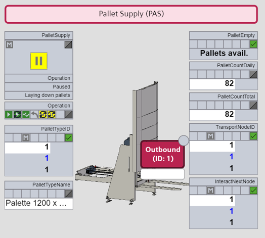

[< Previous](../03_Logistics_Equipment_Assemblies/README.md) | [Home](../README.md) | [Next >](../05_Complexity_Reduction_of_Interfaces/README.md)

## 4 Machine-oriented Human Machine Interfaces

While VDI/VDE/NAMUR 2658-2 [4] is designed for P&ID[^1]-like Human Machine Interfaces (HMIs), for the field of logistics machine-oriented HMIs, as shown in Figure 4.1 for a pallet supplier, are more appropriate.

*Figure 4.1: Human Machine Interface of a pallet supplier based on a custom ECLASS element*

This HMI contains an image of the LEA as a static HMI object and several dynamic objects for parameters and report values. The latter can be implemented with the mechanisms from VDI/VDE/NAMUR 2658-2 [4].

Static objects are positioned as *VisualObjects* in the HMI according to VDI/VDE/NAMUR 2658-2 [4] and are provided with an ECLASS reference. The integrating system (here: LOL) must have this reference available in a graphics library to be able to display the static object accordingly. The used graphics should be as similar as possible to the appearance of the real machine in order to achieve a visual relationship between the operator screen and the real machine.

Especially with very special machines, the LOL may not have a suitable graphic in its library to represent the machine. To avoid having to keep images of many different machines in the LOL, it makes sense to include them in the MTPs of the LEAs as attachments according to VDI/VDE/NAMUR 2658-1 [8]. To identify the graphics in the appendix, the file names of those attachments should correspond to the ECLASS references, which are used for the HMI modelling. Here two cases are to be distinguished.

#### Case 1 – No suitable ECLASS exists

If no suitable ECLASS reference exists for a specific machine, numbers in the number range 90-90-XX-YY are to be selected, since these are not occupied with official coding. The graphics must be stored in the attachments folder in a separate HMI folder and the filenames of the graphic must correspond with the selected ECLASS reference. If a visual object with an ECLASS reference starting with 90-90-* is then placed in the HMI image, the LOL knows that this object must be obtained from the MTP.

#### Case 2 – A suitable ECLASS exists

If a more or less suitable ECLASS reference exists for a specific machine, the module vendor nevertheless may want to provide a graphic for their specific machine. In this case the ECLASS reference best suited for the machine has to be used as file name for the graphics and for HMI modelling. If a LOL does not contain a graphic with the given ECLASS in its graphics library, it can obtain it from the HMI folder in the attachment of the MTP. If for a given ECLASS a graphic exists in the LOL graphics library as well as in the MTP attachment, the LOL must decide which one to use.

[< Previous](../03_Logistics_Equipment_Assemblies/README.md) | [Home](../README.md) | [Next >](../05_Complexity_Reduction_of_Interfaces/README.md)

[^1]: Piping and Instrumentation Diagram