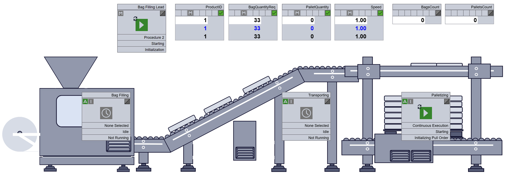
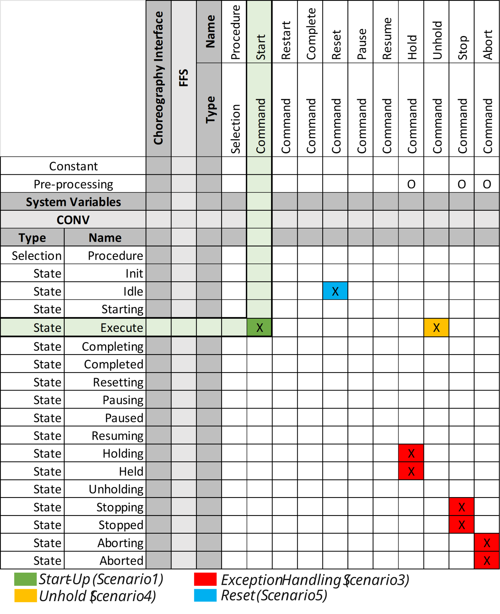
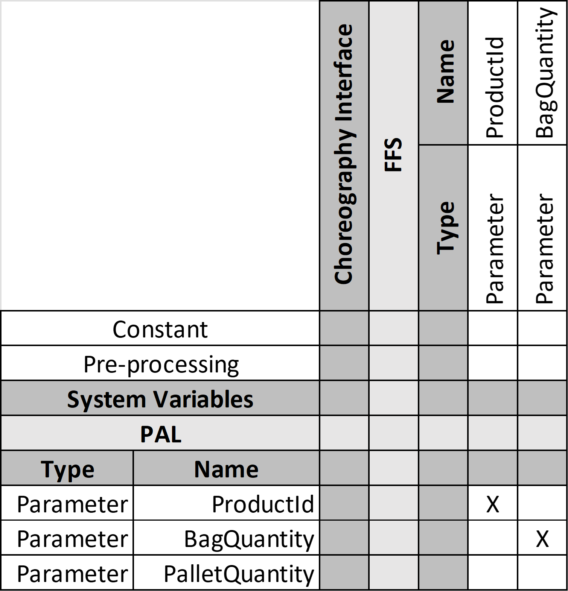
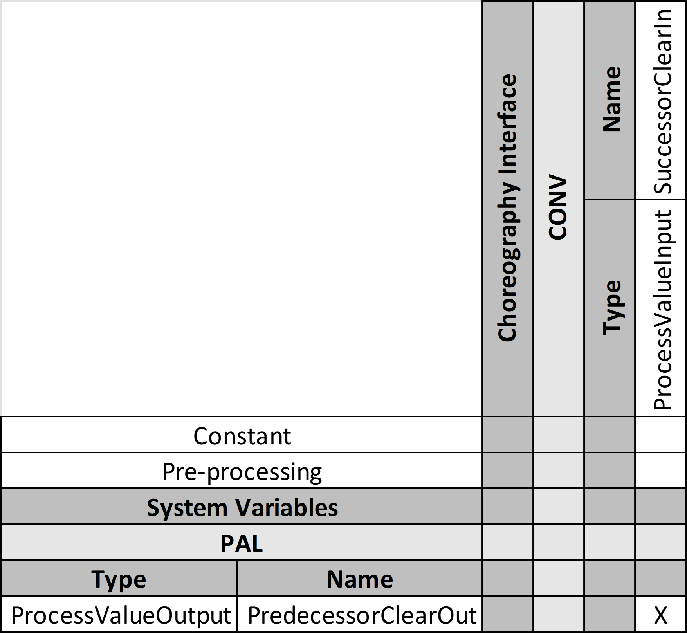
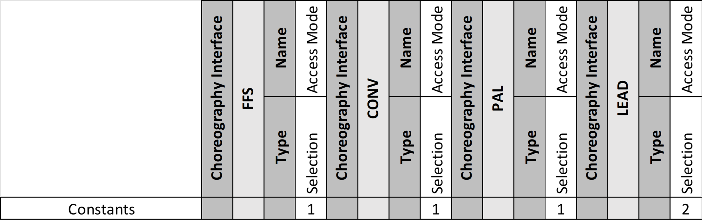
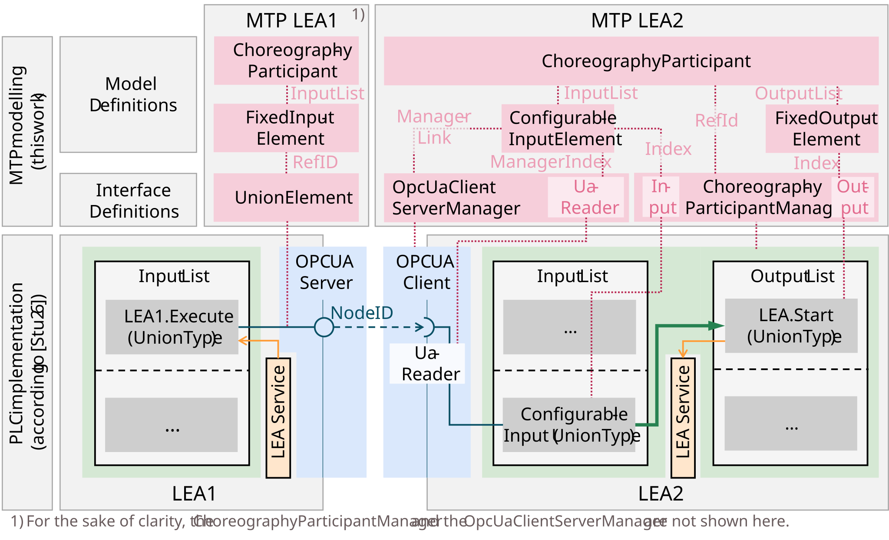
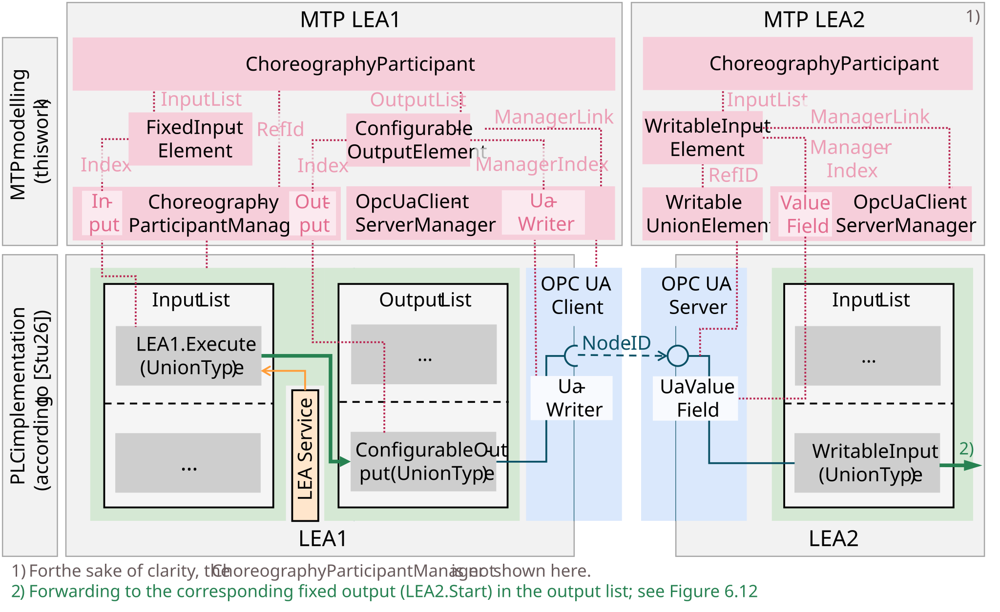

## 4.5 Application Example: Bag Filling Line
To illustrate the concepts described in this chapter for Logistics Line automation, this section presents an exemplary application of the choreography concept to the bag filling line of the use case described in [Section 4.2.1](04-02_Horizontal_Integration.md#421-application-example).

### 4.5.1 Introduction to the Use Case
The bag filling line consists of three LEAs — a Form-Fill-Seal machine (FFS), a conveyor (CONV), and a palletizer (PAL) — each automated with a service in CES mode in accordance with [Chapter 3](../03_Logistics_Equipment_Assemblies/03_Logistics_Equipment_Assemblies.md). For simplicity, it is assumed that these services feature exclusively the procedures, parameters, process values, and report values shown in [Table 4.5](#table-45-services-of-the-exemplary-logistics-line-including-their-procedures-parameters-and-process-values).

##### Table 4.5: Services of the Exemplary Logistics Line Including Their Procedures, Parameters, and Process Values

<table>
  <tr>
    <th align="left">Service (LEA)</th>
    <th align="left">Procedure (ID)</th>
    <th align="left">Parameters</th>
    <th align="left">Process Values</th>
    <th align="left">Report Values</th>
  </tr>
  <tr>
    <td rowspan="2" align="left">BagFilling (FFS)</td>
    <td align="left">Continuous (16#1)</td>
    <td align="left">ProductId</td>
    <td align="left">SuccessorClearIn</td>
    <td align="left">BagsCount</td>
  </tr>
  <tr>
    <td align="left">BagQuantity (16#2)</td>
    <td align="left">ProductId BagQuantity</td>
    <td align="left">SuccessorClearIn</td>
    <td align="left">BagsCount</td>
  </tr>
  <tr>
    <td align="left">Conveying (CONV)</td>
    <td align="left">Continuous (16#1)</td>
    <td align="left">Speed</td>
    <td align="left">PredecessorClearOut SuccessorClearIn</td>
    <td align="left">–</td>
  </tr>
  <tr>
    <td rowspan="3" align="left">Palletizing (PAL)</td>
    <td align="left">Continuous (16#1)</td>
    <td align="left">ProductId</td>
    <td align="left">PredecessorClearOut</td>
    <td align="left">BagsCount PalletsCount</td>
  </tr>
  <tr>
    <td align="left">BagQuantity (16#2)</td>
    <td align="left">ProductId BagQuantity</td>
    <td align="left">PredecessorClearOut</td>
    <td align="left">BagsCount PalletsCount</td>
  </tr>
  <tr>
    <td align="left">PalletQuantity (16#3)</td>
    <td align="left">ProductId PalletQuantity</td>
    <td align="left">PredecessorClearOut</td>
    <td align="left">BagsCount PalletsCount</td>
  </tr>
</table>

The choreography configuration in terms of Configurable Logic and Configurable Communication depends substantially on the desired behavior of the Logistics Line. [Table 4.6](#table-46-application-scenarios-of-the-exemplary-bag-filling-line) shows exemplary application scenarios that are used as the basis here. In other application contexts, different scenarios and thus a different choreography configuration may be required.

##### Table 4.6: Application Scenarios of the Exemplary Bag Filling Line

<table>
  <tr>
    <th align="left">Scenario</th>
    <th align="left">Description</th>
  </tr>
  <tr>
    <td align="left">Scenario 1 – Start-Up</td>
    <td align="left">The line must be started up in an orderly manner from back to front, i.e., from the PAL to the FFS. The service of a LEA must therefore be started as soon as the service of the downstream LEA is running.</td>
  </tr>
  <tr>
    <td align="left">Scenario 2 – Emptying</td>
    <td align="left">The line must be emptied in an orderly manner from front to back, i.e., from the FFS to the PAL. The service of a LEA must therefore be completed as soon as the service of the upstream LEA has been completed.</td>
  </tr>
  <tr>
    <td align="left">Scenario 3 – Exception Handling</td>
    <td align="left">When an error occurs in the packaging line, all LEAs must transition to an error state. The service of a LEA must therefore switch to an error state as soon as another LEA service or an existing LOL indicates an error state.</td>
  </tr>
  <tr>
    <td align="left">Scenario 4 – Unhold</td>
    <td align="left">If the error is non-critical (service state: HELD), it must be possible to restart the Logistics Line after the error has been resolved. The service of a LEA must therefore be unheld as soon as the service of the downstream LEA is running again.</td>
  </tr>
  <tr>
    <td align="left">Scenario 5 – Reset</td>
    <td align="left">If a critical error has occurred or the filling process has been completed, it must be possible to reset the Logistics Line to its initial state IDLE. The service of a LEA must therefore be reset as soon as the Lead service indicates RESETTING state.</td>
  </tr>
</table>

### 4.5.2 Choreography Configuration — Vertical Integration

**Lead Service:** As described in [Section 4.3.1](04-03_Vertical_Integration.md#431-line-interface), a Lead Service provides a service interface for the functionality of a Logistics Line, which can be implemented as an Internal Lead or External Lead. In this case, an External Lead is chosen, since none of the three participating services can meaningfully represent the line functionality. Considering Scenario 1 (Start-Up), for example, it becomes clear that the impulse to start up must be given at the PAL service, while the confirmation of a successful start-up is available at the FFS service. An Internal Lead is therefore not suitable. The External Lead Service is chosen to run alongside the *Palletizing* service on the PAL's controller, since these typically serve as the master controllers for logistics lines today. Alternatively, it may also run on a separate controller. The Lead Service is exemplarily equipped with five generic procedures that, in accordance with the behavioral rules of the Configurable Logic, lead to various procedure settings of the Follower Services.

**Parameters:** In addition, the parameters shown in [Table 4.5](#table-45-services-of-the-exemplary-logistics-line-including-their-procedures-parameters-and-process-values) must be configured. It is advisable to configure parameters at as few LEAs as possible in order to simplify the line interface. In the present case, all parameters of the *Palletizing* service and the *Speed* parameter of the *Conveying* service are provided at the line interface. The parameters *ProductId* and *BagQuantity* are passed internally within the choreography from the PAL to the FFS LEA.

**Report Values:** The report values of the Logistics Line are the *BagsCount* and *PalletsCount* report values of the PAL, which provide the number of completed bags and pallets of the Logistics Line respectively.

**Process Values:** The available process values are in this case processed exclusively within the choreography and are not exposed at the line interface.

**HMI Screens:** The line HMI screen is composed of three LEA images as CustomSymbols, which are obtained from the LEA MTPs using the ContextReference mechanism in combination with the CustomSymbols mechanism. In addition, dynamic *VisualObjects* are provided for the *ServiceControl* interfaces of the Lead Service and the three LEA services, as well as for the parameters and report values of the line interface. These reference the associated *DataAssemblies* in the attached LEA MTPs via *RC HasExternalMtpContext*. [Figure 4.22](#figure-422-exemplary-line-hmi-screen-of-a-bag-filling-line) shows the line HMI screen. In addition, the three HMI screens of the individual LEAs are incorporated into the HMI screen hierarchy of the Logistics Line via *ReferencedPicture*.

##### Figure 4.22: Exemplary Line HMI Screen of a Bag Filling Line

The elements of the line interface and line HMI screen described above are represented in a Composed MTP in accordance with the mechanisms described in [Section 4.3.3](04-03_Vertical_Integration.md#433-composed-mtp).

### 4.5.3 Choreography Configuration — Horizontal Integration
Procedural, parametrizing, and interlocking relations, as well as constants, are defined between the three LEAs of the Logistics Line.

**Procedural Relations:** [Figure 4.23](#figure-423-exemplary-procedural-relations-of-a-bag-filling-line) shows an exemplary excerpt from a matrix describing the procedural relations between the LEAs of the bag filling line, specifically the relations between FFS and CONV.

##### Figure 4.23: Exemplary Procedural Relations of a Bag Filling Line

The rows represent the system variables that the *Conveying* service can make available to other services. The columns represent the choreography interface of the *BagFilling* service, which can be actuated based on the variables of other LEAs. The markings within the matrix represent the behavioral rules of the Configurable Logic. For example, the rule highlighted in green indicates that the EXECUTE state of the *Conveying* service triggers the *Start* command at the *BagFilling* service. This rule contributes to the orderly start-up of the line (Scenario 1). In such a direct relation, a system variable of one service has an immediate effect on the interface of another service. In the case of Scenario 3 "Exception Handling" ([Figure 4.23](#figure-423-exemplary-procedural-relations-of-a-bag-filling-line), red markings), it additionally occurs that two system variables act upon the same variable of the choreography interface. In this case, pre-processing of the system variables is required ([Figure 4.23](#figure-423-exemplary-procedural-relations-of-a-bag-filling-line), "Pre-processing"), the result of which is written to the choreography interface. In this case, the pre-processing is a logical OR ("O"). All other arithmetic and logical functions can likewise be used for such pre-processing. As demonstrated here using the *Conveying* and *BagFilling* services as an example, all other behavioral rules between the three services of the bag filling line and the External Lead can be configured in the same way.

Furthermore, it must be specified how the procedure setting of the External Lead is to be propagated to the LEA services. In this example, a self-completing procedure 1 for packaging a defined number of pallets is configured at the Lead Service. This results in the *BagQuantity* procedure being set at the *BagFilling* service, the *Continuous* procedure at the *Conveying* service, and the *PalletQuantity* procedure at the *Palletizing* service.

**Parametrizing Relations:** [Figure 4.24](#figure-424-exemplary-parametrizing-relations-of-a-bag-filling-line) shows an exemplary excerpt from a matrix describing the parametrizing relations between the LEAs of the bag filling line, specifically the relations between PAL and FFS.

##### Figure 4.24: Exemplary Parametrizing Relations of a Bag Filling Line

As described in [Section 4.5.2](#452-choreography-configuration--vertical-integration), the *BagFilling* service obtains the parameters it requires (i.e., *ProductId* and *BagQuantity*) from the PAL. In the present case, no pre-processing is required for this.

**Interlocking Relations:** [Figure 4.25](#figure-425-exemplary-interlocking-relations-of-a-bag-filling-line) shows an exemplary excerpt from a matrix describing the interlocking relations between the LEAs of the bag filling line, specifically the relations between PAL and CONV.

##### Figure 4.25: Exemplary Interlocking Relations of a Bag Filling Line

In the present use case, the available process values for transmitting the clearance signals are forwarded as interlocking relations without pre-processing.

**Constants:** [Figure 4.26](#figure-426-exemplary-constants-of-a-bag-filling-line) shows an exemplary excerpt from a matrix describing the definition of constants for the bag filling line.

##### Figure 4.26: Exemplary Constants of a Bag Filling Line

The ability to define constants is used in the case of the bag filling line to define the operation mode of the LEA services in accordance with [Section 4.3.1](04-03_Vertical_Integration.md#431-line-interface). For the three LEA services *BagFilling*, *Conveying*, and *Palletizing*, the *Access Mode* variable is set to a constant value of "1". The LEA controller interprets this as the *Automatic Internal* operation mode. For the Lead Service, the *Access Mode* is set to a constant value of "2". The LEA controller interprets this as the *Operator* operation mode. Furthermore, constants can be used, for example, to set parameters such as the *Speed* variable of the CONV to a constant value. Additionally, clearance signals can be permanently set to TRUE when a LEA, as in the example of the PAL, is located at the end of the Logistics Line and does not need to wait for clearance from a downstream LEA.

> **Best Practices for Choreography Configuration in Logistics Lines:**
> - The Configurable Communication design pattern fundamentally enables the exchange of all information available in a LEA with other LEAs of a choreographed Logistics Line. However, to enable vendor-neutral interaction between LEAs, variables from the standardized MTP-based LEA interfaces in accordance with [Chapter 3](../03_Logistics_Equipment_Assemblies/03_Logistics_Equipment_Assemblies.md) should be exchanged wherever possible.
> - An exception is the interface of the External Lead. For this, "DoRequest and DoneReply relations" are recommended in accordance with [[Stu26]](../08_References/README.md#stutz-2026), which enable the merging of different start and end points of a choreography relation across multiple LEA services.

### 4.5.4 Implementation of Choreography Relations using the Models and Interfaces of the ChoreographySet

This section shows how the model and interface definitions introduced in this work are used in combination with the concepts from [[Stu26]](../08_References/README.md#stutz-2026) to implement choreography relations with active reading and active writing. As an example, the relation is considered in which LEA2, e.g., FFS, shall start when LEA1, e.g., CONV, is in the EXECUTE state.

#### Active Reading

[Figure 4.27](#figure-427-implementation-of-a-choreography-relation-with-active-reading) shows the implementation of the above relation using the active reading communication variant. The information whether the service of LEA1 is in the EXECUTE state is programmatically stored as a fixed input in the Input List of LEA1. Its value is provided in the OPC UA server as a *UnionElement* interface under a specific Node ID. This interface is represented in the MTP model of LEA1 by a *FixedInputElement* model definition.

##### Figure 4.27: Implementation of a Choreography Relation with Active Reading

On the side of LEA2, a *UaReader* is provided for reading this information, which is configured via the *OpcUaClientServerManager* interface to the corresponding Node ID and writes the read value to a configurable input in the Input List of LEA2. This configurable input is represented in the MTP as a *ConfigurableInputElement* model definition that contains the necessary information for reading. The *ConfigurableInputElement* is linked to the *OpcUaClientServerManager* interface via a *ManagerLink* and assigned a specific *UaReader* within it via a *ManagerIndex*. Additionally, the name of the *ConfigurableInputElement* corresponds to the index in the Input List of LEA2 to which the *UaReader* should write the read value.

The Output List of LEA2 contains a fixed output that enables starting the LEA2 service. This is represented in the MTP model as a *FixedOutputElement* model definition. The name of the *FixedOutputElement* corresponds to the index of the output in the Output List of LEA2. According to the mechanisms described in [[Stu26]](../08_References/README.md#stutz-2026), the read value of the configurable input is transferred within LEA2 to the value of the fixed output (in this case without preprocessing), and the desired relation is implemented.

#### Active Writing

[Figure 4.28](#figure-428-implementation-of-a-choreography-relation-with-active-writing) shows the implementation of the above relation using the active writing communication variant.

##### Figure 4.28: Implementation of a Choreography Relation with Active Writing

The information whether the service of LEA1 is in the EXECUTE state is programmatically stored as a fixed input in the Input List of LEA1. This is represented in the MTP model of LEA1 as a *FixedInputElement* model definition. According to the mechanisms described in [[Stu26]](../08_References/README.md#stutz-2026), this value is transferred to a configurable output in the Output List of LEA1.

A *UaWriter* of the *OpcUaClientServerManager* interface is assigned to this configurable output, which writes the value to a defined Node ID in the OPC UA server of LEA2. The configurable output is represented in the MTP as a *ConfigurableOutputElement* model definition that contains the necessary information for writing. The *ConfigurableOutputElement* is linked to the *OpcUaClientServerManager* interface via a *ManagerLink* and assigned a specific *UaWriter* within it via a *ManagerIndex*. Additionally, the name of the *ConfigurableOutputElement* corresponds to the index in the Output List of LEA1 from which the *UaWriter* should read the value to be written.

On the side of LEA2, an externally writable *ValueField* is provided, which internally writes its value to a specific position in the Input List. This *ValueField* has a *WritableUnionElement* interface that is provided in the OPC UA server of LEA2 under a specific Node ID. The *UaWriter* of LEA1 is configured to this Node ID. This interface is represented in the MTP model of LEA2 as a *WritableInputElement* model definition.

As in the case of active reading, the Output List of LEA2 contains a fixed output that enables starting the LEA2 service, represented in the MTP by a *FixedOutputElement* model definition. According to the mechanisms described in [[Stu26]](../08_References/README.md#stutz-2026), the value of the writable input is transferred within LEA2 to the value of the fixed output (in this case without preprocessing), and the desired relation is implemented.
