## 4 Choreography-Based Automation and MTP-Based Integration of Logistics Lines

This chapter presents the choreography-based automation and MTP-based integration of Logistics Lines. Existing choreography concepts from [[Stu26]](../98_References/README.md#stutz-2026) and [[SFB+21]](../98_References/README.md#stutz-et-al-2021) are adopted and extended with newly specified MTP concepts. The application of choreography principles to Logistics Line automation was investigated in [[Ort21]](../98_References/README.md#ortmann-2021) and partially published in [[BSF+22]](../98_References/README.md#blumenstein-et-al-2022-etfa), [[BGB+23]](../98_References/README.md#blumenstein-et-al-moprolog), and [[SBF+22]](../98_References/README.md#stutz-et-al-2022). 

 [Section 7.3](../07_Application_Examples/07-03_BagFillingLine.md#73-application-example-bag-filling-line) shows the application of the described concepts to a bag-filling Logistics Line. [Section 8.7](../08_MTP%20Extensions/08-07_ChoreographySet.md#87-mtp-specification-of-the-choreographyset) provides detailed specifications of the introduced MTP extensions.

### 4.1 Artifact Overview

The automation of Logistics Lines follows a choreography-based approach built on the mechanisms described in [[SFB+21]](../98_References/README.md#stutz-et-al-2021) and [[Stu26]](../98_References/README.md#stutz-2026), adapted to the context of production-related logistics and extended with MTP-based interfaces and models for automated integration. A distinction is made between the **horizontal integration** of LEAs within a Logistics Line and the **vertical integration** of a choreographed Logistics Line into a superordinate LOL.

**Horizontal integration of LEAs into a Logistics Line:** Horizontal interactions between LEAs are configured by a Choreography Configurator in the LOL, resulting in a choreographed Logistics Line. To enable automated integration of LEAs into the configurator, their connectable inputs and outputs are described in the LEA MTPs as **semantic MTP models** ([Section 4.2.7](#427-semantic-models-for-lea-integration-into-a-choreography-configurator)). On this basis, a choreography configuration is designed and then downloaded to the LEA controllers via **MTP-based configuration interfaces** specified in the LEA MTPs ([Section 4.2.8](#428-interfaces-for-configuring-horizontal-interaction)). The necessary MTP-based interfaces and model definitions are grouped in the new MTP aspect *ChoreographySet* ([Section 4.2.9](#429-choreographyset)).

**Vertical integration of Logistics Lines:** A choreographed Logistics Line is integrated into a superordinate LOL and controlled — automatically by an order management system or manually by an operator — via a shared service interface (**Line Interface**, [Section 4.3.1](#431-line-interface)) that makes the line behave like a single MTP service. An operator display (**Line HMI**, [Section 4.3.2](#432-line-hmi)) is also provided. The Line Interface and Line HMI are described in a shared MTP for the Logistics Line (**Composed MTP**, [Section 4.3.3](#433-Composed MTP)).

### 4.2 Horizontal Integration of Logistics Equipment Assemblies into a Logistics Line

#### 4.2.1 Application Example

[Figure 4.1](#figure-41-application-example-of-a-choreographed-logistics-line-with-three-leas) shows an example Logistics Line for bag filling and palletizing, consisting of three LEAs: a form-fill-seal machine (FFS), a conveyor (CONV), and a layer palletizer (PAL). Four types of relations between the LEAs implement the choreography-based horizontal control:

- **Parametrizing relations:** Parameters required by one LEA are observed from another. For example, the FFS reads the target bag count from the PAL and applies it to its own parameters ([Figure 4.1](#figure-41-application-example-of-a-choreographed-logistics-line-with-three-leas), (1)).
- **Procedural relations:** Service state transitions of one LEA trigger state transitions in another. For example, once the PAL service reaches EXECUTE, the CONV starts its own service ([Figure 4.1](#figure-41-application-example-of-a-choreographed-logistics-line-with-three-leas), (2)). Complex logic is also possible: if any LEA service enters STOPPED, all other services do likewise (logical OR).
- **Interlocking relations:** Clearance signals are continuously passed from downstream to upstream LEAs as MTP process values, ensuring that a logistics object may only enter a LEA when the latter is ready ([Figure 4.1](#figure-41-application-example-of-a-choreographed-logistics-line-with-three-leas), (3)).
- **Regulating relations:** Production speeds of LEAs can be mutually adapted, e.g., the working speed of the LEAs of a Logistics Line can be adjusted to each other.
- **Constants:** Constants can also be set choreography-based. These are used, for example, to define operating modes of LEA services or to set constant parameters.

##### Figure 4.1: Application Example of a Choreographed Logistics Line with Three LEAs
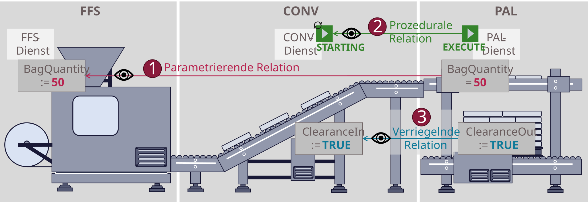

#### 4.2.2 System Architecture of a Choreographed Logistics Line

The technical implementation of the principle described in [Section 4.2.1](#421-application-example) follows the choreography concept from [[SFB+21]](../98_References/README.md#stutz-et-al-2021) and [[Stu26]](../98_References/README.md#stutz-2026). [Figure 4.2](#figure-42-abstract-system-architecture-of-a-choreographed-logistics-line) shows the basic architecture of a choreographed logistics line. Each LEA controller provides the execution context for an MTP service and the necessary base functionality for data processing and communication to participate in a choreography — referred to as an **Active Choreography Participant** in [[Stu26]](../98_References/README.md#stutz-2026). Each LEA controller contains a service implemented by the LEA manufacturer according to [Chapter 3](../03_Logistics_Equipment_Assemblies_NEW/03_Logistics_Equipment_Assemblies.md#3-mtp-based-automation-of-logistics-equipment-assemblies), which represents the **Native Control Program** as defined in [[Stu26]](../98_References/README.md#stutz-2026). To implement the relations between the LEAs described in [Section 4.2.1](#421-application-example), this service is enabled to observe variables of other LEAs' services within the choreography and to behave according to their values. In [[Stu26]](../98_References/README.md#stutz-2026) internal relations (within a single LEA) and external relations (between different LEAs) are distinguished. The interactions between the LEAs of a logistics line require only external relations, which are implemented through configurable communication mechanisms — referred to as **Configurable Communication** in [[Stu26]](../98_References/README.md#stutz-2026). Additionally, each LEA contains internally configured behavioral rules that describe how the LEA should react to the signals provided by other LEAs — referred to as **Configurable Logic** in [[Stu26]](../98_References/README.md#stutz-2026).

##### Figure 4.2: Abstract System Architecture of a Choreographed Logistics Line
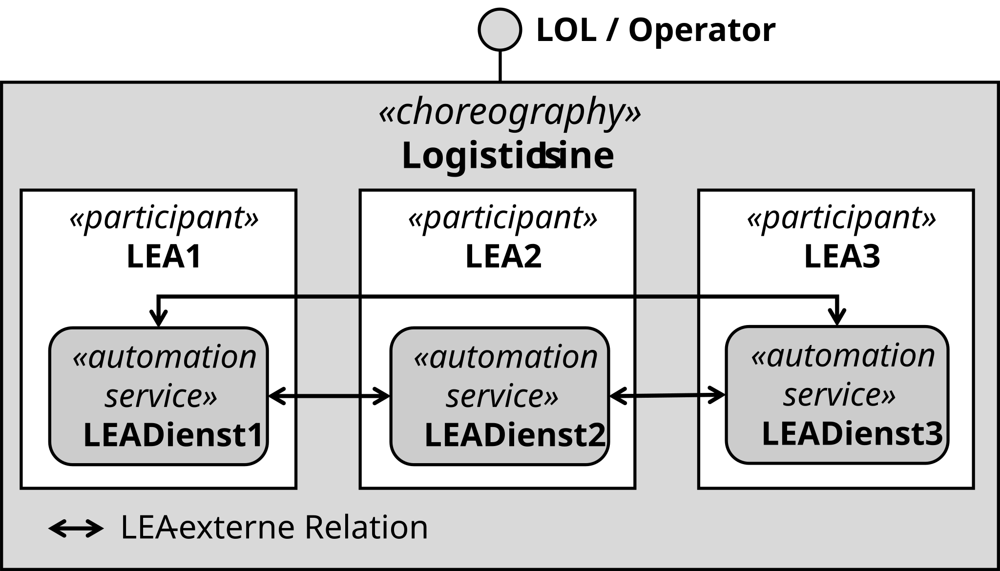

#### 4.2.3 Architecture of a LEA as a Choreography Participant

[Figure 4.3](#figure-43-architecture-of-an-lea-as-a-choreography-participant) shows the basic architecture of an Active Choreography Participant (hereafter referred to as **Choreography Participant**) according to [[Stu26]](../98_References/README.md#stutz-2026). Every LEA must follow this architecture to participate in a choreography. Each LEA controller contains a LEA service according to [Chapter 3](../03_Logistics_Equipment_Assemblies_NEW/03_Logistics_Equipment_Assemblies.md#3-mtp-based-automation-of-logistics-equipment-assemblies), which is enabled to participate in a choreography through additional software components. For this purpose, [[Stu26]](../98_References/README.md#stutz-2026) defines the design patterns **Configurable Logic** and **Configurable Communication**.

##### Figure 4.3: Architecture of a LEA as a Choreography Participant
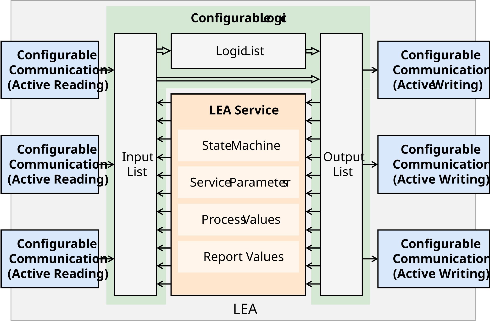

#### 4.2.4 Configurable Logic

The Configurable Logic components (green in [Figure 4.3](#figure-43-architecture-of-an-lea-as-a-choreography-participant)) enable configurable processing of available information, which can originate from within the LEA or from other LEAs. Outputs of the LEA service serve as LEA-internal inputs of the Configurable Logic, managed in an **Input List**. Additionally, information from other LEAs is managed as LEA-external inputs in the Input List. The information in the Input List can be processed by configurable functions managed in a **Logic List**. The resulting outputs of the Configurable Logic, managed in an **Output List**, are fed back LEA-internally as inputs to the LEA service, where they can trigger state transitions or changes to process values, parameters, or report values. Furthermore, information managed in the Output List can be made available to other LEAs as LEA-external inputs. [Figure 4.4](#figure-44-components-of-the-configurable-logic-software-pattern) shows the components of the design pattern *Configurable Logic* according to [[Stu26]](../98_References/README.md#stutz-2026).

##### Figure 4.4: Components of the Configurable Logic Software Pattern
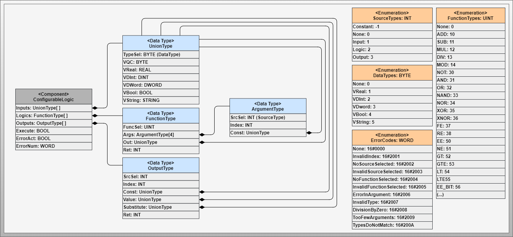

The central *ConfigurableLogic* component controls the execution of the Configurable Logic. It has access to the Input, Logic, and Output List. During execution, values are read from the Input List, processing is applied, and results are written to the Output List. For a more detailed description of this information model and the operation of the *ConfigurableLogic* please refer to [[Stu26]](../98_References/README.md#stutz-2026). This work also introduces the necessary data types and enumerations that describe the information model stored in the three lists.

#### 4.2.5 Configurable Communication

The Configurable Communication components (blue in [Figure 4.3](#figure-43-architecture-of-an-lea-as-a-choreography-participant)) provide configurable data exchange between LEAs within a choreography. The goal is that each LEA receives the LEA-external information it requires for executing the processing functions configured in its Logic List. To enable communication between LEAs from different manufacturers, a standardized communication technology is used. Consistent with existing concepts in the MTP environment, this work employs OPC UA Client/Server. For this communication technology, [[Stu26]](../98_References/README.md#stutz-2026) provides two communication variants — active reading and active writing. In the case of active reading, information is read from another LEA's Input List and transferred into the local Input List. In the case of active writing, information from the local Output List is written into another LEA's Input List. Additionally, active writing can be used according to [[Stu26]](../98_References/README.md#stutz-2026) and [[SFB+23]](../98_References/README.md#stutz-et-al-2023) to integrate non-choreography-enabled equipment via decentralized orchestration. To support all these variants, this work specifies MTP concepts for both active reading and active writing. However, as analyzed in [[Stu26]](../98_References/README.md#stutz-2026), the active reading variant is recommended. Therefore, this variant is particularly focused and also implemented and evaluated as part of the evaluation ([Chapter 7](../07_Application_Examples/07-00_Intro.md)). [Figure 4.5](#figure-45-components-of-the-configurable-communication-software-pattern) shows the components of the design pattern *Configurable Communication* according to [[Stu26]](../98_References/README.md#stutz-2026).

##### Figure 4.5: Components of the Configurable Communication Software Pattern
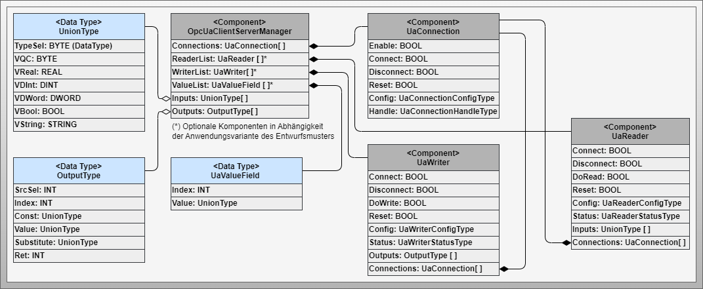

The central *OpcUaClientServerManager* component manages and executes the Configurable Communication. It manages components for configuring and executing OPC UA connections (*UaConnections*) between participants as well as, depending on the communication variant, components for configuring and executing read and/or write operations (*UaReaders* and *UaWriters*, respectively). It also has access to the Input and Output Lists. For the active reading variant, configured *UaReaders* read values from other LEAs and transfer them into the local Input List. In the case of active writing, a *ValueList* additionally serves as a passive input channel that other LEAs can write to via corresponding *UaWriters*. These values are then forwarded to specific Input List indices. For a more detailed description of this information model and the operation of the components please refer to [[Stu26]](../98_References/README.md#stutz-2026). This work also introduces the necessary data types and enumerations that describe the information model of the Configurable Communication.

#### 4.2.6 UnionType

All information exchanged between the LEAs of a logistics line carries the data type *UnionType* according to the concepts in [[Stu26]](../98_References/README.md#stutz-2026), shown in [Figure 4.6](#figure-46-uniontype-data-type). The distinctive feature of this type is that it holds (currently five) variables of different data types, of which one is selected for use. This allows the data type to be determined at runtime even on controller systems that require the data type to be defined at engineering time.

##### Figure 4.6: UnionType Data Type
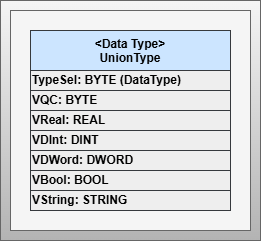

#### 4.2.7 Semantic Models for LEA Integration into a Choreography Configurator

For a Choreography Configurator in the LOL, the contents of the Input and Output Lists of each LEA must be semantically identifiable. [Figure 4.7](#figure-47-structure-of-the-input-and-output-lists-of-a-lea) shows the basic structure of these lists schematically. Within these lists, fixed, configurable, and writable elements can be distinguished:

- **Fixed elements** are hard-coded by the LEA program and immutable. In the case of the Input List, these are fixed outputs of the LEA service (e.g., its state or current procedure); in the case of the Output List, these are fixed inputs to the LEA service (e.g., service commands or procedure selection).
- **Configurable elements** are placeholders for values to be read from other LEAs (in the case of the Input List) or written to other LEAs (in the case of the Output List).
- **Writable elements** are placeholders for values that are written from other LEAs into the Input List.

During LEA engineering, a fixed number of configurable and writable elements is defined, which can be connected to concrete relations with other LEAs during choreography configuration.

##### Figure 4.7: Structure of the Input and Output Lists of a LEA
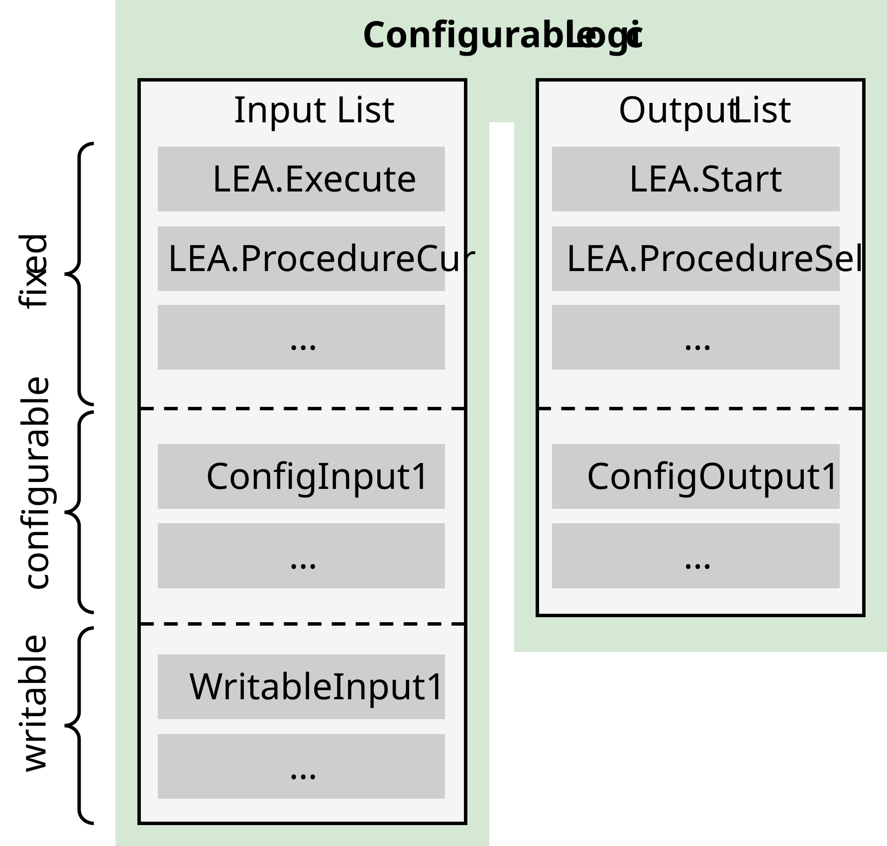

To represent these contents in an MTP, the model definition *ChoreographyParticipant* is introduced to identify a LEA as a potential choreography participant. The MTP model definitions *InputList* and *OutputList* are introduced to represent the Input and Output Lists of the LEA, organizing corresponding *InputElements* and *OutputElements*. According to the distinction between fixed, configurable, and writable elements, the concrete model definitions of Input and Output elements shown in [Table 4.1](#table-41-element-types-in-the-input-and-output-lists-of-an-lea) are introduced. The corresponding interface definitions are described in the following [Section 4.2.8](#428-interfaces-for-configuring-horizontal-interaction).

##### Table 4.1: Element Types in the Input and Output Lists of a LEA

<table>
  <tr>
    <th align="left">Model Definition</th>
    <th align="left">Interface Definition</th>
    <th align="left">Description</th>
  </tr>
  <tr>
    <td align="left"><em>FixedInputElement</em></td>
    <td align="left"><em>UnionElement</em></td>
    <td align="left">Fixed outputs of the LEA service that serve as inputs for the Configurable Logic (e.g., service states). Not modifiable by configuration.</td>
  </tr>
  <tr>
    <td align="left"><em>FixedOutputElement</em></td>
    <td align="left"><em>UnionElement</em></td>
    <td align="left">Fixed outputs of the Configurable Logic that serve as inputs to the LEA service (e.g., service commands). Not modifiable by configuration.</td>
  </tr>
  <tr>
    <td align="left"><em>ConfigurableInputElement</em></td>
    <td align="left"><em>UnionElement</em></td>
    <td align="left">Configurable inputs for the Configurable Logic that are read from other LEAs via read operations (active reading variant). Configuration specifies the source.</td>
  </tr>
  <tr>
    <td align="left"><em>ConfigurableOutputElement</em></td>
    <td align="left"><em>UnionElement</em></td>
    <td align="left">Configurable outputs of the Configurable Logic that are written to other LEAs via write operations (active writing variant). Configuration specifies the target.</td>
  </tr>
  <tr>
    <td align="left"><em>WritableInputElement</em></td>
    <td align="left"><em>WritableUnionElement</em></td>
    <td align="left">Passive inputs for the Configurable Logic that other LEAs can write values into (active writing variant).</td>
  </tr>
</table>

#### 4.2.8 Interfaces for Configuring Horizontal Interaction

MTP-based interfaces for configuring the Configurable Logic and the Configurable Communication are required to download a choreography configuration from a Choreography Configurator into the LEA controller.

#### Configurable Logic

[Section 4.2.3](#423-architecture-of-an-lea-as-a-choreography-participant) introduces the *ConfigurableLogic* component for controlling the execution of the Configurable Logic according to [[Stu26]](../98_References/README.md#stutz-2026). To interact with this component, the MTP interface definition *ChoreographyParticipantManager* is specified in this work. The *ChoreographyParticipantManager* interface can also be embedded as a dynamic HMI element in the LEA operator display. It provides index-based access to the elements of the Input, Logic, and Output Lists, and supports executing, stopping, and resetting a configuration. A configuration (*PreparedConfiguration*) can first be fully prepared and only activated once it is complete. During the configuration phase, a different configuration (*ActiveConfiguration*) can remain active. Both configurations can be displayed via the *ChoreographyParticipantManager* interface, but only the *PreparedConfiguration* can be edited.

#### Configurable Communication

[Section 4.2.3](#423-architecture-of-an-lea-as-a-choreography-participant) introduces the *OpcUaClientServerManager* component for controlling the execution of the Configurable Communication based on OPC UA Client/Server according to [[Stu26]](../98_References/README.md#stutz-2026). To interact with this component, a same-named MTP interface definition *OpcUaClientServerManager* is specified in this work. The *OpcUaClientServerManager* interface can also be embedded as a dynamic HMI element in the LEA operator display. It provides index-based access to lists of connections (*UaConnections*), read operations (*UaReaders*), write operations (*UaWriters*), and writable value fields (*ValueFields*). For each connection, configuration variables as well as variables for connection establishment and teardown are provided, based on the *UA\_Connect* and *UA\_Disconnect* interfaces of the PLCopen specification [[OPC 30001]](../98_References/README.md#opc-30001). For read and write operations, variables for assigning the operation to a connection and for configuring the variables to be read or written are provided, based on the *UA\_ReadList* and *UA\_WriteList* interfaces of the PLCopen specification [[OPC 30001]](../98_References/README.md#opc-30001). Each read operation is mapped to an Input List index to which the read value is transferred. Each write operation is mapped to an Output List index from which the value to be written is read. For each value field, variables for configuring the data type and displaying the current value are provided. As with the *ChoreographyParticipantManager*, a *PreparedConfiguration* and an *ActiveConfiguration* are distinguished for all configurations of connections, read and write operations, and value fields.

[Section 4.2.6](#426-uniontype) introduces the *UnionType* data type for transmitting values with runtime-definable data types according to [[Stu26]](../98_References/README.md#stutz-2026). To implement this data type, the MTP interface definition *UnionElement* is introduced, which enables displaying a value of various data types. The active writing communication variant additionally requires writing to a value with a definable data type. This is enabled by the MTP interface definition *WritableUnionElement*.

> **Note on vendor-neutral information exchange:** The Configurable Communication design pattern fundamentally enables the exchange of all information available in a LEA with other LEAs of a choreographed Logistics Line. However, to enable vendor-neutral interaction between LEAs, variables of the standardized MTP-based LEA interfaces according to [Chapter 3](../03_Logistics_Equipment_Assemblies_NEW/03_Logistics_Equipment_Assemblies.md#3-mtp-based-automation-of-logistics-equipment-assemblies) should be exchanged wherever possible. An exception is the interface of an External Lead (see [Section 4.3.1](#431-line-interface)), for which DoRequest and DoneReply relations are recommended according to [[Stu26]](../98_References/README.md#stutz-2026), enabling different start and end of a choreography relation across multiple LEA services.

#### 4.2.9 ChoreographySet

To represent the model and interface definitions introduced in [Section 4.2.7](#427-semantic-models-for-lea-integration-into-a-choreography-configurator) and [Section 4.2.8](#428-interfaces-for-configuring-horizontal-interaction), a new MTP aspect *ChoreographySet* is introduced. This section provides an overview of this aspect; a detailed description is given in the [Section 8.7](../08_MTP%20Extensions/08-07_ChoreographySet.md#87-mtp-specification-of-the-choreographyset). For integration into a Choreography Configurator, the Input and Output Lists of a LEA are modeled with the elements described in [Section 4.2.7](#427-semantic-models-for-lea-integration-into-a-choreography-configurator). All Input and Output elements of types *FixedInputElement*, *FixedOutputElement*, *ConfigurableInputElement*, and *ConfigurableOutputElement* are assigned a *UnionElement* interface. Each *WritableInputElement* is assigned a *WritableUnionElement* interface. Configurable Communication is configured via an *OpcUaClientServerManager* interface. This interface contains one *UaReader* per *ConfigurableInputElement* and one *UaWriter* per *ConfigurableOutputElement*, which can be configured according to the choreography configuration to be loaded. Additionally, this interface contains one *ValueField* per *WritableInputElement*, which other LEAs can write to. Configurable Logic is configured via a *ChoreographyParticipantManager* interface, which is assigned to the *ChoreographyParticipant* model definition. The use of the newly introduced MTP interface and model definitions for implementing choreography relations is described in the [Section 7.3.4](../07_Application_Examples/07-03_BagFillingLine.md#734-implementation-of-choreography-relations-using-the-models-and-interfaces-of-the-choreographyset) for the principles of active reading and active writing using OPC UA Client/Server.

### 4.3 Vertical Integration of a Logistics Line into a Logistics Orchestration Layer

#### 4.3.1 Line Interface

The Line Interface exposes the functionality of a choreographed Logistics Line to a superordinate LOL. The Logistics Line can be parametrized, controlled, and monitored via this interface as if it was a single MTP service, and should behave accordingly.

The interface of each LEA service according to [Chapter 3](../03_Logistics_Equipment_Assemblies_NEW/03_Logistics_Equipment_Assemblies.md#3-mtp-based-automation-of-logistics-equipment-assemblies) consists of the components shown in [Figure 4.8](#figure-48-components-of-an-lea-service-interface). Exactly one *ServiceControl* interface is a mandatory component of every MTP service according to [[PNO Part 4]](../98_References/README.md#pno-2025-part4). It provides access to the service's underlying state machine and its procedures. As optional components, the service interface also contains any number of parameters, report values, and process values, for which interfaces of various data types are defined in [[PNO Part 4]](../98_References/README.md#pno-2025-part4) and in [Chapter 3](../03_Logistics_Equipment_Assemblies_NEW/03_Logistics_Equipment_Assemblies.md#3-mtp-based-automation-of-logistics-equipment-assemblies).

##### Figure 4.8: Components of a LEA Service Interface
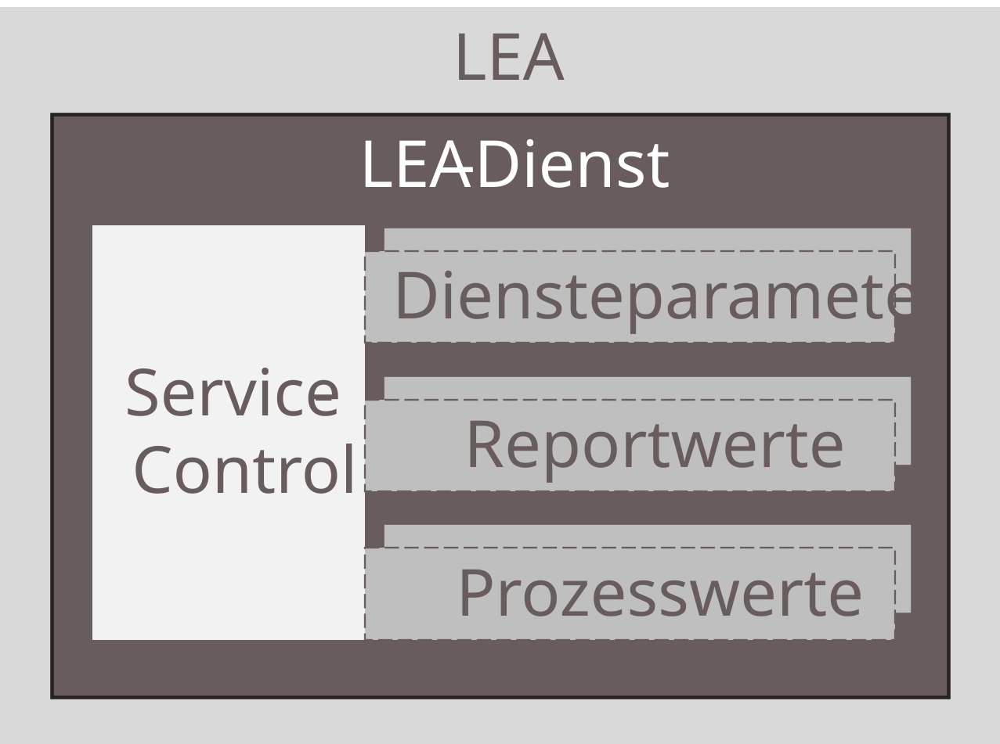

The Line Interface is a combination of the interfaces of multiple LEA services participating in the choreography. However, not all interface components of the individual LEA services are adopted into the Line Interface. A portion of the LEA service interfaces is controlled by choreography-internal logic and is therefore not accessible from outside. [Figure 4.9](#figure-49-components-of-the-line-interface-of-a-choreographed-logistics-line) shows an example of how a Line Interface can be composed.

##### Figure 4.9: Components of the Line Interface of a Choreographed Logistics Line
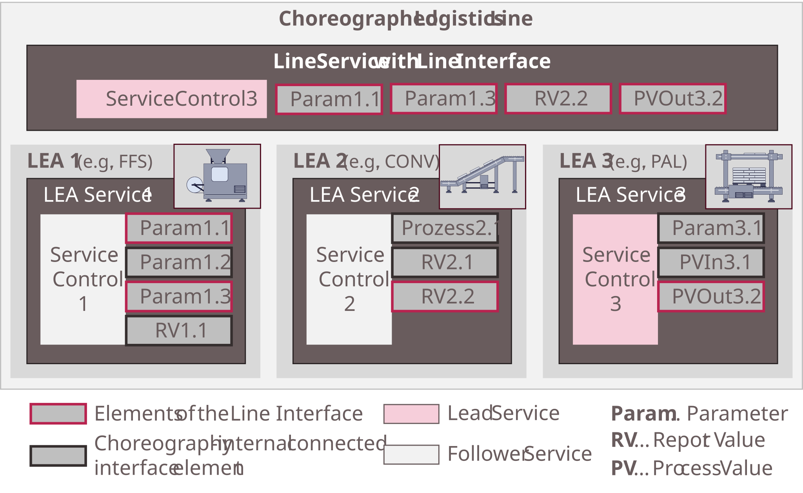

##### Service and procedure interfaces

Every choreography has a leading service — referred to as **Lead Service** in [[Stu26]](../98_References/README.md#stutz-2026) — which provides its state machine as the state machine of the choreography. This means the state of the Lead Service reflects the state of the entire choreography. The Lead Service also accepts commands for the choreography (e.g., start, stop) and enables procedure selection. As Lead Service, one of the LEA services already participating in the choreography can be used (**Internal Lead** in [[Stu26]](../98_References/README.md#stutz-2026)) or a separate service is included solely as Lead Service in the choreography (**External Lead** in [[Stu26]](../98_References/README.md#stutz-2026)). For Logistics Lines, an External Lead is preferred because, due to the line structure, most functions (e.g., startup sequences) are initiated at one LEA and end at another (e.g., initiation at the last LEA and orderly startup through to the first LEA). The External Lead can run on one of the LEA controllers or on an external system and must follow the concepts described in [Section 4.2](#42-horizontal-integration-of-logistics-equipment-assemblies-into-a-logistics-line).

The *ServiceControl* interface of the Lead Service is adopted 1:1 as the *ServiceControl* component of the Line Interface ([Figure 4.9](#figure-49-components-of-the-line-interface-of-a-choreographed-logistics-line), "ServiceControl3"). The procedures of the Lead Service and their *ProcedureHealthView* interfaces are also adopted into the Line Interface. The choreography logic must relay commands and procedure settings at the *ServiceControl* interface to all other LEA services — referred to as **Follower Services** in [[Stu26]](../98_References/README.md#stutz-2026) — such that the choreography fulfills its intended function.

Since the Lead Service must be controllable by LOL automation or by an operator, it operates in *AutomaticExternal* or *Operator* mode according to [[PNO Part 4]](../98_References/README.md#pno-2025-part4). All Follower Services are controlled exclusively by LEA-internal logic (based on Configurable Logic) and therefore operate in *AutomaticInternal* mode. Operating modes are configured via behavioral rules in the Configurable Logic.

##### Parameter, report value, and process value interfaces

The parameters, report values, and process values of the Line Interface consist of selected parameter, report value, and process value interfaces from the LEAs participating in the choreography that are relevant for the overall functionality of the choreographed Logistics Line ([Figure 4.9](#figure-49-components-of-the-line-interface-of-a-choreographed-logistics-line), "Param1.1", "Param1.3", "RV2.2", and "PV3.2"). These interface components are adopted 1:1 into the Line Interface and can be set or further processed from outside the choreography. All remaining parameter, report value, and process value interfaces are set and processed choreography-internally as needed.

All parameters available at the Line Interface must be controllable by automated order management or an operator. They therefore operate in *AutomaticExternal* or *Operator* mode according to [[PNO Part 4]](../98_References/README.md#pno-2025-part4). All parameters that are exclusively set and processed choreography-internally are controlled by LEA-internal logic (based on Configurable Logic) and therefore operate in *AutomaticInternal* mode. The configuration of operating modes for parameters is performed via behavioral rules in the Configurable Logic.

#### 4.3.2 Line HMI

For visualization and manual operation of the Logistics Line, the operator displays of the individual LEAs are combined into a Line HMI. Four different variants for this combination are distinguished according to [Table 4.2](#table-42-variants-for-combining-lea-operator-displays-into-a-line-hmi), which can also be combined with each other. To illustrate these variants, [Figure 4.10](#figure-410-individual-operator-displays-of-three-leas) shows the operator displays of three example LEAs, and the subsequent [Figures 4.11](#figure-411-line-hmi-combination-variant-1) through [4.13](#figure-413-line-hmi-combination-variants-3-and-4) show the resulting Line HMIs using the four presented combination variants.

##### Figure 4.10: Individual Operator Displays of Three LEAs
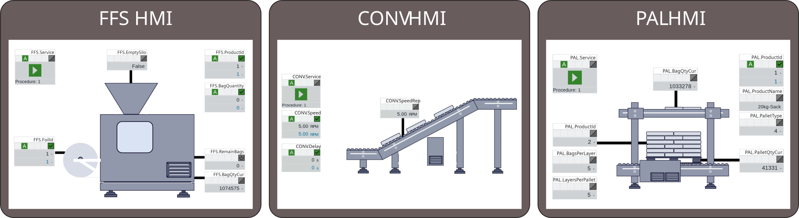

##### Table 4.2: Variants for Combining LEA Operator Displays into a Line HMI

<table>
  <tr>
    <th align="left">Variant</th>
    <th align="left">Description</th>
  </tr>
  <tr>
    <td align="left"><strong>Variant 1:</strong> Object-level combination in one display</td>
    <td align="left">Selected display objects from individual LEA displays are arranged on the Line HMI and optionally supplemented with new static elements representing line-specific features (e.g., connecting conveyors).</td>
  </tr>
  <tr>
    <td align="left"><strong>Variant 2:</strong> Display-in-display combination</td>
    <td align="left">Complete LEA displays are embedded into the Line HMI display, producing a composite display that contains other displays.</td>
  </tr>
  <tr>
    <td align="left"><strong>Variant 3:</strong> Displays integrated into the display hierarchy</td>
    <td align="left">Complete LEA displays are inserted into the Line HMI display hierarchy, possibly at different hierarchy levels.</td>
  </tr>
  <tr>
    <td align="left"><strong>Variant 4:</strong> Display hierarchies combined</td>
    <td align="left">The complete display hierarchies of individual LEAs are integrated into the Line HMI display hierarchy, possibly at different hierarchy levels.</td>
  </tr>
</table>

##### Figure 4.11: Line HMI Combination Variant 1
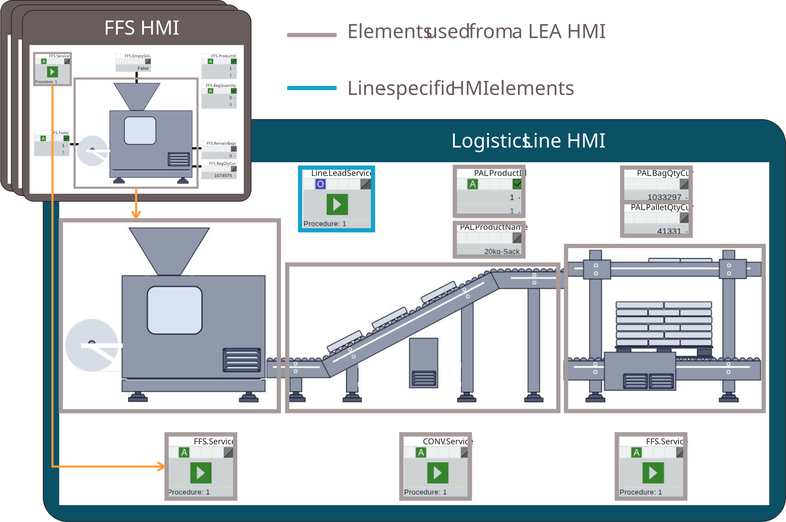

##### Figure 4.12: Line HMI Combination Variant 2
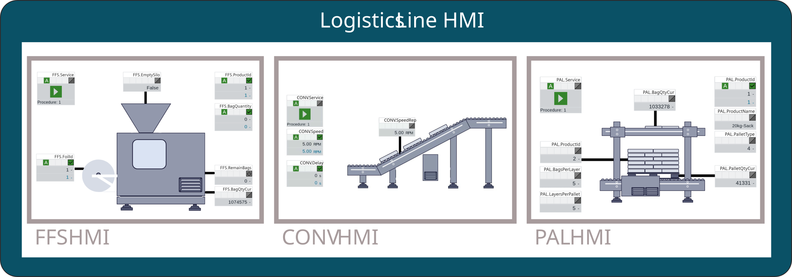

##### Figure 4.13: Line HMI Combination Variants 3 and 4
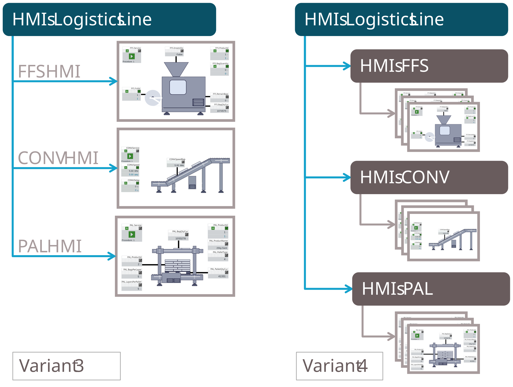

#### 4.3.3 Composed MTP

For automated vertical integration of a choreographed Logistics Line into a LOL, a shared MTP for the line — the **Composed MTP** — is introduced. It describes the Line Interface and the Line HMI. When a Composed MTP is imported, only the information relevant to the line is loaded into the LOL.

#### 4.3.4 Re-Modeling vs. Referencing

The Line Interface and Line HMI to be modeled in the Composed MTP are composed of interface and model elements from the LEAs participating in the Logistics Line. These are already modeled in the LEA MTPs and can be reused during Composed MTP modeling. Two possible approaches exist for this reuse, which are described and evaluated in [Table 4.3](#table-43-evaluation-of-modeling-approaches-for-composed-mtps).

##### Table 4.3: Evaluation of Modeling Approaches for Composed MTPs

<table>
  <tr>
    <th align="left" colspan="2"><strong>1) Re-modeling</strong></th>
  </tr>
  <tr>
    <td align="left" colspan="2">The models and interfaces of the LEA MTPs relevant for the Line Interface and Line HMI are re-modeled in the Composed MTP model. The original LEA MTPs are not directly used for the description of the choreographed type.</td>
  </tr>
  <tr>
    <td align="left">Advantages</td>
    <td align="left">The Composed MTP closely resembles the MTP of a single LEA and can be integrated into a superordinate LOL in a very similar manner.</td>
  </tr>
  <tr>
    <td align="left">Disadvantages</td>
    <td align="left">The modeling of the Composed MTP duplicates the modeling of the LEA MTPs. Mechanisms are required to ensure consistency between the LEA MTPs and the Composed MTP. Changes require updates in both the LEA MTP and the Composed MTP.</td>
  </tr>
  <tr>
    <th align="left" colspan="2"><strong>2) Referencing</strong></th>
  </tr>
  <tr>
    <td align="left" colspan="2">The LEA MTPs are made accessible to the Composed MTP. From the Composed MTP model, models and interfaces of the LEA MTPs are referenced wherever possible. The LEA MTPs thus serve as the basis for the description of the choreographed type.</td>
  </tr>
  <tr>
    <td align="left">Advantages</td>
    <td align="left">Only the Logistics-Line-specific content is modeled in the Composed MTP; no duplicate modeling compared to the LEA MTPs. Additionally, the integrity of the referenced LEA MTP models and interfaces can be verified via the LEA MTP package signature.</td>
  </tr>
  <tr>
    <td align="left">Disadvantages</td>
    <td align="left">The referencing mechanism required for this approach is a distinctive feature of Composed MTPs compared to MTPs of individual LEAs. A LOL that can integrate LEA MTPs cannot automatically integrate Composed MTPs. Special integration mechanisms are required to resolve the references.</td>
  </tr>
</table>

> **Design decision:** **Referencing** is chosen as the modeling approach for Composed MTPs. The current MTP specification allows only one OPC UA server per MTP [[PNO Part 5.1]](../98_References/README.md#pno-2025-part51). A Composed MTP must retrieve information from multiple OPC UA servers of multiple LEAs, so special integration mechanisms beyond those for LEA MTPs are required regardless. The advantages of referencing therefore outweigh its disadvantages.

#### 4.3.5 Structure of a Composed MTP

[Figure 4.14](#figure-414-basic-structure-of-a-composed-mtp) shows the basic structure of a Composed MTP. As described above, the MTP files of the LEAs participating in the Logistics Line form the modeling basis, as they already contain a large portion of the MTP components to be modeled. To reference MTP components of the LEA MTPs, these are added to the Composed MTP as attachments ([Figure 4.14](#figure-414-basic-structure-of-a-composed-mtp), "LEA MTPs"). From these MTPs, the components necessary for describing the Line Interface and the Line HMI must be selected and combined in a suitable manner. For this purpose, MTP-based semantic models in the individual aspects of the Composed MTP ([Figure 4.14](#figure-414-basic-structure-of-a-composed-mtp), "Semantic Models") are used, which resemble the semantic models of a LEA MTP.

##### Figure 4.14: Basic Structure of a Composed MTP
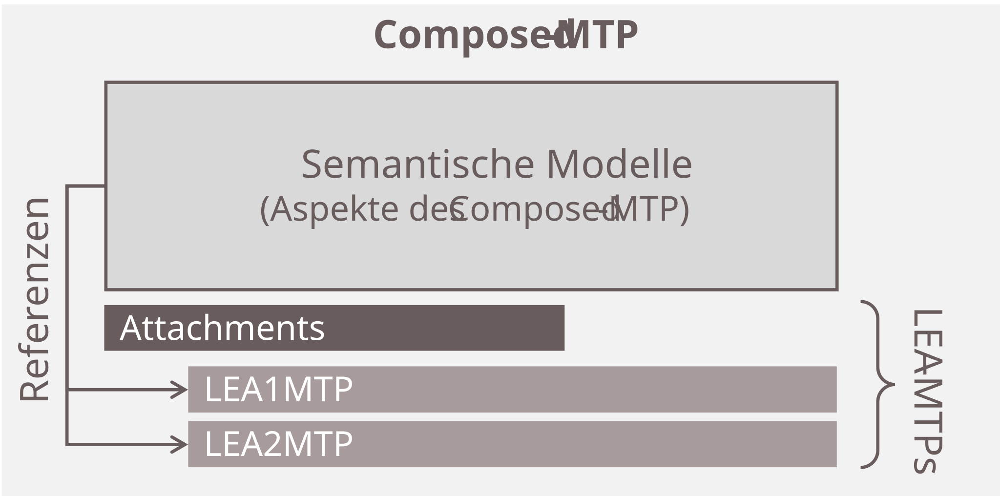

#### 4.3.6 Referencing Mechanism

The LEA MTPs are stored in a separate folder "MTPs" in the attachment of the Composed MTP and registered in its *AttachmentSet* according to the mechanisms from [[PNO Part 1]](../98_References/README.md#pno-2025-part1) ([Figure 4.15](#figure-415-referencing-mechanism-of-a-composed-mtp), green reference). An *AttachmentGroup* is created for the LEA MTPs. It contains one instance of the *IC AttachmentReference* for each MTP, referencing the respective MTP file. These *AttachmentReferences* simultaneously describe the participant roles that must be filled by LEA instances to implement the choreographed function. The names of the *AttachmentReferences* correspond to *RoleIdents* that are also used for instance verification of choreographed functions ([Section 8.1.3](../08_MTP%20Extensions/08-01_Manifest.md#813-workflows)). According to [[PNO Part 1]](../98_References/README.md#pno-2025-part1), the attribute *refUri* contains the path to the MTP file. The attributes *DocumentType* and *MIMEType* specify the type of the attached document — for Composed MTPs, *DocumentType* is always set to "ModuleTypePackage" and *MIMEType* to "application/mtp".

<!-- TODO: Abbildung anpassen, inkl. AML-Modellierung -->
##### Figure 4.15: Referencing Mechanism of a Composed MTP
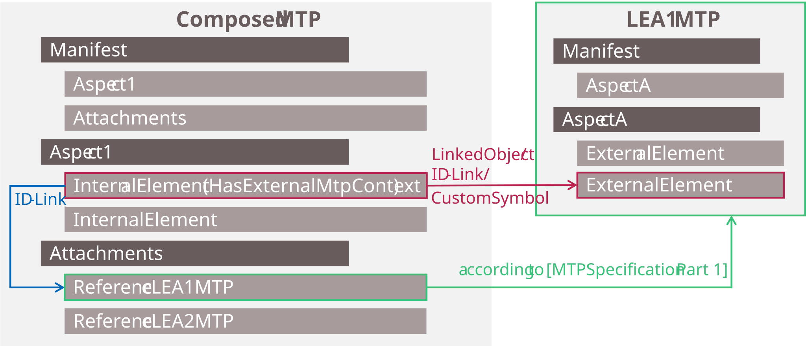

To reference specific components of the attached LEA MTPs, two references are required as shown in [Figure 4.15](#figure-415-referencing-mechanism-of-a-composed-mtp):

**1) Context assignment to a LEA MTP:** First, a reference is made to the MTP file containing the MTP component to be referenced (external context). The *RC HasExternalMtpContext* is assigned to every object of the Composed MTP that references external objects of an attached LEA MTP. The *RC HasExternalMtpContext* uses the ID-Link mechanism. It provides a variable *ContextLink* of the *AT IDLinkAttributeType*, which references the *AttachmentReference* of the LEA MTP containing the referenced object ([Figure 4.15](#figure-415-referencing-mechanism-of-a-composed-mtp), blue reference). This context assignment is necessary because the referencing mechanisms described under point 2) are only guaranteed to be unique within a single MTP. Uniqueness of the GUIDs used is not ensured across MTP boundaries, and the LEA MTPs must not be modified.

**2) Reference to the MTP component:** The LinkedObject, ID-Link, or CustomSymbols mechanisms are used to reference the MTP component ([Figure 4.15](#figure-415-referencing-mechanism-of-a-composed-mtp), red reference). The LinkedObject mechanism relies on referencing via identical *RefID* attribute values. The ID-Link mechanism uses a variable of the *AT IDLinkAttributeType* that references the *ObjectID* of another AutomationML object. The CustomSymbols mechanism serves for referencing user-defined static HMI objects. In contrast to their previous use, these mechanisms are now also used for referencing external MTP components. However, their modeling in the Composed MTP does not differ from the existing modeling.

The referencing mechanism formed by the previous point 1) and 2) is referred to as the **ContextReference mechanism** in the following.

#### 4.3.7 Aspects of a Composed MTP

A Composed MTP contains several aspects following the same basic structure as all MTPs ([Figure 4.16](#figure-416-aspects-of-a-composed-mtp)). The entry point is a *ModuleTypePackage* instance hierarchy containing the *Manifest* as the table of contents. Below it is an element of the newly introduced model definition *ComposedModuleTypePackage*, which signals that this is a Composed MTP and carries the metadata needed for type, version, and instance verification of the choreographed function.

The *Manifest* references the various aspects of the Composed MTP, each organized in a separate instance hierarchy:

- **Attachment aspect** (mandatory): contains the attached LEA MTPs and the choreography configuration.
- **Service aspect** (optional): models the Line Interface — the Lead Service *ServiceControl* interface and selected parameter interfaces — using the ContextReference mechanism to reference LEA MTP elements.
- **ProcessValue aspect** (optional): models selected process value and report value interfaces of the Line Interface using the ContextReference mechanism.
- **HMI aspect** (optional): models the Line HMI display hierarchy. Combination variant 1 uses only the ContextReference mechanism. Variant 2 uses a new model definition **PictureFrame**, which references complete displays from attached LEA MTPs and places them at a defined size and position within another display. Variants 3 and 4 use a new model definition **ReferencedPicture**, which references displays or display hierarchies from attached LEA MTPs and inserts them into the Composed MTP's display hierarchy.

The *ServerAssembly* and *DataAssembly* aspects are not required in the Composed MTP, as the relevant information is already contained in the LEA MTPs and is accessed via the ContextReference mechanism. Additional aspects (e.g., *Text*, *Alarm*, *Diagnostics*) may be added in the future.

##### Figure 4.16: Aspects of a Composed MTP
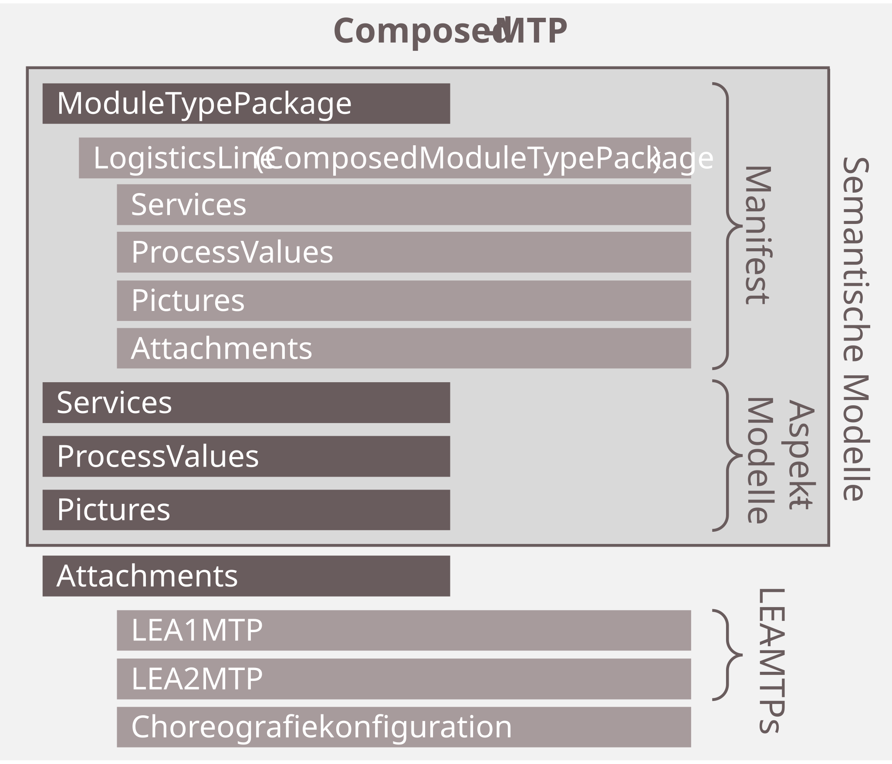

##### Manifest

[Figure 4.17](#figure-417-structure-of-the-manifest-of-a-composed-mtp) shows the structure of the *Manifest* of a Composed MTP. The *Manifest* is organized under a *ModuleTypePackage* instance hierarchy according to [[PNO Part 1]](../98_References/README.md#pno-2025-part1). Below it, an instance of the newly specified *SUC ComposedModuleTypePackage* signals that this is a Composed MTP and contains the information necessary for type, version, and instance verification of composed functions. Under this instance, instances for all aspects contained in the Composed MTP are organized, each referencing its corresponding instance hierarchy via an *IC AspectSetReference*.

##### Figure 4.17: Structure of the Manifest of a Composed MTP
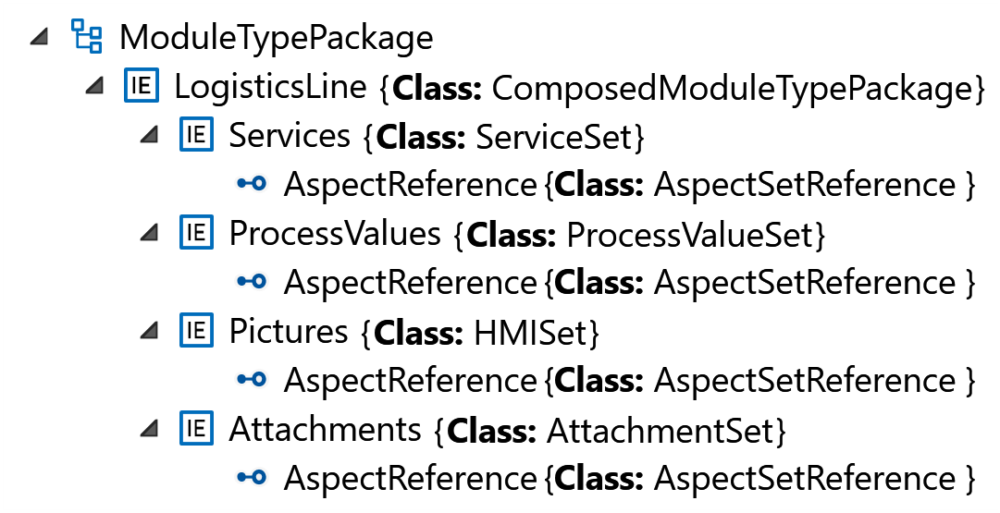

##### ServiceSet

[Figure 4.18](#figure-418-structure-of-the-serviceset-of-a-composed-mtp) shows the structure of the *ServiceSet* of a Composed MTP. This aspect semantically describes the components of the Line Interface. A service for the overall functionality of the Logistics Line is created as an instance of the *SUC Service* according to [[PNO Part 4]](../98_References/README.md#pno-2025-part4). Below it, all procedures available at the Logistics Line are modeled as instances of the *SUC Procedure*. These procedures are assigned the procedure parameters, report values, and process values present at the Line Interface as instances of the *SUC ProcedureParameter*, *SUC ReportValue*, *SUC ProcessValueIn*, or *SUC ProcessValueOut*. In addition to the procedures, all selected configuration parameters are modeled below the *Service* as instances of the *SUC ConfigurationParameter*. To enable communication with the Line Interface, the corresponding *DataAssemblies* from the LEA MTPs are assigned to this model. Based on these, all communication-relevant information can be obtained from the *ServerAssemblySets* of the LEA MTPs. The *DataAssemblies* are referenced using the ContextReference mechanism in combination with the LinkedObject mechanism.

##### Figure 4.18: Structure of the ServiceSet of a Composed MTP
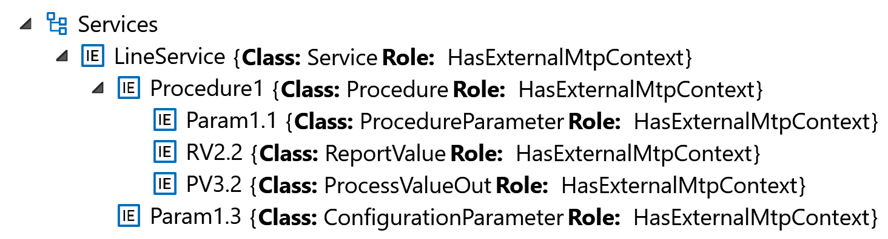

##### ProcessValueSet

[Figure 4.19](#figure-419-structure-of-the-processvalueset-of-a-composed-mtp) shows the structure of the *ProcessValueSet* of a Composed MTP. This aspect semantically describes the process values of the Line Interface. All process values selected for the Line Interface are modeled as instances of the *SUC ProcessValueIn* or *SUC ProcessValueOut*. This enables a semantic description of the process values. As with the *ServiceSet* components, the corresponding *DataAssemblies* from the LEA MTPs are referenced using the ContextReference mechanism in combination with the LinkedObject mechanism.

##### Figure 4.19: Structure of the ProcessValueSet of a Composed MTP
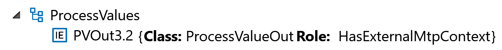

##### HMISet

[Figure 4.20](#figure-420-modeling-of-a-line-hmi-in-the-hmiset-and-attachmentset-of-a-composed-mtp) shows the modeling of a Line HMI in the *HMISet* and *AttachmentSet* of a Composed MTP. This aspect semantically describes the components of the display hierarchy of the Logistics Line. A Line HMI can be modeled as an instance of the *SUC Picture* according to [[PNO Part 2]](../98_References/README.md#pno-2025-part2). This contains subordinate display elements following the conventions from [Chapter 3](../03_Logistics_Equipment_Assemblies_NEW/03_Logistics_Equipment_Assemblies.md#3-mtp-based-automation-of-logistics-equipment-assemblies). These can be display objects from the MTPs of the individual LEAs or new static display elements representing the specific characteristics of the Logistics Line. To reference the corresponding *DataAssemblies* of the LEA MTPs for dynamic display objects, the ContextReference mechanism in combination with the LinkedObject mechanism is used. To reference CustomSymbols from the LEA MTPs, the ContextReference mechanism in combination with the CustomSymbols mechanism is used.

Complete LEA displays can also be integrated into the Line HMI. For this purpose, the newly introduced *SUC PictureFrame* is used. It employs the ContextReference mechanism in combination with the ID-Link mechanism and provides size and position information for the *PictureFrame*, so it can be placed on a Line HMI display similarly to a *VisualObject* according to [[PNO Part 2]](../98_References/README.md#pno-2025-part2).

In addition to the Line HMI, the *HMISet* instance hierarchy can contain references to displays of the individual LEAs. For this purpose, the newly introduced *SUC ReferencedPicture* is used. It employs the ContextReference mechanism in combination with the ID-Link mechanism and enables inserting displays or entire display hierarchies from the LEA MTPs into the Composed MTP's display hierarchy. To **insert a single display**, the *ReferencedPicture* references the display to be inserted via the ID-Link mechanism. To **insert an entire display hierarchy**, the ID-Link reference is left empty — in this case, the complete display hierarchy of the referenced MTP is inserted at the position of the *ReferencedPicture*.

##### Figure 4.20: Modeling of a Line HMI in the HMISet and AttachmentSet of a Composed MTP
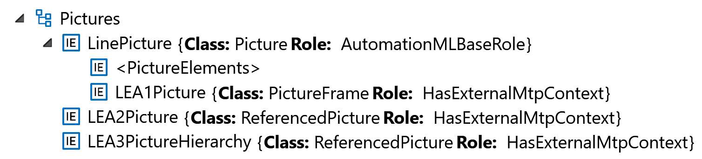

##### AttachmentSet

[Figure 4.21](#figure-421-structure-of-the-attachmentset-of-a-composed-mtp) shows the structure of the *AttachmentSet* of a Composed MTP. This aspect semantically describes the attachments of the Composed MTP. The *AttachmentSet* instance hierarchy contains all LEA MTPs attached to the Composed MTP, organized under a common *AttachmentGroup*. Additionally, the choreography configuration of the Logistics Line is stored in the attachment of the Composed MTP, so it can be loaded onto the LEAs during commissioning. Further attachments can include, for example, CustomSymbols used in the Line HMI or other line-specific documents.

##### Figure 4.21: Structure of the AttachmentSet of a Composed MTP
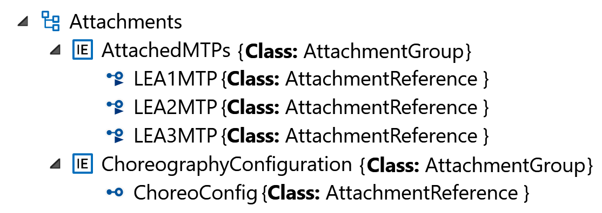

#### 4.3.8 Verification Workflows

In [[PNO Part 1]](../98_References/README.md#pno-2025-part1) type, version, and instance verification workflows are described. In this work, these workflows are extended to cover the verification of choreographed functions and Composed MTPs:

**Type and version verification:** Type and version information of the choreographed function is stored in the Composed MTP. This enables verification that **the correct choreography configuration is loaded** on the LEAs by comparing the stored information against the configuration actually present on the controllers.

**Instance verification:** For each participant role that must be filled in a choreographed Logistics Line, the planned LEA instance is compared against the LEA instance actually installed. This is based on the instance identifier of each LEA and a role ID defined in the Composed MTP, ensuring that **the correct LEA instances are used in the Logistics Line**.

> **Note:** The MTP-based verification workflows do **not** verify whether a choreography is executable or with which parameters it operates correctly. They only verify that the correct choreography configuration is loaded and the correct LEA instances are installed.

For further details on the verification workflows please refer to [Section 8.1.3](../08_MTP%20Extensions/08-01_Manifest.md#813-workflows).

### 4.4 MTP Extensions

The following MTP specification extensions are introduced for the automation of Logistics Lines. [Table 4.3](#table-43-mtp-specification-extensions-for-logistics-line-automation) provides a summary.

##### Table 4.3: MTP Specification Extensions for Logistics Line Automation

<table>
  <tr>
    <th align="left" colspan="3">Interface Definitions</th>
  </tr>
  <tr>
    <th align="left">Profile</th>
    <th align="left">Definition</th>
    <th align="left">Description</th>
  </tr>
  <tr>
    <td align="left">ModuleTypePackage: ChoreographySet.Base V2.0.0</td>
    <td align="left"><em>SUC UnionElement</em> (<a href="../08_MTP%20Extensions/08-07_ChoreographySet.md#table-843-dataassembly-definition-of-suc-unionelement">Table 8.43</a>)</td>
    <td align="left">Interface for reading a value with a runtime-selectable data type</td>
  </tr>
  <tr>
    <td align="left">ModuleTypePackage: ChoreographySet.Base V2.0.0</td>
    <td align="left"><em>SUC WritableUnionElement</em> (<a href="../08_MTP%20Extensions/08-07_ChoreographySet.md#table-844-dataassembly-definition-of-suc-writableunionelement">Table 8.44</a>)</td>
    <td align="left">Interface for writing a value with a runtime-selectable data type</td>
  </tr>
  <tr>
    <td align="left">ModuleTypePackage: ChoreographySet.Base V2.0.0</td>
    <td align="left"><em>SUC ChoreographyElement</em> (<a href="../08_MTP%20Extensions/08-07_ChoreographySet.md#table-845-dataassembly-definition-of-suc-choreographyelement">Table 8.45</a>)</td>
    <td align="left">Base interface for all interfaces required for choreography configuration</td>
  </tr>
  <tr>
    <td align="left">ModuleTypePackage: ChoreographySet.Base V2.0.0</td>
    <td align="left"><em>SUC ChoreographyParticipantManager</em> (<a href="../08_MTP%20Extensions/08-07_ChoreographySet.md#table-846-dataassembly-definition-of-suc-choreographyparticipantmanager">Table 8.46</a>)</td>
    <td align="left">Interface for configuring and controlling the execution of Configurable Logic</td>
  </tr>
  <tr>
    <td align="left">ModuleTypePackage: ChoreographySet.Base V2.0.0</td>
    <td align="left"><em>SUC CommunicationManager</em> (<a href="../08_MTP%20Extensions/08-07_ChoreographySet.md#table-847-dataassembly-definition-of-suc-communicationmanager">Table 8.47</a>)</td>
    <td align="left">Base interface for all Configurable Communication configuration interfaces</td>
  </tr>
  <tr>
    <td align="left">ModuleTypePackage: ChoreographySet.Base V2.0.0</td>
    <td align="left"><em>SUC OpcUaClientServerManager</em> (<a href="../08_MTP%20Extensions/08-07_ChoreographySet.md#table-848-dataassembly-definition-of-suc-opcuaclientservermanager">Table 8.48</a>)</td>
    <td align="left">Interface for configuring and controlling OPC UA Client/Server-based Configurable Communication</td>
  </tr>
  <tr>
    <th align="left" colspan="3">Model Definitions</th>
  </tr>
  <tr>
    <th align="left">Profile</th>
    <th align="left">Definition</th>
    <th align="left">Description</th>
  </tr>
  <tr>
    <td align="left">ModuleTypePackage: ChoreographySet.Base V2.0.0</td>
    <td align="left"><em>IH Choreography</em> (<a href="../08_MTP%20Extensions/08-07_ChoreographySet.md#table-849-model-definition-of-ih-choreography">Table 8.49</a>)</td>
    <td align="left">Instance hierarchy for organizing all choreography-related models of an MTP</td>
  </tr>
  <tr>
    <td align="left">ModuleTypePackage: ChoreographySet.Base V2.0.0</td>
    <td align="left"><em>SUC ChoreographySet</em> (<a href="../08_MTP%20Extensions/08-07_ChoreographySet.md#table-851-model-definition-of-suc-choreographyset">Table 8.51</a>)</td>
    <td align="left">Aspect set organizing all choreography-related model definitions</td>
  </tr>
  <tr>
    <td align="left">ModuleTypePackage: ChoreographySet.Base V2.0.0</td>
    <td align="left"><em>SUC ChoreographyParticipant</em> (<a href="../08_MTP%20Extensions/08-07_ChoreographySet.md#table-852-model-definition-of-suc-choreographyparticipant">Table 8.52</a>)</td>
    <td align="left">Model describing a LEA as a choreography participant</td>
  </tr>
  <tr>
    <td align="left">ModuleTypePackage: ChoreographySet.Base V2.0.0</td>
    <td align="left"><em>SUC InputList</em> (<a href="../08_MTP%20Extensions/08-07_ChoreographySet.md#table-853-model-definition-of-suc-inputlist">Table 8.53</a>)</td>
    <td align="left">Model for the Input List of a LEA</td>
  </tr>
  <tr>
    <td align="left">ModuleTypePackage: ChoreographySet.Base V2.0.0</td>
    <td align="left"><em>SUC OutputList</em> (<a href="../08_MTP%20Extensions/08-07_ChoreographySet.md#table-858-model-definition-of-suc-outputlist">Table 8.58</a>)</td>
    <td align="left">Model for the Output List of a LEA</td>
  </tr>
  <tr>
    <td align="left">ModuleTypePackage: ChoreographySet.Base V2.0.0</td>
    <td align="left"><em>SUC InputElement</em> (<a href="../08_MTP%20Extensions/08-07_ChoreographySet.md#table-854-model-definition-of-suc-inputelement">Table 8.54</a>)</td>
    <td align="left">Model for an element of the Input List</td>
  </tr>
  <tr>
    <td align="left">ModuleTypePackage: ChoreographySet.Base V2.0.0</td>
    <td align="left"><em>SUC OutputElement</em> (<a href="../08_MTP%20Extensions/08-07_ChoreographySet.md#table-859-model-definition-of-suc-outputelement">Table 8.59</a>)</td>
    <td align="left">Model for an element of the Output List</td>
  </tr>
  <tr>
    <td align="left">ModuleTypePackage: ChoreographySet.Base V2.0.0</td>
    <td align="left"><em>SUC FixedInputElement</em> (<a href="../08_MTP%20Extensions/08-07_ChoreographySet.md#table-855-model-definition-of-suc-fixedinputelement">Table 8.55</a>)</td>
    <td align="left">Fixed input element hard-coded by the LEA program</td>
  </tr>
  <tr>
    <td align="left">ModuleTypePackage: ChoreographySet.Base V2.0.0</td>
    <td align="left"><em>SUC FixedOutputElement</em> (<a href="../08_MTP%20Extensions/08-07_ChoreographySet.md#table-860-model-definition-of-suc-fixedoutputelement">Table 8.60</a>)</td>
    <td align="left">Fixed output element hard-coded by the LEA program</td>
  </tr>
  <tr>
    <td align="left">ModuleTypePackage: ChoreographySet.Base V2.0.0</td>
    <td align="left"><em>SUC ConfigurableInputElement</em> (<a href="../08_MTP%20Extensions/08-07_ChoreographySet.md#table-856-model-definition-of-suc-configurableinputelement">Table 8.56</a>)</td>
    <td align="left">Input element for reading a value from another LEA</td>
  </tr>
  <tr>
    <td align="left">ModuleTypePackage: ChoreographySet.Base V2.0.0</td>
    <td align="left"><em>SUC ConfigurableOutputElement</em> (<a href="../08_MTP%20Extensions/08-07_ChoreographySet.md#table-861-model-definition-of-suc-configurableoutputelement">Table 8.61</a>)</td>
    <td align="left">Output element for writing a value to another LEA</td>
  </tr>
  <tr>
    <td align="left">ModuleTypePackage: ChoreographySet.Base V2.0.0</td>
    <td align="left"><em>SUC WritableInputElement</em> (<a href="../08_MTP%20Extensions/08-07_ChoreographySet.md#table-857-model-definition-of-suc-writableinputelement">Table 8.57</a>)</td>
    <td align="left">Passive input element that can be written by another LEA</td>
  </tr>
  <tr>
    <td align="left">ModuleTypePackage: Manifest.Composed V2.0.0</td>
    <td align="left"><em>SUC ComposedModuleTypePackage</em> (<a href="../08_MTP%20Extensions/08-01_Manifest.md#table-81-model-definition-of-suc-composedmoduletypepackage">Table 8.1</a>)</td>
    <td align="left">Base model for a Composed MTP; signals a composed type and carries verification metadata</td>
  </tr>
  <tr>
    <td align="left">ModuleTypePackage: Manifest.Composed V2.0.0</td>
    <td align="left"><em>AT ComposedTypeRevisionType</em> (<a href="../08_MTP%20Extensions/08-01_Manifest.md#table-82-model-definition-of-at-composedtyperevisiontype">Table 8.2</a>)</td>
    <td align="left">Attribute type for version information of a choreographed function</td>
  </tr>
  <tr>
    <td align="left">ModuleTypePackage: Manifest.Composed V2.0.0</td>
    <td align="left"><em>RC HasExternalMtpContext</em> (<a href="../08_MTP%20Extensions/08-01_Manifest.md#table-84-model-definition-of-rc-hasexternalmtpcontext">Table 8.4</a>)</td>
    <td align="left">RoleClass indicating that a referenced object originates from an attached LEA MTP</td>
  </tr>
  <tr>
    <td align="left">ModuleTypePackage: HMISet.Composed V2.0.0</td>
    <td align="left"><em>SUC PictureFrame</em> (<a href="../08_MTP%20Extensions/08-02_HMISet.md#table-85-model-definition-of-suc-pictureframe">Table 8.5</a>)</td>
    <td align="left">Model for embedding a display from an attached LEA MTP into another display (display-in-display, Variant 2)</td>
  </tr>
  <tr>
    <td align="left">ModuleTypePackage: HMISet.Composed V2.0.0</td>
    <td align="left"><em>SUC Picture</em> (extension) (<a href="../08_MTP%20Extensions/08-02_HMISet.md#table-86-model-definition-of-suc-picture">Table 8.6</a>)</td>
    <td align="left">Extension of the existing Picture model to support PictureFrames</td>
  </tr>
  <tr>
    <td align="left">ModuleTypePackage: HMISet.Composed V2.0.0</td>
    <td align="left"><em>SUC SemanticGroup</em> (extension) (<a href="../08_MTP%20Extensions/08-02_HMISet.md#table-87-model-definition-of-suc-semanticgroup">Table 8.7</a>)</td>
    <td align="left">Extension of the existing SemanticGroup model to support PictureFrames</td>
  </tr>
  <tr>
    <td align="left">ModuleTypePackage: HMISet.Composed V2.0.0</td>
    <td align="left"><em>SUC ReferencedPicture</em> (<a href="../08_MTP%20Extensions/08-02_HMISet.md#table-88-model-definition-of-suc-referencedpicture">Table 8.8</a>)</td>
    <td align="left">Model for referencing displays or display hierarchies from attached LEA MTPs into the Composed MTP display hierarchy (Variants 3 and 4)</td>
  </tr>
  <tr>
    <td align="left">ModuleTypePackage: HMISet.Composed V2.0.0</td>
    <td align="left"><em>SUC HMISet</em> (extension) (<a href="../08_MTP%20Extensions/08-02_HMISet.md#table-89-model-definition-of-suc-hmiset">Table 8.9</a>)</td>
    <td align="left">Extension of the existing HMISet model to support ReferencedPictures</td>
  </tr>
  <tr>
    <th align="left" colspan="3">Workflows</th>
  </tr>
  <tr>
    <th align="left">Profile</th>
    <th align="left">Workflow</th>
    <th align="left">Description</th>
  </tr>
  <tr>
    <td align="left">ModuleTypePackage: Manifest.Composed V2.0.0</td>
    <td align="left"><a href="../08_MTP%20Extensions/08-01_Manifest.md#type-verification">Type verification</a></td>
    <td align="left">Verifies the type of the choreography configuration loaded on the LEAs against the type described in the Composed MTP</td>
  </tr>
  <tr>
    <td align="left">ModuleTypePackage: Manifest.Composed V2.0.0</td>
    <td align="left"><a href="../08_MTP%20Extensions/08-01_Manifest.md#version-verification">Version verification</a></td>
    <td align="left">Verifies the version of the choreography configuration loaded on the LEAs against the version described in the Composed MTP</td>
  </tr>
  <tr>
    <td align="left">ModuleTypePackage: Manifest.Composed V2.0.0</td>
    <td align="left"><a href="../08_MTP%20Extensions/08-01_Manifest.md#instance-verification">Instance verification</a></td>
    <td align="left">Verifies that the LEA instances installed in the Logistics Line match the planned instances specified in the Composed MTP</td>
  </tr>
</table>

For the choreography-related model definitions, a new library *SUCL MTPChoreographySUCLib* is introduced. For the *RC HasExternalMtpContext*, a new library *RCL MTPRCLib* is introduced.
