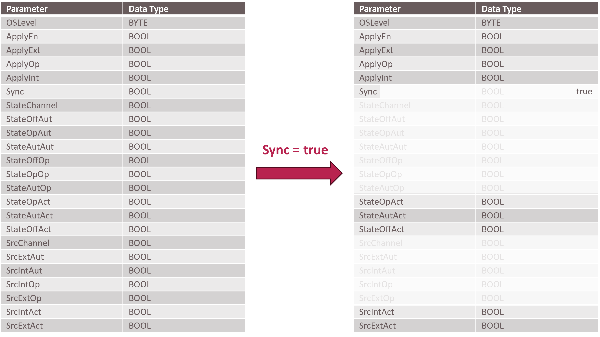

[< Previous](../04_Logistics_HMI/README.md) | [Home](../README.md) | [Next >](../06_Packaging_Line/README.md)

## 5 Systematic Complexity Reduction of Interfaces

The interfaces specified in VDI/VDE/NAMUR 2658-3 [5] and VDI/VDE/NAMUR 2658-4 [3] are defined for a wide range of use cases in the process industry – from laboratory to production. Although these interfaces are necessary for process engineering applications, they are too comprehensive for many use cases in discrete industries like logistics or manufacturing. Therefore, this section is intended to introduce some blueprints to reduce the complexity of MTP interfaces. This section might be extended in a future version of this document.

Since no adaptation of existing MTP interfaces shall be done, it is useful to reduce the complexity of the interfaces by setting reasonable default values. Figure 5.1 shows this principle using the example of the *ParameterElement* interface from VDI/VDE/NAMUR 2658-4 [3], which is part of every MTP parameter interface.

*Figure 5.1: Complexity reduction of the parameter element interface of VDI/VDE/NAMUR 2658-4 [3]*

While in process industry parameters can be operated in an operation mode that differs from the operation mode of the service, in the field of production-related logistics the assumption can be made that parameters always have the same operation mode as the superimposed service. In this case, the variable "Sync" can be set to "true" by default. As a result, many other variables of the interface become irrelevant, and the number of interface variables is reduced from 23 to 10 variables.

In this way, not only a reduction in the complexity of the interface but also a considerable saving of memory in the LEA controller can be achieved. All values greyed out in Figure 5.1 (right) no longer have to be provided in the OPC UA server of the controller but are set to constant values in the MTP. The saving of one Boolean value already corresponds to a saving of more than 100 bytes.

[< Previous](../04_Logistics_HMI/README.md) | [Home](../README.md) | [Next >](../06_Packaging_Line/README.md)