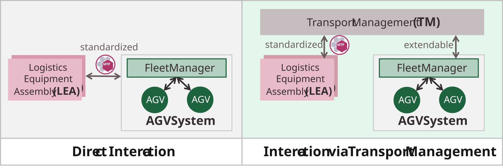
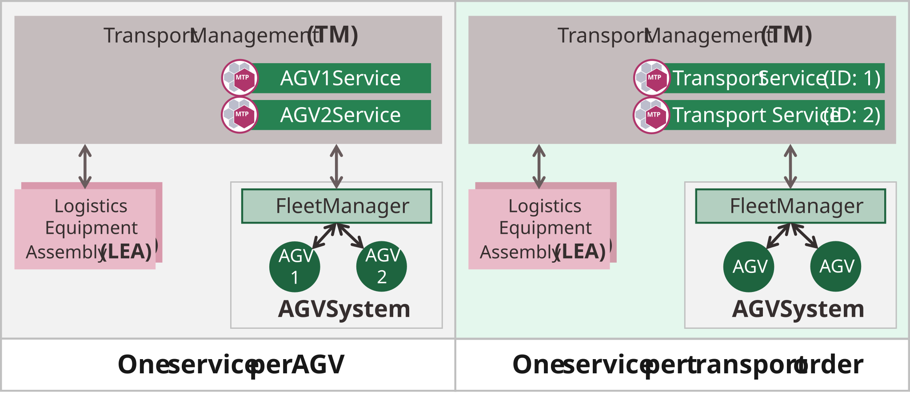
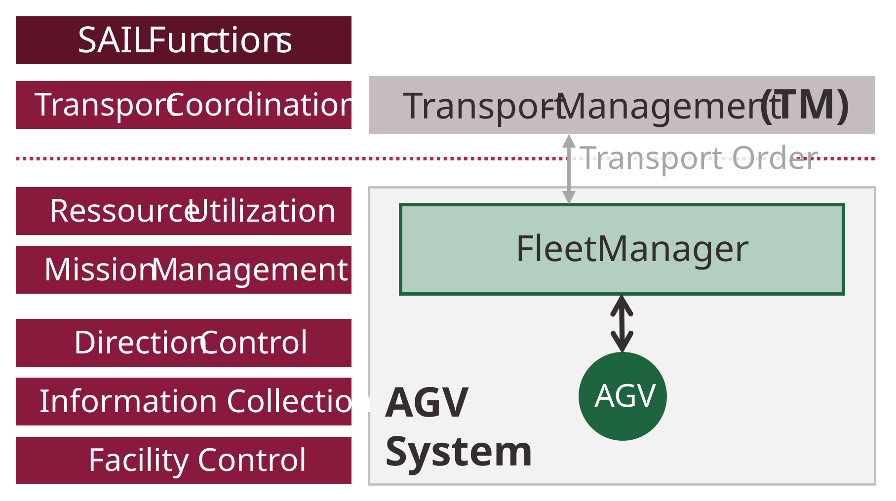
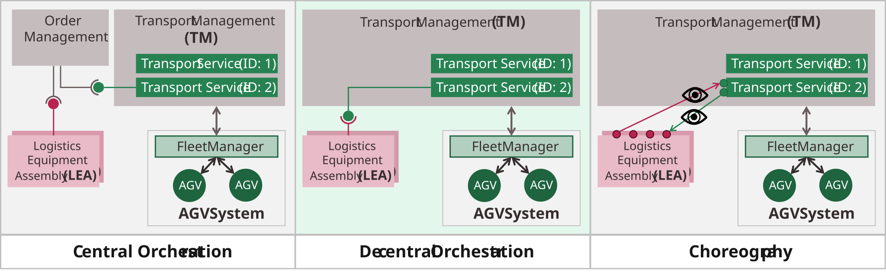
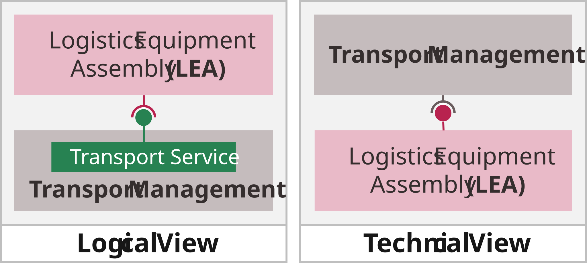
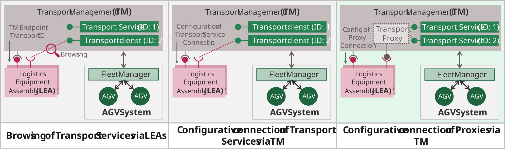

## 5.2 Design Decisions

This section describes fundamental, interdependent design decisions (DDs) that have significantly shaped the development of the architecture presented in [Section 5.1.1](05_Logistics_Area.md#511-architecture).

### 5.2.1 DD1 — Abstraction for Managing the Diversity of AGV Systems

**Decision:** LEAs and AGV systems interact indirectly via the Transport Management as a unifying abstraction layer ([Figure 5.3](#figure-53-options-for-direct-and-indirect-interaction-between-leas-and-agv-systems), right). The Transport Management provides LEAs with a standardized MTP-based interface and interaction mechanism, independent of the number and type of connected AGV systems.

##### Figure 5.3: Options for Direct and Indirect Interaction between LEAs and AGV Systems

**Advantages:**

- Existing AGV systems can be connected to the Transport Management via adapters without modifications, enabling retrofitability for legacy systems.
- Multiple AGV systems can be operated within a Logistics Area and addressed uniformly through the Transport Management.
- LEAs are provided with a standardized interface that is independent of the number and type of connected AGV systems.

**Excluded alternatives:**

- *Direct interaction between LEAs and AGV systems:* Would require MTP-based interfaces on AGV systems (not available today) and would force LEAs to handle different interfaces when multiple AGV systems are used.

>**Hint:** Although this decision enables the use of multiple AGV systems within a Logistics Area, this work focuses on the use of a single AGV system. The challenges and constraints of operating multiple AGV systems should be addressed in future work. Furthermore, DD1 also opens the perspective for integrating other types of flexible transport systems, such as flexible conveyor belt systems.

### 5.2.2 DD2 — Level of Abstraction

**Decision:** Each transport order is represented as one MTP service ([Figure 5.4](#figure-54-abstraction-levels-for-mapping-agv-systems-to-mtp-services), right). The Transport Management does not expose internal properties, occupancies, or states of individual AGVs, but delegates the selection and assignment of suitable AGVs to the fleet manager of the AGV system. Each transport order is managed as an independent instance, allowing LEAs to address and interact with it individually.

##### Figure 5.4: Abstraction Levels for Mapping AGV Systems to MTP Services

**Advantages:**

- The selection of a suitable AGV is encapsulated within the MTP service and delegated to the fleet manager, which is specialized for this task.
- Transport orders are managed as individual MTP services in the Transport Management and made available to the LEAs.
- Changes within the AGV system (e.g., AGVs being dynamically added or removed) do not affect the MTP Transport Services of the Transport Management.

**Excluded alternatives:**

- *One service per AGV:* Would require the Transport Management or LEAs to manage AGV properties, occupancies, and states for resource selection — a task the fleet manager is specialized for. Moreover, this approach applies MTP at a level where VDA 5050 is already established.

[Figure 5.5](#figure-55-classification-of-the-transport-management-and-agv-system-in-the-sail-architecture) shows the classification resulting from DD2 into the SAIL architecture [[VDI/VDMA 5100-1]](../08_References/README.md#vdivdma-5100-1-2016).

##### Figure 5.5: Classification of the Transport Management and AGV System in the SAIL Architecture

 The Transport Management assumes the Transport Coordination (TC), while the AGV system covers the remaining SAIL levels. Depending on the degree of autonomy of the vehicles, the fleet manager implements the functions of Resource Utilization and Mission Management, while the AGVs implement the functions of Direction Control and Facility Control. Regardless of the internal structure of the AGV system, LEAs can report their transport demands to the Transport Management, which manages them as transport orders and forwards them to the subordinate AGV systems for execution based on defined criteria such as utilization or capabilities.

### 5.2.3 DD3 — Association Principle between LEA Services and Transport Services

**Decision:** LEA services and Transport Services are associated via decentralized orchestration ([Figure 5.6](#figure-56-principles-for-associating-lea-services-and-transport-services), middle). LEAs possess the knowledge about transport demands as well as required handovers, pickups, and processing steps, and use this information directly to orchestrate the Transport Services. To enable this, this work defines a uniform interface and a standardized interaction mechanism for Transport Services that all Transport Services must implement. This allows the interface and interaction mechanism to be prepared in the LEA service already during LEA engineering. The additional flexibility of a choreography is therefore not required.

##### Figure 5.6: Principles for Associating LEA Services and Transport Services

**Advantages:**

- Decentralized orchestration supports the autonomous working principle of the LEAs, as the knowledge about transport demands and required interactions lies with the LEAs themselves.
- Lower association effort compared to choreography, since Transport Services only need to be assigned to prepared interfaces of LEA services, without requiring additional choreography rules to be defined and loaded.

**Excluded alternatives:**

- *Central orchestration:* Would require the LOL (e.g., order management) to possess all relevant information about transport demands, ongoing transports, and active handovers — knowledge that LEAs possess autonomously but that is typically not available at the LOL level.
- *Choreography:* Would provide additional flexibility for defining interaction rules but introduces higher configuration effort for defining and loading choreography rules, which is not needed given the standardized Transport Service interface.

From a logical perspective, this decision means that LEA services assume the role of the orchestrating services that control the Transport Services and are logically superordinate to them ([Figure 5.7](#figure-57-logical-and-technical-views-on-the-connection-of-a-lea-to-the-transport-management), left). From a technical perspective, however, the Transport Management is a cross-LEA instance that imports and processes LEA information. It is therefore by definition a function of the LOL and thus superordinate to the LEA services ([Figure 5.7](#figure-57-logical-and-technical-views-on-the-connection-of-a-lea-to-the-transport-management), right).

##### Figure 5.7: Logical and Technical Views on the Connection of a LEA to the Transport Management

These two views are addressed by the two main functions of the Transport Management: The LEA Management represents a classical LOL function that imports LEA MTPs and manages and processes their information. The Order Management, on the other hand, serves to provide Transport Services for decentralized orchestration by the LEAs.

### 5.2.4 DD4 — Configuration of Decentralized Orchestration

**Decision:** The Transport Management configures the decentralized orchestration by binding TN Proxies to the LEAs ([Figure 5.8](#figure-58-options-for-configuring-the-decentralized-orchestration-of-transport-services), right). After the initial binding, LEAs remain permanently connected to the same TN Proxies. The dynamic assignment of different Transport Services to the proxies occurs exclusively within the Transport Management and requires no reconfiguration of communication connections to the LEAs.

##### Figure 5.8: Options for Configuring the Decentralized Orchestration of Transport Services

**Advantages:**

- The Transport Management, which possesses information about running transport orders, directly configures the binding of TN Proxies to the LEAs (no browsing required).
- LEAs remain permanently connected to the same TN Proxies, regardless of currently running transport orders.
- Dynamic assignment of Transport Services to proxies occurs exclusively within the Transport Management, requiring no reconfiguration of communication connections — leading to a more robust implementation.

**Excluded alternatives:**

- *Browsing of Transport Services by LEAs:* Industrial control systems used in LEAs are not designed for browsing mechanisms. Additionally, every Transport Service binding would require a new communication setup.
- *Configurative binding of Transport Services (without proxies):* Would still require a new communication setup for each Transport Service binding, unlike the stable proxy connections.

### 5.2.5 DD5 — Creation of Transport Services

**Decision:** Transport services are created by the Transport Management ([Figure 5.9](#figure-59-options-for-dynamic-creation-of-transport-services), right). The Transport Management independently creates inactive Transport Services and assigns them to TN Proxies of order nodes, regardless of concrete transport demands from LEAs. To report a transport demand, a LEA starts its assigned inactive Transport Service, thereby activating it to represent a concrete transport order. The Transport Management monitors the LEAs and ensures that an inactive Transport Service is always available for reporting transport demands. The interaction between LEAs and Transport Management for reporting transport demands is thus limited to starting and parameterizing an MTP-based Transport Service — achievable with existing MTP mechanisms.

##### Figure 5.9: Options for Dynamic Creation of Transport Services

**Advantages:**

- The creation of new Transport Services is performed by the Transport Management, which also manages them. LEAs are not involved in the creation and only report their transport demands.
- The interaction between LEAs and Transport Management uses established MTP mechanisms (starting and parameterizing services).

**Excluded alternatives:**

- *Creation by LEAs via OPC UA methods:* Would require an additional method-based interface between LEA and Transport Management. Such a method does not represent a state-based function of the transport system but rather an administrative function for managing Transport Services, which contradicts the fundamental understanding of MTP services.

### 5.2.6 DD6 — Determination of the Next Transport Node

**Decision:** The LEAs determine the next transport node to approach for the AGV they are currently interacting with ([Figure 5.10](#figure-510-options-for-determining-the-next-transport-node), right). LEAs have immediate knowledge of when an interaction with an AGV (e.g., a handover or processing step) is completed and when the next transport node must be determined. According to DD3, LEAs orchestrate the Transport Services in a decentralized manner, which naturally includes determining the next transport node and configuring the Transport Service accordingly. Additionally, product-specific default values for the next transport node can be stored in the *ProductDataSet* of the LEA, enabling fully LEA-internal route determination without involving a Material Flow Management in simpler MLS configurations.

##### Figure 5.10: Options for Determining the Next Transport Node

**Advantages:**

- LEAs have immediate knowledge of when an interaction is completed and when the next transport node must be determined.
- Consistent with the autonomous working principle of LEAs and decentralized orchestration (DD3).
- Product-specific default routes stored in the *ProductDataSet* enable LEA-internal route determination without requiring a Material Flow Management.

**Excluded alternatives:**

- *Determination by the Transport Management:* Would require a Material Flow Management in the LOL in all cases (even for simple MLS with defined default routes) and would require the Transport Management to continuously monitor all running Transport Services and configure next nodes.
