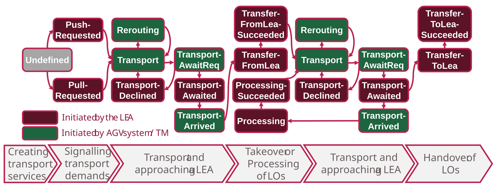
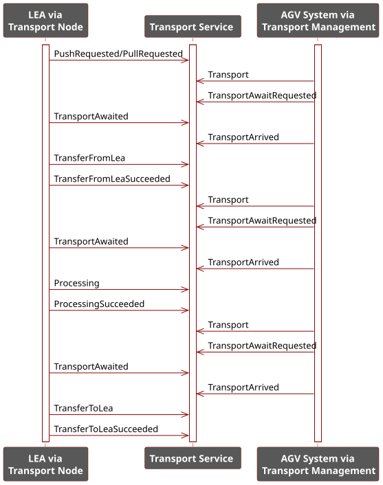

## 5.3 Transport Process

As described in [Section 5.1.2](./05_Logistics_Area.md#512-working-principle), a transport process comprises the transport of an LO between a start and target node, including the handovers at both nodes. Any number of processing nodes can be approached between start and target node. During execution, a transport order passes through various phases. These are summarized in the process model shown in [Figure 5.11](#figure-511-process-model-of-a-transport-process-in-a-logistics-area) and described in the following sections.

##### Figure 5.11: Process Model of a Transport Process in a Logistics Area

### 5.3.1 Reporting Transport Demands and AGV Selection

To report a transport demand, a LEA starts the inactive Transport Service assigned to its order node. This activates the service, which from then on represents the corresponding transport order. Upon start, the LEA transmits central meta-information about the order to the Transport Service. This includes in particular *ProductionId*, *ProductId*, and *LogisticsObjectId*, which uniquely identify the associated packaging order and the LO to be transported. This information is required to track LOs in the MLS context and to unambiguously assign them to production processes. Additionally, a user-defined *LogisticsObjectStatus* can be specified, describing the state of the LO (e.g., filled or already palletized). This information is particularly relevant for demand-driven LEAs, as the processing of an LO may vary depending on its state. For example, an SH can equip empty octabins with a foil inlet, while it covers already filled octabins with a stretch hood. Optionally, a transport order can also be marked as prioritized (*IsPriorityOrder*).

In addition to this meta-information, the LEA must provide further details that characterize the transport process. This includes whether it is a push or pull transport demand according to [Section 5.1.2](./05_Logistics_Area.md#512-working-principle) and which transport node should be approached next by an AGV (*NextNode*). In certain use cases, a *FinalTargetNode* must additionally be specified, defining the final target node of the transport. This is particularly required for pull transports, so that the transport process ends at the LEA that initiated it. For push transport orders, the *FinalTargetNode* can be used, for example, to define the storage location of the LO after completion of the packaging process.

By reporting a transport demand, the Transport Service is set to the *PushRequested* or *PullRequested* status, depending on whether it is a push or pull transport demand. The Transport Service is also updated in the Transport Management with the provided information. When the Transport Management detects the *PushRequested* or *PullRequested* status on a Transport Service, the assignment to the TN Proxy of the order node is released. The order node is free again, and according to DE5, a new inactive Transport Service is subsequently created in the Transport Management and assigned to the TN Proxy.

After a transport demand has been reported, the Transport Management begins processing the active Transport Service. A corresponding transport order is handed to the AGV system via its adapter. The adapter ensures that the proprietary order interface of the AGV system is correctly addressed based on the existing order data of the Transport Service. The fleet manager of the AGV system selects a suitable AGV for executing the transport order and reports its ID back to the Transport Management via the adapter. The Transport Management records this ID as *ResourceId* on the Transport Service.

### 5.3.2 Transport and Approaching a LEA

Once a suitable AGV is selected, the transport node defined in the *NextNode* variable of the Transport Service is approached. The fleet manager reports via the adapter to the Transport Management that the transport is underway. The Transport Management then changes the status of the Transport Service to *Transport*. During the actual transport, the Transport Service is not assigned to any TN Proxy, since no LEA needs to interact with the Transport Service in this status.

An approach area is defined around each LEA, which an AGV may only enter with the LEA's consent; otherwise it must wait outside for clearance. This prevents too many AGVs from being present near a LEA simultaneously, which could lead to undesirable operating states — for example, an arriving AGV blocking the departure of another.

When an AGV has arrived at the approach area of a LEA, the AGV system reports this via its adapter to the Transport Management. The Transport Management then connects the corresponding Transport Service to the TN Proxy of the transport node to be approached. Through this binding, the TN Block of the transport node can interact with the Transport Service and can thus also obtain all existing data of the Transport Service.

After binding the Transport Service to the TN Proxy, the Transport Management sets the status of the Transport Service to *TransportAwaitRequested*. This status is recognized by the bound LEA and signals that an AGV wants to approach. Based on the data of the Transport Service, the LEA then performs a check whether it can accept this Transport Service. For example, it can verify whether the LEA can process the product type encoded in the *ProductId*. The LEA sets the result of this check in the Transport Service status as *TransportAwaited* (accepted) or *TransportDeclined* (rejected). In the case of rejection, the Transport Management disconnects the Transport Service from the TN Proxy and, depending on the implementation, either directly specifies a new transport node to approach (*NextNode*) or puts the Transport Service in an error state that must be resolved, e.g., manually. In the case of acceptance, the LEA signals that it is ready to receive the AGV. The Transport Management detects the *TransportAwaited* status and notifies the AGV system that it can begin approaching. Once the AGV has arrived at the LEA, the AGV system reports this via its adapter to the Transport Management, which then sets the Transport Service status to *TransportArrived*.

### 5.3.3 LO Handovers, Pickups, and Processing

Once an AGV has arrived at a LEA, a handover, pickup, or processing of an LO follows depending on the type of transport node. Accordingly, the LEA sets the transport status to *TransferFromLea*, *TransferToLea*, or *Processing*. The LEA then begins the corresponding process. In the case of *TransferFromLea*, an LO is handed over from the LEA to the AGV; in the case of *TransferToLea*, an LO is handed over from the AGV to the LEA; and in the case of *Processing*, an LO is processed by the LEA while it remains on the AGV. The Transport Management reports this status to the AGV system, which in the case of *TransferFromLea* and *TransferToLea* activates available transfer mechanisms (e.g., a conveyor for receiving an LO) to support the transfer. In the case of *Processing*, the AGV maintains its current position to avoid interfering with the processing.

After the process is completed, in the case of *TransferFromLea* and *Processing*, the LEA determines the next transport node to approach from its internal *ProductDataSet* or by querying a Material Flow Management in the LOL. It then updates the *NextNode* on the Transport Service accordingly. The *LogisticsObjectStatus* can also be adjusted. In the case of *TransferToLea*, determining the next transport node and updating the *LogisticsObjectStatus* is no longer necessary, since a handover to a LEA by definition means the target node has been reached and no further node will be approached (see also [Section 5.1.2](./05_Logistics_Area.md#512-working-principle)). After completion, the LEA sets the Transport Service status to *TransferFromLeaSucceeded*, *TransferToLeaSucceeded*, or *ProcessingSucceeded*, corresponding to the process performed.

The Transport Management detects this status and decouples the Transport Service from the TN Proxy of the transport node. In the case of *TransferFromLeaSucceeded* and *ProcessingSucceeded*, the Transport Management reports the next transport node to the AGV system so that it can begin approaching. This is followed by another *Transport and Approaching a LEA* ([Section 5.3.2](#532-transport-and-approaching-a-lea)). In the case of *TransferToLeaSucceeded*, the Transport Management recognizes that the target node has been reached and terminates the Transport Service. It also notifies the AGV system that the transport process is complete, so that the AGV used can be released for further transports.

### 5.3.4 Transport Rerouting

During an ongoing transport (status: *Transport*), the LEA being transported to may fail or be in an error state. Such states at the LEAs are detected by the Transport Management (specifically its LEA Management) based on the state of the LEA service. The Transport Management (specifically its Order Management) then determines which Transport Services are affected by this fault — i.e., which Transport Services have the faulty LEA set as *NextNode* or possibly *FinalTargetNode*. All affected Transport Services are then set to the *Rerouting* status. The Transport Management can then, if possible, determine an alternative LEA to which the transport order is rerouted. This can occur, for example, through user input or through an LOL-internal query to the Material Flow Management. The Transport Management then updates the *NextNode* and/or *FinalTargetNode* on the affected Transport Service and transmits the new transport node to the AGV system. The AGV system continues the transport and reports this to the Transport Management. The Transport Management then sets the Transport Service back to the status *Transport*.

The rerouting process is a LOL-internal process and is therefore not described in detail here. Only a corresponding *Rerouting* status is provided in the transport process ([Figure 5.11](#figure-511-process-model-of-a-transport-process-in-a-logistics-area)) to signal that a service needs to be rerouted. Additionally, the state of the LEA service is transmitted at the interface between the LEAs and the LEA Management of the Transport Management to detect fault cases.

### 5.3.5 Synchronization between LEAs and AGV System

During the execution of a transport process, the associated Transport Service passes through the transport statuses defined in the process model. Each status change represents a synchronization point between the AGV system and the LEA at whose transport node the Transport Service is currently bound. The synchronization arises because status transitions are initiated alternately: partly by the AGV system via the Transport Management ([Figure 5.11](#figure-511-process-model-of-a-transport-process-in-a-logistics-area), green boxes), partly by the LEA via its transport node ([Figure 5.11](#figure-511-process-model-of-a-transport-process-in-a-logistics-area), red boxes). In this way, both sides are continuously informed about relevant events in the transport process.

[Figure 5.12](#figure-512-status-transitions-for-synchronization-between-lea-and-agv-system) illustrates this mechanism using a regular transport process from an outbound node to an inbound node with an intermediate processing node. The detailed description of the individual transitions has already been provided in [Sections 5.3.1](#531-reporting-transport-demands-and-agv-selection) through [5.3.3](#533-lo-handovers-pickups-and-processing). The process model thus forms the basis for a uniform, state-based interaction between LEAs and AGV system.

##### Figure 5.12: Status Transitions for Synchronization between LEA and AGV System

