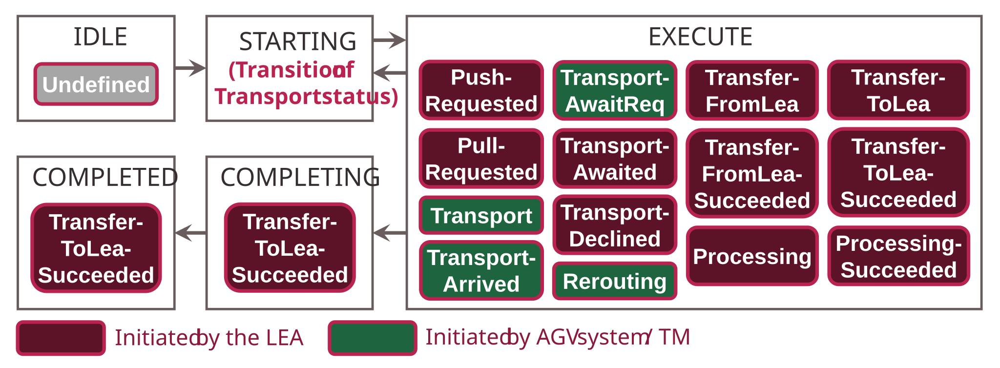

## 5.4 Transport Management

This section describes the MTP-based concepts for implementing the presented transport concept on the Transport Management side. [Section 5.4.1](#541-structure-and-operation) presents the structure and operation of the Transport Management. [Sections 5.4.2](#542-transport-services) and [5.4.3](#543-transport-service-interface) cover details of the Transport Services managed in the Transport Management and their interfaces.

### 5.4.1 Structure and Operation

The Transport Management receives transport demands from the LEAs and manages and executes them as transport orders in the form of MTP services. In the case of handovers, pickups, and processing, the Transport Management must interact with the transport nodes of the LEAs. To implement these tasks, the Transport Management internally provides an LEA Management and an Order Management ([Figure 5.1](05_Logistics_Area.md#figure-51-architecture-overview-for-implementing-flexible-transports-in-a-logistics-area)). Additionally, the Transport Management has an OPC UA server for connecting the LEAs and AGV system adapters for connecting AGV systems.

#### LEA Management

**Integration and management of LEA information:** The LEA Management serves for MTP-based integration of LEAs including their transport nodes and for the configurative binding of LEAs to the TN Proxies in the Order Management. For this purpose, it manages the necessary information for the communication connection of the LEAs as well as a description of all transport nodes present at a LEA.

**Monitoring for failures in the LEAs:** Furthermore, the LEA Management monitors the state of the LEA services and detects LEAs with failures. It transmits this information Transport-Management-internally to the Order Management so that it can reroute the Transport Services affected by the failures.

#### Order Management

The Order Management handles the management and execution of all transport orders currently running in the Logistics Area in the form of MTP services.

**Creation of Transport Services at order nodes:** To create these Transport Services, the Transport Management monitors all existing order nodes of the connected LEAs. If no Transport Service is assigned to an order node, a new inactive Transport Service is automatically created and assigned to this order node.

**Execution of Transport Services via AGV systems:** To execute the Transport Services, the Order Management forwards corresponding transport orders to the subordinate AGV systems via their AGV system adapters. The next transport order to be executed is selected according to defined criteria. This selection can be based, for example, on the order of receipt or the priority of the transport orders. Whether a transport order can be forwarded to an AGV system and to which one depends on the availability, utilization, and capabilities of the AGV systems. Further information on the interaction between Order Management and AGV systems via the AGV system adapters is described in [Section 5.6](05-06_AGV_System.md#56-agv-system).

**Binding of LEAs via TN Proxies:** Furthermore, the Order Management provides TN Proxies that enable the configurative binding and interaction of Transport Services and TN Blocks in the LEAs. A separate TN Proxy is created for each transport and order node of the connected LEAs, representing the respective node within the Order Management. Each TN Proxy has a unique *ProxyId* for identifying the proxy and the associated transport or order node. The *ProxyId* is used for establishing communication between LEA and TN Proxy ([Section 5.5.2](05-05_Logistics_Equipment_Assemblies.md#552-integration-of-leas-into-the-transport-management)), for determining the next transport node to approach ([Section 5.5.3](05-05_Logistics_Equipment_Assemblies.md#553-determination-of-the-next-transport-node)), and for the internal assignment of Transport Services to TN Proxies.

**TM-internal assignment of Transport Services to TN Proxies:** Transport services are bound Order-Management-internally to these TN Proxies. Which TN Proxy a Transport Service is bound to is stored in the *NextNode* variable of the Transport Service. The TN Proxies map the interface data of the bound Transport Services to their own interface and make them available to the LEAs via the OPC UA server of the Transport Management. When assigning Transport Services to TN Proxies, the Transport Management should ensure that Transport Services are only bound to a TN Proxy as long as they interact with each other. Afterwards, the TN Proxy should be released for binding other Transport Services to the respective node.

### 5.4.2 Transport Services

For the MTP-based abstraction of flexible transports, each transport order pending in the MLS is implemented as a service (Transport Service) in the sense of the MTP concept according to design decision DD2, which is executed in the Transport Management. These Transport Services follow the conventions defined in [[PNO Part 4]](../08_References/README.md#pno-2025-part4). However, they are also characterized by two essential features that distinguish Transport Services from conventional MTP services:

**Dynamic creation and deletion:** Transport services can be dynamically created and deleted in the Transport Management, while conventional MTP services are statically implemented in the PEAs. As explained in DD2 and DD5, this is because Transport Services represent transport orders whose number can vary depending on transport demands in the MLS. The Transport Management is thus, similar to the LEAs, a provider of MTP services, but with the distinction that the number of provided services varies dynamically.

**Standardization instead of description in an MTP file:** Conventional MTP services are described in an MTP file containing a modeling of the service interface and semantic models of various aspects of the service. For Transport Services, no modeling in an MTP file is performed. Instead, the interface of Transport Services is defined in [Section 5.4.3](#543-transport-service-interface). Every Transport Service provided in a Transport Management must implement this interface. This approach is *possible* because transport orders always represent the same function (= transport of LOs between definable transport nodes), regardless of the packaging processes pending in the MLS or the AGV systems used. This approach is *necessary* to enable uniform interaction between the Transport Services in the Transport Management and the LEAs, regardless of which LEA and which Transport Management are used. Only when the interface of the Transport Services is predefined can this interface be implemented in the TN Blocks of the LEAs at LEA engineering time (without knowledge of the Transport Management or AGV system used), thus preparing the decentralized orchestration of the Transport Services. Furthermore, a potential MTP file of the Transport Management would constantly change due to the dynamic creation and deletion of Transport Services, which would severely impair the maintainability and usability of such an MTP file.

### 5.4.3 Transport Service Interface

[Table 5.1](#table-51-mtp-interface-of-a-transport-service) shows the interface defined in this work that every MTP-based Transport Service must implement to enable uniform interaction with LEAs. This interface is generically designed so that it can be used independently of the underlying AGV system. It is composed of existing interface definitions according to [[PNO Part 4]](../08_References/README.md#pno-2025-part4).

##### Table 5.1: MTP Interface of a Transport Service

<table>
  <tr>
    <th align="left" colspan="3"><strong>Service</strong></th>
  </tr>
  <tr>
    <th align="left">Name</th>
    <th align="left">Interface Type</th>
    <th align="left">Description</th>
  </tr>
  <tr>
    <td align="left"><em>TransportControl</em></td>
    <td align="left">ServiceControl</td>
    <td align="left">ServiceControl interface of the Transport Service</td>
  </tr>
  <tr>
    <th align="left" colspan="3"><strong>Procedure Parameters</strong></th>
  </tr>
  <tr>
    <th align="left">Name</th>
    <th align="left">Interface Type</th>
    <th align="left">Description</th>
  </tr>
  <tr>
    <td align="left"><em>ProductionId</em></td>
    <td align="left">StringServParam</td>
    <td align="left">Identifier of the packaging order to which the transport belongs</td>
  </tr>
  <tr>
    <td align="left"><em>ProductId</em></td>
    <td align="left">DIntServParam</td>
    <td align="left">Identifier of the product type to be packaged</td>
  </tr>
  <tr>
    <td align="left"><em>LogisticsObjectId</em></td>
    <td align="left">StringServParam</td>
    <td align="left">Identifier of the specific packaged product instance</td>
  </tr>
  <tr>
    <td align="left"><em>LogisticsObjectStatus</em></td>
    <td align="left">DIntServParam</td>
    <td align="left">Indicator for the current packaging status of the product instance</td>
  </tr>
  <tr>
    <td align="left"><em>IsPriorityOrder</em></td>
    <td align="left">BinServParam</td>
    <td align="left">Indicator whether this is a prioritized transport</td>
  </tr>
  <tr>
    <td align="left"><em>NextNode</em></td>
    <td align="left">DIntServParam</td>
    <td align="left">Identifier of the next transport node to approach</td>
  </tr>
  <tr>
    <td align="left"><em>FinalTargetNode</em></td>
    <td align="left">DIntServParam</td>
    <td align="left">Final target node of the product, e.g., the initiating LEA for a pull transport order or the final storage location for a push transport order</td>
  </tr>
  <tr>
    <th align="left" colspan="3"><strong>Report Values</strong></th>
  </tr>
  <tr>
    <th align="left">Name</th>
    <th align="left">Interface Type</th>
    <th align="left">Description</th>
  </tr>
  <tr>
    <td align="left"><em>TransportId</em></td>
    <td align="left">StringView</td>
    <td align="left">Identifier of the transport order</td>
  </tr>
  <tr>
    <td align="left"><em>ResourceId</em></td>
    <td align="left">DIntView</td>
    <td align="left">Identifier of the transport resource used (e.g., the AGV used)</td>
  </tr>
  <tr>
    <td align="left"><em>RequestedTimestamp</em></td>
    <td align="left">DIntView + RC <em>HasTimeFormat</em> (TOD)</td>
    <td align="left">Timestamp of transport order initiation</td>
  </tr>
  <tr>
    <td align="left"><em>LastUpdatedTimestamp</em></td>
    <td align="left">DIntView + RC <em>HasTimeFormat</em> (TOD)</td>
    <td align="left">Timestamp of last transport order update</td>
  </tr>
  <tr>
    <td align="left"><em>CompletedTimestamp</em></td>
    <td align="left">DIntView + RC <em>HasTimeFormat</em> (TOD)</td>
    <td align="left">Timestamp of transport order completion</td>
  </tr>
</table>

#### Transport Service State and Status

Like all services according to the MTP concept, Transport Services are based on the MTP state machine standardized in [[PNO Part 4]](../08_References/README.md#pno-2025-part4). This state machine is suitable for representing the basic state of a transport — e.g., whether it has been started, is currently being executed, is in an error state, or has already been completed. The existing *ServiceControl* interface of the Transport Service can be used to interact with this state machine.

Additionally, as described in [Sections 5.1.2](#512-working-principle) and [5.3](#53-transport-process), the status of the transport order must be represented on the Transport Service to enable a uniform state-based interaction between the LEAs and the Transport Services. The domain-specific fine-grained states according to the process model in [Figure 5.13](05-03_Transport_Process.md#figure-511-process-model-of-a-transport-process-in-a-logistics-area) cannot be represented with the standardized MTP state machine and require an additional representation mechanism.

**Decision:** The transport status is represented via **procedures** according to [[PNO Part 4]](../08_References/README.md#pno-2025-part4). Each transport status corresponds to a procedure of the Transport Service. Transitions between transport statuses are performed via procedure changes using a *Restart* of the Transport Service.

**Advantages:**

- Procedures can be changed by both external automation systems (here: LEAs) and by internal automation (here: Transport Management), enabling the synchronization between LEAs and AGV system presented in [Section 5.3.5](#535-synchronization-between-leas-and-agv-system).
- The command-enable logic (*CommandEn*) provides a native mechanism to allow only valid status transitions according to the process model and to lock all others. Via the *CommandInfo* interface, all currently possible status transitions can be read directly.

**Excluded alternatives:**

- *Parameters:* Support bidirectional changes and offer transition control via the apply mechanism (*ApplyEn*), but do not allow a direct check of all possible status transitions — each transition must be individually tested by setting the value and reading *ApplyEn*.
- *Process values:* Simple to set, but designed for unidirectional value transfer. Bidirectional interaction would require two synchronized process values per Transport Service with no native transition logic.
- *Report values and ServicePosition variable:* Can only be changed service-internally and not by external automation systems, preventing the required synchronization between LEA and AGV system.

The procedures representing the transport status are set at appropriate times during the execution of a Transport Service. [Figure 5.13](#figure-513-mapping-of-transport-statuses-into-the-mtp-state-machine) shows which procedures can be active in which states of the MTP state machine of a Transport Service according to the transport concept presented here.

##### Figure 5.13: Mapping of Transport Statuses into the MTP State Machine

The transport process is started by a LEA when reporting a transport demand and is fundamentally executed in the EXECUTE state of the Transport Service. The transport status is represented by the currently active procedure (*ProcedureCur* variable of the *ServiceControl* interface). By performing a *Restart* of the Transport Service with a procedure change, different transport statuses can be switched between without terminating the Transport Service. Using the command-enable logic (*CommandEn*) of the MTP concept, only valid transitions between transport statuses according to the process model from [Figure 5.13](05-03_Transport_Process.md#figure-511-process-model-of-a-transport-process-in-a-logistics-area) are allowed, and all others are locked. Inactive Transport Services that have not yet been started (IDLE) have the transport status *Undefined*. When the Transport Service is completed (COMPLETING, COMPLETED), the last transport status (*TransferToLeaSucceeded*) is retained. The RESETTING state is never reached, since a new Transport Service is used for each new transport order rather than resetting and reusing an existing one. The remaining loops of the MTP state machine (pause, hold, stop, abort loops) can also be traversed. In these cases, the previously active transport status is retained. The internal function of these loops is determined by the Transport Management implementation — for example, in case of an error, the AGV can be stopped or steered to a safe position. The procedures resulting from the process model and their procedure IDs are shown in [Table 5.2](#table-52-procedures-of-a-transport-service).

##### Table 5.2: Procedures of a Transport Service

<table>
  <tr>
    <th align="left">Procedure ID</th>
    <th align="left">Name</th>
    <th align="left">Description</th>
  </tr>
  <tr>
    <td align="left">16#0</td>
    <td align="left">Undefined</td>
    <td align="left">The Transport Service is inactive and does not yet represent a specific transport order.</td>
  </tr>
  <tr>
    <td align="left">16#1</td>
    <td align="left">PushRequested</td>
    <td align="left">A LEA signals a transport demand due to a completed logistics object.</td>
  </tr>
  <tr>
    <td align="left">16#2</td>
    <td align="left">PullRequested</td>
    <td align="left">A LEA signals a transport demand due to a material demand.</td>
  </tr>
  <tr>
    <td align="left">16#3</td>
    <td align="left">Transport</td>
    <td align="left">An AGV has been scheduled and commissioned for a transport order. It is traveling to the designated next node.</td>
  </tr>
  <tr>
    <td align="left">16#4</td>
    <td align="left">TransportAwaitRequested</td>
    <td align="left">The AGV is at the approach area of the next node and requests permission to proceed to the node.</td>
  </tr>
  <tr>
    <td align="left">16#5</td>
    <td align="left">TransportAwaited</td>
    <td align="left">A Transport Service has been successfully bound to a LEA's proxy interface. The LEA confirms the transport order assigned to its node.</td>
  </tr>
  <tr>
    <td align="left">16#6</td>
    <td align="left">TransportDeclined</td>
    <td align="left">A Transport Service has been bound to a LEA's proxy interface. The LEA rejects the transport order assigned to its node.</td>
  </tr>
  <tr>
    <td align="left">16#7</td>
    <td align="left">TransportArrived</td>
    <td align="left">The AGV has reached its designated target node and is ready to interact with the LEA.</td>
  </tr>
  <tr>
    <td align="left">16#8</td>
    <td align="left">TransferFromLea</td>
    <td align="left">An LO is being transferred from a LEA to an AGV.</td>
  </tr>
  <tr>
    <td align="left">16#9</td>
    <td align="left">TransferFromLeaSucceeded</td>
    <td align="left">An LO has been successfully transferred from a LEA to an AGV.</td>
  </tr>
  <tr>
    <td align="left">16#A</td>
    <td align="left">Processing</td>
    <td align="left">A LEA is performing a processing operation on an LO located on an AGV.</td>
  </tr>
  <tr>
    <td align="left">16#B</td>
    <td align="left">ProcessingSucceeded</td>
    <td align="left">A processing operation has been successfully completed on an LO located on an AGV.</td>
  </tr>
  <tr>
    <td align="left">16#C</td>
    <td align="left">TransferToLea</td>
    <td align="left">An LO is being transferred from an AGV to a LEA.</td>
  </tr>
  <tr>
    <td align="left">16#D</td>
    <td align="left">TransferToLeaSucceeded</td>
    <td align="left">An LO has been successfully transferred from an AGV to a LEA.</td>
  </tr>
  <tr>
    <td align="left">16#E</td>
    <td align="left">Rerouting</td>
    <td align="left">The Transport Service must be rerouted.</td>
  </tr>
</table>

#### Parameters and Report Values of the Transport Service

Transport services hold all information required for executing a transport process. In addition to transport state and transport status, this includes in particular the order metadata (*ProductionId*, *ProductId*, *LogisticsObjectId*, *LogisticsObjectStatus*, *IsPriorityOrder*) as well as the routing parameters *NextNode* and *FinalTargetNode*. These values are initially set by the LEA when reporting a transport demand and updated as needed during the course of the process. *NextNode* in particular is essential, as this parameter determines the step-by-step routing of the AGV within the Logistics Area. These variables are process-relevant parameters that are set at the Transport Service by an external system (here: LEA). They are therefore implemented as procedure parameters according to [[PNO Part 4]](../08_References/README.md#pno-2025-part4). This allows both the Transport Management and the LEA currently bound to the Transport Service to read and modify this information.

Additionally, each Transport Service contains internal management information provided by the Transport Management but read-only for LEAs: *TransportId* for uniquely identifying the transport order, *ResourceId* for identifying the assigned AGV, and the timestamps *RequestedTimestamp*, *LastUpdatedTimestamp*, and *CompletedTimestamp*. Since all these variables are values provided by the Transport Service and should not be changed from outside (e.g., by the LEAs), they are implemented as report values according to [[PNO Part 4]](../08_References/README.md#pno-2025-part4).

For the timestamps in particular, the ability to represent time values is needed, which does not exist in the current MTP concept. Therefore, a new role class **RC HasTimeFormat** is introduced in this work. This role class can be added to the *DIntView* interface definition and signals that the DINT values of the interface should be interpreted in a time format. In addition to the *DIntView* interface definition (and its derivation *DIntMon*), this role class can also be added to all other DINT-based interface definitions. These are in particular the *DIntMan* interface definition (including its derivation *DIntManInt*) as well as the *DIntServParam* and *DIntProcessValueIn* interface definitions.
