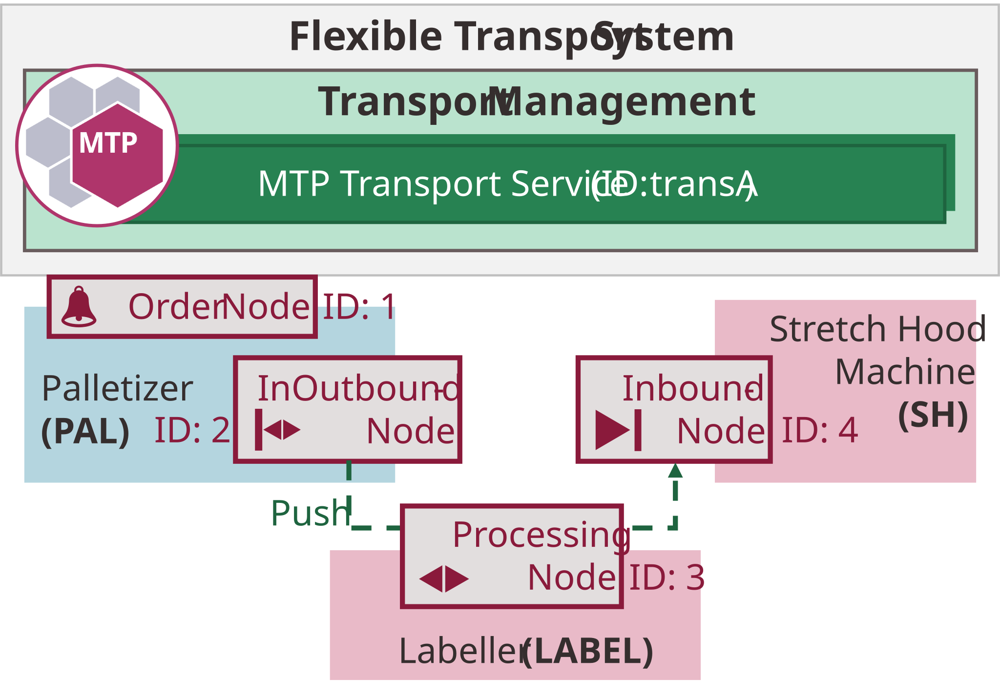
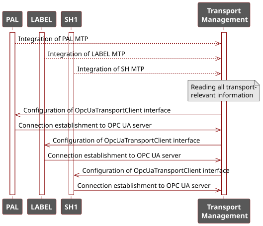
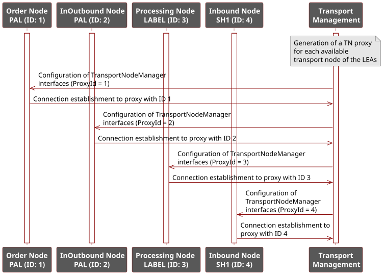
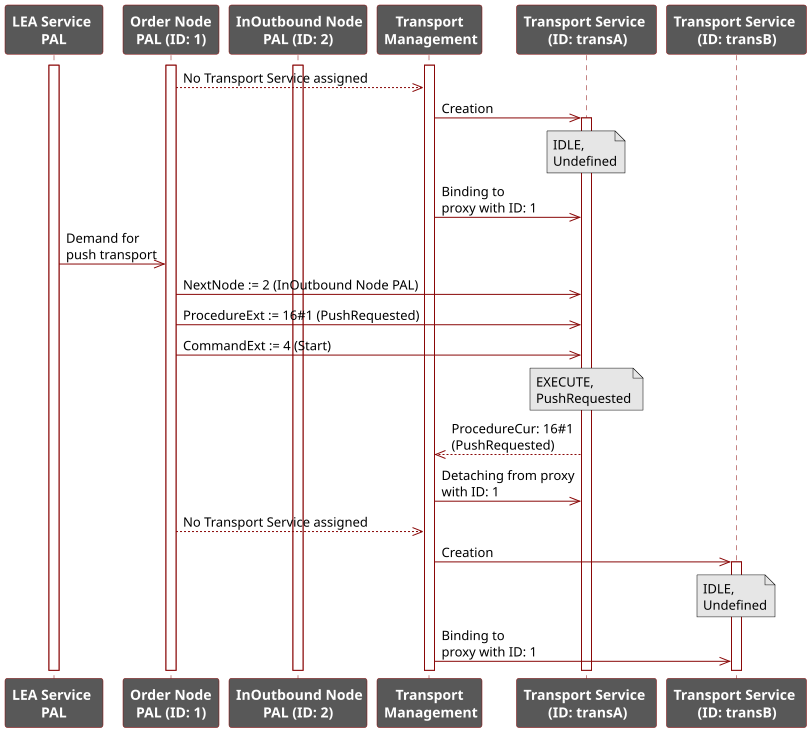
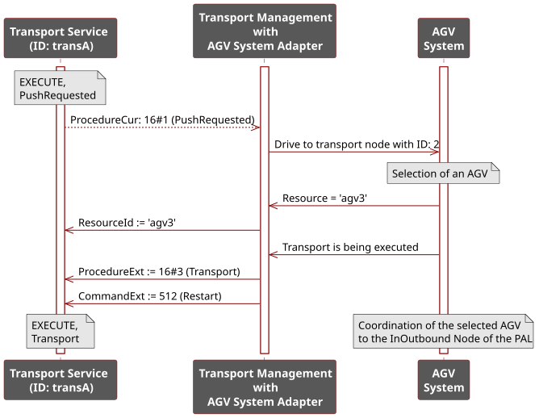
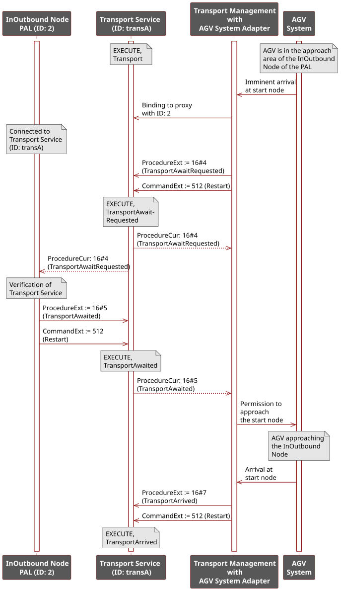
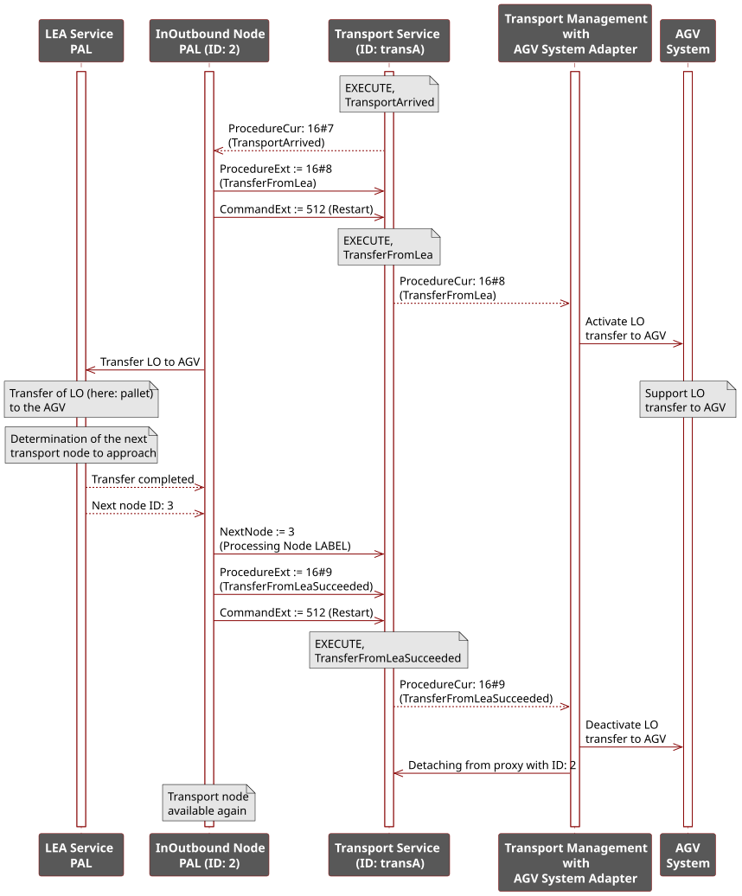
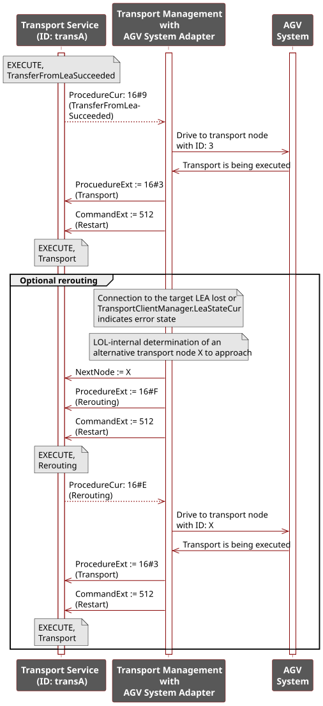
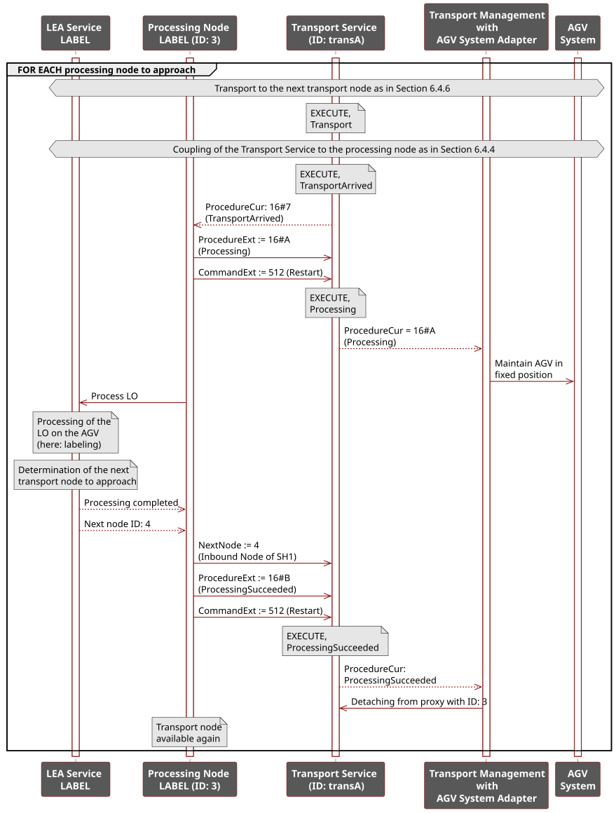
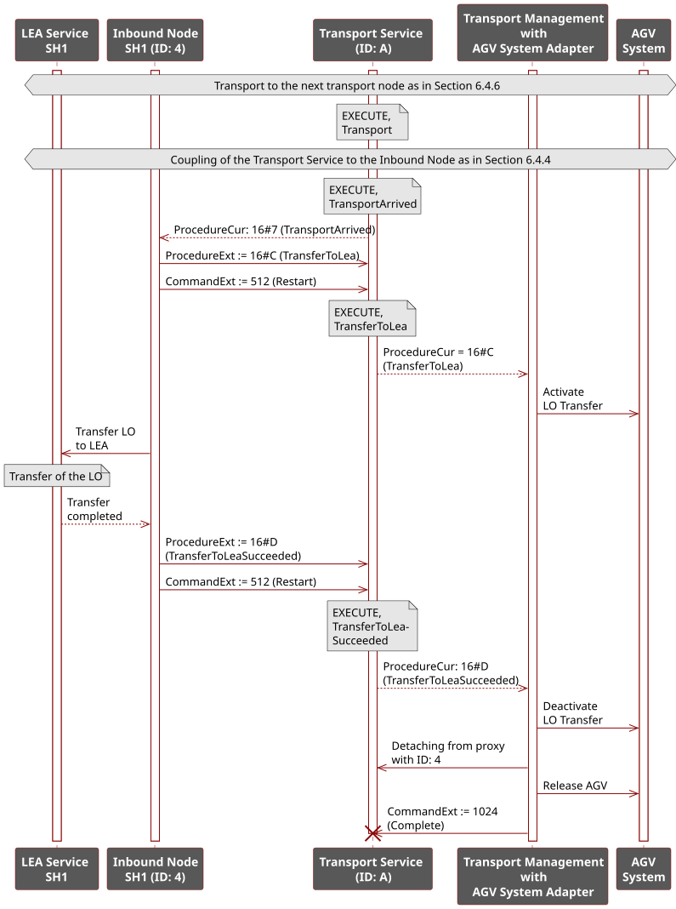

## 5.8 Application Example: Transport PAL–Label–SH
To illustrate the concepts described in this chapter for logistics area automation, this section presents an exemplary application of the transport concept. Therefore, the example already introduced in [Section 5.1.2](05_Logistics_Area.md#512-working-principle) is used. A push transport from a PAL to a SH LEA is carried out with a LABEL LEA visited along the way. [Figure 5.17](#figure-517-example-of-a-push-transport-from-a-palletizer-via-a-labeling-unit-to-a-stretch-hood-machine) shows the LEAs and their transport nodes.

##### Figure 5.17: Example of a Push Transport from a Palletizer via a Labeling Unit to a Stretch Hood Machine

### 5.8.1 LEA Integration
As the basis for carrying out the transport process, the MTPs of the three LEAs are imported into the LEA Management of the Transport Management in accordance with the mechanisms described in [Section 5.5.2](05-05_Logistics_Equipment_Assemblies.md#552-integration-of-leas-into-the-transport-management), *Transport Proxies* are generated, and these are connected to the LEA transport nodes. [Figure 5.18](#figure-518-integration-of-leas-into-a-transport-management-system) shows the process of integrating the three LEAs; [Figure 5.19](#figure-519-integration-of-all-transport-nodes-of-leas-into-a-transport-management-system) shows the process of integrating all transport nodes available in the LEAs.[^1]

##### Figure 5.18: Integration of LEAs into a Transport Management System

##### Figure 5.19: Integration of All Transport Nodes of LEAs into a Transport Management System

### 5.8.2 Transport Initiation
[Figure 5.20](#figure-520-initiation-of-a-push-transport-order) shows the transport initiation process.

##### Figure 5.20: Initiation of a Push Transport Order

In the context of the selected example, only the PAL has an Order node for initiating transport orders. Since no Transport Service is initially assigned to it, a new Transport Service (ID: transA) is created in the Order Management of the Transport Management and is connected to the Order node (ID: 1) in accordance with the mechanisms described in [Section 5.5.2](05-05_Logistics_Equipment_Assemblies.md#552-integration-of-leas-into-the-transport-management).

In the example, the PAL has a push transport demand and starts the Transport Service in the *PushRequested* procedure. The *NextNode* is set to the InOutbound node of the PAL (ID: 2). The PAL obtains this ID by reading the *ProxyId* from the *TransportNodeManager* interface of its InOutbound node and sets it at the procedure parameter *NextNode* of the Transport Service.

After the Transport Service is started, its connection to the proxy of the Order node is disconnected; however, it continues to run in the Transport Management. A new Transport Service (ID: transB) is created for the now free Order node proxy and is assigned to it.

### 5.8.3 Travel to the Start Node
[Figure 5.21](#figure-521-travel-to-the-start-node) shows the process of traveling to the start node.

##### Figure 5.21: Travel to the Start Node

The running Transport Service (ID: transA) is handed to a suitable AGV system via its adapter. Depending on the interface of the respective fleet manager, this can occur at the initiative of the Transport Management or the fleet manager. Once the AGV system has available capacity, its fleet manager selects a suitable AGV to execute the transport process and reports the ID (here: agv3) back to the Transport Management via the adapter and records this ID as *ResourceId* on the Transport Service. The selected AGV then begins traveling to the InOutbound node of the PAL as the start node of the transport process. The fleet manager reports via the adapter that the transport is underway, and sets the status of the Transport Service to *Transport*.

### 5.8.4 Coupling the Transport Service to the Start Node
[Figure 5.22](#figure-522-coupling-the-transport-service-to-the-start-node) shows the process of coupling the Transport Service to the start node.

##### Figure 5.22: Coupling the Transport Service to the Start Node

When the AGV has arrived at the approach area of the InOutbound node of the PAL, the AGV system reports this via its adapter to the Transport Management. If the InOutbound node is not occupied by another Transport Service, the Transport Management connects the Transport Service (ID: transA) to the *TN Proxy* of this node in accordance with [Section 5.5.2](05-05_Logistics_Equipment_Assemblies.md#552-integration-of-leas-into-the-transport-management). After binding, the Transport Management sets the status of the Transport Service to *TransportAwaitRequested*. The PAL then checks, based on the data from the Transport Service interface (e.g., *ProductId*), whether it can process the transported product. For example, it may compare the *ProductId* of the Transport Service with the *ProductId* of the packaging order it is currently processing.

Depending on the result of this check, the PAL sets the status of the Transport Service to either *TransportAwaited* or *TransportDeclined*. In the event of a negative result (*TransportDeclined*), the Transport Management disconnects the Transport Service from the *TN Proxy* and the next transport node to be approached (procedure parameter *NextNode*) must be redefined. To do so, the LEA may request an alternative node from the LOL or the operator via *TransportNodeRequest* and reroute the transport accordingly. Alternatively, the AGV system can direct the AGV to a safe position and the Transport Management places the Transport Service in an error state (HELD), signaling the need for manual intervention.

In the present example, a positive result is assumed. In this case, the PAL sets the status of the Transport Service to *TransportAwaited*, which signals that it is ready to receive the AGV. The Transport Management detects this status and notifies the AGV system that it can begin approaching. Once the AGV has arrived at the InOutbound node, the AGV system reports this via its adapter, and the Transport Management sets the Transport Service status to *TransportArrived*.

### 5.8.5 Loading the AGV
[Figure 5.23](#figure-523-loading-the-agv) shows the AGV loading process.

##### Figure 5.23: Loading the AGV

As soon as the InOutbound node of the PAL detects the *TransportArrived* status, the LEA sets the Transport Service status to *TransferFromLea* and the handover of the LO (here: pallet) to the AGV begins. The Transport Management reports this status to the AGV system, which activates available transfer mechanisms to support the transfer. Once the transfer is complete, the next transport node to be approached (here: the Processing node of the LABEL LEA) is determined in accordance with the mechanisms described in [Section 5.5.4](05-05_Logistics_Equipment_Assemblies.md#554-determination-of-the-next-transport-node) and the *NextNode* on the Transport Service is updated accordingly. The LEA then sets the Transport Service status to *TransferFromLeaSucceeded*. The Transport Management detects this status and stops the LO transfer on AGV system side. Furthermore, it decouples the Transport Service from the *TN Proxy* of the InOutbound node, which is then again available for other transport orders.

### 5.8.6 Travel to the Next Node Including Rerouting
[Figure 5.24](#figure-524-travel-to-the-next-node-including-rerouting) shows the process of traveling to the next node, including the option of rerouting.

##### Figure 5.24: Travel to the Next Node Including Rerouting

As soon as the status of the Transport Service is *TransferFromLeaSucceeded*, the Transport Management reports the next transport node (here: the Processing node of the LABEL LEA) to the AGV system so that it can begin approaching. The fleet manager reports via the adapter that the transport is underway, and the Transport Management sets the status of the Transport Service to *Transport*.

The Transport Management (specifically its LEA Management) monitors the state of the LEA services via the *TransportClientManager* interfaces of the LEAs. If a connection loss is detected, or if an error state is detected in the *LeaStateCur* variable of the interface, the Transport Management (specifically its Order Management) determines which Transport Services are affected — i.e., which Transport Services have the faulty LEA set as *NextNode*. For all affected Transport Services an alternative transport node is determined, e.g., through user input or an LOL-internal query, and *Next Node* parameter is updated accordningly. Afterwards, these services are set to *Rerouting* status and the new transport node to be approached is transmitted to the AGV system. The AGV system continues the transport and reports this to the Transport Management, which then sets the Transport Service back to the status *Transport*.

### 5.8.7 Processing
[Figure 5.25](#figure-525-processing-of-a-logistics-object) shows the process of handling an LO at a Processing node.

##### Figure 5.25: Processing of a Logistics Object

If the approached transport node is a Processing node, the Transport Service is coupled to it following the same principle as described in [Section 5.8.4](#584-coupling-the-transport-service-to-the-start-node). The LEA then sets the Transport Service status to *Processing*, and processing of the LO begins. In this case, **no** handover of the LO to the LEA takes place; instead, it remains on the AGV. The Transport Management reports this status to the AGV system, which maintains the AGV's current position to avoid interfering with the processing. Once processing is complete, the next transport node to be approached is determined and the *NextNode* on the Transport Service is updated accordingly. The LEA then sets the Transport Service status to *ProcessingSucceeded*. The Transport Management detects this status and decouples the Transport Service from the *TN Proxy* of the Processing node. Subsequently, any number of additional Processing nodes can be approached in the same manner. Travel to the next transport node follows the same principle as described in [Section 5.8.6](#586-travel-to-the-next-node-including-rerouting).

### 5.8.8 Unloading the AGV
[Figure 5.26](#figure-526-unloading-the-agv) shows the AGV unloading process.

##### Figure 5.26: Unloading the AGV

If no (further) Processing node is to be approached, the transport to the last transport node to be visited (target node, here: the Inbound node of SH1) is coordinated following the same principle as described in [Section 5.8.6](#586-travel-to-the-next-node-including-rerouting). When the AGV arrives at the approach area of the transport node, the Transport Service is coupled to the node following the same principle as described in [Section 5.8.4](#584-coupling-the-transport-service-to-the-start-node). The LEA then sets the Transport Service status to *TransferToLea*, and the LO is transferred from the AGV to SH1. The Transport Management reports this status to the AGV system, which activates available transfer mechanisms to support the transfer. After the successful transfer, the LEA sets the Transport Service status to *TransferToLeaSucceeded*. The Transport Management detects this status, recognizes that the target node has been reached, decouples the Transport Service from the *TN Proxy* of the transport node, and completes the Transport Service. It also notifies the AGV system that the transport process is complete, so that the AGV can be released for further transports.

[^1]: In all following sequence diagrams of this section, the individual TN Proxies in the Transport Management are not shown for the sake of clarity.
