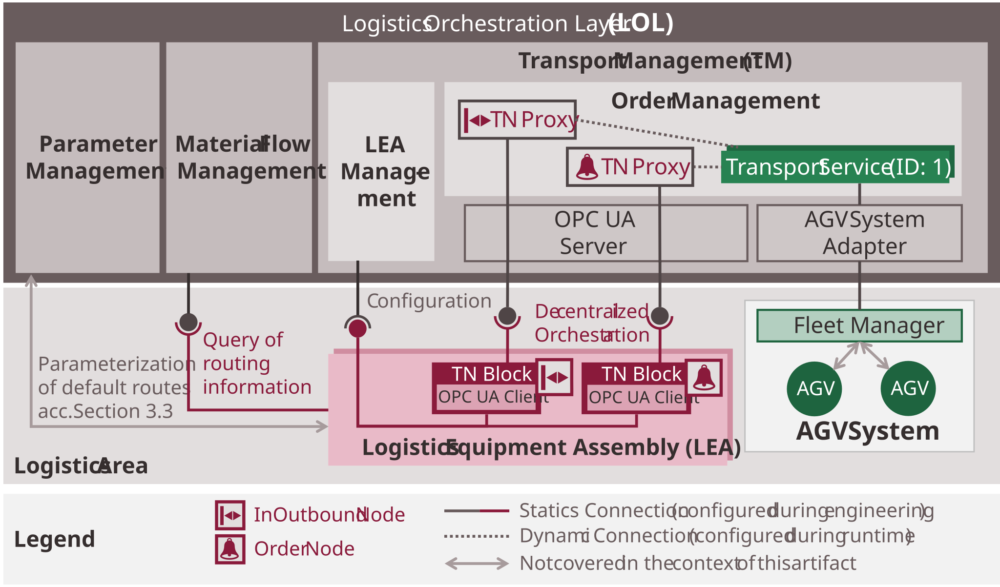
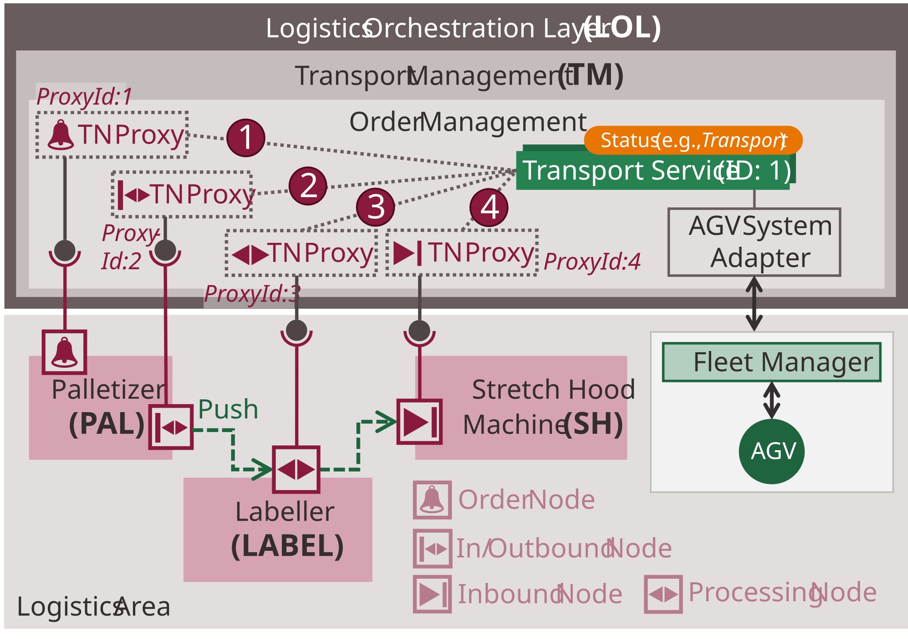

## 5 MTP-based automation of flexible transport in Logistics Areas

This chapter presents the MTP-based automation of flexible transports in Logistics Areas (LA). Parts of these concepts were published in [[BHF+23]](../08_References/README.md#blumenstein-et-al-2023), [[BGB+23]](../08_References/README.md#blumenstein-et-al-moprolog) as well as the student work [[Hen22]](../08_References/README.md#henkel-2022).

 [Section 5.8](05-08_Application_Example_TransportPAL-Label-SH.md#58-application-example-transport-pallabelsh) shows the application of the described concepts to a flexible transport between a palletizer, a labeller and a stretch hood machine. [Section 7.8](../07_MTP%20Extensions/07-08_TransportSet.md#78-mtp-specification-of-the-transportset) provides detailed specifications of the introduced MTP extensions.

## 5.1 Artifact Overview

Flexible transports in a Logistics Area require a uniform interaction between LEAs and AGV systems. Since no such approach exists within the MTP ecosystem, this artifact introduces a new concept for automating and integrating flexible transports that aligns with established MTP concepts wherever possible. This section introduces the conceptual building blocks and key terminology of the artifact and relates them to one another. Subsequent sections detail the technical implementation and justify the underlying design decisions. The content is presented from two perspectives: [Section 5.1.1](#511-architecture) describes the key system components of an MLS involved in executing flexible transports. [Section 5.1.2](#512-transport-execution) explains how a transport process is carried out on the basis of these components. Both sections reference the detailed descriptions that follow.

### 5.1.1 Architecture

[Figure 5.1](#figure-51-architecture-overview-for-implementing-flexible-transports-in-a-logistics-area) shows the system components of an MLS for implementing flexible transports in a Logistics Area as well as their interfaces to each other.

##### Figure 5.1: Architecture Overview for Implementing Flexible Transports in a Logistics Area

**Transport Management ([Section 5.3](#53-transport-management)):** A central component is the Transport Management, which receives transport demands from LEAs, manages them as transport orders, and coordinates their execution via connected AGV systems. The transport orders are represented as **MTP Transport Services** that are dynamically created, executed, and terminated by the Transport Management. For this purpose, the Transport Management comprises an Order Management for the management and execution of transport orders and an LEA Management for the integration and management of LEAs.

**LEAs ([Section 5.4](#54-logistics-equipment-assemblies)):** LEAs introduce transport demands into the system via so-called order nodes and coordinate handovers, pickups, and processing at their transport nodes (e.g., InOutbound nodes, see [Section 5.1.2](#512-working-principle)). These nodes are implemented in the LEA programs by **TN Blocks** (transport node function blocks) that interact with the Transport Services of the Transport Management according to the principle of decentralized orchestration. For robust coupling between TN Blocks and Transport Services, **TN Proxies** are employed in the Transport Management. During LEA integration, the LEA Management permanently binds each TN Block to a TN Proxy that represents it in the Order Management. During the execution of transport processes, different Transport Services are dynamically assigned to the TN Proxies within the Order Management. This allows each TN Block to interact with different Transport Services via its proxy. For automated integration of the LEAs into the LEA Management, transport-relevant LEA information is described in a *TransportSet* in the LEA MTPs.

**AGV System ([Section 5.5](#55-agv-system)):** The AGV system consists of a fleet manager and multiple AGVs for carrying out transports between the physical transport nodes of the LEAs. Additionally, it interacts with the LEAs to coordinate handovers, pickups, and processing. The connection to the Transport Management is established via an **AGV system adapter** that bridges the proprietary interface of the AGV system to the Transport Services.

**Additional LOL functions:** In addition to the Transport Management, a Parameter Management and/or a Material Flow Management can be used to provide static or dynamic route information. The Parameter Management administers product-specific static default routes. The Material Flow Management plans an optimally sequenced set of transport nodes to approach for each transport order, depending on the current state of the MLS and the pending packaging orders.

### 5.1.2 Working Principle

[Figure 5.2](#figure-52-application-example-illustrating-the-working-principle-of-flexible-transports-in-a-logistics-area) shows an example Logistics Area with a palletizer LEA (PAL), a labeler LEA (LABEL), and a stretch hood machine LEA (SH), including their associated transport and order nodes. Based on this configuration, the basic working principle is explained below.

##### Figure 5.2: Application Example Illustrating the Working Principle of Flexible Transports in a Logistics Area

**Reporting transport demands and AGV selection ([Section 5.3.1](./05-03_Transport_Process.md#531-reporting-transport-demands-and-agv-selection)):** An inactive Transport Service is initially bound to the TN Proxy of the PAL's order node ([Figure 5.2](#figure-52-application-example-illustrating-the-working-principle-of-flexible-transports-in-a-logistics-area), (1)). To report a transport demand — e.g., for the removal of a completed pallet — the PAL parametrizes and starts this service via the TN Block of the order node. It sets its own InOutbound node as the next transport node to approach (*NextNode*) and starts the Transport Service in the *PushRequested* status. The Transport Management then decouples the started Transport Service from the TN Proxy of the order node and binds a new inactive Transport Service for future demands. Based on the started Transport Service, the Transport Management provides a transport order to the AGV system, whereupon the fleet manager selects a suitable AGV.

**Transport and approaching a LEA ([Section 5.3.2](./05-03_Transport_Process.md#532-transport-and-approaching-a-lea)):** After AGV selection, the fleet manager dispatches the AGV to the specified transport node (*NextNode*) and sets the transport status to *Transport*. When the AGV enters a defined approach area of the InOutbound node, the AGV system sets the Transport Service status to *TransportAwaitRequested*. The Transport Management then binds the Transport Service to the TN Proxy of this transport node ([Figure 5.2](#figure-52-application-example-illustrating-the-working-principle-of-flexible-transports-in-a-logistics-area), (2)). The PAL verifies whether this is the commissioned transport and grants the AGV clearance to approach (*TransportAwaited*). Upon arrival, the fleet manager sets the transport status to *TransportArrived*.

**LO handover ([Section 5.3.3](./05-03_Transport_Process.md#533-lo-handovers-pickups-and-processing)):** The LEA then performs the required interaction steps to hand over the pallet to the AGV (*TransferFromLea*). After successful handover, the PAL determines the next transport node — here the processing node of the LABEL LEA — updates the *NextNode* of the Transport Service, and signals completion via the transport status *TransferFromLeaSucceeded*. The Transport Management then decouples the Transport Service from the TN Proxy of the InOutbound node and signals the AGV system to proceed to the next transport node.

**Transport and approaching a LEA ([Section 5.3.2](./05-03_Transport_Process.md#532-transport-and-approaching-a-lea)):** While the AGV is en route to the next transport node, the fleet manager sets the transport status to *Transport* again. The interaction at the processing node of the LABEL LEA follows the same pattern. After the AGV enters the approach area, the Transport Management binds the Transport Service to the TN Proxy of the processing node ([Figure 5.2](#figure-52-application-example-illustrating-the-working-principle-of-flexible-transports-in-a-logistics-area), (3)), whereupon the LABEL LEA verifies whether it can process the transport. After clearance is granted, the AGV approaches the LABEL LEA.

**LO processing ([Section 5.3.3](./05-03_Transport_Process.md#533-lo-handovers-pickups-and-processing)):** Upon AGV arrival, the LABEL LEA sets the transport status to *Processing*. During processing, the LO remains on the AGV, which maintains its position. After successful processing, the LABEL LEA updates the *NextNode* to the inbound node of the SH and signals completion via *ProcessingSucceeded*. The Transport Management then decouples the Transport Service from the TN Proxy of the processing node and signals the AGV system to proceed. In this manner, any number of processing nodes can be approached sequentially.

**Transport and approaching a LEA ([Section 5.3.2](./05-03_Transport_Process.md#532-transport-and-approaching-a-lea)):** While the AGV is en route to the next transport node, the fleet manager sets the transport status to *Transport* again. At the inbound node of the SH, the same binding mechanism applies ([Figure 5.2](#figure-52-application-example-illustrating-the-working-principle-of-flexible-transports-in-a-logistics-area), (4)).

**LO pickup ([Section 5.3.3](./05-03_Transport_Process.md#533-lo-handovers-pickups-and-processing)):** After verifying the transport order and AGV arrival, the SH picks up the LO in the *TransferToLea* transport status and confirms completion with *TransferToLeaSucceeded*. Since this is the final transport node, no *NextNode* update is required. The Transport Management then decouples the Transport Service from the TN Proxy of the inbound node, terminates it, and notifies the AGV system, which releases the AGV for subsequent orders.

**Transport rerouting ([Section 5.3.4](./05-03_Transport_Process.md#534-transport-rerouting)):** The Transport Management also detects failures at LEAs and can reroute transports that are already en route to an affected LEA. For this purpose, it sets the corresponding Transport Services to the *Rerouting* status. After successful rerouting and updating the *NextNode*, completion is signaled via *ReroutingSucceeded*. This special case is not shown in [Figure 5.2](#figure-52-application-example-illustrating-the-working-principle-of-flexible-transports-in-a-logistics-area).

The following sections describe the technical implementation of these concepts. For simplification, the concept descriptions are based on individual LEAs rather than Logistics Lines. Unless stated otherwise, the described concepts are equally applicable to the LEAs of a Logistics Line.

- [Section 5.2 — Design Decisions](./05-02_Design_Decisions.md): Architecture-relevant design decisions
- [Section 5.3 — Transport Process](./05-03_Transport_Process.md): Implementation of the individual steps of a transport process
- [Section 5.4 — Transport Management](./05-04_Transport_Management.md): Implementation of the Transport Management system component
- [Section 5.5 — Logistics Equipment Assemblies](./05-05_Logistics_Equipment_Assemblies.md): Implementation of the LEA system component
- [Section 5.6 — AGV System](./05-06_AGV_System.md): Implementation of the AGV system component
- [Section 5.7 — MTP Extensions](./05-07_MTP_Extensions.md): Necessary extensions of the MTP concept for implementing flexible transports in the Logistics Area
- [Section 5.8 — Application Example: Transport PAL–Label–SH](./05-08_Application_Example_TransportPAL-Label-SH.md): Exemplary application of the transport concept for a push transport from a Palletizer via a Labeling Unit to a Stretch Hood Machine
