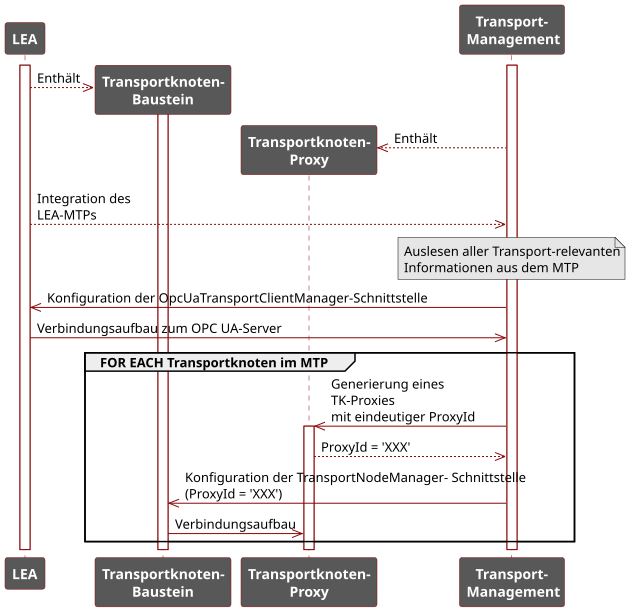
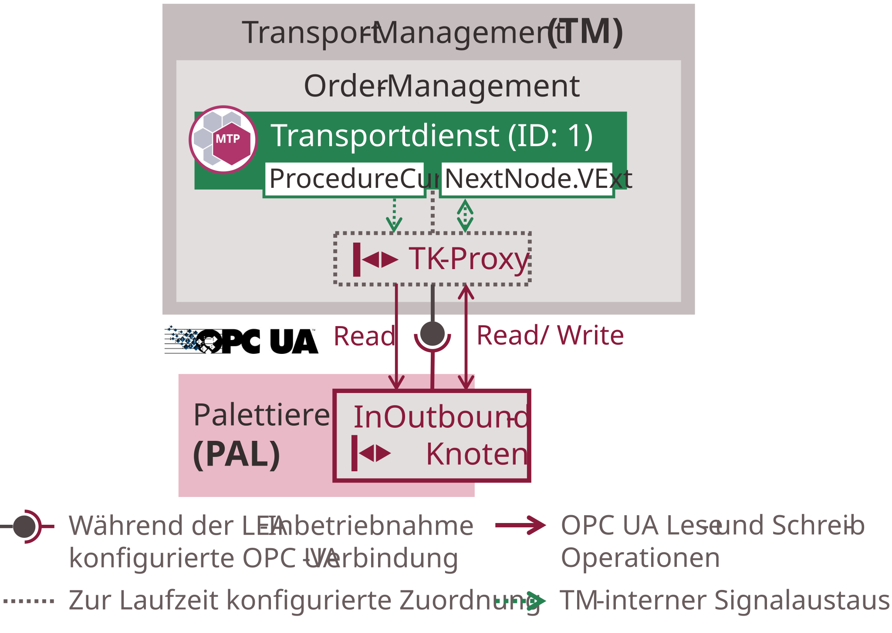
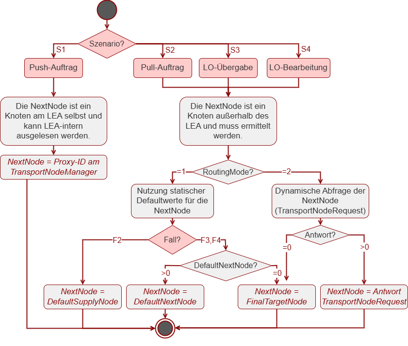

### 5.5 Logistics Equipment Assemblies

This section describes the MTP-based concepts for implementing the presented transport concept on the LEA side. [Section 5.5.1](#551-structure-and-operation) presents the relevant components and operation of the LEAs in the context of flexible transports. The following [Sections 5.5.2](#552-integration-of-leas-into-the-transport-management) through [5.5.4](#554-determination-of-the-next-transport-node) cover detailed concepts for LEA integration into the Transport Management, decentralized orchestration of transport services, and determination of the next transport node by the LEAs.

#### 5.5.1 Structure and Operation

In the context of transport coordination, LEAs act as initiators of transports that introduce transport demands into the system. These transport demands result in transport orders in the Order Management of the Transport Management. Additionally, handovers, pickups, and processing of LOs between LEAs and AGVs must be coordinated. For this purpose, the LEA interacts with the transport services of the Transport Management.

##### Binding and Interaction with Transport Services

A LEA can interact with multiple different transport services simultaneously. Specifically, a transport service can be bound to each existing transport and order node. Each of these nodes is implemented as a **TN Block** (transport node function block) in the LEA service. These blocks serve to make the current interface data of a TN Proxy available within the LEA. During the integration of LEAs into the Transport Management ([Section 5.5.2](#552-integration-of-leas-into-the-transport-management)), each existing TN Block is configuratively bound to a TN Proxy. For this purpose, the TN Blocks are designed as OPC UA client blocks according to [[OPC 30001]](../98_References/README.md#opc-30001) to enable binding to the interfaces of the TN Proxies in the OPC UA server of the Transport Management. After binding, the TN Blocks are able to interact with the TN Proxies and to control their bound transport services according to the principle of decentralized orchestration ([Section 5.5.3](#553-decentralized-orchestration-of-transport-services)).

As described in [Section 5.3](05-03_Transport_Process.md#53-transport-process), transport services are dynamically bound to different TN Proxies during their execution. Consequently, a TN Block in a LEA is always connected to the same TN Proxy in the Transport Management, but this TN Proxy provides the TN Block with different transport services over time. This approach differs from previous static concepts for decentralized orchestration, where an orchestrating service always interacts with the same orchestrated service [[Spa19]](../98_References/README.md#spaethe-2019) [[SMS+20]](../98_References/README.md#stutz-et-al-2020). However, this is necessary to enable the presented interactions of a transport service with various transport nodes of the LEAs.

##### Determination of the Next Transport Node

According to DD6, the LEAs are also responsible for determining the next transport node to approach for the transport service with which they are currently interacting. They then set the *ProxyId* of the determined transport node on the *NextNode* parameter of the transport service.

For determining the next transport node ([Section 5.5.4](#554-determination-of-the-next-transport-node)), product-specific information about the next node to approach can be statically stored in the *ProductDataSet* of the LEAs by a Parameter Management in the LOL and used as needed. For this, the parameterization concepts according to [Chapter 3](../03_Logistics_Equipment_Assemblies_NEW/03_Logistics_Equipment_Assemblies.md) are used. Alternatively, this information can be dynamically queried from a Material Flow Management, which takes the current system state of the MLS into account when determining the node. In both cases, the LEA sets the determined next transport node on the *NextNode* parameter of the transport service.

#### 5.5.2 Integration of LEAs into the Transport Management

The integration of LEAs into a Transport Management comprises three sequential steps: importing the LEA MTPs into the LEA Management, automatically generating the required TN Proxies, and configuring the communication relationships between TN Proxies and TN Blocks of the LEAs. [Figure 5.14](#figure-514-integration-of-a-lea-into-the-transport-management) provides an overview of the overall process, which is described in detail in the following subsections.

##### Figure 5.14: Integration of a LEA into the Transport Management

##### MTP Import and Generation of TN Proxies

As the basis for the interaction between the LEAs and the Transport Management as described in [Sections 5.1.2](05_Logistics_Area.md#512-working-principle) and [Section 5.3](05-03_Transport_Process.md#53-transport-process), the integration of the LEAs into the Transport Management, specifically into its LEA Management, is necessary. For this purpose, the LEAs are automatically integrated into the LEA Management of the Transport Management through the import of their MTP files, following the basic principle of the MTP concept [[PNO Part 1]](../98_References/README.md#pno-2025-part1). For this integration, the *TransportSet* is introduced as a new MTP aspect, whose structure is shown in the following subsection. This new MTP aspect describes the interfaces needed for the communicative integration of the LEAs to the Transport Management and for their configuration. It also contains all necessary information about the transport nodes present in the LEAs.

After integrating a LEA, the Transport Management generates a TN Proxy for each existing transport node. For this, it uses the information from the *TransportSet* of the LEA MTPs. Each TN Proxy receives a unique *ProxyId* and exposes the interface data of bound transport services in the OPC UA server of the Transport Management.

> **Note on Logistics Line integration:** The integration of Logistics Lines into the LEA Management is performed by integrating relevant transport nodes of the LEAs participating in the line. For this purpose, the transport nodes of the LEAs relevant for the Logistics Line must be exposed at the line interface and respectively described in the Composed-MTP. For the interaction between transport services and LEAs, the transport nodes present in the line are used also in the case of Logistics Lines. The interaction with these transport nodes does not differ from the interaction with transport nodes of individual LEAs.

##### LEA Configuration

After integrating the LEAs into the Transport Management, the TN Blocks of the LEAs must be configured so that each TN Block can access and control its corresponding TN Proxy in the Transport Management. Two configuration steps are required: first, a communication connection from the LEA to the OPC UA server of the Transport Management must be established; second, the TN Blocks of the LEA must be configured to read and write the interface data of the correct TN Proxy. According to DD4, this configuration is performed by the Transport Management.

To establish the communication connection, the LEA provides an *OpcUaTransportClientManager* interface, via which connection parameters of the Transport Management (e.g., endpoint URL, namespace) are transmitted to the LEA and the connection setup is initiated. The LEA then establishes an OPC UA connection to the Transport Management based on these parameters.

To bind the TN Blocks of the LEAs to their corresponding TN Proxies in the Transport Management, each TN Block provides a *TransportNodeManager* interface. Via this interface, the Transport Management transmits the *ProxyId* of the corresponding TN Proxy. The TN Block then connects to the TN Proxy. Starting from the *ProxyId*, all interface data of the TN Proxy follows a uniform schema, so that the TN Blocks can derive all necessary address information (OPC UA NodeIds) of the TN Proxy from the *ProxyId*.

##### TransportSet

For automated integration of LEAs and their transport nodes into the LEA Management of the Transport Management, a new MTP aspect *TransportSet* is introduced. It contains all necessary model and interface definitions for describing the transport-relevant information of a LEA and its transport nodes. This section provides an overview of the *TransportSet*; a detailed description is provided in [Section 8.8](../08_MTP%20Extensions/08-08_TransportSet.md#88-mtp-specification-of-the-transportset).

To generate the necessary TN Proxies in the Transport Management, the transport nodes of a LEA are described in the MTP. For this, the abstract model definition *TransportNode* is introduced, from which concrete model definitions for the different types of LEA transport nodes are derived: *InboundNode*, *OutboundNode*, *InOutboundNode*, *ProcessingNode*, and *OrderNode*. These are listed in a flat list directly below the *TransportSet*.

For the communicative binding of the LEA and its TN Blocks to the Transport Management, the *OpcUaTransportClientManager* and the *TransportNodeManager* interface definitions are introduced. The *OpcUaTransportClientManager* and *TransportNodeManager* interfaces can also be embedded as dynamic HMI elements in the LEA operator display. The *OpcUaTransportClientManager* interface is derived from an abstract *TransportClientManager* interface definition and serves to transmit all communication-relevant information of the Transport Management to the LEA, so that an (OPC UA) communication connection can be established. The *TransportNodeManager* interface serves for the configurative binding of a TN Block to its corresponding TN Proxy in the Transport Management. Via this interface, the unique *ProxyId* of the TN Proxy is transmitted to the TN Block.

Each *TransportNode* model definition is associated with one *TransportClientManager* and one *TransportNodeManager* interface. This makes it unambiguously identifiable for the Transport Management which interfaces it must use for communicating with a specific transport node of a LEA.

#### 5.5.3 Decentralized Orchestration of Transport Services

After the TN Blocks of a LEA have been bound to the TN Proxies of the Transport Management, the TN Blocks can decentrally orchestrate the transport services reachable via the proxies according to DD3. The LEA service assumes the role of the orchestrating (superordinate) service; the transport service is the orchestrated (subordinate) service. The implementation follows the approaches described in [[Spa19]](../98_References/README.md#spaethe-2019) and [[SMS+20]](../98_References/README.md#stutz-et-al-2020). The resulting communication between TN Block and transport service is illustrated in [Figure 5.12](#figure-512-interaction-of-a-transport-service-with-a-lea-transport-node-via-a-tn-proxy) using the example of the InOutbound node of a PAL LEA.

##### Figure 5.12: Interaction of a Transport Service with a LEA Transport Node via a TN Proxy

As long as a transport service is assigned to the TN Proxy Transport-Management-internally ([Section 5.4.1](05-04_Transport_Management.md#541-structure-and-operation)), the proxy continuously keeps its interface data consistent with the interface data of the transport service. The TN Block of the LEA in turn synchronizes its own interface with that of the TN Proxy.

Specifically, data originating from the transport service — such as the current transport status in the form of the *ProcedureCur* variable — is transferred to the TN Proxy and made available at its interface in the OPC UA server of the Transport Management. The TN Block reads these values via OPC UA read operations ([Figure 5.12](#figure-512-interaction-of-a-transport-service-with-a-lea-transport-node-via-a-tn-proxy), "Read"). In the opposite direction, the TN Block writes incoming data — such as the next transport node to approach as the *NextNode.VExt* variable — to the TN Proxy via OPC UA write operations, from where they are forwarded Transport-Management-internally to the transport service.

All read and write accesses are batched according to the *OpcUaReadList* and *OpcUaWriteList* blocks from [[OPC 30001]](../98_References/README.md#opc-30001) into one single read and one single write operation each. To prevent inadvertent overwriting of consistent state data, the TN Block reads all writable variables before each write operation, applies the required changes, and then writes the complete variable set back in a single operation ([Figure 5.12](#figure-512-interaction-of-a-transport-service-with-a-lea-transport-node-via-a-tn-proxy), "Read/Write").

#### 5.5.4 Determination of the Next Transport Node

The analysis of transport process execution in [Sections 5.1.2](05_Logistics_Area.md#512-working-principle) and [Section 5.3](05-03_Transport_Process.md#53-transport-process) shows that four scenarios exist in which a LEA must determine the next transport node to approach. [Table 5.4](#table-54-scenarios-for-determining-the-next-transport-node) provides an overview of these scenarios (S1 through S4).

##### Table 5.4: Scenarios for Determining the Next Transport Node

<table>
  <tr>
    <th align="left">Case</th>
    <th align="left">Name</th>
    <th align="left">Description</th>
  </tr>
  <tr>
    <td align="left">S1</td>
    <td align="left">Push order</td>
    <td align="left">The LEA has completed processing an LO and initiates a push transport order for its pickup. The next transport node is a node on the LEA itself where the LO is to be picked up. Example: PAL has completed a pallet and requests an AGV for pickup.</td>
  </tr>
  <tr>
    <td align="left">S2</td>
    <td align="left">Pull order</td>
    <td align="left">The LEA has a material demand and initiates a pull transport order for material procurement. The next transport node is the node from which material is to be sourced. Example: PAL wants to obtain an empty pallet from a pallet supply LEA.</td>
  </tr>
  <tr>
    <td align="left">S3</td>
    <td align="left">LO handover (Outbound)</td>
    <td align="left">The LEA hands over an LO at an Outbound or InOutbound node to an AGV. The transport service is already running. The next transport node is at the next LEA where the LO is to be processed or handed over. Example: The AGV has arrived at the PAL, the PAL hands over a pallet and wants to send the AGV onward to the LABEL LEA.</td>
  </tr>
  <tr>
    <td align="left">S4</td>
    <td align="left">LO processing (Processing)</td>
    <td align="left">The LEA wants to send an LO located at its processing node to the next transport node. The transport service is already running. The next transport node is at the next LEA where the LO is to be processed or handed over. Example: The LABEL LEA has applied a label on a pallet and wants to send it onward to the SH.</td>
  </tr>
</table>

Depending on the scenario, different approaches exist for determining the next transport node. [Figure 5.15](#figure-515-cases-for-determining-the-next-transport-node) provides an overview of these approaches.

##### Figure 5.15: Cases for Determining the Next Transport Node

In scenario S1, an LO is to be picked up at an Outbound or InOutbound node of the LEA itself. The *ProxyId* of this node is available in the corresponding *TransportNodeManager* interface and can be read LEA-internally. No further determination of the next transport node is necessary.

In scenarios S2 through S4, the next transport node is a transport node of another LEA whose *ProxyId* must first be determined. Two approaches exist for this. The next node can be obtained from a LEA-internal *ProductDataSet* (**using static default routes**) or queried from the Material Flow Management in the LOL (**dynamic query of the next node**). Which approach should be used depends on the dynamics of the transports in the use case. If the same routes are always followed, defining default routes is appropriate — in this case, no Material Flow Management is required. If there are multiple alternative routes or routes change frequently, dynamic queries to the Material Flow Management are more suitable.

The selection between the two approaches is controlled by the *RoutingMode* variable of data type BYTE. This variable is stored in the *ProductDataSet* of all LEAs that implement the concept of this artifact, according to the parameterization mechanisms from [Chapter 3](../03_Logistics_Equipment_Assemblies_NEW/03_Logistics_Equipment_Assemblies.md). To ensure unique identification of this variable, it should always be named *RoutingMode*. [Table 5.5](#table-55-meaning-of-the-routingmode-variable) shows the meaning of this variable.

##### Table 5.5: Meaning of the *RoutingMode* Variable

<table>
  <tr>
    <th align="left">Value</th>
    <th align="left">Description</th>
  </tr>
  <tr>
    <td align="left">1</td>
    <td align="left">Use of the default value for the next transport node from the <em>ProductDataSet</em></td>
  </tr>
  <tr>
    <td align="left">2</td>
    <td align="left">Query of the next transport node from the Material Flow Management in the LOL</td>
  </tr>
</table>

##### Using Static Default Values

For storing the static default values for the next transport node, the variables *DefaultSupplyNode* and *DefaultNextNode* of data type DINT are provided, stored in the *ProductDataSet* of a LEA according to the parameterization mechanisms from [Chapter 3](../03_Logistics_Equipment_Assemblies_NEW/03_Logistics_Equipment_Assemblies.md). To ensure unique identification, these variables should always be named *DefaultSupplyNode* and *DefaultNextNode*. [Table 5.6](#table-56-meaning-of-the-defaultsupplynode-and-defaultnextnode-variables) provides the meaning of these variables.

##### Table 5.6: Meaning of the *DefaultSupplyNode* and *DefaultNextNode* Variables

<table>
  <tr>
    <th align="left">Variable</th>
    <th align="left">Description</th>
  </tr>
  <tr>
    <td align="left"><em>DefaultSupplyNode</em></td>
    <td align="left">Contains the <em>ProxyId</em> of the transport node from which a LEA should source material by default. This variable is present in all LEAs capable of initiating a pull order, and is used in scenario S2.</td>
  </tr>
  <tr>
    <td align="left"><em>DefaultNextNode</em></td>
    <td align="left">Contains the <em>ProxyId</em> of the transport node to which a LEA sends completed LOs by default. This variable is present in all LEAs capable of forwarding LOs to another LEA, and is used in scenarios S3 and S4.</td>
  </tr>
</table>

These variables are obtained by the LEA from the *ProductDataSet* using *ProductId* and *LogisticsObjectStatus* as lookup keys and set on the *NextNode* parameter of the transport service. Accordingly, different values for *DefaultSupplyNode* and *DefaultNextNode* can be provided for different products and different processing states of LOs.

##### Using Dynamically Determined Values

For dynamically determining the next transport node, a LEA can query the Material Flow Management of the LOL. For this query, a new logistics-specific service interaction is introduced, referred to as *TransportNodeRequest* ([Table 8.36](../08_MTP%20Extensions/08-04_ServiceSet.md#table-836-model-definition-of-suc-transportnoderequest)). The *TransportNodeRequest* enables querying the next transport node for the LO in question by providing the *TransportId* of a transport service. The Material Flow Management of the LOL then returns the desired next transport node as a response.

##### Using the FinalTargetNode

Finally, the *ProxyId* specified in the *FinalTargetNode* parameter of the transport service can also be used as the next (and thus final) transport node to approach. To signal that it should be used, the value "0" is transmitted. Thus, when using static default values, the value "0" is stored as *DefaultNextNode* in the *ProductDataSet*, meaning that by default the *FinalTargetNode* is approached next. The value "0" is not permitted in the *DefaultSupplyNode*, since a node from which a LEA sources material can never be the last transport node of a transport order. When using the dynamic query of the next transport node via *TransportNodeRequest*, the value "0" is returned as the response when the *FinalTargetNode* should be approached next.
