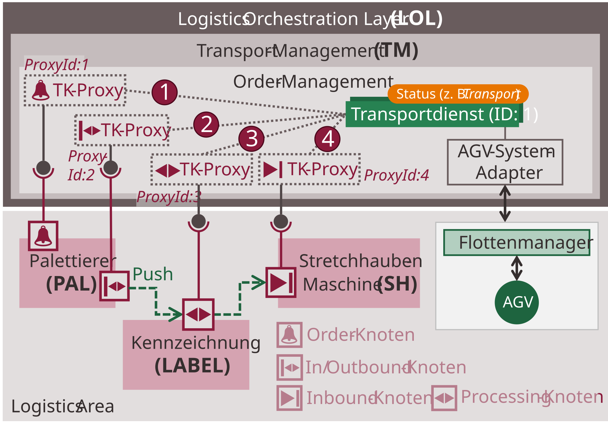
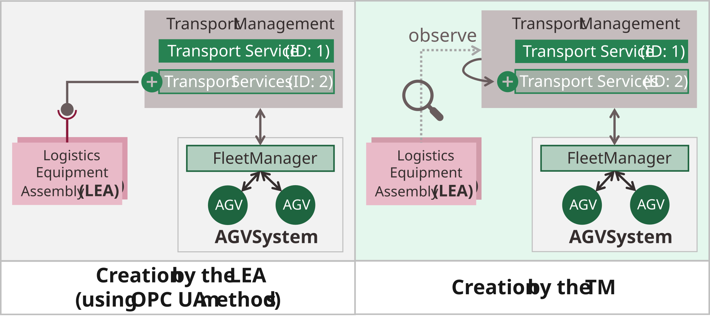
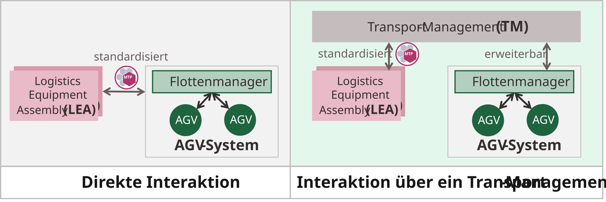
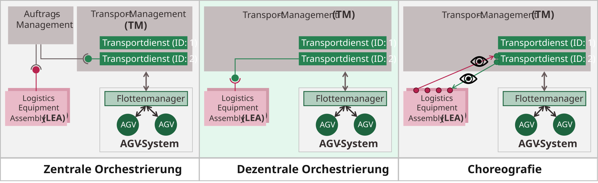
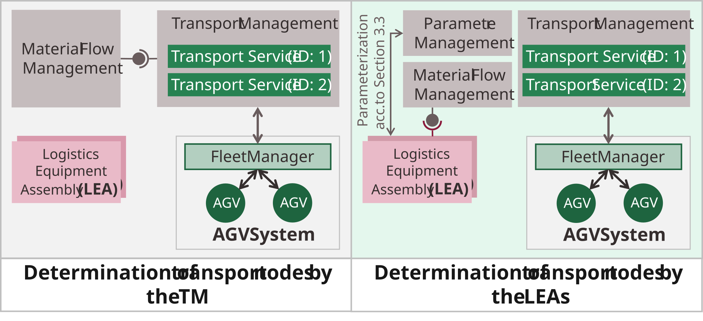
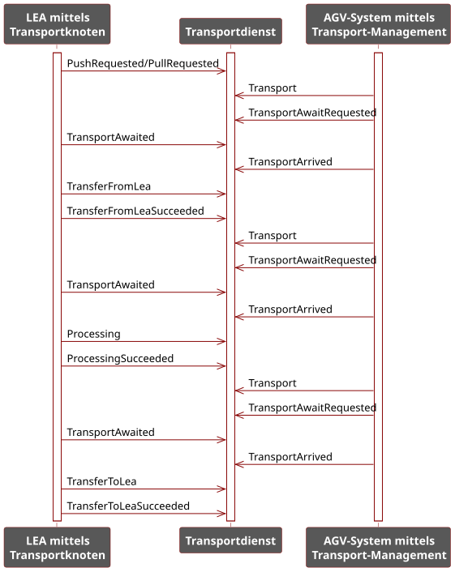
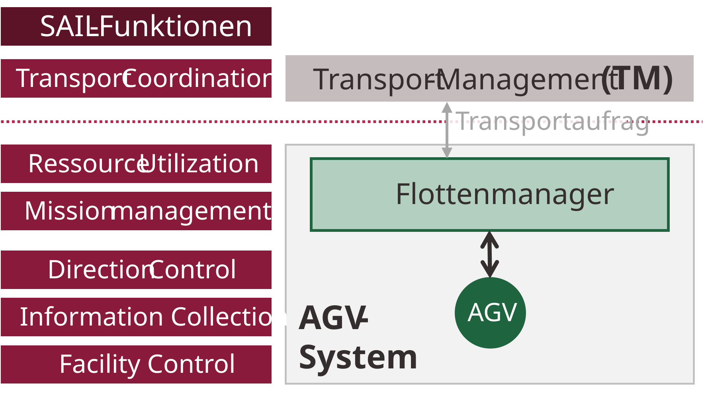

# 5 MTP-based automation of flexible transport in Logistics Areas

This chapter presents the concept for MTP-based automation of flexible transport in Logistics Areas (LA). The central artifact is the **Transport Management** — a LOL-level component that coordinates transport orders between Logistics Equipment Assemblies (LEAs) and Automated Guided Vehicle (AGV) systems. The concept builds on prior work on MTP-based LEAs [[BHF+23]](../98_References/README.md#blumenstein-et-al-2023) [[BGB+23]](../98_References/README.md#blumenstein-et-al-moprolog) and is implemented as a reference application [[Blu26]](../98_References/README.md#blumenstein-github).

## 5.1 Artifact Overview

### 5.1.1 Architecture

##### Figure 5.1: Architecture Overview of the Logistics Area Concept

[Figure 5.1](#figure-51-architecture-overview-of-the-logistics-area-concept) shows the overall architecture. At the LOL level, the Transport Management acts as the central coordination component. It integrates LEAs via their MTP files and manages all active transport orders. AGV systems are connected to the Transport Management via AGV system adapters that bridge proprietary AGV interfaces to a uniform internal interface.

Each LEA exposes one or more **transport nodes** that define the physical interaction points with AGVs:

- **InboundNode**: LO handover from AGV to LEA
- **OutboundNode**: LO pickup by AGV from LEA
- **InOutboundNode**: combined handover and pickup
- **ProcessingNode**: LEA processes an LO on an AGV without transfer
- **OrderNode**: LEA initiates a transport order without physical LO interaction

The Transport Management contains two sub-components:

- **LEA-Management**: imports LEA MTPs, generates TK-Proxies, and configures communication between TK-Proxies and TK-Bausteine in the LEAs.
- **Order-Management**: creates, manages, and deletes transport services based on active transport orders.

### 5.1.2 Working Principle

##### Figure 5.2: Working Principle of the Logistics Area Concept

The working principle is illustrated in [Figure 5.2](#figure-52-working-principle-of-the-logistics-area-concept). A LEA detects a transport need (e.g., a completed pallet ready for pickup) and signals this through its transport node. The Transport Management creates a transport service for this order. An AGV is assigned and dispatched to the first transport node. At each node, the LEA orchestrates the transport service — it confirms arrival, coordinates handover or processing, and determines the next node to approach. This continues until the LO reaches its final destination and the transport service is closed.

## 5.2 Design Decisions

Six architectural design decisions shape the concept:

- **DE1 — Indirect LEA–AGV interaction**: LEAs do not communicate directly with AGV systems. All coordination is mediated through the Transport Management to decouple LEAs from proprietary AGV interfaces.

##### Figure 5.3: Design Decision DE1 — Abstraction Level of the Transport Management

- **DE2 — One transport service per transport order**: Each active transport order is represented as one dynamically created MTP service instance. Services are created when an order is initiated and deleted when it completes.

##### Figure 5.4: Design Decision DE2 — Transport Service per Order

- **DE3 — Decentralized orchestration**: LEAs act as the orchestrating (superior) services; transport services in the Transport Management are the orchestrated (subordinate) services. LEAs control transport service execution via their TK-Bausteine.

##### Figure 5.5: Design Decision DE3 — Abstraction of the Transport Management

- **DE4 — TK-Proxy configuration by the Transport Management**: After integrating a LEA via MTP import, the Transport Management configures each TK-Baustein in the LEA by assigning it the ProxyId of its corresponding TK-Proxy. This enables the TK-Baustein to establish a direct OPC UA connection to the proxy.

##### Figure 5.6: Design Decision DE4 — Association between TK-Proxy and TK-Baustein

- **DE5 — Transport services created by the Transport Management**: Transport services are created and managed by the Transport Management (Order-Management), not by the LEAs. LEAs only signal transport needs; the Transport Management creates and assigns services.

##### Figure 5.7: Design Decision DE5 — Configuration of Transport Service Creation

- **DE6 — Next node determined by the LEA**: The LEA that currently controls a transport service determines the next transport node to approach and writes it to the *NextNode* parameter of the transport service.

##### Figure 5.8: Design Decision DE6 — Determination of the Next Node

## 5.3 Transport Process

##### Figure 5.9: Transport Process Model

[Figure 5.9](#figure-59-transport-process-model) shows the complete transport process. The process follows these steps:

1. **Order initiation**: A LEA signals a transport need. The Transport Management creates a transport service and assigns it an initial *NextNode* and *FinalTargetNode*. An AGV is dispatched.
2. **Transit**: The AGV travels to the target node. The Transport Management monitors AGV status via the AGV system adapter.
3. **Arrival at node**: When the AGV enters the approach zone, the transport service status transitions to *TransportAwaitRequested*. The Transport Management binds the transport service to the TK-Proxy of the target node. The TK-Baustein in the corresponding LEA becomes aware of the approaching AGV.
4. **Node confirmation or rejection**: The LEA either accepts (*TransportAwaited*) or rejects (*TransportDeclined*) the assignment. On rejection, the Transport Management unbinds the service from the proxy; on acceptance, the AGV is allowed to proceed to the node.
5. **AGV arrival and handover/processing**: When the AGV reaches the node (*TransportArrived*), the LEA orchestrates handover (transfer from/to LEA) or processing on the AGV. The appropriate transport status is set for each phase.
6. **Next node determination**: After completing the interaction, the LEA determines the next transport node (see [Section 5.5.3](#determination-of-the-next-transport-node)) and writes the ProxyId to *NextNode*. The Transport Management unbinds the service from the current proxy and dispatches the AGV to the next node.
7. **Transport completion**: When the AGV reaches the *FinalTargetNode* and the final interaction is complete, the transport service is closed.

**Rerouting**: If a LEA fault is detected, the Transport Management sets the transport service status to *Rerouting* (16#E) and calculates an alternative route.

## 5.4 Transport Management

### 5.4.1 LEA-Management

The LEA-Management integrates LEAs into the Transport Management by importing their MTP files. For each transport node described in the LEA's *TransportSet* (see [Section 5.5.2](#transportset)), the LEA-Management generates a **TK-Proxy** — a proxy object in the Transport Management that represents the transport node. Each TK-Proxy receives a unique integer **ProxyId**. The TK-Proxies expose the interface data of their bound transport services via an OPC UA server in the Transport Management.

After proxy generation, the Transport Management configures the TK-Bausteine in the LEA: it transmits OPC UA connection parameters (*TransportClientManager* interface) and assigns each TK-Baustein the ProxyId of its corresponding TK-Proxy (*TransportNodeManager* interface).

### 5.4.2 Order-Management

The Order-Management creates and manages transport services. Each transport order is mapped to one MTP service instance. Services are created dynamically when a transport need is detected and deleted when the order is complete.

#### Transport Service Interface

The interface of a transport service comprises the following parameters and report values:

##### Table 5.1: Interface of a Transport Service

<table>
  <tr>
    <th align="left">Name</th>
    <th align="left">Interface Type</th>
    <th align="left">Description</th>
  </tr>
  <tr>
    <td align="left">TransportControl</td>
    <td align="left">ServiceControl</td>
    <td align="left">Service control interface</td>
  </tr>
  <tr>
    <td align="left">ProductionId</td>
    <td align="left">StringServParam</td>
    <td align="left">Production order ID</td>
  </tr>
  <tr>
    <td align="left">ProductId</td>
    <td align="left">DIntServParam</td>
    <td align="left">Product type ID</td>
  </tr>
  <tr>
    <td align="left">LogisticsObjectId</td>
    <td align="left">StringServParam</td>
    <td align="left">LO instance ID</td>
  </tr>
  <tr>
    <td align="left">LogisticsObjectStatus</td>
    <td align="left">DIntServParam</td>
    <td align="left">LO packaging status</td>
  </tr>
  <tr>
    <td align="left">IsPriorityOrder</td>
    <td align="left">BinServParam</td>
    <td align="left">Priority flag</td>
  </tr>
  <tr>
    <td align="left">NextNode</td>
    <td align="left">DIntServParam</td>
    <td align="left">ProxyId of the next transport node to approach</td>
  </tr>
  <tr>
    <td align="left">FinalTargetNode</td>
    <td align="left">DIntServParam</td>
    <td align="left">ProxyId of the final destination node</td>
  </tr>
  <tr>
    <td align="left">TransportId</td>
    <td align="left">StringView</td>
    <td align="left">Unique transport order ID (read-only)</td>
  </tr>
  <tr>
    <td align="left">ResourceId</td>
    <td align="left">DIntView</td>
    <td align="left">ID of the assigned AGV (read-only)</td>
  </tr>
  <tr>
    <td align="left">RequestedTimestamp</td>
    <td align="left">DIntView + RC HasTimeFormat</td>
    <td align="left">Order initiation time (read-only)</td>
  </tr>
  <tr>
    <td align="left">LastUpdatedTimestamp</td>
    <td align="left">DIntView + RC HasTimeFormat</td>
    <td align="left">Last update time (read-only)</td>
  </tr>
  <tr>
    <td align="left">CompletedTimestamp</td>
    <td align="left">DIntView + RC HasTimeFormat</td>
    <td align="left">Completion time (read-only)</td>
  </tr>
</table>

The order metadata (*ProductionId*, *ProductId*, *LogisticsObjectId*, *LogisticsObjectStatus*, *IsPriorityOrder*) and routing parameters (*NextNode*, *FinalTargetNode*) are implemented as procedure parameters [[MTP Specification Part 4]](../98_References/README.md#mtp-specification-part-4), so that both the Transport Management and the currently bound LEA can read and modify them. The management data (*TransportId*, *ResourceId*, timestamps) are report values [[MTP Specification Part 4]](../98_References/README.md#mtp-specification-part-4) that are set by the Transport Management and read-only for LEAs.

#### Timestamp Representation

The existing MTP specification does not support time values. This dissertation introduces a new role class **RC HasTimeFormat**, which can be added to DINT-based interface definitions (in particular *DIntView*, *DIntMon*, *DIntMan*, *DIntManInt*, *DIntServParam*, *DIntProcessValueIn*) to indicate that the DINT value is to be interpreted as a timestamp.

#### Transport Status via Procedures

Transport status is represented using MTP procedures rather than parameters or process values. This enables bidirectional status control with command-enable logic. [Figure 5.10](#figure-510-transport-status-via-procedures) shows the procedure state machine extended with logistics-specific transport statuses.

##### Figure 5.10: Transport Status via Procedures

##### Figure 5.11: Overview of Procedure Switching

The transport statuses correspond to procedure identifiers. [Table 5.2](#table-52-transport-status-procedures) lists all 15 transport procedure states.

##### Table 5.2: Transport Status Procedures

<table>
  <tr>
    <th align="left">ID</th>
    <th align="left">Name</th>
    <th align="left">Description</th>
  </tr>
  <tr>
    <td align="left">16#0</td>
    <td align="left">TransportIdle</td>
    <td align="left">No active transport order</td>
  </tr>
  <tr>
    <td align="left">16#1</td>
    <td align="left">TransportRequested</td>
    <td align="left">A transport need has been signaled by a LEA; transport order is being processed by the Transport Management</td>
  </tr>
  <tr>
    <td align="left">16#2</td>
    <td align="left">TransportPrepared</td>
    <td align="left">An AGV has been assigned and the transport order has been transmitted to the AGV system</td>
  </tr>
  <tr>
    <td align="left">16#3</td>
    <td align="left">Transport</td>
    <td align="left">The AGV is traveling toward the next transport node</td>
  </tr>
  <tr>
    <td align="left">16#4</td>
    <td align="left">TransportAwaitRequested</td>
    <td align="left">The AGV is in the approach zone of the next node and requests permission to proceed to the node</td>
  </tr>
  <tr>
    <td align="left">16#5</td>
    <td align="left">TransportAwaited</td>
    <td align="left">The transport service has been bound to a LEA's proxy interface; the LEA confirms the assigned transport order</td>
  </tr>
  <tr>
    <td align="left">16#6</td>
    <td align="left">TransportDeclined</td>
    <td align="left">The transport service has been bound to a LEA's proxy interface; the LEA rejects the assigned transport order</td>
  </tr>
  <tr>
    <td align="left">16#7</td>
    <td align="left">TransportArrived</td>
    <td align="left">The AGV has reached its target node and is ready to interact with the LEA</td>
  </tr>
  <tr>
    <td align="left">16#8</td>
    <td align="left">TransferFromLea</td>
    <td align="left">An LO is being transferred from a LEA to an AGV</td>
  </tr>
  <tr>
    <td align="left">16#9</td>
    <td align="left">TransferFromLeaSucceeded</td>
    <td align="left">An LO has been successfully transferred from a LEA to an AGV</td>
  </tr>
  <tr>
    <td align="left">16#A</td>
    <td align="left">Processing</td>
    <td align="left">A LEA is performing a processing operation on an LO located on an AGV</td>
  </tr>
  <tr>
    <td align="left">16#B</td>
    <td align="left">ProcessingSucceeded</td>
    <td align="left">A processing operation has been successfully completed on an LO located on an AGV</td>
  </tr>
  <tr>
    <td align="left">16#C</td>
    <td align="left">TransferToLea</td>
    <td align="left">An LO is being transferred from an AGV to a LEA</td>
  </tr>
  <tr>
    <td align="left">16#D</td>
    <td align="left">TransferToLeaSucceeded</td>
    <td align="left">An LO has been successfully transferred from an AGV to a LEA</td>
  </tr>
  <tr>
    <td align="left">16#E</td>
    <td align="left">Rerouting</td>
    <td align="left">The transport service must be rerouted due to a LEA fault</td>
  </tr>
</table>

## 5.5 Logistics Equipment Assemblies

### 5.5.1 Structure and Interaction with Transport Services

In the transport coordination context, LEAs act as initiators of transport orders. Each transport node in a LEA is implemented as a **TK-Baustein** (transport node building block) in the LEA service. A TK-Baustein is an OPC UA client block [[OPC 30001]](../98_References/README.md#opc-30001) that connects to the OPC UA server of the Transport Management and accesses the interface data of its assigned TK-Proxy.

After binding, the TK-Baustein can read the current transport status (*ProcedureCur*) from the TK-Proxy via OPC UA Read, and write parameters such as *NextNode.VExt* via OPC UA Write. All reads and writes are batched into single read and write operations using *OpcUaReadList* and *OpcUaWriteList* blocks [[OPC 30001]](../98_References/README.md#opc-30001). Before each write, the TK-Baustein reads all writable variables first, applies the required changes, and then writes the complete variable set in a single operation — preventing inadvertent overwriting of consistent state data.

Although each TK-Baustein is persistently bound to the same TK-Proxy, the proxy may present different transport services over time as orders are created and completed. This dynamic binding differs from conventional static decentralized orchestration approaches [[Spa19]](../98_References/README.md#spaethe-2019) [[SMS+20]](../98_References/README.md#stutz-et-al-2020) and is required to support the interaction of one transport service with multiple transport nodes across different LEAs.

##### Figure 5.12: Interaction of a Transport Service with a LEA Transport Node via a TK-Proxy

##### Figure 5.13: Logical View of Decentralized Orchestration

### 5.5.2 Integration of LEAs into the Transport Management

LEA integration into the Transport Management follows three steps, as shown in [Figure 5.14](#figure-514-integration-of-a-lea-into-the-transport-management):

##### Figure 5.14: Integration of a LEA into the Transport Management

1. **MTP import**: The LEA MTP file is imported into the LEA-Management. The *TransportSet* aspect (see below) contains all transport-relevant information.
2. **TK-Proxy generation**: For each transport node described in the *TransportSet*, the Transport Management generates a TK-Proxy with a unique ProxyId and exposes its interface in the OPC UA server.
3. **LEA configuration**: The Transport Management configures each TK-Baustein in the LEA:
   - It transmits OPC UA connection parameters (endpoint URL, namespace) via the *TransportClientManager* interface, causing the LEA to establish an OPC UA client connection to the Transport Management.
   - It transmits the ProxyId of the corresponding TK-Proxy via the *TransportNodeManager* interface, enabling the TK-Baustein to derive all OPC UA NodeIds needed to access the proxy.

**Note on Logistics Lines**: For Logistics Lines (composed MTPs), the relevant transport nodes of the participating LEAs are exposed at the line interface. The interaction between transport services and these nodes is identical to that with single-LEA transport nodes.

#### TransportSet

The *TransportSet* is a new MTP aspect (profile) introduced in this dissertation to enable automated LEA integration. It contains all model and interface definitions needed to describe the transport-relevant information of a LEA. Key elements:

- **TransportNode** (abstract): base model for LEA transport nodes; concrete subtypes are *InboundNode*, *OutboundNode*, *InOutboundNode*, *ProcessingNode*, and *OrderNode*, listed in a flat list directly under the *TransportSet*.
- **OpcUaTransportClientManager**: interface for transmitting OPC UA connection parameters from the Transport Management to the LEA (derived from abstract *TransportClientManager*).
- **TransportNodeManager**: interface for assigning a TK-Baustein to its TK-Proxy via ProxyId transmission.

Each *TransportNode* model definition is associated with exactly one *TransportClientManager* and one *TransportNodeManager* interface, making it unambiguous which interfaces the Transport Management must use for a given transport node.

### 5.5.3 Determination of the Next Transport Node

According to DE6, the LEA currently bound to a transport service determines the next transport node and writes its ProxyId to the *NextNode* parameter. Four scenarios require this determination:

##### Table 5.3: Scenarios for Next Node Determination

<table>
  <tr>
    <th align="left">Case</th>
    <th align="left">Name</th>
    <th align="left">Description</th>
  </tr>
  <tr>
    <td align="left">S1</td>
    <td align="left">Push order</td>
    <td align="left">LEA has completed processing an LO and initiates a push transport for pickup. The next node is a node on the LEA itself (e.g. PAL signals a completed pallet for AGV pickup).</td>
  </tr>
  <tr>
    <td align="left">S2</td>
    <td align="left">Pull order</td>
    <td align="left">LEA requires material and initiates a pull transport. The next node is the node from which material is to be sourced (e.g. PAL requests an empty pallet from a pallet supply station).</td>
  </tr>
  <tr>
    <td align="left">S3</td>
    <td align="left">LO handover (Outbound)</td>
    <td align="left">LEA hands over an LO at an Outbound or InOutbound node. The next node is at the receiving LEA (e.g. after handover, AGV is directed to the LABEL-LEA).</td>
  </tr>
  <tr>
    <td align="left">S4</td>
    <td align="left">LO processing (Processing)</td>
    <td align="left">LEA has processed an LO on the AGV at its Processing node. The next node is at the downstream LEA (e.g. LABEL-LEA sends pallet onward to the stretch-hood machine).</td>
  </tr>
</table>

##### Figure 5.15: Cases for Next Node Determination

The *RoutingMode* variable (DINT, stored in the LEA's *ProductDataSet*) controls which method is used:

##### Table 5.4: Meaning of the *RoutingMode* Variable

<table>
  <tr>
    <th align="left">Value</th>
    <th align="left">Description</th>
  </tr>
  <tr>
    <td align="left">1</td>
    <td align="left">Use static default values from the <em>ProductDataSet</em></td>
  </tr>
  <tr>
    <td align="left">2</td>
    <td align="left">Query the next node dynamically from the Materialfluss-Management in the LOL</td>
  </tr>
</table>

#### Static Default Routes

For S1, the ProxyId of the LEA's own Outbound/InOutbound node is available internally via the *TransportNodeManager* interface — no further lookup is required.

For S2–S4, static default values can be read from the LEA's *ProductDataSet* using the *ProductId* and *LogisticsObjectStatus* as lookup keys. Two variables hold the default ProxyIds:

- **DefaultSupplyNode**: ProxyId of the node from which the LEA sources material by default (used in S2).
- **DefaultNextNode**: ProxyId of the node to which the LEA forwards completed LOs by default (used in S3 and S4). A value of `0` means the *FinalTargetNode* is used as the next (and final) node.

#### Dynamic Next Node Query

The *TransportNodeRequest* is a new logistics-specific service-operator interaction introduced in this dissertation. A LEA queries the next transport node from the Materialfluss-Management by providing the *TransportId* of the active transport service. The Materialfluss-Management returns the ProxyId of the next node, or `0` if the *FinalTargetNode* should be approached next.

## 5.6 AGV System

##### Figure 5.16: Classification within the SAIL Architecture

The Transport Management covers the Transport Coordination level of the SAIL architecture [[VDI/VDMA 5100-1]](../98_References/README.md#vdivdma-5100-1-2016), as shown in [Figure 5.16](#figure-516-classification-within-the-sail-architecture). AGV systems — each consisting of a fleet manager and multiple AGVs — execute the transport orders managed by the Transport Management.

Different AGV systems may use different proprietary interfaces (REST, MQTT, etc.). The Transport Management uses **AGV system adapters** to bridge these proprietary interfaces to a uniform internal interface. Additional adapters can be integrated via a plugin mechanism. The internal interface and adapter implementations are system-specific and not further specified in this dissertation.

For each transport order, the AGV system must be capable of providing and processing the following information:

##### Table 5.5: Minimum Interface Requirements for an AGV System

<table>
  <tr>
    <th align="left" colspan="2">Information provided by the AGV system</th>
  </tr>
  <tr>
    <th align="left">Information</th>
    <th align="left">Usage in Transport Management</th>
  </tr>
  <tr>
    <td align="left">ID of the selected AGV</td>
    <td align="left">Provided as report value <em>ResourceId</em> on the transport service</td>
  </tr>
  <tr>
    <td align="left">Indicator: AGV currently moving or stopped</td>
    <td align="left">Used to set transport status <em>Transport</em></td>
  </tr>
  <tr>
    <td align="left">Indicator: execution error</td>
    <td align="left">Used to transition transport service to error state (HELD, STOPPED, ABORTED)</td>
  </tr>
  <tr>
    <td align="left">Indicator: AGV in approach zone of target LEA</td>
    <td align="left">Used to set transport status <em>TransportAwaitRequested</em></td>
  </tr>
  <tr>
    <td align="left">Indicator: AGV arrived at target LEA</td>
    <td align="left">Used to set transport status <em>TransportArrived</em></td>
  </tr>
  <tr>
    <th align="left" colspan="2">Information consumed by the AGV system</th>
  </tr>
  <tr>
    <th align="left">Information</th>
    <th align="left">Usage in AGV system</th>
  </tr>
  <tr>
    <td align="left">ProxyId of the next transport node</td>
    <td align="left">Used as the next navigation target for the AGV</td>
  </tr>
  <tr>
    <td align="left">Indicator: transport shall start</td>
    <td align="left">Commands AGV to depart toward the next transport node</td>
  </tr>
  <tr>
    <td align="left">Clearance for AGV to approach the LEA</td>
    <td align="left">Commands AGV to move from approach zone to the LEA docking position</td>
  </tr>
  <tr>
    <td align="left">Indicator: LO handover/pickup occurring</td>
    <td align="left">Commands AGV to activate transfer mechanisms (e.g. conveyor belts)</td>
  </tr>
  <tr>
    <td align="left">Indicator: transport order complete</td>
    <td align="left">Informs fleet manager that the AGV is free for the next order</td>
  </tr>
</table>

## 5.7 MTP Extensions

The concepts described in this chapter require the following new model and interface definitions, which extend the MTP specification [[MTP Specification Part 1]](../98_References/README.md#mtp-specification-part-1) [[MTP Specification Part 4]](../98_References/README.md#mtp-specification-part-4):

##### Table 5.6: MTP Specification Extensions for Logistics Area Transport Automation

<table>
  <tr>
    <th align="left" colspan="4">Interface Definitions</th>
  </tr>
  <tr>
    <th align="left">Profile</th>
    <th align="left">Definition</th>
    <th align="left">Description</th>
    <th align="left">Detailed Spec.</th>
  </tr>
  <tr>
    <td align="left">ModuleTypePackage: TransportSet.Base V2.0.0</td>
    <td align="left"><em>SUC TransportElement</em></td>
    <td align="left">Base interface for all transport-relevant interfaces</td>
    <td align="left">Appendix</td>
  </tr>
  <tr>
    <td align="left">ModuleTypePackage: TransportSet.Base V2.0.0</td>
    <td align="left"><em>SUC TransportClientManager</em></td>
    <td align="left">Abstract interface for configuring and establishing a communication connection between a LEA and a Transport Management</td>
    <td align="left">Appendix</td>
  </tr>
  <tr>
    <td align="left">ModuleTypePackage: TransportSet.Base V2.0.0</td>
    <td align="left"><em>SUC OpcUaTransportClientManager</em></td>
    <td align="left">Interface for configuring and establishing an OPC UA connection between a LEA (client) and a Transport Management (server)</td>
    <td align="left">Appendix</td>
  </tr>
  <tr>
    <td align="left">ModuleTypePackage: TransportSet.Base V2.0.0</td>
    <td align="left"><em>SUC TransportNodeManager</em></td>
    <td align="left">Interface for assigning a TK-Baustein in the LEA to a TK-Proxy in the Transport Management</td>
    <td align="left">Appendix</td>
  </tr>
  <tr>
    <td align="left">ModuleTypePackage: DataAssemblySet.Time V2.0.0</td>
    <td align="left"><em>RC HasTimeFormat</em></td>
    <td align="left">Role class for DINT-based interfaces to indicate timestamp interpretation</td>
    <td align="left">Appendix</td>
  </tr>
  <tr>
    <td align="left">ModuleTypePackage: DataAssemblySet.Time V2.0.0</td>
    <td align="left"><em>SUC DIntView</em> (extension)</td>
    <td align="left">Extension of the existing DIntView interface to support the RC HasTimeFormat role class</td>
    <td align="left">Appendix</td>
  </tr>
  <tr>
    <th align="left" colspan="4">Model Definitions</th>
  </tr>
  <tr>
    <th align="left">Profile</th>
    <th align="left">Definition</th>
    <th align="left">Description</th>
    <th align="left">Detailed Spec.</th>
  </tr>
  <tr>
    <td align="left">ModuleTypePackage: ChoreographySet.Base V2.0.0</td>
    <td align="left"><em>IH Transports</em></td>
    <td align="left">Instance hierarchy for managing all transport-related models of an MTP</td>
    <td align="left">Appendix</td>
  </tr>
  <tr>
    <td align="left">ModuleTypePackage: TransportSet.Base V2.0.0</td>
    <td align="left"><em>SUC TransportSet</em></td>
    <td align="left">Aspect set organizing all transport-relevant model definitions</td>
    <td align="left">Appendix</td>
  </tr>
  <tr>
    <td align="left">ModuleTypePackage: TransportSet.Base V2.0.0</td>
    <td align="left"><em>SUC TransportNode</em></td>
    <td align="left">Abstract model for a transport node of a LEA</td>
    <td align="left">Appendix</td>
  </tr>
  <tr>
    <td align="left">ModuleTypePackage: TransportSet.Base V2.0.0</td>
    <td align="left"><em>SUC InboundNode</em></td>
    <td align="left">Model for an Inbound node of a LEA</td>
    <td align="left">Appendix</td>
  </tr>
  <tr>
    <td align="left">ModuleTypePackage: TransportSet.Base V2.0.0</td>
    <td align="left"><em>SUC OutboundNode</em></td>
    <td align="left">Model for an Outbound node of a LEA</td>
    <td align="left">Appendix</td>
  </tr>
  <tr>
    <td align="left">ModuleTypePackage: TransportSet.Base V2.0.0</td>
    <td align="left"><em>SUC InOutboundNode</em></td>
    <td align="left">Model for an InOutbound node of a LEA</td>
    <td align="left">Appendix</td>
  </tr>
  <tr>
    <td align="left">ModuleTypePackage: TransportSet.Base V2.0.0</td>
    <td align="left"><em>SUC ProcessingNode</em></td>
    <td align="left">Model for a Processing node of a LEA</td>
    <td align="left">Appendix</td>
  </tr>
  <tr>
    <td align="left">ModuleTypePackage: TransportSet.Base V2.0.0</td>
    <td align="left"><em>SUC OrderNode</em></td>
    <td align="left">Model for an Order node of a LEA</td>
    <td align="left">Appendix</td>
  </tr>
  <tr>
    <td align="left">ModuleTypePackage: ServiceSet.Logistics V2.0.0</td>
    <td align="left"><em>SUC TransportNodeRequest</em></td>
    <td align="left">Model of a LEA request for the next transport node to approach</td>
    <td align="left">Appendix</td>
  </tr>
</table>

Two new libraries accompany these definitions: *SUCL MTPTransportSUCLib* for all transport-relevant model definitions, and *RCL MTPDataAssemblyRCLib* for the RC HasTimeFormat role class.
