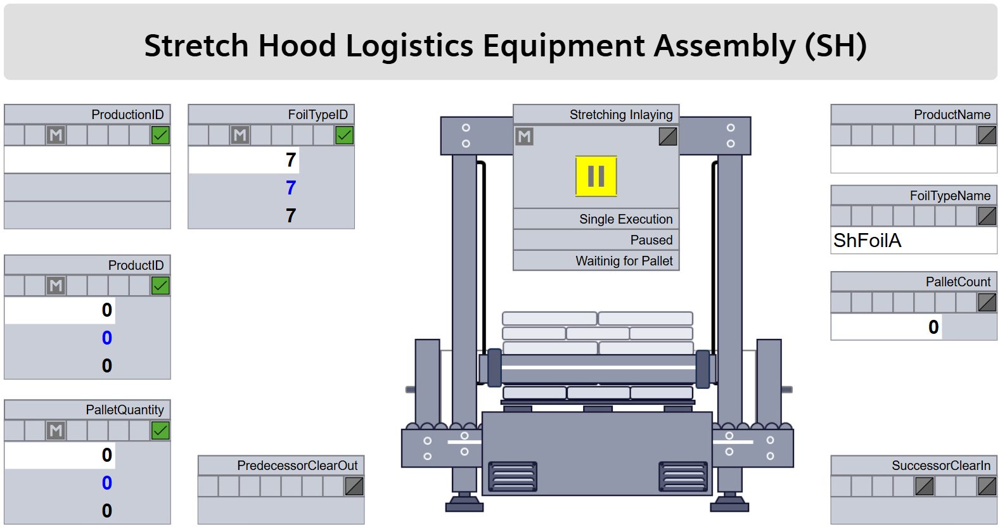

## 6.2 Application Example: Stretch Hood LEA
To illustrate the concepts described in the dissertation for LEA automation, this section presents an exemplary application of these concepts to a Stretch Hood LEA (SH), which can operate in either CES-based or SES-based mode.

### 6.2.1 Service Specification
[Table 6.2](#table-62-profile-of-an-exemplary-stretch-hood-service) provides an overview of the SH service, including its procedures, parameters, report values, and process values.

##### Table 6.2: Profile of an Exemplary Stretch Hood Service

<table>
  <tr>
    <td colspan="4" align="left"><strong>Stretch Hood Service</strong></td>
  </tr>
  <tr>
    <td colspan="4" align="left">Depending on its configuration, this service can apply film hoods to pallets containing bags or octabins, or insert film liners into empty octabins. Depending on the plant context, the SH can operate in an order-oriented manner or fulfill its various tasks on demand, potentially for different packaging processes.</td>
  </tr>
  <tr>
    <td colspan="4" align="left"><strong>Procedures</strong></td>
  </tr>
  <tr>
    <th align="left">Procedure ID</th>
    <th align="left">Name</th>
    <th colspan="2" align="left">Description</th>
  </tr>
  <tr>
    <td align="left">16#1</td>
    <td align="left">CES_Continuous (continuous)</td>
    <td colspan="2" align="left">Continuous execution of <u>one</u> of the above tasks in an always identical manner according to order data</td>
  </tr>
  <tr>
    <td align="left">16#2</td>
    <td align="left">CES_PalletQuantity (self-completing)</td>
    <td colspan="2" align="left">Execution of <u>one</u> of the above tasks in an always identical manner on a defined number of LOs according to order data</td>
  </tr>
  <tr>
    <td align="left">16#3</td>
    <td align="left">SES_Continuous (continuous)</td>
    <td colspan="2" align="left">Flexible execution of <u>different</u> tasks from above depending on the arriving LO</td>
  </tr>
  <tr>
    <td colspan="4" align="left"><strong>Order-Specific Parameters (Procedure Parameters)</strong></td>
  </tr>
  <tr>
    <th align="left">Name</th>
    <th align="left">Interface Type</th>
    <th align="left">Procedure</th>
    <th align="left">Description</th>
  </tr>
  <tr>
    <td align="left">ProductionId</td>
    <td align="left">StringServParam</td>
    <td align="left">16#1, 16#2</td>
    <td align="left">Order number</td>
  </tr>
  <tr>
    <td align="left">ProductId</td>
    <td align="left">DIntServParam</td>
    <td align="left">16#1, 16#2</td>
    <td align="left">Identifier of the product to be processed and key for selecting product-specific parameters</td>
  </tr>
  <tr>
    <td align="left">PalletQuantity</td>
    <td align="left">DIntServParam</td>
    <td align="left">16#2</td>
    <td align="left">Number of LOs to be processed</td>
  </tr>
  <tr>
    <td colspan="4" align="left"><strong>Product- and Packaging-Specific Parameters (Configuration Parameters)</strong></td>
  </tr>
  <tr>
    <th align="left">Name</th>
    <th align="left">Interface Type</th>
    <th colspan="2" align="left">Description</th>
  </tr>
  <tr>
    <td align="left">ProductDataSet</td>
    <td align="left">ArrayServParam of StretchHoodProductDataStruct</td>
    <td colspan="2" align="left">Array of product-specific parameter sets; contains, e.g., the stretch parameters to be used</td>
  </tr>
  <tr>
    <td align="left">PackagingDataSet</td>
    <td align="left">ArrayServParam of StretchHoodPackagingDataStruct</td>
    <td colspan="2" align="left">Array of packaging-specific parameter sets; contains, e.g., the properties of the stretch film to be used</td>
  </tr>
  <tr>
    <td colspan="4" align="left"><strong>Design-Specific Parameters (Configuration Parameters)</strong></td>
  </tr>
  <tr>
    <th align="left">Name</th>
    <th align="left">Interface Type</th>
    <th colspan="2" align="left">Description</th>
  </tr>
  <tr>
    <td align="left">FoilTypeId</td>
    <td align="left">DIntServParam</td>
    <td colspan="2" align="left">Identifier of the loaded film type</td>
  </tr>
  <tr>
    <td colspan="4" align="left"><strong>Report Values</strong></td>
  </tr>
  <tr>
    <th align="left">Name</th>
    <th align="left">Interface Type</th>
    <th align="left">Procedure</th>
    <th align="left">Description</th>
  </tr>
  <tr>
    <td align="left">ProductName</td>
    <td align="left">StringView</td>
    <td align="left">16#1, 16#2, 16#3</td>
    <td align="left">Name of the currently packaged product type</td>
  </tr>
  <tr>
    <td align="left">FoilTypeName</td>
    <td align="left">StringView</td>
    <td align="left">16#1, 16#2, 16#3</td>
    <td align="left">Name of the currently used film type</td>
  </tr>
  <tr>
    <td align="left">PalletCount</td>
    <td align="left">DIntView</td>
    <td align="left">16#1, 16#2, 16#3</td>
    <td align="left">Number of LOs processed so far</td>
  </tr>
  <tr>
    <td colspan="4" align="left"><strong>Process Values</strong></td>
  </tr>
  <tr>
    <th align="left">Name</th>
    <th align="left">Interface Type</th>
    <th align="left">Procedure</th>
    <th align="left">Description</th>
  </tr>
  <tr>
    <td align="left">SuccessorClearIn</td>
    <td align="left">BinProcessValueIn</td>
    <td align="left">16#1, 16#2, 16#3</td>
    <td align="left">Input for the clearance signal from a downstream LEA (relevant when using the LEA within a Logistics Line)</td>
  </tr>
  <tr>
    <td align="left">PredecessorClearOut</td>
    <td align="left">BinProcessValueOut</td>
    <td align="left">16#1, 16#2, 16#3</td>
    <td align="left">Output for the clearance signal to an upstream LEA (relevant when using the LEA within a Logistics Line)</td>
  </tr>
</table>

### 6.2.2 Mode of Operation
The mode of operation of the two CES procedures is similar to that of the PAL service. Therefore, this section focuses on the SES procedure of the SH service (16#3). It follows the SES operation described in the dissertation and is illustrated in [Figure 6.4](#figure-64-mode-of-operation-of-an-exemplary-stretch-hood-service-in-ses-mode).

##### Figure 6.4: Mode of Operation of an Exemplary Stretch Hood Service in SES Mode

Initially, the service is in the IDLE state. Pre-population of the *ProductDataSet* and *PackagingDataSet* via the corresponding *ArrayServParam* interfaces is possible. In addition, the LEA must be loaded with the desired film type, and its ID must be set at the design-specific parameter *FoilTypeId*. Using this ID, the associated packaging-specific parameters can be selected from the *PackagingDataSet* or requested from the LOL's parameter management.

Before the service is started, the desired procedure must also be selected (here: 16#3). The procedure is then started and transitions to the PAUSED state. When an LO arrives, a state transition to RESUMING takes place, and the *ProductId* as well as the *LogisticsObjectStatus* of the LO are determined. Based on this, the product-specific parameter set to be used is then determined from the *ProductDataSet* or by querying the LOL, and selected for processing. A state transition to EXECUTE follows. As the basis for processing, the *PackagingId* contained in the product data set is compared with the *FoilTypeId* configured at the LEA. If they match, the arrived LO is processed according to the configured parameters. If they do not match, the pallet cannot be processed by the LEA and is rejected (TransportDecline).

The service then transitions back to the PAUSED state and waits for the next incoming LO. If no further LOs are to be processed, the service can be terminated via a *Complete* command and reset to IDLE via a *Reset* command.

### 6.2.3 HMI Screen
[Figure 6.5](#figure-65-hmi-screen-of-a-stretch-hooding-and-film-lining-lea) shows the HMI screen of the SH. It enables the entry of order-specific parameters, control of the LEA service, and the display of report values and process values via dynamic HMI objects in accordance with [MTP Specification Part 2](../98_References/README.md#mtp-specification-part-2). In addition, it contains an image of the SH as a static HMI object. This image is stored in the MTP attachment of the SH as shown in [Figure 6.6](#figure-66-image-file-of-a-stretch-hood-lea-within-the-mtp). Since no suitable ECLASS reference exists for stretch hood machines, the reference "90900001" is used. A LOL integrating this LEA must therefore use the image provided in the MTP attachment.

##### Figure 6.5: HMI Screen of a Stretch Hooding and Film Lining LEA

##### Figure 6.6: Image File of a Stretch Hood LEA Within the MTP

