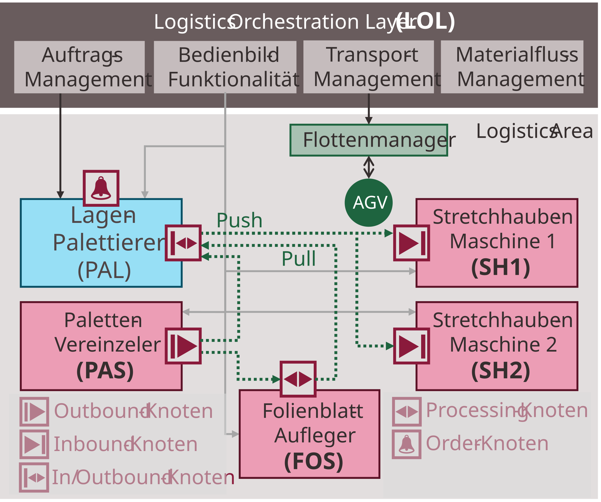
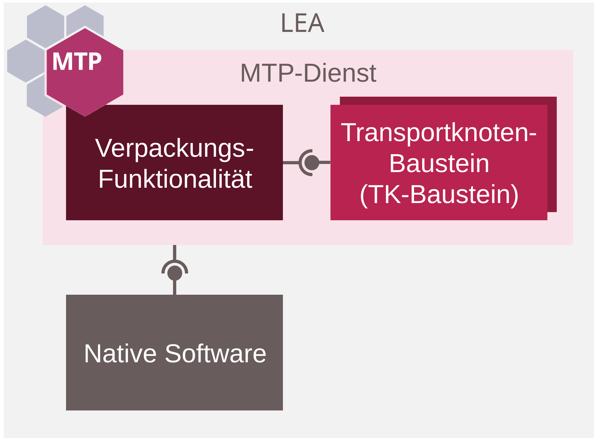

## 6.6 Evaluation Example: MoProLog Demonstrator

This section describes the second industrial evaluation example, which was carried out at BEUMER Group GmbH & Co. KG in Beckum as part of the MoProLog research project. It evaluates CES- and SES-based LEA automation in a mixed-mode Logistics Area with AGV-based transport.

### 6.6.1 Use Case

The demonstrator comprises three physical LEAs in a Logistics Area: a Palletizer (PAL), a Pallet Supply (PAS), and a Foil Supply (FOS). The PAL receives empty pallets from the PAS, palletizes bags onto them according to a predefined pattern, and — if required by the product — receives a foil sheet from the FOS before palletizing. Finished pallets are transported to one of two handover positions representing two virtual Stretch Hood Machines (SH1, SH2). The necessary pallet transports between LEAs and to the handover positions are carried out by an AGV system consisting of a fleet manager and a Transport Management function in the LOL. The LOL also provides all further orchestration functions for the system.

##### Figure 6.24: MoProLog Demonstrator at BEUMER Group in Beckum (Evaluation Example 2)

##### Figure 6.25: Structure of the MoProLog Demonstrator

### 6.6.2 Implementation

The three physical LEAs are based on the BEUMER paletpac® palletizer [[BEU25]](../98_References/README.md#beumer-group-2025), which was modularized at both hardware and software level to create three independent LEAs. Each LEA was equipped with a Siemens controller (PAL and PAS: SIMATIC S7 CPU 1512SP-1 PN; FOS: SIMATIC S7 CPU 1510SP-1 PN).

##### Figure 6.26: Structure of the LEA Services in the MoProLog Demonstrator

The automation software of each LEA consists of a native software layer — part of the paletpac® software responsible for sensor and actuator interaction — around which an MTP service implementation following the CES/SES-based LEA automation concept was developed. This implementation was extended with Transport Node function blocks for AGV integration. The PAL service was implemented according to the CES principle, since it continuously processes a single order type at high throughput [[BFG+21]](../98_References/README.md#blumenstein-et-al-design-principles). The PAS and FOS services were implemented according to the SES principle, as they are less loaded and their function is optionally needed depending on the product. The two virtual Stretch Hood Machines (SH1, SH2) were implemented as SES-based services running on emulated controllers (SIMATIC S7 CPU 1515-2 PN, emulated with SIMATIC S7-PLCSIM Advanced).

Transport between LEAs was carried out by a MAXOLUTION AGV from SEW-Eurodrive [[SEW18]](../98_References/README.md#sew-eurodrive-2018), controlled by a proprietary fleet management system from BEUMER. A prototype Transport Management function was implemented as a .NET/Angular application serving as LOL functionality to integrate the AGV system via MTP-based interfaces [[Hen22]](../98_References/README.md#henkel-2022). Additional LOL functions — order management and material flow management — were provided by Fraunhofer IML. An HMI function based on SIMATIC WinCC Unified enabled manual operation and monitoring of the Logistics Area.

### 6.6.3 Test Scenarios

Two test scenarios were successfully executed:

- **Scenario 1 — Transports with static default routes:** A Logistics Area with static material flows was assumed. Transport nodes were configured as default values in the LEA programs. Packaging orders were entered manually via the LOL HMI. Tests were conducted for two products (P1: no foil sheet required; P2: foil sheet required).
- **Scenario 2 — Transports with dynamic transport node requests:** A Logistics Area with runtime-configurable material flows was assumed. A material flow management function in the LOL determined the next transport node dynamically on request. Order management in the LOL was used for order assignment to the PAL. Tests were conducted for both products, including dynamic allocation of pallets to either SH1 or SH2.

### 6.6.4 Findings

**Practical applicability:** The tests confirm the practical applicability of CES- and SES-based LEA automation and MTP-based AGV transport integration. Scenario 1 demonstrates suitability for systems with low material flow variance or without a dedicated material flow management system. Scenario 2 demonstrates suitability for systems requiring runtime flexibility in material routing.

**Refinements to the transport concept:** Working with the demonstrator revealed the need for refinements to the transport automation concept. These are described in the appendix of the dissertation and have been incorporated into the transport concept prior to publication. The demonstrator is nonetheless used for evaluation, since the refinements target implementation robustness rather than the underlying interaction mechanism.

**Retrofitability:** The evaluation shows that a proprietary logistics machine (BEUMER paletpac®) and a proprietary AGV (SEW MAXOLUTION) can be given a first MTP interface wrapper with manageable effort. This keeps the entry barrier for retrofitting existing systems low. In the long run, the native software of logistics machines should be redesigned to align with the MTP concept, enabling a consistent software philosophy and full exploitation of software modularization (e.g., reuse of software components).

**Independent parallel development:** The LEA automation software, the AGV system, the Transport Management, and the order and material flow management in the LOL were developed independently and by different project partners. The uniform MTP interfaces nonetheless enabled fast and straightforward commissioning.
