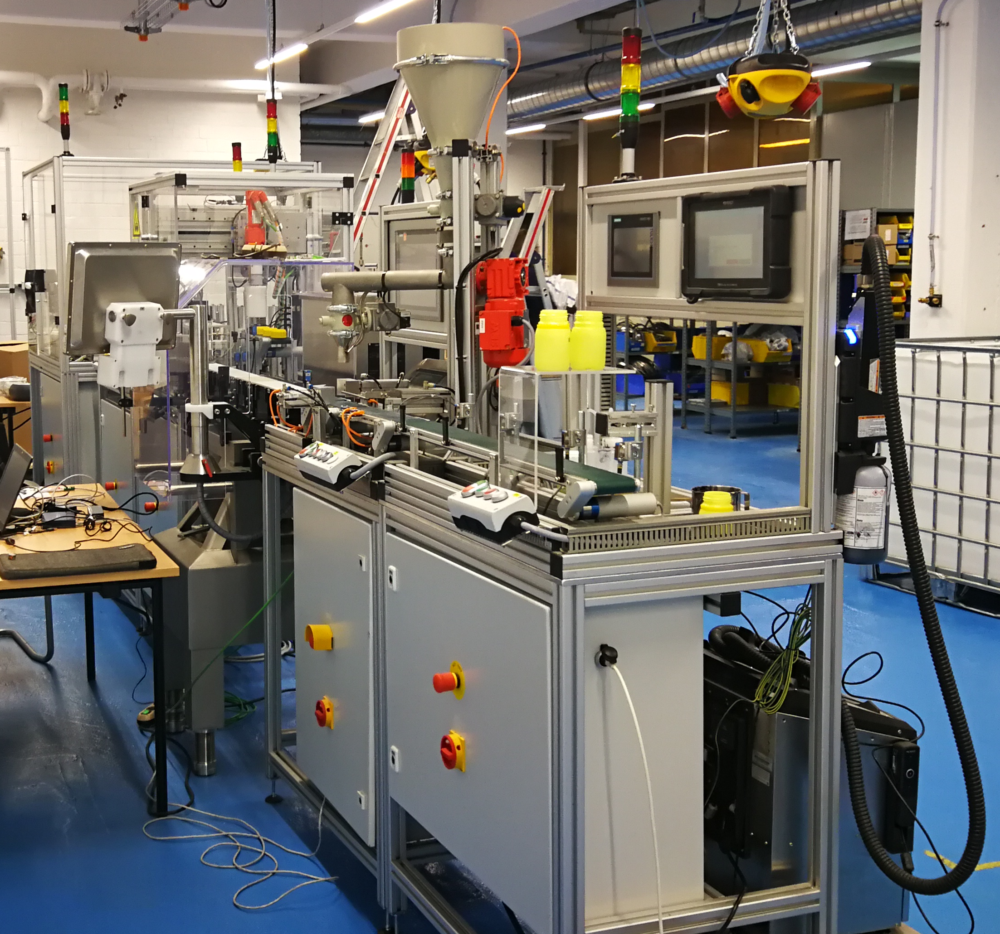
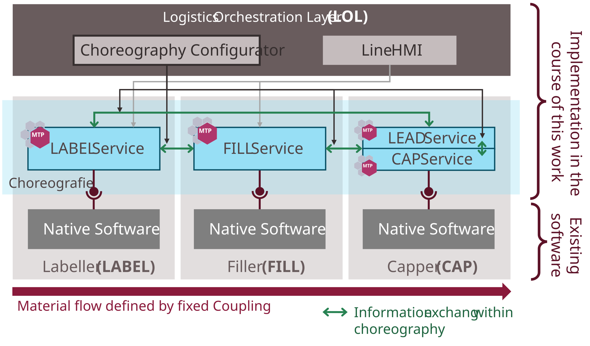
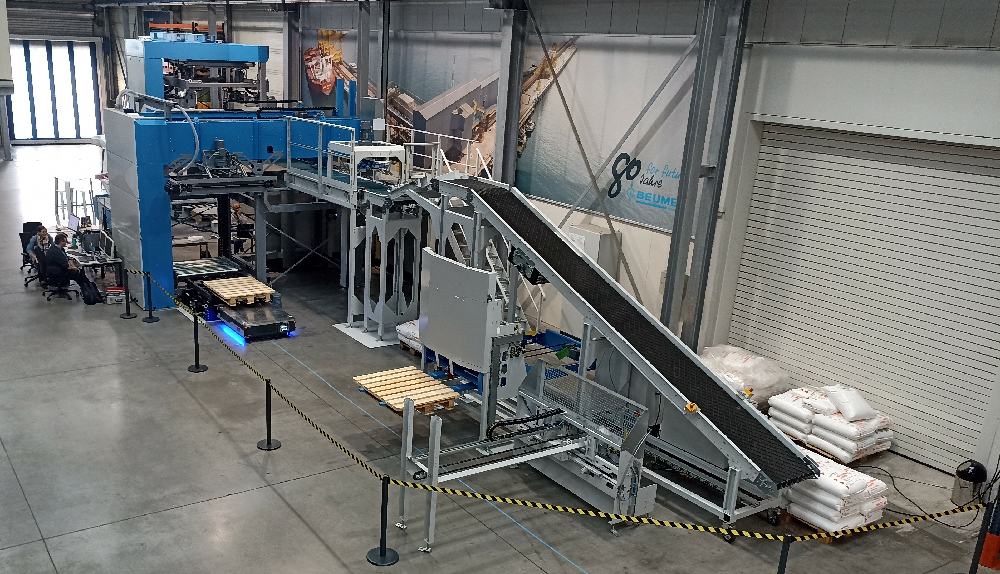
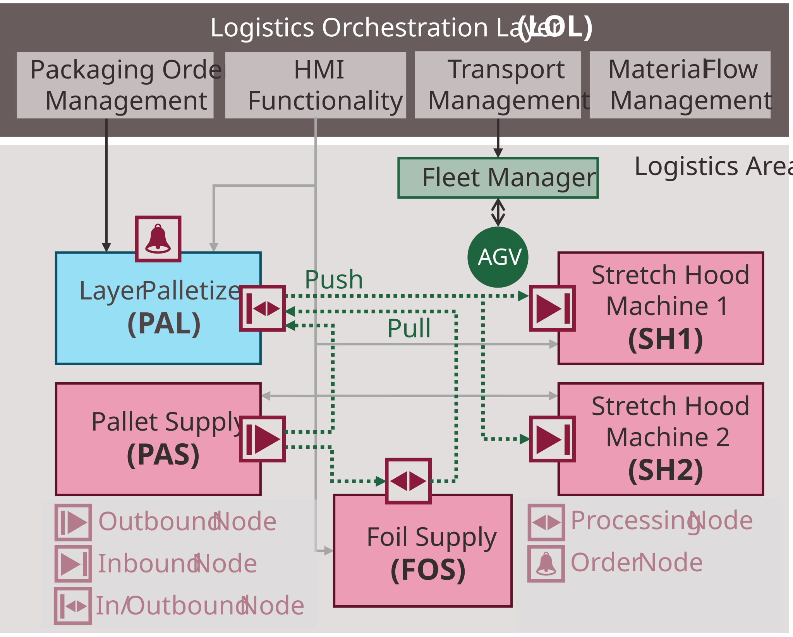
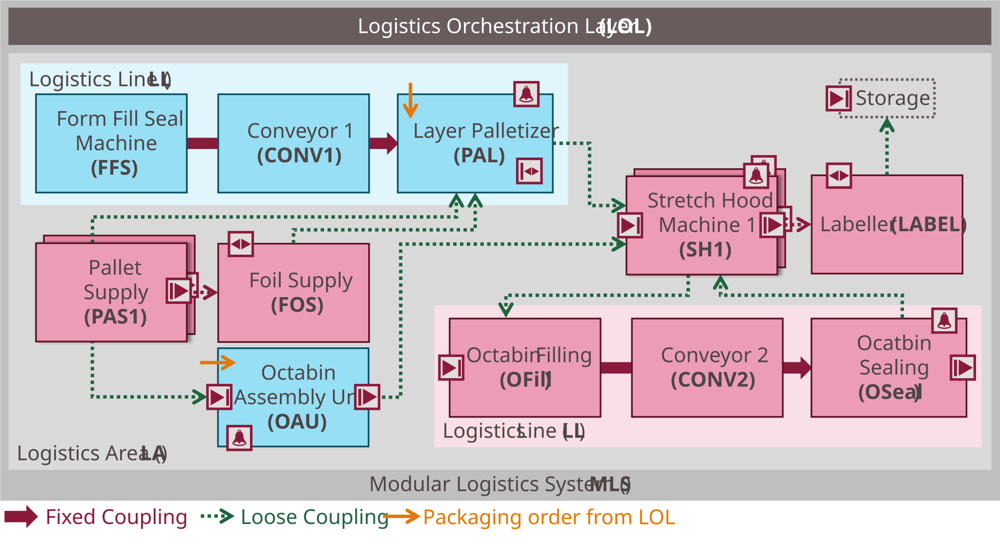

## 6.1 Evaluation Examples

The evaluation examples were investigated as controlled experiments (*Single Case Experiments* per [[Wie14]](../08_References/README.md#wieringa-2014), *Controlled Experiments* per [[HMP+04]](../08_References/README.md#hevner-et-al-2004)). Defined test scenarios with specific stimuli were executed on prototypical implementations, and the system reactions were observed and assessed. This allows predictions about artifact performance in real-world contexts, even though the artifacts have not yet been deployed in productive logistics systems [[Wie14]](../08_References/README.md#wieringa-2014).

[Table 6.1](#table-61-implementation-of-the-artifacts-in-three-evaluation-examples) shows which artifacts are implemented in each evaluation example. Every artifact is implemented in at least two examples, demonstrating applicability across different scenarios. In addition, each artifact is implemented in at least one physical system (BASF or MoProLog demonstrator), confirming practical feasibility with industrial control hardware.

##### Table 6.1: Implementation of the Artifacts in Three Evaluation Examples

<table>
  <tr>
    <th align="left"></th>
    <th align="left">BASF</th>
    <th align="left">MoProLog</th>
    <th align="left">Emulation</th>
  </tr>
  <tr>
    <td align="left"><strong>Artifact 1 — LEA Automation</strong></td>
    <td align="left">x (CES)</td>
    <td align="left">x (CES & SES)</td>
    <td align="left">x (CES & SES)</td>
  </tr>
  <tr>
    <td align="left"><strong>Artifact 2 — Logistics Line Automation</strong></td>
    <td align="left">x</td>
    <td align="left"></td>
    <td align="left">x</td>
  </tr>
  <tr>
    <td align="left"><strong>Artifact 3 — Logistics Area Automation</strong></td>
    <td align="left"></td>
    <td align="left">x</td>
    <td align="left">x</td>
  </tr>
</table>

For each evaluation example, the following sections describe the use case, the prototype implementation, the test scenarios and their results, as well as derived findings.

### 6.1.1 BASF Demonstrator

This section describes the first evaluation example, carried out at BASF SE in Ludwigshafen. It evaluates CES-based LEA automation ([Chapter 3](../03_Logistics_Equipment_Assemblies/03_Logistics_Equipment_Assemblies.md)) and choreography-based Logistics Line automation ([Chapter 4](../04_Logistics_Line/04_Logistics_Line.md)).

#### Use Case

[Figure 6.1](#figure-61-basf-bottle-filling-laboratory-system-at-basf-se-ludwigshafen) shows a laboratory-scale bottle-filling system. Three physical LEAs are arranged in a Logistics Line: a Labeller (LABEL), a Filler (FILL), and a Capper (CAP). The LABEL prints plastic bottles, the FILL fills them with granulate, and the CAP seals them. The LEAs are rigidly coupled, so the material flow is fixed by the physical layout. A LOL provides orchestration functions for the system.

##### Figure 6.1: BASF Bottle-Filling Laboratory System at BASF SE Ludwigshafen

#### Implementation

[Figure 6.2](#figure-62-setup-of-the-basf-demonstrator-and-implemented-logistics-process) shows the automation architecture. The system had been planned and physically built prior to this work. Each module was equipped with a Siemens controller (LABEL: SIMATIC S7 CPU 1511-1 PN; FILL: SIMATIC S7 CPU 1516-3 PN/DP; CAP: SIMATIC S7 CPU 1512SP-1 PN) running a native control program for sensor and actuator interaction.

##### Figure 6.2: Setup of the BASF Demonstrator and Implemented Logistics Process

As part of this evaluation, an MTP service implementation following the CES concept ([Chapter 3](../03_Logistics_Equipment_Assemblies/03_Logistics_Equipment_Assemblies.md)) was retrofitted around the native software of each module, turning them into LEAs. All three LEAs were automated according to the CES principle as described in [Chapter 3](../03_Logistics_Equipment_Assemblies/03_Logistics_Equipment_Assemblies.md). Parameterization used single values only (no parameter sets), as the LEAs just had few parameters.

The three LEAs were integrated into a Logistics Line using the choreography concept ([Chapter 4](../04_Logistics_Line/04_Logistics_Line.md)). An External Lead Service was implemented in the CAP controller. The implementations are based on prototype block libraries from Siemens AG for SIMATIC TIA Portal V17. The choreography library was extended with new function blocks for MTP-based choreography configuration.

The LOL provides a choreography configurator (NestJS/Angular application, developed in [[Kem22]](../08_References/README.md#kempin-2022)) for configuring and downloading choreography relations to the LEAs, and a line HMI screen (SIMATIC WinCC Unified) for operator control.

#### Test Scenarios

The test scenarios shown in [Table 6.1](#table-61-test-scenarios-at-the-basf-logistics-line) have successfully been executed.

##### Table 6.1: Test Scenarios at the BASF Logistics Line

<table>
  <tr>
    <th align="left">Test Scenario</th>
    <th align="left">Description</th>
  </tr>
  <tr>
    <td align="left">Loading the choreography configuration</td>
    <td align="left">The choreography configuration was loaded and activated on all three LEAs — LABEL, FILL, and CAP.</td>
  </tr>
  <tr>
    <td align="left">Setting access modes</td>
    <td align="left">The access modes of LEA services and ProductId variables were set to control whether access is permitted (1) only from within the choreography or (2) also from external systems.</td>
  </tr>
  <tr>
    <td align="left">Clearance signal transmission</td>
    <td align="left">Continuous clearance signals were correctly exchanged between LEAs, ensuring each upstream LEA knew whether the downstream LEA was ready to accept logistics objects. In this test case, only the initial transmission was explicitly tested. The subsequent test cases require correct clearance signal transmission; their successful completion implicitly validated that continuous transmission functioned correctly as well.</td>
  </tr>
  <tr>
    <td align="left">Procedure assignment</td>
    <td align="left">The procedure was set at the Lead. All other LEA services adopted this procedure setting.</td>
  </tr>
  <tr>
    <td align="left">Product ID propagation</td>
    <td align="left">The product ID was set at the FILL and was adopted by the other two LEAs via the choreography.</td>
  </tr>
  <tr>
    <td align="left">Start-up</td>
    <td align="left">Triggered by a <em>Start</em> command at the Lead, the Logistics Line was started from back to front (CAP -> FILL -> LABEL). During start-up, the Lead was in state STARTING. Once all three LEA services had reached EXECUTE, the Lead transitioned to EXECUTE as well.</td>
  </tr>
  <tr>
    <td align="left">Emptying</td>
    <td align="left">Triggered by a <em>Complete</em> command at the Lead, the Logistics Line was emptied from front to back (LABEL -> FILL -> CAP). During emptying, the Lead was in state COMPLETING. Once all three LEA services had reached COMPLETED, the Lead transitioned to COMPLETED as well.</td>
  </tr>
  <tr>
    <td align="left">Reset</td>
    <td align="left">Triggered by a <em>Reset</em> command at the Lead, all LEA services were reset from the COMPLETED, STOPPED, or ABORTED state to the initial state IDLE. During resetting, the Lead was in state RESETTING. Once all three LEA services had reached IDLE, the Lead transitioned to IDLE as well.</td>
  </tr>
  <tr>
    <td align="left">Stop</td>
    <td align="left">When any LEA service or the Lead entered STOPPING or STOPPED, all other LEA services were stopped as well. The Lead was in state STOPPING. Once all three LEA services had reached STOPPED, the Lead transitioned to STOPPED as well.</td>
  </tr>
  <tr>
    <td align="left">Abort</td>
    <td align="left">When any LEA service or the Lead entered ABORTING or ABORTED, all other LEA services were aborted as well. The Lead was in state ABORTING. Once all three LEA services had reached ABORTED, the Lead transitioned to ABORTED as well.</td>
  </tr>
  <tr>
    <td align="left">Hold</td>
    <td align="left">When any LEA service or the Lead entered HOLDING or HELD, all other LEA services were held as well. The Lead was in state HOLDING. Once all three LEA services had reached HELD, the Lead transitioned to HELD as well.</td>
  </tr>
  <tr>
    <td align="left">Restart after hold</td>
    <td align="left">Triggered by an <em>Unhold</em> command at the Lead, the Logistics Line was unheld from back to front (CAP -> FILL -> LABEL) after a hold (state HELD). The Lead was in state UNHOLDING. Once all three LEA services had reached EXECUTE, the Lead transitioned to EXECUTE as well.</td>
  </tr>
  <tr>
    <td align="left">Pause</td>
    <td align="left">When any LEA service or the Lead entered PAUSING or PAUSED, all other LEA services were paused as well. The Lead was in state PAUSING. Once all three LEA services had reached PAUSED, the Lead transitioned to PAUSED as well.</td>
  </tr>
  <tr>
    <td align="left">Restart after pause</td>
    <td align="left">Triggered by a <em>Resume</em> command at the Lead, the Logistics Line was resumed from back to front (CAP -> FILL -> LABEL) after a pause (state PAUSED). The Lead was in state RESUMING. Once all three LEA services had reached EXECUTE, the Lead transitioned to EXECUTE as well.</td>
  </tr>
</table>

#### Findings

**Practical applicability:** The tests confirm the practical applicability of CES-based LEA automation and choreography-based Logistics Line automation.

**Modular line composition:** The choreography concept enables independent, choreography-capable LEAs to be combined into a Logistics Line as needed.

**Configuration without reprogramming:** Choreography rules are stored as configuration in each LEA's program without modifying or reloading the program itself. LEA development and testing are thus decoupled from line logic configuration and testing.

**Distributed coordination:** Runtime control of the Logistics Line is achieved through distributed coordination among the LEAs, enabling shortest possible reaction times (e.g., in error scenarios). No permanent LOL connection is required, and the LOL faces lower requirements regarding availability and real-time capability. The LOL serves only for choreography configuration and line monitoring.

**Choreography design complexity:** Defining choreography rules requires careful consideration. 
> For example, naive fault-propagation rules that push LEAs into HELD immediately when another LEA enters HELD make it impossible to restart the line, because the first LEA to recover is immediately re-faulted by the still-held peers. A solution is to trigger transitions only on rising edges rather than on state levels. Design principles and methods for ensuring correct choreography behavior are outside the scope of this work.

**Retrofitability:** The evaluation shows that MTP service interfaces and choreography capability can be retrofitted around existing native software, lowering the entry barrier for brownfield systems. Long-term, native LEA software should be redesigned to fully exploit MTP and choreography capabilities (e.g., distinguishing Hold, Stop, and Abort as escalation levels).

**Structured and array-based data types in choreographies:** Current concepts and implementations only support interconnecting primitive data types within choreographies. This is sufficient for the use cases considered in this work. Should structured or array-based data types be interconnected via choreographies in the future, both connected LEAs must use identical data types. For vendor-neutral interconnection, these data types would need to be standardized and the choreography concepts would need to be extended accordingly.

### 6.1.2 MoProLog Demonstrator

This section describes the second evaluation example, carried out at BEUMER Group GmbH & Co. KG in Beckum as part of the MoProLog research project. It evaluates CES- and SES-based LEA automation ([Chapter 3](../03_Logistics_Equipment_Assemblies/03_Logistics_Equipment_Assemblies.md)) and MTP-based AGV transport integration ([Chapter 5](../05_Logistics_Area/05_Logistics_Area.md)).

#### Use Case

[Figure 6.3](#figure-63-moprolog-demonstrator-at-beumer-group-in-beckum) shows the demonstrator comprising three physical LEAs in a Logistics Area: a Palletizer (PAL), a Pallet Supply (PAS), and a Foil Supply (FOS). The PAL receives empty pallets from the PAS and palletizes bags according to a predefined pattern. If required, the FOS applies a foil sheet to the empty pallet beforehand. Finished pallets are transported to one of two handover positions representing virtual Stretch Hood Machines (SH1, SH2). The stretch hood machines are implemented as emulations only; the physical process ends when the pallet has been transported to one of the two handover positions, where the AGV is manually unloaded. Transports between the LEAs and to the handover positions are carried out by an AGV system consisting of a fleet manager (controlling a single AGV) and a Transport Management function in the LOL. The LOL also provides all other necessary orchestration functions for the MLS. [Figure 6.4](#figure-64-structure-of-the-moprolog-demonstrator) shows the implemented process, the MLS components, and the available transport nodes in the system.

##### Figure 6.3: MoProLog Demonstrator at BEUMER Group in Beckum

##### Figure 6.4: Structure of the MoProLog Demonstrator

#### Implementation

The three physical LEAs were based on the BEUMER paletpac palletizer [[BEU25]](../08_References/README.md#beumer-group-2025), modularized at hardware and software level into three independent LEAs. Each LEA was equipped with a Siemens controller (PAL and PAS: SIMATIC S7 CPU 1512SP-1 PN; FOS: SIMATIC S7 CPU 1510SP-1 PN).

##### Figure 6.5: Structure of the LEA Services in the MoProLog Demonstrator

The automation software of each LEA ([Figure 6.5](#figure-65-structure-of-the-lea-services-in-the-moprolog-demonstrator)) consists of a native software layer (part of the paletpac software for sensor and actuator interaction), surrounded by an MTP service implementation and Transport Node function blocks for decentralized orchestration of transport services according to [Chapter 5](../05_Logistics_Area/05_Logistics_Area.md). Each MTP service contained packaging functionality connected to the native software via a coordinated proprietary interface, controlling palletizing, pallet supply, or foil sheet application respectively. The *ProductDataSet* and *PackagingDataSet* of the LEAs were filled manually in this case, not via *ArrayServParam* interfaces. The MTP service implementations are based on a prototype MTP function block library for SIMATIC TIA Portal V17 from Siemens AG, extended with new function blocks (mainly Transport Node blocks and client blocks for Transport Management integration) developed on the basis of the concepts of this work.

The PAL service follows the CES principle, as it continuously processes a single order type at high throughput [[BFG+21]](../08_References/README.md#blumenstein-et-al-design-principles). The PAS and FOS services follow the SES principle, since they are less loaded and their function is optionally needed depending on the product. This would also allow PAS and FOS to serve other packaging processes or, conversely, to provide the PAL with alternative pallet or foil types for different products using other PAS and FOS LEAs. The two virtual Stretch Hood Machines (SH1, SH2) were implemented as SES-based services on virtual controllers (SIMATIC S7 CPU 1515-2 PN) emulated via SIMATIC S7-PLCSIM Advanced. These LEAs contained no real sensors or actuators; instead, a function block emulating the stretch hood machine behavior was connected as native software.

Transports were carried out by a MAXO-MS-TV015 AGV from SEW-Eurodrive [[SEW18]](../08_References/README.md#sew-eurodrive-2018), controlled by a proprietary fleet management system from BEUMER. The fleet management system and the AGV constituted an AGV system with proprietary interfaces. A prototype Transport Management was implemented as a .NET/Angular application [[Hen22]](../08_References/README.md#henkel-2022) to integrate the AGV system via MTP-based interfaces. Additional LOL functions — packaging order management and material flow management — were provided by the Fraunhofer Institute for Material Flow and Logistics (IML). The packaging order management served to manage packaging orders and provide them to the PAL. The material flow management planned the material flow in the MLS and provided LEAs with information about the next transport node on request. An HMI based on SIMATIC WinCC Unified enabled manual operation and monitoring of the LEAs in the Logistics Area.

#### Test Scenarios

The test scenarios shown in [Table 6.2](#table-62-test-scenarios-at-the-moprolog-demonstrator-evaluation-example-2) have successfully been executed.

##### Table 6.2: Test Scenarios at the MoProLog Demonstrator (Evaluation Example 2)

<table>
  <tr>
    <th align="left">Test Scenario</th>
    <th align="left">Description</th>
  </tr>
  <tr>
    <td align="left">Transports using static default routes</td>
    <td align="left">A system with static transport processes was assumed, where the material flow for the same product is always identical. The transport nodes to be approached were configured as default values in the LEA programs. Packaging orders were entered manually via the LOL HMI. The packaging order management and material flow management in the LOL were not used. Tests were conducted for two products: P1 (no foil sheet required) and P2 (foil sheet required).</td>
  </tr>
  <tr>
    <td align="left">Transports using dynamic transport node requests</td>
    <td align="left">A system with dynamic transport processes was assumed, where material flows are determined flexibly at runtime. A material flow management function in the LOL optimized the material flow at runtime and answered LEA requests for the next transport node. Only in case of material flow management failure the locally stored default values for the next transport node were used as fallback. Packaging order management in the LOL was used to assign packaging orders to the PAL. Tests were conducted for two products: P1 (no foil sheet required) and P2 (foil sheet required). Additionally, finished pallets were dynamically allocated to SH1 or SH2 as needed.</td>
  </tr>
</table>

#### Findings

**Practical applicability:** The tests confirm the practical applicability of CES- and SES-based LEA automation and MTP-based AGV transport integration. Scenario 1 demonstrated transports with predefined material flows and manual packaging order entry for different products; this approach suits systems with low material flow variance during operation or where no dedicated packaging order and material flow management system can or should be provided. Scenario 2 demonstrated transports with runtime-configurable material flows and automated packaging order entry for different products; this approach suits systems with high material flow variance during operation that have dedicated packaging order and material flow management systems.

**Refinements to the transport concept:** Working with the demonstrator revealed the need for refinements to the transport automation concept shown in [Table 6.3](#table-63-refinements-to-artifact-3-based-on-findings-from-the-moprolog-demonstrator). These target more robust, uniform, and simpler implementation (rather than changes to the underlying interaction mechanism) and have already been incorporated into the transport concept in [Chapter 5](../05_Logistics_Area/05_Logistics_Area.md). They are also evaluated in the PLC-based emulation ([Section 6.1.3](#613-plc-based-emulation)).

<blockquote>

##### Table 6.3: Refinements to Artifact 3 Based on Findings from the MoProLog Demonstrator

<table>
  <tr>
    <th align="left">Original Concept</th>
    <th align="left">Revised Concept</th>
    <th align="left">Reason for Change</th>
  </tr>
  <tr>
    <td align="left">The transport service interface contained <em>StartNode</em> and <em>TargetNode</em> parameters for specifying the transport nodes to approach.</td>
    <td align="left">The transport service interface contains only a single <em>NextNode</em> parameter for specifying the next transport node to approach.</td>
    <td align="left">Transports can involve any number of transport nodes due to processing nodes, not just a start and a target. The <em>StartNode</em> and <em>TargetNode</em> parameters provided no benefit and instead increased configuration effort.</td>
  </tr>
  <tr>
    <td align="left">The transport service interface contained an <em>InteractNextNode</em> variable for specifying the next transport node to approach.</td>
    <td align="left">The next transport node information is obtained directly from the <em>LogisticsAnswerId</em> variable of a <em>TransportNodeRequest</em>.</td>
    <td align="left">Both transport node ID and <em>LogisticsAnswerId</em> are of type DINT, so the <em>LogisticsAnswerId</em> can be interpreted directly as the next transport node ID. This saves a parameter on the transport service. Furthermore, <em>LogisticsAnswerId</em> is semantically linked to the <em>TransportNodeRequest</em> directly, whereas <em>InteractNextNode</em> would require additional mechanisms for semantic association.</td>
  </tr>
  <tr>
    <td align="left">Transport services in the Transport Management were connected to TN function blocks in the LEAs via OPC UA connections that were reconfigured at runtime.</td>
    <td align="left">Transport services are connected via TN proxies that are statically bound to TN function blocks; transport services are assigned to these proxies dynamically.</td>
    <td align="left">Continuous reconfiguration of OPC UA connections at runtime proved time-intensive and unreliable. Now, the OPC UA connection between an LEA and a Transport Management is established only once during commissioning, and TN function blocks are statically bound to TN proxies. Dynamic assignment of transport services to these proxies takes place entirely within the Transport Management.</td>
  </tr>
  <tr>
    <td align="left">Only the procedure <em>TransportAwait</em> was available on the transport service to signal the clearance for an AGV to approach an LEA.</td>
    <td align="left">The procedures <em>TransportAwaitRequested</em> (request to approach) and <em>TransportAwaited</em> (clearance to approach) are available.</td>
    <td align="left">In the original concept, the AGV system's request to approach was only signaled implicitly by coupling the transport service to the LEA's transport node; the transport service status did not clearly indicate this request. The new procedure <em>TransportAwaitRequested</em> makes the request explicitly visible.</td>
  </tr>
  <tr>
    <td align="left">The procedures <em>Takeover</em>/ <em>TakeoverSucceeded</em> and <em>Handover</em>/ <em>HandoverSucceeded</em> signaled LO transfers between LEAs and AGVs.</td>
    <td align="left">The procedures <em>TransferFromLea</em>/ <em>TransferFromLeaSucceeded</em> (LEA to AGV) and <em>TransferToLea</em>/ <em>TransferToLeaSucceeded</em> (AGV to LEA) signal LO transfers.</td>
    <td align="left">The original procedure names did not clearly describe the direction of the LO transfer. The new names unambiguously describe the transfer direction.</td>
  </tr>
  <tr>
    <td align="left">No defined variable names were specified for the default value of the next transport node in the <em>ProductDataSet</em>.</td>
    <td align="left">The variables <em>DefaultSupplyNode</em> and <em>DefaultNextNode</em> are designated for this purpose in the <em>ProductDataSet</em>.</td>
    <td align="left">Only through this explicit naming convention can the LOL unambiguously identify these variables.</td>
  </tr>
  <tr>
    <td align="left">The value "-1" indicated the use of the <em>FinalTargetNode</em> as the next transport node to approach.</td>
    <td align="left">The value "0" indicates the use of the <em>FinalTargetNode</em> as the next transport node to approach.</td>
    <td align="left">This change was necessary in the context of the <em>TransportNodeRequest</em>, where the value "-1" is interpreted as "no answer available yet". The value "0" was chosen for the <em>FinalTargetNode</em> to differentiate the two cases.</td>
  </tr>
</table>

</blockquote>

**Retrofitability:** A proprietary logistics machine (BEUMER paletpac) and a proprietary AGV (SEW MAXOLUTION) were given MTP interface wrappers with manageable effort. This keeps the entry barrier for retrofitting existing systems low. Long-term, native LEA software should be redesigned according to MTP concepts to establish a uniform software philosophy and fully exploit the possibilities of software modularization (e.g., reusability of software components).

**Independent parallel development:** The LEA automation software, the AGV system, the Transport Management, and the packaging order/ material flow management were developed independently by different project partners. The uniform MTP interfaces nonetheless enabled fast and straightforward commissioning.

### 6.1.3 PLC-Based Emulation

This section describes the third evaluation example: a comprehensive MLS emulated with virtual PLCs. It evaluates the combined application of all three artifacts — LEA automation, Logistics Line choreography, and AGV transport integration — in a realistic multi-process system.

#### Use Case

The MLS serves two packaging processes — bag filling and octabin filling — executed concurrently. [Figure 6.6](#figure-66-plc-based-emulation-of-a-modular-logistics-system) shows the system layout, transport nodes, and possible material flows.[^figure-note]

[^figure-note]: For clarity, some material flows in the figure are shown docking at the LEAs rather than at the transport nodes. Nevertheless, all LO handovers and takeovers take place at the transport nodes.

##### Figure 6.6: PLC-Based Emulation of a Modular Logistics System

**Bag filling process:** A CES-based Logistics Line of three LEAs — a Form-Fill-Seal machine (FFS), a Conveyor (CONV), and a Palletizer (PAL) — processes packaging orders from the LOL. Two SES-based Pallet Supplies (PAS1, PAS2) provide different pallet types on demand. An SES-based Foil Supply (FOS) optionally applies a foil layer. After palletizing, one of two SES-based Stretch Hood Machines (SH1, SH2) applies load securing. A Labeller (LABEL) provides final identification. Finished pallets are transported to a Stock (STOCK) LEA, which is also served by the AGV system. The automation of the stock itself is not part of this evaluation example; it is represented in simplified form by an SES-based service. All LEAs outside the Logistics Line are loosely coupled single LEAs operating demand-oriented, with transports carried out by an AGV system.

**Octabin filling process:** A CES-based Octabin Assembly Unit (OAU) erects octabins using pallets from the shared PAS LEAs. One of the SH LEAs inserts a foil inlay. An SES-based Logistics Line — Octabin Filler (OFill), Conveyor (CONV2), and Sealing Station (OSeal) — processes octabins demand-oriented as they arrive. Load securing and labelling are performed by the shared SH and LABEL LEAs already introduced for the bag filling process. Finished octabins are transported to the STOCK LEA. The LEAs of the octabin filling Logistics Line are physically coupled; all other LEAs participating in the octabin process are loosely coupled, with transports carried out by the AGV system. 

The example intentionally combines order-oriented and demand-oriented single LEAs, order-oriented and demand-oriented Logistics Lines, and shared LEAs across both processes, covering the full diversity of MLS configurations analyzed in the MoProLog project.

#### Implementation

The emulation uses SIMATIC S7-PLCSIM Advanced and TIA Portal V18. Each LEA runs on a virtual SIMATIC S7-1500 controller that communicates via OPC UA exactly as a real controller would. Since the focus is on communication over MTP interfaces rather than LEA-internal automation, the emulated LEAs do not differ from physical LEAs in this regard. Logistics objects are modeled virtually: handovers within Logistics Lines use binary process value interconnections; in the Logistics Area, a virtual LO is represented by its transporting AGV.

Each emulated LEA consists of a simplified function block emulating the LEA's logistics function, surrounded by an MTP service implementation. Blue LEAs in [Figure 6.6](#figure-66-plc-based-emulation-of-a-modular-logistics-system) operate in CES mode — they receive packaging orders and execute them cyclically. Red LEAs operate in SES mode — they are activated and parameterized on demand when their functionality is needed. For all LEAs, parameterization follows the structured parameter set concept using *ProductDataSet* and *PackagingDataSet*. Regarding logistics-specific interactions (*LogisticsInteractions*), only the *TransportNodeRequest* was implemented; the *ProductParameterRequest*, *PackagingParameterRequest*, *ProductParameterUpdateInfo*, and *PackagingParameterUpdateInfo* are structurally similar and would work the same way.

The two Logistics Lines use the choreography concept with External Lead Services (LEADBag for bag filling; LEADOct for octabin filling). The CES-based bag filling line follows the same start-up and completion logic as the BASF demonstrator ([Section 6.1.1](#611-basf-demonstrator)). This Logistics Line was presented and discussed at ACHEMA and Hannover Messe 2022 in a preliminary demonstrator. The SES-based octabin filling line starts up and waits in PAUSED state; upon LO arrival, the OFill switches to EXECUTE, processes the LO using its LO-specific order data received during handover, and passes the LO with its metadata (ProductionId, ProductId, LogisticsObjectId, LogisticsObjectStatus) to CONV2. If another LO has arrived at OFill in the meantime, it remains in EXECUTE; otherwise it returns to PAUSED. The same applies to the handover from CONV2 to OSeal. The External Lead LEADOct remains in EXECUTE as long as any LEA is in EXECUTE. This way, multiple LOs of the same or different types can be processed consecutively while the line remains in EXECUTE. Each LEA processes only one LO at a time; LO-specific order data is passed to the next LEA via process value interconnections, enabling each LEA to determine and apply the appropriate parameters for the current LO.

Flexible transports are coordinated via a simplified AGV emulation and a Transport Management function in the LOL. The transport nodes of the LEAs were hard-coded in the Transport Management and not yet integrated via MTPs.

The MTP service implementations are based on a prototype MTP block library and a choreography block library for SIMATIC TIA Portal V18 from Siemens AG. The MTP library was extended with new function blocks enabling structured and array-based parameterization. The choreography library was extended with function blocks for MTP-based choreography configuration. In addition, new function blocks (mainly TN blocks and client blocks for Transport Management integration) were developed based on the concepts of this work.

[Table 6.2](#table-62-lol-functions-in-the-plc-based-emulation) shows the LOL functions foreseen for this evaluation example as well as their implementation.

##### Table 6.2: LOL Functions in the PLC-Based Emulation

<table>
  <tr>
    <th align="left">Function</th>
    <th align="left">Description</th>
    <th align="left">Implementation</th>
  </tr>
  <tr>
    <td align="left">HMI</td>
    <td align="left">Parameter setting, command input, monitoring of LEAs and Logistics Lines</td>
    <td align="left">WinCC Unified</td>
  </tr>
  <tr>
    <td align="left">Parameter Management</td>
    <td align="left">Management and configuration of product- and packaging-specific LEA parameters</td>
    <td align="left">.NET/NestJS backend, Angular frontend (<a href="../08_References/README.md#janzen-2023">[Jan23]</a>)</td>
  </tr>
  <tr>
    <td align="left">Transport Management</td>
    <td align="left">AGV system integration and transport order management as MTP Transport Services</td>
    <td align="left">.NET backend, Angular frontend (based on <a href="../08_References/README.md#henkel-2022">[Hen22]</a>)</td>
  </tr>
  <tr>
    <td align="left">AGV Emulation</td>
    <td align="left">Emulation of one or more AGVs and their fleet manager with proprietary interface</td>
    <td align="left">.NET backend, Angular frontend</td>
  </tr>
  <tr>
    <td align="left">Choreography Configurator</td>
    <td align="left">Configuration of choreography relations for both Logistics Lines</td>
    <td align="left">NestJS/Angular (<a href="../08_References/README.md#kempin-2022">[Kem22]</a>)</td>
  </tr>
</table>

#### Test Scenarios

The test scenarios shown in [Table 6.4](#table-64-test-scenarios-at-the-plc-based-emulation-evaluation-example-3) have successfully been executed.

##### Table 6.4: Test Scenarios at the PLC-Based Emulation (Evaluation Example 3)

<table>
  <tr>
    <th align="left">Test Scenario</th>
    <th align="left">Description</th>
  </tr>
  <tr>
    <td align="left">1) Load choreography configurations</td>
    <td align="left">Previously created choreography configurations were loaded onto both Logistics Lines. Subsequently, access modes of services and parameters were set and process value interconnections were closed.</td>
  </tr>
  <tr>
    <td align="left">2) Connect all transport-relevant LEAs to the Transport Management</td>
    <td align="left">All LEAs that needed to interact with the AGV system were connected to the Transport Management.</td>
  </tr>
  <tr>
    <td align="left">3) Set order-independent parameters</td>
    <td align="left">All parameters independent of a specific packaging order were set at the LEAs, including product-specific and packaging-specific parameter sets as well as construction-specific parameters.</td>
  </tr>
  <tr>
    <td align="left">4) Start all SES-based single LEAs</td>
    <td align="left">All SES-based (demand-oriented) single LEAs were started. They subsequently waited in PAUSED state for incoming logistics objects.</td>
  </tr>
  <tr>
    <td align="left">5) Start the SES-based octabin filling Logistics Line</td>
    <td align="left">The SES-based (demand-oriented) octabin filling Logistics Line was started. It started up in an orderly manner and subsequently waited in PAUSED state for incoming logistics objects.</td>
  </tr>
  <tr>
    <td align="left">6) Bag filling with static routes</td>
    <td align="left">A bag filling process was executed using statically predefined transport routes (Product ID 1). A corresponding packaging order was assigned to the bag filling Logistics Line. The route was: PAS1 -> Logistics Line (bag) -> SH2 -> LABEL -> STOCK.</td>
  </tr>
  <tr>
    <td align="left">7) Bag filling with dynamic routes</td>
    <td align="left">A bag filling process was executed using dynamically determined transport routes (Product ID 2). A corresponding packaging order was assigned to the bag filling Logistics Line. The route was: PAS2 -> FOS -> Logistics Line (bag) -> SH2 -> LABEL -> STOCK. The choices of PAS2 (instead of PAS1), FOS, and SH2 (instead of SH1) were determined by querying the material flow management. Static routes were used for the remaining transports.</td>
  </tr>
  <tr>
    <td align="left">8) Octabin filling with static routes</td>
    <td align="left">An octabin filling process was executed using statically predefined transport routes (Product ID 3). A corresponding packaging order was assigned to the OAU. The route was: PAS1 -> OAU -> SH1 (foil inlay) -> Logistics Line (octabin) -> SH1 (stretch hood) -> LABEL -> STOCK.</td>
  </tr>
  <tr>
    <td align="left">9) Octabin filling with dynamic routes</td>
    <td align="left">An octabin filling process was executed using dynamically determined transport routes (Product ID 4). A corresponding packaging order was assigned to the OAU. The route was: PAS1 -> OAU -> SH2 (foil inlay) -> Logistics Line (octabin) -> SH1 (stretch hood) -> LABEL -> STOCK. The choices of PAS1 (instead of PAS2), SH2 (instead of SH1) for the foil inlay, and SH1 (instead of SH2) for the stretch hood were determined by querying the material flow management. Static routes were used for the remaining transports.</td>
  </tr>
  <tr>
    <td align="left">10) Parallel bag and octabin filling</td>
    <td align="left">Building on the previous scenarios, parallel execution of bag and octabin filling processes was tested: parallel operation with static routes (combination of scenarios 6 and 8), parallel operation with dynamic routes (combination of scenarios 7 and 9), and mixed operation (combination of scenarios 7 and 8). The processes were executed as described in the respective individual scenarios.</td>
  </tr>
</table>

#### Findings

**Practical applicability:** The tests confirm the practical applicability of CES- and SES-based LEA automation including structured parameterization, choreography-based Logistics Line automation, and MTP-based AGV transport integration. In particular, the SES principle is demonstrated at scale: SH1 and SH2 receive pallets of different types and states, identify each logistics object, and process it according to its *ProductId* and *LogisticsObjectStatus*. Above all, this example demonstrates the combined use of all three artifacts in a realistic, multi-process MLS.

**System design potential:** Intelligent MLS design based on the presented artifacts can increase system utilization compared to conventional systems. For example, SH1 and SH2 serve both packaging processes — applying stretch hoods for bag pallets, inserting foil inlays for octabins — instead of being dedicated to a single task. AGV-based transport reduces space requirements and increases material flow flexibility, enabling a broader product portfolio on the same system. This work explicitly does not consider a design workflow for MLSs. However, the presented artifacts facilitate the design and construction of an MLS tailored to any given product portfolio:

- LEAs are parameterizable via standardized interfaces, enabling the integration of a Parameter Management.
- Discontinuous conveying technology (here: AGVs) can be integrated via standardized interfaces without deep knowledge of its proprietary automation. This lowers the entry barrier for discontinuous conveying technology, which is essential for building flexible MLSs.
- Material flows are flexibly configurable, potentially even at runtime, allowing different products to be processed on the same MLS.
- LEAs can be quickly integrated or replaced via MTP-based mechanisms, enabling MLS scaling and straightforward implementation of redundancy concepts.
