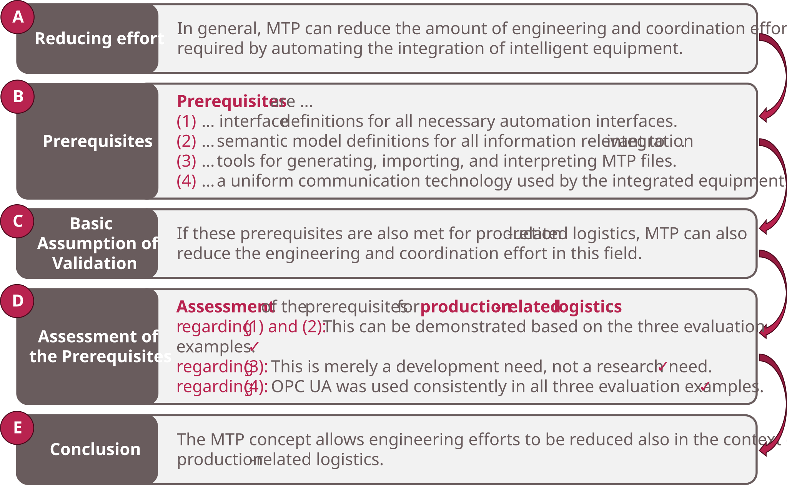

### 6.3 Validation

This section validates the usefulness of the artifacts in the problem context and their suitability to fulfill the research goal defined in [Section 1](../01_Introduction/01_Introduction.md).

##### Figure 6.7: Validation Strategy

<!-- TODO: Inhalt der Validierung ergänzen. Die folgenden Absätze sind Platzhalter basierend auf der Struktur der Einleitung. -->

#### Usefulness in the Problem Context

The three artifacts address the automation of Modular Logistics Systems at three structural levels: individual LEAs, Logistics Lines, and Logistics Areas. The evaluation examples demonstrate that the artifacts are applicable to realistic industrial scenarios and can be combined in a single system.

Key evidence for practical usefulness:

- **Vendor neutrality:** LEAs from different vendors (BEUMER, Siemens) and an AGV from SEW-Eurodrive were successfully integrated via uniform MTP-based interfaces, confirming interoperability.
- **Retrofitability:** MTP service wrappers were successfully retrofitted around existing native software in the BASF and MoProLog demonstrators, confirming that the concepts are applicable to brownfield systems.
- **Independent development:** In the MoProLog project, LEA software, AGV system, Transport Management, and LOL functions were developed independently by different partners and integrated via standardized interfaces.
- **Scalability:** The emulation demonstrates applicability to a comprehensive system with 13 LEAs, two Logistics Lines, and two concurrent packaging processes.
- **Flexibility:** SES-based LEAs are shared across packaging processes and dynamically parameterized based on the current logistics object, enabling higher system utilization and broader product portfolios.

#### Fulfillment of the Research Goal

<!-- TODO: Forschungsziel aus der Einleitung hier referenzieren und die Erfüllung anhand der Evaluationsergebnisse argumentieren. -->
