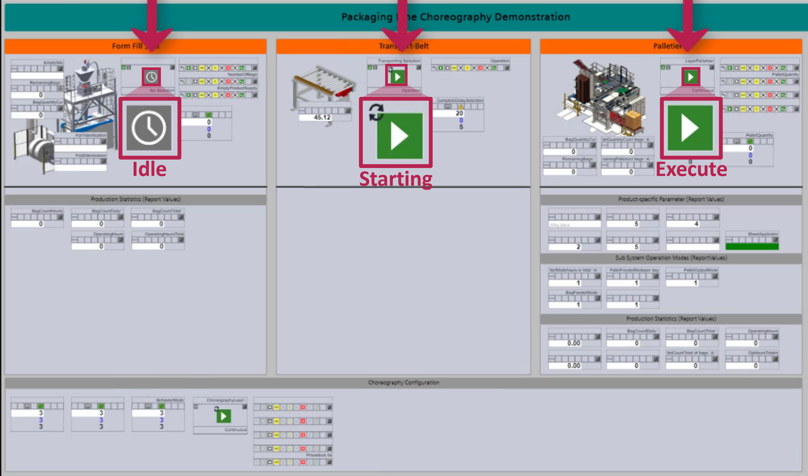

[< Previous](../05_Complexity_Reduction_of_Interfaces/README.md) | [Home](../README.md) | [Next >](../07_Logistics_Area/README.md)

## 6 Coordination of Modular Packaging Lines

Logistics Lines are built up from LEAs that are operated in CES mode. They operate on an order-oriented basis and thus according to a plan defined at the time of engineering. It is clearly defined which LEAs follow one another in which order, i.e., the material flow is not adaptable at runtime. When automating Logistics Lines, the challenge is to synchronize the different LEAs of the line. For example, a LEA must stop when its downstream LEA stops. Otherwise, there would be a congestion of LOs. In this context, the requirement exists that Logistics Lines should be coordinated by direct LEA-to-LEA communication. In this way, a higher-level entity controlling the LEAs is not permanently required, if at all, and faster response times can be achieved.

To meet this requirement, the concept of Automation Services Choreographies [9], which is currently being researched in the field of modular automation, has been taken up. This concept promises a systematic implementation of direct module-to-module communication without the need for a central coordination instance. The basic idea is that procedural, regulatory, interlocking, and parameterizing information is exchanged between different services of automated units. In addition, each service has an execution shell in which internal rules can be configured about how the corresponding service should react to certain information from other services. These rules are configured in the OPC UA server of the modules and can be adjusted without reloading the corresponding controller. In this way, it is possible, for example, to start a service as soon as another service is running or, in the event of an error in one service, to set all other services to an error state.

It has been shown that this approach is also well suited for automating modular Logistics Lines [10]. Figure 6.1 shows an example of a simple Logistics Line consisting of a Form Fill Seal (FFS) machine, a conveyor belt, and a layer palletizer. 

*Figure 6.1: Operator screen of a packaging line controlled by an automation service choreography*

Specifically, the above figure shows the start-up process of the line, which is carried out in an orderly manner from the last LEA (= layer palletizer) to the first LEA (= FFS machine). This orderly start-up is defined by the following two rules in the conveyor and the FFS machine:

- ConveyorBelt.Start := LayerPalletizer.EXECUTE [rule within the conveyor belt]
- FFS.Start := ConveyorBelt. EXECUTE [rule within the FFS machine]

If the layer palletizer is then started manually or by a higher-level system, its state changes from IDLE to STARTING to EXECUTE according to the MTP state machine. The conveyor belt monitors the state of the layer palletizer. As soon as the palletizer is in EXECUTE state, the internal rule of the conveyor belt takes effect, and the conveyor belt is started. This status of the line is shown in Figure 6.1. The FFS machine monitors the state of the conveyor belt. If the conveyor belt is then in the EXECUTE state, the internal rule of the FFS machine takes effect and also this machine is started. If the FFS machine is also in the EXECUTE state, the line is completely started up. From the point of view of an operator or a higher-level system only the Start command at the palletizer is necessary to trigger the start-up of the line. Everything else is done via direct LEA-to-LEA communication and LEA-internal rules. 

In addition to the start-up of the line, the following other scenarios are considered reasonable in this example:

- After a Complete command, the line runs empty from front to back in an orderly manner.
- If an error occurs in one of the LEAs (in the form of Hold, Stop or Abort commands), this shall be propagated to the other LEAs and these also change to an error state.
- After a non-critical error state (HELD), the line can be restarted in an orderly manner from back to front.
- After the line has run empty or after a critical error state (STOPPED or ABORTED) has occurred, the line can be reset to the initial state IDLE.

A choreography design for these scenarios has been published in [10]. This design contains the necessary internal rules of the LEAs as well as the variables necessary at the interface of the line. 

For the configuration of choreographies and the exchange of information between the LEAs of a line, new model and interface definitions are necessary. These are specified in Section 11.

[< Previous](../05_Complexity_Reduction_of_Interfaces/README.md) | [Home](../README.md) | [Next >](../07_Logistics_Area/README.md)