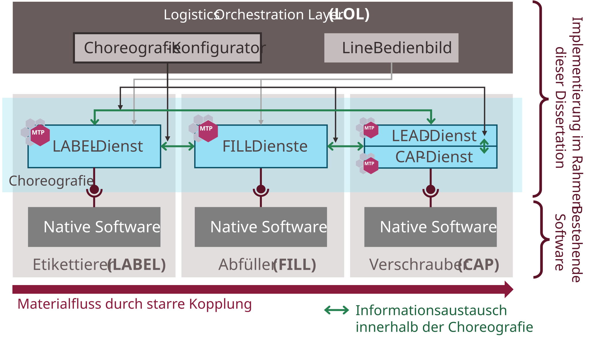

## 7.5 Evaluation Example: BASF Demonstrator

This section describes the first industrial evaluation example, which was carried out at BASF SE in Ludwigshafen. It evaluates CES-based LEA automation and choreography-based Logistics Line automation.

### 7.5.1 Use Case

The demonstrator is a laboratory-scale bottle-filling system consisting of three physical LEAs arranged in a Logistics Line: a Labeller (LABEL), a Filler (FILL), and a Capper (CAP). The LABEL prints plastic bottles, the FILL fills them with granulate, and the CAP seals them. The LEAs are rigidly coupled, resulting in a fixed material flow defined by the physical layout. A LOL is provided above the line to offer the necessary orchestration functions for the system.

##### Figure 7.22: BASF Bottle-Filling Laboratory System at BASF SE Ludwigshafen (Evaluation Example 1)

### 7.5.2 Implementation

Each of the three LEAs was already equipped with a Siemens controller (LABEL: SIMATIC S7 CPU 1511-1 PN; FILL: SIMATIC S7 CPU 1516-3 PN/DP; CAP: SIMATIC S7 CPU 1512SP-1 PN) running a native control program for interaction with the respective hardware. As part of this evaluation, an MTP service implementation following the CES-based LEA automation concept was retrofitted around the native software of each module, turning them into LEAs in the sense of this dissertation. All parameters were configured on the basis of individual values, since the LEAs had only a small number of parameters.

The three LEAs were integrated into a Logistics Line using the choreography concept. A Lead Service was implemented in the CAP controller. The MTP service and choreography implementations are based on prototype block libraries from Siemens AG for SIMATIC TIA Portal V17. The choreography library was extended with new function blocks enabling MTP-based choreography configuration.

##### Figure 7.23: Setup of the BASF Demonstrator and Implemented Logistics Process

The LOL provides two functions: a choreography configurator and a line HMI screen. The choreography configurator, developed in [[Kem22]](../98_References/README.md#kempin-2022) as a NestJS/Angular application, allows operators to configure and download choreography relations to the LEAs. The line HMI screen was implemented using SIMATIC WinCC Unified.

### 7.5.3 Test Scenarios

The following test scenarios were successfully executed at the BASF demonstrator:

- **Loading the choreography configuration:** The choreography configuration of the Logistics Line was loaded and activated on all three LEAs.
- **Setting access modes:** Access modes of LEA services and parameters were set to define whether access is permitted only from within the choreography or also from external systems.
- **Clearance signal transmission:** Continuous clearance signals were correctly exchanged between LEAs, so that each LEA always knew whether the downstream LEA was ready to accept logistics objects.
- **Procedure assignment:** The procedure was set at the Lead Service; all other LEA services adopted this procedure setting.
- **Product ID propagation:** The product ID was set at the FILL and automatically adopted by the other two LEAs via the choreography.
- **Start-up:** Triggered by a Start command at the Lead, the line was started up from back to front (CAP → FILL → LABEL).
- **Drain:** Triggered by a Complete command at the Lead, the line was drained from front to back (LABEL → FILL → CAP).
- **Reset, Stop, Abort, Hold, Unhold, Pause, Resume:** All state transitions were successfully propagated across the line in both directions via the choreography.

### 7.5.4 Findings

**Practical applicability:** The tests confirm the practical applicability of CES-based LEA automation and choreography-based Logistics Line automation.

**Modular line composition:** The choreography concept enables independent LEAs that are choreography-capable to be combined into a Logistics Line as needed.

**Configuration without reprogramming:** Choreography behavioral rules are stored as configuration in each LEA's application program without modifying or reloading the LEA program itself. This decouples LEA development and testing from line logic configuration and testing.

**Distributed coordination:** Runtime control of the Logistics Line is achieved through distributed coordination among the LEAs, enabling shortest possible reaction times (e.g., in fault scenarios). No permanent LOL connection is required; the LOL serves only for choreography configuration and line monitoring.

**Choreography design complexity:** Defining choreography rules requires careful consideration to avoid unintended behavior. For example, naive fault-propagation rules that push LEAs into HELD immediately when another LEA enters HELD make it impossible to restart the line, because the first LEA to recover is immediately re-faulted by the still-held peers. A solution is to trigger transitions only on rising edges (detecting that a LEA *just* entered the fault state), rather than on the state level. Design principles and methods for ensuring correct choreography behavior are not within the scope of this work.

**Retrofitability:** The evaluation shows that MTP service interfaces and choreography capability can be retrofitted around existing native software. This lowers the entry barrier for brownfield systems. Long-term, native LEA software should be redesigned to fully exploit MTP and choreography capabilities (e.g., distinguishing Hold, Stop, and Abort as escalation levels).
