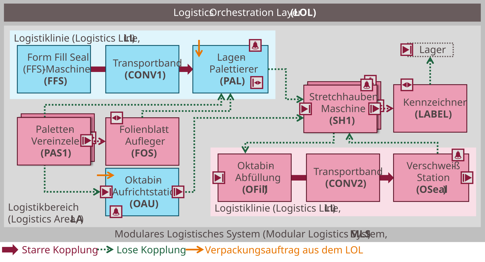

## 7.7 Evaluation Example: PLC-Based Emulation

This section describes the third evaluation example: a complete PLC-based emulation of a Modular Logistics System (MLS) without physical hardware. It demonstrates the combined application of all three artefacts — LEA automation, Logistics Line choreography, and AGV transport integration — and evaluates their interaction in a realistic system context. The evaluation follows the Design Science Research methodology [[PTR+07]](../98_References/README.md#peffers-et-al-2007) [[HMP+04]](../98_References/README.md#hevner-et-al-2004) [[Wie14]](../98_References/README.md#wieringa-2014) [[NAM21]](../98_References/README.md#namur-processnet-vdma-und-zvei-2021).

### 7.7.1 Use Case

The MLS serves two packaging processes — bag filling and octabin filling — executed concurrently. [Figure 7.27](#figure-727-pLC-based-emulation-of-a-modular-logistics-system-evaluation-example-3) shows the system layout, transport nodes, and possible material flows.

##### Figure 7.27: PLC-Based Emulation of a Modular Logistics System (Evaluation Example 3)

**Bag filling process:** A Logistics Line of three CES-based LEAs — a Form-Fill-Seal machine (FFS), a Conveyor (CONV), and a Palletizer (PAL) — processes packaging orders from the LOL. Two SES-based Pallet Supply LEAs (PAS1, PAS2) provide different pallet types on demand. An SES-based Foil Supply (FOS) optionally applies a foil layer to empty pallets. After palletizing, one of two SES-based Stretch Hood Machines (SH1, SH2) applies a stretch hood for load securing. A Labeller (LABEL) provides final pallet identification. Finished pallets are transported to a Stock (STOCK) LEA.

**Octabin filling process:** An Octabin Erector (OAU) operates in CES mode to erect octabins. The same PAS1 and PAS2 LEAs supply pallets. One of the two SH LEAs inserts a foil inlay into the erected octabin. A second SES-based Logistics Line — comprising an Octabin Filler (OFill), a Conveyor (CONV2), and a Sealing Station (OSeal) — processes octabins demand-oriented as they arrive. Load securing and labelling are performed by the shared SH and LABEL LEAs. Finished octabins are transported to STOCK.

This example intentionally combines order-oriented and demand-oriented single LEAs, order-oriented and demand-oriented Logistics Lines, and shared LEAs used across both packaging processes — covering the full diversity of MLS configurations analyzed in this dissertation.

### 7.7.2 Implementation

The emulation is implemented using SIMATIC S7-PLCSIM Advanced and TIA Portal V18. Each LEA is represented by a virtual SIMATIC S7-1500 controller that executes the LEA's automation software and communicates via OPC UA exactly as a real controller would. Physical logistics objects are modelled virtually: LO handovers within Logistics Lines are realized through binary process value interconnections; in the Logistics Area, a virtual LO is represented by its transporting AGV.

Each emulated LEA consists of a simplified function block emulating the LEA's logistics function (native software), surrounded by an MTP service implementation following the CES or SES concept. Blue LEAs in [Figure 7.27](#figure-727-pLC-based-emulation-of-a-modular-logistics-system-evaluation-example-3) operate in CES mode; red LEAs operate in SES mode. LEA parameterization follows the structured parameter set concept using *ProductDataSet* and *PackagingDataSet*.

The two Logistics Lines are composed using the choreography concept with External Lead Services (LEADBag for the bag filling line; LEADOct for the octabin filling line). The CES-based bag filling line follows the same start-up and completion logic as the BASF demonstrator. The SES-based octabin filling line starts up and then waits in PAUSED state; upon arrival of a logistics object, the OFill switches to EXECUTE, processes the LO using its LO-specific order data received during handover, passes the LO with its metadata to CONV2, and so on. Multiple LOs of different types can be processed consecutively while the line remains in EXECUTE.

Flexible transports are coordinated using a simplified AGV emulation and a Transport Management function in the LOL. The LOL provides the following functions:

| LOL Function | Implementation |
|---|---|
| HMI (WinCC Unified) | Parameter setting, command input, monitoring |
| Parameter Management | .NET/NestJS backend, Angular frontend [[Jan23]](../98_References/README.md#janzen-2023) |
| Transport Management | .NET backend, Angular frontend (based on [[Hen22]](../98_References/README.md#henkel-2022)) |
| AGV Emulation | .NET backend, Angular frontend |
| Choreography Configurator | NestJS/Angular [[Kem22]](../98_References/README.md#kempin-2022) |

### 7.7.3 Test Scenarios

Ten test scenarios were successfully executed:

1. **Load choreography configurations** for both Logistics Lines; set access modes and close process value interconnections.
2. **Connect all transport-relevant LEAs** to the Transport Management.
3. **Set order-independent parameters** (product-specific, packaging-specific, and construction-specific parameter sets).
4. **Start all SES-based single LEAs**; they wait in PAUSED state for incoming logistics objects.
5. **Start the SES-based octabin filling Logistics Line**; it starts up orderly and waits in PAUSED state.
6. **Bag filling with static routes** (Product ID 1): PAS1 → Logistics Line (bag) → SH2 → LABEL → STOCK.
7. **Bag filling with dynamic routes** (Product ID 2): PAS2 → FOS → Logistics Line (bag) → SH2 → LABEL → STOCK. The choices of PAS2, FOS, and SH2 were determined by querying the material flow management.
8. **Octabin filling with static routes** (Product ID 3): PAS1 → OAU → SH1 (foil inlay) → Logistics Line (octabin) → SH1 (stretch hood) → LABEL → STOCK.
9. **Octabin filling with dynamic routes** (Product ID 4): PAS1 → OAU → SH2 (foil inlay) → Logistics Line (octabin) → SH1 (stretch hood) → LABEL → STOCK.
10. **Parallel bag and octabin filling**: combinations of scenarios 6+8, 7+9, and 7+8 were executed concurrently.

### 7.7.4 Findings

**Practical applicability:** The tests confirm the practical applicability of CES- and SES-based LEA automation including structured parameterization, choreography-based Logistics Line automation, and MTP-based AGV transport integration. In particular, the SES principle is demonstrated at scale: SH1 and SH2 receive pallets of different types and states, identify each logistics object, and process it according to its *ProductId* and *LogisticsObjectStatus*. Above all, this evaluation example demonstrates the combined use of all three artefacts in a realistic, multi-process MLS.

**System design potential:** Intelligent MLS design based on the presented artefacts can increase system utilization compared to conventional systems. For example, SH1 and SH2 serve both packaging processes — applying stretch hoods for bag pallets, inserting foil inlays for octabins — instead of being dedicated to a single task. AGV-based transport reduces space requirements and increases material flow flexibility, enabling a broader product portfolio to be handled on the same system.

**Enablers for flexible MLS design:** The artefacts presented in this dissertation enable flexible MLS design because:
- LEAs are parameterizable via standardized interfaces, enabling Parameter Management integration.
- AGV systems can be integrated via standardized interfaces without deep knowledge of proprietary AGV automation, lowering the barrier to using discontinuous transport technology.
- Material flows are flexibly — and optionally at runtime — configurable, enabling multiple products on the same system.
- LEAs can be quickly integrated or replaced via MTP-based mechanisms, making scaling and redundancy straightforward.
