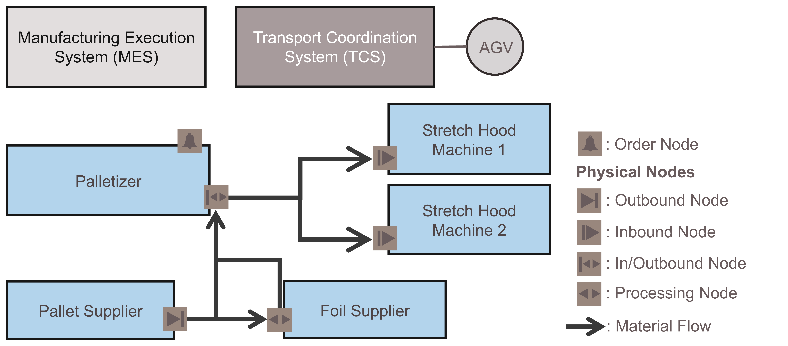
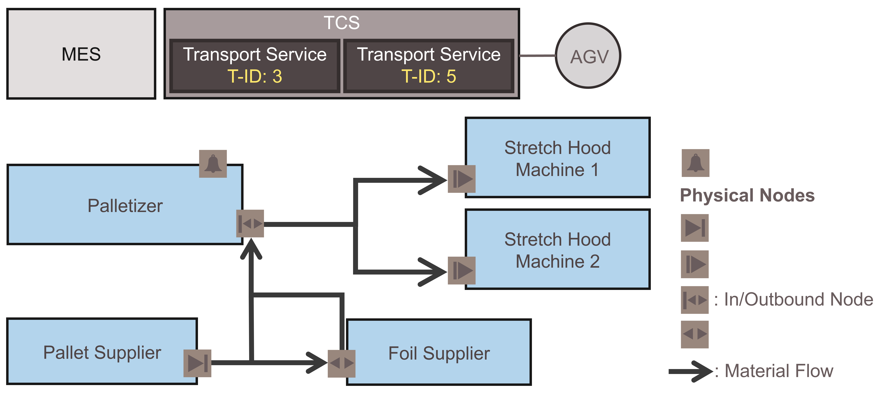
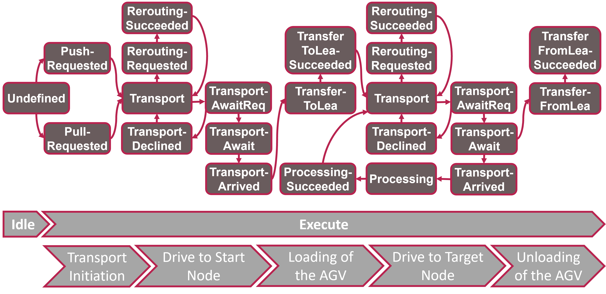
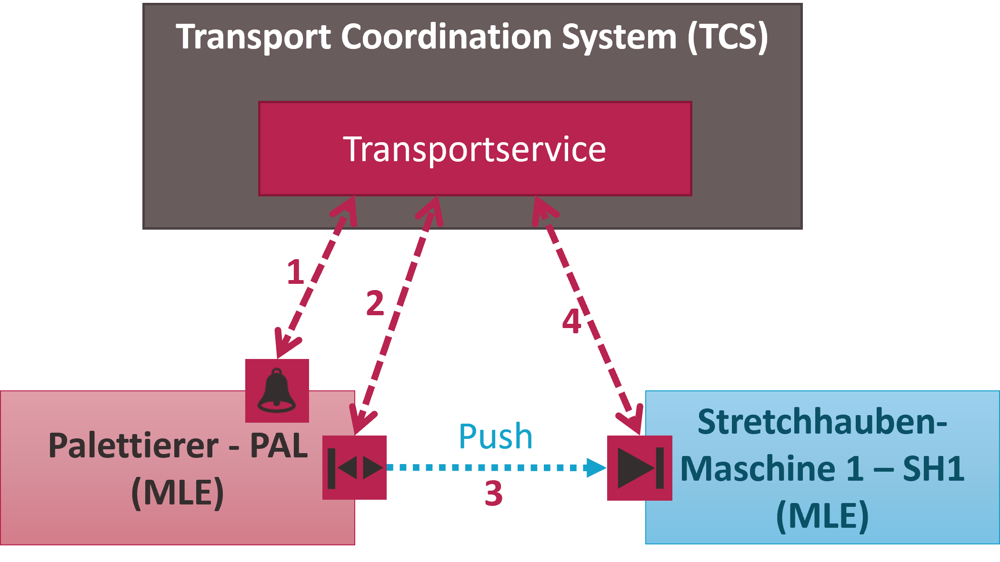
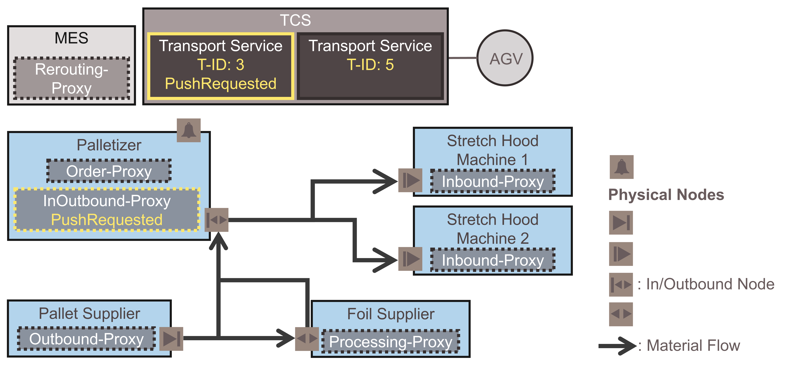

[< Previous](../06_Packaging_Line/README.md) | [Home](../README.md) | [Next >](../08_Logistics_Orchestration_Layer/README.md)

## 7 Coordination of Logistics Areas

Logistics Lines (as a whole) and free-standing LEAs can be loosely coupled with each other in a Logistics Area. The free-standing LEAs are operated in SES mode and can be approached and used flexibly on demand. Thus, it is necessary to define the material flow through the system only at runtime. Necessary transports are performed by a flexible transport system, e.g., consisting of Automated Guided Vehicles (AGVs). The challenge in the automation of Logistics Areas is the integration and coordination of such a flexible transport system. There is no fixed predecessor-successor relationship between LEAs, the material flow is defined at runtime. The flexible transport system is to be configured according to the pending transport orders. A corresponding concept for the coordination of Logistics Areas has been published in [11].

### 7.1	Transport Processes in a Logistics Area

Figure 7.1 shows a typical structure of a Logistics Area and the transport processes therein. The transport of Logistics Objects (LOs) is carried out by an AGV, which is coordinated by a Transport Coordination System (TCS). The next LEA to be approached can be specified statically or can be selected dynamically at runtime by an external optimization system. Packaging orders are provided, e.g., by a manufacturing execution system (MES)[^1].

*Figure 7.1: Transport processes within a typical Logistics Area*

The LEAs of this system can interact with the AGV in different ways. Some LEAs have physical transfer points to transfer LOs to an AGV. For example, the pallet supplier can transfer empty pallets to the AGV. These transfer points are described as **outbound nodes** in the above figure. On the other hand, there are also **inbound nodes**, e.g., at the stretch hood machines, where LOs can be transferred from the AGV to the corresponding LEA. In addition, there are also **in/outbound nodes**, e.g., at the palletizer, which can perform the function of an inbound or an outbound node as required. Furthermore, it is possible that an LO is processed by a LEA while being on the AGV. For example, the foil supplier may apply a foil to an empty pallet that is on the AGV. For this case, **processing nodes** are foreseen.

Between those transport nodes, transport processes are performed based on **transport orders**. A transport process is the transport of an LO from an outbound to an inbound node, including the transfers at the start and target nodes. On the way from the start to the target, any number of processing nodes can be approached.

In order to plan the transport operations meaningfully, transport demands must be indicated in the system. For this purpose, so-called **order nodes** are available in the system, through which a LEA can report a transport demand. In the case of the shown system, only the palletizer has an order node, since only this LEA can report transport demands.

When reporting transport demands, a distinction must be made between **push and pull demands**. In the case of push transport demands, a LEA reports that it has completed an LO and wants it to be transported away. This occurs, for example, when the palletizer has finished palletizing a pallet. In a pull transport demand, a LEA has a material demand and wants to obtain a LO from another LEA. For example, the palletizer needs empty pallets from the pallet supplier on which it can palletize bags afterwards. A push transport demand is consequently initiated by the start LEA, a pull transport demand by the target LEA.

### 7.2	Transport Services for Encapsulating Transport Orders

According to the above definition of a transport order, the goal of transport coordination is to coordinate LO transports from an outbound to an inbound node and, while doing so, to approach any number of processing nodes. This coordination of transport processes takes place in the TCS. Each active transport order is represented as an MTP service in the TCS. This makes the TCS a provider of MTP services in the same way as the LEAs. However, a special characteristic is that any number of active transport orders can exist in the logistics system and thus the TCS can also contain any number of transport services. The transport services are made available via an OPC UA server of the TCS, each in connection with an individual transport ID (see Figure 7.2). This enables identification and dynamic connection of a transport node of an LEA with these services at runtime.

*Figure 7.2: Representation of transport orders as MTP transport services in the Transport Coordination System*

### 7.3	Procedures for Representing the Status of Transport Orders

A run of a transport service represents the sequence of a transport process from the initiation of the transport to the transfer of the LO from the transport system to the LEA at the target node. During this process, the transport service passes through various phases in which different coordination tasks must be performed. These are shown in Figure 7.3 in the form of a process model.

*Figure 7.3: Process model of a MTP transport service*

Independent of transport demands in the system, the TCS continuously ensures that transport services are created for all existing order nodes in the system and assigned to the corresponding order nodes. If a transport service is no longer assigned to an order node, a new blank transport order is automatically created in the TCS and assigned to this node.

If a LEA has a transport demand, it starts the transport service assigned to its order node as part of the **transport order initiation** and thus signals its transport demand to the TCS. At the same time, the information whether a push or pull transport is required and which is the start node of the transport is also transmitted.

The TCS then coordinates the **empty drive** of an AGV to the start node of the transport, where the **loading of the AGV** takes place. In the course of loading, an exchange of information is performed between the TCS and the LEA containing the start node. This synchronizes the transfer of the LO in the form of a handshake mechanism and sets the next node to be approached at the transport service. The TCS then coordinates the AGV to the next node.

If the next node is a **Processing Node**, the LO remains on the AGV and is processed by the LEA. If it is an inbound node, the **unloading** of the AGV is performed, whereby the transport order is completed after successful transfer of the LO to the target LEA.

These phases of a transport order are further subdivided into 14 different statuses that a transport order can have, as shown in Figure 7.3 (brown boxes). The states of the MTP state machine are not suitable to represent these statuses. Instead, the transport process is executed entirely in the EXECUTE state of the transport service, and the different transport statuses are mapped as different procedures of the transport service. By restarting the transport service, it is possible to switch between the different procedures, i.e., between the different transport statuses according to the process model from Figure 7.3.

The resulting procedures of a transport service are shown in Table 7.1.

*Table 7.1: Procedures of a MTP transport service*

### 7.4	Proxy Interfaces for Flexible Interaction between Transport Services and LEAs

From the phases of a transport order, it becomes clear that a transport service must interact with various LEAs during its execution. Figure 7.4 shows this using the example of the palletizing LEA, which has completed a pallet that shall now be transported to a stretch hood machine.

*Figure 7.4: Interaction between a transport service and different LEAs in the course of a transport process*

To initiate the transport, the transport service in the TCS interacts with the order node of the palletizer (1). During the transfer of the pallet to the AGV, the transport service interacts with the in/outbound node of the palletizer (2). During the transport, the transport service does not interact with any LEA (3). During the transfer of the pallet from the AGV to the stretch hood machine, the transport service interacts with the inbound node of the stretch hood machine (4).

To implement this flexible interaction between the transport service and the various nodes of the LEAs, the principle of decentralized orchestration has been applied, which was developed in the MTP environment [12]. For this purpose, proxy interfaces are provided in the LEAs, each of which is a software implementation of a node. They enable a transport service to be connected via an OPC UA connection configurable at runtime. Via the proxy interfaces, the interface of the transport service is mirrored into an LEA. Thus, although the transport service runs in the TCS, the information is equally accessible to the LEA and allows interaction with it. In principle, three different proxy interfaces are used in the developed concept (see Figure 7.5).

*Figure 7.5: Proxy interfaces for flexible connection of MTP transport services*

**Transport proxy** interfaces correspond to the introduced physical nodes for the transfers from and to LEAs and processing of LOs and can be further subdivided into inbound proxies, outbound proxies, in/outbound proxies and processing proxies.

**Order proxy** interfaces are intended for order nodes and thus for transport order initiation. A characteristic feature of these proxies is that they are automatically assigned a blank transport order by the TCS as soon as they are no longer connected to a transport order.

A **rerouting proxy** interface is provided by the MES. Based on this interface, it is possible to establish a temporary OPC UA connection between a transport service and the MES and thus allow an update of the transport order from the MES. This is necessary if a LEA that is currently being approached by an AGV is no longer operational. This is detected by the TCS, which then connects the transport service to the rerouting proxy interface.

[< Previous](../06_Packaging_Line/README.md) | [Home](../README.md) | [Next >](../08_Logistics_Orchestration_Layer/README.md)

[^1]: The Manufacturing Execution System should be understood as an example at this point. Other systems such as a material flow controller are also conceivable here.