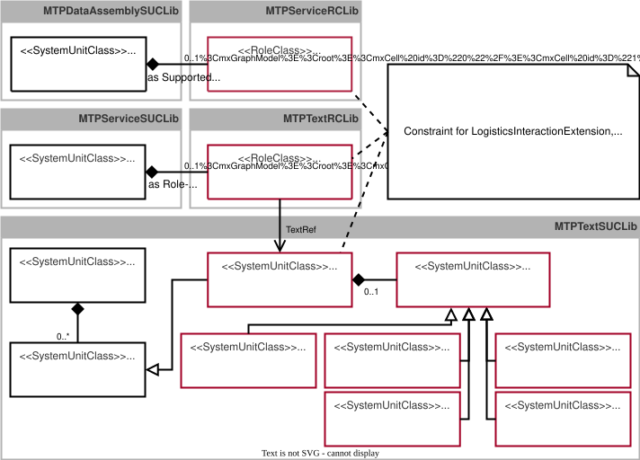
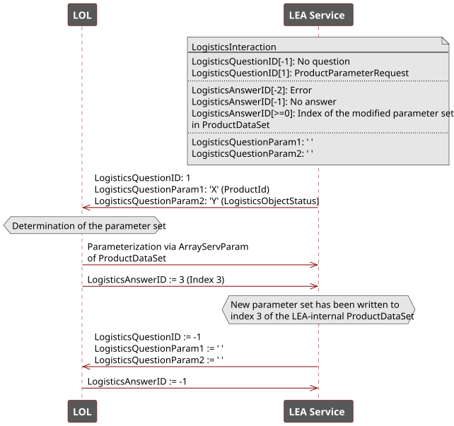
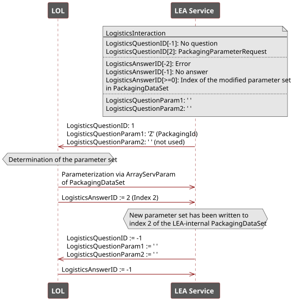
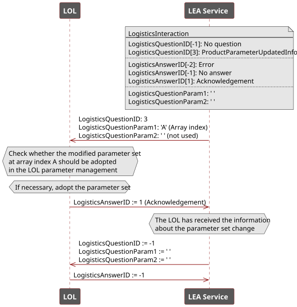
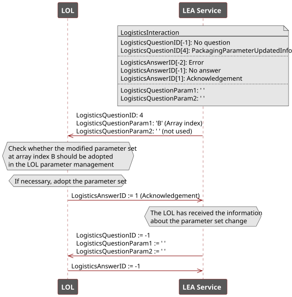
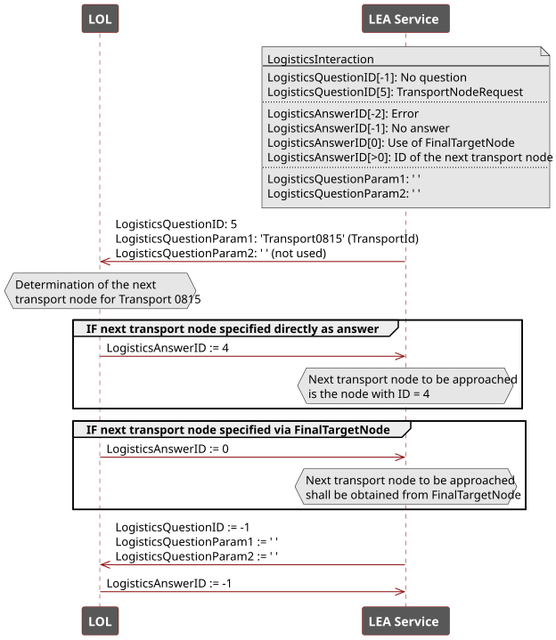

## 7.4 MTP Extension of the ServiceSet
This chapter specifies all identified extensions of the *ServiceSet* and integrates them into the existing [MTP Specification Part 4](../08_References/README.md#mtp-specification-part-4).

### 7.4.1 Overview
#### Semantic Description of LEA Services
To distinguish order-oriented CES and demand-oriented SES procedures for a LOL, a semantic identifier in the form of *FunctionClassificationAttributes* is added to them. [Table 7.21](#table-721-functionclassificationattribute-of-a-cyclic-execution-service-procedure) and [Table 7.22](#table-722-functionclassificationattribute-of-a-single-execution-service-procedure) specify the corresponding *FunctionClassificationAttributes*. "2.0" denotes the version in major-minor format and shall be incremented accordingly when changes are made to the *FunctionClassificationAttributes*.

##### Table 7.21: FunctionClassificationAttribute of a Cyclic Execution Service Procedure

<table>
	<tr>
		<td colspan="2" align="left"><strong>FunctionClassificationAttribute for CES</strong></td>
	</tr>
	<tr>
		<th align="left">Standard</th>
		<td align="left">ModuleTypePackage:Logistics</td>
	</tr>
	<tr>
		<th align="left">Level</th>
		<td align="left">Machine</td>
	</tr>
	<tr>
		<th align="left">Type</th>
		<td align="left">CES</td>
	</tr>
	<tr>
		<th align="left">IRDI</th>
		<td align="left">ModuleTypePackage:Logistics:CES:2.0</td>
	</tr>
</table>

##### Table 7.22: FunctionClassificationAttribute of a Single Execution Service Procedure

<table>
	<tr>
		<td colspan="2" align="left"><strong>FunctionClassificationAttribute for SES</strong></td>
	</tr>
	<tr>
		<th align="left">Standard</th>
		<td align="left">ModuleTypePackage:Logistics</td>
	</tr>
	<tr>
		<th align="left">Level</th>
		<td align="left">Machine</td>
	</tr>
	<tr>
		<th align="left">Type</th>
		<td align="left">SES</td>
	</tr>
	<tr>
		<th align="left">IRDI</th>
		<td align="left">ModuleTypePackage:Logistics:SES:2.0</td>
	</tr>
</table>

#### Semantic Description of Service Parameters
To enable a semantic description of service parameters, the model definition *ServiceParameter* is extended by the capability to append *FunctionClassificationAttributes*. The detailed specification is provided in [Model Definitions](#743-model-definitions). This extension, as a result of this work, has already been adopted into the base profile *ModuleTypePackage:ServiceSet.Base V2.0.0* of the [MTP Specification Part 4](../08_References/README.md#mtp-specification-part-4).

[Table 7.23](#table-723-functionclassificationattribute-of-a-procedure-parameter-for-setting-a-productid) to [Table 7.27](#table-727-functionclassificationattribute-of-a-configuration-parameter-for-accessing-a-packagingdataset) specify *FunctionClassificationAttributes* for the parameters *ProductId*, *LogisticsObjectStatus*, *ProductDataSet*, *PackagingId*, and *PackagingDataSet* necessary for LEA parameterization. "2.0" denotes the version in major-minor format and shall be incremented accordingly when changes are made to the *FunctionClassificationAttributes*.

##### Table 7.23: FunctionClassificationAttribute of a Procedure Parameter for Setting a ProductId

<table>
	<tr>
		<td colspan="2" align="left"><strong>FunctionClassificationAttribute for ProductId</strong></td>
	</tr>
	<tr>
		<th align="left">Standard</th>
		<td align="left">ModuleTypePackage:Logistics</td>
	</tr>
	<tr>
		<th align="left">Level</th>
		<td align="left">Service Parameter</td>
	</tr>
	<tr>
		<th align="left">Type</th>
		<td align="left">ProductId Procedure Parameter</td>
	</tr>
	<tr>
		<th align="left">IRDI</th>
		<td align="left">ModuleTypePackage:Logistics:ProductId:2.0</td>
	</tr>
</table>

##### Table 7.24: FunctionClassificationAttribute of a Procedure Parameter for Setting a LogisticsObjectStatus

<table>
	<tr>
		<td colspan="2" align="left"><strong>FunctionClassificationAttribute for LogisticsObjectStatussObjectStatus</strong></td>
	</tr>
	<tr>
		<th align="left">Standard</th>
		<td align="left">ModuleTypePackage:Logistics</td>
	</tr>
	<tr>
		<th align="left">Level</th>
		<td align="left">Service Parameter</td>
	</tr>
	<tr>
		<th align="left">Type</th>
		<td align="left">LogisticsObjectStatussObjectStatus Procedure Parameter</td>
	</tr>
	<tr>
		<th align="left">IRDI</th>
		<td align="left">ModuleTypePackage:Logistics:LogisticsObjectStatus:2.0</td>
	</tr>
</table>

##### Table 7.25: FunctionClassificationAttribute of a Configuration Parameter for Accessing a ProductDataSet

<table>
	<tr>
		<td colspan="2" align="left"><strong>FunctionClassificationAttribute for ProductDataSet</strong></td>
	</tr>
	<tr>
		<th align="left">Standard</th>
		<td align="left">ModuleTypePackage:Logistics</td>
	</tr>
	<tr>
		<th align="left">Level</th>
		<td align="left">Service Parameter</td>
	</tr>
	<tr>
		<th align="left">Type</th>
		<td align="left">ProductDataSet Configuration Parameter</td>
	</tr>
	<tr>
		<th align="left">IRDI</th>
		<td align="left">ModuleTypePackage:Logistics:ProductDataSet:2.0</td>
	</tr>
</table>

##### Table 7.26: FunctionClassificationAttribute of a Procedure Parameter for Setting a PackagingId

<table>
	<tr>
		<td colspan="2" align="left"><strong>FunctionClassificationAttribute for PackagingId</strong></td>
	</tr>
	<tr>
		<th align="left">Standard</th>
		<td align="left">ModuleTypePackage:Logistics</td>
	</tr>
	<tr>
		<th align="left">Level</th>
		<td align="left">Service Parameter</td>
	</tr>
	<tr>
		<th align="left">Type</th>
		<td align="left">PackagingId Procedure Parameter</td>
	</tr>
	<tr>
		<th align="left">IRDI</th>
		<td align="left">ModuleTypePackage:Logistics:PackagingId:2.0</td>
	</tr>
</table>

##### Table 7.27: FunctionClassificationAttribute of a Configuration Parameter for Accessing a PackagingDataSet

<table>
	<tr>
		<td colspan="2" align="left"><strong>FunctionClassificationAttribute for PackagingDataSet</strong></td>
	</tr>
	<tr>
		<th align="left">Standard</th>
		<td align="left">ModuleTypePackage:Logistics</td>
	</tr>
	<tr>
		<th align="left">Level</th>
		<td align="left">Service Parameter</td>
	</tr>
	<tr>
		<th align="left">Type</th>
		<td align="left">PackagingDataSet Configuration Parameter</td>
	</tr>
	<tr>
		<th align="left">IRDI</th>
		<td align="left">ModuleTypePackage:Logistics:PackagingDataSet:2.0</td>
	</tr>
</table>

#### Extension of the ParameterElements
For the processing of values with structured and array data types, two new DataAssembly definitions *SUC StructServParam* and *SUC ArrayServParam* are required for the parameterization of LEA services. As shown in [Figure 7.8](#figure-78-extension-of-the-serviceset-for-implementing-structured-and-array-based-service-parameters), *SUC StructServParam* and *SUC ArrayServParam*, together with all other DataAssembly definitions for service parameters, are derived from the DataAssembly definition *SUC ParameterElement* according to [MTP Specification Part 4](../08_References/README.md#mtp-specification-part-4) and organized in *SUCL MTPDataAssemblySUCLib*. The detailed specification is provided in [Model Definitions](#743-model-definitions). This extension, as a result of this work, has already been adopted into the profile *ModuleTypePackage:ServiceSet.ComplexTypes V2.0.0* of the [MTP Specification Part 4](../08_References/README.md#mtp-specification-part-4).

##### Figure 7.8: Extension of the ServiceSet for Implementing Structured and Array-Based Service Parameters

#### Specification of the LogisticsInteraction
In the context of LEA parameterization different requests from a LEA to a LOL are necessary. Those so-called *LogisticsInteractions* are shown in [Table 7.28](#table-728-possible-logistics-interaction-requests-from-a-lea-to-a-lol).

##### Table 7.28: Possible Logistics Interaction Requests from a LEA to a LOL

<table>
	<tr>
		<th align="left">Name</th>
		<th align="left">Description</th>
	</tr>
	<tr>
		<td align="left">ProductParameterRequest</td>
		<td align="left">With this request, a LEA retrieves a product-specific parameter set from the LOL by specifying a <em>ProductId</em> and a <em>LogisticsObjectStatus</em>.</td>
	</tr>
	<tr>
		<td align="left">PackagingParameterRequest</td>
		<td align="left">With this request, a LEA retrieves a packaging-specific parameter set from the LOL by specifying a <em>PackagingId</em>.</td>
	</tr>
	<tr>
		<td align="left">ProductParameterUpdatedInfo</td>
		<td align="left">With this request, a LEA informs the LOL that the product-specific parameter set at a defined array index of its <em>ProductDataSet</em> has changed.</td>
	</tr>
	<tr>
		<td align="left">PackagingParameterUpdatedInfo</td>
		<td align="left">With this request, a LEA informs the LOL that the packaging-specific parameter set at a defined array index of its <em>PackagingDataSet</em> has changed.</td>
	</tr>
	<tr>
		<td align="left">TransportNodeRequest</td>
		<td align="left">With this request, a LEA retrieves from the LOL the next transport node to be approached for a transport order by specifying a <em>TransportId</em>.</td>
	</tr>
</table>

These requests are implemented on the basis of *Service Interaction* mechanisms according to [MTP Specification Part 4](../08_References/README.md#mtp-specification-part-4) and may occur once or not at all in a LEA. If they occur, they always follow the same sequence and always allow the same responses by a LOL. It is therefore appropriate to standardize these concrete *Service Interactions* as logistics-specific interactions, hereafter called *LogisticsInteractions*. This allows a LEA MTP to model whether the corresponding *LogisticsInteractions* occur, while the structure of the *Questions* and *Answers* is standardized and does not need to be remodeled for every specific LEA type.

[Figure 7.9](#figure-79-extension-of-the-serviceset-for-implementing-logistics-interactions) shows the DataAssembly and model definitions newly introduced for *LogisticsInteraction*.

##### Figure 7.9: Extension of the ServiceSet for Implementing Logistics Interactions

### 7.4.2 DataAssembly definitions
#### Specification of the System Unit Class StructServParam
*SUC StructServParam* ([Table 7.29](#table-729-dataassembly-definition-of-suc-structservparam)) is used to transfer parameters of a user-defined structured data type from a LOL to a LEA.

##### Table 7.29: DataAssembly definition of *SUC StructServParam*

<table>
	<tr>
		<td colspan="6" align="left"><strong>▶ Module Type Package - DataAssembly Definition</strong></td>
	</tr>
	<tr>
		<th align="left">Name</th>
		<td colspan="5" align="left"><strong>StructServParam</strong></td>
	</tr>
	<tr>
		<th align="left">Type</th>
		<td colspan="5" align="left">System Unit Class (SUC)</td>
	</tr>
	<tr>
		<th align="left">Modifier</th>
		<td colspan="5" align="left">-</td>
	</tr>
	<tr>
		<th align="left">Description</th>
		<td colspan="5" align="left">generic parameter interface for a structured data type following the rules of modelling complex data types</td>
	</tr>
	<tr>
		<th align="left">AutomationML Path</th>
		<td colspan="5" align="left">MTPDataAssemblySUCLib/DataAssembly/ServiceElement/ParameterElement/StructServParam</td>
	</tr>
	<tr>
		<th align="left">AutomationML BaseRef</th>
		<td colspan="5" align="left">MTPDataAssemblySUCLib/DataAssembly/ServiceElement/ParameterElement</td>
	</tr>
	<tr>
		<th align="left">Role Classes</th>
		<td colspan="5" align="left">-</td>
	</tr>
	<tr>
		<th align="left">Version</th>
		<td colspan="5" align="left">ModuleTypePackage:ServiceSet.ComplexTypes V2.0.0</td>
	</tr>
	<tr>
		<td colspan="6" align="left"><strong>📌 AutomationML Properties</strong></td>
	</tr>
	<tr>
		<th align="left">Name</th>
		<th align="left">Type</th>
		<th colspan="4" align="left">Description</th>
	</tr>
	<tr>
		<td align="left">-</td>
		<td align="left">-</td>
		<td colspan="4" align="left">-</td>
	</tr>
	<tr>
		<td colspan="6" align="left"><strong>📌 AutomationML Attributes</strong></td>
	</tr>
	<tr>
		<th align="left">Name</th>
		<th align="left">Access</th>
		<th align="left">Type</th>
		<th align="left">Description</th>
		<th align="left">AttributeType Reference</th>
		<th align="left">Base Function</th>
	</tr>
	<tr>
		<td align="left">VExt</td>
		<td align="left">LOL ⟶ LEA</td>
		<td align="left">{VType}</td>
		<td align="left">External Value</td>
		<td align="left">-</td>
		<td align="left">-</td>
	</tr>
	<tr>
		<td align="left">VInt</td>
		<td align="left">LOL ⟵ LEA</td>
		<td align="left">{VType}</td>
		<td align="left">Internal Value</td>
		<td align="left">-</td>
		<td align="left">-</td>
	</tr>
	<tr>
		<td align="left">VOp</td>
		<td align="left">LOL ⟶ LEA</td>
		<td align="left">{VType}</td>
		<td align="left">Operator Value</td>
		<td align="left">-</td>
		<td align="left">-</td>
	</tr>
	<tr>
		<td align="left">VReq</td>
		<td align="left">LOL ⟵ LEA</td>
		<td align="left">{VType}</td>
		<td align="left">Requested Value</td>
		<td align="left">-</td>
		<td align="left">-</td>
	</tr>
	<tr>
		<td align="left">VOut</td>
		<td align="left">LOL ⟵ LEA</td>
		<td align="left">{VType}</td>
		<td align="left">Output Value</td>
		<td align="left">-</td>
		<td align="left">-</td>
	</tr>
	<tr>
		<td align="left">VFbk</td>
		<td align="left">LOL ⟵ LEA</td>
		<td align="left">{VType}</td>
		<td align="left">Feedback Value</td>
		<td align="left">-</td>
		<td align="left">-</td>
	</tr>
	<tr>
		<td align="left">VType</td>
		<td align="left">MTP</td>
		<td align="left">&lt;empty&gt;</td>
		<td align="left">Type Definition of the Values</td>
		<td align="left">{AT of StructuredDataType}</td>
		<td align="left">ComplexType</td>
	</tr>
	<tr>
		<td colspan="6" align="left"><strong>📌 Comment</strong></td>
	</tr>
	<tr>
		<td colspan="6" align="left">-</td>
	</tr>
	<tr>
		<td colspan="6" align="left"><strong>📌 AutomationML Object - Instance Constraints</strong></td>
	</tr>
	<tr>
		<th align="left">Allowed Parents</th>
		<td colspan="5" align="left">(no further constraints given)</td>
	</tr>
	<tr>
		<th align="left">Allowed Children</th>
		<td colspan="5" align="left">(no further constraints given)</td>
	</tr>
</table>

The setting of a parameter of *SUC StructServParam* is performed via the access channels *Automatic Internal*, *Automatic External*, or *Operator* in the same way as for all other service parameters defined in [MTP Specification Part 4](../08_References/README.md#mtp-specification-part-4).

The distinctive feature of this DataAssembly definition is the use of a user-defined structured data type. The modeling and use of such a type have already been described in connection with [SUC StructView](./07-03_DataAssemblySet.md#specification-of-the-system-unit-class-structview) and are applied in the same way for *SUC StructServParam*. This data type is then expected behind the variables *VExt*, *VInt*, *VOp*, *VReq*, *VOut* and *VFbk*.

#### Specification of the System Unit Class ArrayServParam
*SUC ArrayServParam* ([Table 7.30](#table-730-dataassembly-definition-of-suc-arrayservparam)) is used by the LOL to write data to an array or read data from an array managed in a LEA.

##### Table 7.30: DataAssembly definition of *SUC ArrayServParam*

<table>
	<tr>
		<td colspan="6" align="left"><strong>▶ Module Type Package - DataAssembly Definition</strong></td>
	</tr>
	<tr>
		<th align="left">Name</th>
		<td colspan="5" align="left"><strong>ArrayServParam</strong></td>
	</tr>
	<tr>
		<th align="left">Type</th>
		<td colspan="5" align="left">System Unit Class (SUC)</td>
	</tr>
	<tr>
		<th align="left">Modifier</th>
		<td colspan="5" align="left">-</td>
	</tr>
	<tr>
		<th align="left">Description</th>
		<td colspan="5" align="left">generic parameter interface for an array data type following the rules of modelling complex data types</td>
	</tr>
	<tr>
		<th align="left">AutomationML Path</th>
		<td colspan="5" align="left">MTPDataAssemblySUCLib/DataAssembly/ServiceElement/ParameterElement/ArrayServParam</td>
	</tr>
	<tr>
		<th align="left">AutomationML BaseRef</th>
		<td colspan="5" align="left">MTPDataAssemblySUCLib/DataAssembly/ServiceElement/ParameterElement</td>
	</tr>
	<tr>
		<th align="left">Role Classes</th>
		<td colspan="5" align="left">-</td>
	</tr>
	<tr>
		<th align="left">Version</th>
		<td colspan="5" align="left">ModuleTypePackage:ServiceSet.ComplexTypes V2.0.0</td>
	</tr>
	<tr>
		<td colspan="6" align="left"><strong>📌 AutomationML Properties</strong></td>
	</tr>
	<tr>
		<th align="left">Name</th>
		<th align="left">Type</th>
		<th colspan="4" align="left">Description</th>
	</tr>
	<tr>
		<td align="left">-</td>
		<td align="left">-</td>
		<td colspan="4" align="left">-</td>
	</tr>
	<tr>
		<td colspan="6" align="left"><strong>📌 AutomationML Attributes</strong></td>
	</tr>
	<tr>
		<th align="left">Name</th>
		<th align="left">Access</th>
		<th align="left">Type</th>
		<th align="left">Description</th>
		<th align="left">AttributeType Reference</th>
		<th align="left">Base Function</th>
	</tr>
	<tr><td align="left">IndexExt</td><td align="left">LOL ⟶ LEA</td><td align="left">DINT</td><td align="left">External Index Value</td><td align="left">-</td><td align="left">Multiplexing for Arrays</td></tr>
	<tr><td align="left">IndexInt</td><td align="left">LOL ⟵ LEA</td><td align="left">DINT</td><td align="left">Internal Index Value</td><td align="left">-</td><td align="left">Multiplexing for Arrays</td></tr>
	<tr><td align="left">IndexOp</td><td align="left">LOL ⟶ LEA</td><td align="left">DINT</td><td align="left">Operator Index Value</td><td align="left">-</td><td align="left">Multiplexing for Arrays</td></tr>
	<tr><td align="left">IndexMin</td><td align="left">LOL ⟵ LEA</td><td align="left">DINT</td><td align="left">Low Limit of the Index</td><td align="left">-</td><td align="left">Multiplexing for Arrays</td></tr>
	<tr><td align="left">IndexMax</td><td align="left">LOL ⟵ LEA</td><td align="left">DINT</td><td align="left">High Limit of the Index</td><td align="left">-</td><td align="left">Multiplexing for Arrays</td></tr>
	<tr><td align="left">IndexCur</td><td align="left">LOL ⟵ LEA</td><td align="left">DINT</td><td align="left">Current Index Value</td><td align="left">-</td><td align="left">Multiplexing for Arrays</td></tr>
	<tr><td align="left">VExt</td><td align="left">LOL ⟶ LEA</td><td align="left">{VType}</td><td align="left">External Value</td><td align="left">-</td><td align="left">-</td></tr>
	<tr><td align="left">VInt</td><td align="left">LOL ⟵ LEA</td><td align="left">{VType}</td><td align="left">Internal Value</td><td align="left">-</td><td align="left">-</td></tr>
	<tr><td align="left">VOp</td><td align="left">LOL ⟶ LEA</td><td align="left">{VType}</td><td align="left">Operator Value</td><td align="left">-</td><td align="left">-</td></tr>
	<tr><td align="left">VReq</td><td align="left">LOL ⟵ LEA</td><td align="left">{VType}</td><td align="left">Requested Value</td><td align="left">-</td><td align="left">-</td></tr>
	<tr><td align="left">VOut</td><td align="left">LOL ⟵ LEA</td><td align="left">{VType}</td><td align="left">Output Value</td><td align="left">-</td><td align="left">-</td></tr>
	<tr><td align="left">VFbk</td><td align="left">LOL ⟵ LEA</td><td align="left">{VType}</td><td align="left">Feedback Value</td><td align="left">-</td><td align="left">-</td></tr>
	<tr><td align="left">VType</td><td align="left">MTP</td><td align="left">a)</td><td align="left">Type Definition of the Values</td><td align="left">{AT of BaseDataType}</td><td align="left">ComplexType</td></tr>
	<tr>
		<td colspan="6" align="left"><strong>📌 Comment</strong></td>
	</tr>
	<tr>
		<td colspan="6" align="left">a) Type shall be &lt;empty&gt; in case of a StructuredDataType and shall be set to the defined type in case of a PrimitiveDataType.</td>
	</tr>
	<tr>
		<td colspan="6" align="left"><strong>📌 AutomationML Object - Instance Constraints</strong></td>
	</tr>
	<tr>
		<th align="left">Allowed Parents</th>
		<td colspan="5" align="left">(no further constraints given)</td>
	</tr>
	<tr>
		<th align="left">Allowed Children</th>
		<td colspan="5" align="left">(no further constraints given)</td>
	</tr>
</table>

As with the *ArrayView* DataAssembly definition, the challenge for *SUC ArrayServParam* is to access an array within a LEA that may have an arbitrary length. As introduced in connection with [SUC ArrayView](./07-03_DataAssemblySet.md#specification-of-the-system-unit-class-arrayview), access to this array is also index-based in the case of *SUC ArrayServParam*.

The variables *IndexExt*, *IndexInt*, and *IndexOp* are used to select an array element depending on the operation mode. According to the active access channel, one of these three values is transferred to the variable *IndexCur*. The variables of all three access channels are checked to determine whether they lie within the range between *IndexMin* and *IndexMax*. If an index outside this range is set, the last valid index remains active and the *Worst Quality Code (WQC)* is set to "Out of Specification" according to [NAMUR NE 184](../08_References/README.md#namur-ne-184).

According to the value of the variable *IndexCur*, the array element at the corresponding index is selected for processing. It can then be processed according to the parameter-transfer mechanisms specified in [MTP Specification Part 4](../08_References/README.md#mtp-specification-part-4). *VOut* always indicates the configured value of the array element located at the position in the array defined by *IndexCur*. This value does not necessarily have to match the parameter value currently used in the LEA.

*VType* defines the data type shared by all array elements. This may be a primitive data type or a user-defined structured data type according to the description of *SUC StructView*.

#### Specification of the Role Class LogisticsInteractionExtension
*RC LogisticsInteractionExtension* ([Table 7.31](#table-731-dataassembly-definition-of-rc-logisticsinteractionextension)) extends the *ServiceControl* DataAssembly definition according to [MTP Specification Part 4](../08_References/README.md#mtp-specification-part-4) by the variables required for logistics interactions. If a *LogisticsInteraction* is provided in the LEA, exactly one *LogisticsInteractionExtension* must be assigned as an SRC to the *ServiceControl* interface; otherwise none.

##### Table 7.31: DataAssembly definition of *RC LogisticsInteractionExtension*

<table>
	<tr><td colspan="6" align="left"><strong>▶ Module Type Package - DataAssembly Definition</strong></td></tr>
	<tr><th align="left">Name</th><td colspan="5" align="left"><strong>LogisticsInteractionExtension</strong></td></tr>
	<tr><th align="left">Type</th><td colspan="5" align="left">Role Class (RC)</td></tr>
	<tr><th align="left">Modifier</th><td colspan="5" align="left">sealed</td></tr>
	<tr><th align="left">Description</th><td colspan="5" align="left">DataAssembly definition extending the ServiceControl interface for logistice interaction</td></tr>
	<tr><th align="left">AutomationML Path</th><td colspan="5" align="left">MTPServiceRCLib/LogisticsInteractionExtension</td></tr>
	<tr><th align="left">AutomationML BaseRef</th><td colspan="5" align="left">AutomationMLBaseRoleClassLib/AutomationMLBaseRole</td></tr>
	<tr><th align="left">Version</th><td colspan="5" align="left">ModuleTypePackage:ServiceSet.Logistics V2.0.0</td></tr>
	<tr><td colspan="6" align="left"><strong>📌 AutomationML Properties</strong></td></tr>
	<tr><th align="left">Name</th><th align="left">Type</th><th colspan="4" align="left">Description</th></tr>
	<tr><td align="left">-</td><td align="left">-</td><td colspan="4" align="left">-</td></tr>
	<tr><td colspan="6" align="left"><strong>📌 AutomationML Attributes</strong></td></tr>
	<tr><th align="left">Name</th><th align="left">Access</th><th align="left">Type</th><th align="left">Description</th><th align="left">AttributeType Reference</th><th align="left">Base Function</th></tr>
	<tr><td align="left">LogisticsQuestionID</td><td align="left">LOL ⟵ LEA</td><td align="left">DINT</td><td align="left">Identifier of a currently pending logistics question</td><td align="left">-</td><td align="left"></td></tr>
	<tr><td align="left">LogisticsQuestionParam1</td><td align="left">LOL ⟵ LEA</td><td align="left">STRING</td><td align="left">Question parameter 1 of a currently pending logistics question (e.g., ProductId)</td><td align="left">-</td><td align="left"></td></tr>
	<tr><td align="left">LogisticsQuestionParam2</td><td align="left">LOL ⟵ LEA</td><td align="left">STRING</td><td align="left">Question parameter 2 of a currently pending logistics question (e.g., LogisticsObjectStatus)</td><td align="left">-</td><td align="left"></td></tr>
	<tr><td align="left">LogisticsAnswerID</td><td align="left">LOL ⟶ LEA</td><td align="left">DINT</td><td align="left">Identifier of a currently given answer to a pending question</td><td align="left">-</td><td align="left"></td></tr>
	<tr><td align="left">LogisticsAnswerTimeout</td><td align="left">LOL ⟶ LEA</td><td align="left">TIME_OF_DAY</td><td align="left">Timeout for a LEA to wait for an answer from a LOL; 0: timeout function deactivated; &gt; 0: timeout in s</td><td align="left">-</td><td align="left"></td></tr>
	<tr><td colspan="6" align="left"><strong>📌 Comment</strong></td></tr>
	<tr><td colspan="6" align="left">-</td></tr>
	<tr><td colspan="6" align="left"><strong>📌 AutomationML Object - Instance Constraints</strong></td></tr>
	<tr><th align="left">Allowed Annotations</th><td colspan="5" align="left">IE of SUC ServiceControl as SRC</td></tr>
</table>

A *LogisticsInteraction* follows a principle similar to the *ServiceInteraction* mechanism described in [MTP Specification Part 4](../08_References/README.md#mtp-specification-part-4). However, for the IDs of the questions, *LogisticsQuestionID*, and answers, *LogisticsAnswerID*, values from the DINT range, instead of DWORD, are used, where the value 0 and negative values may also be valid IDs. The value "-1" indicates that currently no question or answer is pending. By means of *LogisticsQuestionParam1* and *LogisticsQuestionParam2*, analogous to *InteractAddInfo* from [MTP Specification Part 4](../08_References/README.md#mtp-specification-part-4), additional information can be attached to a request, for example *ProductId* and *LogisticsObjectStatus* for *ProductParameterRequest*. The variable *LogisticsAnswerTimeout* allows entering a time period that specifies how long a LEA should wait for the response of a LOL. After this time has elapsed, the LEA may execute an alternative program flow without the LOL response. Setting the timeout to 0 is interpreted as deactivation of the timeout function.

#### Extension of the System Unit Class ServiceControl
*SUC ServiceControl* ([Table 7.32](#table-732-dataassembly-definition-of-suc-servicecontrol)) defines the base class for controlling MTP services. This DataAssembly definition has already been defined in the MTP specification and is extended in this work by the capability to connect a RoleClass of type *RC LogisticsInteractionExtension* as an SRC.

##### Table 7.32: DataAssembly definition of *SUC ServiceControl*

<table>
	<tr><td colspan="6" align="left"><strong>▶ Module Type Package - DataAssembly Definition</strong></td></tr>
	<tr><th align="left">Name</th><td colspan="5" align="left"><strong>ServiceControl</strong></td></tr>
	<tr><th align="left">Type</th><td colspan="5" align="left">System Unit Class (SUC)</td></tr>
	<tr><th align="left">Modifier</th><td colspan="5" align="left">-</td></tr>
	<tr><th align="left">Description</th><td colspan="5" align="left">service control DataAssembly definition</td></tr>
	<tr><th align="left">AutomationML Path</th><td colspan="5" align="left">MTPDataAssemblySUCLib/DataAssembly/ServiceElement/ServiceControl</td></tr>
	<tr><th align="left">AutomationML BaseRef</th><td colspan="5" align="left">MTPDataAssemblySUCLib/DataAssembly/ServiceElement</td></tr>
	<tr><th align="left">Role Classes</th><td colspan="5" align="left">[0..1] MTPServiceRCLib/LogisticsInteractionExtension (SRC)</td></tr>
	<tr><th align="left">Version</th><td colspan="5" align="left">ModuleTypePackage:ServiceSet.Logistics V2.0.0</td></tr>
	<tr><td colspan="6" align="left"><strong>📌 AutomationML Properties</strong></td></tr>
	<tr><th align="left">Name</th><th align="left">Type</th><th colspan="4" align="left">Description</th></tr>
	<tr><td align="left">-</td><td align="left">-</td><td colspan="4" align="left">-</td></tr>
	<tr><td colspan="6" align="left"><strong>📌 AutomationML Attributes</strong></td></tr>
	<tr><td colspan="6" align="left"><em>The list of AutomationML Attributes is left out here. Please refer to <a href="../08_References/README.md#mtp-specification-part-4">MTP Specification Part 4</a> for the complete specification.</em></td></tr>
	<tr><td colspan="6" align="left"><strong>📌 Comment</strong></td></tr>
	<tr><td colspan="6" align="left">-</td></tr>
	<tr><td colspan="6" align="left"><strong>📌 AutomationML Object - Instance Constraints</strong></td></tr>
	<tr><th align="left">Allowed Parents</th><td colspan="5" align="left">(no further constraints given)</td></tr>
	<tr><th align="left">Allowed Children</th><td colspan="5" align="left">(no further constraints given)</td></tr>
</table>

### 7.4.3 Model Definitions
#### Extension of the System Unit Class ServiceParameter
*SUC ServiceParameter* ([Table 7.33](#table-733-model-definition-of-suc-serviceparameter)) defines the base class for MTP service parameters of all data types. This model definition has already been defined in the MTP specification and is extended in this work by the attribute *Classification* for representing semantic information in the form of *FunctionClassificationAttributes*.

##### Table 7.33: Model Definition of *SUC ServiceParameter*

<table>
	<tr><td colspan="4" align="left"><strong>▶ Module Type Package - Model Definition</strong></td></tr>
	<tr><th align="left">Name</th><td colspan="3" align="left"><strong>ServiceParameter</strong></td></tr>
	<tr><th align="left">Type</th><td colspan="3" align="left">SystemUnitClass (SUC)</td></tr>
	<tr><th align="left">Modifier</th><td colspan="3" align="left">abstract</td></tr>
	<tr><th align="left">Description</th><td colspan="3" align="left">base model definition of service parameter</td></tr>
	<tr><th align="left">AutomationML Path</th><td colspan="3" align="left">MTPServiceSUCLib/ServiceParameter</td></tr>
	<tr><th align="left">AutomationML BaseRef</th><td colspan="3" align="left">MTPSUCLib/LinkedObject</td></tr>
	<tr><th align="left">RoleClasses</th><td colspan="3" align="left">-</td></tr>
	<tr><th align="left">Version</th><td colspan="3" align="left">ModuleTypePackage:ServiceSet.Base V2.0.0</td></tr>
	<tr><td colspan="4" align="left"><strong>📌 AutomationML Properties</strong></td></tr>
	<tr><th align="left">Name</th><th align="left">Type</th><th colspan="2" align="left">Description</th></tr>
	<tr><td align="left">-</td><td align="left">-</td><td colspan="2" align="left">-</td></tr>
	<tr><td colspan="4" align="left"><strong>📌 AutomationML Attributes</strong></td></tr>
	<tr><th align="left">Name</th><th align="left">Type</th><th align="left">Description</th><th align="left">AttributeType Reference</th></tr>
	<tr><td align="left">Classification</td><td align="left">&lt;empty&gt;</td><td align="left">list of child attributes of AttributeType FunctionClassificationAttribute</td><td align="left">OrderedListType</td></tr>
	<tr><td colspan="4" align="left"><strong>📌 Comment</strong></td></tr>
	<tr><td colspan="4" align="left">-</td></tr>
	<tr><td colspan="4" align="left"><strong>📌 AutomationML Object - Instance Constraints</strong></td></tr>
	<tr><th align="left">Allowed Parents</th><td colspan="3" align="left">(no further constraints given)</td></tr>
	<tr><th align="left">Allowed Children</th><td colspan="3" align="left">(no children allowed)</td></tr>
</table>

#### Specification of the System Unit Class LogisticsInteraction
*SUC LogisticsInteraction* ([Table 7.34](#table-734-model-definition-of-suc-logisticsinteraction)) organizes all model definitions required for the logistics interaction between a LEA and a LOL. It is derived from *SUC TextDefinition* specified in [MTP Specification Part 1](../08_References/README.md#mtp-specification-part-1). *SUC LogisticsInteraction* is linked to the model definition *SUC HasLogisticsInteraction* via a *TextRef*. *SUC LogisticsInteraction* follows a principle similar to *SUC ServiceInteraction* specified in [MTP Specification Part 4](../08_References/README.md#mtp-specification-part-4), with the difference that it contains predefined *LogisticsQuestions*, which are specified below.

##### Table 7.34: Model Definition of *SUC LogisticsInteraction*

<table>
	<tr><td colspan="4" align="left"><strong>▶ Module Type Package - Model Definition</strong></td></tr>
	<tr><th align="left">Name</th><td colspan="3" align="left"><strong>LogisticsInteraction</strong></td></tr>
	<tr><th align="left">Type</th><td colspan="3" align="left">SystemUnitClass (SUC)</td></tr>
	<tr><th align="left">Modifier</th><td colspan="3" align="left">-</td></tr>
	<tr><th align="left">Description</th><td colspan="3" align="left">model definition for logistics-specific service interaction</td></tr>
	<tr><th align="left">AutomationML Path</th><td colspan="3" align="left">MTPTextSUCLib/TextDefinition/LogisticsInteraction</td></tr>
	<tr><th align="left">AutomationML BaseRef</th><td colspan="3" align="left">MTPTextSUCLib/TextDefinition</td></tr>
	<tr><th align="left">RoleClasses</th><td colspan="3" align="left">-</td></tr>
	<tr><th align="left">Version</th><td colspan="3" align="left">ModuleTypePackage:ServiceSet.Logistics V2.0.0</td></tr>
	<tr><td colspan="4" align="left"><strong>📌 AutomationML Properties</strong></td></tr>
	<tr><th align="left">Name</th><th align="left">Type</th><th colspan="2" align="left">Description</th></tr>
	<tr><td align="left">-</td><td align="left">-</td><td colspan="2" align="left">-</td></tr>
	<tr><td colspan="4" align="left"><strong>📌 AutomationML Attributes</strong></td></tr>
	<tr><th align="left">Name</th><th align="left">Type</th><th align="left">Description</th><th align="left">AttributeType Reference</th></tr>
	<tr><td align="left">-</td><td align="left">-</td><td align="left">-</td><td align="left">-</td></tr>
	<tr><td colspan="4" align="left"><strong>📌 Comment</strong></td></tr>
	<tr><td colspan="4" align="left">-</td></tr>
	<tr><td colspan="4" align="left"><strong>📌 AutomationML Object - Instance Constraints</strong></td></tr>
	<tr><th align="left">Allowed Parents</th><td colspan="3" align="left">(no further constraints given)</td></tr>
	<tr><th align="left">Allowed Children</th><td colspan="3" align="left">[1..*] IEs of SUC LogisticsQuestion</td></tr>
</table>

#### Specification of the System Unit Class LogisticsQuestion
*SUC LogisticsQuestion* ([Table 7.35](#table-735-model-definition-of-suc-logisticsquestion)) is an abstract class derived from *SUC Text* from [MTP Specification Part 1](../08_References/README.md#mtp-specification-part-1) and represents a logistics-specific question that a LEA can ask a LOL. Five specific questions have so far been derived from *LogisticsQuestion*: *ProductParameterRequest*, *PackagingParameterRequest*, *ProductParameterUpdatedInfo*, *PackagingParameterUpdatedInfo*, and *TransportNodeRequest*. Each of these questions may occur either not at all or exactly once in a LEA.

##### Table 7.35: Model Definition of *SUC LogisticsQuestion*

<table>
	<tr><td colspan="4" align="left"><strong>▶ Module Type Package - Model Definition</strong></td></tr>
	<tr><th align="left">Name</th><td colspan="3" align="left"><strong>LogisticsQuestion</strong></td></tr>
	<tr><th align="left">Type</th><td colspan="3" align="left">SystemUnitClass (SUC)</td></tr>
	<tr><th align="left">Modifier</th><td colspan="3" align="left">abstract</td></tr>
	<tr><th align="left">Description</th><td colspan="3" align="left">model definition for an abstract question for logistics-specific service interactions</td></tr>
	<tr><th align="left">AutomationML Path</th><td colspan="3" align="left">MTPTextSUCLib/TextDefinition/LogisticsInteraction/LogisticsQuestion</td></tr>
	<tr><th align="left">AutomationML BaseRef</th><td colspan="3" align="left">MTPTextSUCLib/Text</td></tr>
	<tr><th align="left">RoleClasses</th><td colspan="3" align="left">-</td></tr>
	<tr><th align="left">Version</th><td colspan="3" align="left">ModuleTypePackage:ServiceSet.Logistics V2.0.0</td></tr>
	<tr><td colspan="4" align="left"><strong>📌 AutomationML Properties</strong></td></tr>
	<tr><th align="left">Name</th><th align="left">Type</th><th colspan="2" align="left">Description</th></tr>
	<tr><td align="left">Name</td><td align="left">xs:string</td><td colspan="2" align="left">unique number of the question (&gt;0)</td></tr>
	<tr><td colspan="4" align="left"><strong>📌 AutomationML Attributes</strong></td></tr>
	<tr><th align="left">Name</th><th align="left">Type</th><th align="left">Description</th><th align="left">AttributeType Reference</th></tr>
	<tr><td align="left">-</td><td align="left">-</td><td align="left">-</td><td align="left">-</td></tr>
	<tr><td colspan="4" align="left"><strong>📌 Comment</strong></td></tr>
	<tr><td colspan="4" align="left">-</td></tr>
	<tr><td colspan="4" align="left"><strong>📌 AutomationML Object - Instance Constraints</strong></td></tr>
	<tr><th align="left">Allowed Parents</th><td colspan="3" align="left">IE of SUC LogisticsInteraction</td></tr>
	<tr><th align="left">Allowed Children</th><td colspan="3" align="left">(no children allowed)</td></tr>
</table>

#### Specification of the System Unit Class ProductParameterRequest
*SUC ProductParameterRequest* ([Table 7.36](#table-736-model-definition-of-suc-productparameterrequest)) is derived from *SUC LogisticsQuestion* and is used to request product-specific parameter sets from a LOL. In contrast to *SUC Question* specified in [MTP Specification Part 4](../08_References/README.md#mtp-specification-part-4), no *Answers* are modeled in the MTP for *SUC ProductParameterRequest*. Instead, a value in the DINT range is expected as the response. Values greater than or equal to 0 specify the index at which the LOL has written the requested parameter set into the *ProductDataSet* of the LEA. The array limits, minimum and maximum index, must not be exceeded or undershot. The value "-1" indicates that no answer is yet available. The value "-2" indicates that an error occurred during the request. Other responses are currently neither required nor valid.

##### Table 7.36: Model Definition of *SUC ProductParameterRequest*

<table>
	<tr><td colspan="4" align="left"><strong>▶ Module Type Package - Model Definition</strong></td></tr>
	<tr><th align="left">Name</th><td colspan="3" align="left"><strong>ProductParameterRequest</strong></td></tr>
	<tr><th align="left">Type</th><td colspan="3" align="left">SystemUnitClass (SUC)</td></tr>
	<tr><th align="left">Modifier</th><td colspan="3" align="left">sealed</td></tr>
	<tr><th align="left">Description</th><td colspan="3" align="left">model definition for requesting product parameter sets from a Logistics Orchestration Layer</td></tr>
	<tr><th align="left">AutomationML Path</th><td colspan="3" align="left">MTPTextSUCLib/TextDefinition/LogisticsInteraction/LogisticsQuestion/ProductParameterRequest</td></tr>
	<tr><th align="left">AutomationML BaseRef</th><td colspan="3" align="left">MTPTextSUCLib/TextDefinition/LogisticsInteraction/LogisticsQuestion</td></tr>
	<tr><th align="left">RoleClasses</th><td colspan="3" align="left">-</td></tr>
	<tr><th align="left">Version</th><td colspan="3" align="left">ModuleTypePackage:ServiceSet.Logistics V2.0.0</td></tr>
	<tr><td colspan="4" align="left"><strong>📌 AutomationML Properties</strong></td></tr>
	<tr><th align="left">Name</th><th align="left">Type</th><th colspan="2" align="left">Description</th></tr>
	<tr><td align="left">-</td><td align="left">-</td><td colspan="2" align="left">-</td></tr>
	<tr><td colspan="4" align="left"><strong>📌 AutomationML Attributes</strong></td></tr>
	<tr><th align="left">Name</th><th align="left">Type</th><th align="left">Description</th><th align="left">AttributeType Reference</th></tr>
	<tr><td align="left">-</td><td align="left">-</td><td align="left">-</td><td align="left">-</td></tr>
	<tr><td colspan="4" align="left"><strong>📌 Comment</strong></td></tr>
	<tr><td colspan="4" align="left">-</td></tr>
	<tr><td colspan="4" align="left"><strong>📌 AutomationML Object - Instance Constraints</strong></td></tr>
	<tr><th align="left">Allowed Parents</th><td colspan="3" align="left">(no further constraints given)</td></tr>
	<tr><th align="left">Allowed Children</th><td colspan="3" align="left">(no further constraints given)</td></tr>
</table>

The standard sequence of a *ProductParameterRequest* is shown in [Figure 7.10](#figure-710-sequence-of-the-logistics-interaction-of-a-productparameterrequest).

##### Figure 7.10: Sequence of the Logistics Interaction of a ProductParameterRequest

Via the corresponding *LogisticsQuestionID*, here: *LogisticsQuestionID* = 1, the LEA sends a *ProductParameterRequest* to the LOL and transfers *ProductId* as *LogisticsQuestionParam1* and *LogisticsObjectStatus* as *LogisticsQuestionParam2*. The LOL then determines the required parameter set and writes it into the *ProductDataSet* of the LEA via the corresponding *ArrayServParm* interface. If the parameterization is successful, the LOL returns a *LogisticsAnswerID* >= 0, here: *LogisticsAnswerID* = 3, to the LEA, reflecting the index of the *ProductDateSet* to which the new parameter set was written. Afterwards, *LogisticsQuestionID* and *LogisticsAnswerID* are set to "-1", indicating that no question and no answer are currently pending. *LogisticsQuestionParam1* and *LogisticsQuestionParam2* are reset.

#### Specification of the System Unit Class PackagingParameterRequest
*SUC PackagingParameterRequest* ([Table 7.37](#table-737-model-definition-of-suc-packagingparameterrequest)) is derived from *SUC LogisticsQuestion* and is used to request packaging-specific parameter sets from a LOL. In contrast to *SUC Question* specified in [MTP Specification Part 4](../08_References/README.md#mtp-specification-part-4), no *Answers* are modeled in the MTP for *SUC PackagingParameterRequest*. Instead, a value in the DINT range is expected as the response. Values greater than or equal to 0 specify the index at which the LOL has written the requested parameter set into the *PackagingDataSet* of the LEA. The array limits, minimum and maximum index, must not be exceeded or undershot. The value "-1" indicates that no answer is yet available. The value "-2" indicates that an error occurred during the request. Other responses are currently neither required nor valid.

##### Table 7.37: Model Definition of *SUC PackagingParameterRequest*

<table>
	<tr><td colspan="4" align="left"><strong>▶ Module Type Package - Model Definition</strong></td></tr>
	<tr><th align="left">Name</th><td colspan="3" align="left"><strong>PackagingParameterRequest</strong></td></tr>
	<tr><th align="left">Type</th><td colspan="3" align="left">SystemUnitClass (SUC)</td></tr>
	<tr><th align="left">Modifier</th><td colspan="3" align="left">sealed</td></tr>
	<tr><th align="left">Description</th><td colspan="3" align="left">model definition for requesting packaging parameter sets from a Logistics Orchestration Layer</td></tr>
	<tr><th align="left">AutomationML Path</th><td colspan="3" align="left">MTPTextSUCLib/TextDefinition/LogisticsInteraction/LogisticsQuestion/PackagingParameterRequest</td></tr>
	<tr><th align="left">AutomationML BaseRef</th><td colspan="3" align="left">MTPTextSUCLib/TextDefinition/LogisticsInteraction/LogisticsQuestion</td></tr>
	<tr><th align="left">RoleClasses</th><td colspan="3" align="left">-</td></tr>
	<tr><th align="left">Version</th><td colspan="3" align="left">ModuleTypePackage:ServiceSet.Logistics V2.0.0</td></tr>
	<tr><td colspan="4" align="left"><strong>📌 AutomationML Properties</strong></td></tr>
	<tr><th align="left">Name</th><th align="left">Type</th><th colspan="2" align="left">Description</th></tr>
	<tr><td align="left">-</td><td align="left">-</td><td colspan="2" align="left">-</td></tr>
	<tr><td colspan="4" align="left"><strong>📌 AutomationML Attributes</strong></td></tr>
	<tr><th align="left">Name</th><th align="left">Type</th><th align="left">Description</th><th align="left">AttributeType Reference</th></tr>
	<tr><td align="left">-</td><td align="left">-</td><td align="left">-</td><td align="left">-</td></tr>
	<tr><td colspan="4" align="left"><strong>📌 Comment</strong></td></tr>
	<tr><td colspan="4" align="left">-</td></tr>
	<tr><td colspan="4" align="left"><strong>📌 AutomationML Object - Instance Constraints</strong></td></tr>
	<tr><th align="left">Allowed Parents</th><td colspan="3" align="left">(no further constraints given)</td></tr>
	<tr><th align="left">Allowed Children</th><td colspan="3" align="left">(no further constraints given)</td></tr>
</table>

The standard sequence of a *PackagingParameterRequest* is shown in [Figure 7.11](#figure-711-sequence-of-the-logistics-interaction-of-a-packagingparameterrequest).

##### Figure 7.11: Sequence of the Logistics Interaction of a PackagingParameterRequest

Via the corresponding *LogisticsQuestionID*, here: *LogisticsQuestionID* = 2, the LEA sends a *PackagingParameterRequest* to the LOL and transfers *PackagingId* as *LogisticsQuestionParam1*. The LOL then determines the required parameter set and writes it into the *PackagingDataSet* of the LEA via the corresponding *ArrayServParm* interface. If the parameterization is successful, the LOL returns a *LogisticsAnswerID* >= 0, here: *LogisticsAnswerID* = 2, to the LEA, reflecting the index of the *PackagingDateSet* to which the new parameter set was written. Afterwards, *LogisticsQuestionID* and *LogisticsAnswerID* are set to "-1", indicating that no question and no answer are currently pending. *LogisticsQuestionParam1* is reset.

#### Specification of the System Unit Class ProductParameterUpdatedInfo
*SUC ProductParameterUpdatedInfo* ([Table 7.38](#table-738-model-definition-of-suc-productparameterupdatedinfo)) is derived from *SUC LogisticsQuestion* and is used to inform a LOL that a parameter set in the *ProductDataSet* of a LEA has changed. In contrast to *SUC Question* specified in [MTP Specification Part 4](../08_References/README.md#mtp-specification-part-4), no *Answers* are modeled in the MTP for *SUC ProductParameterUpdatedInfo*. Instead, the value "1" is expected as confirmation that the LOL has acknowledged the parameter change. The value "-1" indicates that no answer is yet available. The value "-2" indicates that an error occurred during the request. Other responses are currently neither required nor valid.

##### Table 7.38: Model Definition of *SUC ProductParameterUpdatedInfo*

<table>
	<tr><td colspan="4" align="left"><strong>▶ Module Type Package - Model Definition</strong></td></tr>
	<tr><th align="left">Name</th><td colspan="3" align="left"><strong>ProductParameterUpdatedInfo</strong></td></tr>
	<tr><th align="left">Type</th><td colspan="3" align="left">SystemUnitClass (SUC)</td></tr>
	<tr><th align="left">Modifier</th><td colspan="3" align="left">sealed</td></tr>
	<tr><th align="left">Description</th><td colspan="3" align="left">model definition for informing a LOL of a change in a product parameter set</td></tr>
	<tr><th align="left">AutomationML Path</th><td colspan="3" align="left">MTPTextSUCLib/TextDefinition/LogisticsInteraction/LogisticsQuestion/ProductParameterUpdatedInfo</td></tr>
	<tr><th align="left">AutomationML BaseRef</th><td colspan="3" align="left">MTPTextSUCLib/TextDefinition/LogisticsInteraction/LogisticsQuestion</td></tr>
	<tr><th align="left">RoleClasses</th><td colspan="3" align="left">-</td></tr>
	<tr><th align="left">Version</th><td colspan="3" align="left">ModuleTypePackage:ServiceSet.Logistics V2.0.0</td></tr>
	<tr><td colspan="4" align="left"><strong>📌 AutomationML Properties</strong></td></tr>
	<tr><th align="left">Name</th><th align="left">Type</th><th colspan="2" align="left">Description</th></tr>
	<tr><td align="left">-</td><td align="left">-</td><td colspan="2" align="left">-</td></tr>
	<tr><td colspan="4" align="left"><strong>📌 AutomationML Attributes</strong></td></tr>
	<tr><th align="left">Name</th><th align="left">Type</th><th align="left">Description</th><th align="left">AttributeType Reference</th></tr>
	<tr><td align="left">-</td><td align="left">-</td><td align="left">-</td><td align="left">-</td></tr>
	<tr><td colspan="4" align="left"><strong>📌 Comment</strong></td></tr>
	<tr><td colspan="4" align="left">-</td></tr>
	<tr><td colspan="4" align="left"><strong>📌 AutomationML Object - Instance Constraints</strong></td></tr>
	<tr><th align="left">Allowed Parents</th><td colspan="3" align="left">(no further constraints given)</td></tr>
	<tr><th align="left">Allowed Children</th><td colspan="3" align="left">(no further constraints given)</td></tr>
</table>

The standard sequence of a *ProductParameterUpdatedInfo* is shown in [Figure 7.12](#figure-712-sequence-of-the-logistics-interaction-of-a-productparameterupdatedinfo).

##### Figure 7.12: Sequence of the Logistics Interaction of a ProductParameterUpdatedInfo

Via the corresponding *LogisticsQuestionID*, here: *LogisticsQuestionID* = 3, the LEA sends a *ProductParameterUpdatedInfo* to the LOL and transfers the array index, here: array index = 5, of the changed parameter set in the *ProductDataSet* as *LogisticsQuestionParam1*. The LOL then determines whether the corresponding product parameter data set is also to be adapted in its parameter management, if necessary by user request, and updates the parameter set if required. The LOL acknowledges the parameter change by sending *LogisticsAnswerID* = 1 to the LEA. Afterwards, *LogisticsQuestionID* and *LogisticsAnswerID* are set to "-1", indicating that no question and no answer are currently pending. *LogisticsQuestionParam1* is reset.

#### Specification of the System Unit Class PackagingParameterUpdatedInfo
*SUC PackagingParameterUpdatedInfo* ([Table 7.39](#table-739-model-definition-of-suc-packagingparameterupdatedinfo)) is derived from *SUC LogisticsQuestion* and is used to inform a LOL that a parameter set in the *PackagingDataSet* of a LEA has changed. In contrast to *SUC Question* specified in [MTP Specification Part 4](../08_References/README.md#mtp-specification-part-4), no *Answers* are modeled in the MTP for *SUC PackagingParameterUpdatedInfo*. Instead, the value "1" is expected as confirmation that the LOL has acknowledged the parameter change. The value "-1" indicates that no answer is yet available. The value "-2" indicates that an error occurred during the request. Other responses are currently neither required nor valid.

##### Table 7.39: Model Definition of *SUC PackagingParameterUpdatedInfo*

<table>
	<tr><td colspan="4" align="left"><strong>▶ Module Type Package - Model Definition</strong></td></tr>
	<tr><th align="left">Name</th><td colspan="3" align="left"><strong>PackagingParameterUpdatedInfo</strong></td></tr>
	<tr><th align="left">Type</th><td colspan="3" align="left">SystemUnitClass (SUC)</td></tr>
	<tr><th align="left">Modifier</th><td colspan="3" align="left">sealed</td></tr>
	<tr><th align="left">Description</th><td colspan="3" align="left">model definition for informing a LOL of a change in a packaging parameter set</td></tr>
	<tr><th align="left">AutomationML Path</th><td colspan="3" align="left">MTPTextSUCLib/TextDefinition/LogisticsInteraction/LogisticsQuestion/PackagingParameterUpdatedInfo</td></tr>
	<tr><th align="left">AutomationML BaseRef</th><td colspan="3" align="left">MTPTextSUCLib/TextDefinition/LogisticsInteraction/LogisticsQuestion</td></tr>
	<tr><th align="left">RoleClasses</th><td colspan="3" align="left">-</td></tr>
	<tr><th align="left">Version</th><td colspan="3" align="left">ModuleTypePackage:ServiceSet.Logistics V2.0.0</td></tr>
	<tr><td colspan="4" align="left"><strong>📌 AutomationML Properties</strong></td></tr>
	<tr><th align="left">Name</th><th align="left">Type</th><th colspan="2" align="left">Description</th></tr>
	<tr><td align="left">-</td><td align="left">-</td><td colspan="2" align="left">-</td></tr>
	<tr><td colspan="4" align="left"><strong>📌 AutomationML Attributes</strong></td></tr>
	<tr><th align="left">Name</th><th align="left">Type</th><th align="left">Description</th><th align="left">AttributeType Reference</th></tr>
	<tr><td align="left">-</td><td align="left">-</td><td align="left">-</td><td align="left">-</td></tr>
	<tr><td colspan="4" align="left"><strong>📌 Comment</strong></td></tr>
	<tr><td colspan="4" align="left">-</td></tr>
	<tr><td colspan="4" align="left"><strong>📌 AutomationML Object - Instance Constraints</strong></td></tr>
	<tr><th align="left">Allowed Parents</th><td colspan="3" align="left">(no further constraints given)</td></tr>
	<tr><th align="left">Allowed Children</th><td colspan="3" align="left">(no further constraints given)</td></tr>
</table>

The standard sequence of a *PackagingParameterUpdatedInfo* is shown in [Figure 7.13](#figure-713-sequence-of-the-logistics-interaction-of-a-packagingparameterupdatedinfo).

##### Figure 7.13: Sequence of the Logistics Interaction of a PackagingParameterUpdatedInfo

Via the corresponding *LogisticsQuestionID*, here: *LogisticsQuestionID* = 4, the LEA sends a *PackagingParameterUpdatedInfo* to the LOL and transfers the array index, here: array index = 4, of the changed parameter set in the *PackagingDataSet* as *LogisticsQuestionParam1*. The LOL then determines whether the corresponding packaging parameter data set is also to be adapted in its parameter management, if necessary by user request, and updates the parameter set if required. The LOL acknowledges the parameter change by sending *LogisticsAnswerID* = 1 to the LEA. Afterwards, *LogisticsQuestionID* and *LogisticsAnswerID* are set to "-1", indicating that no question and no answer are currently pending. *LogisticsQuestionParam1* is reset.

#### Specification of the System Unit Class TransportNodeRequest
*SUC TransportNodeRequest* ([Table 7.40](#table-740-model-definition-of-suc-transportnoderequest)) is derived from *SUC LogisticsQuestion* and is used to request the next transport node to be approached from a LOL. In contrast to *SUC Question* specified in [MTP Specification Part 4](../08_References/README.md#mtp-specification-part-4), no *Answers* are modeled in the MTP for *SUC TransportNodeRequest*. Instead, a value in the DINT range is expected as the response. Values greater than 0 directly specify the ID of the next transport node to be approached. This eliminates the need for a separate parameter interface to configure the next transport node to be approached. Only values corresponding to the ID of a transport node in the respective MLS may be returned as a response. The value "0" indicates that the *FinalTargetNode* specified in the Transport Service interface is to be used as the next transport node. The value "-1" indicates that no answer is yet available. The value "-2" indicates that an error occurred during the request. Other responses are currently neither required nor valid.

##### Table 7.40: Model Definition of *SUC TransportNodeRequest*

<table>
	<tr><td colspan="4" align="left"><strong>▶ Module Type Package - Model Definition</strong></td></tr>
	<tr><th align="left">Name</th><td colspan="3" align="left"><strong>TransportNodeRequest</strong></td></tr>
	<tr><th align="left">Type</th><td colspan="3" align="left">SystemUnitClass (SUC)</td></tr>
	<tr><th align="left">Modifier</th><td colspan="3" align="left">sealed</td></tr>
	<tr><th align="left">Description</th><td colspan="3" align="left">model definition for requesting the next transport node to be approached from a Logistics Orchestration Layer</td></tr>
	<tr><th align="left">AutomationML Path</th><td colspan="3" align="left">MTPLogisticsSUCLib/LogisticsInteraction/LogisticsQuestion/TransportNodeRequest</td></tr>
	<tr><th align="left">AutomationML BaseRef</th><td colspan="3" align="left">MTPLogisticsSUCLib/LogisticsInteraction/LogisticsQuestion</td></tr>
	<tr><th align="left">RoleClasses</th><td colspan="3" align="left">-</td></tr>
	<tr><th align="left">Version</th><td colspan="3" align="left">ModuleTypePackage:ServiceSet.Logistics V2.0.0</td></tr>
	<tr><td colspan="4" align="left"><strong>📌 AutomationML Properties</strong></td></tr>
	<tr><th align="left">Name</th><th align="left">Type</th><th colspan="2" align="left">Description</th></tr>
	<tr><td align="left">-</td><td align="left">-</td><td colspan="2" align="left">-</td></tr>
	<tr><td colspan="4" align="left"><strong>📌 AutomationML Attributes</strong></td></tr>
	<tr><th align="left">Name</th><th align="left">Type</th><th align="left">Description</th><th align="left">AttributeType Reference</th></tr>
	<tr><td align="left">-</td><td align="left">-</td><td align="left">-</td><td align="left">-</td></tr>
	<tr><td colspan="4" align="left"><strong>📌 Comment</strong></td></tr>
	<tr><td colspan="4" align="left">-</td></tr>
	<tr><td colspan="4" align="left"><strong>📌 AutomationML Object - Instance Constraints</strong></td></tr>
	<tr><th align="left">Allowed Parents</th><td colspan="3" align="left">(no further constraints given)</td></tr>
	<tr><th align="left">Allowed Children</th><td colspan="3" align="left">(no further constraints given)</td></tr>
</table>

The standard sequence of a *TransportNodeRequest* is shown in [Figure 7.14](#figure-714-sequence-of-the-logistics-interaction-of-a-transportnoderequest).

##### Figure 7.14: Sequence of the Logistics Interaction of a TransportNodeRequest

Via the corresponding *LogisticsQuestionID*, here: *LogisticsQuestionID* = 5, the LEA sends a *TransportNodeRequest* to the LOL and transfers the *TransportId* of the associated Transport Service as *LogisticsQuestionParam1*. The LOL then determines the required next transport node. If the next transport node is successfully determined, the LOL returns a *LogisticsAnswerID* >= 0 to the LEA. This response directly reflects the ID of the next transport node to be approached. A *LogisticsAnswerID* = 0 indicates that the *FinalTargetNode* of the Transport Service is to be used. Afterwards, *LogisticsQuestionID* and *LogisticsAnswerID* are set to "-1", indicating that no question or answer is currently pending. *LogisticsQuestionParam1* is reset. The information received about the next transport node is transferred by the LEA to the procedure parameter *NextNode* in the corresponding Transport Service.

#### Specification of the Role Class HasLogisticsInteraction
*RC HasLogisticsInteraction* ([Table 7.41](#table-741-model-definition-of-rc-haslogisticsinteraction)) is derived from *RC HasTextReference* specified in [MTP Specification Part 1](../08_References/README.md#mtp-specification-part-1). *SUC HasLogisticsInteraction* is used to assign a *LogisticsInteraction* to the model definition *SUC Service*, specified in [MTP Specification Part 4](../08_References/README.md#mtp-specification-part-4). For this purpose, a *SUC LogisticsInteraction* model definition is referenced by means of *TextRef*. If a *LogisticsInteraction* is provided in a LEA, exactly one *SUC HasLogisticsInteraction* must be assigned to the LEA service as a RoleRequirement; otherwise none.

##### Table 7.41: Model Definition of *RC HasLogisticsInteraction*

<table>
	<tr><td colspan="4" align="left"><strong>▶ Module Type Package - Model Definition</strong></td></tr>
	<tr><th align="left">Name</th><td colspan="3" align="left"><strong>HasLogisticsInteraction</strong>a)</td></tr>
	<tr><th align="left">Type</th><td colspan="3" align="left">Role Class (RC)</td></tr>
	<tr><th align="left">Modifier</th><td colspan="3" align="left">sealed</td></tr>
	<tr><th align="left">Description</th><td colspan="3" align="left">model definition for assigning a logistics interaction to a service</td></tr>
	<tr><th align="left">AutomationML Path</th><td colspan="3" align="left">MTPTextRCLib/HasTextReference/HasLogisticsInteraction</td></tr>
	<tr><th align="left">AutomationML BaseRef</th><td colspan="3" align="left">MTPTextRCLib/HasTextReference</td></tr>
	<tr><th align="left">Version</th><td colspan="3" align="left">ModuleTypePackage:ServiceSet.Logistics V2.0.0</td></tr>
	<tr><td colspan="4" align="left"><strong>📌 AutomationML Properties</strong></td></tr>
	<tr><th align="left">Name</th><th align="left">Type</th><th colspan="2" align="left">Description</th></tr>
	<tr><td align="left">-</td><td align="left">-</td><td colspan="2" align="left">-</td></tr>
	<tr><td colspan="4" align="left"><strong>📌 AutomationML Attributes</strong></td></tr>
	<tr><th align="left">Name</th><th align="left">Type</th><th align="left">Description</th><th align="left">AttributeType Reference</th></tr>
	<tr><td align="left">-</td><td align="left">-</td><td align="left">-</td><td align="left">-</td></tr>
	<tr><td colspan="4" align="left"><strong>📌 Comment</strong></td></tr>
	<tr><td colspan="4" align="left">a) The usage of the HasLogisticsInteraction is allowed exactly once at a ServiceElement.</td></tr>
	<tr><td colspan="4" align="left"><strong>📌 AutomationML Object - Instance Constraints</strong></td></tr>
	<tr><th align="left">Allowed Annotations</th><td colspan="3" align="left">IE of SUC Services as RR</td></tr>
</table>

#### Extension of the System Unit Class Service
*SUC Service* ([Table 7.42](#table-742-model-definition-of-suc-service)) defines the base class for modeling MTP services. This model definition has already been defined in the MTP specification and is extended in this work by the capability to connect a RoleClass of *RC HasLogisticsInteraction* as RR.

##### Table 7.42: Model Definition of *SUC Service*

<table>
	<tr><td colspan="4" align="left"><strong>▶ Module Type Package - Model Definition</strong></td></tr>
	<tr><th align="left">Name</th><td colspan="3" align="left"><strong>Service</strong></td></tr>
	<tr><th align="left">Type</th><td colspan="3" align="left">SystemUnitClass (SUC)</td></tr>
	<tr><th align="left">Modifier</th><td colspan="3" align="left">sealed</td></tr>
	<tr><th align="left">Description</th><td colspan="3" align="left">model definition for a Service</td></tr>
	<tr><th align="left">AutomationML Path</th><td colspan="3" align="left">MTPServiceSUCLib/Service</td></tr>
	<tr><th align="left">AutomationML BaseRef</th><td colspan="3" align="left">MTPSUCLib/LinkedObject</td></tr>
	<tr><th align="left">RoleClasses</th><td colspan="3" align="left">[0..1] MTPTextRCLib/HasTextReference/HasServicePosition (RR) [0..1] MTPTextRCLib/HasTextReference/HasServiceInteraction (RR) [0..1] MTPTextRCLib/HasTextReference/HasLogisticsInteraction (RR)</td></tr>
	<tr><th align="left">Version</th><td colspan="3" align="left">ModuleTypePackage:ServiceSet.Logistics V2.0.0</td></tr>
	<tr><td colspan="4" align="left"><strong>📌 AutomationML Properties</strong></td></tr>
	<tr><th align="left">Name</th><th align="left">Type</th><th colspan="2" align="left">Description</th></tr>
	<tr><td align="left">-</td><td align="left">-</td><td colspan="2" align="left">-</td></tr>
	<tr><td colspan="4" align="left"><strong>📌 AutomationML Attributes</strong></td></tr>
	<tr><th align="left">Name</th><th align="left">Type</th><th align="left">Description</th><th align="left">AttributeType Reference</th></tr>
	<tr><td align="left">Classification</td><td align="left">&lt;empty&gt;</td><td align="left">List of child attributes of AttributeTypes FunctionClassificationAttribute</td><td align="left">OrderedListType</td></tr>
	<tr><td colspan="4" align="left"><strong>📌 Comment</strong></td></tr>
	<tr><td colspan="4" align="left">-</td></tr>
	<tr><td colspan="4" align="left"><strong>📌 AutomationML Object - Instance Constraints</strong></td></tr>
	<tr><th align="left">Allowed Parents</th><td colspan="3" align="left">IH to which an IE of SUC ServiceSet relates via EI of IC AspectSetReference</td></tr>
	<tr><th align="left">Allowed Children</th><td colspan="3" align="left">[1..*] IEs of SUC Procedure [0..*] IEs of SUC ConfigurationParameter</td></tr>
</table>
