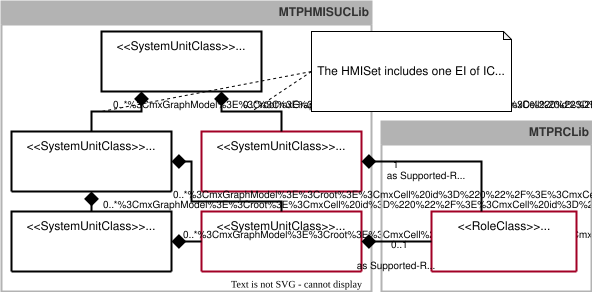

## 9.2 MTP Extension of the HMISet
This chapter specifies all identified extensions of the *HMISet* and integrates them into the existing [MTP Specification Part 2](../98_References/README.md#mtp-specification-part-2).

### 9.2.1 Overview
Two model definitions, *SUC PictureFrame* and *SUC ReferencedPicture*, are required for HMI modeling in choreographed logistics lines. As shown in [Figure 9.3](#figure-93-extension-of-the-hmiset-for-representing-line-hmis), these definitions, together with all other model definitions for HMI modeling, are organized in *SUCL MTPHMISUCLib*. In MTP modeling, any number of *ReferencedPictures* can be inserted into the instance hierarchy of the *HMISet*, similar to *Pictures* according to [MTP Specification Part 2](../98_References/README.md#mtp-specification-part-2). Any number of instances of *SUC PictureFrame* can be added to the *Pictures* or *SemanticGroups* modeled in the MTP, similar to *VisualObjects* according to [MTP Specification Part 2](../98_References/README.md#mtp-specification-part-2). The model definitions of *SUC HMISet*, *SUC Picture*, and *SUC SemanticGroup* must therefore be extended to allow subordinate *ReferencedPictures* and *PictureFrames*, respectively. *SUC PictureFrame* and *SUC ReferencedPicture* use *RC HasExternalMtpContext*, specified in [RC HasExternalMtpContext](./09-01_Manifest.md#specification-of-the-role-class-hasexternalmtpcontext), to reference external objects from other MTP files. The new and extended model definitions are specified in detail in [Model Definitions](#922-model-definitions) and are assigned to the new profile *ModuleTypePackage:HMISet.Composed V2.0.0*.[^1]

##### Figure 9.3: Extension of the HMISet for Representing Line HMIs

### 9.2.2 Model Definitions
#### Specification of the System Unit Class PictureFrame
*SUC PictureFrame* ([Table 9.5](#table-95-model-definition-of-suc-pictureframe)) enables the embedding of a referenced picture into another picture. For this purpose, the picture to be displayed in the *PictureFrame* is referenced by means of *PictureLink* using the ID link mechanism according to [MTP Specification Part 1](../98_References/README.md#mtp-specification-part-1). The *PictureFrame* itself can be placed in a picture of *SUC Picture* or, if applicable, in a contained *SUC SemanticGroup*, analogous to a *VisualObject* according to [MTP Specification Part 2](../98_References/README.md#mtp-specification-part-2). The size and position of the *PictureFrame* are defined by the variables *Width*, *Height*, *X*, *Y*, and *ZIndex*.[^2] If a picture modeled in another MTP is to be displayed in the *PictureFrame*, e.g., a picture of a logistics line, *RC HasExternalMtpContext* must additionally be annotated as an SRC. This enables the referenced MTP file to be addressed by entering a *ContextLink*.

##### Table 9.5: Model Definition of *SUC PictureFrame*

<table>
	<tr>
		<td colspan="4" align="left"><strong>▶ Module Type Package - Model Definition</strong></td>
	</tr>
	<tr>
		<th align="left">Name</th>
		<td colspan="3" align="left"><strong>PictureFrame</strong></td>
	</tr>
	<tr>
		<th align="left">Type</th>
		<td colspan="3" align="left">SystemUnitClass (SUC)</td>
	</tr>
	<tr>
		<th align="left">Modifier</th>
		<td colspan="3" align="left">-</td>
	</tr>
	<tr>
		<th align="left">Description</th>
		<td colspan="3" align="left">model definition for including a picture into another picture</td>
	</tr>
	<tr>
		<th align="left">AutomationML Path</th>
		<td colspan="3" align="left">MTPHMISUCLib/PictureFrame</td>
	</tr>
	<tr>
		<th align="left">AutomationML BaseRef</th>
		<td colspan="3" align="left">-</td>
	</tr>
	<tr>
		<th align="left">RoleClasses</th>
		<td colspan="3" align="left">[1] AutomationMLBaseRoleClassLib/AutomationMLBaseRole (SRC) [0..1] MTPRCLib/HasExternalMtpContext (SRC)a)</td>
	</tr>
	<tr>
		<th align="left">Version</th>
		<td colspan="3" align="left">ModuleTypePackage:HMISet.Composed V2.0.0</td>
	</tr>
	<tr>
		<td colspan="4" align="left"><strong>📌 AutomationML Properties</strong></td>
	</tr>
	<tr>
		<th align="left">Name</th>
		<th align="left">Type</th>
		<th colspan="2" align="left">Description</th>
	</tr>
	<tr>
		<td align="left">-</td>
		<td align="left">-</td>
		<td colspan="2" align="left">-</td>
	</tr>
	<tr>
		<td colspan="4" align="left"><strong>📌 AutomationML Attributes</strong></td>
	</tr>
	<tr>
		<th align="left">Name</th>
		<th align="left">Type</th>
		<th align="left">Description</th>
		<th align="left">AttributeType Reference</th>
	</tr>
	<tr>
		<td align="left">PictureLink</td>
		<td align="left">xs:string (GUID-formatted)</td>
		<td align="left">object identifier of the referenced picture</td>
		<td align="left">IDLinkAttributeType</td>
	</tr>
	<tr>
		<td align="left">Width</td>
		<td align="left">xs:unsignedInt</td>
		<td align="left">width of the picture frame</td>
		<td align="left">-</td>
	</tr>
	<tr>
		<td align="left">Height</td>
		<td align="left">xs:unsignedInt</td>
		<td align="left">height of the picture frame</td>
		<td align="left">-</td>
	</tr>
	<tr>
		<td align="left">X</td>
		<td align="left">xs:unsignedInt</td>
		<td align="left">X coordinate of the upper left corner of the picture frame</td>
		<td align="left">-</td>
	</tr>
	<tr>
		<td align="left">Y</td>
		<td align="left">xs:unsignedInt</td>
		<td align="left">Y coordinate of the upper left corner of the picture frame</td>
		<td align="left">-</td>
	</tr>
	<tr>
		<td align="left">ZIndex</td>
		<td align="left">xs:unsignedInt</td>
		<td align="left">index of the HMI layer the picture frame is located</td>
		<td align="left">-</td>
	</tr>
	<tr>
		<td colspan="4" align="left"><strong>📌 Comment</strong></td>
	</tr>
	<tr>
		<td colspan="4" align="left">a) The RC HasExternalMtpContext has to be added, if the referenced picture is located in another MTP file.</td>
	</tr>
	<tr>
		<td colspan="4" align="left"><strong>📌 AutomationML Object - Instance Constraints</strong></td>
	</tr>
	<tr>
		<th align="left">Allowed Parents</th>
		<td colspan="3" align="left">IE of SUC Picture IE of SUC SemanticGroup</td>
	</tr>
	<tr>
		<th align="left">Allowed Children</th>
		<td colspan="3" align="left">(no children allowed)</td>
	</tr>
</table>

#### Extension of the System Unit Class Picture
*SUC Picture* ([Table 9.6](#table-96-model-definition-of-suc-picture)) is the base class for modeling a picture. This model definition is already defined in [MTP Specification Part 2](../98_References/README.md#mtp-specification-part-2) and is extended here by the capability to include *PictureFrames*.

##### Table 9.6: Model Definition of *SUC Picture*

<table>
	<tr>
		<td colspan="4" align="left"><strong>▶ Module Type Package - Model Definition</strong></td>
	</tr>
	<tr>
		<th align="left">Name</th>
		<td colspan="3" align="left"><strong>Picture</strong></td>
	</tr>
	<tr>
		<th align="left">Type</th>
		<td colspan="3" align="left">SystemUnitClass (SUC)</td>
	</tr>
	<tr>
		<th align="left">Modifier</th>
		<td colspan="3" align="left">sealed</td>
	</tr>
	<tr>
		<th align="left">Description</th>
		<td colspan="3" align="left">object containing all picture elements to be displayed in a view</td>
	</tr>
	<tr>
		<th align="left">AutomationML Path</th>
		<td colspan="3" align="left">MTPHMISUCLib/Picture</td>
	</tr>
	<tr>
		<th align="left">AutomationML BaseRef</th>
		<td colspan="3" align="left">-</td>
	</tr>
	<tr>
		<th align="left">RoleClasses</th>
		<td colspan="3" align="left">[1] AutomationMLBaseRoleClassLib/AutomationMLBaseRole (SRC)</td>
	</tr>
	<tr>
		<th align="left">Version</th>
		<td colspan="3" align="left">ModuleTypePackage:HMISet.Composed V2.0.0</td>
	</tr>
	<tr>
		<td colspan="4" align="left"><strong>📌 AutomationML Properties</strong></td>
	</tr>
	<tr>
		<th align="left">Name</th>
		<th align="left">Type</th>
		<th colspan="2" align="left">Description</th>
	</tr>
	<tr>
		<td align="left">-</td>
		<td align="left">-</td>
		<td colspan="2" align="left">-</td>
	</tr>
	<tr>
		<td colspan="4" align="left"><strong>📌 AutomationML Attributes</strong></td>
	</tr>
	<tr>
		<th align="left">Name</th>
		<th align="left">Type</th>
		<th align="left">Description</th>
		<th align="left">AttributeType Reference</th>
	</tr>
	<tr>
		<td align="left">Width</td>
		<td align="left">xs:unsignedInt</td>
		<td align="left">width of the original graphic</td>
		<td align="left">-</td>
	</tr>
	<tr>
		<td align="left">Height</td>
		<td align="left">xs:unsignedInt</td>
		<td align="left">height of the original graphic</td>
		<td align="left">-</td>
	</tr>
	<tr>
		<td align="left">HierarchyLevel</td>
		<td align="left">xs:string (formatted)</td>
		<td align="left">indication of the detail depth of the HMI</td>
		<td align="left">-</td>
	</tr>
	<tr>
		<td colspan="4" align="left"><strong>📌 Comment</strong></td>
	</tr>
	<tr>
		<td colspan="4" align="left">-</td>
	</tr>
	<tr>
		<td colspan="4" align="left"><strong>📌 AutomationML Object - Instance Constraints</strong></td>
	</tr>
	<tr>
		<th align="left">Allowed Parents</th>
		<td colspan="3" align="left">IH to which an IE of SUC HMISet relates via EI of IC AspectSetReference</td>
	</tr>
	<tr>
		<th align="left">Allowed Children</th>
		<td colspan="3" align="left">[0..*] IEs of SUC SemanticGroup [0..*] IEs of SUC VisualObject [0..*] IEs of SUC TopologyObject [0..*] IEs of SUC Connection [0..*] IEs of SUC PictureFrame</td>
	</tr>
</table>

#### Extension of the System Unit Class SemanticGroup
*SUC SemanticGroup* ([Table 9.7](#table-97-model-definition-of-suc-semanticgroup)) is used to mark semantically related elements in HMIs. This model definition is already defined in [MTP Specification Part 2](../98_References/README.md#mtp-specification-part-2) and is extended in this work by the capability to include *PictureFrames*.

##### Table 9.7: Model Definition of *SUC SemanticGroup*

<table>
	<tr>
		<td colspan="4" align="left"><strong>▶ Module Type Package - Model Definition</strong></td>
	</tr>
	<tr>
		<th align="left">Name</th>
		<td colspan="3" align="left"><strong>SemanticGroup</strong></td>
	</tr>
	<tr>
		<th align="left">Type</th>
		<td colspan="3" align="left">SystemUnitClass (SUC)</td>
	</tr>
	<tr>
		<th align="left">Modifier</th>
		<td colspan="3" align="left">sealed</td>
	</tr>
	<tr>
		<th align="left">Description</th>
		<td colspan="3" align="left">object indicating that the subordinate symbols belong together</td>
	</tr>
	<tr>
		<th align="left">AutomationML Path</th>
		<td colspan="3" align="left">MTPHMISUCLib/SemanticGroup</td>
	</tr>
	<tr>
		<th align="left">AutomationML BaseRef</th>
		<td colspan="3" align="left">-</td>
	</tr>
	<tr>
		<th align="left">RoleClasses</th>
		<td colspan="3" align="left">[1] AutomationMLBaseRoleClassLib/AutomationMLBaseRole (SRC)</td>
	</tr>
	<tr>
		<th align="left">Version</th>
		<td colspan="3" align="left">ModuleTypePackage:HMISet.Composed V2.0.0</td>
	</tr>
	<tr>
		<td colspan="4" align="left"><strong>📌 AutomationML Properties</strong></td>
	</tr>
	<tr>
		<th align="left">Name</th>
		<th align="left">Type</th>
		<th align="left">Description</th>
		<th align="left">AttributeType Reference</th>
	</tr>
	<tr>
		<td align="left">-</td>
		<td align="left">-</td>
		<td align="left">-</td>
		<td align="left">-</td>
	</tr>
	<tr>
		<td colspan="4" align="left"><strong>📌 AutomationML Attributes</strong></td>
	</tr>
	<tr>
		<th align="left">Name</th>
		<th align="left">Type</th>
		<th align="left">Description</th>
		<th align="left">AttributeType Reference</th>
	</tr>
	<tr>
		<td align="left">-</td>
		<td align="left">-</td>
		<td align="left">-</td>
		<td align="left">-</td>
	</tr>
	<tr>
		<td colspan="4" align="left"><strong>📌 Comment</strong></td>
	</tr>
	<tr>
		<td colspan="4" align="left">-</td>
	</tr>
	<tr>
		<td colspan="4" align="left"><strong>📌 AutomationML Object - Instance Constraints</strong></td>
	</tr>
	<tr>
		<th align="left">Allowed Parents</th>
		<td colspan="3" align="left">IE of SUC Picture IE of SUC SemanticGroup</td>
	</tr>
	<tr>
		<th align="left">Allowed Children</th>
		<td colspan="3" align="left">[0..*] IEs of SUC Semantic Group [0..*] IEs of SUC VisualObject [0..*] IEs of SUC TopologyObject [0..*] IEs of SUC Connection [0..*] IEs of SUC PictureFrame</td>
	</tr>
</table>

#### Specification of the System Unit Class ReferencedPicture

*SUC ReferencedPicture* ([Table 9.8](#table-98-model-definition-of-suc-referencedpicture)) enables the embedding of a referenced picture or an entire picture hierarchy from another LEA MTP into the local picture hierarchy, for example by embedding the pictures of the individual LEAs of a logistics line into the corresponding Composed MTP. For this purpose, *RC HasExternalMtpContext* is annotated as an SRC. By entering a *ContextLink*, it enables a reference to the MTP file that contains the referenced picture or referenced picture hierarchy. When a single picture is embedded, the specific picture to be embedded is referenced via *PictureLink* using the ID link mechanism according to [MTP Specification Part 1](../98_References/README.md#mtp-specification-part-1). When an entire picture hierarchy is embedded, the variable *PictureLink* is left empty. In both cases, the variable *HierarchyLevel* is used to position the referenced picture or referenced picture hierarchy within the local picture hierarchy.

##### Table 9.8: Model Definition of *SUC ReferencedPicture*

<table>
	<tr>
		<td colspan="4" align="left"><strong>▶ Module Type Package - Model Definition</strong></td>
	</tr>
	<tr>
		<th align="left">Name</th>
		<td colspan="3" align="left"><strong>ReferencedPicture</strong></td>
	</tr>
	<tr>
		<th align="left">Type</th>
		<td colspan="3" align="left">SystemUnitClass (SUC)</td>
	</tr>
	<tr>
		<th align="left">Modifier</th>
		<td colspan="3" align="left">sealed</td>
	</tr>
	<tr>
		<th align="left">Description</th>
		<td colspan="3" align="left">model to reference to a picture of another MTP file</td>
	</tr>
	<tr>
		<th align="left">AutomationML Path</th>
		<td colspan="3" align="left">MTPHMISUCLib/ReferencedPicture</td>
	</tr>
	<tr>
		<th align="left">AutomationML BaseRef</th>
		<td colspan="3" align="left">-</td>
	</tr>
	<tr>
		<th align="left">RoleClasses</th>
		<td colspan="3" align="left">[1] AutomationMLBaseRoleClassLib/AutomationMLBaseRole (SRC) [1] MTPRCLib/HasExternalMtpContext (SRC)</td>
	</tr>
	<tr>
		<th align="left">Version</th>
		<td colspan="3" align="left">ModuleTypePackage:HMISet.Composed V2.0.0</td>
	</tr>
	<tr>
		<td colspan="4" align="left"><strong>📌 AutomationML Properties</strong></td>
	</tr>
	<tr>
		<th align="left">Name</th>
		<th align="left">Type</th>
		<th colspan="2" align="left">Description</th>
	</tr>
	<tr>
		<td align="left">-</td>
		<td align="left">-</td>
		<td colspan="2" align="left">-</td>
	</tr>
	<tr>
		<td colspan="4" align="left"><strong>📌 AutomationML Attributes</strong></td>
	</tr>
	<tr>
		<th align="left">Name</th>
		<th align="left">Type</th>
		<th align="left">Description</th>
		<th align="left">AttributeType Reference</th>
	</tr>
	<tr>
		<td align="left">PictureLink</td>
		<td align="left">xs:string (GUID-formatted)</td>
		<td align="left">object identifier of the referenced picture within the attached MTP</td>
		<td align="left">IDLinkAttributeType</td>
	</tr>
	<tr>
		<td align="left">HierarchyLevel</td>
		<td align="left">xs:string (formatted)</td>
		<td align="left">indication of the detail depth of the referenced picture</td>
		<td align="left">-</td>
	</tr>
	<tr>
		<td colspan="4" align="left"><strong>📌 Comment</strong></td>
	</tr>
	<tr>
		<td colspan="4" align="left">-</td>
	</tr>
	<tr>
		<td colspan="4" align="left"><strong>📌 AutomationML Object - Instance Constraints</strong></td>
	</tr>
	<tr>
		<th align="left">Allowed Parents</th>
		<td colspan="3" align="left">IH to which an IE of SUC HMISet relates via EI of IC AspectSetReference</td>
	</tr>
	<tr>
		<th align="left">Allowed Children</th>
		<td colspan="3" align="left">(no children allowed)</td>
	</tr>
</table>

#### Extension of the System Unit Class HMISet

*SUC HMISet* ([Table 9.9](#table-99-model-definition-of-suc-hmiset)) is the base class for modeling all picture-related information of an MTP. This model definition is already defined in [MTP Specification Part 2](../98_References/README.md#mtp-specification-part-2) and is extended in this work by the capability to include *ReferencedPictures*.

##### Table 9.9: Model Definition of *SUC HMISet*

<table>
	<tr>
		<td colspan="4" align="left"><strong>▶ Module Type Package - Model Definition</strong></td>
	</tr>
	<tr>
		<th align="left">Name</th>
		<td colspan="3" align="left"><strong>HMISet</strong></td>
	</tr>
	<tr>
		<th align="left">Type</th>
		<td colspan="3" align="left">SystemUnitClass (SUC)</td>
	</tr>
	<tr>
		<th align="left">Modifier</th>
		<td colspan="3" align="left">sealed</td>
	</tr>
	<tr>
		<th align="left">Description</th>
		<td colspan="3" align="left">Module Type Package aspect set for operator pictures</td>
	</tr>
	<tr>
		<th align="left">AutomationML Path</th>
		<td colspan="3" align="left">MTPHMISUCLib/HMISet</td>
	</tr>
	<tr>
		<th align="left">AutomationML BaseRef</th>
		<td colspan="3" align="left">MTPSUCLib/MTPSet</td>
	</tr>
	<tr>
		<th align="left">RoleClasses</th>
		<td colspan="3" align="left">-</td>
	</tr>
	<tr>
		<th align="left">Version</th>
		<td colspan="3" align="left">ModuleTypePackage:HMISet.Composed V2.0.0</td>
	</tr>
	<tr>
		<td colspan="4" align="left"><strong>📌 AutomationML Properties</strong></td>
	</tr>
	<tr>
		<th align="left">Name</th>
		<th align="left">Type</th>
		<th colspan="2" align="left">Description</th>
	</tr>
	<tr>
		<td align="left">-</td>
		<td align="left">-</td>
		<td colspan="2" align="left">-</td>
	</tr>
	<tr>
		<td colspan="4" align="left"><strong>📌 AutomationML Attributes</strong></td>
	</tr>
	<tr>
		<th align="left">Name</th>
		<th align="left">Type</th>
		<th align="left">Description</th>
		<th align="left">AttributeType Reference</th>
	</tr>
	<tr>
		<td align="left">-</td>
		<td align="left">-</td>
		<td align="left">-</td>
		<td align="left">-</td>
	</tr>
	<tr>
		<td colspan="4" align="left"><strong>📌 Comment</strong></td>
	</tr>
	<tr>
		<td colspan="4" align="left">-</td>
	</tr>
	<tr>
		<td colspan="4" align="left"><strong>📌 AutomationML Object - Instance Constraints</strong></td>
	</tr>
	<tr>
		<th align="left">Allowed Parents</th>
		<td colspan="3" align="left">(no further constraints given)</td>
	</tr>
	<tr>
		<th align="left">Allowed Children</th>
		<td colspan="3" align="left">[1] EI of IC AspectSetReference which refers via ID to an IH containing [0..*] IEs of SUC Picture [0..*] IEs of SUC ReferencedPicture</td>
	</tr>
</table>

[^1]: In the context of this work, *SUC PictureFrame* is initially assigned to the profile *ModuleTypePackage:HMISet.Composed V2.0.0* because it is used exclusively to embed external LEA HMIs into a Composed MTP. However, this SUC is also suitable for embedding MTP-internal HMIs in non-composed MTPs. Therefore, if it is adopted into the MTP specification in the future, it appears appropriate to define a separate profile for this SUC.
[^2]: This *PictureFrame* mechanism may also be useful in non-composed MTPs, for example to embed detail pictures into an overall picture of one PEA or LEA. In that case, *ContextLink* is not required. Within this work, however, *SUC PictureFrame* is considered exclusively in the context of line HMIs in Composed MTPs.
