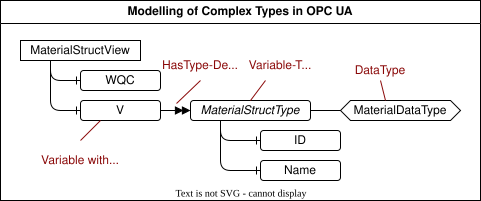

## 9.6 MTP Extension of the ServerAssemblySet
This chapter specifies all identified extensions of the *ServerAssemblySet* and integrates them into the existing [MTP Specification Part 5](../98_References/README.md#mtp-specification-part-5) and [MTP Specification Part 5.1](../98_References/README.md#mtp-specification-part-51), respectively.

#### Mapping Complex Data Types in OPC UA
The specification chapters [MTP Extension of the DataAssemblySet](09-03_DataAssemblySet.md#93-mtp-extension-of-the-dataassemblyset), [MTP Extension of the ServiceSet](09-04_ServiceSet.md#94-mtp-extension-of-the-serviceset), and [MTP Extension of the ProcessValueSet](09-05_ProcessValueSet.md#95-mtp-extension-of-the-processvalueset) described DataAssembly definitions with complex data types for Structs and Arrays. To transmit these data types via OPC UA, not only the existing primitive data types but also the mapping of complex data types into the address space of the OPC UA server of a LEA must be specified.

[Figure 9.17](#figure-917-mapping-of-structured-data-types-in-opc-ua-based-on-pno2025part5) shows the mapping of variables of **structured data types** in OPC UA.

##### Figure 9.17: Mapping of Structured Data Types in OPC UA Based on PNO.2025.Part5

Variables of a structured data type have a *HasTypeDefinition* to an OPC UA *VariableType* that describes the underlying structure. This *VariableType* has a data type that is an OPC UA *DataType*. This *DataType*, in turn, has a *StructureDefinition* that contains a list of *StructureFields*, not shown in the figure. These *StructureFields* correspond to the subordinate variables of the *VariableType* and thus to the complex data type to be mapped. This modeling of structured data types is possible with the native OPC UA means according to [OPC 10000-3](../98_References/README.md#opc-10000-3). As a result of this work, this modelling has already been adopted into the profile *ModuleTypePackage:ServerAssemblySet.OPCUA V2.0.0* of the [MTP Specification Part 5](../98_References/README.md#mtp-specification-part-5).

Variables with **array data types** do not require additional rules for mapping to OPC UA. By using the multiplexing mechanism, the arrays are represented in OPC UA in the form of primitive or structured data types.
