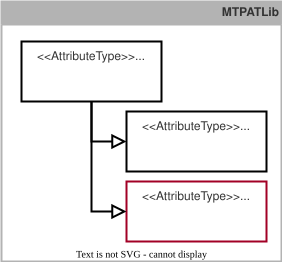

## 9.1 MTP Extension of the Manifest
This chapter specifies all identified extensions of the *Manifest* and integrates them into the existing MTP specification [MTP Specification Part 1](../98_References/README.md#mtp-specification-part-1).

### 9.1.1 Overview
#### Extension of the Manifest for Modeling Composed MTPs
For modeling Composed MTPs two new model definitions *SUC ComposedModuleTypePackage* and *RC HasExternalMtpContext* are required. As shown in [Figure 9.1](#figure-91-extension-of-the-manifest-for-modeling-composed-mtps), the model definition *SUC ComposedModuleTypePackage* is organized in *SUCL MTPSUCLib*. An *IH ModuleTypePackage* may contain either a *SUC ComposedModuleTypePackage* or a *SUC ModuleTypePackage*. In contrast to *SUC ModuleTypePackage*, *SUC ComposedModuleTypePackage* always contains a subordinate *AttachmentSet* but no *DataAssemblySet* or *ServerAssemblySet*. 

<!-- TODO: Evtl. auf Struktur des AttachementSet verweisen -->

##### Figure 9.1: Extension of the Manifest for Modeling Composed MTPs
 

*RC HasExternalMtpContext* is organized in the newly introduced library *RCL MTPRCLib*. It can be assigned to a *SUC LinkedObject* as an SRC. Thus, *SUC LinkedObject* must be extended to enable this assignment.[^1] These extensions are specified in detail in [Model Definitions](#912-model-definitions) and are assigned to the new profile *ModuleTypePackage:Manifest.Composed V2.0.0*.

#### Extension of the Manifest for Verifying Choreographed Functions
New workflows are required for type, version, and instance verification of choreographed functions and Composed MTPs. These extensions are specified in detail in [Workflows](#913-workflows) and are assigned to the new profile *ModuleTypePackage:Manifest.Composed V2.0.0*.

For version verification, the variable *ComposedTypeRevision* of *SUC ComposedModuleTypePackage* is used. This variable has a specific format and interpretation that follow the rules of *Semantic Versioning* according to [MTP Specification Part 1](../98_References/README.md#mtp-specification-part-1). According to the MTP modeling principles, a defined AttributeType must therefore be assigned to this variable. For this purpose, *AT ComposedTypeRevisionType* is introduced as shown in [Figure 9.2](#figure-92-extension-of-the-manifest-for-verifying-choreographed-functions). It describes the version of the communication-relevant interface content of a choreographed function.[^2] This AT is derived from *AT SemanticVersionAttributeType* and organized in *ATL MTPATLib*. This extension is specified in detail in [Model Definitions](#912-model-definitions) and is assigned to the new profile *ModuleTypePackage:Manifest.Composed V2.0.0*.

##### Figure 9.2: Extension of the Manifest for Verifying Choreographed Functions

### 9.1.2 Model Definitions
#### Specification of the System Unit Class ComposedModuleTypePackage
*SUC ComposedModuleTypePackage* ([Table 9.1](#table-91-model-definition-of-suc-composedmoduletypepackage)) is the entry point to the information model of a Composed MTP. It contains the table of contents of the Composed MTP, from which all contained aspects are referenced according to [MTP Specification Part 1](../98_References/README.md#mtp-specification-part-1). A *SUC ComposedModuleTypePackage* always contains an *AttachmentSet* that references the MTP files on which the Composed MTP is based. *SUC ComposedModuleTypePackage* contains AutomationML properties and attributes used for type, version, and instance verification of choreographed types (see [Workflows](#913-workflows), type, version, and instance verification of choreographies). In addition, the variable *Version* specifies the version of the Composed MTP itself. In contrast to *ComposedTypeRevision*, *Version* also indicates non-communication-relevant changes that affect only the Composed MTP itself, for example changes to the HMI of the logistics line.

##### Table 9.1: Model Definition of *SUC ComposedModuleTypePackage*

<table>
  <tr>
    <td colspan="4" align="left"><strong>▶ Module Type Package - Model Definition</strong></td>
  </tr>
  <tr>
    <th align="left">Name</th>
    <td colspan="3" align="left"><strong>ComposedModuleTypePackage</strong></td>
  </tr>
  <tr>
    <th align="left">Type</th>
    <td colspan="3" align="left">SystemUnitClass (SUC)</td>
  </tr>
  <tr>
    <th align="left">Modifier</th>
    <td colspan="3" align="left">sealed</td>
  </tr>
  <tr>
    <th align="left">Description</th>
    <td colspan="3" align="left">model definition for the entry point of a Composed Module Type Package</td>
  </tr>
  <tr>
    <th align="left">AutomationML Path</th>
    <td colspan="3" align="left">MTPSUCLib/ComposedModuleTypePackage</td>
  </tr>
  <tr>
    <th align="left">AutomationML BaseRef</th>
    <td colspan="3" align="left">-</td>
  </tr>
  <tr>
    <th align="left">RoleClasses</th>
    <td colspan="3" align="left">[1] AutomationMLBaseRoleClassLib/AutomationMLBaseRole (SRC)</td>
  </tr>
  <tr>
    <th align="left">Version</th>
    <td colspan="3" align="left">ModuleTypePackage:Manifest.Composed V2.0.0</td>
  </tr>
  <tr>
    <td colspan="4" align="left"><strong>📌 AutomationML Properties</strong></td>
  </tr>
  <tr>
    <th align="left">Name</th>
    <th align="left">Type</th>
    <th colspan="2" align="left">Description</th>
  </tr>
  <tr>
    <td align="left">ID</td>
    <td align="left">xs:string</td>
    <td colspan="2" align="left">GUID-formatted ID of the object</td>
  </tr>
  <tr>
    <td align="left">Name</td>
    <td align="left">xs:string</td>
    <td colspan="2" align="left">name of the composed type (e.g., name of the choreography type)</td>
  </tr>
  <tr>
    <td colspan="4" align="left"><strong>📌 AutomationML Attributes</strong></td>
  </tr>
  <tr>
    <th align="left">Name</th>
    <th align="left">Type</th>
    <th align="left">Description</th>
    <th align="left">AttributeType Reference</th>
  </tr>
  <tr>
    <td align="left">Version</td>
    <td align="left">xs:string</td>
    <td align="left">Composed Module Type Package version</td>
    <td align="left">ModuleType-PackageRevision-Type</td>
  </tr>
  <tr>
    <td align="left">ManufacturerUri</td>
    <td align="left">xs:string</td>
    <td align="left">creator of the composed type</td>
    <td align="left">-</td>
  </tr>
  <tr>
    <td align="left">ComposedType-Code</td>
    <td align="left">xs:string</td>
    <td align="left">identifier of the composed type</td>
    <td align="left">-</td>
  </tr>
  <tr>
    <td align="left">ComposedType-Revision</td>
    <td align="left">xs:string</td>
    <td align="left">version of the composed type</td>
    <td align="left">ComposedType-RevisionType</td>
  </tr>
  <tr>
    <td colspan="4" align="left"><strong>📌 Comment</strong></td>
  </tr>
  <tr>
    <td colspan="4" align="left">-</td>
  </tr>
  <tr>
    <td colspan="4" align="left"><strong>📌 AutomationML Object - Instance Constraints</strong></td>
  </tr>
  <tr>
    <th align="left">Allowed Parents</th>
    <td colspan="3" align="left">IH ModuleTypePackage</td>
  </tr>
  <tr>
    <th align="left">Allowed Children</th>
    <td colspan="3" align="left">[0..1] IE of each derivation of SUC MTPSet [1] IE of SUC AttachmentSet</td>
  </tr>
</table>

#### Specification of the Attribute Type ComposedTypeRevisionType
*AT ComposedTypeRevisionType* ([Table 9.2](#table-92-model-definition-of-at-composedtyperevisiontype)) defines the version information of the communication-relevant interface content of a Composed MTP according to the rules of *Semantic Versioning*. This AT is derived from *AT SemanticVersionAttributeType*.

##### Table 9.2: Model Definition of *AT ComposedTypeRevisionType*

<table>
	<tr>
		<td colspan="4" align="left"><strong>▶ Module Type Package - Model Definition</strong></td>
	</tr>
	<tr>
		<th align="left">Name</th>
		<td colspan="3" align="left"><strong>ComposedTypeRevisionType</strong></td>
	</tr>
	<tr>
		<th align="left">Type</th>
		<td colspan="3" align="left">Attribute Type (AT)</td>
	</tr>
	<tr>
		<th align="left">Modifier</th>
		<td colspan="3" align="left">sealed</td>
	</tr>
	<tr>
		<th align="left">Description</th>
		<td colspan="3" align="left">model definition of a composed type revision information</td>
	</tr>
	<tr>
		<th align="left">AutomationML Path</th>
		<td colspan="3" align="left">MTPATLib/SemanticVersionAttributeType/ComposedTypeRevisionType</td>
	</tr>
	<tr>
		<th align="left">AutomationML BaseRef</th>
		<td colspan="3" align="left">MTPATLib/SemanticVersionAttributeType</td>
	</tr>
	<tr>
		<th align="left">Data Type</th>
		<td colspan="3" align="left">xs:string</td>
	</tr>
	<tr>
		<th align="left">Version</th>
		<td colspan="3" align="left">ModuleTypePackage:Manifest.Composed V2.0.0</td>
	</tr>
	<tr>
		<td colspan="4" align="left"><strong>📌 AutomationML Attributes</strong></td>
	</tr>
	<tr>
		<th align="left">Name</th>
		<th align="left">Type</th>
		<th align="left">Description</th>
		<th align="left">AttributeType Reference</th>
	</tr>
	<tr>
		<td align="left">-</td>
		<td align="left">-</td>
		<td align="left">-</td>
		<td align="left">-</td>
	</tr>
	<tr>
		<td colspan="4" align="left"><strong>📌 Comment</strong></td>
	</tr>
	<tr>
		<td colspan="4" align="left">-</td>
	</tr>
</table>

#### Specification of the Role Class Library MTPRCLib
*RCL MTPRCLib* ([Table 9.3](#table-93-library-definition-of-rcl-mtprclib)) contains the basic role classes for the *Manifest* of a Module Type Package. 

##### Table 9.3: Library Definition of *RCL MTPRCLib*

<table>
	<tr>
		<td colspan="3" align="left"><strong>▶ Module Type Package - Library Definition</strong></td>
	</tr>
	<tr>
		<th align="left">Name</th>
		<td colspan="2" align="left"><strong>MTPRCLib</strong></td>
	</tr>
	<tr>
		<th align="left">Type</th>
		<td colspan="2" align="left">RoleClassLibrary (RCL)</td>
	</tr>
	<tr>
		<th align="left">Description</th>
		<td colspan="2" align="left">Library containing the Manifest RC model definitions of an MTP</td>
	</tr>
	<tr>
		<th align="left">Version</th>
		<td colspan="2" align="left">ModuleTypePackage:Manifest.Composed V2.0.0</td>
	</tr>
	<tr>
		<td colspan="3" align="left"><strong>📌 AutomationML Properties</strong></td>
	</tr>
	<tr>
		<th align="left">Name</th>
		<th align="left">Type</th>
		<th align="left">Description</th>
	</tr>
	<tr>
		<td align="left">-</td>
		<td align="left">-</td>
		<td align="left">-</td>
	</tr>
	<tr>
		<td colspan="3" align="left"><strong>📌 Comment</strong></td>
	</tr>
	<tr>
		<td colspan="3" align="left">-</td>
	</tr>
</table>

#### Specification of the Role Class HasExternalMtpContext
*RC HasExternalMtpContext* ([Table 9.4](#table-94-model-definition-of-rc-hasexternalmtpcontext)) provides the capability to reference an object from an attached MTP file. For this purpose, the variable *ContextLink* is used to reference the MTP file that contains the object to be referenced by means of the ID link mechanism. To do so, the ID of the *IC AttachmentReference* of the corresponding MTP file is entered in the *ContextLink* variable. The referenced object itself can then be addressed according to the LinkedObject or ID link mechanism defined in [MTP Specification Part 1](../98_References/README.md#mtp-specification-part-1), or according to the CustomSymbols mechanism, as if the object was located in the same MTP. *RC HasExternalMtpContext* can be annotated to derivations of *SUC LinkedObject*, *SUC PictureFrame*, and *SUC ReferencedPicture*. 

##### Table 9.4: Model Definition of *RC HasExternalMtpContext*

<table>
	<tr>
		<td colspan="4" align="left"><strong>▶ Module Type Package - Model Definition</strong></td>
	</tr>
	<tr>
		<th align="left">Name</th>
		<td colspan="3" align="left"><strong>HasExternalMtpContext</strong></td>
	</tr>
	<tr>
		<th align="left">Type</th>
		<td colspan="3" align="left">Role Class (RC)</td>
	</tr>
	<tr>
		<th align="left">Modifier</th>
		<td colspan="3" align="left">sealed</td>
	</tr>
	<tr>
		<th align="left">Description</th>
		<td colspan="3" align="left">Role Class for defining a referenced object originates from an external MTP context</td>
	</tr>
	<tr>
		<th align="left">AutomationML Path</th>
		<td colspan="3" align="left">MTPRCLib/HasExternalMtpContext</td>
	</tr>
	<tr>
		<th align="left">AutomationML BaseRef</th>
		<td colspan="3" align="left">-</td>
	</tr>
	<tr>
		<th align="left">Version</th>
		<td colspan="3" align="left">ModuleTypePackage:Manifest.Composed V2.0.0</td>
	</tr>
	<tr>
		<td colspan="4" align="left"><strong>📌 AutomationML Properties</strong></td>
	</tr>
	<tr>
		<th align="left">Name</th>
		<th align="left">Type</th>
		<th colspan="2" align="left">Description</th>
	</tr>
	<tr>
		<td align="left">-</td>
		<td align="left">-</td>
		<td colspan="2" align="left">-</td>
	</tr>
	<tr>
		<td colspan="4" align="left"><strong>📌 AutomationML Attributes</strong></td>
	</tr>
	<tr>
		<th align="left">Name</th>
		<th align="left">Type</th>
		<th align="left">Description</th>
		<th align="left">AttributeType Reference</th>
	</tr>
	<tr>
		<td align="left">ContextLink</td>
		<td align="left">xs:string (GUID-formatted)</td>
		<td align="left">object identifier of the referenced MTP in the attachment</td>
		<td align="left">IDLinkAttribute-Type</td>
	</tr>
	<tr>
		<td colspan="4" align="left"><strong>📌 Comment</strong></td>
	</tr>
	<tr>
		<td colspan="4" align="left">-</td>
	</tr>
	<tr>
		<td colspan="4" align="left"><strong>📌 AutomationML Object - Instance Constraints</strong></td>
	</tr>
	<tr>
		<th align="left">Allowed Annotations</th>
		<td colspan="3" align="left">IE of SUC LinkedObject as SRC IE of SUC PictureFrame as SRC IE of SUC ReferencedPicture as SRC</td>
	</tr>
</table>

### 9.1.3 Workflows
[MTP Specification Part 1](../98_References/README.md#mtp-specification-part-1) introduces mechanisms for type, version, and instance verification in the MTP context. These mechanisms can be used to verify the types, versions, and instance information of the individual LEAs of a logistics line. This section further shows how these mechanisms can be extended for verifying choreography-based functions and Composed MTPs.

#### Type Verification
[MTP Specification Part 1](../98_References/README.md#mtp-specification-part-1) describes type verification as a mechanism for checking compatibility between the PEA type described in an MTP and the type of a physically present PEA. For this purpose, manufacturer information and a product code in the MTP must be compared with the corresponding information at the runtime interface of the PEA.

To enable such type verification also for choreographed logistics lines, a *ManufacturerUri* and *ComposedTypeCode* are defined for the created choreography during the design phase. During generation of the Composed MTP, this information is transferred to the identically named variables in the IE of *SUC ComposedModuleTypePackage*. When the choreography is downloaded to the LEAs of the logistics line, this information is also written to the identically named variables of the *ChoreographyParticipantManager* interface. 

For type verification of the choreography, the *ManufacturerUri* and *ComposedTypeCode* stored in the Composed MTP must then be compared with the *ManufacturerUri* and *ComposedTypeCode* of all LEAs participating in the choreography. This ensures that the correct choreography configuration type has been downloaded to the LEAs.

#### Version Verification
[MTP Specification Part 1](../98_References/README.md#mtp-specification-part-1) describes version verification as a mechanism for checking compatibility between the version of a PEA communication interface described in an MTP and the version of the communication interface of a physically present PEA. For this purpose, the corresponding semantic version information in the MTP and at the runtime interface of the PEA must be compared. [MTP Specification Part 1](../98_References/README.md#mtp-specification-part-1) defines rules for this comparison that specify when compatibility exists and which limitations may apply.

To enable such version verification also for choreographed logistics lines, a *ComposedTypeRevision* is defined for the created choreography configuration during choreography configuration, in particular for the communication-relevant information of the line interface. It starts at "1.0.0" and is incremented according to the scope of the change based on the *Semantic Versioning* rules described in [MTP Specification Part 1](../98_References/README.md#mtp-specification-part-1). During generation of the Composed MTP, the version information is transferred to the *ComposedTypeRevision* variable in the IE of *SUC ComposedModuleTypePackage*. When the choreography is downloaded to the LEAs of the logistics line, the version information is also written to the *ComposedTypeRevision* variable of the *ChoreographyParticipantManager* interface.

For version verification of the choreography, the version information stored in the Composed MTP must then be compared with the version information of all LEAs participating in the choreography. The compatibility rules and compatibility limitations described in [MTP Specification Part 1](../98_References/README.md#mtp-specification-part-1) must be observed. Version verification ensures that a suitable version of the choreography configuration has been downloaded to the LEAs with respect to communication-relevant and thus integration-relevant content.

#### Instance Verification
[MTP Specification Part 1](../98_References/README.md#mtp-specification-part-1) describes instance verification as a mechanism for checking compatibility between the PEA instance planned in engineering and the PEA instance actually installed. For this purpose, information about the planned *ProductInstanceUri* must be compared with the *ProductInstanceUri* at the runtime interface of the installed PEA.

The instance of a choreographed logistics line results from the correct combination of the installed LEA instances. To verify these LEA instances, *Role-Idents* are assigned during choreography configuration for all participant roles to be filled in the choreography. These *RoleIdents* are stored in the Composed MTP as the *Name* of the *AttachmentReference* that points to the MTP file assigned to the role. In MLS engineering, it is defined which LEA instance, identifiable by its *ProductInstance-Uri*, is intended to fill which role of the choreographed logistics line. During download of the choreography configuration to the LEA instances, the corresponding *RoleIdent* is written to the identically named variable of the *ChoreographyParticipantManager* interface. 

For instance verification of the choreography, the assignments of *RoleIdent* and *ProductInstanceUri* defined in MLS engineering must then be compared with the corresponding information of all LEAs involved in the logistics line. The *RoleIdent* is obtained from the *ChoreographyParticipantManager* interface of the logistics line, and the *ProductInstanceUris* are obtained from the *PeaInformationLabel* interfaces of the LEAs according to [MTP Specification Part 3](../98_References/README.md#mtp-specification-part-3). This ensures that the correct LEA instances are installed in the logistics line.

[^1]: [HMISet](./09-02_HMISet.md) also describes that *RC HasExternalMtpContext* can be assigned to *SUC PictureFrame* and *SUC ReferencedPicture*.
[^2]: *AT ComposedTypeRevisionType* is therefore similar to *AT DeviceRevisionType*. However, while *AT DeviceRevisionType* refers only to the content of the *ServerAssemblySet* of one MTP, *AT ComposedTypeRevisionType* refers to the distributed content of the *ServerAssemblySets* of multiple MTPs.
