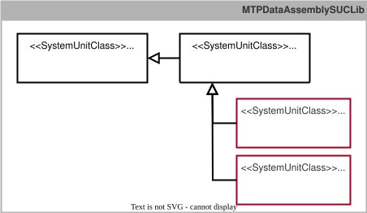
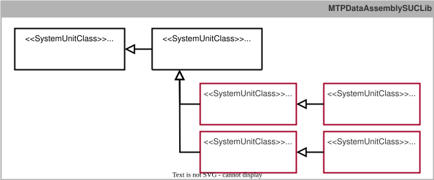
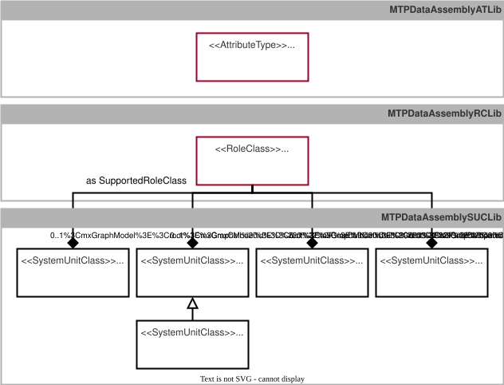
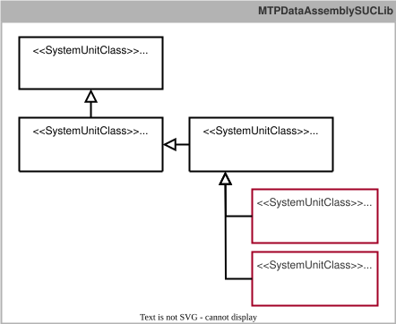

## 9.3 MTP Extension of the DataAssemblySet
This chapter specifies all identified extensions of the *DataAssemblySet* and integrates them into the existing MTP specification [MTP Specification Part 3](../98_References/README.md#mtp-specification-part-3).

### 9.3.1 Overview
#### Extension of the IndicatorElements
According to Chapters~[Reportwerte](#sec:Reportwerte) and [Lea Hmi](#sec:LeaHmi), the two interface definitions *SUC StructView* and *SUC ArrayView* are required for value displays in LEA HMIs and for mapping report values on LEA services. According to Section~[Prozesswerte](#sec:Prozesswerte), *StructView* is also required for process-value outputs of structured data types. As shown in [Figure 9.4](#figure-94-extension-of-the-dataassemblyset-for-implementing-structured-and-array-based-indicatorelements), *SUC StructView* and *SUC ArrayView*, together with all other interface definitions for report values, are derived from the interface definition *SUC IndicatorElement* according to [MTP Specification Part 3](../98_References/README.md#mtp-specification-part-3) and organized in *SUCL MTPDataAssemblySUCLib*. The detailed specification is provided in Appendix~[Interface Definitions](#subsec:AnhangDataAssemblySetSchnittstellen). This extension, as a result of this work, has already been adopted into the profile *ModuleTypePackage:DataAssemblySet.ComplexTypes V2.0.0* of the MTP specification [MTP Specification Part 3](../98_References/README.md#mtp-specification-part-3).

##### Figure 9.4: Extension of the DataAssemblySet for Implementing Structured and Array-Based IndicatorElements

#### Extension of the OperationElements
According to Section~[Lea Hmi](#sec:LeaHmi), the new interface definitions *SUC StructMan*, *SUC StructManInt*, *SUC ArrayMan*, and *SUC ArrayManInt* are required for operator-driven value manipulation in LEA HMIs. As shown in [Figure 9.5](#figure-95-extension-of-the-dataassemblyset-for-implementing-structured-and-array-based-operationelements), *SUC StructMan* and *SUC ArrayMan*, together with all other interface definitions for value manipulation, are derived from the interface definition *SUC OperationElement* according to [MTP Specification Part 3](../98_References/README.md#mtp-specification-part-3). *SUC StructManInt* is derived from *SUC StructMan*, and *SUC ArrayManInt* from *SUC ArrayMan*. All four interface definitions are organized in *SUCL MTPDataAssemblySUCLib*. The detailed specification is provided in Appendix~[Interface Definitions](#subsec:AnhangDataAssemblySetSchnittstellen). This extension, as a result of this work, has already been adopted into the profile *ModuleTypePackage:DataAssemblySet.ComplexTypes V2.0.0* of the MTP specification [MTP Specification Part 3](../98_References/README.md#mtp-specification-part-3).

##### Figure 9.5: Extension of the DataAssemblySet for Implementing Structured and Array-Based OperationElements

#### Extension of DINT-Based Interfaces with Time Formats
According to Section~[Schnittstelle Transportdienst](#subsec:SchnittstelleTransportdienst), report values in a time format are required for the timestamps of a transport service. For this purpose, *RC HasTimeFormat* is introduced. As shown in [Figure 9.6](#figure-96-extension-of-the-dataassemblyset-for-interpreting-dint-values-in-a-time-format), this RC can be added as an SRC to all DINT-based interface definitions, in particular to *SUC DIntView*, *SUC DIntMan*, *SUC DIntServParam*, and *SUC DIntProcessValueIn*. *RC HasTimeFormat* is organized in the newly introduced *RCL MTPDataAssemblyRCLib*. The detailed specification is provided in Appendix~[Interface Definitions](#subsec:AnhangDataAssemblySetSchnittstellen).

*RC HasTimeFormat* uses a new *AT TimeFormatAttributeType* to specify the time format in which a DINT value is to be interpreted. As shown in [Figure 9.6](#figure-96-extension-of-the-dataassemblyset-for-interpreting-dint-values-in-a-time-format), this AT is organized in *ATL MTPDataAssemblyATLib*. The detailed specification is provided in Appendix~[Model Definitions](#subsec:AnhangDataAssemblySetModelle).

These extensions are assigned to the newly introduced profile *ModuleTypePackage:DataAssemblySet.Time V2.0.0*.[^1]

##### Figure 9.6: Extension of the DataAssemblySet for Interpreting DINT Values in a Time Format

### 9.3.2 Interface Definitions
#### Specification of the System Unit Class StructView
*SUC StructView* ([Table 9.8](#table-98-interface-definition-of-suc-structview)) is used by an LOL to display an LEA variable of a user-defined structured data type.

##### Table 9.8: Interface Definition of *SUC StructView*

<table>
	<tr>
		<td colspan="6" align="left"><strong>▶ Module Type Package - DataAssembly Definition</strong></td>
	</tr>
	<tr>
		<th align="left">Name</th>
		<td colspan="5" align="left"><strong>StructView</strong></td>
	</tr>
	<tr>
		<th align="left">Type</th>
		<td colspan="5" align="left">System Unit Class (SUC)</td>
	</tr>
	<tr>
		<th align="left">Modifier</th>
		<td colspan="5" align="left">-</td>
	</tr>
	<tr>
		<th align="left">Description</th>
		<td colspan="5" align="left">generic interface for displaying a value of structured data following the rules of modelling complex data types</td>
	</tr>
	<tr>
		<th align="left">AutomationML Path</th>
		<td colspan="5" align="left">MTPDataAssemblySUCLib/DataAssembly/IndicatorElement/StructView</td>
	</tr>
	<tr>
		<th align="left">AutomationML BaseRef</th>
		<td colspan="5" align="left">MTPDataAssemblySUCLib/DataAssembly/IndicatorElement</td>
	</tr>
	<tr>
		<th align="left">Role Classes</th>
		<td colspan="5" align="left">-</td>
	</tr>
	<tr>
		<th align="left">Version</th>
		<td colspan="5" align="left">ModuleTypePackage:DataAssemblySet.ComplexTypes V2.0.0</td>
	</tr>
	<tr>
		<td colspan="6" align="left"><strong>📌 AutomationML Properties</strong></td>
	</tr>
	<tr>
		<th align="left">Name</th>
		<th align="left">Type</th>
		<th colspan="4" align="left">Description</th>
	</tr>
	<tr>
		<td align="left">-</td>
		<td align="left">-</td>
		<td colspan="4" align="left">-</td>
	</tr>
	<tr>
		<td colspan="6" align="left"><strong>📌 AutomationML Attributes</strong></td>
	</tr>
	<tr>
		<th align="left">Name</th>
		<th align="left">Access</th>
		<th align="left">Type</th>
		<th align="left">Description</th>
		<th align="left">Attribute-Type Reference</th>
		<th align="left">Base Function</th>
	</tr>
	<tr>
		<td align="left">V</td>
		<td align="left">LOL &lt;- LEA</td>
		<td align="left">{VType}</td>
		<td align="left">Value</td>
		<td align="left">-</td>
		<td align="left">-</td>
	</tr>
	<tr>
		<td align="left">VType</td>
		<td align="left">MTP</td>
		<td align="left">&lt;empty&gt;</td>
		<td align="left">Type Definition of the Value</td>
		<td align="left">{AT of StructuredDataType}</td>
		<td align="left">Complex-Type</td>
	</tr>
	<tr>
		<td colspan="6" align="left"><strong>📌 Comment</strong></td>
	</tr>
	<tr>
		<td colspan="6" align="left">-</td>
	</tr>
	<tr>
		<td colspan="6" align="left"><strong>📌 AutomationML Object - Instance Constraints</strong></td>
	</tr>
	<tr>
		<th align="left">Allowed Parents</th>
		<td colspan="5" align="left">(no further constraints given)</td>
	</tr>
	<tr>
		<th align="left">Allowed Children</th>
		<td colspan="5" align="left">(no further constraints given)</td>
	</tr>
</table>

The distinctive feature of this interface definition is the use of a user-defined structured data type. [Figure 9.7](#figure-97-modeling-of-a-user-defined-data-type) shows how such a data type can be modeled. For this purpose, the rules for modeling complex data types from [MTP Specification Part 5.1](../98_References/README.md#mtp-specification-part-51) are applied.

##### Figure 9.7: Modeling of a User-Defined Data Type

The complex data type used must be derived from *AT StructuredDataType* defined in [MTP Specification Part 5.1](../98_References/README.md#mtp-specification-part-51). When this interface is used, a user-defined ATL must be created, here: CompanyAAttributeLib. Within this ATL, the structured data type that is later to be used in the IE of *SUC StructView* must be specified. By assigning this user-defined AT to the attribute *VType* of *SUC StructView*, the structured data type used is defined. This data type is then expected in the variable *V*.

**Note:** If the *StructView* interface is used as a report value, it can be "frozen" by the variable *ReportValueFreeze* at the *ServiceControl* interface according to [MTP Specification Part 4](../98_References/README.md#mtp-specification-part-4). Optionally, it can be extended by a *MissedValue* variable by assigning *RC MissedValueFlag*.

#### Specification of the System Unit Class ArrayView
*SUC ArrayView* ([Table 9.9](#table-99-interface-definition-of-suc-arrayview)) is used by the LOL to display the value at a specific position of an array located in an LEA.

##### Table 9.9: Interface Definition of *SUC ArrayView*

<table>
	<tr>
		<td colspan="6" align="left"><strong>▶ Module Type Package - DataAssembly Definition</strong></td>
	</tr>
	<tr>
		<th align="left">Name</th>
		<td colspan="5" align="left"><strong>ArrayView</strong></td>
	</tr>
	<tr>
		<th align="left">Type</th>
		<td colspan="5" align="left">System Unit Class (SUC)</td>
	</tr>
	<tr>
		<th align="left">Modifier</th>
		<td colspan="5" align="left">-</td>
	</tr>
	<tr>
		<th align="left">Description</th>
		<td colspan="5" align="left">generic interface for displaying a value at a specific position of an array located in a PEA by a POL</td>
	</tr>
	<tr>
		<th align="left">AutomationML Path</th>
		<td colspan="5" align="left">MTPDataAssemblySUCLib/DataAssembly/IndicatorElement/ArrayView</td>
	</tr>
	<tr>
		<th align="left">AutomationML BaseRef</th>
		<td colspan="5" align="left">MTPDataAssemblySUCLib/DataAssembly/IndicatorElement</td>
	</tr>
	<tr>
		<th align="left">Role Classes</th>
		<td colspan="5" align="left">-</td>
	</tr>
	<tr>
		<th align="left">Version</th>
		<td colspan="5" align="left">ModuleTypePackage:DataAssemblySet.ComplexTypes V2.0.0</td>
	</tr>
	<tr>
		<td colspan="6" align="left"><strong>📌 AutomationML Properties</strong></td>
	</tr>
	<tr>
		<th align="left">Name</th>
		<th align="left">Type</th>
		<th colspan="4" align="left">Description</th>
	</tr>
	<tr>
		<td align="left">-</td>
		<td align="left">-</td>
		<td colspan="4" align="left">-</td>
	</tr>
	<tr>
		<td colspan="6" align="left"><strong>📌 AutomationML Attributes</strong></td>
	</tr>
	<tr>
		<th align="left">Name</th>
		<th align="left">Access</th>
		<th align="left">Type</th>
		<th align="left">Description</th>
		<th align="left">Attribute-Type Reference</th>
		<th align="left">Base Function</th>
	</tr>
	<tr>
		<td align="left">OSLevel</td>
		<td align="left">LOL -> LEA</td>
		<td align="left">BYTE</td>
		<td align="left">OSLevel variable</td>
		<td align="left">-</td>
		<td align="left">OSLevel</td>
	</tr>
	<tr>
		<td align="left">IndexSel</td>
		<td align="left">LOL -> LEA</td>
		<td align="left">DINT</td>
		<td align="left">Index Select Value</td>
		<td align="left">-</td>
		<td align="left">Multiplexing for Arrays</td>
	</tr>
	<tr>
		<td align="left">IndexMin</td>
		<td align="left">LOL <- LEA</td>
		<td align="left">DINT</td>
		<td align="left">Low Limit of the Index</td>
		<td align="left">-</td>
		<td align="left">Multiplexing for Arrays</td>
	</tr>
	<tr>
		<td align="left">IndexMax</td>
		<td align="left">LOL <- LEA</td>
		<td align="left">DINT</td>
		<td align="left">High Limit of the Index</td>
		<td align="left">-</td>
		<td align="left">Multiplexing for Arrays</td>
	</tr>
	<tr>
		<td align="left">IndexCur</td>
		<td align="left">LOL <- LEA</td>
		<td align="left">DINT</td>
		<td align="left">Current Index Value</td>
		<td align="left">-</td>
		<td align="left">Multiplexing for Arrays</td>
	</tr>
	<tr>
		<td align="left">V</td>
		<td align="left">LOL <- LEA</td>
		<td align="left">{VType}</td>
		<td align="left">Output Value</td>
		<td align="left">-</td>
		<td align="left">-</td>
	</tr>
	<tr>
		<td align="left">VType</td>
		<td align="left">MTP</td>
		<td align="left">a)</td>
		<td align="left">Type Definition of the Values</td>
		<td align="left">{AT derived from BaseData-Type}</td>
		<td align="left">Complex-Type</td>
	</tr>
	<tr>
		<td colspan="6" align="left"><strong>📌 Comment</strong></td>
	</tr>
	<tr>
		<td colspan="6" align="left">a) Type shall be &lt;empty&gt; in case of a StructuredDataType and shall be set to the defined type in case of a PrimitiveDataType.</td>
	</tr>
	<tr>
		<td colspan="6" align="left"><strong>📌 AutomationML Object - Instance Constraints</strong></td>
	</tr>
	<tr>
		<th align="left">Allowed Parents</th>
		<td colspan="5" align="left">(no further constraints given)</td>
	</tr>
	<tr>
		<th align="left">Allowed Children</th>
		<td colspan="5" align="left">(no further constraints given)</td>
	</tr>
</table>

The challenge of this interface definition is that it must access an array inside the LEA that may have an arbitrary length. In common automation solutions, this is often impossible or possible only under certain conditions because of predefined types. Therefore, a multiplexing mechanism is used that enables access to an array of arbitrary length via a structurally static interface.

By means of the *OSLevel* variable, it can be defined according to [MTP Specification Part 3](../98_References/README.md#mtp-specification-part-3) whether the interface is currently operated by the LOL or locally at the LEA. The variable *IndexSel* selects the array position to be displayed, similar to a pointer. The variables *IndexMin* and *IndexMax* specify the lower and upper limits of the array. The variable *IndexCur* specifies the currently selected index. The value of the array at this position is displayed in *V*.

*VType* defines the data type shared by all array elements. This may be a primitive data type or a user-defined structured data type according to the description of *SUC StructView*.

**Note 1:** If the *ArrayView* interface is used as a report value, it can be "frozen" by the variable *ReportValueFreeze* at the *ServiceControl* interface according to [MTP Specification Part 4](../98_References/README.md#mtp-specification-part-4). In this case, the entire array must be frozen, not only the currently selected value. Individual frozen values of the array can then be displayed by selecting the indices. Optionally, the *ArrayView* interface can be extended by a *MissedValue* variable by assigning *RC MissedValueFlag*.

**Note 2:** If the *ArrayView* interface is used as a report value and several or all values of an array are to be read for documentation purposes, several or all indices between *IndexMin* and *IndexMax* must be entered successively by the LOL at the *ArrayView* interface. The values of the individual array elements can then be stored one after another. This must also work in the frozen state.

#### Specification of the System Unit Class StructMan
*SUC StructMan* ([Table 9.10](#table-910-interface-definition-of-suc-structman)) is used by the LOL to manipulate an LEA variable of a user-defined structured data type.

##### Table 9.10: Interface Definition of *SUC StructMan*

<table>
	<tr>
		<td colspan="6" align="left"><strong>▶ Module Type Package - DataAssembly Definition</strong></td>
	</tr>
	<tr>
		<th align="left">Name</th>
		<td colspan="5" align="left"><strong>StructMan</strong></td>
	</tr>
	<tr>
		<th align="left">Type</th>
		<td colspan="5" align="left">System Unit Class (SUC)</td>
	</tr>
	<tr>
		<th align="left">Modifier</th>
		<td colspan="5" align="left">-</td>
	</tr>
	<tr>
		<th align="left">Description</th>
		<td colspan="5" align="left">generic interface for manipulating a value of structured data type following the rules of modelling complex data types</td>
	</tr>
	<tr>
		<th align="left">AutomationML Path</th>
		<td colspan="5" align="left">MTPDataAssemblySUCLib/DataAssembly/OperationElement/StructMan</td>
	</tr>
	<tr>
		<th align="left">AutomationML BaseRef</th>
		<td colspan="5" align="left">MTPDataAssemblySUCLib/DataAssembly/OperationElement</td>
	</tr>
	<tr>
		<th align="left">Role Classes</th>
		<td colspan="5" align="left">-</td>
	</tr>
	<tr>
		<th align="left">Version</th>
		<td colspan="5" align="left">ModuleTypePackage:DataAssemblySet.ComplexTypes V2.0.0</td>
	</tr>
	<tr>
		<td colspan="6" align="left"><strong>📌 AutomationML Properties</strong></td>
	</tr>
	<tr>
		<th align="left">Name</th>
		<th align="left">Type</th>
		<th colspan="4" align="left">Description</th>
	</tr>
	<tr>
		<td align="left">-</td>
		<td align="left">-</td>
		<td colspan="4" align="left">-</td>
	</tr>
	<tr>
		<td colspan="6" align="left"><strong>📌 AutomationML Attributes</strong></td>
	</tr>
	<tr>
		<th align="left">Name</th>
		<th align="left">Access</th>
		<th align="left">Type</th>
		<th align="left">Description</th>
		<th align="left">Attribute-Type Reference</th>
		<th align="left">Base Function</th>
	</tr>
	<tr>
		<td align="left">VOut</td>
		<td align="left">LOL <- LEA</td>
		<td align="left">{VType}</td>
		<td align="left">Value Output</td>
		<td align="left">-</td>
		<td align="left">-</td>
	</tr>
	<tr>
		<td align="left">VMan</td>
		<td align="left">LOL -> LEA</td>
		<td align="left">{VType}</td>
		<td align="left">Manual Value</td>
		<td align="left">-</td>
		<td align="left">-</td>
	</tr>
	<tr>
		<td align="left">VRbk</td>
		<td align="left">LOL <- LEA</td>
		<td align="left">{VType}</td>
		<td align="left">Readback Value</td>
		<td align="left">-</td>
		<td align="left">Readback</td>
	</tr>
	<tr>
		<td align="left">VFbk</td>
		<td align="left">LOL <- LEA</td>
		<td align="left">{VType}</td>
		<td align="left">Feedback</td>
		<td align="left">-</td>
		<td align="left">Feedback</td>
	</tr>
	<tr>
		<td align="left">VType</td>
		<td align="left">MTP</td>
		<td align="left">&lt;empty&gt;</td>
		<td align="left">Type Definition of the Value</td>
		<td align="left">{AT of StructuredDataType}</td>
		<td align="left">Complex-Type</td>
	</tr>
	<tr>
		<td colspan="6" align="left"><strong>📌 Comment</strong></td>
	</tr>
	<tr>
		<td colspan="6" align="left">-</td>
	</tr>
	<tr>
		<td colspan="6" align="left"><strong>📌 AutomationML Object - Instance Constraints</strong></td>
	</tr>
	<tr>
		<th align="left">Allowed Parents</th>
		<td colspan="5" align="left">(no further constraints given)</td>
	</tr>
	<tr>
		<th align="left">Allowed Children</th>
		<td colspan="5" align="left">(no further constraints given)</td>
	</tr>
</table>

*VMan* is used to enter the desired value of the variable. Analogous to the concept described in [MTP Specification Part 3](../98_References/README.md#mtp-specification-part-3), *VRbk* is used to verify the communication between an LOL and the *StructMan* interface within an LEA and indicates the raw value communicated to the LEA. *VOut* indicates the value passed to a further LEA-internal block, possibly with applied constraints. The variable *VFbk* is used to display the current value of the structure influenced by the *StructMan* interface.

The distinctive feature of this interface definition is the use of a user-defined structured data type. The modeling and use of such a type have already been described in connection with *SUC StructView* and are applied in the same way for *SUC StructMan*. This data type is then expected behind the variables *VOut*, *VMan*, *VRbk*, and *VFbk*.

#### Specification of the System Unit Class StructManInt
*SUC StructManInt* ([Table 9.11](#table-911-interface-definition-of-suc-structmanint)) is used to manipulate an LEA variable of a user-defined structured data type within the LEA or by the LOL.

##### Table 9.11: Interface Definition of *SUC StructManInt*

<table>
	<tr>
		<td colspan="6" align="left"><strong>▶ Module Type Package - DataAssembly Definition</strong></td>
	</tr>
	<tr>
		<th align="left">Name</th>
		<td colspan="5" align="left"><strong>StructManInt</strong></td>
	</tr>
	<tr>
		<th align="left">Type</th>
		<td colspan="5" align="left">System Unit Class (SUC)</td>
	</tr>
	<tr>
		<th align="left">Modifier</th>
		<td colspan="5" align="left">-</td>
	</tr>
	<tr>
		<th align="left">Description</th>
		<td colspan="5" align="left">generic interface for manipulating a value of structured data type following the rules of modelling complex data types by the LOL or from inside the LEA</td>
	</tr>
	<tr>
		<th align="left">AutomationML Path</th>
		<td colspan="5" align="left">MTPDataAssemblySUCLib/DataAssembly/OperationElement/StructMan/StructManInt</td>
	</tr>
	<tr>
		<th align="left">AutomationML BaseRef</th>
		<td colspan="5" align="left">MTPDataAssemblySUCLib/DataAssembly/OperationElement/StructMan</td>
	</tr>
	<tr>
		<th align="left">Role Classes</th>
		<td colspan="5" align="left">-</td>
	</tr>
	<tr>
		<th align="left">Version</th>
		<td colspan="5" align="left">ModuleTypePackage:DataAssemblySet.ComplexTypes V2.0.0</td>
	</tr>
	<tr>
		<td colspan="6" align="left"><strong>📌 AutomationML Properties</strong></td>
	</tr>
	<tr>
		<th align="left">Name</th>
		<th align="left">Type</th>
		<th colspan="4" align="left">Description</th>
	</tr>
	<tr>
		<td align="left">-</td>
		<td align="left">-</td>
		<td colspan="4" align="left">-</td>
	</tr>
	<tr>
		<td colspan="6" align="left"><strong>📌 AutomationML Attributes</strong></td>
	</tr>
	<tr>
		<th align="left">Name</th>
		<th align="left">Access</th>
		<th align="left">Type</th>
		<th align="left">Description</th>
		<th align="left">Attribute-Type Reference</th>
		<th align="left">Base Function</th>
	</tr>
	<tr>
		<td align="left">WQC</td>
		<td align="left">LOL <- LEA</td>
		<td align="left">BYTE</td>
		<td align="left">Worst Quality Code variable</td>
		<td align="left">-</td>
		<td align="left">WQC</td>
	</tr>
	<tr>
		<td align="left"><em>VMan a)</em></td>
		<td align="left"><em>LOL -> LEA</em></td>
		<td align="left"><em>{VType}</em></td>
		<td align="left"><em>(relevant, if SrcManAct is true, see SourceMode) Manual Value</em></td>
		<td align="left"><em>-</em></td>
		<td align="left"><em>-</em></td>
	</tr>
	<tr>
		<td align="left">VInt</td>
		<td align="left">LOL <- LEA</td>
		<td align="left">{VType}</td>
		<td align="left">(relevant, if SrcIntAct is true, see SourceMode) Internal Value</td>
		<td align="left">-</td>
		<td align="left">-</td>
	</tr>
	<tr>
		<td align="left">SrcChannel</td>
		<td align="left">LOL <- LEA</td>
		<td align="left">BOOL</td>
		<td align="left">SourceMode channel; 0: operator (*Op) shall be used; 1: automatic (*Aut) shall be used</td>
		<td align="left">-</td>
		<td align="left">SourceMode</td>
	</tr>
	<tr>
		<td align="left">SrcManAut</td>
		<td align="left">LOL <- LEA</td>
		<td align="left">BOOL</td>
		<td align="left">Request SourceMode to Manual by automatic (if SrcChannel is true); 1: request manual; 0: no operation</td>
		<td align="left">-</td>
		<td align="left">SourceMode</td>
	</tr>
	<tr>
		<td align="left">SrcIntAut</td>
		<td align="left">LOL <- LEA</td>
		<td align="left">BOOL</td>
		<td align="left">Request SourceMode to Internal by automatic (if SrcChannel is true); 1: request internal; 0: no operation</td>
		<td align="left">-</td>
		<td align="left">SourceMode</td>
	</tr>
	<tr>
		<td align="left">SrcIntOp</td>
		<td align="left">LOL -> LEA</td>
		<td align="left">BOOL</td>
		<td align="left">Request SourceMode to Internal by operator (if SrcChannel is false); 1: request internal; 0: no operation</td>
		<td align="left">-</td>
		<td align="left">SourceMode</td>
	</tr>
	<tr>
		<td align="left">SrcManOp</td>
		<td align="left">LOL -> LEA</td>
		<td align="left">BOOL</td>
		<td align="left">Request SourceMode to Manual by operator (if SrcChannel is false); 1: request manual; 0: no operation</td>
		<td align="left">-</td>
		<td align="left">SourceMode</td>
	</tr>
	<tr>
		<td align="left">SrcIntAct</td>
		<td align="left">LOL <- LEA</td>
		<td align="left">BOOL</td>
		<td align="left">1: internal mode active</td>
		<td align="left">-</td>
		<td align="left">SourceMode</td>
	</tr>
	<tr>
		<td align="left">SrcManAct</td>
		<td align="left">LOL <- LEA</td>
		<td align="left">BOOL</td>
		<td align="left">1: manual mode active</td>
		<td align="left">-</td>
		<td align="left">SourceMode</td>
	</tr>
	<tr>
		<td colspan="6" align="left"><strong>📌 Comment</strong></td>
	</tr>
	<tr>
		<td colspan="6" align="left">a) VMan is inherited from the StructMan interface. However, its meaning changes slightly in this case since it is only used when the SourceMode is set to manual.</td>
	</tr>
	<tr>
		<td colspan="6" align="left"><strong>📌 AutomationML Object - Instance Constraints</strong></td>
	</tr>
	<tr>
		<th align="left">Allowed Parents</th>
		<td colspan="5" align="left">(no further constraints given)</td>
	</tr>
	<tr>
		<th align="left">Allowed Children</th>
		<td colspan="5" align="left">(no further constraints given)</td>
	</tr>
</table>

The *StructManInt* interface extends the *StructMan* interface by internal value specification and a *SourceMode* according to [MTP Specification Part 3](../98_References/README.md#mtp-specification-part-3). If the internal access channel is selected, an internal LEA value is used instead of the external value specification. Otherwise, the function of this interface is identical to that of the *StructMan* interface.

#### Specification of the System Unit Class ArrayMan
*SUC ArrayMan* ([Table 9.12](#table-912-interface-definition-of-suc-arrayman)) is used by the LOL to manipulate a value at a specific position of an array located in an LEA.

##### Table 9.12: Interface Definition of *SUC ArrayMan*

<table>
	<tr>
		<td colspan="6" align="left"><strong>▶ Module Type Package - DataAssembly Definition</strong></td>
	</tr>
	<tr>
		<th align="left">Name</th>
		<td colspan="5" align="left"><strong>ArrayMan</strong></td>
	</tr>
	<tr>
		<th align="left">Type</th>
		<td colspan="5" align="left">System Unit Class (SUC)</td>
	</tr>
	<tr>
		<th align="left">Modifier</th>
		<td colspan="5" align="left">-</td>
	</tr>
	<tr>
		<th align="left">Description</th>
		<td colspan="5" align="left">generic interface for the POL to manipulate a value at a specific position of an array located in a LEA</td>
	</tr>
	<tr>
		<th align="left">AutomationML Path</th>
		<td colspan="5" align="left">MTPDataAssemblySUCLib/DataAssembly/OperationElement/ArrayMan</td>
	</tr>
	<tr>
		<th align="left">AutomationML BaseRef</th>
		<td colspan="5" align="left">MTPDataAssemblySUCLib/DataAssembly/OperationElement</td>
	</tr>
	<tr>
		<th align="left">Role Classes</th>
		<td colspan="5" align="left">-</td>
	</tr>
	<tr>
		<th align="left">Version</th>
		<td colspan="5" align="left">ModuleTypePackage:DataAssemblySet.ComplexTypes V2.0.0</td>
	</tr>
	<tr>
		<td colspan="6" align="left"><strong>📌 AutomationML Properties</strong></td>
	</tr>
	<tr>
		<th align="left">Name</th>
		<th align="left">Type</th>
		<th colspan="4" align="left">Description</th>
	</tr>
	<tr>
		<td align="left">-</td>
		<td align="left">-</td>
		<td colspan="4" align="left">-</td>
	</tr>
	<tr>
		<td colspan="6" align="left"><strong>📌 AutomationML Attributes</strong></td>
	</tr>
	<tr>
		<th align="left">Name</th>
		<th align="left">Access</th>
		<th align="left">Type</th>
		<th align="left">Description</th>
		<th align="left">Attribute-Type Reference</th>
		<th align="left">Base Function</th>
	</tr>
	<tr>
		<td align="left">IndexSel</td>
		<td align="left">LOL -> LEA</td>
		<td align="left">DINT</td>
		<td align="left">Index Select Value</td>
		<td align="left">-</td>
		<td align="left">Multiplexing for Arrays</td>
	</tr>
	<tr>
		<td align="left">IndexMin</td>
		<td align="left">LOL <- LEA</td>
		<td align="left">DINT</td>
		<td align="left">Low Limit of the Index</td>
		<td align="left">-</td>
		<td align="left">Multiplexing for Arrays</td>
	</tr>
	<tr>
		<td align="left">IndexMax</td>
		<td align="left">LOL <- LEA</td>
		<td align="left">DINT</td>
		<td align="left">High Limit of the Index</td>
		<td align="left">-</td>
		<td align="left">Multiplexing for Arrays</td>
	</tr>
	<tr>
		<td align="left">IndexCur</td>
		<td align="left">LOL <- LEA</td>
		<td align="left">DINT</td>
		<td align="left">Current Index Value</td>
		<td align="left">-</td>
		<td align="left">Multiplexing for Arrays</td>
	</tr>
	<tr>
		<td align="left">VMan</td>
		<td align="left">LOL -> LEA</td>
		<td align="left">{VType}</td>
		<td align="left">Manual Value</td>
		<td align="left">-</td>
		<td align="left">-</td>
	</tr>
	<tr>
		<td align="left">VRbk</td>
		<td align="left">LOL <- LEA</td>
		<td align="left">{VType}</td>
		<td align="left">Readback Value</td>
		<td align="left">-</td>
		<td align="left">Readback</td>
	</tr>
	<tr>
		<td align="left">VFbk</td>
		<td align="left">LOL <- LEA</td>
		<td align="left">{VType}</td>
		<td align="left">Feedback</td>
		<td align="left">-</td>
		<td align="left">Feedback</td>
	</tr>
	<tr>
		<td align="left">VOut</td>
		<td align="left">LOL <- LEA</td>
		<td align="left">{VType}</td>
		<td align="left">Value Output</td>
		<td align="left">-</td>
		<td align="left">-</td>
	</tr>
	<tr>
		<td align="left">VType</td>
		<td align="left">MTP</td>
		<td align="left">a)</td>
		<td align="left">Type Definition of the Values</td>
		<td align="left">{AT derived from BaseData-Type}</td>
		<td align="left">Complex-Type</td>
	</tr>
	<tr>
		<td colspan="6" align="left"><strong>📌 Comment</strong></td>
	</tr>
	<tr>
		<td colspan="6" align="left">a) Type shall be &lt;empty&gt; in case of a StructuredDataType and shall be set to the defined type in case of a PrimitiveDataType.</td>
	</tr>
	<tr>
		<td colspan="6" align="left"><strong>📌 AutomationML Object - Instance Constraints</strong></td>
	</tr>
	<tr>
		<th align="left">Allowed Parents</th>
		<td colspan="5" align="left">(no further constraints given)</td>
	</tr>
	<tr>
		<th align="left">Allowed Children</th>
		<td colspan="5" align="left">(no further constraints given)</td>
	</tr>
</table>

As already described for the *ArrayView* interface, the challenge of this interface lies in accessing an array within an LEA that may have an arbitrary length. As described in the context of *SUC ArrayView*, access to this array is also index-based in the case of the *ArrayMan* interface.

The array position to be modified is selected via the variable *IndexSel*. The variables *IndexMin* and *IndexMax* specify the lower and upper limits of the array. The variable *IndexCur* specifies the currently selected index of the variable to be manipulated. The variable *VMan* is used to enter the desired value for the variable to be manipulated. Analogous to the concept specified in [MTP Specification Part 3](../98_References/README.md#mtp-specification-part-3), *VRbk* is used to verify the communication between an LOL and the *ArrayMan* interface within an LEA and indicates the raw value of the variable communicated to the LEA. When a new index is selected, the variables *VMan* and *VRbk* are set to the value at the selected position in the array. *VOut* indicates the value passed to a further LEA-internal block, possibly with limitations. The variable *VFbk* is used to display the current value of the structure affected by the *ArrayMan* interface. *VType* defines the data type shared by all array elements. This may be a primitive data type or a user-defined structured data type.

#### Specification of the Role Class HasTimeFormat
*RC HasTimeFormat* ([Table 9.13](#table-913-interface-definition-of-rc-hastimeformat)) indicates that a DINT-based interface is to be interpreted in a time format. This RC can be assigned as an SRC to the interface definitions *SUC DIntView*, *SUC DIntMan*, *SUC DIntServParam*, and *SUC DIntProcessValueIn*. *RC HasTimeFormat* provides different formats for interpreting DINT values as time values, encoded in the variable *TimeFormat*. The meaning of the values of this variable is shown in [Table 9.14](#table-914-encoding-of-time-formats).

##### Table 9.13: Interface Definition of *RC HasTimeFormat*

<table>
	<tr>
		<td colspan="6" align="left"><strong>▶ Module Type Package - DataAssembly Definition</strong></td>
	</tr>
	<tr>
		<th align="left">Name</th>
		<td colspan="5" align="left"><strong>HasTimeFormat</strong></td>
	</tr>
	<tr>
		<th align="left">Type</th>
		<td colspan="5" align="left">Role Class (RC)</td>
	</tr>
	<tr>
		<th align="left">Modifier</th>
		<td colspan="5" align="left">sealed</td>
	</tr>
	<tr>
		<th align="left">Description</th>
		<td colspan="5" align="left">Role Class to assign a time format interpretation to a DINT-based interface</td>
	</tr>
	<tr>
		<th align="left">AutomationML Path</th>
		<td colspan="5" align="left">MTPDataAssemblyRCLib/HasTimeFormat</td>
	</tr>
	<tr>
		<th align="left">AutomationML BaseRef</th>
		<td colspan="5" align="left">-</td>
	</tr>
	<tr>
		<th align="left">Version</th>
		<td colspan="5" align="left">ModuleTypePackage:DataAssemblySet.Time V2.0.0</td>
	</tr>
	<tr>
		<td colspan="6" align="left"><strong>📌 AutomationML Properties</strong></td>
	</tr>
	<tr>
		<th align="left">Name</th>
		<th align="left">Type</th>
		<th colspan="4" align="left">Description</th>
	</tr>
	<tr>
		<td align="left">-</td>
		<td align="left">-</td>
		<td colspan="4" align="left">-</td>
	</tr>
	<tr>
		<td colspan="6" align="left"><strong>📌 AutomationML Attributes</strong></td>
	</tr>
	<tr>
		<th align="left">Name</th>
		<th align="left">Access</th>
		<th align="left">Type</th>
		<th align="left">Description</th>
		<th align="left">Attribute-Type Reference</th>
		<th align="left">Base Function</th>
	</tr>
	<tr>
		<td align="left">TimeFormat</td>
		<td align="left">LOL &lt;- LEA</td>
		<td align="left">BYTE</td>
		<td align="left">Time format as defined in [Table 9.14](#table-914-encoding-of-time-formats)</td>
		<td align="left">TimeFormat-Attribute-Type</td>
		<td align="left">-</td>
	</tr>
	<tr>
		<td colspan="6" align="left"><strong>📌 Comment</strong></td>
	</tr>
	<tr>
		<td colspan="6" align="left">-</td>
	</tr>
	<tr>
		<td colspan="6" align="left"><strong>📌 AutomationML Object - Instance Constraints</strong></td>
	</tr>
	<tr>
		<th align="left">Allowed Annotations</th>
		<td colspan="5" align="left">IE of SUC DIntView as SRC IE of SUC DIntMan as SRC IE of SUC DIntServParam as SRC IE of SUC DIntProcessValueIn as SRC</td>
	</tr>
</table>

##### Table 9.14: Encoding of Time Formats

<table>
	<tr>
		<th align="left">ID</th>
		<th align="left">Name</th>
		<th align="left">Beschreibung</th>
	</tr>
	<tr>
		<td align="left">0</td>
		<td align="left">None</td>
		<td align="left">kein Format</td>
	</tr>
	<tr>
		<td align="left">1</td>
		<td align="left">TIME</td>
		<td align="left">DINT-Wert gibt eine Zeitspanne in Millisekunden (ms) an</td>
	</tr>
	<tr>
		<td align="left">2</td>
		<td align="left">TIME_OF_DAY (TOD)</td>
		<td align="left">DINT-Wert gibt die Tageszeit in Millisekunden seit Mitternacht an</td>
	</tr>
	<tr>
		<td align="left">3</td>
		<td align="left">DATE</td>
		<td align="left">DINT-Wert gibt das Datum als Anzahl der Tage seit dem 01.01.1990 an</td>
	</tr>
</table>

#### Extension of the System Unit Class DIntView
*SUC DIntView* ([Table 9.15](#table-915-interface-definition-of-suc-dintview)) is used to display DINT values of an LEA. This interface definition is already specified in [MTP Specification Part 3](../98_References/README.md#mtp-specification-part-3) and is extended in this work by the capability to annotate *RC HasTimeFormat* as an SRC.[^2]

##### Table 9.15: Interface Definition of *SUC DIntView*

<table>
	<tr>
		<td colspan="6" align="left"><strong>▶ Module Type Package - DataAssembly Definition</strong></td>
	</tr>
	<tr>
		<th align="left">Name</th>
		<td colspan="5" align="left"><strong>DIntView</strong></td>
	</tr>
	<tr>
		<th align="left">Type</th>
		<td colspan="5" align="left">System Unit Class (SUC)</td>
	</tr>
	<tr>
		<th align="left">Modifier</th>
		<td colspan="5" align="left">-</td>
	</tr>
	<tr>
		<th align="left">Description</th>
		<td colspan="5" align="left">class used to display a double integer value of the LEA</td>
	</tr>
	<tr>
		<th align="left">AutomationML Path</th>
		<td colspan="5" align="left">MTPDataAssemblySUCLib/DataAssembly/IndicatorElement/DIntView</td>
	</tr>
	<tr>
		<th align="left">AutomationML BaseRef</th>
		<td colspan="5" align="left">MTPDataAssemblySUCLib/DataAssembly/IndicatorElement</td>
	</tr>
	<tr>
		<th align="left">Role Classes</th>
		<td colspan="5" align="left">[0..1] MTPTextRCLib/HasTextReference/HasEnumDefinition (SRC) [0..1] MTPDataAssemblyRCLib/HasTimeFormat (SRC)</td>
	</tr>
	<tr>
		<th align="left">Version</th>
		<td colspan="5" align="left">ModuleTypePackage:DataAssemblySet.Time V2.0.0</td>
	</tr>
	<tr>
		<td colspan="6" align="left"><strong>📌 AutomationML Properties</strong></td>
	</tr>
	<tr>
		<th align="left">Name</th>
		<th align="left">Type</th>
		<th colspan="4" align="left">Description</th>
	</tr>
	<tr>
		<td align="left">-</td>
		<td align="left">-</td>
		<td colspan="4" align="left">-</td>
	</tr>
	<tr>
		<td colspan="6" align="left"><strong>📌 AutomationML Attributes</strong></td>
	</tr>
	<tr>
		<th align="left">Name</th>
		<th align="left">Access</th>
		<th align="left">Type</th>
		<th align="left">Description</th>
		<th align="left">Attribute-Type Reference</th>
		<th align="left">Base Function</th>
	</tr>
	<tr>
		<td align="left">V</td>
		<td align="left">LOL &lt;- LEA</td>
		<td align="left">DINT</td>
		<td align="left">Value</td>
		<td align="left">-</td>
		<td align="left">-</td>
	</tr>
	<tr>
		<td align="left">VSclMin</td>
		<td align="left">LOL &lt;- LEA</td>
		<td align="left">DINT</td>
		<td align="left">Value Scale Low Limit</td>
		<td align="left">-</td>
		<td align="left">Scale Settings</td>
	</tr>
	<tr>
		<td align="left">VSclMax</td>
		<td align="left">LOL &lt;- LEA</td>
		<td align="left">DINT</td>
		<td align="left">Value Scale High Limit</td>
		<td align="left">-</td>
		<td align="left">Scale Settings</td>
	</tr>
	<tr>
		<td align="left">VUnit</td>
		<td align="left">LOL &lt;- LEA</td>
		<td align="left">INT</td>
		<td align="left">Value Unit</td>
		<td align="left">-</td>
		<td align="left">Unit Settings</td>
	</tr>
	<tr>
		<td colspan="6" align="left"><strong>📌 Comment</strong></td>
	</tr>
	<tr>
		<td colspan="6" align="left">-</td>
	</tr>
	<tr>
		<td colspan="6" align="left"><strong>📌 AutomationML Object - Instance Constraints</strong></td>
	</tr>
	<tr>
		<th align="left">Allowed Parents</th>
		<td colspan="5" align="left">(no further constraints given)</td>
	</tr>
	<tr>
		<th align="left">Allowed Children</th>
		<td colspan="5" align="left">(no further constraints given)</td>
	</tr>
</table>

### 9.3.3 Model Definitions
#### Specification of the Attribute Type TimeFormatAttributeType
*AT TimeFormatAttributeType* ([Table 9.16](#table-916-model-definition-of-at-timeformatattributetype)) defines the format for interpreting DINT values as time values. This AT is derived from *AT StaticValueAttributeType*.

##### Table 9.16: Model Definition of *AT TimeFormatAttributeType*

<table>
	<tr>
		<td colspan="4" align="left"><strong>▶ Module Type Package - Model Definition</strong></td>
	</tr>
	<tr>
		<th align="left">Name</th>
		<td colspan="3" align="left"><strong>TimeFormatAttributeType</strong></td>
	</tr>
	<tr>
		<th align="left">Type</th>
		<td colspan="3" align="left">Attribute Type (AT)</td>
	</tr>
	<tr>
		<th align="left">Modifier</th>
		<td colspan="3" align="left">sealed</td>
	</tr>
	<tr>
		<th align="left">Description</th>
		<td colspan="3" align="left">attribute type for time format information</td>
	</tr>
	<tr>
		<th align="left">AutomationML Path</th>
		<td colspan="3" align="left">MTPDataAssemblyATLib/TimeFormatAttributeType</td>
	</tr>
	<tr>
		<th align="left">AutomationML BaseRef</th>
		<td colspan="3" align="left">MTPATLib/StaticValueAttributeType</td>
	</tr>
	<tr>
		<th align="left">Data Type</th>
		<td colspan="3" align="left">BYTE</td>
	</tr>
	<tr>
		<th align="left">Version</th>
		<td colspan="3" align="left">ModuleTypePackage:DataAssemblySet.Time V2.0.0</td>
	</tr>
	<tr>
		<td colspan="4" align="left"><strong>📌 AutomationML Attributes</strong></td>
	</tr>
	<tr>
		<th align="left">Name</th>
		<th align="left">Type</th>
		<th align="left">Description</th>
		<th align="left">AttributeType Reference</th>
	</tr>
	<tr>
		<td align="left">-</td>
		<td align="left">-</td>
		<td align="left">-</td>
		<td align="left">-</td>
	</tr>
	<tr>
		<td colspan="4" align="left"><strong>📌 Comment</strong></td>
	</tr>
	<tr>
		<td colspan="4" align="left">-</td>
	</tr>
</table>

[^1]: It is recommended to incorporate *RC HasTimeFormat* and the associated *AT TimeFormatAttributeType* into the base profile *ModuleTypePackage:DataAssemblySet.Base* in the future.
[^2]: Since only the extension of *SUC DIntView* is used in this work, only this case is described here. *SUC DIntMan*, *SUC DIntServParam*, and *SUC DIntProcessValueIn* must be extended in the same way by assigning *RC HasTimeFormat*.
