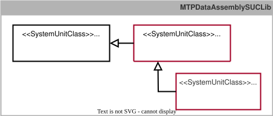

## 9.5 MTP Extension of the ProcessValueSet
This chapter specifies all identified extensions of the *ProcessValueSet* and integrates them into the existing MTP specification [MTP Specification Part 4](../98_References/README.md#mtp-specification-part-4).

### 9.5.1 Overview
#### Extension of the ProcessValueInputs
According to Section~[Prozesswerte](#sec:Prozesswerte), the interface definitions *SUC StructProcessValueIn* and *SUC ArrayProcessValueIn* are intended to specify process-value inputs for structured data types and array data types. As shown in [Figure 9.15](#figure-915-extension-of-the-processvalueset-for-implementing-structured-and-array-based-process-value-inputs), *SUC StructProcessValueIn* and *SUC ArrayProcessValueIn*, together with all other interface definitions for process-value inputs, are derived from the interface definition *SUC InputElement* according to [MTP Specification Part 4](../98_References/README.md#mtp-specification-part-4) and organized in *SUCL MTPDataAssemblySUCLib*. The detailed specification is provided in Appendix~[Interface Definitions](#subsec:AnhangProcessValueSetSchnittstellen). This extension, as a result of this work, has already been adopted into the profile *ModuleTypePackage:ProcessValueSet.ComplexTypes V2.0.0* of the MTP specification [MTP Specification Part 4](../98_References/README.md#mtp-specification-part-4).

##### Figure 9.15: Extension of the ProcessValueSet for Implementing Structured and Array-Based Process Value Inputs

#### Extension of the ProcessValueOutputs
According to Section~[Prozesswerte](#sec:Prozesswerte), interface definitions for process-value outputs of structured data types and array data types are to be specified. For process-value outputs of structured data types, the associated *IndicatorElement*, i.e. *SUC StructView*, can be used as for all other MTP data types according to [MTP Specification Part 4](../98_References/README.md#mtp-specification-part-4). For array-based process-value outputs, a separate interface definition *SUC ArrayProcessValueOut* is provided because, unlike *SUC ArrayView*, it does not require an *OSLevel* variable for access control. An *ArrayProcessValueOut* interface is always accessed by another LEA and not by an operator or LOL. Following the principles of the MTP concept, *SUC ArrayProcessValueOut* is derived from an abstract *SUC OutputElement*. *SUC OutputElement*, in turn, is derived from *SUC DataAssembly* specified in [MTP Specification Part 3](../98_References/README.md#mtp-specification-part-3). The newly introduced interface definitions are shown in [Figure 9.16](#figure-916-extension-of-the-processvalueset-for-implementing-structured-and-array-based-process-value-outputs) and organized in *SUCL MTPDataAssemblySUCLib*. The detailed specification is provided in Appendix~[Interface Definitions](#subsec:AnhangProcessValueSetSchnittstellen). This extension, as a result of this work, has already been adopted into the profile *ModuleTypePackage:ProcessValueSet.ComplexTypes V2.0.0* of the MTP specification [MTP Specification Part 4](../98_References/README.md#mtp-specification-part-4).

##### Figure 9.16: Extension of the ProcessValueSet for Implementing Structured and Array-Based Process Value Outputs

### 9.5.2 Interface Definitions
#### Specification of the System Unit Class StructProcessValueIn
*SUC StructProcessValueIn* ([Table 9.39](#table-939-interface-definition-of-suc-structprocessvaluein)) is used by an LEA to access the value of a variable with a structured data type from another LEA.

##### Table 9.39: Interface Definition of *SUC StructProcessValueIn*

<table>
	<tr><td colspan="6" align="left"><strong>▶ Module Type Package - DataAssembly Definition</strong></td></tr>
	<tr><th align="left">Name</th><td colspan="5" align="left"><strong>StructProcessValueIn</strong></td></tr>
	<tr><th align="left">Type</th><td colspan="5" align="left">System Unit Class (SUC)</td></tr>
	<tr><th align="left">Modifier</th><td colspan="5" align="left">-</td></tr>
	<tr><th align="left">Description</th><td colspan="5" align="left">generic interface for accessing a value of structured data type from another LEA</td></tr>
	<tr><th align="left">AutomationML Path</th><td colspan="5" align="left">MTPDataAssemblySUCLib/DataAssembly/InputElement/StructProcess-ValueIn</td></tr>
	<tr><th align="left">AutomationML BaseRef</th><td colspan="5" align="left">MTPDataAssemblySUCLib/DataAssembly/InputElement</td></tr>
	<tr><th align="left">Role Classes</th><td colspan="5" align="left">-</td></tr>
	<tr><th align="left">Version</th><td colspan="5" align="left">ModuleTypePackage:ProcessValueSet.ComplexTypes V2.0.0</td></tr>
	<tr><td colspan="6" align="left"><strong>📌 AutomationML Properties</strong></td></tr>
	<tr><th align="left">Name</th><th align="left">Type</th><th colspan="4" align="left">Description</th></tr>
	<tr><td align="left">-</td><td align="left">-</td><td colspan="4" align="left">-</td></tr>
	<tr><td colspan="6" align="left"><strong>📌 AutomationML Attributes</strong></td></tr>
	<tr><th align="left">Name</th><th align="left">Access</th><th align="left">Type</th><th align="left">Description</th><th align="left">Attribute-Type Reference</th><th align="left">Base Function</th></tr>
	<tr><td align="left">V</td><td align="left">LOL -> LEA</td><td align="left">{VType}</td><td align="left">Value</td><td align="left">-</td><td align="left">-</td></tr>
	<tr><td align="left">VType</td><td align="left">MTP</td><td align="left">&lt;empty&gt;</td><td align="left">Type Definition of the Value</td><td align="left">{AT of Structured-DataType}</td><td align="left">Complex-Type</td></tr>
	<tr><td colspan="6" align="left"><strong>📌 Comment</strong></td></tr>
	<tr><td colspan="6" align="left">-</td></tr>
	<tr><td colspan="6" align="left"><strong>📌 AutomationML Object - Instance Constraints</strong></td></tr>
	<tr><th align="left">Allowed Parents</th><td colspan="5" align="left">(no further constraints given)</td></tr>
	<tr><th align="left">Allowed Children</th><td colspan="5" align="left">(no further constraints given)</td></tr>
</table>

The required value is transferred in the variable *V* according to [MTP Specification Part 4](../98_References/README.md#mtp-specification-part-4). The distinctive feature of this interface definition is the use of a user-defined structured data type. The modeling and use of such a type have already been described in connection with *SUC StructView* and are applied in the same way for *SUC StructProcessValueIn*. This data type is then expected behind the variable *V*.

#### Specification of the System Unit Class ArrayProcessValueIn
*SUC ArrayProcessValueIn* ([Table 9.40](#table-940-interface-definition-of-suc-arrayprocessvaluein)) is used by an LEA to access a value at a specific position of an array in another LEA.

##### Table 9.40: Interface Definition of *SUC ArrayProcessValueIn*

<table>
	<tr><td colspan="6" align="left"><strong>▶ Module Type Package - DataAssembly Definition</strong></td></tr>
	<tr><th align="left">Name</th><td colspan="5" align="left"><strong>ArrayProcessValueIn</strong></td></tr>
	<tr><th align="left">Type</th><td colspan="5" align="left">System Unit Class (SUC)</td></tr>
	<tr><th align="left">Modifier</th><td colspan="5" align="left">-</td></tr>
	<tr><th align="left">Description</th><td colspan="5" align="left">generic interface for accessing a value of array data type from another PEA</td></tr>
	<tr><th align="left">AutomationML Path</th><td colspan="5" align="left">MTPDataAssemblySUCLib/DataAssembly/InputElement/ArrayProcess-ValueIn</td></tr>
	<tr><th align="left">AutomationML BaseRef</th><td colspan="5" align="left">MTPDataAssemblySUCLib/DataAssembly/InputElement</td></tr>
	<tr><th align="left">Role Classes</th><td colspan="5" align="left">-</td></tr>
	<tr><th align="left">Version</th><td colspan="5" align="left">ModuleTypePackage:ProcessValueSet.ComplexTypes V2.0.0</td></tr>
	<tr><td colspan="6" align="left"><strong>📌 AutomationML Properties</strong></td></tr>
	<tr><th align="left">Name</th><th align="left">Type</th><th colspan="4" align="left">Description</th></tr>
	<tr><td align="left">-</td><td align="left">-</td><td colspan="4" align="left">-</td></tr>
	<tr><td colspan="6" align="left"><strong>📌 AutomationML Attributes</strong></td></tr>
	<tr><th align="left">Name</th><th align="left">Access</th><th align="left">Type</th><th align="left">Description</th><th align="left">Attribute-Type Reference</th><th align="left">Base Function</th></tr>
	<tr><td align="left">IndexSel</td><td align="left">LOL <- LEA</td><td align="left">DINT</td><td align="left">Index Value</td><td align="left">-</td><td align="left">Multiplexing for Process Values</td></tr>
	<tr><td align="left">IndexMin</td><td align="left">LOL -> LEA</td><td align="left">DINT</td><td align="left">Low Limit of the Index</td><td align="left">-</td><td align="left">Multiplexing for Process Values</td></tr>
	<tr><td align="left">IndexMax</td><td align="left">LOL -> LEA</td><td align="left">DINT</td><td align="left">High Limit of the Index</td><td align="left">-</td><td align="left">Multiplexing for Process Values</td></tr>
	<tr><td align="left">IndexCur</td><td align="left">LOL -> LEA</td><td align="left">DINT</td><td align="left">Current Index Value</td><td align="left">-</td><td align="left">Multiplexing for Process Values</td></tr>
	<tr><td align="left">V</td><td align="left">LOL -> LEA</td><td align="left">{VType}</td><td align="left">Output Value</td><td align="left">-</td><td align="left">-</td></tr>
	<tr><td align="left">VType</td><td align="left">MTP</td><td align="left">a)</td><td align="left">Type Definition of the Values</td><td align="left">{AT of BaseDataType}</td><td align="left">Complex-Type</td></tr>
	<tr><td colspan="6" align="left"><strong>📌 Comment</strong></td></tr>
	<tr><td colspan="6" align="left">a) Type shall be &lt;empty&gt; in case of a StructuredDataType and shall be set to the defined type in case of a PrimitiveDataType.</td></tr>
	<tr><td colspan="6" align="left"><strong>📌 AutomationML Object - Instance Constraints</strong></td></tr>
	<tr><th align="left">Allowed Parents</th><td colspan="5" align="left">(no further constraints given)</td></tr>
	<tr><th align="left">Allowed Children</th><td colspan="5" align="left">(no further constraints given)</td></tr>
</table>

Ähnlich wie bei der *SUC ArrayView* besteht die Herausforderung bei dieser Schnittstelle darin, auf ein Array innerhalb einer LEA zuzugreifen, das eine beliebige Länge haben kann. Wie bei der *SUC ArrayView* soll der Zugriff auf dieses Array auch im Falle der *SUC ArrayProcessValueIn* indexbasiert erfolgen.

The array position to be displayed is selected via the variable *IndexSel*. The variables *IndexMin* and *IndexMax* specify the lower and upper limits of the array. The variable *IndexCur* specifies the currently selected index, and the value of the array at this position is displayed in *V*. *VType* defines the data type shared by all array elements. This may be a primitive data type or a structured data type.

**Note:** This interface definition differs from all other interfaces derived from the *InputElement* interface definition because it also includes information flows from the LEA to the LOL. This had not previously been envisaged.

#### Specification of the System Unit Class OutputElement
*SUC OutputElement* ([Table 9.41](#table-941-interface-definition-of-suc-outputelement)) is an abstract interface from which specific process-value outputs of different data types can be derived. The interface definition itself serves only an organizational purpose and provides a variable for transmitting a *Worst Quality Code (WQC)*.

##### Table 9.41: Interface Definition of *SUC OutputElement*

<table>
	<tr><td colspan="6" align="left"><strong>▶ Module Type Package - DataAssembly Definition</strong></td></tr>
	<tr><th align="left">Name</th><td colspan="5" align="left"><strong>OutputElement</strong></td></tr>
	<tr><th align="left">Type</th><td colspan="5" align="left">System Unit Class (SUC)</td></tr>
	<tr><th align="left">Modifier</th><td colspan="5" align="left">abstract</td></tr>
	<tr><th align="left">Description</th><td colspan="5" align="left">abstract interface from which specific process value outputs can be derived</td></tr>
	<tr><th align="left">AutomationML Path</th><td colspan="5" align="left">MTPDataAssemblySUCLib/DataAssembly/OutputElement</td></tr>
	<tr><th align="left">AutomationML BaseRef</th><td colspan="5" align="left">MTPDataAssemblySUCLib/DataAssembly</td></tr>
	<tr><th align="left">Role Classes</th><td colspan="5" align="left">-</td></tr>
	<tr><th align="left">Version</th><td colspan="5" align="left">ModuleTypePackage:ProcessValueSet.ComplexTypes V2.0.0</td></tr>
	<tr><td colspan="6" align="left"><strong>📌 AutomationML Properties</strong></td></tr>
	<tr><th align="left">Name</th><th align="left">Type</th><th colspan="4" align="left">Description</th></tr>
	<tr><td align="left">-</td><td align="left">-</td><td colspan="4" align="left">-</td></tr>
	<tr><td colspan="6" align="left"><strong>📌 AutomationML Attributes</strong></td></tr>
	<tr><th align="left">Name</th><th align="left">Access</th><th align="left">Type</th><th align="left">Description</th><th align="left">Attribute-Type Reference</th><th align="left">Base Function</th></tr>
	<tr><td align="left">WQC</td><td align="left">LOL <- LEA</td><td align="left">BYTE</td><td align="left">Worst Quality Code variable</td><td align="left">-</td><td align="left">WQC</td></tr>
	<tr><td colspan="6" align="left"><strong>📌 Comment</strong></td></tr>
	<tr><td colspan="6" align="left">-</td></tr>
	<tr><td colspan="6" align="left"><strong>📌 AutomationML Object - Instance Constraints</strong></td></tr>
	<tr><th align="left">Allowed Parents</th><td colspan="5" align="left">(no further constraints given)</td></tr>
	<tr><th align="left">Allowed Children</th><td colspan="5" align="left">(no further constraints given)</td></tr>
</table>

**Note:** For greater clarity in modeling and with regard to possible future developments, MTP standardization should consider explicitly modeling *ProcessValueOutputs* of all MTP data types, including structured data types, and also deriving them from the newly specified *OutputElement*.

#### Specification of the System Unit Class ArrayProcessValueOut
*SUC ArrayProcessValueOut* ([Table 9.42](#table-942-interface-definition-of-suc-arrayprocessvalueout)) is used by an LEA to provide the values of an LEA-internal array to another LEA.

##### Table 9.42: Interface Definition of *SUC ArrayProcessValueOut*

<table>
	<tr><td colspan="6" align="left"><strong>▶ Module Type Package - DataAssembly Definition</strong></td></tr>
	<tr><th align="left">Name</th><td colspan="5" align="left"><strong>ArrayProcessValueOut</strong></td></tr>
	<tr><th align="left">Type</th><td colspan="5" align="left">System Unit Class (SUC)</td></tr>
	<tr><th align="left">Modifier</th><td colspan="5" align="left">-</td></tr>
	<tr><th align="left">Description</th><td colspan="5" align="left">generic interface for making available a value of array data type to another LEA</td></tr>
	<tr><th align="left">AutomationML Path</th><td colspan="5" align="left">MTPDataAssemblySUCLib/DataAssembly/OutputElement/ArrayProcessValueOut</td></tr>
	<tr><th align="left">AutomationML BaseRef</th><td colspan="5" align="left">MTPDataAssemblySUCLib/DataAssembly/OutputElement</td></tr>
	<tr><th align="left">Role Classes</th><td colspan="5" align="left">-</td></tr>
	<tr><th align="left">Version</th><td colspan="5" align="left">ModuleTypePackage:ProcessValueSet.ComplexTypes V2.0.0</td></tr>
	<tr><td colspan="6" align="left"><strong>📌 AutomationML Properties</strong></td></tr>
	<tr><th align="left">Name</th><th align="left">Type</th><th colspan="4" align="left">Description</th></tr>
	<tr><td align="left">-</td><td align="left">-</td><td colspan="4" align="left">-</td></tr>
	<tr><td colspan="6" align="left"><strong>📌 AutomationML Attributes</strong></td></tr>
	<tr><th align="left">Name</th><th align="left">Access</th><th align="left">Type</th><th align="left">Description</th><th align="left">Attribute-Type Reference</th><th align="left">Base Function</th></tr>
	<tr><td align="left">IndexSel</td><td align="left">LOL -> LEA</td><td align="left">DINT</td><td align="left">Index Value</td><td align="left">-</td><td align="left">Multiplexing for Process Values</td></tr>
	<tr><td align="left">IndexMin</td><td align="left">LOL <- LEA</td><td align="left">DINT</td><td align="left">Low Limit of the Index</td><td align="left">-</td><td align="left">Multiplexing for Process Values</td></tr>
	<tr><td align="left">IndexMax</td><td align="left">LOL <- LEA</td><td align="left">DINT</td><td align="left">High Limit of the Index</td><td align="left">-</td><td align="left">Multiplexing for Process Values</td></tr>
	<tr><td align="left">IndexCur</td><td align="left">LOL <- LEA</td><td align="left">DINT</td><td align="left">Current Index Value</td><td align="left">-</td><td align="left">Multiplexing for Process Values</td></tr>
	<tr><td align="left">V</td><td align="left">LOL <- LEA</td><td align="left">{VType}</td><td align="left">Output Value</td><td align="left">-</td><td align="left">-</td></tr>
	<tr><td align="left">VType</td><td align="left">MTP</td><td align="left">a)</td><td align="left">Type Definition of the Values</td><td align="left">{AT of BaseDataType}</td><td align="left">Complex-Type</td></tr>
	<tr><td colspan="6" align="left"><strong>📌 Comment</strong></td></tr>
	<tr><td colspan="6" align="left">a) Type shall be &lt;empty&gt; in case of a StructuredDataType and shall be set to the defined type in case of a PrimitiveDataType.</td></tr>
	<tr><td colspan="6" align="left"><strong>📌 AutomationML Object - Instance Constraints</strong></td></tr>
	<tr><th align="left">Allowed Parents</th><td colspan="5" align="left">(no further constraints given)</td></tr>
	<tr><th align="left">Allowed Children</th><td colspan="5" align="left">(no further constraints given)</td></tr>
</table>

The interface definition *SUC ArrayProcessValueOut* corresponds to the interface definition *SUC ArrayView*. The only difference is that *SUC ArrayProcessValueOut* does not contain an *OSLevel* variable because it is always controlled by another LEA.
