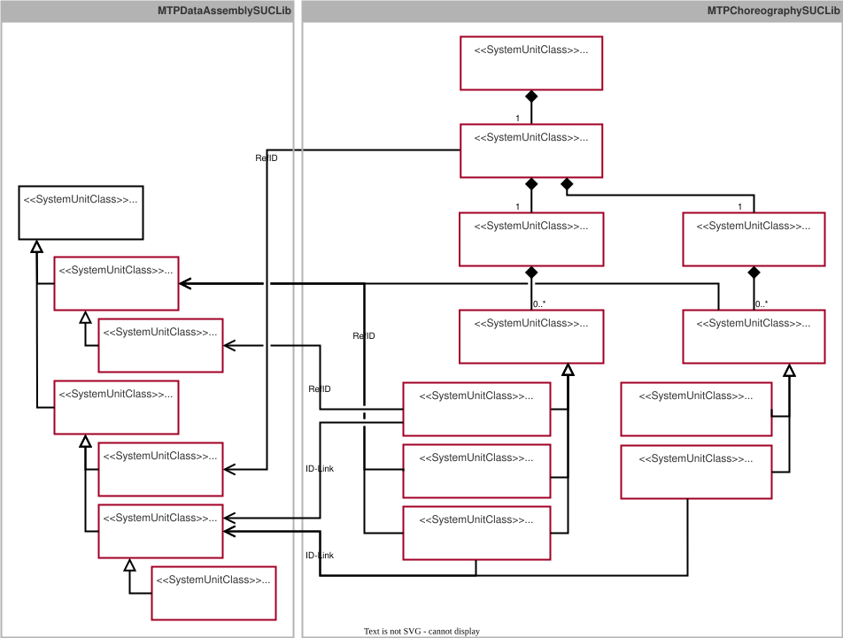

## 9.7 MTP Specification of the ChoreographySet
This chapter specifies the *ChoreographySet* as a new aspect of the MTP specification that contains all elements identified in the conceptual chapter~[Art2 LL](#chap:Art2LL).
 
### 9.7.1 Overview
According to Chapter~[Art2 LL](#chap:Art2LL), a series of new model and DataAssembly definitions is required to represent choreography-relevant information in the MTP of a LEA. [Figure 9.18](#figure-918-specification-of-the-choreographyset-for-implementing-choreography-based-logistics-lines) provides an overview of these newly specified definitions.

##### Figure 9.18: Specification of the ChoreographySet for Implementing Choreography-Based Logistics Lines

#### DataAssembly definitions
On the dataassembly-definition side, *SUC ChoreographyParticipantManager* is introduced as an interface for configuring configurable logic, and *SUC CommunicationManager* is introduced as an interface for configurable communication. *SUC CommunicationManager* is an abstract DataAssembly definition that fundamentally allows the use of different communication technologies through different derivations. For implementation based on OPC~UA client/server, the derived *SUC OpcUaClientServerManager* is introduced. A convention in the MTP specifications provides that DataAssembly definitions belonging together in terms of content are derived from a common DataAssembly definition with the suffix **Element*. Accordingly, in this case *SUC ChoreographyElement*, derived from *SUC DataAssembly* [MTP Specification Part 3](../98_References/README.md#mtp-specification-part-3), is introduced, from which *SUC ChoreographyParticipantManager* and *SUC CommunicationManager* are derived.

For individual values exchanged and processed within a choreography, *SUC UnionElement*, derived from *SUC DataAssembly* [MTP Specification Part 1](../98_References/README.md#mtp-specification-part-1), is introduced according to Section~[Union Type](#subsec:UnionType) to display a value with configurable data type. For the communication variant of active writing, *SUC WritableUnionElements*, derived from *SUC UnionElement*, is additionally provided[^1] and enables write access to a value with configurable data type. 

These DataAssembly definitions are organized in *SUCL MTPDataAssemblySUCLib*. The detailed specification is provided in Appendix~[DataAssembly definitions](#subsec:AnhangChoreographySetSchnittstellen). 

#### Model Definitions
On the model-definition side, *SUC ChoreographySet* is introduced as a new aspect set for organizing all choreography-related models and is derived from the abstract *SUC MTPSet* according to [MTP Specification Part 1](../98_References/README.md#mtp-specification-part-1). The *ChoreographySet* always contains exactly one IE of *SUC ChoreographyParticipant*, derived from *SUC LinkedObject* [MTP Specification Part 1](../98_References/README.md#mtp-specification-part-1). It indicates that a LEA has the capability to participate in a choreography and is linked to a *ChoreographyParticipantManager* interface. The input list and output list of the choreography participant are represented by the subordinate *SUC InputList* and *SUC OutputList*. These lists can contain any number of IEs of *SUC InputElemente* and *SUC OutputElement*. They are derived from *SUC LinkedObject* and represent incoming or outgoing system variables. According to Section~[Choreo Konfiguration](#subsec:ChoreoKonfiguration), the classes *SUC FixedInputElement*, *SUC ConfigurableInputElement*, *SUC WritableInputElement*, *SUC FixedOutputElement*, and *SUC ConfigurableOutputElement* are provided as concrete derivations of *SUC InputElemente* and *SUC OutputElement*. Almost all *InputElements* and *OutputElements* are linked to a *UnionElement* interface via LinkedObject relations. An exception is formed by *WritableInputElements*, each of which is assigned to a *WritableUnionElement* interface. In the case of *ConfigurableInputElements* and *ConfigurableOutpuElements*, an ID link relation to a *CommunicationManager* interface also exists, which handles value transfer in the sense of configurable communication. The model definitions are organized in the newly introduced library *SUCL MTPChoreographySUCLib*. The detailed specification is provided in Appendix~[Model Definitions](#subsec:AnhangChoreographySetModelle).

All model and DataAssembly definitions required for the *ChoreographySet* are assigned to the new profile *ModuleTypePackage:ChoreographySet.Base V2.0.0*.[^2]

### 9.7.2 DataAssembly definitions
#### Specification of the System Unit Class UnionElement
*SUC UnionElement* ([Table 9.43](#table-943-dataassembly-definition-of-suc-unionelement)) is used to display the value of an *InputElement* or an *OutputElement*. Accordingly, a *UnionElement* interface is assigned to these model definitions via a LinkedObject relation.

##### Table 9.43: DataAssembly definition of *SUC UnionElement*

<table>
	<tr><td colspan="6" align="left"><strong>▶ Module Type Package - DataAssembly Definition</strong></td></tr>
	<tr><th align="left">Name</th><td colspan="5" align="left"><strong>UnionElement</strong></td></tr>
	<tr><th align="left">Type</th><td colspan="5" align="left">System Unit Class (SUC)</td></tr>
	<tr><th align="left">Modifier</th><td colspan="5" align="left">-a)</td></tr>
	<tr><th align="left">Description</th><td colspan="5" align="left">interface for displaying a value with datatype defined at runtime</td></tr>
	<tr><th align="left">AutomationML Path</th><td colspan="5" align="left">MTPDataAssemblySUCLib/DataAssembly/UnionElement</td></tr>
	<tr><th align="left">AutomationML BaseRef</th><td colspan="5" align="left">MTPDataAssemblySUCLib/DataAssembly</td></tr>
	<tr><th align="left">Role Classes</th><td colspan="5" align="left">-</td></tr>
	<tr><th align="left">Version</th><td colspan="5" align="left">ModuleTypePackage:ChoreographySet.Base V2.0.0</td></tr>
	<tr><td colspan="6" align="left"><strong>📌 AutomationML Properties</strong></td></tr>
	<tr><th align="left">Name</th><th align="left">Type</th><th colspan="4" align="left">Description</th></tr>
	<tr><td align="left">-</td><td align="left">-</td><td colspan="4" align="left">-</td></tr>
	<tr><td colspan="6" align="left"><strong>📌 AutomationML Attributes</strong></td></tr>
	<tr><th align="left">Name</th><th align="left">Access</th><th align="left">Type</th><th align="left">Description</th><th align="left">Attribute-Type Reference</th><th align="left">Base Function</th></tr>
	<tr><td align="left">VQC</td><td align="left">LOL ⟵ LEA</td><td align="left">BYTE</td><td align="left">quality Code of the value</td><td align="left">-</td><td align="left">-</td></tr>
	<tr><td align="left">DataType</td><td align="left">LOL ⟵ LEA</td><td align="left">BYTE</td><td align="left">identifier of selected data type (0 : None, 1: VReal, 2: VDInt, 3: VDWord, 4: VBool, 5: VString)</td><td align="left">-</td><td align="left">-</td></tr>
	<tr><td align="left">VReal</td><td align="left">LOL ⟵ LEA</td><td align="left">REAL</td><td align="left">Real Value (Type: 1)</td><td align="left">-</td><td align="left">-</td></tr>
	<tr><td align="left">VDInt</td><td align="left">LOL ⟵ LEA</td><td align="left">DINT</td><td align="left">Double Integer Value (Type: 2)</td><td align="left">-</td><td align="left">-</td></tr>
	<tr><td align="left">VDWord</td><td align="left">LOL ⟵ LEA</td><td align="left">DWORD</td><td align="left">Double Word Value (Type: 3)</td><td align="left">-</td><td align="left">-</td></tr>
	<tr><td align="left">VBool</td><td align="left">LOL ⟵ LEA</td><td align="left">BOOL</td><td align="left">Boolean Value (Type: 4)</td><td align="left">-</td><td align="left">-</td></tr>
	<tr><td align="left">VString</td><td align="left">LOL ⟵ LEA</td><td align="left">STRING</td><td align="left">String Value (Type: 5)</td><td align="left">-</td><td align="left">-</td></tr>
	<tr><td colspan="6" align="left"><strong>📌 Comment</strong></td></tr>
	<tr><td colspan="6" align="left">a) Bei der <em>SUC UnionElement</em> könnten zukünftig noch andere Datentypen ergänzt werden. Alle weiteren Schnittstellen, die die <em>SUC UnionElement</em> nutzen, sollte folglich auch Erweiterungen erlauben und nicht <em>sealed</em> sein.</td></tr>
	<tr><td colspan="6" align="left"><strong>📌 AutomationML Object - Instance Constraints</strong></td></tr>
	<tr><th align="left">Allowed Parents</th><td colspan="5" align="left">(no further constraints given)</td></tr>
	<tr><th align="left">Allowed Children</th><td colspan="5" align="left">(no further constraints given)</td></tr>
</table>

The variables *VReal*, *VDInt*, *VDWord*, *VBool*, and *VString * are used to display the desired value. The variable *DataType* indicates which data type is currently active and which of the previously mentioned variables is therefore to be interpreted. *UnionElement* can thus display only one value of one defined data type at a time. *VQC* provides information about the quality and trustworthiness of the displayed value.

#### Specification of the System Unit Class WritableUnionElement
*SUC WritableUnionElement* ([Table 9.44](#table-944-dataassembly-definition-of-suc-writableunionElement)) is derived from *UnionElement* and is used to write a value into a *WritableInputElement*. Accordingly, a *WritableUnionElement* interface is always assigned to a *WritableInputElement* via a LinkedObject relation. 

##### Table 9.44: DataAssembly definition of *SUC WritableUnionElement*

<table>
	<tr><td colspan="6" align="left"><strong>▶ Module Type Package - DataAssembly Definition</strong></td></tr>
	<tr><th align="left">Name</th><td colspan="5" align="left"><strong>WritableUnionElement</strong></td></tr>
	<tr><th align="left">Type</th><td colspan="5" align="left">System Unit Class (SUC)</td></tr>
	<tr><th align="left">Modifier</th><td colspan="5" align="left">-</td></tr>
	<tr><th align="left">Description</th><td colspan="5" align="left">interface for writing a value with datatype defined at runtime</td></tr>
	<tr><th align="left">AutomationML Path</th><td colspan="5" align="left">MTPDataAssemblySUCLib/DataAssembly/UnionElement/WritableUnionElement</td></tr>
	<tr><th align="left">AutomationML BaseRef</th><td colspan="5" align="left">MTPDataAssemblySUCLib/DataAssembly/UnionElement</td></tr>
	<tr><th align="left">Role Classes</th><td colspan="5" align="left">-</td></tr>
	<tr><th align="left">Version</th><td colspan="5" align="left">ModuleTypePackage:ChoreographySet.Base V2.0.0</td></tr>
	<tr><td colspan="6" align="left"><strong>📌 AutomationML Properties</strong></td></tr>
	<tr><th align="left">Name</th><th align="left">Type</th><th colspan="4" align="left">Description</th></tr>
	<tr><td align="left">-</td><td align="left">-</td><td colspan="4" align="left">-</td></tr>
	<tr><td colspan="6" align="left"><strong>📌 AutomationML Attributes</strong></td></tr>
	<tr><th align="left">Name</th><th align="left">Access</th><th align="left">Type</th><th align="left">Description</th><th align="left">Attribute-Type Reference</th><th align="left">Base Function</th></tr>
	<tr><td align="left">VQC</td><td align="left">LOL ⟶ LEA</td><td align="left">BYTE</td><td align="left">quality Code of the value</td><td align="left">-</td><td align="left">-</td></tr>
	<tr><td align="left">DataType</td><td align="left">LOL ⟶ LEA</td><td align="left">BYTE</td><td align="left">identifier of selected data type (0 : None, 1: VReal, 2: VDInt, 3: VDWord, 4: VBool, 5: VString)</td><td align="left">-</td><td align="left">-</td></tr>
	<tr><td align="left">VReal</td><td align="left">LOL ⟶ LEA</td><td align="left">REAL</td><td align="left">Real Value (Type: 1)</td><td align="left">-</td><td align="left">-</td></tr>
	<tr><td align="left">VDInt</td><td align="left">LOL ⟶ LEA</td><td align="left">DINT</td><td align="left">Double Integer Value (Type: 2)</td><td align="left">-</td><td align="left">-</td></tr>
	<tr><td align="left">VDWord</td><td align="left">LOL ⟶ LEA</td><td align="left">DWORD</td><td align="left">Double Word Value (Type: 3)</td><td align="left">-</td><td align="left">-</td></tr>
	<tr><td align="left">VBool</td><td align="left">LOL ⟶ LEA</td><td align="left">BOOL</td><td align="left">Boolean Value (Type: 4)</td><td align="left">-</td><td align="left">-</td></tr>
	<tr><td align="left">VString</td><td align="left">LOL ⟶ LEA</td><td align="left">STRING</td><td align="left">String Value (Type: 5)</td><td align="left">-</td><td align="left">-</td></tr>
	<tr><td colspan="6" align="left"><strong>📌 Comment</strong></td></tr>
	<tr><td colspan="6" align="left">-</td></tr>
	<tr><td colspan="6" align="left"><strong>📌 AutomationML Object - Instance Constraints</strong></td></tr>
	<tr><th align="left">Allowed Parents</th><td colspan="5" align="left">(no further constraints given)</td></tr>
	<tr><th align="left">Allowed Children</th><td colspan="5" align="left">(no further constraints given)</td></tr>
</table>

The variables *VReal*, *VDInt*, *VDWord*, *VBool*, and *VString* are used to enter the desired value. The variable *DataType* indicates which data type is currently active and which of the previously mentioned variables is to be used in the LEA program. *WritableUnionElement* thus accepts only one value of one defined data type at a time. *VQC* can be used to transmit information about the quality and trustworthiness of the entered value.

#### Specification of the System Unit Class ChoreographyElement
*SUC ChoreographyElement* ([Table 9.45](#table-945-dataassembly-definition-of-suc-choreographyelement)) is an abstract class derived from *SUC DataAssembly* specified in [MTP Specification Part 3](../98_References/README.md#mtp-specification-part-3). The choreography-relevant DataAssembly definitions *ChoreographyParticipantManager* and *CommunicationManager* are derived from *ChoreographyElement*.

##### Table 9.45: DataAssembly definition of *SUC ChoreographyElement*

<table>
	<tr><td colspan="6" align="left"><strong>▶ Module Type Package - DataAssembly Definition</strong></td></tr>
	<tr><th align="left">Name</th><td colspan="5" align="left"><strong>ChoreographyElement</strong></td></tr>
	<tr><th align="left">Type</th><td colspan="5" align="left">System Unit Class (SUC)</td></tr>
	<tr><th align="left">Modifier</th><td colspan="5" align="left">abstract</td></tr>
	<tr><th align="left">Description</th><td colspan="5" align="left">root interface class for choreography-related DataAssembly definitions</td></tr>
	<tr><th align="left">AutomationML Path</th><td colspan="5" align="left">MTPDataAssemblySUCLib/DataAssembly/ChoreographyElement</td></tr>
	<tr><th align="left">AutomationML BaseRef</th><td colspan="5" align="left">MTPDataAssemblySUCLib/DataAssembly</td></tr>
	<tr><th align="left">Role Classes</th><td colspan="5" align="left">-</td></tr>
	<tr><th align="left">Version</th><td colspan="5" align="left">ModuleTypePackage:ChoreographySet.Base V2.0.0</td></tr>
	<tr><td colspan="6" align="left"><strong>📌 AutomationML Properties</strong></td></tr>
	<tr><th align="left">Name</th><th align="left">Type</th><th colspan="4" align="left">Description</th></tr>
	<tr><td align="left">-</td><td align="left">-</td><td colspan="4" align="left">-</td></tr>
	<tr><td colspan="6" align="left"><strong>📌 AutomationML Attributes</strong></td></tr>
	<tr><th align="left">Name</th><th align="left">Access</th><th align="left">Type</th><th align="left">Description</th><th align="left">Attribute-Type Reference</th><th align="left">Base Function</th></tr>
	<tr><td align="left">WQC</td><td align="left">LOL ⟵ LEA</td><td align="left">BYTE</td><td align="left">Worst Quality Code</td><td align="left">-</td><td align="left">WQC</td></tr>
	<tr><td colspan="6" align="left"><strong>📌 Comment</strong></td></tr>
	<tr><td colspan="6" align="left">-</td></tr>
	<tr><td colspan="6" align="left"><strong>📌 AutomationML Object - Instance Constraints</strong></td></tr>
	<tr><th align="left">Allowed Parents</th><td colspan="5" align="left">(no further constraints given)</td></tr>
	<tr><th align="left">Allowed Children</th><td colspan="5" align="left">(no further constraints given)</td></tr>
</table>

#### Specification of the System Unit Class ChoreographyParticipantManager
*SUC ChoreographyParticipantManager* ([Table 9.46](#table-946-dataassembly-definition-of-suc-choreographyparticipantmanager)) is derived from *SUC ChoreographyElement* and is used to configure the configurable logic of a choreography participant. In addition, it provides information for type, version, and instance verification of choreographed logistics lines, see also Appendix~[Workflows](#subsec:AnhangManifestWorkflows). This DataAssembly definition is assigned to an *SUC ChoreographyParticipant* in the *ChoreographySet* via a LinkedObject relation.

##### Table 9.46: DataAssembly definition of *SUC ChoreographyParticipantManager*

<table>
	<tr><td colspan="6" align="left"><strong>▶ Module Type Package - DataAssembly Definition</strong></td></tr>
	<tr><th align="left">Name</th><td colspan="5" align="left"><strong>ChoreographyParticipantManager</strong></td></tr>
	<tr><th align="left">Type</th><td colspan="5" align="left">System Unit Class (SUC)</td></tr>
	<tr><th align="left">Modifier</th><td colspan="5" align="left">-</td></tr>
	<tr><th align="left">Description</th><td colspan="5" align="left">configuration interface for a choreography participant</td></tr>
	<tr><th align="left">AutomationML Path</th><td colspan="5" align="left">MTPDataAssemblySUCLib/DataAssembly/ChoreographyElement/ChoreographyParticipantManager</td></tr>
	<tr><th align="left">AutomationML BaseRef</th><td colspan="5" align="left">MTPDataAssemblySUCLib/DataAssembly/ChoreographyElement</td></tr>
	<tr><th align="left">Role Classes</th><td colspan="5" align="left">-</td></tr>
	<tr><th align="left">Version</th><td colspan="5" align="left">ModuleTypePackage:ChoreographySet.Base V2.0.0</td></tr>
	<tr><td colspan="6" align="left"><strong>📌 AutomationML Properties</strong></td></tr>
	<tr><th align="left">Name</th><th align="left">Type</th><th colspan="4" align="left">Description</th></tr>
	<tr><td align="left">-</td><td align="left">-</td><td colspan="4" align="left">-</td></tr>
	<tr><td colspan="6" align="left"><strong>📌 AutomationML Attributes</strong></td></tr>
	<tr><th align="left">Name</th><th align="left">Access</th><th align="left">Type</th><th align="left">Description</th><th align="left">Attribute-Type Reference</th><th align="left">Base Function</th></tr>
	<tr><td align="left">ComposedTypeCode</td><td align="left">LOL ⟶ LEA</td><td align="left">STRING</td><td align="left">identifier of the choreography type</td><td align="left">-</td><td align="left">-</td></tr>
	<tr><td align="left">ComposedTypeRevision</td><td align="left">LOL ⟶ LEA</td><td align="left">STRING</td><td align="left">version of the choreography type</td><td align="left">-</td><td align="left">-</td></tr>
	<tr><td align="left">RoleIdent</td><td align="left">LOL ⟶ LEA</td><td align="left">STRING</td><td align="left">identifier of the participant role within the choreography</td><td align="left">-</td><td align="left">-</td></tr>
	<tr><td align="left">ViewSel</td><td align="left">LOL ⟶ LEA</td><td align="left">BOOL</td><td align="left">selection to view prepared configuration (false) or active configuration (true)</td><td align="left">-</td><td align="left">-</td></tr>
	<tr><td align="left">ViewCur</td><td align="left">LOL ⟵ LEA</td><td align="left">BOOL</td><td align="left">currently selected view: false = prepared, true = active</td><td align="left">-</td><td align="left">-</td></tr>
	<tr><td align="left">RestoreDefaultEn</td><td align="left">LOL ⟵ LEA</td><td align="left">BOOL</td><td align="left">enable flag to restore default configuration</td><td align="left">-</td><td align="left">-</td></tr>
	<tr><td align="left">RestoreDefault</td><td align="left">LOL ⟶ LEA</td><td align="left">BOOL</td><td align="left">restores the default config of all inputs, logics, and outputs</td><td align="left">-</td><td align="left">-</td></tr>
	<tr><td align="left">ExecuteEn</td><td align="left">LOL ⟵ LEA</td><td align="left">BOOL</td><td align="left">enable flag to execute the configurable logic</td><td align="left">-</td><td align="left">-</td></tr>
	<tr><td align="left">ExecuteOn</td><td align="left">LOL ⟶ LEA</td><td align="left">BOOL</td><td align="left">trigger to apply the current configuration and start the execution</td><td align="left">-</td><td align="left">-</td></tr>
	<tr><td align="left">ExecuteOff</td><td align="left">LOL ⟶ LEA</td><td align="left">BOOL</td><td align="left">trigger to quit the execution, outputs are set to default value</td><td align="left">-</td><td align="left">-</td></tr>
	<tr><td align="left">ExecuteAct</td><td align="left">LOL ⟵ LEA</td><td align="left">BOOL</td><td align="left">flag which indicates the active execution</td><td align="left">-</td><td align="left">-</td></tr>
	<tr><td align="left">ExecuteErr</td><td align="left">LOL ⟵ LEA</td><td align="left">BOOL</td><td align="left">flag which indicates min. one processing error</td><td align="left">-</td><td align="left">-</td></tr>
	<tr><td align="left">InputCnt</td><td align="left">LOL ⟵ LEA</td><td align="left">UINT</td><td align="left">number of input configurations (maximum index of input configurations = InputCnt-1)</td><td align="left">-</td><td align="left">-</td></tr>
	<tr><td align="left">InputIndexSel</td><td align="left">LOL ⟶ LEA</td><td align="left">UINT</td><td align="left">index of the desired input configuration to be shown</td><td align="left">-</td><td align="left">-</td></tr>
	<tr><td align="left">InputIndexCur</td><td align="left">LOL ⟵ LEA</td><td align="left">UINT</td><td align="left">index of the currently selected input configuration</td><td align="left">-</td><td align="left">-</td></tr>
	<tr><td align="left">Input_VQC</td><td align="left">LOL ⟵ LEA</td><td align="left">BYTE</td><td align="left">value quality code of the currently selected input</td><td align="left">-</td><td align="left">-</td></tr>
	<tr><td align="left">Input_DataType</td><td align="left">LOL ⟵ LEA</td><td align="left">BYTE</td><td align="left">data type of the currently selected input</td><td align="left">-</td><td align="left">-</td></tr>
	<tr><td align="left">Input_VReal</td><td align="left">LOL ⟵ LEA</td><td align="left">REAL</td><td align="left">real value of the currently selected input</td><td align="left">-</td><td align="left">-</td></tr>
	<tr><td align="left">Input_VDInt</td><td align="left">LOL ⟵ LEA</td><td align="left">DINT</td><td align="left">double Integer value of the currently selected input</td><td align="left">-</td><td align="left">-</td></tr>
	<tr><td align="left">Input_VDWord</td><td align="left">LOL ⟵ LEA</td><td align="left">DWORD</td><td align="left">double Word value of the currently selected input</td><td align="left">-</td><td align="left">-</td></tr>
	<tr><td align="left">Input_VBool</td><td align="left">LOL ⟵ LEA</td><td align="left">BOOL</td><td align="left">boolean value of the currently selected input</td><td align="left">-</td><td align="left">-</td></tr>
	<tr><td align="left">Input_VString</td><td align="left">LOL ⟵ LEA</td><td align="left">STRING</td><td align="left">string value of the currently selected input</td><td align="left">-</td><td align="left">-</td></tr>
	<tr><td align="left">LogicCnt</td><td align="left">LOL ⟵ LEA</td><td align="left">UINT</td><td align="left">number of logic configurations (maximum index of logic configurations = LogicCnt-1)</td><td align="left">-</td><td align="left">-</td></tr>
	<tr><td align="left">LogicIndexSel</td><td align="left">LOL ⟶ LEA</td><td align="left">UINT</td><td align="left">index of the desired logic configuration to be shown</td><td align="left">-</td><td align="left">-</td></tr>
	<tr><td align="left">LogicIndexCur</td><td align="left">LOL ⟵ LEA</td><td align="left">UINT</td><td align="left">index of the currently selected logic configuration</td><td align="left">-</td><td align="left">-</td></tr>
	<tr><td align="left">Logic_FuncTypeSel</td><td align="left">LOL ⟶ LEA</td><td align="left">UINT</td><td align="left">function type selector of the currently selected logic element</td><td align="left">-</td><td align="left">-</td></tr>
	<tr><td align="left">Logic_In0_Source</td><td align="left">LOL ⟶ LEA</td><td align="left">SINT</td><td align="left">source of input 0 of the currently selected logic element</td><td align="left">-</td><td align="left">-</td></tr>
	<tr><td align="left">Logic_In0_Index</td><td align="left">LOL ⟶ LEA</td><td align="left">UINT</td><td align="left">index of input 0 of the currently selected logic element</td><td align="left">-</td><td align="left">-</td></tr>
	<tr><td align="left">Logic_In0_Const_VQC</td><td align="left">LOL ⟶ LEA</td><td align="left">BYTE</td><td align="left">constant value quality code of input 0 of the currently selected logic element</td><td align="left">-</td><td align="left">-</td></tr>
	<tr><td align="left">Logic_In0_Const_DataTypeSel</td><td align="left">LOL ⟶ LEA</td><td align="left">BYTE</td><td align="left">constant data type of input 0 of the currently selected logic element</td><td align="left">-</td><td align="left">-</td></tr>
	<tr><td align="left">Logic_In0_Const_VReal</td><td align="left">LOL ⟶ LEA</td><td align="left">REAL</td><td align="left">constant Real value of input 0 of the currently selected logic element</td><td align="left">-</td><td align="left">-</td></tr>
	<tr><td align="left">Logic_In0_Const_VDInt</td><td align="left">LOL ⟶ LEA</td><td align="left">DINT</td><td align="left">constant Double Integer value of input 0 of the currently selected logic element</td><td align="left">-</td><td align="left">-</td></tr>
	<tr><td align="left">Logic_In0_Const_VDWord</td><td align="left">LOL ⟶ LEA</td><td align="left">DWORD</td><td align="left">constant double word value of input 0 of the currently selected logic element</td><td align="left">-</td><td align="left">-</td></tr>
	<tr><td align="left">Logic_In0_Const_VBool</td><td align="left">LOL ⟶ LEA</td><td align="left">BOOL</td><td align="left">constant boolean value of input 0 of the currently selected logic element</td><td align="left">-</td><td align="left">-</td></tr>
	<tr><td align="left">Logic_In0_Const_VString</td><td align="left">LOL ⟶ LEA</td><td align="left">STRING</td><td align="left">constant String value of input 0 of the currently selected logic element</td><td align="left">-</td><td align="left">-</td></tr>
	<tr><td align="left">Logic_In1_Source</td><td align="left">LOL ⟶ LEA</td><td align="left">SINT</td><td align="left">source of input 1 of the currently selected logic element</td><td align="left">-</td><td align="left">-</td></tr>
	<tr><td align="left">Logic_In1_Index</td><td align="left">LOL ⟶ LEA</td><td align="left">UINT</td><td align="left">index of input 1 of the currently selected logic element</td><td align="left">-</td><td align="left">-</td></tr>
	<tr><td align="left">Logic_In1_Const_VQC</td><td align="left">LOL ⟶ LEA</td><td align="left">BYTE</td><td align="left">constant value quality code of input 1 of the currently selected logic element</td><td align="left">-</td><td align="left">-</td></tr>
	<tr><td align="left">Logic_In1_Const_DataTypeSel</td><td align="left">LOL ⟶ LEA</td><td align="left">BYTE</td><td align="left">constant data type of input 1 of the currently selected logic element</td><td align="left">-</td><td align="left">-</td></tr>
	<tr><td align="left">Logic_In1_Const_VReal</td><td align="left">LOL ⟶ LEA</td><td align="left">REAL</td><td align="left">constant Real value of input 1 of the currently selected logic element</td><td align="left">-</td><td align="left">-</td></tr>
	<tr><td align="left">Logic_In1_Const_VDInt</td><td align="left">LOL ⟶ LEA</td><td align="left">DINT</td><td align="left">constant Double Integer value of input 1 of the currently selected logic element</td><td align="left">-</td><td align="left">-</td></tr>
	<tr><td align="left">Logic_In1_Const_VDWord</td><td align="left">LOL ⟶ LEA</td><td align="left">DWORD</td><td align="left">constant double word value of input 1 of the currently selected logic element</td><td align="left">-</td><td align="left">-</td></tr>
	<tr><td align="left">Logic_In1_Const_VBool</td><td align="left">LOL ⟶ LEA</td><td align="left">BOOL</td><td align="left">constant boolean value of input 1 of the currently selected logic element</td><td align="left">-</td><td align="left">-</td></tr>
	<tr><td align="left">Logic_In1_Const_VString</td><td align="left">LOL ⟶ LEA</td><td align="left">STRING</td><td align="left">constant String value of input 1 of the currently selected logic element</td><td align="left">-</td><td align="left">-</td></tr>
	<tr><td align="left">Logic_In2_Source</td><td align="left">LOL ⟶ LEA</td><td align="left">SINT</td><td align="left">source of input 2 of the currently selected logic element</td><td align="left">-</td><td align="left">-</td></tr>
	<tr><td align="left">Logic_In2_Index</td><td align="left">LOL ⟶ LEA</td><td align="left">UINT</td><td align="left">index of input 2 of the currently selected logic element</td><td align="left">-</td><td align="left">-</td></tr>
	<tr><td align="left">Logic_In2_Const_VQC</td><td align="left">LOL ⟶ LEA</td><td align="left">BYTE</td><td align="left">constant value quality code of input 2 of the currently selected logic element</td><td align="left">-</td><td align="left">-</td></tr>
	<tr><td align="left">Logic_In2_Const_DataTypeSel</td><td align="left">LOL ⟶ LEA</td><td align="left">BYTE</td><td align="left">constant data type of input 2 of the currently selected logic element</td><td align="left">-</td><td align="left">-</td></tr>
	<tr><td align="left">Logic_In2_Const_VReal</td><td align="left">LOL ⟶ LEA</td><td align="left">REAL</td><td align="left">constant Real value of input 2 of the currently selected logic element</td><td align="left">-</td><td align="left">-</td></tr>
	<tr><td align="left">Logic_In2_Const_VDInt</td><td align="left">LOL ⟶ LEA</td><td align="left">DINT</td><td align="left">constant Double Integer value of input 2 of the currently selected logic element</td><td align="left">-</td><td align="left">-</td></tr>
	<tr><td align="left">Logic_In2_Const_VDWord</td><td align="left">LOL ⟶ LEA</td><td align="left">DWORD</td><td align="left">constant double word value of input 2 of the currently selected logic element</td><td align="left">-</td><td align="left">-</td></tr>
	<tr><td align="left">Logic_In2_Const_VBool</td><td align="left">LOL ⟶ LEA</td><td align="left">BOOL</td><td align="left">constant boolean value of input 2 of the currently selected logic element</td><td align="left">-</td><td align="left">-</td></tr>
	<tr><td align="left">Logic_In2_Const_VString</td><td align="left">LOL ⟶ LEA</td><td align="left">STRING</td><td align="left">constant String value of input 2 of the currently selected logic element</td><td align="left">-</td><td align="left">-</td></tr>
	<tr><td align="left">Logic_In3_Source</td><td align="left">LOL ⟶ LEA</td><td align="left">SINT</td><td align="left">source of input 3 of the currently selected logic element</td><td align="left">-</td><td align="left">-</td></tr>
	<tr><td align="left">Logic_In3_Index</td><td align="left">LOL ⟶ LEA</td><td align="left">UINT</td><td align="left">index of input 3 of the currently selected logic element</td><td align="left">-</td><td align="left">-</td></tr>
	<tr><td align="left">Logic_In3_Const_VQC</td><td align="left">LOL ⟶ LEA</td><td align="left">BYTE</td><td align="left">constant value quality code of input 3 of the currently selected logic element</td><td align="left">-</td><td align="left">-</td></tr>
	<tr><td align="left">Logic_In3_Const_DataTypeSel</td><td align="left">LOL ⟶ LEA</td><td align="left">BYTE</td><td align="left">constant data type of input 3 of the currently selected logic element</td><td align="left">-</td><td align="left">-</td></tr>
	<tr><td align="left">Logic_In3_Const_VReal</td><td align="left">LOL ⟶ LEA</td><td align="left">REAL</td><td align="left">constant Real value of input 3 of the currently selected logic element</td><td align="left">-</td><td align="left">-</td></tr>
	<tr><td align="left">Logic_In3_Const_VDInt</td><td align="left">LOL ⟶ LEA</td><td align="left">DINT</td><td align="left">constant Double Integer value of input 3 of the currently selected logic element</td><td align="left">-</td><td align="left">-</td></tr>
	<tr><td align="left">Logic_In3_Const_VDWord</td><td align="left">LOL ⟶ LEA</td><td align="left">DWORD</td><td align="left">constant double word value of input 3 of the currently selected logic element</td><td align="left">-</td><td align="left">-</td></tr>
	<tr><td align="left">Logic_In3_Const_VBool</td><td align="left">LOL ⟶ LEA</td><td align="left">BOOL</td><td align="left">constant boolean value of input 3 of the currently selected logic element</td><td align="left">-</td><td align="left">-</td></tr>
	<tr><td align="left">Logic_In3_Const_VString</td><td align="left">LOL ⟶ LEA</td><td align="left">STRING</td><td align="left">constant String value of input 3 of the currently selected logic element</td><td align="left">-</td><td align="left">-</td></tr>
	<tr><td align="left">Logic_Out_VQC</td><td align="left">LOL ⟵ LEA</td><td align="left">BYTE</td><td align="left">constant value quality code of output of the currently selected logic element</td><td align="left">-</td><td align="left">-</td></tr>
	<tr><td align="left">Logic_Out_DataType</td><td align="left">LOL ⟵ LEA</td><td align="left">BYTE</td><td align="left">constant data type of output of the currently selected logic element</td><td align="left">-</td><td align="left">-</td></tr>
	<tr><td align="left">Logic_Out_VReal</td><td align="left">LOL ⟵ LEA</td><td align="left">REAL</td><td align="left">constant Real value of output of the currently selected logic element</td><td align="left">-</td><td align="left">-</td></tr>
	<tr><td align="left">Logic_Out_VDInt</td><td align="left">LOL ⟵ LEA</td><td align="left">DINT</td><td align="left">constant Double Integer value of output of the currently selected logic element</td><td align="left">-</td><td align="left">-</td></tr>
	<tr><td align="left">Logic_Out_VDWord</td><td align="left">LOL ⟵ LEA</td><td align="left">DWORD</td><td align="left">constant Double Word value of output of the currently selected logic element</td><td align="left">-</td><td align="left">-</td></tr>
	<tr><td align="left">Logic_Out_VBool</td><td align="left">LOL ⟵ LEA</td><td align="left">BOOL</td><td align="left">constant Boolean value of output of the currently selected logic element</td><td align="left">-</td><td align="left">-</td></tr>
	<tr><td align="left">Logic_Out_VString</td><td align="left">LOL ⟵ LEA</td><td align="left">STRING</td><td align="left">constant String value of output of the currently selected logic element</td><td align="left">-</td><td align="left">-</td></tr>
	<tr><td align="left">Logic_Ret</td><td align="left">LOL ⟵ LEA</td><td align="left">UINT</td><td align="left">return value of the currently selected logic element</td><td align="left">-</td><td align="left">-</td></tr>
	<tr><td align="left">OutputCnt</td><td align="left">LOL ⟵ LEA</td><td align="left">UINT</td><td align="left">number of output configurations (maximum index of output configurations = OutputCnt-1)</td><td align="left">-</td><td align="left">-</td></tr>
	<tr><td align="left">OutputIndexSel</td><td align="left">LOL ⟶ LEA</td><td align="left">UINT</td><td align="left">index of the desired output configuration to be shown</td><td align="left">-</td><td align="left">-</td></tr>
	<tr><td align="left">OutputIndexCur</td><td align="left">LOL ⟵ LEA</td><td align="left">UINT</td><td align="left">index of the currently selected output configuration</td><td align="left">-</td><td align="left">-</td></tr>
	<tr><td align="left">Output_Source</td><td align="left">LOL ⟶ LEA</td><td align="left">SINT</td><td align="left">source of the currently selected output</td><td align="left">-</td><td align="left">-</td></tr>
	<tr><td align="left">Output_Index</td><td align="left">LOL ⟶ LEA</td><td align="left">UINT</td><td align="left">index of the currently selected output</td><td align="left">-</td><td align="left">-</td></tr>
	<tr><td align="left">Output_DataType</td><td align="left">LOL ⟶ LEA</td><td align="left">BYTE</td><td align="left">data type of the currently selected output</td><td align="left">-</td><td align="left">-</td></tr>
	<tr><td align="left">Output_Const_VQC</td><td align="left">LOL ⟶ LEA</td><td align="left">BYTE</td><td align="left">constant value quality code of the currently selected output</td><td align="left">-</td><td align="left">-</td></tr>
	<tr><td align="left">Output_Const_DataTypeSel</td><td align="left">LOL ⟶ LEA</td><td align="left">BYTE</td><td align="left">constant data type of the currently selected output</td><td align="left">-</td><td align="left">-</td></tr>
	<tr><td align="left">Output_Const_VReal</td><td align="left">LOL ⟶ LEA</td><td align="left">REAL</td><td align="left">constant Real value of the currently selected output</td><td align="left">-</td><td align="left">-</td></tr>
	<tr><td align="left">Output_Const_VDInt</td><td align="left">LOL ⟶ LEA</td><td align="left">DINT</td><td align="left">constant Double Integer value of the currently selected output</td><td align="left">-</td><td align="left">-</td></tr>
	<tr><td align="left">Output_Const_VDWord</td><td align="left">LOL ⟶ LEA</td><td align="left">DWORD</td><td align="left">constant Double Word value of the currently selected output</td><td align="left">-</td><td align="left">-</td></tr>
	<tr><td align="left">Output_Const_VBool</td><td align="left">LOL ⟶ LEA</td><td align="left">BOOL</td><td align="left">constant Boolean value of the currently selected output</td><td align="left">-</td><td align="left">-</td></tr>
	<tr><td align="left">Output_Const_VString</td><td align="left">LOL ⟶ LEA</td><td align="left">STRING</td><td align="left">constant String value of the currently selected output</td><td align="left">-</td><td align="left">-</td></tr>
	<tr><td align="left">Output_Value_VQC</td><td align="left">LOL ⟶ LEA</td><td align="left">BYTE</td><td align="left">value quality code of the currently selected output</td><td align="left">-</td><td align="left">-</td></tr>
	<tr><td align="left">Output_Value_DataTypeSel</td><td align="left">LOL ⟶ LEA</td><td align="left">BYTE</td><td align="left">data type of the currently selected output</td><td align="left">-</td><td align="left">-</td></tr>
	<tr><td align="left">Output_Value_VReal</td><td align="left">LOL ⟶ LEA</td><td align="left">REAL</td><td align="left">real value of the currently selected output</td><td align="left">-</td><td align="left">-</td></tr>
	<tr><td align="left">Output_Value_VDInt</td><td align="left">LOL ⟶ LEA</td><td align="left">DINT</td><td align="left">double integer value of the currently selected output</td><td align="left">-</td><td align="left">-</td></tr>
	<tr><td align="left">Output_Value_VDWord</td><td align="left">LOL ⟶ LEA</td><td align="left">DWORD</td><td align="left">double word value of the currently selected output</td><td align="left">-</td><td align="left">-</td></tr>
	<tr><td align="left">Output_Value_VBool</td><td align="left">LOL ⟶ LEA</td><td align="left">BOOL</td><td align="left">boolean value of the currently selected output</td><td align="left">-</td><td align="left">-</td></tr>
	<tr><td align="left">Output_Value_VString</td><td align="left">LOL ⟶ LEA</td><td align="left">STRING</td><td align="left">string value of the currently selected output</td><td align="left">-</td><td align="left">-</td></tr>
	<tr><td align="left">Output_Ret</td><td align="left">LOL ⟵ LEA</td><td align="left">UINT</td><td align="left">return value of the currently selected output</td><td align="left">-</td><td align="left">-</td></tr>
	<tr><td colspan="6" align="left"><strong>📌 Comment</strong></td></tr>
	<tr><td colspan="6" align="left">-</td></tr>
	<tr><td colspan="6" align="left"><strong>📌 AutomationML Object - Instance Constraints</strong></td></tr>
	<tr><th align="left">Allowed Parents</th><td colspan="5" align="left">(no further constraints given)</td></tr>
	<tr><th align="left">Allowed Children</th><td colspan="5" align="left">(no further constraints given)</td></tr>
</table>

#### Specification of the System Unit Class CommunicationManager
*SUC CommunicationManager* ([Table 9.47](#table-947-dataassembly-definition-of-suc-communicationmanager)) is an abstract class derived from *SUC ChoreographyElement*. It is to be understood as a generic DataAssembly definition for configuring the configurable communication of a choreography participant. To use this DataAssembly definition, a concrete manager for a specific communication technology must be derived from it. So far, only *OpcUaClientServerManager* has been implemented for configuring OPC~UA client/server connections; additional derivations can be developed in the future. The derivations of *SUC CommunicationManager* are assigned to the model definitions of *SUC ConfigurableInputElements* and *SUC ConfigurableOutputElements* in the *ChoreographySet* via an ID link relation, variable *ManagerLink*. In addition, each model definition specifies a *ManagerIndex* that refers to a concrete communication element within the *CommunicationManager*.

##### Table 9.47: DataAssembly definition of *SUC CommunicationManager*

<table>
	<tr>
		<td colspan="6" align="left"><strong>▶ Module Type Package - DataAssembly Definition</strong></td>
	</tr>
	<tr>
		<th align="left">Name</th>
		<td colspan="5" align="left"><strong>CommunicationManager</strong></td>
	</tr>
	<tr>
		<th align="left">Type</th>
		<td colspan="5" align="left">System Unit Class (SUC)</td>
	</tr>
	<tr>
		<th align="left">Modifier</th>
		<td colspan="5" align="left">abstract</td>
	</tr>
	<tr>
		<th align="left">Description</th>
		<td colspan="5" align="left">abstract DataAssembly definition for the communication between different choreography participants</td>
	</tr>
	<tr>
		<th align="left">AutomationML Path</th>
		<td colspan="5" align="left">MTPDataAssemblySUCLib/DataAssembly/ChoreographyElement/Commu-nicationManager</td>
	</tr>
	<tr>
		<th align="left">AutomationML BaseRef</th>
		<td colspan="5" align="left">MTPDataAssemblySUCLib/DataAssembly/ChoreographyElement</td>
	</tr>
	<tr>
		<th align="left">Role Classes</th>
		<td colspan="5" align="left">-</td>
	</tr>
	<tr>
		<th align="left">Version</th>
		<td colspan="5" align="left">ModuleTypePackage:ChoreographySet.Base V2.0.0</td>
	</tr>
	<tr>
		<td colspan="6" align="left"><strong>📌 AutomationML Properties</strong></td>
	</tr>
	<tr>
		<th align="left">Name</th>
		<th align="left">Type</th>
		<th colspan="4" align="left">Description</th>
	</tr>
	<tr>
		<td align="left">-</td>
		<td align="left">-</td>
		<td colspan="4" align="left">-</td>
	</tr>
	<tr>
		<td colspan="6" align="left"><strong>📌 AutomationML Attributes</strong></td>
	</tr>
	<tr>
		<th align="left">Name</th>
		<th align="left">Access</th>
		<th align="left">Type</th>
		<th align="left">Description</th>
		<th align="left">Attribute-Type Reference</th>
		<th align="left">Base Function</th>
	</tr>
	<tr>
		<td align="left">-</td>
		<td align="left">-</td>
		<td align="left">-</td>
		<td align="left">-</td>
		<td align="left">-</td>
		<td align="left">-</td>
	</tr>
	<tr>
		<td colspan="6" align="left"><strong>📌 Comment</strong></td>
	</tr>
	<tr>
		<td colspan="6" align="left">-</td>
	</tr>
	<tr>
		<td colspan="6" align="left"><strong>📌 AutomationML Object - Instance Constraints</strong></td>
	</tr>
	<tr>
		<th align="left">Allowed Parents</th>
		<td colspan="5" align="left">(no further constraints given)</td>
	</tr>
	<tr>
		<th align="left">Allowed Children</th>
		<td colspan="5" align="left">(no further constraints given)</td>
	</tr>
</table>

#### Specification of the System Unit Class OpcUaClientServerManager
*SUC OpcUaClientServerManager* ([Table 9.48](#table-948-dataassembly-definition-of-suc-opcuaclientservermanager)) is derived from the abstract *SUC CommunicationManager*. It is used to configure OPC~UA client/server communication of a LEA with other LEAs participating in a choreography. *SUC OpcUaClientServerManager* is assigned to the model definitions of *SUC ConfigurableInputElements* and *SUC ConfigurableOutputElements* in the *ChoreographySet* via an ID link relation, variable *ManagerLink*. Each model definition specifies a *ManagerIndex* that refers to a concrete communication element within the *CommunicationManager*. In the case of *OpcUaClientServerManager*, these communication elements are the *UaReader* and *UaWriter* managed by the manager, which are referenced via their index. The *UaReader* are each assigned to a *ConfigurableInputElement*, and the *UaWriter* are each assigned to a *ConfigurableOutputElement*. For the communication variant of active writing, *SUC OpcUaClientServerManager* manages the existing *ValueFields* of a LEA that can be written by other LEAs. 

##### Table 9.48: DataAssembly definition of *SUC OpcUaClientServerManager*

<table>
	<tr><td colspan="6" align="left"><strong>&#9654; Module Type Package - DataAssembly Definition</strong></td></tr>
	<tr><th align="left">Name</th><td colspan="5" align="left"><strong>OpcUaClientServerManager</strong></td></tr>
	<tr><th align="left">Type</th><td colspan="5" align="left">System Unit Class (SUC)</td></tr>
	<tr><th align="left">Modifier</th><td colspan="5" align="left">-</td></tr>
	<tr><th align="left">Description</th><td colspan="5" align="left">interface for managing the OPC UA connections, readers, writers and value fields of a choreography participant</td></tr>
	<tr><td colspan="6" align="left"><strong>&#128204; AutomationML Properties</strong></td></tr>
	<tr><th align="left">AutomationML Path</th><td colspan="5" align="left">MTPDataAssemblySUCLib/DataAssembly/ChoreographyElement/CommunicationManager/OpcUaClientServerManager</td></tr>
	<tr><th align="left">AutomationML BaseRef</th><td colspan="5" align="left">MTPDataAssemblySUCLib/DataAssembly/ChoreographyElement/CommunicationManager</td></tr>
	<tr><th align="left">Role Classes</th><td colspan="5" align="left">-</td></tr>
	<tr><th align="left">Version</th><td colspan="5" align="left">ModuleTypePackage:ChoreographySet.Base V2.0.0</td></tr>
	<tr><td colspan="6" align="left"><strong>&#128204; AutomationML Attributes</strong></td></tr>
	<tr><th align="left">Name</th><th align="left">Access</th><th align="left">Type</th><th align="left">Description</th><th align="left">Attribute-Type Reference</th><th align="left">Base Function</th></tr>
	<tr><td align="left">ConnectionViewSel</td><td align="left">LOL -&gt; LEA</td><td align="left">BOOL</td><td align="left">selection to view prepared configuration (false) or active configuration (true)</td><td align="left">-</td><td align="left">-</td></tr>
	<tr><td align="left">ConnectionViewCur</td><td align="left">LOL &lt;- LEA</td><td align="left">BOOL</td><td align="left">currently selected view: false = prepared, true = active</td><td align="left">-</td><td align="left">-</td></tr>
	<tr><td align="left">ConnectionCnt</td><td align="left">LOL &lt;- LEA</td><td align="left">BYTE</td><td align="left">number of connection configurations (maximum index = ConnectionCnt-1)</td><td align="left">-</td><td align="left">-</td></tr>
	<tr><td align="left">ConnectionCntActive</td><td align="left">LOL &lt;- LEA</td><td align="left">BYTE</td><td align="left">number of active connections</td><td align="left">-</td><td align="left">-</td></tr>
	<tr><td align="left">ConnectionCntInactive</td><td align="left">LOL &lt;- LEA</td><td align="left">BYTE</td><td align="left">number of inactive but configured connections</td><td align="left">-</td><td align="left">-</td></tr>
	<tr><td align="left">ConnectionCntError</td><td align="left">LOL &lt;- LEA</td><td align="left">BYTE</td><td align="left">number of failed connections</td><td align="left">-</td><td align="left">-</td></tr>
	<tr><td align="left">ConnectionIndexSel</td><td align="left">LOL -&gt; LEA</td><td align="left">BYTE</td><td align="left">index of the desired connection configuration to be shown</td><td align="left">-</td><td align="left">-</td></tr>
	<tr><td align="left">ConnectionIndexCur</td><td align="left">LOL &lt;- LEA</td><td align="left">BYTE</td><td align="left">index of the currently selected connection configuration</td><td align="left">-</td><td align="left">-</td></tr>
	<tr><td align="left">Connection_RestoreDefaultEn</td><td align="left">LOL &lt;- LEA</td><td align="left">BOOL</td><td align="left">enable flag to restore default configuration of the currently selected connection</td><td align="left">-</td><td align="left">-</td></tr>
	<tr><td align="left">Connection_RestoreDefault</td><td align="left">LOL -&gt; LEA</td><td align="left">BOOL</td><td align="left">restore default configuration of the currently selected connection</td><td align="left">-</td><td align="left">-</td></tr>
	<tr><td align="left">Connection_ConnectEn</td><td align="left">LOL &lt;- LEA</td><td align="left">BOOL</td><td align="left">enable flag to connect the currently selected connection</td><td align="left">-</td><td align="left">-</td></tr>
	<tr><td align="left">Connection_Connect</td><td align="left">LOL -&gt; LEA</td><td align="left">BOOL</td><td align="left">apply the configuration and establish the currently selected connection</td><td align="left">-</td><td align="left">-</td></tr>
	<tr><td align="left">Connection_ConnectAct</td><td align="left">LOL &lt;- LEA</td><td align="left">BOOL</td><td align="left">indication whether the currently selected connection is established</td><td align="left">-</td><td align="left">-</td></tr>
	<tr><td align="left">Connection_ConnectErr</td><td align="left">LOL &lt;- LEA</td><td align="left">BOOL</td><td align="left">indication whether the currently selected connection has an error</td><td align="left">-</td><td align="left">-</td></tr>
	<tr><td align="left">Connection_DisconnectEn</td><td align="left">LOL &lt;- LEA</td><td align="left">BOOL</td><td align="left">enable flag to disconnect the currently selected connection</td><td align="left">-</td><td align="left">-</td></tr>
	<tr><td align="left">Connection_Disconnect</td><td align="left">LOL -&gt; LEA</td><td align="left">BOOL</td><td align="left">disconnect the currently selected connection</td><td align="left">-</td><td align="left">-</td></tr>
	<tr><td align="left">Connection_Reset</td><td align="left">LOL -&gt; LEA</td><td align="left">BOOL</td><td align="left">reset the currently selected connection</td><td align="left">-</td><td align="left">-</td></tr>
	<tr><td align="left">Connection_Active</td><td align="left">LOL -&gt; LEA</td><td align="left">BOOL</td><td align="left">indicates that the selected connection is activated to be used</td><td align="left">-</td><td align="left">-</td></tr>
	<tr><td align="left">Connection_ServerUrl</td><td align="left">LOL -&gt; LEA</td><td align="left">STRING</td><td align="left">server URL for the connection</td><td align="left">-</td><td align="left">-</td></tr>
	<tr><td align="left">Connection_NamespaceUriCnt</td><td align="left">LOL -&gt; LEA</td><td align="left">BYTE</td><td align="left">number of namespace URIs</td><td align="left">-</td><td align="left">-</td></tr>
	<tr><td align="left">Connection_NamespaceUri_1</td><td align="left">LOL -&gt; LEA</td><td align="left">STRING</td><td align="left">namespace URI 1</td><td align="left">-</td><td align="left">-</td></tr>
	<tr><td align="left">Connection_NamespaceUri_2</td><td align="left">LOL -&gt; LEA</td><td align="left">STRING</td><td align="left">namespace URI 2</td><td align="left">-</td><td align="left">-</td></tr>
	<tr><td align="left">Connection_NamespaceUri_3</td><td align="left">LOL -&gt; LEA</td><td align="left">STRING</td><td align="left">namespace URI 3</td><td align="left">-</td><td align="left">-</td></tr>
	<tr><td align="left">Connection_NamespaceUri_4</td><td align="left">LOL -&gt; LEA</td><td align="left">STRING</td><td align="left">namespace URI 4</td><td align="left">-</td><td align="left">-</td></tr>
	<tr><td align="left">Connection_NamespaceUri_5</td><td align="left">LOL -&gt; LEA</td><td align="left">STRING</td><td align="left">namespace URI 5</td><td align="left">-</td><td align="left">-</td></tr>
	<tr><td align="left">Connection_SessionInfo_SessionName</td><td align="left">LOL -&gt; LEA</td><td align="left">STRING</td><td align="left">name of the session assigned by the client (when empty, then generated by the server)</td><td align="left">-</td><td align="left">-</td></tr>
	<tr><td align="left">Connection_SessionInfo_ApplicationName</td><td align="left">LOL -&gt; LEA</td><td align="left">STRING</td><td align="left">readable name of the OPC UA client application</td><td align="left">-</td><td align="left">-</td></tr>
	<tr><td align="left">Connection_SessionInfo_SecurityMsgMode</td><td align="left">LOL -&gt; LEA</td><td align="left">UDINT</td><td align="left">enum UASecurityMsgMode</td><td align="left">-</td><td align="left">-</td></tr>
	<tr><td align="left">Connection_SessionInfo_SecurityPolicy</td><td align="left">LOL -&gt; LEA</td><td align="left">UDINT</td><td align="left">enum UASecurityPolicy</td><td align="left">-</td><td align="left">-</td></tr>
	<tr><td align="left">Connection_SessionInfo_ServerUri</td><td align="left">LOL -&gt; LEA</td><td align="left">STRING</td><td align="left">defines the URI of the server, coded in ASCII</td><td align="left">-</td><td align="left">-</td></tr>
	<tr><td align="left">Connection_SessionInfo_CheckServerCertificate</td><td align="left">LOL -&gt; LEA</td><td align="left">BOOL</td><td align="left">flag indicating if the server certificate should be checked</td><td align="left">-</td><td align="left">-</td></tr>
	<tr><td align="left">Connection_SessionInfo_TransportProfile</td><td align="left">LOL -&gt; LEA</td><td align="left">UDINT</td><td align="left">enum UATransportProfile</td><td align="left">-</td><td align="left">-</td></tr>
	<tr><td align="left">Connection_SessionInfo_UserIdentityTokenType</td><td align="left">LOL -&gt; LEA</td><td align="left">UDINT</td><td align="left">enum UAUserIdentityTokenType</td><td align="left">-</td><td align="left">-</td></tr>
	<tr><td align="left">Connection_SessionInfo_UserTokenParam1</td><td align="left">LOL -&gt; LEA</td><td align="left">STRING</td><td align="left">meaning according to UserIdentityTokenType, e.g., username</td><td align="left">-</td><td align="left">-</td></tr>
	<tr><td align="left">Connection_SessionInfo_UserTokenParam2</td><td align="left">LOL -&gt; LEA</td><td align="left">STRING</td><td align="left">meaning according to UserIdentityTokenType, e.g., password</td><td align="left">-</td><td align="left">-</td></tr>
	<tr><td align="left">Connection_SessionInfo_CertificateID</td><td align="left">LOL -&gt; LEA</td><td align="left">UDINT</td><td align="left">certificate identifier</td><td align="left">-</td><td align="left">-</td></tr>
	<tr><td align="left">Connection_SessionInfo_SessionTimeout</td><td align="left">LOL -&gt; LEA</td><td align="left">TIME</td><td align="left">timeout for the session in case of connection loss</td><td align="left">-</td><td align="left">-</td></tr>
	<tr><td align="left">Connection_SessionInfo_MonitorConnection</td><td align="left">LOL -&gt; LEA</td><td align="left">TIME</td><td align="left">interval time to check the connection</td><td align="left">-</td><td align="left">-</td></tr>
	<tr><td align="left">Connection_SessionInfo_LocaleID_1</td><td align="left">LOL -&gt; LEA</td><td align="left">STRING</td><td align="left">optional language and regional identifier acc. to RFC 3066. 0 = no or unknown LocaleID.</td><td align="left">-</td><td align="left">-</td></tr>
	<tr><td align="left">Connection_SessionInfo_LocaleID_2</td><td align="left">LOL -&gt; LEA</td><td align="left">STRING</td><td align="left">optional language and regional identifier acc. to RFC 3066. 0 = no or unknown LocaleID.</td><td align="left">-</td><td align="left">-</td></tr>
	<tr><td align="left">Connection_SessionInfo_LocaleID_3</td><td align="left">LOL -&gt; LEA</td><td align="left">STRING</td><td align="left">optional language and regional identifier acc. to RFC 3066. 0 = no or unknown LocaleID.</td><td align="left">-</td><td align="left">-</td></tr>
	<tr><td align="left">Connection_SessionInfo_LocaleID_4</td><td align="left">LOL -&gt; LEA</td><td align="left">STRING</td><td align="left">optional language and regional identifier acc. to RFC 3066. 0 = no or unknown LocaleID.</td><td align="left">-</td><td align="left">-</td></tr>
	<tr><td align="left">Connection_SessionInfo_LocaleID_5</td><td align="left">LOL -&gt; LEA</td><td align="left">STRING</td><td align="left">optional language and regional identifier acc. to RFC 3066. 0 = no or unknown LocaleID.</td><td align="left">-</td><td align="left">-</td></tr>
	<tr><td align="left">Connection_Status</td><td align="left">LOL &lt;- LEA</td><td align="left">DWORD</td><td align="left">status of current connection</td><td align="left">-</td><td align="left">-</td></tr>
	<tr><td align="left">ReaderViewSel</td><td align="left">LOL -&gt; LEA</td><td align="left">BOOL</td><td align="left">selection to view prepared configuration (false) or active configuration (true)</td><td align="left">-</td><td align="left">-</td></tr>
	<tr><td align="left">ReaderViewCur</td><td align="left">LOL &lt;- LEA</td><td align="left">BOOL</td><td align="left">currently selected view: false = prepared, true = active</td><td align="left">-</td><td align="left">-</td></tr>
	<tr><td align="left">ReaderCnt</td><td align="left">LOL &lt;- LEA</td><td align="left">UINT</td><td align="left">number of reader configurations (maximum index of reader configurations = ReaderCnt-1)</td><td align="left">-</td><td align="left">-</td></tr>
	<tr><td align="left">ReaderCntInUse</td><td align="left">LOL &lt;- LEA</td><td align="left">UINT</td><td align="left">number of readers in use</td><td align="left">-</td><td align="left">-</td></tr>
	<tr><td align="left">ReaderCntError</td><td align="left">LOL &lt;- LEA</td><td align="left">UINT</td><td align="left">number of readers with failures</td><td align="left">-</td><td align="left">-</td></tr>
	<tr><td align="left">ReaderIndexSel</td><td align="left">LOL -&gt; LEA</td><td align="left">UINT</td><td align="left">index of the desired reader configuration to be shown</td><td align="left">-</td><td align="left">-</td></tr>
	<tr><td align="left">ReaderIndexCur</td><td align="left">LOL &lt;- LEA</td><td align="left">UINT</td><td align="left">index of the currently selected reader configuration</td><td align="left">-</td><td align="left">-</td></tr>
	<tr><td align="left">Reader_RestoreDefaultEn</td><td align="left">LOL &lt;- LEA</td><td align="left">BOOL</td><td align="left">enable Flag to restore the default configuration of the currently selected reader</td><td align="left">-</td><td align="left">-</td></tr>
	<tr><td align="left">Reader_RestoreDefault</td><td align="left">LOL -&gt; LEA</td><td align="left">BOOL</td><td align="left">restore the default configuration of the currently selected reader</td><td align="left">-</td><td align="left">-</td></tr>
	<tr><td align="left">Reader_Reset</td><td align="left">LOL -&gt; LEA</td><td align="left">BOOL</td><td align="left">reset the reader</td><td align="left">-</td><td align="left">-</td></tr>
	<tr><td align="left">Reader_ConnectionIndex</td><td align="left">LOL -&gt; LEA</td><td align="left">INT</td><td align="left">connection index the currently selected reader should use</td><td align="left">-</td><td align="left">-</td></tr>
	<tr><td align="left">Reader_InputIndex</td><td align="left">LOL &lt;- LEA</td><td align="left">UINT</td><td align="left">indicates the index of the Input List the reader refers to</td><td align="left">-</td><td align="left">-</td></tr>
	<tr><td align="left">Reader_DataTypeSel</td><td align="left">LOL -&gt; LEA</td><td align="left">BYTE</td><td align="left">data type of the currently selected reader</td><td align="left">-</td><td align="left">-</td></tr>
	<tr><td align="left">Reader_Timeout</td><td align="left">LOL -&gt; LEA</td><td align="left">TIME</td><td align="left">timeout for the used OPC UA operations</td><td align="left">-</td><td align="left">-</td></tr>
	<tr><td align="left">Reader_MaxTryCount</td><td align="left">LOL -&gt; LEA</td><td align="left">BYTE</td><td align="left">number of tries for an OPC UA operation until the Reader transitions into the error state</td><td align="left">-</td><td align="left">-</td></tr>
	<tr><td align="left">Reader_CycleSel</td><td align="left">LOL -&gt; LEA</td><td align="left">TIME</td><td align="left">target cycle for the read operation</td><td align="left">-</td><td align="left">-</td></tr>
	<tr><td align="left">Reader_CycleCur</td><td align="left">LOL &lt;- LEA</td><td align="left">TIME</td><td align="left">actual read cycle</td><td align="left">-</td><td align="left">-</td></tr>
	<tr><td align="left">Reader_Error</td><td align="left">LOL &lt;- LEA</td><td align="left">BOOL</td><td align="left">true, if the reader is in the error state</td><td align="left">-</td><td align="left">-</td></tr>
	<tr><td align="left">Reader_Status</td><td align="left">LOL &lt;- LEA</td><td align="left">DWORD</td><td align="left">status of the Reader (e.g., status codes of OPC UA operations in case of an error)</td><td align="left">-</td><td align="left">-</td></tr>
	<tr><td align="left">Reader_Value_NamespaceIndex</td><td align="left">LOL -&gt; LEA</td><td align="left">UINT</td><td align="left">namespace index of the value of the currently selected reader</td><td align="left">-</td><td align="left">-</td></tr>
	<tr><td align="left">Reader_Value_Identifier</td><td align="left">LOL -&gt; LEA</td><td align="left">STRING</td><td align="left">identifier of the value of the currently selected reader</td><td align="left">-</td><td align="left">-</td></tr>
	<tr><td align="left">Reader_Value_IdentifierType</td><td align="left">LOL -&gt; LEA</td><td align="left">UDINT</td><td align="left">identifier type of the value of the currently selected reader</td><td align="left">-</td><td align="left">-</td></tr>
	<tr><td align="left">Reader_QC_NamespaceIndex</td><td align="left">LOL -&gt; LEA</td><td align="left">UINT</td><td align="left">namespace index of the quality code of the currently selected reader</td><td align="left">-</td><td align="left">-</td></tr>
	<tr><td align="left">Reader_QC_Identifier</td><td align="left">LOL -&gt; LEA</td><td align="left">STRING</td><td align="left">identifier of the quality code of the currently selected reader</td><td align="left">-</td><td align="left">-</td></tr>
	<tr><td align="left">Reader_QC_IdentifierType</td><td align="left">LOL -&gt; LEA</td><td align="left">UDINT</td><td align="left">identifier type of the quality code of the currently selected reader</td><td align="left">-</td><td align="left">-</td></tr>
	<tr><td align="left">WriterViewSel</td><td align="left">LOL -&gt; LEA</td><td align="left">BOOL</td><td align="left">selection to view prepared configuration (false) or active configuration (true)</td><td align="left">-</td><td align="left">-</td></tr>
	<tr><td align="left">WriterViewCur</td><td align="left">LOL &lt;- LEA</td><td align="left">BOOL</td><td align="left">currently selected view: false = prepared, true = active</td><td align="left">-</td><td align="left">-</td></tr>
	<tr><td align="left">WriterCnt</td><td align="left">LOL &lt;- LEA</td><td align="left">UINT</td><td align="left">number of writer configurations (maximum index of writer configurations = WriterCnt-1)</td><td align="left">-</td><td align="left">-</td></tr>
	<tr><td align="left">WriterCntInUse</td><td align="left">LOL &lt;- LEA</td><td align="left">UINT</td><td align="left">number of writers in use</td><td align="left">-</td><td align="left">-</td></tr>
	<tr><td align="left">WriterCntError</td><td align="left">LOL &lt;- LEA</td><td align="left">UINT</td><td align="left">number of writers with failures</td><td align="left">-</td><td align="left">-</td></tr>
	<tr><td align="left">WriterIndexSel</td><td align="left">LOL -&gt; LEA</td><td align="left">UINT</td><td align="left">index of the desired writer configuration to be shown</td><td align="left">-</td><td align="left">-</td></tr>
	<tr><td align="left">WriterIndexCur</td><td align="left">LOL &lt;- LEA</td><td align="left">UINT</td><td align="left">index of the currently selected writer configuration</td><td align="left">-</td><td align="left">-</td></tr>
	<tr><td align="left">Writer_RestoreDefaultEn</td><td align="left">LOL &lt;- LEA</td><td align="left">BOOL</td><td align="left">enable Flag to restore the default configuration of the currently selected writer</td><td align="left">-</td><td align="left">-</td></tr>
	<tr><td align="left">Writer_RestoreDefault</td><td align="left">LOL -&gt; LEA</td><td align="left">BOOL</td><td align="left">restore the default configuration of the currently selected writer</td><td align="left">-</td><td align="left">-</td></tr>
	<tr><td align="left">Writer_Reset</td><td align="left">LOL -&gt; LEA</td><td align="left">BOOL</td><td align="left">reset the writer</td><td align="left">-</td><td align="left">-</td></tr>
	<tr><td align="left">Writer_ConnectionIndex</td><td align="left">LOL -&gt; LEA</td><td align="left">INT</td><td align="left">connection index the currently selected writer should use</td><td align="left">-</td><td align="left">-</td></tr>
	<tr><td align="left">Writer_OutputIndex</td><td align="left">LOL &lt;- LEA</td><td align="left">UINT</td><td align="left">indicates the index of the Output List the writer refers to</td><td align="left">-</td><td align="left">-</td></tr>
	<tr><td align="left">Writer_DataTypeSel</td><td align="left">LOL -&gt; LEA</td><td align="left">BYTE</td><td align="left">data type of the currently selected writer</td><td align="left">-</td><td align="left">-</td></tr>
	<tr><td align="left">Writer_Timeout</td><td align="left">LOL -&gt; LEA</td><td align="left">TIME</td><td align="left">timeout for the used OPC UA operations</td><td align="left">-</td><td align="left">-</td></tr>
	<tr><td align="left">Writer_MaxTryCount</td><td align="left">LOL -&gt; LEA</td><td align="left">BYTE</td><td align="left">number of tries for an OPC UA operation until the writer transitions into the error state</td><td align="left">-</td><td align="left">-</td></tr>
	<tr><td align="left">Writer_CycleSel</td><td align="left">LOL -&gt; LEA</td><td align="left">TIME</td><td align="left">target cycle for the write operation</td><td align="left">-</td><td align="left">-</td></tr>
	<tr><td align="left">Writer_CycleCur</td><td align="left">LOL &lt;- LEA</td><td align="left">TIME</td><td align="left">actual write cycle</td><td align="left">-</td><td align="left">-</td></tr>
	<tr><td align="left">Writer_Error</td><td align="left">LOL &lt;- LEA</td><td align="left">BOOL</td><td align="left">true, if the writer is in the error state</td><td align="left">-</td><td align="left">-</td></tr>
	<tr><td align="left">Writer_Status</td><td align="left">LOL &lt;- LEA</td><td align="left">DWORD</td><td align="left">status of the Writer (e.g., status codes of OPC UA operations in case of an error)</td><td align="left">-</td><td align="left">-</td></tr>
	<tr><td align="left">Writer_Value_NamespaceIndex</td><td align="left">LOL -&gt; LEA</td><td align="left">UINT</td><td align="left">namespace index of the value of the currently selected writer</td><td align="left">-</td><td align="left">-</td></tr>
	<tr><td align="left">Writer_Value_Identifier</td><td align="left">LOL -&gt; LEA</td><td align="left">STRING</td><td align="left">identifier of the value of the currently selected writer</td><td align="left">-</td><td align="left">-</td></tr>
	<tr><td align="left">Writer_Value_IdentifierType</td><td align="left">LOL -&gt; LEA</td><td align="left">UDINT</td><td align="left">identifier type of the value of the currently selected writer</td><td align="left">-</td><td align="left">-</td></tr>
	<tr><td align="left">Writer_QC_NamespaceIndex</td><td align="left">LOL -&gt; LEA</td><td align="left">UINT</td><td align="left">namespace index of the quality code of the currently selected writer</td><td align="left">-</td><td align="left">-</td></tr>
	<tr><td align="left">Writer_QC_Identifier</td><td align="left">LOL -&gt; LEA</td><td align="left">STRING</td><td align="left">identifier of the quality code of the currently selected writer</td><td align="left">-</td><td align="left">-</td></tr>
	<tr><td align="left">Writer_QC_IdentifierType</td><td align="left">LOL -&gt; LEA</td><td align="left">UDINT</td><td align="left">identifier type of the quality code of the currently selected writer</td><td align="left">-</td><td align="left">-</td></tr>
	<tr><td align="left">ValueFieldViewSel</td><td align="left">LOL -&gt; LEA</td><td align="left">BOOL</td><td align="left">selection to view prepared configuration (false) or active configuration (true)</td><td align="left">-</td><td align="left">-</td></tr>
	<tr><td align="left">ValueFieldViewCur</td><td align="left">LOL &lt;- LEA</td><td align="left">BOOL</td><td align="left">currently selected view: false = prepared, true = active</td><td align="left">-</td><td align="left">-</td></tr>
	<tr><td align="left">ValueFieldApply</td><td align="left">LOL -&gt; LEA</td><td align="left">BOOL</td><td align="left">variable for applying the data type configuration of all value fields</td><td align="left">-</td><td align="left">-</td></tr>
	<tr><td align="left">ValueFieldCnt</td><td align="left">LOL &lt;- LEA</td><td align="left">UINT</td><td align="left">number of value fields (maximum index of value fields = ValueFieldCnt-1)</td><td align="left">-</td><td align="left">-</td></tr>
	<tr><td align="left">ValueFieldIndexSel</td><td align="left">LOL -&gt; LEA</td><td align="left">UINT</td><td align="left">index of the desired value field to be shown</td><td align="left">-</td><td align="left">-</td></tr>
	<tr><td align="left">ValueFieldIndexCur</td><td align="left">LOL &lt;- LEA</td><td align="left">UINT</td><td align="left">index of the currently selected value field</td><td align="left">-</td><td align="left">-</td></tr>
	<tr><td align="left">ValueField_InputIndex</td><td align="left">LOL &lt;- LEA</td><td align="left">UINT</td><td align="left">indicates the index of the Input List the selected value field refers to</td><td align="left">-</td><td align="left">-</td></tr>
	<tr><td align="left">ValueField_DataTypeSel</td><td align="left">LOL -&gt; LEA</td><td align="left">BYTE</td><td align="left">data type of the currently selected value field</td><td align="left">-</td><td align="left">-</td></tr>
	<tr><td align="left">ValueField_VQC</td><td align="left">LOL &lt;- LEA</td><td align="left">BYTE</td><td align="left">value quality code of the currently selected value field</td><td align="left">-</td><td align="left">-</td></tr>
	<tr><td align="left">ValueField_VReal</td><td align="left">LOL &lt;- LEA</td><td align="left">REAL</td><td align="left">Real value of the currently selected value field</td><td align="left">-</td><td align="left">-</td></tr>
	<tr><td align="left">ValueField_VDInt</td><td align="left">LOL &lt;- LEA</td><td align="left">DINT</td><td align="left">Double Integer value of the currently selected value field</td><td align="left">-</td><td align="left">-</td></tr>
	<tr><td align="left">ValueField_VDWord</td><td align="left">LOL &lt;- LEA</td><td align="left">DWORD</td><td align="left">Double Word value of the currently selected value field</td><td align="left">-</td><td align="left">-</td></tr>
	<tr><td align="left">ValueField_VBool</td><td align="left">LOL &lt;- LEA</td><td align="left">BOOL</td><td align="left">Boolean value of the currently selected value field</td><td align="left">-</td><td align="left">-</td></tr>
	<tr><td align="left">ValueField_VString</td><td align="left">LOL &lt;- LEA</td><td align="left">STRING</td><td align="left">String value of the currently selected value field</td><td align="left">-</td><td align="left">-</td></tr>
	<tr><td colspan="6" align="left"><strong>&#128204; Comment</strong></td></tr>
	<tr><td colspan="6" align="left">-</td></tr>
	<tr><td colspan="6" align="left"><strong>&#128204; AutomationML Object - Instance Constraints</strong></td></tr>
	<tr><th align="left">Allowed Parents</th><td colspan="5" align="left">(no further constraints given)</td></tr>
	<tr><th align="left">Allowed Children</th><td colspan="5" align="left">(no further constraints given)</td></tr>
</table>

<!-- End Table -->

### 9.7.3 Model Definitions
#### Specification of the Instance Hierarchy Choreography
*IH Choreography* ([Table 9.49](#table-949-model-definition-of-ih-choreography)) is the entry point for the choreography-related information model in the instance hierarchy of an MTP.

##### Table 9.49: Model Definition of *IH Choreography*

<table>
	<tr>
		<td colspan="3" align="left"><strong>▶ Module Type Package - Model Definition</strong></td>
	</tr>
	<tr>
		<th align="left">Name</th>
		<td colspan="2" align="left"><strong>Choreography</strong></td>
	</tr>
	<tr>
		<th align="left">Type</th>
		<td colspan="2" align="left">Instance Hierarchy (IH)</td>
	</tr>
	<tr>
		<th align="left">Description</th>
		<td colspan="2" align="left">root element for the choreography-related information model of n MTP</td>
	</tr>
	<tr>
		<th align="left">Version</th>
		<td colspan="2" align="left">ModuleTypePackage:ChoreographySet.Base V2.0.0</td>
	</tr>
	<tr>
		<td colspan="3" align="left"><strong>📌 AutomationML Properties</strong></td>
	</tr>
	<tr>
		<th align="left">Name</th>
		<th align="left">Type</th>
		<th align="left">Description</th>
	</tr>
	<tr>
		<td align="left">ID</td>
		<td align="left">xs:string</td>
		<td align="left">Identifier of the Instance Hierarchy</td>
	</tr>
	<tr>
		<td colspan="3" align="left"><strong>📌 Comment</strong></td>
	</tr>
	<tr>
		<td colspan="3" align="left">-</td>
	</tr>
	<tr>
		<td colspan="3" align="left"><strong>📌 AutomationML Object - Constraints</strong></td>
	</tr>
	<tr>
		<th align="left">Allowed Children</th>
		<td colspan="2" align="left">[1] IE of SUC ChoreographyParticipant</td>
	</tr>
</table>

#### Specification of the System Unit Class Library MTPChoreographySUCLib
*SUCL MTPChoreographySUCLib* ([Table 9.50](#table-950-library-definition-of-sucl-mtpchoreographysuclib)) contains the System Unit Classes of the *ChoreographySet* of a Module Type Package.

##### Table 9.50: Library Definition of *SUCL MTPChoreographySUCLib*

<table>
	<tr>
		<td colspan="3" align="left"><strong>▶ Module Type Package - Library Definition</strong></td>
	</tr>
	<tr>
		<th align="left">Name</th>
		<td colspan="2" align="left"><strong>MTPChoreographySUCLib</strong></td>
	</tr>
	<tr>
		<th align="left">Type</th>
		<td colspan="2" align="left">SystemUnitClassLibrary (SUCL)</td>
	</tr>
	<tr>
		<th align="left">Description</th>
		<td colspan="2" align="left">Library containing the Choreography-related SUC model definitions of an MTP</td>
	</tr>
	<tr>
		<th align="left">Version</th>
		<td colspan="2" align="left">ModuleTypePackage:ChoreographySet.Base V2.0.0</td>
	</tr>
	<tr>
		<td colspan="3" align="left"><strong>📌 AutomationML Properties</strong></td>
	</tr>
	<tr>
		<th align="left">Name</th>
		<th align="left">Type</th>
		<th align="left">Description</th>
	</tr>
	<tr>
		<td align="left">-</td>
		<td align="left">-</td>
		<td align="left">-</td>
	</tr>
	<tr>
		<td colspan="3" align="left"><strong>📌 Comment</strong></td>
	</tr>
	<tr>
		<td colspan="3" align="left">-</td>
	</tr>
</table>

#### Specification of the System Unit Class ChoreographySet
The *SUC ChoreographySet* ([Table 9.51](#table-951-model-definition-of-suc-choreographyset)), as a new aspect set of the MTP specification, is derived from *SUC MTPSet* according to [MTP Specification Part 1](../98_References/README.md#mtp-specification-part-1) and organizes all model definitions required to describe a LEA as a participant in a choreography.

##### Table 9.51: Model Definition of *SUC ChoreographySet*

<table>
	<tr>
		<td colspan="4" align="left"><strong>▶ Module Type Package - Model Definition</strong></td>
	</tr>
	<tr>
		<th align="left">Name</th>
		<td colspan="3" align="left"><strong>ChoreographySet</strong></td>
	</tr>
	<tr>
		<th align="left">Type</th>
		<td colspan="3" align="left">SystemUnitClass (SUC)</td>
	</tr>
	<tr>
		<th align="left">Modifier</th>
		<td colspan="3" align="left">sealed</td>
	</tr>
	<tr>
		<th align="left">Description</th>
		<td colspan="3" align="left">model definition for choreography aspect set</td>
	</tr>
	<tr>
		<th align="left">AutomationML Path</th>
		<td colspan="3" align="left">MTPChoreographySUCLib/ChoreographySet</td>
	</tr>
	<tr>
		<th align="left">AutomationML BaseRef</th>
		<td colspan="3" align="left">MTPSUCLib/MTPSet</td>
	</tr>
	<tr>
		<th align="left">RoleClasses</th>
		<td colspan="3" align="left">-</td>
	</tr>
	<tr>
		<th align="left">Version</th>
		<td colspan="3" align="left">ModuleTypePackage:ChoreographySet.Base V2.0.0</td>
	</tr>
	<tr>
		<td colspan="4" align="left"><strong>📌 AutomationML Properties</strong></td>
	</tr>
	<tr>
		<th align="left">Name</th>
		<th align="left">Type</th>
		<th colspan="2" align="left">Description</th>
	</tr>
	<tr>
		<td align="left">-</td>
		<td align="left">-</td>
		<td colspan="2" align="left">-</td>
	</tr>
	<tr>
		<td colspan="4" align="left"><strong>📌 AutomationML Attributes</strong></td>
	</tr>
	<tr>
		<th align="left">Name</th>
		<th align="left">Type</th>
		<th align="left">Description</th>
		<th align="left">AttributeType Reference</th>
	</tr>
	<tr>
		<td align="left">-</td>
		<td align="left">-</td>
		<td align="left">-</td>
		<td align="left">-</td>
	</tr>
	<tr>
		<td colspan="4" align="left"><strong>📌 Comment</strong></td>
	</tr>
	<tr>
		<td colspan="4" align="left">-</td>
	</tr>
	<tr>
		<td colspan="4" align="left"><strong>📌 AutomationML Object - Instance Constraints</strong></td>
	</tr>
	<tr>
		<th align="left">Allowed Parents</th>
		<td colspan="3" align="left">(no further constraints given)</td>
	</tr>
	<tr>
		<th align="left">Allowed Children</th>
		<td colspan="3" align="left">[1] EI of IC AspectSetReference which refers via ID to an IH containing [1]~IE of SUC ChoreographyParticipant</td>
	</tr>
</table>

#### Specification of the System Unit Class ChoreographyParticipant
*SUC ChoreographyParticipant* ([Table 9.52](#table-952-model-definition-of-suc-choreographyparticipant)) describes a LEA as a choreography participant. The DataAssembly definition *SUC ChoreographyParticipantManager* is assigned to this model definition via a LinkedObject relation.

##### Table 9.52: Model Definition of *SUC ChoreographyParticipant*

<table>
	<tr>
		<td colspan="4" align="left"><strong>▶ Module Type Package - Model Definition</strong></td>
	</tr>
	<tr>
		<th align="left">Name</th>
		<td colspan="3" align="left"><strong>ChoreographyParticipant</strong></td>
	</tr>
	<tr>
		<th align="left">Type</th>
		<td colspan="3" align="left">SystemUnitClass (SUC)</td>
	</tr>
	<tr>
		<th align="left">Modifier</th>
		<td colspan="3" align="left">-</td>
	</tr>
	<tr>
		<th align="left">Description</th>
		<td colspan="3" align="left">model definition for choreography participant</td>
	</tr>
	<tr>
		<th align="left">AutomationML Path</th>
		<td colspan="3" align="left">MTPChoreographySUCLib/ChoreographyParticipant</td>
	</tr>
	<tr>
		<th align="left">AutomationML BaseRef</th>
		<td colspan="3" align="left">MTPSUCLib/LinkedObject</td>
	</tr>
	<tr>
		<th align="left">RoleClasses</th>
		<td colspan="3" align="left">-</td>
	</tr>
	<tr>
		<th align="left">Version</th>
		<td colspan="3" align="left">ModuleTypePackage:ChoreographySet.Base V2.0.0</td>
	</tr>
	<tr>
		<td colspan="4" align="left"><strong>📌 AutomationML Properties</strong></td>
	</tr>
	<tr>
		<th align="left">Name</th>
		<th align="left">Type</th>
		<th colspan="2" align="left">Description</th>
	</tr>
	<tr>
		<td align="left">-</td>
		<td align="left">-</td>
		<td colspan="2" align="left">-</td>
	</tr>
	<tr>
		<td colspan="4" align="left"><strong>📌 AutomationML Attributes</strong></td>
	</tr>
	<tr>
		<th align="left">Name</th>
		<th align="left">Type</th>
		<th align="left">Description</th>
		<th align="left">AttributeType Reference</th>
	</tr>
	<tr>
		<td align="left">-</td>
		<td align="left">-</td>
		<td align="left">-</td>
		<td align="left">-</td>
	</tr>
	<tr>
		<td colspan="4" align="left"><strong>📌 Comment</strong></td>
	</tr>
	<tr>
		<td colspan="4" align="left">-</td>
	</tr>
	<tr>
		<td colspan="4" align="left"><strong>📌 AutomationML Object - Instance Constraints</strong></td>
	</tr>
	<tr>
		<th align="left">Allowed Parents</th>
		<td colspan="3" align="left">IH to which an IE of SUC ChoreographySet relates via EI of IC AspectSet-Reference</td>
	</tr>
	<tr>
		<th align="left">Allowed Children</th>
		<td colspan="3" align="left">[1] IE of SUC InputList [1] IE of SUC OutputList</td>
	</tr>
</table>

#### Specification of the System Unit Class InputList
*SUC InputList* ([Table 9.53](#table-953-model-definition-of-suc-inputlist)) organizes all incoming system variables relevant to the configurable logic of a choreography participant. The MTP of a choreography participant always contains exactly one *InputList*.

##### Table 9.53: Model Definition of *SUC InputList*

<table>
	<tr>
		<td colspan="4" align="left"><strong>▶ Module Type Package - Model Definition</strong></td>
	</tr>
	<tr>
		<th align="left">Name</th>
		<td colspan="3" align="left"><strong>InputList</strong></td>
	</tr>
	<tr>
		<th align="left">Type</th>
		<td colspan="3" align="left">SystemUnitClass (SUC)</td>
	</tr>
	<tr>
		<th align="left">Modifier</th>
		<td colspan="3" align="left">sealed</td>
	</tr>
	<tr>
		<th align="left">Description</th>
		<td colspan="3" align="left">model definition for the list of input elements of a choreography participant</td>
	</tr>
	<tr>
		<th align="left">AutomationML Path</th>
		<td colspan="3" align="left">MTPChoreographySUCLib/ChoreographyParticipant/InputList</td>
	</tr>
	<tr>
		<th align="left">AutomationML BaseRef</th>
		<td colspan="3" align="left">-</td>
	</tr>
	<tr>
		<th align="left">RoleClasses</th>
		<td colspan="3" align="left">[1] AutomationMLBaseRoleClassLib/AutomationMLBaseRole (SRC)</td>
	</tr>
	<tr>
		<th align="left">Version</th>
		<td colspan="3" align="left">ModuleTypePackage:ChoreographySet.Base V2.0.0</td>
	</tr>
	<tr>
		<td colspan="4" align="left"><strong>📌 AutomationML Properties</strong></td>
	</tr>
	<tr>
		<th align="left">Name</th>
		<th align="left">Type</th>
		<th colspan="2" align="left">Description</th>
	</tr>
	<tr>
		<td align="left">-</td>
		<td align="left">-</td>
		<td colspan="2" align="left">-</td>
	</tr>
	<tr>
		<td colspan="4" align="left"><strong>📌 AutomationML Attributes</strong></td>
	</tr>
	<tr>
		<th align="left">Name</th>
		<th align="left">Type</th>
		<th align="left">Description</th>
		<th align="left">AttributeType Reference</th>
	</tr>
	<tr>
		<td align="left">-</td>
		<td align="left">-</td>
		<td align="left">-</td>
		<td align="left">-</td>
	</tr>
	<tr>
		<td colspan="4" align="left"><strong>📌 Comment</strong></td>
	</tr>
	<tr>
		<td colspan="4" align="left">-</td>
	</tr>
	<tr>
		<td colspan="4" align="left"><strong>📌 AutomationML Object - Instance Constraints</strong></td>
	</tr>
	<tr>
		<th align="left">Allowed Parents</th>
		<td colspan="3" align="left">IE of SUC ChoreographyParticipant</td>
	</tr>
	<tr>
		<th align="left">Allowed Children</th>
		<td colspan="3" align="left">[0..*] IE of SUC InputElement</td>
	</tr>
</table>

#### Specification of the System Unit Class InputElement
*SUC InputElement* ([Table 9.54](#table-954-model-definition-of-suc-inputelement)) describes an incoming system variable relevant to the configurable logic of a choreography participant. This may be a statically defined internal process variable of the participant or a process variable received by the participant from another participant.

##### Table 9.54: Model Definition of *SUC InputElement*

<table>
	<tr>
		<td colspan="4" align="left"><strong>▶ Module Type Package - Model Definition</strong></td>
	</tr>
	<tr>
		<th align="left">Name</th>
		<td colspan="3" align="left"><strong>InputElement</strong></td>
	</tr>
	<tr>
		<th align="left">Type</th>
		<td colspan="3" align="left">SystemUnitClass (SUC)</td>
	</tr>
	<tr>
		<th align="left">Modifier</th>
		<td colspan="3" align="left">abstract</td>
	</tr>
	<tr>
		<th align="left">Description</th>
		<td colspan="3" align="left">model definition for an input element of a choreography participant</td>
	</tr>
	<tr>
		<th align="left">AutomationML Path</th>
		<td colspan="3" align="left">MTPChoreographySUCLib/InputElement</td>
	</tr>
	<tr>
		<th align="left">AutomationML BaseRef</th>
		<td colspan="3" align="left">MTPSUCLib/LinkedObject</td>
	</tr>
	<tr>
		<th align="left">RoleClasses</th>
		<td colspan="3" align="left">-</td>
	</tr>
	<tr>
		<th align="left">Version</th>
		<td colspan="3" align="left">ModuleTypePackage:ChoreographySet.Base V2.0.0</td>
	</tr>
	<tr>
		<td colspan="4" align="left"><strong>📌 AutomationML Properties</strong></td>
	</tr>
	<tr>
		<th align="left">Name</th>
		<th align="left">Type</th>
		<th colspan="2" align="left">Description</th>
	</tr>
	<tr>
		<td align="left">Name</td>
		<td align="left">xs:string</td>
		<td colspan="2" align="left">unique Number as index in the InputList (beginning at 0)</td>
	</tr>
	<tr>
		<td colspan="4" align="left"><strong>📌 AutomationML Attributes</strong></td>
	</tr>
	<tr>
		<th align="left">Name</th>
		<th align="left">Type</th>
		<th align="left">Description</th>
		<th align="left">AttributeType Reference</th>
	</tr>
	<tr>
		<td align="left">-</td>
		<td align="left">-</td>
		<td align="left">-</td>
		<td align="left">-</td>
	</tr>
	<tr>
		<td colspan="4" align="left"><strong>📌 Comment</strong></td>
	</tr>
	<tr>
		<td colspan="4" align="left">-</td>
	</tr>
	<tr>
		<td colspan="4" align="left"><strong>📌 AutomationML Object - Instance Constraints</strong></td>
	</tr>
	<tr>
		<th align="left">Allowed Parents</th>
		<td colspan="3" align="left">IE of SUC InputList</td>
	</tr>
	<tr>
		<th align="left">Allowed Children</th>
		<td colspan="3" align="left">(no children allowed)</td>
	</tr>
</table>

#### Specification of the System Unit Class FixedInputElement
*SUC FixedInputElement* ([Table 9.55](#table-955-model-definition-of-suc-fixedinputelement)) is derived from *SUC InputElement* and describes a statically defined incoming system variable provided by the choreography participant itself. A *FixedInputElement* is assigned to a *UnionElement* interface via a LinkedObject relation.

##### Table 9.55: Model Definition of *SUC FixedInputElement*

<table>
	<tr>
		<td colspan="4" align="left"><strong>▶ Module Type Package - Model Definition</strong></td>
	</tr>
	<tr>
		<th align="left">Name</th>
		<td colspan="3" align="left"><strong>FixedInputElement</strong></td>
	</tr>
	<tr>
		<th align="left">Type</th>
		<td colspan="3" align="left">SystemUnitClass (SUC)</td>
	</tr>
	<tr>
		<th align="left">Modifier</th>
		<td colspan="3" align="left">sealed</td>
	</tr>
	<tr>
		<th align="left">Description</th>
		<td colspan="3" align="left">model definition for a statically defined input element</td>
	</tr>
	<tr>
		<th align="left">AutomationML Path</th>
		<td colspan="3" align="left">MTPChoreographySUCLib/InputElement/FixedInputElement</td>
	</tr>
	<tr>
		<th align="left">AutomationML BaseRef</th>
		<td colspan="3" align="left">MTPChoreographySUCLib/InputElement</td>
	</tr>
	<tr>
		<th align="left">RoleClasses</th>
		<td colspan="3" align="left">-</td>
	</tr>
	<tr>
		<th align="left">Version</th>
		<td colspan="3" align="left">ModuleTypePackage:ChoreographySet.Base V2.0.0</td>
	</tr>
	<tr>
		<td colspan="4" align="left"><strong>📌 AutomationML Properties</strong></td>
	</tr>
	<tr>
		<th align="left">Name</th>
		<th align="left">Type</th>
		<th colspan="2" align="left">Description</th>
	</tr>
	<tr>
		<td align="left">-</td>
		<td align="left">-</td>
		<td colspan="2" align="left">-</td>
	</tr>
	<tr>
		<td colspan="4" align="left"><strong>📌 AutomationML Attributes</strong></td>
	</tr>
	<tr>
		<th align="left">Name</th>
		<th align="left">Type</th>
		<th align="left">Description</th>
		<th align="left">AttributeType Reference</th>
	</tr>
	<tr>
		<td align="left">-</td>
		<td align="left">-</td>
		<td align="left">-</td>
		<td align="left">-</td>
	</tr>
	<tr>
		<td colspan="4" align="left"><strong>📌 Comment</strong></td>
	</tr>
	<tr>
		<td colspan="4" align="left">-</td>
	</tr>
	<tr>
		<td colspan="4" align="left"><strong>📌 AutomationML Object - Instance Constraints</strong></td>
	</tr>
	<tr>
		<th align="left">Allowed Parents</th>
		<td colspan="3" align="left">(no further constraints given)</td>
	</tr>
	<tr>
		<th align="left">Allowed Children</th>
		<td colspan="3" align="left">(no further constraints given)</td>
	</tr>
</table>

#### Specification of the System Unit Class ConfigurableInputElement
*SUC ConfigurableInputElement* ([Table 9.56](#table-956-model-definition-of-suc-configurableinputelement)) is derived from *SUC InputElement* and describes a configurable incoming system variable received by the choreography participant from another choreography participant. A *ConfigurableInputElement* is assigned to a derivation of the *CommunicationManager* interface via an ID link relation using the variable *ManagerLink*. A *ManagerIndex* is used to refer to a specific communication element within the *CommunicationManager*. In this way, the communication is configured such that the required system variable is exchanged. The interpretation of *ManagerIndex* depends on the derivation of *CommunicationManager* used. In the case of *OpcUaClientServerManager*, this is the index of the reader used.

##### Table 9.56: Model Definition of *SUC ConfigurableInputElement*

<table>
	<tr>
		<td colspan="4" align="left"><strong>▶ Module Type Package - Model Definition</strong></td>
	</tr>
	<tr>
		<th align="left">Name</th>
		<td colspan="3" align="left"><strong>ConfigurableInputElement</strong></td>
	</tr>
	<tr>
		<th align="left">Type</th>
		<td colspan="3" align="left">SystemUnitClass (SUC)</td>
	</tr>
	<tr>
		<th align="left">Modifier</th>
		<td colspan="3" align="left">sealed</td>
	</tr>
	<tr>
		<th align="left">Description</th>
		<td colspan="3" align="left">model definition for a configurable input element</td>
	</tr>
	<tr>
		<th align="left">AutomationML Path</th>
		<td colspan="3" align="left">MTPChoreographySUCLib/InputElement/ConfigurableInputElement</td>
	</tr>
	<tr>
		<th align="left">AutomationML BaseRef</th>
		<td colspan="3" align="left">MTPChoreographySUCLib/InputElement</td>
	</tr>
	<tr>
		<th align="left">RoleClasses</th>
		<td colspan="3" align="left">-</td>
	</tr>
	<tr>
		<th align="left">Version</th>
		<td colspan="3" align="left">ModuleTypePackage:ChoreographySet.Base V2.0.0</td>
	</tr>
	<tr>
		<td colspan="4" align="left"><strong>📌 AutomationML Properties</strong></td>
	</tr>
	<tr>
		<th align="left">Name</th>
		<th align="left">Type</th>
		<th colspan="2" align="left">Description</th>
	</tr>
	<tr>
		<td align="left">-</td>
		<td align="left">-</td>
		<td colspan="2" align="left">-</td>
	</tr>
	<tr>
		<td colspan="4" align="left"><strong>📌 AutomationML Attributes</strong></td>
	</tr>
	<tr>
		<th align="left">Name</th>
		<th align="left">Type</th>
		<th align="left">Description</th>
		<th align="left">AttributeType Reference</th>
	</tr>
	<tr>
		<td align="left">ManagerLink</td>
		<td align="left">xs:string</td>
		<td align="left">object identifier of the associated CommunicationManager interface</td>
		<td align="left">IDLinkAttribute-Type</td>
	</tr>
	<tr>
		<td align="left">ManagerIndex</td>
		<td align="left">xs:unsignedInt</td>
		<td align="left">index of the incoming configurable communication entity within the communication manager</td>
		<td align="left">-</td>
	</tr>
	<tr>
		<td colspan="4" align="left"><strong>📌 Comment</strong></td>
	</tr>
	<tr>
		<td colspan="4" align="left">-</td>
	</tr>
	<tr>
		<td colspan="4" align="left"><strong>📌 AutomationML Object - Instance Constraints</strong></td>
	</tr>
	<tr>
		<th align="left">Allowed Parents</th>
		<td colspan="3" align="left">(no further constraints given)</td>
	</tr>
	<tr>
		<th align="left">Allowed Children</th>
		<td colspan="3" align="left">(no further constraints given)</td>
	</tr>
</table>

#### Specification of the System Unit Class WritableInputElement
*SUC WritableInputElement* ([Table 9.57](#table-957-model-definition-of-suc-writableinputelement)) is derived from *SUC InputElement* and describes an incoming system variable into which values can be written by another choreography participant. A *WritableInputElement* is assigned to a *WritableUnionElement* DataAssembly definition via a LinkedObject relation.

##### Table 9.57: Model Definition of *SUC WritableInputElement*

<table>
	<tr>
		<td colspan="4" align="left"><strong>▶ Module Type Package - Model Definition</strong></td>
	</tr>
	<tr>
		<th align="left">Name</th>
		<td colspan="3" align="left"><strong>WritableInputElement</strong></td>
	</tr>
	<tr>
		<th align="left">Type</th>
		<td colspan="3" align="left">SystemUnitClass (SUC)</td>
	</tr>
	<tr>
		<th align="left">Modifier</th>
		<td colspan="3" align="left">sealed</td>
	</tr>
	<tr>
		<th align="left">Description</th>
		<td colspan="3" align="left">model definition for a writable input element</td>
	</tr>
	<tr>
		<th align="left">AutomationML Path</th>
		<td colspan="3" align="left">MTPChoreographySUCLib/InputElement/WritableInputElement</td>
	</tr>
	<tr>
		<th align="left">AutomationML BaseRef</th>
		<td colspan="3" align="left">MTPChoreographySUCLib/InputElement</td>
	</tr>
	<tr>
		<th align="left">RoleClasses</th>
		<td colspan="3" align="left">-</td>
	</tr>
	<tr>
		<th align="left">Version</th>
		<td colspan="3" align="left">ModuleTypePackage:ChoreographySet.Base V2.0.0</td>
	</tr>
	<tr>
		<td colspan="4" align="left"><strong>📌 AutomationML Properties</strong></td>
	</tr>
	<tr>
		<th align="left">Name</th>
		<th align="left">Type</th>
		<th colspan="2" align="left">Description</th>
	</tr>
	<tr>
		<td align="left">-</td>
		<td align="left">-</td>
		<td colspan="2" align="left">-</td>
	</tr>
	<tr>
		<td colspan="4" align="left"><strong>📌 AutomationML Attributes</strong></td>
	</tr>
	<tr>
		<th align="left">Name</th>
		<th align="left">Type</th>
		<th align="left">Description</th>
		<th align="left">AttributeType Reference</th>
	</tr>
	<tr>
		<td align="left">ManagerLink</td>
		<td align="left">xs:string</td>
		<td align="left">object identifier of the associated CommunicationManager interface</td>
		<td align="left">IDLinkAttribute-Type</td>
	</tr>
	<tr>
		<td align="left">ManagerIndex</td>
		<td align="left">xs:unsignedInt</td>
		<td align="left">index of the field the value is written to within the communication manager</td>
		<td align="left">-</td>
	</tr>
	<tr>
		<td colspan="4" align="left"><strong>📌 Comment</strong></td>
	</tr>
	<tr>
		<td colspan="4" align="left">-</td>
	</tr>
	<tr>
		<td colspan="4" align="left"><strong>📌 AutomationML Object - Instance Constraints</strong></td>
	</tr>
	<tr>
		<th align="left">Allowed Parents</th>
		<td colspan="3" align="left">(no further constraints given)</td>
	</tr>
	<tr>
		<th align="left">Allowed Children</th>
		<td colspan="3" align="left">(no further constraints given)</td>
	</tr>
</table>

#### Specification of the System Unit Class OutputList
*SUC OutputList* ([Table 9.58](#table-958-model-definition-of-suc-outputlist)) organizes all outgoing system variables relevant to the configurable logic of a choreography participant. The MTP of a choreography participant always contains exactly one *OutputList*.

##### Table 9.58: Model Definition of *SUC OutputList*

<table>
	<tr>
		<td colspan="4" align="left"><strong>▶ Module Type Package - Model Definition</strong></td>
	</tr>
	<tr>
		<th align="left">Name</th>
		<td colspan="3" align="left"><strong>OutputList</strong></td>
	</tr>
	<tr>
		<th align="left">Type</th>
		<td colspan="3" align="left">SystemUnitClass (SUC)</td>
	</tr>
	<tr>
		<th align="left">Modifier</th>
		<td colspan="3" align="left">sealed</td>
	</tr>
	<tr>
		<th align="left">Description</th>
		<td colspan="3" align="left">model definition for the list of output elements of a choreography participant</td>
	</tr>
	<tr>
		<th align="left">AutomationML Path</th>
		<td colspan="3" align="left">MTPChoreographySUCLib/ChoreographyParticipant/OutputList</td>
	</tr>
	<tr>
		<th align="left">AutomationML BaseRef</th>
		<td colspan="3" align="left">-</td>
	</tr>
	<tr>
		<th align="left">RoleClasses</th>
		<td colspan="3" align="left">[1] AutomationMLBaseRoleClassLib/AutomationMLBaseRole (SRC)</td>
	</tr>
	<tr>
		<th align="left">Version</th>
		<td colspan="3" align="left">ModuleTypePackage:ChoreographySet.Base V2.0.0</td>
	</tr>
	<tr>
		<td colspan="4" align="left"><strong>📌 AutomationML Properties</strong></td>
	</tr>
	<tr>
		<th align="left">Name</th>
		<th align="left">Type</th>
		<th colspan="2" align="left">Description</th>
	</tr>
	<tr>
		<td align="left">-</td>
		<td align="left">-</td>
		<td colspan="2" align="left">-</td>
	</tr>
	<tr>
		<td colspan="4" align="left"><strong>📌 AutomationML Attributes</strong></td>
	</tr>
	<tr>
		<th align="left">Name</th>
		<th align="left">Type</th>
		<th align="left">Description</th>
		<th align="left">AttributeType Reference</th>
	</tr>
	<tr>
		<td align="left">-</td>
		<td align="left">-</td>
		<td align="left">-</td>
		<td align="left">-</td>
	</tr>
	<tr>
		<td colspan="4" align="left"><strong>📌 Comment</strong></td>
	</tr>
	<tr>
		<td colspan="4" align="left">-</td>
	</tr>
	<tr>
		<td colspan="4" align="left"><strong>📌 AutomationML Object - Instance Constraints</strong></td>
	</tr>
	<tr>
		<th align="left">Allowed Parents</th>
		<td colspan="3" align="left">IE of SUC ChoreographyParticipant</td>
	</tr>
	<tr>
		<th align="left">Allowed Children</th>
		<td colspan="3" align="left">[0..*] IE of SUC OutputElement</td>
	</tr>
</table>

#### Specification of the System Unit Class OutputElement
*SUC OutputElement* ([Table 9.59](#table-959-model-definition-of-suc-outputelement)) describes an outgoing system variable relevant to the configurable logic of a choreography participant. This may be a statically defined internal process variable of the participant or a configurable process variable received by the participant from another participant. An *OutputElement* is always assigned to a *UnionElement* interface via a LinkedObject relation.

##### Table 9.59: Model Definition of *SUC OutputElement*

<table>
	<tr>
		<td colspan="4" align="left"><strong>▶ Module Type Package - Model Definition</strong></td>
	</tr>
	<tr>
		<th align="left">Name</th>
		<td colspan="3" align="left"><strong>OutputElement</strong></td>
	</tr>
	<tr>
		<th align="left">Type</th>
		<td colspan="3" align="left">SystemUnitClass (SUC)</td>
	</tr>
	<tr>
		<th align="left">Modifier</th>
		<td colspan="3" align="left">abstract</td>
	</tr>
	<tr>
		<th align="left">Description</th>
		<td colspan="3" align="left">model definition for an output element of a choreography participant</td>
	</tr>
	<tr>
		<th align="left">AutomationML Path</th>
		<td colspan="3" align="left">MTPChoreographySUCLib/OutputElement</td>
	</tr>
	<tr>
		<th align="left">AutomationML BaseRef</th>
		<td colspan="3" align="left">MTPSUCLib/LinkedObject</td>
	</tr>
	<tr>
		<th align="left">RoleClasses</th>
		<td colspan="3" align="left">-</td>
	</tr>
	<tr>
		<th align="left">Version</th>
		<td colspan="3" align="left">ModuleTypePackage:ChoreographySet.Base V2.0.0</td>
	</tr>
	<tr>
		<td colspan="4" align="left"><strong>📌 AutomationML Properties</strong></td>
	</tr>
	<tr>
		<th align="left">Name</th>
		<th align="left">Type</th>
		<th colspan="2" align="left">Description</th>
	</tr>
	<tr>
		<td align="left">Name</td>
		<td align="left">xs:string</td>
		<td colspan="2" align="left">unique Number as Index in the Output List (beginning at 0)</td>
	</tr>
	<tr>
		<td colspan="4" align="left"><strong>📌 AutomationML Attributes</strong></td>
	</tr>
	<tr>
		<th align="left">Name</th>
		<th align="left">Type</th>
		<th align="left">Description</th>
		<th align="left">AttributeType Reference</th>
	</tr>
	<tr>
		<td align="left">-</td>
		<td align="left">-</td>
		<td align="left">-</td>
		<td align="left">-</td>
	</tr>
	<tr>
		<td colspan="4" align="left"><strong>📌 Comment</strong></td>
	</tr>
	<tr>
		<td colspan="4" align="left">-</td>
	</tr>
	<tr>
		<td colspan="4" align="left"><strong>📌 AutomationML Object - Instance Constraints</strong></td>
	</tr>
	<tr>
		<th align="left">Allowed Parents</th>
		<td colspan="3" align="left">IE of SUC OutputList</td>
	</tr>
	<tr>
		<th align="left">Allowed Children</th>
		<td colspan="3" align="left">(no children allowed)</td>
	</tr>
</table>

#### Specification of the System Unit Class FixedOutputElement
*SUC FixedOutputElement* ([Table 9.60](#table-960-model-definition-of-suc-fixedoutputelement)) is derived from *SUC OutputElement* and describes a statically defined outgoing system variable used by the internal program of the choreography participant.

##### Table 9.60: Model Definition of *SUC FixedOutputElement*

<table>
	<tr>
		<td colspan="4" align="left"><strong>▶ Module Type Package - Model Definition</strong></td>
	</tr>
	<tr>
		<th align="left">Name</th>
		<td colspan="3" align="left"><strong>FixedOutputElement</strong></td>
	</tr>
	<tr>
		<th align="left">Type</th>
		<td colspan="3" align="left">SystemUnitClass (SUC)</td>
	</tr>
	<tr>
		<th align="left">Modifier</th>
		<td colspan="3" align="left">sealed</td>
	</tr>
	<tr>
		<th align="left">Description</th>
		<td colspan="3" align="left">model definition for a statically defined output element</td>
	</tr>
	<tr>
		<th align="left">AutomationML Path</th>
		<td colspan="3" align="left">MTPChoreographySUCLib/OutputElement/FixedOutputElement</td>
	</tr>
	<tr>
		<th align="left">AutomationML BaseRef</th>
		<td colspan="3" align="left">MTPChoreographySUCLib/OutputElement</td>
	</tr>
	<tr>
		<th align="left">RoleClasses</th>
		<td colspan="3" align="left">-</td>
	</tr>
	<tr>
		<th align="left">Version</th>
		<td colspan="3" align="left">ModuleTypePackage:ChoreographySet.Base V2.0.0</td>
	</tr>
	<tr>
		<td colspan="4" align="left"><strong>📌 AutomationML Properties</strong></td>
	</tr>
	<tr>
		<th align="left">Name</th>
		<th align="left">Type</th>
		<th colspan="2" align="left">Description</th>
	</tr>
	<tr>
		<td align="left">-</td>
		<td align="left">-</td>
		<td colspan="2" align="left">-</td>
	</tr>
	<tr>
		<td colspan="4" align="left"><strong>📌 AutomationML Attributes</strong></td>
	</tr>
	<tr>
		<th align="left">Name</th>
		<th align="left">Type</th>
		<th align="left">Description</th>
		<th align="left">AttributeType Reference</th>
	</tr>
	<tr>
		<td align="left">-</td>
		<td align="left">-</td>
		<td align="left">-</td>
		<td align="left">-</td>
	</tr>
	<tr>
		<td colspan="4" align="left"><strong>📌 Comment</strong></td>
	</tr>
	<tr>
		<td colspan="4" align="left">-</td>
	</tr>
	<tr>
		<td colspan="4" align="left"><strong>📌 AutomationML Object - Instance Constraints</strong></td>
	</tr>
	<tr>
		<th align="left">Allowed Parents</th>
		<td colspan="3" align="left">(no further constraints given)</td>
	</tr>
	<tr>
		<th align="left">Allowed Children</th>
		<td colspan="3" align="left">(no further constraints given)</td>
	</tr>
</table>

#### Specification of the System Unit Class ConfigurableOutputElement
*SUC ConfigurableOutputElement* ([Table 9.61](#table-961-model-definition-of-suc-configurableoutputelement)) is derived from *SUC OutputElement* and describes a configurable outgoing system variable sent by the choreography participant to another choreography participant. A *ConfigurableOutputElement* is assigned to a derivation of the *CommunicationManager* interface via an ID link relation using the variable *ManagerLink*. A *ManagerIndex* is used to refer to a specific communication element within the *CommunicationManager*. In this way, the communication is configured such that the required system variable is exchanged. The interpretation of *ManagerIndex* depends on the derivation of *CommunicationManager* used. In the case of *OpcUaClientServerManager*, this is the index of the writer used.

##### Table 9.61: Model Definition of *SUC ConfigurableOutputElement*

<table>
	<tr>
		<td colspan="4" align="left"><strong>▶ Module Type Package - Model Definition</strong></td>
	</tr>
	<tr>
		<th align="left">Name</th>
		<td colspan="3" align="left"><strong>ConfigurableOutputElement</strong></td>
	</tr>
	<tr>
		<th align="left">Type</th>
		<td colspan="3" align="left">SystemUnitClass (SUC)</td>
	</tr>
	<tr>
		<th align="left">Modifier</th>
		<td colspan="3" align="left">sealed</td>
	</tr>
	<tr>
		<th align="left">Description</th>
		<td colspan="3" align="left">model definition for a configurable output element</td>
	</tr>
	<tr>
		<th align="left">AutomationML Path</th>
		<td colspan="3" align="left">MTPChoreographySUCLib/OutputElement/ConfigurableOutputElement</td>
	</tr>
	<tr>
		<th align="left">AutomationML BaseRef</th>
		<td colspan="3" align="left">MTPChoreographySUCLib/OutputElement</td>
	</tr>
	<tr>
		<th align="left">RoleClasses</th>
		<td colspan="3" align="left">-</td>
	</tr>
	<tr>
		<th align="left">Version</th>
		<td colspan="3" align="left">ModuleTypePackage:ChoreographySet.Base V2.0.0</td>
	</tr>
	<tr>
		<td colspan="4" align="left"><strong>📌 AutomationML Properties</strong></td>
	</tr>
	<tr>
		<th align="left">Name</th>
		<th align="left">Type</th>
		<th colspan="2" align="left">Description</th>
	</tr>
	<tr>
		<td align="left">-</td>
		<td align="left">-</td>
		<td colspan="2" align="left">-</td>
	</tr>
	<tr>
		<td colspan="4" align="left"><strong>📌 AutomationML Attributes</strong></td>
	</tr>
	<tr>
		<th align="left">Name</th>
		<th align="left">Type</th>
		<th align="left">Description</th>
		<th align="left">AttributeType Reference</th>
	</tr>
	<tr>
		<td align="left">ManagerLink</td>
		<td align="left">xs:string</td>
		<td align="left">object identifier of the associated CommunicationManager interface</td>
		<td align="left">IDLinkAttribute-Type</td>
	</tr>
	<tr>
		<td align="left">ManagerIndex</td>
		<td align="left">xs:unsignedInt</td>
		<td align="left">index of the outcoming configurable communication entity within the CommunicationManager</td>
		<td align="left">-</td>
	</tr>
	<tr>
		<td colspan="4" align="left"><strong>📌 Comment</strong></td>
	</tr>
	<tr>
		<td colspan="4" align="left">-</td>
	</tr>
	<tr>
		<td colspan="4" align="left"><strong>📌 AutomationML Object - Instance Constraints</strong></td>
	</tr>
	<tr>
		<th align="left">Allowed Parents</th>
		<td colspan="3" align="left">(no further constraints given)</td>
	</tr>
	<tr>
		<th align="left">Allowed Children</th>
		<td colspan="3" align="left">(no further constraints given)</td>
	</tr>
</table>

[^1]: This derivation is possible because a write access always includes reading back the written value. A write access is therefore an extension of a read access.
[^2]: *SUC CommunicationManager* and the derived *SUC OpcUaClientServerManager* can in principle also be used for configurable communication independently of choreographies, for example in decentralized orchestrations. Since such approaches are not yet provided in the MTP specification, these DataAssembly definitions are initially assigned to the *ChoreographySet*. For future cross-cutting use cases, a shift into the *ServerAssemblySet* [MTP Specification Part 5.1](../98_References/README.md#mtp-specification-part-51) may be appropriate.
