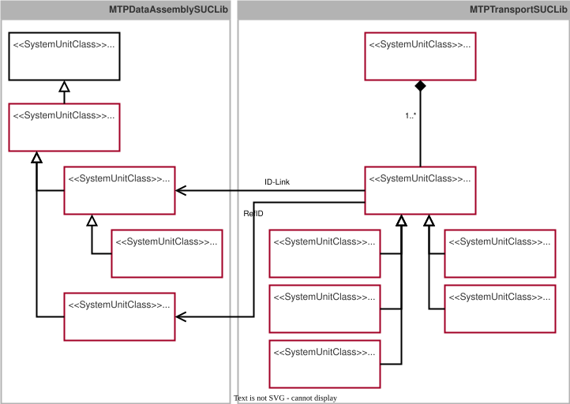

## 9.8 MTP Specification of the TransportSet
This chapter specifies the *TransportSet* as a new aspect of the MTP specification that contains all elements identified in the conceptual chapter~[Art3 LA](#chap:Art3LA).

### 9.8.1 Übersicht
#### Semantic Description of Transport Services
For semantic identification of the transport services introduced in Section~[Transportdienste](#sec:Transportdienste), a semantic identifier in the form of a *FunctionClassificationAttribute* is added to them. [Table 9.62](#table-962-functionclassificationattribute-of-a-transport-service) specifies the corresponding *FunctionClassificationAttribute*. "2.0" denotes the version in major-minor format and can be incremented accordingly when changes are made to the *FunctionClassificationAttributes*.

##### Table 9.62: FunctionClassificationAttribute of a Transport Service

<table>
	<tr>
		<td align="left" colspan="2"><strong>▶ FunctionClassificationAttribute for Transport Service</strong></td>
	</tr>
	<tr>
		<th align="left">Standard</th>
		<td align="left">ModuleTypePackage:Logistics</td>
	</tr>
	<tr>
		<th align="left">Level</th>
		<td align="left">Transport-Management</td>
	</tr>
	<tr>
		<th align="left">Type</th>
		<td align="left">Transport</td>
	</tr>
	<tr>
		<th align="left">IRDI</th>
		<td align="left">ModuleTypePackage:Logistics:Transport:2.0</td>
	</tr>
</table>

#### Specification of the Transport Aspect
According to Chapter~[Art3 LA](#chap:Art3LA), a series of new model and DataAssembly definitions is required to represent transport-relevant information in the MTP of a LEA. [Figure 9.19](#figure-919-specification-of-the-transportset-for-connecting-flexible-transport-systems-to-leas) provides an overview of these newly specified definitions.
 
##### Figure 9.19: Specification of the TransportSet for Connecting Flexible Transport Systems to LEAs

On the **dataassembly-definition** side, *SUC TransportClientManager* is introduced as an DataAssembly definition for configuring and establishing a communication link between a LEA and transport management. It is an abstract DataAssembly definition that fundamentally allows the use of different communication technologies through different derivations. For implementation based on OPC UA client/server, the derived *SUC OpcUaTransportClientManager* is introduced. In addition, *SUC TransportNodeManager* is introduced as an interface that enables the assignment of a transport node of a LEA to the associated TN proxy in transport management. A convention in the MTP specifications provides that DataAssembly definitions belonging together in terms of content are derived from a common DataAssembly definition with the suffix **Element*. Accordingly, in this case *SUC TransportElement*, derived from *SUC DataAssembly* [MTP Specification Part 3](../98_References/README.md#mtp-specification-part-3), is introduced, from which *SUC TransportClientManager* and *SUC TransportNodeManager* are derived. These DataAssembly definitions are organized in *SUCL MTPDataAssemblySUCLib*. The detailed specification is provided in Appendix~[DataAssembly definitions](#subsec:AnhangTransportSetSchnittstellen). 

On the **model-definition** side, *SUC TransportSet* is introduced as a new aspect set for organizing all transport-relevant models and is derived from the abstract *SUC MTPSet* according to [MTP Specification Part 1](../98_References/README.md#mtp-specification-part-1). The *TransportSet* indicates that a LEA has the capability to be connected to a flexible transport system according to the concepts of this work and contains all model definitions required for this purpose. In particular, this consists of any number of IEs of *SUC TransportNode*. The latter is an abstract class for representing transport nodes and is derived from *SUC LinkedObject*. The concrete derivations provided are *SUC InboundNode*, *SUC OutboundNode*, *SUC InOutboundNode*, *SUC ProcessingNode*, and *SUC OrderNode*. All *TransportNodes* are linked to one *TransportClientManager* interface each by means of an ID link relation and to one *TransportNodeManager* interface by means of LinkedObject relations. The model definitions are organized in the newly introduced library *SUCL MTPTransportSUCLib*. The detailed specification is provided in Appendix~[Model Definitions](#subsec:AnhangTransportSetModelle). 

All model and DataAssembly definitions required for the *TransportSet* are assigned to the new profile *ModuleTypePackage:TransportSet.Base V2.0.0*.
 
### 9.8.2 DataAssembly definitions
#### Specification of the System Unit Class TransportElement
*SUC TransportElement* ([Table 9.63](#table-963-dataassembly-definition-of-suc-transportelement)) is an abstract class derived from *SUC DataAssembly*. The transport-relevant DataAssembly definitions *SUC TransportClientManager* and *SUC TransportNodeManager* are derived from *SUC TransportElement*.

##### Table 9.63: DataAssembly definition of *SUC TransportElement*

<table>
	<tr>
		<td align="left" colspan="6"><strong>▶ Module Type Package - DataAssembly Definition</strong></td>
	</tr>
	<tr>
		<th align="left">Name</th>
		<td align="left" colspan="5"><strong>TransportElement</strong></td>
	</tr>
	<tr>
		<th align="left">Type</th>
		<td align="left" colspan="5">System Unit Class (SUC)</td>
	</tr>
	<tr>
		<th align="left">Modifier</th>
		<td align="left" colspan="5">abstract</td>
	</tr>
	<tr>
		<th align="left">Description</th>
		<td align="left" colspan="5">root interface class for transport-related DataAssembly definitions</td>
	</tr>
	<tr>
		<th align="left">AutomationML Path</th>
		<td align="left" colspan="5">MTPDataAssemblySUCLib/DataAssembly/TransportElement</td>
	</tr>
	<tr>
		<th align="left">AutomationML BaseRef</th>
		<td align="left" colspan="5">MTPDataAssemblySUCLib/DataAssembly</td>
	</tr>
	<tr>
		<th align="left">Role Classes</th>
		<td align="left" colspan="5">-</td>
	</tr>
	<tr>
		<th align="left">Version</th>
		<td align="left" colspan="5">ModuleTypePackage:TransportSet.Base V2.0.0</td>
	</tr>
	<tr>
		<td align="left" colspan="6"><strong>📌 AutomationML Properties</strong></td>
	</tr>
	<tr>
		<th align="left">Name</th>
		<th align="left">Type</th>
		<th align="left" colspan="4">Description</th>
	</tr>
	<tr>
		<td align="left">-</td>
		<td align="left">-</td>
		<td align="left" colspan="4">-</td>
	</tr>
	<tr>
		<td align="left" colspan="6"><strong>📌 AutomationML Attributes</strong></td>
	</tr>
	<tr>
		<th align="left">Name</th>
		<th align="left">Access</th>
		<th align="left">Type</th>
		<th align="left">Description</th>
		<th align="left">AttributeType Reference</th>
		<th align="left">Base Function</th>
	</tr>
	<tr>
		<td align="left">WQC</td>
		<td align="left">LOL ⟵ LEA</td>
		<td align="left">BYTE</td>
		<td align="left">Worst Quality Code</td>
		<td align="left">-</td>
		<td align="left">WQC</td>
	</tr>
	<tr>
		<td align="left" colspan="6"><strong>📌 Comment</strong></td>
	</tr>
	<tr>
		<td align="left" colspan="6">-</td>
	</tr>
	<tr>
		<td align="left" colspan="6"><strong>📌 AutomationML Object - Instance Constraints</strong></td>
	</tr>
	<tr>
		<th align="left">Allowed Parents</th>
		<td align="left" colspan="5">(no further constraints given)</td>
	</tr>
	<tr>
		<th align="left">Allowed Children</th>
		<td align="left" colspan="5">(no further constraints given)</td>
	</tr>
</table>

#### Specification of the System Unit Class TransportClientManager
*SUC TransportClientManager* ([Table 9.64](#table-964-dataassembly-definition-of-suc-transportclientmanager)) is derived from *SUC TransportElement* and is an abstract DataAssembly definition for configuring the communication link between a LEA and a flexible transport system. To implement this DataAssembly definition, a concrete manager must be derived from it. So far, only *SUC OpcUaTransportClientManager* has been specified as a derivation. *SUC TransportClientManager*, and thus also its derivations, are assigned to a *TransportNode* model definition in the *TransportSet* via an ID link relation.

##### Table 9.64: DataAssembly definition of *SUC TransportClientManager*

<table>
	<tr>
		<td align="left" colspan="6"><strong>▶ Module Type Package - DataAssembly Definition</strong></td>
	</tr>
	<tr>
		<th align="left">Name</th>
		<td align="left" colspan="5"><strong>TransportClientManager</strong></td>
	</tr>
	<tr>
		<th align="left">Type</th>
		<td align="left" colspan="5">System Unit Class (SUC)</td>
	</tr>
	<tr>
		<th align="left">Modifier</th>
		<td align="left" colspan="5">abstract</td>
	</tr>
	<tr>
		<th align="left">Description</th>
		<td align="left" colspan="5">abstract DataAssembly definition for configuring the communication of the Logistics Equipment Assembly to a transport management system</td>
	</tr>
	<tr>
		<th align="left">AutomationML Path</th>
		<td align="left" colspan="5">MTPDataAssemblySUCLib/DataAssembly/TransportElement/Transport-ClientManager</td>
	</tr>
	<tr>
		<th align="left">AutomationML BaseRef</th>
		<td align="left" colspan="5">MTPDataAssemblySUCLib/DataAssembly/TransportElement</td>
	</tr>
	<tr>
		<th align="left">Role Classes</th>
		<td align="left" colspan="5">-</td>
	</tr>
	<tr>
		<th align="left">Version</th>
		<td align="left" colspan="5">ModuleTypePackage:TransportSet.Base V2.0.0</td>
	</tr>
	<tr>
		<td align="left" colspan="6"><strong>📌 AutomationML Properties</strong></td>
	</tr>
	<tr>
		<th align="left">Name</th>
		<th align="left">Type</th>
		<th align="left" colspan="4">Description</th>
	</tr>
	<tr>
		<td align="left">-</td>
		<td align="left">-</td>
		<td align="left" colspan="4">-</td>
	</tr>
	<tr>
		<td align="left" colspan="6"><strong>📌 AutomationML Attributes</strong></td>
	</tr>
	<tr>
		<th align="left">Name</th>
		<th align="left">Access</th>
		<th align="left">Type</th>
		<th align="left">Description</th>
		<th align="left">AttributeType Reference</th>
		<th align="left">Base Function</th>
	</tr>
	<tr>
		<td align="left">-</td>
		<td align="left">-</td>
		<td align="left"></td>
		<td align="left">-</td>
		<td align="left">-</td>
		<td align="left">-</td>
	</tr>
	<tr>
		<td align="left" colspan="6"><strong>📌 Comment</strong></td>
	</tr>
	<tr>
		<td align="left" colspan="6">-</td>
	</tr>
	<tr>
		<td align="left" colspan="6"><strong>📌 AutomationML Object - Instance Constraints</strong></td>
	</tr>
	<tr>
		<th align="left">Allowed Parents</th>
		<td align="left" colspan="5">(no further constraints given)</td>
	</tr>
	<tr>
		<th align="left">Allowed Children</th>
		<td align="left" colspan="5">(no further constraints given)</td>
	</tr>
</table>

#### Specification of the System Unit Class OpcUaTransportClientManager
*SUC OpcUaTransportClientManager* ([Table 9.65](#table-965-dataassembly-definition-of-suc-opcuatransportclientmanager)) is derived from *SUC TransportClientManager* and is used to configure and establish an OPC UA Client/Server communication link between the LEA and a flexible transport system. In addition, this interface contains the variable *LeaStateCur*, which enables transport management to determine the state of the LEA service. This is used to detect possible faults in the LEA and, if necessary, reroute transport services to this LEA.

##### Table 9.65: DataAssembly definition of *SUC OpcUaTransportClientManager*

<table>
	<tr>
		<td align="left" colspan="6"><strong>▶ Module Type Package - DataAssembly Definition</strong></td>
	</tr>
	<tr>
		<th align="left">Name</th>
		<td align="left" colspan="5"><strong>OpcUaTransportClientManager</strong></td>
	</tr>
	<tr>
		<th align="left">Type</th>
		<td align="left" colspan="5">System Unit Class (SUC)</td>
	</tr>
	<tr>
		<th align="left">Modifier</th>
		<td align="left" colspan="5">-</td>
	</tr>
	<tr>
		<th align="left">Description</th>
		<td align="left" colspan="5">configuration interface for an OPC UA client communicating transport-relevant data</td>
	</tr>
	<tr>
		<th align="left">AutomationML Path</th>
		<td align="left" colspan="5">MTPDataAssemblySUCLib/DataAssembly/TransportElement/Transport-ClientManager/OpcUaTransportClientManager</td>
	</tr>
	<tr>
		<th align="left">AutomationML BaseRef</th>
		<td align="left" colspan="5">MTPDataAssemblySUCLib/DataAssembly/TransportElement/Transport-ClientManager</td>
	</tr>
	<tr>
		<th align="left">Role Classes</th>
		<td align="left" colspan="5">-</td>
	</tr>
	<tr>
		<th align="left">Version</th>
		<td align="left" colspan="5">ModuleTypePackage:TransportSet.Base V2.0.0</td>
	</tr>
	<tr>
		<td align="left" colspan="6"><strong>📌 AutomationML Properties</strong></td>
	</tr>
	<tr>
		<th align="left">Name</th>
		<th align="left">Type</th>
		<th align="left" colspan="4">Description</th>
	</tr>
	<tr>
		<td align="left">-</td>
		<td align="left">-</td>
		<td align="left" colspan="4">-</td>
	</tr>
	<tr>
		<td align="left" colspan="6"><strong>📌 AutomationML Attributes</strong></td>
	</tr>
	<tr>
		<th align="left">Name</th>
		<th align="left">Access</th>
		<th align="left">Type</th>
		<th align="left">Description</th>
		<th align="left">AttributeType Reference</th>
		<th align="left">Base Function</th>
	</tr>
	<tr>
		<td align="left">ConfigApplyEn</td>
		<td align="left">LOL ⟵ LEA</td>
		<td align="left">BOOL</td>
		<td align="left">Enable flag to apply the prepared configuration</td>
		<td align="left">-</td>
		<td align="left">-</td>
	</tr>
	<tr>
		<td align="left">ConfigApplyExt</td>
		<td align="left">LOL ⟶ LEA</td>
		<td align="left">BOOL</td>
		<td align="left">Apply the prepared configuration</td>
		<td align="left">-</td>
		<td align="left">-</td>
	</tr>
	<tr>
		<td align="left">ConnectEn</td>
		<td align="left">LOL ⟵ LEA</td>
		<td align="left">BOOL</td>
		<td align="left">Enable flag to establish connection</td>
		<td align="left">-</td>
		<td align="left">-</td>
	</tr>
	<tr>
		<td align="left">ConnectExt</td>
		<td align="left">LOL ⟶ LEA</td>
		<td align="left">BOOL</td>
		<td align="left">Establish connection</td>
		<td align="left">-</td>
		<td align="left">-</td>
	</tr>
	<tr>
		<td align="left">DisconnectEn</td>
		<td align="left">LOL ⟵ LEA</td>
		<td align="left">BOOL</td>
		<td align="left">Enable flag to remove connection</td>
		<td align="left">-</td>
		<td align="left">-</td>
	</tr>
	<tr>
		<td align="left">DisconnectExt</td>
		<td align="left">LOL ⟶ LEA</td>
		<td align="left">BOOL</td>
		<td align="left">Remove connection</td>
		<td align="left">-</td>
		<td align="left">-</td>
	</tr>
	<tr>
		<td align="left">ResetExt</td>
		<td align="left">LOL ⟶ LEA</td>
		<td align="left">BOOL</td>
		<td align="left">Reset communication block</td>
		<td align="left">-</td>
		<td align="left">-</td>
	</tr>
	<tr>
		<td align="left">ConnectionAct</td>
		<td align="left">LOL ⟵ LEA</td>
		<td align="left">BOOL</td>
		<td align="left">Flag indicating an established connection</td>
		<td align="left">-</td>
		<td align="left">-</td>
	</tr>
	<tr>
		<td align="left">ConnectionErr</td>
		<td align="left">LOL ⟵ LEA</td>
		<td align="left">BOOL</td>
		<td align="left">Flag indicating a connection error</td>
		<td align="left">-</td>
		<td align="left">-</td>
	</tr>
	<tr>
		<td align="left">ErrorId</td>
		<td align="left">LOL ⟵ LEA</td>
		<td align="left">DWORD</td>
		<td align="left">Identifier of the connection error</td>
		<td align="left">-</td>
		<td align="left">-</td>
	</tr>
	<tr>
		<td align="left">EndpointExt</td>
		<td align="left">LOL ⟶ LEA</td>
		<td align="left">STRING</td>
		<td align="left">Defines the server URL to connect with</td>
		<td align="left">-</td>
		<td align="left">-</td>
	</tr>
	<tr>
		<td align="left">NamespaceExt</td>
		<td align="left">LOL ⟶ LEA</td>
		<td align="left">STRING</td>
		<td align="left">Defines Namespace to be used</td>
		<td align="left">-</td>
		<td align="left">-</td>
	</tr>
	<tr>
		<td align="left">EndpointReq</td>
		<td align="left">LOL ⟵ LEA</td>
		<td align="left">STRING</td>
		<td align="left">Requested server URL</td>
		<td align="left">-</td>
		<td align="left">-</td>
	</tr>
	<tr>
		<td align="left">NamespaceReq</td>
		<td align="left">LOL ⟵ LEA</td>
		<td align="left">STRING</td>
		<td align="left">Requested namespace</td>
		<td align="left">-</td>
		<td align="left">-</td>
	</tr>
	<tr>
		<td align="left">EndpointCur</td>
		<td align="left">LOL ⟵ LEA</td>
		<td align="left">STRING</td>
		<td align="left">Currently configured server URL</td>
		<td align="left">-</td>
		<td align="left">-</td>
	</tr>
	<tr>
		<td align="left">NamespaceCur</td>
		<td align="left">LOL ⟵ LEA</td>
		<td align="left">STRING</td>
		<td align="left">Currently configured namespace</td>
		<td align="left">-</td>
		<td align="left">-</td>
	</tr>
	<tr>
		<td align="left">LeaStateCur</td>
		<td align="left">LOL ⟵ LEA</td>
		<td align="left">DWORD</td>
		<td align="left">MTP service state of the LEA service</td>
		<td align="left">-</td>
		<td align="left">-</td>
	</tr>
	<tr>
		<td align="left" colspan="6"><strong>📌 Comment</strong></td>
	</tr>
	<tr>
		<td align="left" colspan="6">-</td>
	</tr>
	<tr>
		<td align="left" colspan="6"><strong>📌 AutomationML Object - Instance Constraints</strong></td>
	</tr>
	<tr>
		<th align="left">Allowed Parents</th>
		<td align="left" colspan="5">(no further constraints given)</td>
	</tr>
	<tr>
		<th align="left">Allowed Children</th>
		<td align="left" colspan="5">(no further constraints given)</td>
	</tr>
</table>

#### Specification of the System Unit Class TransportNodeManager
*SUC TransportNodeManager* ([Table 9.66](#table-966-dataassembly-definition-of-suc-transportnodemanager)) is derived from *SUC TransportElement* and is used to assign a TN proxy to a specific transport node in the LEA. This DataAssembly definition is assigned to a *TransportNode* model definition in the *TransportSet* via a LinkedObject relation.

##### Table 9.66: DataAssembly definition of *SUC TransportNodeManager*

<table>
	<tr>
		<td align="left" colspan="6"><strong>▶ Module Type Package - DataAssembly Definition</strong></td>
	</tr>
	<tr>
		<th align="left">Name</th>
		<td align="left" colspan="5"><strong>TransportNodeManager</strong></td>
	</tr>
	<tr>
		<th align="left">Type</th>
		<td align="left" colspan="5">System Unit Class (SUC)</td>
	</tr>
	<tr>
		<th align="left">Modifier</th>
		<td align="left" colspan="5">-</td>
	</tr>
	<tr>
		<th align="left">Description</th>
		<td align="left" colspan="5">configuration interface to assign transport nodes to transport proxies</td>
	</tr>
	<tr>
		<th align="left">AutomationML Path</th>
		<td align="left" colspan="5">MTPDataAssemblySUCLib/DataAssembly/TransportElement/Transport-NodeManager</td>
	</tr>
	<tr>
		<th align="left">AutomationML BaseRef</th>
		<td align="left" colspan="5">MTPDataAssemblySUCLib/DataAssembly/TransportElement</td>
	</tr>
	<tr>
		<th align="left">Role Classes</th>
		<td align="left" colspan="5">-</td>
	</tr>
	<tr>
		<th align="left">Version</th>
		<td align="left" colspan="5">ModuleTypePackage:TransportSet.Base V2.0.0</td>
	</tr>
	<tr>
		<td align="left" colspan="6"><strong>📌 AutomationML Properties</strong></td>
	</tr>
	<tr>
		<th align="left">Name</th>
		<th align="left">Type</th>
		<th align="left" colspan="4">Description</th>
	</tr>
	<tr>
		<td align="left">-</td>
		<td align="left">-</td>
		<td align="left" colspan="4">-</td>
	</tr>
	<tr>
		<td align="left" colspan="6"><strong>📌 AutomationML Attributes</strong></td>
	</tr>
	<tr>
		<th align="left">Name</th>
		<th align="left">Access</th>
		<th align="left">Type</th>
		<th align="left">Description</th>
		<th align="left">AttributeType Reference</th>
		<th align="left">Base Function</th>
	</tr>
	<tr>
		<td align="left">ConfigApplyEn</td>
		<td align="left">LOL ⟵ LEA</td>
		<td align="left">BOOL</td>
		<td align="left">Enable flag to apply the prepared configuration</td>
		<td align="left">-</td>
		<td align="left">-</td>
	</tr>
	<tr>
		<td align="left">ConfigApplyExt</td>
		<td align="left">LOL ⟶ LEA</td>
		<td align="left">BOOL</td>
		<td align="left">Apply the prepared configuration</td>
		<td align="left">-</td>
		<td align="left">-</td>
	</tr>
	<tr>
		<td align="left">ConnectEn</td>
		<td align="left">LOL ⟵ LEA</td>
		<td align="left">BOOL</td>
		<td align="left">Enable flag to establish connection</td>
		<td align="left">-</td>
		<td align="left">-</td>
	</tr>
	<tr>
		<td align="left">ConnectExt</td>
		<td align="left">LOL ⟶ LEA</td>
		<td align="left">BOOL</td>
		<td align="left">Establish connection</td>
		<td align="left">-</td>
		<td align="left">-</td>
	</tr>
	<tr>
		<td align="left">DisconnectEn</td>
		<td align="left">LOL ⟵ LEA</td>
		<td align="left">BOOL</td>
		<td align="left">Enable flag to remove connection</td>
		<td align="left">-</td>
		<td align="left">-</td>
	</tr>
	<tr>
		<td align="left">DisconnectExt</td>
		<td align="left">LOL ⟶ LEA</td>
		<td align="left">BOOL</td>
		<td align="left">Remove connection</td>
		<td align="left">-</td>
		<td align="left">-</td>
	</tr>
	<tr>
		<td align="left">ResetExt</td>
		<td align="left">LOL ⟶ LEA</td>
		<td align="left">BOOL</td>
		<td align="left">Reset communication block</td>
		<td align="left">-</td>
		<td align="left">-</td>
	</tr>
	<tr>
		<td align="left">ConnectionAct</td>
		<td align="left">LOL ⟵ LEA</td>
		<td align="left">BOOL</td>
		<td align="left">Flag indicating an established connection</td>
		<td align="left">-</td>
		<td align="left">-</td>
	</tr>
	<tr>
		<td align="left">ConnectionErr</td>
		<td align="left">LOL ⟵ LEA</td>
		<td align="left">BOOL</td>
		<td align="left">Flag indicating a connection error</td>
		<td align="left">-</td>
		<td align="left">-</td>
	</tr>
	<tr>
		<td align="left">ErrorId</td>
		<td align="left">LOL ⟵ LEA</td>
		<td align="left">DWORD</td>
		<td align="left">Identifier of the connection error</td>
		<td align="left">-</td>
		<td align="left">-</td>
	</tr>
	<tr>
		<td align="left">ProxyIdExt</td>
		<td align="left">LOL ⟶ LEA</td>
		<td align="left">DINT</td>
		<td align="left">Defines related proxy in the transportsystem</td>
		<td align="left">-</td>
		<td align="left">-</td>
	</tr>
	<tr>
		<td align="left">ProxyIdReq</td>
		<td align="left">LOL ⟵ LEA</td>
		<td align="left">DINT</td>
		<td align="left">Requested transport proxy</td>
		<td align="left">-</td>
		<td align="left">-</td>
	</tr>
	<tr>
		<td align="left">ProxyIdCur</td>
		<td align="left">LOL ⟵ LEA</td>
		<td align="left">DINT</td>
		<td align="left">Currently configured transport proxy</td>
		<td align="left">-</td>
		<td align="left">-</td>
	</tr>
	<tr>
		<td align="left" colspan="6"><strong>📌 Comment</strong></td>
	</tr>
	<tr>
		<td align="left" colspan="6">-</td>
	</tr>
	<tr>
		<td align="left" colspan="6"><strong>📌 AutomationML Object - Instance Constraints</strong></td>
	</tr>
	<tr>
		<th align="left">Allowed Parents</th>
		<td align="left" colspan="5">(no further constraints given)</td>
	</tr>
	<tr>
		<th align="left">Allowed Children</th>
		<td align="left" colspan="5">(no further constraints given)</td>
	</tr>
</table>

### 9.8.3 Model Definitions
#### Specification of the Instance Hierarchy Transports
*IH Transports* ([Table 9.67](#table-967-model-definition-of-ih-transports)) is the entry point for the transport-related information model in the instance hierarchy of an MTP.

##### Table 9.67: Model Definition of *IH Transports*

<table>
	<tr>
		<td align="left" colspan="3"><strong>▶ Module Type Package - Model Definition</strong></td>
	</tr>
	<tr>
		<th align="left">Name</th>
		<td align="left" colspan="2"><strong>Transports</strong></td>
	</tr>
	<tr>
		<th align="left">Type</th>
		<td align="left" colspan="2">Instance Hierarchy (IH)</td>
	</tr>
	<tr>
		<th align="left">Description</th>
		<td align="left" colspan="2">root element for the transport-related information model of an MTP</td>
	</tr>
	<tr>
		<th align="left">Version</th>
		<td align="left" colspan="2">ModuleTypePackage:TransportSet.Base V2.0.0</td>
	</tr>
	<tr>
		<td align="left" colspan="3"><strong>📌 AutomationML Properties</strong></td>
	</tr>
	<tr>
		<th align="left">Name</th>
		<th align="left">Type</th>
		<th align="left">Description</th>
	</tr>
	<tr>
		<td align="left">ID</td>
		<td align="left">xs:string</td>
		<td align="left">Identifier of the Instance Hierarchy</td>
	</tr>
	<tr>
		<td align="left" colspan="3"><strong>📌 Comment</strong></td>
	</tr>
	<tr>
		<td align="left" colspan="3">-</td>
	</tr>
	<tr>
		<td align="left" colspan="3"><strong>📌 AutomationML Object - Constraints</strong></td>
	</tr>
	<tr>
		<th align="left">Allowed Children</th>
		<td align="left" colspan="2">[1..*] IE of SUC TransportNode</td>
	</tr>
</table>

#### Specification of the System Unit Class Library MTPTransportSUCLib
*SUCL MTPTransportSUCLib* ([Table 9.68](#table-968-library-definition-of-sucl-mtptransportsuclib)) contains the System Unit Classes of the *TransportSet* of an MTP.

##### Table 9.68: Library Definition of *SUCL MTPTransportSUCLib*

<table>
	<tr>
		<td align="left" colspan="3"><strong>▶ Module Type Package - Library Definition</strong></td>
	</tr>
	<tr>
		<th align="left">Name</th>
		<td align="left" colspan="2"><strong>MTPTransportSUCLib</strong></td>
	</tr>
	<tr>
		<th align="left">Type</th>
		<td align="left" colspan="2">SystemUnitClassLibrary (SUCL)</td>
	</tr>
	<tr>
		<th align="left">Description</th>
		<td align="left" colspan="2">Library containing the transport-related SUC model definitions of an MTP</td>
	</tr>
	<tr>
		<th align="left">Version</th>
		<td align="left" colspan="2">ModuleTypePackage:TransportSet.Base V2.0.0</td>
	</tr>
	<tr>
		<td align="left" colspan="3"><strong>📌 AutomationML Properties</strong></td>
	</tr>
	<tr>
		<th align="left">Name</th>
		<th align="left">Type</th>
		<th align="left">Description</th>
	</tr>
	<tr>
		<td align="left">-</td>
		<td align="left">-</td>
		<td align="left">-</td>
	</tr>
	<tr>
		<td align="left" colspan="3"><strong>📌 Comment</strong></td>
	</tr>
	<tr>
		<td align="left" colspan="3">-</td>
	</tr>
</table>

#### Specification of the System Unit Class TransportSet
*SUC TransportSet* ([Table 9.69](#table-969-model-definition-of-suc-transportset)), as a new aspect set of the MTP specification, contains all model definitions required to describe the transport-relevant information of a LEA.

##### Table 9.69: Model Definition of *SUC TransportSet*

<table>
	<tr>
		<td align="left" colspan="4"><strong>▶ Module Type Package - Model Definition</strong></td>
	</tr>
	<tr>
		<th align="left">Name</th>
		<td align="left" colspan="3"><strong>TransportSet</strong></td>
	</tr>
	<tr>
		<th align="left">Type</th>
		<td align="left" colspan="3">SystemUnitClass (SUC)</td>
	</tr>
	<tr>
		<th align="left">Modifier</th>
		<td align="left" colspan="3">sealed</td>
	</tr>
	<tr>
		<th align="left">Description</th>
		<td align="left" colspan="3">Model definition for transport aspect set</td>
	</tr>
	<tr>
		<th align="left">AutomationML Path</th>
		<td align="left" colspan="3">MTPTransportSUCLib/TransportSet</td>
	</tr>
	<tr>
		<th align="left">AutomationML BaseRef</th>
		<td align="left" colspan="3">MTPSUCLib/MTPSet</td>
	</tr>
	<tr>
		<th align="left">RoleClasses</th>
		<td align="left" colspan="3">-</td>
	</tr>
	<tr>
		<th align="left">Version</th>
		<td align="left" colspan="3">ModuleTypePackage:TransportSet.Base V2.0.0</td>
	</tr>
	<tr>
		<td align="left" colspan="4"><strong>📌 AutomationML Properties</strong></td>
	</tr>
	<tr>
		<th align="left">Name</th>
		<th align="left">Type</th>
		<th align="left" colspan="2">Description</th>
	</tr>
	<tr>
		<td align="left">-</td>
		<td align="left">-</td>
		<td align="left" colspan="2">-</td>
	</tr>
	<tr>
		<td align="left" colspan="4"><strong>📌 AutomationML Attributes</strong></td>
	</tr>
	<tr>
		<th align="left">Name</th>
		<th align="left">Type</th>
		<th align="left">Description</th>
		<th align="left">AttributeType Reference</th>
	</tr>
	<tr>
		<td align="left">-</td>
		<td align="left">-</td>
		<td align="left">-</td>
		<td align="left">-</td>
	</tr>
	<tr>
		<td align="left" colspan="4"><strong>📌 Comment</strong></td>
	</tr>
	<tr>
		<td align="left" colspan="4">-</td>
	</tr>
	<tr>
		<td align="left" colspan="4"><strong>📌 AutomationML Object - Instance Constraints</strong></td>
	</tr>
	<tr>
		<th align="left">Allowed Parents</th>
		<td align="left" colspan="3">(no further constraints given)</td>
	</tr>
	<tr>
		<th align="left">Allowed Children</th>
		<td align="left" colspan="3">[1] EI of IC AspectSetReference which refers via ID to an IH containing [1..*] IE of SUC TransportNode</td>
	</tr>
</table>

#### Specification of the System Unit Class TransportNode
*SUC TransportNode* ([Table 9.70](#table-970-model-definition-of-suc-transportnode)) is an abstract model definition for describing a transport node available in a LEA. Currently, five concrete types of transport nodes are derived from this model definition: *SUC InboundNode*, *SUC OutboundNode*, *SUC InOutboundNode*, *SUC ProcessingNode*, and *SUC OrderNode*. A *SUC TransportNode* is assigned to the *TransportNodeManager* DataAssembly definition via a LinkedObject relation, which enables the assignment of the transport node to a TN proxy in transport management. In addition, *SUC TransportNode* is assigned to the *TransportClientManager* interface, which connects the LEA to transport management. For this assignment, the ID link mechanism and the variable *ClientLink* are used.

##### Table 9.70: Model Definition of *SUC TransportNode*

<table>
	<tr>
		<td align="left" colspan="4"><strong>▶ Module Type Package - Model Definition</strong></td>
	</tr>
	<tr>
		<th align="left">Name</th>
		<td align="left" colspan="3"><strong>TransportNode</strong></td>
	</tr>
	<tr>
		<th align="left">Type</th>
		<td align="left" colspan="3">SystemUnitClass (SUC)</td>
	</tr>
	<tr>
		<th align="left">Modifier</th>
		<td align="left" colspan="3">abstract</td>
	</tr>
	<tr>
		<th align="left">Description</th>
		<td align="left" colspan="3">Model definition for a transport node of a transport-enabled Logistics Equipment Assembly</td>
	</tr>
	<tr>
		<th align="left">AutomationML Path</th>
		<td align="left" colspan="3">MTPTransportSUCLib/TransportNode</td>
	</tr>
	<tr>
		<th align="left">AutomationML BaseRef</th>
		<td align="left" colspan="3">MTPSUCLib/LinkedObject</td>
	</tr>
	<tr>
		<th align="left">RoleClasses</th>
		<td align="left" colspan="3">-</td>
	</tr>
	<tr>
		<th align="left">Version</th>
		<td align="left" colspan="3">ModuleTypePackage:TransportSet.Base V2.0.0</td>
	</tr>
	<tr>
		<td align="left" colspan="4"><strong>📌 AutomationML Properties</strong></td>
	</tr>
	<tr>
		<th align="left">Name</th>
		<th align="left">Type</th>
		<th align="left" colspan="2">Description</th>
	</tr>
	<tr>
		<td align="left">-</td>
		<td align="left">-</td>
		<td align="left" colspan="2">-</td>
	</tr>
	<tr>
		<td align="left" colspan="4"><strong>📌 AutomationML Attributes</strong></td>
	</tr>
	<tr>
		<th align="left">Name</th>
		<th align="left">Type</th>
		<th align="left">Description</th>
		<th align="left">AttributeType Reference</th>
	</tr>
	<tr>
		<td align="left">ClientLink</td>
		<td align="left">xs:string</td>
		<td align="left">object identifier of the associated TransportClientManager interface</td>
		<td align="left">IDLinkAttributeType</td>
	</tr>
	<tr>
		<td align="left" colspan="4"><strong>📌 Comment</strong></td>
	</tr>
	<tr>
		<td align="left" colspan="4">-</td>
	</tr>
	<tr>
		<td align="left" colspan="4"><strong>📌 AutomationML Object - Instance Constraints</strong></td>
	</tr>
	<tr>
		<th align="left">Allowed Parents</th>
		<td align="left" colspan="3">IH to which an IE of SUC TransportSet relates via EI of IC AspectSetReference</td>
	</tr>
	<tr>
		<th align="left">Allowed Children</th>
		<td align="left" colspan="3">(no children allowed)</td>
	</tr>
</table>

#### Specification of the System Unit Class InboundNode
*SUC InboundNode* ([Table 9.71](#table-971-model-definition-of-suc-inboundnode)) is derived from *SUC TransportNode* and describes a transport node for transferring an LO from a flexible transport system to a LEA.

##### Table 9.71: Model Definition of *SUC InboundNode*

<table>
	<tr>
		<td align="left" colspan="4"><strong>▶ Module Type Package - Model Definition</strong></td>
	</tr>
	<tr>
		<th align="left">Name</th>
		<td align="left" colspan="3"><strong>InboundNode</strong></td>
	</tr>
	<tr>
		<th align="left">Type</th>
		<td align="left" colspan="3">SystemUnitClass (SUC)</td>
	</tr>
	<tr>
		<th align="left">Modifier</th>
		<td align="left" colspan="3">sealed</td>
	</tr>
	<tr>
		<th align="left">Description</th>
		<td align="left" colspan="3">Model definition for a transport node transferring objects from a flexible transport system to the Logistics Equipment Assembly</td>
	</tr>
	<tr>
		<th align="left">AutomationML Path</th>
		<td align="left" colspan="3">MTPTransportSUCLib/TransportNode/InboundNode</td>
	</tr>
	<tr>
		<th align="left">AutomationML BaseRef</th>
		<td align="left" colspan="3">MTPTransportSUCLib/TransportNode</td>
	</tr>
	<tr>
		<th align="left">RoleClasses</th>
		<td align="left" colspan="3">-</td>
	</tr>
	<tr>
		<th align="left">Version</th>
		<td align="left" colspan="3">ModuleTypePackage:TransportSet.Base V2.0.0</td>
	</tr>
	<tr>
		<td align="left" colspan="4"><strong>📌 AutomationML Properties</strong></td>
	</tr>
	<tr>
		<th align="left">Name</th>
		<th align="left">Type</th>
		<th align="left" colspan="2">Description</th>
	</tr>
	<tr>
		<td align="left">-</td>
		<td align="left">-</td>
		<td align="left" colspan="2">-</td>
	</tr>
	<tr>
		<td align="left" colspan="4"><strong>📌 AutomationML Attributes</strong></td>
	</tr>
	<tr>
		<th align="left">Name</th>
		<th align="left">Type</th>
		<th align="left">Description</th>
		<th align="left">AttributeType Reference</th>
	</tr>
	<tr>
		<td align="left">-</td>
		<td align="left">-</td>
		<td align="left">-</td>
		<td align="left">-</td>
	</tr>
	<tr>
		<td align="left" colspan="4"><strong>📌 Comment</strong></td>
	</tr>
	<tr>
		<td align="left" colspan="4">-</td>
	</tr>
	<tr>
		<td align="left" colspan="4"><strong>📌 AutomationML Object - Instance Constraints</strong></td>
	</tr>
	<tr>
		<th align="left">Allowed Parents</th>
		<td align="left" colspan="3">(no further constraints given)</td>
	</tr>
	<tr>
		<th align="left">Allowed Children</th>
		<td align="left" colspan="3">(no further constraints given)</td>
	</tr>
</table>

#### Specification of the System Unit Class OutboundNode
*SUC OutboundNode* ([Table 9.72](#table-972-model-definition-of-suc-outboundnode)) is derived from *SUC TransportNode* and describes a transport node for transferring an LO from a LEA to a flexible transport system.

##### Table 9.72: Model Definition of *SUC OutboundNode*

<table>
	<tr>
		<td align="left" colspan="4"><strong>▶ Module Type Package - Model Definition</strong></td>
	</tr>
	<tr>
		<th align="left">Name</th>
		<td align="left" colspan="3"><strong>OutboundNode</strong></td>
	</tr>
	<tr>
		<th align="left">Type</th>
		<td align="left" colspan="3">SystemUnitClass (SUC)</td>
	</tr>
	<tr>
		<th align="left">Modifier</th>
		<td align="left" colspan="3">sealed</td>
	</tr>
	<tr>
		<th align="left">Description</th>
		<td align="left" colspan="3">model definition for a transport node transferring objects from the Logistics Equipment Assembly to a flexible transport system</td>
	</tr>
	<tr>
		<th align="left">AutomationML Path</th>
		<td align="left" colspan="3">MTPTransportSUCLib/TransportNode/OutboundNode</td>
	</tr>
	<tr>
		<th align="left">AutomationML BaseRef</th>
		<td align="left" colspan="3">MTPTransportSUCLib/TransportNode</td>
	</tr>
	<tr>
		<th align="left">RoleClasses</th>
		<td align="left" colspan="3">-</td>
	</tr>
	<tr>
		<th align="left">Version</th>
		<td align="left" colspan="3">ModuleTypePackage:TransportSet.Base V2.0.0</td>
	</tr>
	<tr>
		<td align="left" colspan="4"><strong>📌 AutomationML Properties</strong></td>
	</tr>
	<tr>
		<th align="left">Name</th>
		<th align="left">Type</th>
		<th align="left" colspan="2">Description</th>
	</tr>
	<tr>
		<td align="left">-</td>
		<td align="left">-</td>
		<td align="left" colspan="2">-</td>
	</tr>
	<tr>
		<td align="left" colspan="4"><strong>📌 AutomationML Attributes</strong></td>
	</tr>
	<tr>
		<th align="left">Name</th>
		<th align="left">Type</th>
		<th align="left">Description</th>
		<th align="left">AttributeType Reference</th>
	</tr>
	<tr>
		<td align="left">-</td>
		<td align="left">-</td>
		<td align="left">-</td>
		<td align="left">-</td>
	</tr>
	<tr>
		<td align="left" colspan="4"><strong>📌 Comment</strong></td>
	</tr>
	<tr>
		<td align="left" colspan="4">-</td>
	</tr>
	<tr>
		<td align="left" colspan="4"><strong>📌 AutomationML Object - Instance Constraints</strong></td>
	</tr>
	<tr>
		<th align="left">Allowed Parents</th>
		<td align="left" colspan="3">(no further constraints given)</td>
	</tr>
	<tr>
		<th align="left">Allowed Children</th>
		<td align="left" colspan="3">(no further constraints given)</td>
	</tr>
</table>

#### Specification of the System Unit Class InOutboundNode
*SUC InOutboundNode* ([Table 9.73](#table-973-model-definition-of-suc-inoutboundnode)) is derived from *SUC TransportNode* and describes a transport node for transferring LOs between a LEA and a flexible transport system in both directions.

##### Table 9.73: Model Definition of *SUC InOutboundNode*

<table>
	<tr>
		<td align="left" colspan="4"><strong>▶ Module Type Package - Model Definition</strong></td>
	</tr>
	<tr>
		<th align="left">Name</th>
		<td align="left" colspan="3"><strong>InOutboundNode</strong></td>
	</tr>
	<tr>
		<th align="left">Type</th>
		<td align="left" colspan="3">SystemUnitClass (SUC)</td>
	</tr>
	<tr>
		<th align="left">Modifier</th>
		<td align="left" colspan="3">sealed</td>
	</tr>
	<tr>
		<th align="left">Description</th>
		<td align="left" colspan="3">model definition for a transport node transferring objects between the Logistics Equipment Assembly and a flexible transport system in both directions</td>
	</tr>
	<tr>
		<th align="left">AutomationML Path</th>
		<td align="left" colspan="3">MTPTransportSUCLib/TransportNode/InOutboundNode</td>
	</tr>
	<tr>
		<th align="left">AutomationML BaseRef</th>
		<td align="left" colspan="3">MTPTransportSUCLib/TransportNode</td>
	</tr>
	<tr>
		<th align="left">RoleClasses</th>
		<td align="left" colspan="3">-</td>
	</tr>
	<tr>
		<th align="left">Version</th>
		<td align="left" colspan="3">ModuleTypePackage:TransportSet.Base V2.0.0</td>
	</tr>
	<tr>
		<td align="left" colspan="4"><strong>📌 AutomationML Properties</strong></td>
	</tr>
	<tr>
		<th align="left">Name</th>
		<th align="left">Type</th>
		<th align="left" colspan="2">Description</th>
	</tr>
	<tr>
		<td align="left">-</td>
		<td align="left">-</td>
		<td align="left" colspan="2">-</td>
	</tr>
	<tr>
		<td align="left" colspan="4"><strong>📌 AutomationML Attributes</strong></td>
	</tr>
	<tr>
		<th align="left">Name</th>
		<th align="left">Type</th>
		<th align="left">Description</th>
		<th align="left">AttributeType Reference</th>
	</tr>
	<tr>
		<td align="left">-</td>
		<td align="left">-</td>
		<td align="left">-</td>
		<td align="left">-</td>
	</tr>
	<tr>
		<td align="left" colspan="4"><strong>📌 Comment</strong></td>
	</tr>
	<tr>
		<td align="left" colspan="4">-</td>
	</tr>
	<tr>
		<td align="left" colspan="4"><strong>📌 AutomationML Object - Instance Constraints</strong></td>
	</tr>
	<tr>
		<th align="left">Allowed Parents</th>
		<td align="left" colspan="3">(no further constraints given)</td>
	</tr>
	<tr>
		<th align="left">Allowed Children</th>
		<td align="left" colspan="3">(no further constraints given)</td>
	</tr>
</table>

#### Specification of the System Unit Class ProcessingNode
*SUC ProcessingNode* ([Table 9.74](#table-974-model-definition-of-suc-processingnode)) is derived from *SUC TransportNode* and describes a transport node for processing an LO without handing it over from the flexible transport system to a LEA.

##### Table 9.74: Model Definition of *SUC ProcessingNode*

<table>
	<tr>
		<td align="left" colspan="4"><strong>▶ Module Type Package - Model Definition</strong></td>
	</tr>
	<tr>
		<th align="left">Name</th>
		<td align="left" colspan="3"><strong>ProcessingNode</strong></td>
	</tr>
	<tr>
		<th align="left">Type</th>
		<td align="left" colspan="3">SystemUnitClass (SUC)</td>
	</tr>
	<tr>
		<th align="left">Modifier</th>
		<td align="left" colspan="3">sealed</td>
	</tr>
	<tr>
		<th align="left">Description</th>
		<td align="left" colspan="3">model definition for a transport node processing an object without transferring the object from the flexible transport system to the Logistics Equipment Assembly</td>
	</tr>
	<tr>
		<th align="left">AutomationML Path</th>
		<td align="left" colspan="3">MTPTransportSUCLib/TransportNode/ProcessingNode</td>
	</tr>
	<tr>
		<th align="left">AutomationML BaseRef</th>
		<td align="left" colspan="3">MTPTransportSUCLib/TransportNode</td>
	</tr>
	<tr>
		<th align="left">RoleClasses</th>
		<td align="left" colspan="3">-</td>
	</tr>
	<tr>
		<th align="left">Version</th>
		<td align="left" colspan="3">ModuleTypePackage:TransportSet.Base V2.0.0</td>
	</tr>
	<tr>
		<td align="left" colspan="4"><strong>📌 AutomationML Properties</strong></td>
	</tr>
	<tr>
		<th align="left">Name</th>
		<th align="left">Type</th>
		<th align="left" colspan="2">Description</th>
	</tr>
	<tr>
		<td align="left">-</td>
		<td align="left">-</td>
		<td align="left" colspan="2">-</td>
	</tr>
	<tr>
		<td align="left" colspan="4"><strong>📌 AutomationML Attributes</strong></td>
	</tr>
	<tr>
		<th align="left">Name</th>
		<th align="left">Type</th>
		<th align="left">Description</th>
		<th align="left">AttributeType Reference</th>
	</tr>
	<tr>
		<td align="left">-</td>
		<td align="left">-</td>
		<td align="left">-</td>
		<td align="left">-</td>
	</tr>
	<tr>
		<td align="left" colspan="4"><strong>📌 Comment</strong></td>
	</tr>
	<tr>
		<td align="left" colspan="4">-</td>
	</tr>
	<tr>
		<td align="left" colspan="4"><strong>📌 AutomationML Object - Instance Constraints</strong></td>
	</tr>
	<tr>
		<th align="left">Allowed Parents</th>
		<td align="left" colspan="3">(no further constraints given)</td>
	</tr>
	<tr>
		<th align="left">Allowed Children</th>
		<td align="left" colspan="3">(no further constraints given)</td>
	</tr>
</table>

#### Specification of the System Unit Class OrderNode
*SUC OrderNode* ([Table 9.75](#table-975-model-definition-of-suc-ordernode)) is derived from *SUC TransportNode* and describes a transport node for reporting transport demands and initiating corresponding transport processes.

##### Table 9.75: Model Definition of *SUC OrderNode*

<table>
	<tr>
		<td align="left" colspan="4"><strong>▶ Module Type Package - Model Definition</strong></td>
	</tr>
	<tr>
		<th align="left">Name</th>
		<td align="left" colspan="3"><strong>OrderNode</strong></td>
	</tr>
	<tr>
		<th align="left">Type</th>
		<td align="left" colspan="3">SystemUnitClass (SUC)</td>
	</tr>
	<tr>
		<th align="left">Modifier</th>
		<td align="left" colspan="3">sealed</td>
	</tr>
	<tr>
		<th align="left">Description</th>
		<td align="left" colspan="3">model definition for a node to indicate transport demands and initialize corresponding transport processes</td>
	</tr>
	<tr>
		<th align="left">AutomationML Path</th>
		<td align="left" colspan="3">MTPTransportSUCLib/TransportNode/OrderNode</td>
	</tr>
	<tr>
		<th align="left">AutomationML BaseRef</th>
		<td align="left" colspan="3">MTPTransportSUCLib/TransportNode</td>
	</tr>
	<tr>
		<th align="left">RoleClasses</th>
		<td align="left" colspan="3">-</td>
	</tr>
	<tr>
		<th align="left">Version</th>
		<td align="left" colspan="3">ModuleTypePackage:TransportSet.Base V2.0.0</td>
	</tr>
	<tr>
		<td align="left" colspan="4"><strong>📌 AutomationML Properties</strong></td>
	</tr>
	<tr>
		<th align="left">Name</th>
		<th align="left">Type</th>
		<th align="left" colspan="2">Description</th>
	</tr>
	<tr>
		<td align="left">-</td>
		<td align="left">-</td>
		<td align="left" colspan="2">-</td>
	</tr>
	<tr>
		<td align="left" colspan="4"><strong>📌 AutomationML Attributes</strong></td>
	</tr>
	<tr>
		<th align="left">Name</th>
		<th align="left">Type</th>
		<th align="left">Description</th>
		<th align="left">AttributeType Reference</th>
	</tr>
	<tr>
		<td align="left">-</td>
		<td align="left">-</td>
		<td align="left">-</td>
		<td align="left">-</td>
	</tr>
	<tr>
		<td align="left" colspan="4"><strong>📌 Comment</strong></td>
	</tr>
	<tr>
		<td align="left" colspan="4">-</td>
	</tr>
	<tr>
		<td align="left" colspan="4"><strong>📌 AutomationML Object - Instance Constraints</strong></td>
	</tr>
	<tr>
		<th align="left">Allowed Parents</th>
		<td align="left" colspan="3">(no further constraints given)</td>
	</tr>
	<tr>
		<th align="left">Allowed Children</th>
		<td align="left" colspan="3">(no further constraints given)</td>
	</tr>
</table>

