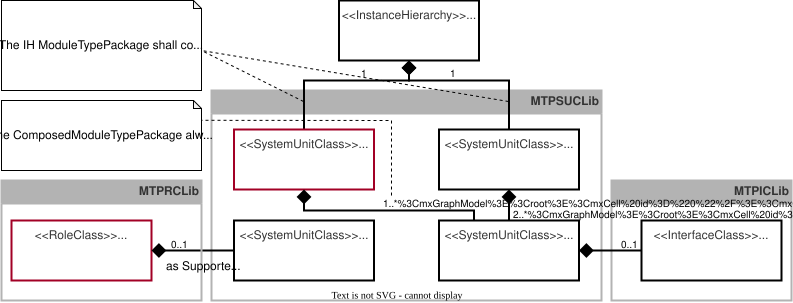

# Formatting Rules — 09_MTP Extensions

## 1. Figure Captions

- **Heading level:** `#####` (5th level)
- **Format:** `##### Figure {chapter}.{sequence}: {title}`
- **Numbering:** Chapter number + sequential number, separated by dot (e.g. `Figure 9.1`, `Figure 9.2`)
- **Position:** Directly **before** the image (``), no blank line between caption and image
- **Example:**
  ```markdown
  ##### Figure 9.1: Extension of the Manifest for Modeling Composed MTPs
  
  ```

## 2. Table Captions

- **Heading level:** `#####` (5th level)
- **Format:** `##### Table {chapter}.{sequence}: {title}` (AML identifiers in the title in *italics*)
- **Numbering:** Chapter number + sequential number, separated by dot (e.g. `Table 9.1`, `Table 9.2`)
- **Position:** Directly **before** the table, with one blank line between the caption and the `<table>` tag
- **Example:**
  ```markdown
  ##### Table 9.1: Model Definition of *SUC ComposedModuleTypePackage*

  <table>
    ...
  </table>
  ```

## 3. References to Figures and Tables

- **Format:** Markdown link `[Figure X.Y](#anchor)` or `[Table X.Y](#anchor)`
- **Anchor scheme:** Lowercase, spaces replaced by `-`, special characters and dots removed — matches the auto-generated Markdown heading anchor of the `#####` heading
- **Examples:**
  ```markdown
  [Figure 9.1](#figure-91-extension-of-the-manifest-for-modeling-composed-mtps)
  [Table 9.1](#table-91-model-definition-of-suc-composedmoduletypepackage)
  ```

## 4. Section Numbering

| Heading level | Markdown | Numbering | Example |
|---|---|---|---|
| Chapter | `##` | `X.Y` | `## 9.1 MTP Extension of the Manifest` |
| Subchapter | `###` | `X.Y.Z` | `### 9.1.1 Overview` |
| Subsection | `####` | **none** (title only) | `#### Extension of the Manifest for Modeling Composed MTPs` |
| Figure/Table caption | `#####` | See rules 1 & 2 | `##### Figure 9.1: ...` |

- 4th-level sections (`####`) have **no** number — descriptive title only.

## 5. Table Cell Alignment

- **All** cells (`<td>` and `<th>`) must have the attribute `align="left"`
- This applies to cells with `colspan` as well
- No exceptions — every cell in every table must be left-aligned
- **Example:**
  ```html
  <tr>
    <th align="left">Name</th>
    <td colspan="3" align="left"><strong>ComposedModuleTypePackage</strong></td>
  </tr>
  ```
