[< Previous](../09_MTP_Enhancements/README.md) | [Home](../README.md) | [Next >](../11_Choreography_Aspect/README.md)

## 10 Specification of the Logistics Aspect

### 10.1 Extension of Service Parameters

For the parameterization of logistics services, two new interface definitions are necessary in addition to the existing interface definitions for service parameters – *StructServParam* and *ArrayServParam* (see Figure 10.1 and Figure 10.2). 

[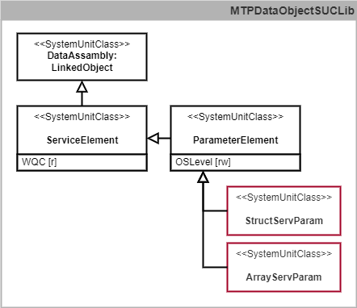](./Fig_10.1_SUCs_Parameters.png)

*Figure 10.1: SUCs of the logistics aspect for extending the service parameters*

[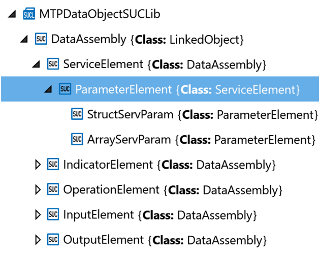](./Fig_10.2_Interfaces_Parameters.png)

*Figure 10.2: Interface definitions of the logistics aspect to extend the services parameters in the MTPDataObjectSUCLib*

Like all other MTP service parameters, these are defined in the MTPDataObjectSUCLib and derived from the *ParameterElement* specified in VDI/VDE/NAMUR 2658-4 [3]. The new interface definitions are described in Sections 10.8.1 and 10.8.2.

In addition, an extension of the *ServiceParameter* model definition with semantic information (in the form of *FunctionClassfinationAttributes*) is proposed. This extension is described in Section 10.7.1.

### 10.2 Extension of Indicator Elements

*StructView* and *ArrayView* are conceivable, similar to the indicator element interfaces for all existing MTP data types (see Figure 10.3 and Figure 10.4).

*Figure 10.3: SUCs of the logistics aspect for extending the indicator elements*

[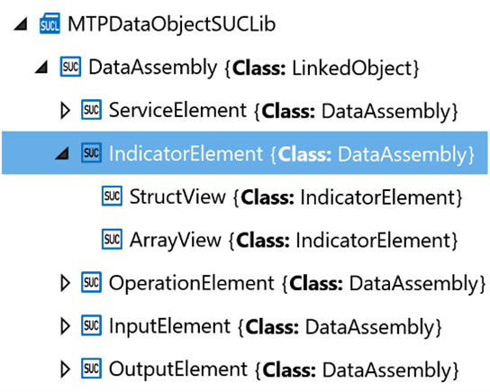](./Fig_10.4_Interfaces_Indicator_Elements.png)

*Figure 10.4: Interface definitions of the logistics aspect to extend the indicator elements in the MTPDataObjectSUCLib*

Like all other MTP indicator elements, these are defined in the MTPDataObjectSUCLib and derived from the *IndicatorElement* specified in VDI/VDE/NAMUR 2658-4 [3]. The two new interface definitions are described in Sections 10.8.3 and 10.8.4. The interfaces can partly be also used for the corresponding process value outputs and report values.

### 10.3 Extension of Operation Elements

*StructMan*, *StructManInt*, *ArrayMan* and *ArrayManInt* are conceivable, similar to the operation element interfaces for all existing MTP data types (see Figure 10.5 and Figure 10.6).

[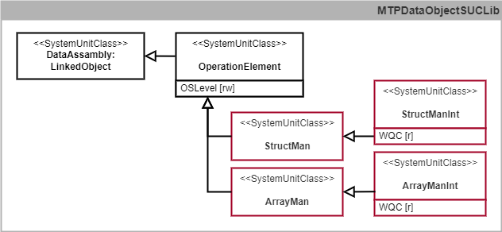](./Fig_10.5_SUCs_Operation_Elements.png)

*Figure 10.5: SUCs of the logistics aspect for extending the operation elements*

[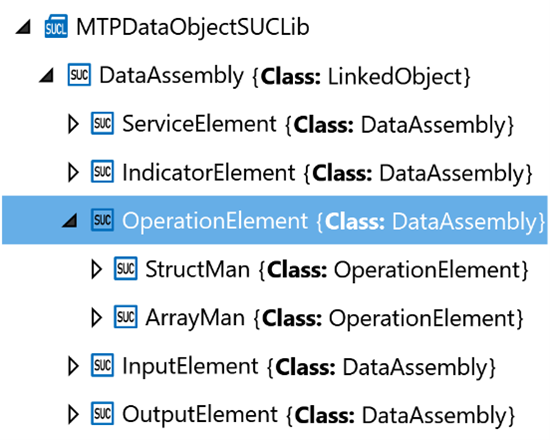](./Fig_10.6_Interfaces_Operation_Elements.png)

*Figure 10.6: Interface definitions of the logistics aspect to extend the operation elements in the MTPDataObjectSUCLib*

Like all other MTP operation elements, these are defined in the MTPDataObjectSUCLib. *StructMan* and *ArrayMan* are derived from the *OperationElement* specified in VDI/VDE/NAMUR 2658-4 [3]. *StructManInt* and *ArrayManInt* are derived from *StructMan* and *ArrayMan* respectively. The new interface definitions are described in Sections 10.8.5 to 10.8.8.

### 10.4 Extension of Process Value Inputs

*StructProcessValueInputs* and *ArrayProcessValueInputs* are conceivable, similar to the process value input interfaces for all existing MTP data types (see Figure 10.7 and Figure 10.8). 

[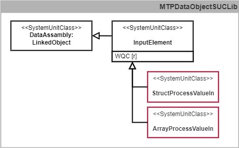](./Fig_10.7_SUCs_PVIn.png)

*Figure 10.7: SUCs of the logistics aspect for extending the process value inputs*

[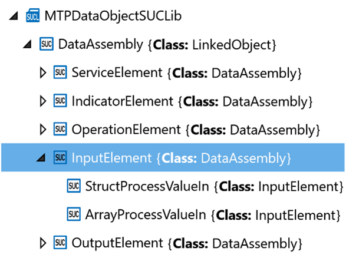](./Fig_10.8_Interfaces_PVIn.png)

*Figure 10.8: Interface definitions of the logistics aspect to extend the process value inputs in the MTPDataObjectSUCLib*

Like all other MTP process value inputs, these are defined in the MTPDataObjectSUCLib and derived from the *InputElement* specified in VDI/VDE/NAMUR 2658-4 [3]. The two new interface definitions are described in Sections 10.8.11 and 10.8.13.

### 10.5 Extension of Process Value Outputs

For the process value outputs of structured data types, the associated *IndicatorElement* (*StructView*, see Section 10.2) can be used as for all other MTP data types. For process value outputs of the array data type, a separate *ArrayProcessValueOutput* must be modelled since this is different from the associated *IndicatorElement* (*ArrayView*, see Section 10.2).

[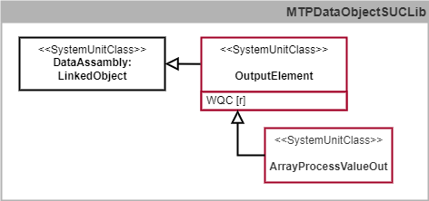](./Fig_10.9_SUCs_PVOut.png)

*Figure 10.9: SUCs of the logistics aspect for introducing the ArrayProcessValueOutput*

[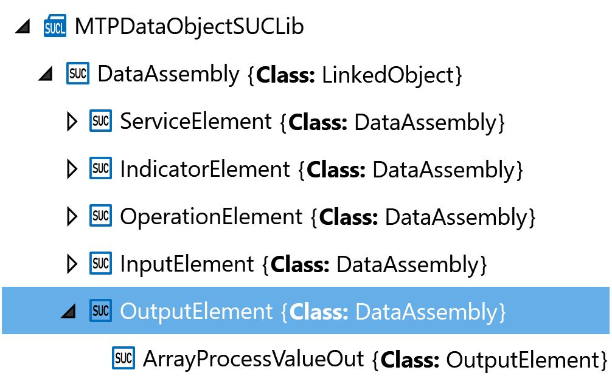](./Fig_10.10_Interfaces_PVOut.png)

*Figure 10.10: Interface definitions of the logistics aspect to introducing the ArrayProcessValueOutputs in the MTPDataObjectSUCLib*

The ArrayProcessValueOutput is defined in the MTPDataObjectSUCLib and derived from the newly defined OutputElement which in turn is derived from DataAssembly following VDI/VDE/NAMUR 2658-1 [8]. For more semantic clarity and with regard to possible further developments, it should be considered in the context of MTP standardization to explicitly model the process value outputs of all data types and to derive them from the OutputElement as well. The two new interface definition are described in Sections 10.8.14 and 10.8.15.

### 10.6 Specification of Logistics Interaction

The logistics interactions between a LEA and a LOL described in Section 3.2.3 are based on the principle of service interaction described in VDI/VDE/NAMUR 2658-4 [3]. However, new SUCs and RCs are required to represent the logistics interactions in the IH of an MTP, which are shown in Figure 10.11.

[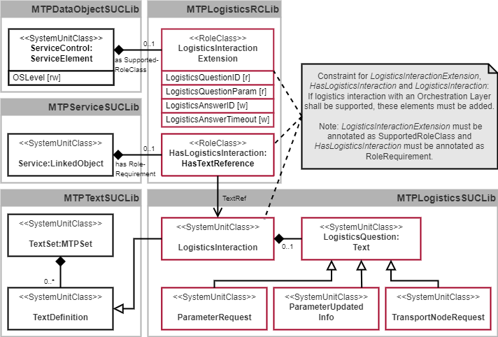](./Fig_10.11_SUCs_Logistics_Interaction.png)

*Figure 10.11: SUCs of the logistics aspect for the implementation of the logistics interaction*

The SUC *LogisticsInteraction* derived from the SUC *TextDefinition* specified in VDI/VDE/ NAMUR 2658-4 [3] organizes all necessary new model definitions. This primarily comprises a generic *LogisticsQuestion* derived from the SUC *Text* from VDI/VDE/NAMUR 2658-4. Three concrete logistics-specific questions are derived from the abstract *LogisticsQuestion* – *ParameterRequest*, *ParameterUpdatedInfo* and *TransportNodeRequest*. A LEA can provide each of these *LogisticsQuestions* either not at all or exactly once subordinated to its SUC *LogisticsInteraction*. 

These model definitions are based on the types of MTPLogisticsSUCLib shown in Figure 10.12.

[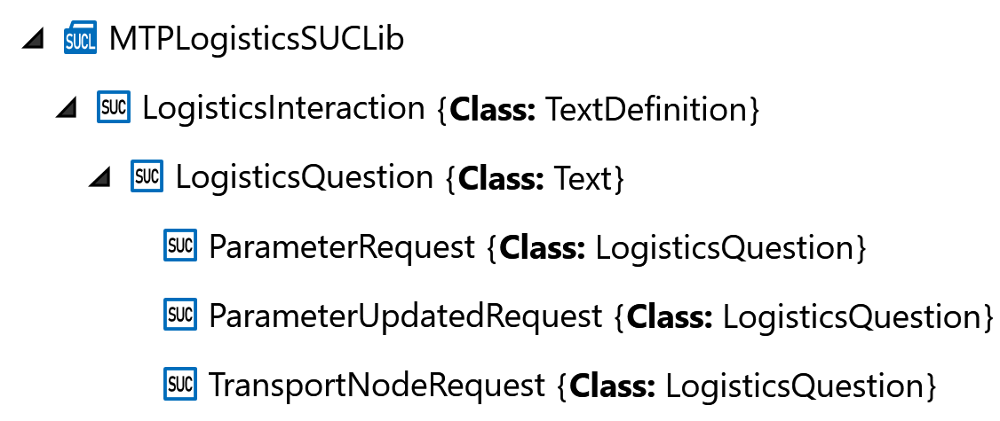](./Fig_10.12_Model_Logistics_Interaction.png)

*Figure 10.12: Model definitions of the logistics aspect for the implementation of the logistics interaction in the MTPLogisticsSUCLib*

In addition to these new model definitions, extensions to existing model and interface definitions are also necessary and must be inserted if logistics interaction is foreseen in the LEA. Such optional extensions are to be implemented in the MTP specification by means of RCs. In the present case, an extension of the *ServiceControl* interface definition (specified in VDI/VDE/NAMUR 2658-4 [3]) is necessary, which is implemented by the RC *LogisticsInteractionExtension*. In addition, it must be signalled at the model definition *Service* (specified in VDI/VDE/NAMUR 2658-4 [3]) by means of the RC *HasLogisticsInteraction* that a logistics interaction is assigned to the service. The RC *HasLogisticsInteraction* is derived from the RC *HasTextReference* from VDI/VDE/NAMUR 2658-4. A concrete logistics interaction is assigned to the service by means of a text reference to the model definition of the *LogisticsInteraction*. 

These extensions are defined in the MTPLogisticsRCLib shown in Figure 10.13.

[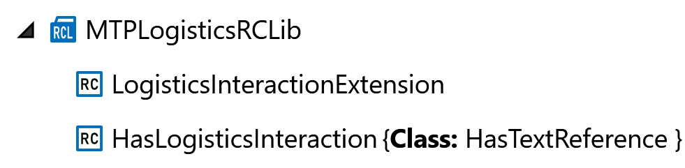](./Fig_10.13_RCs_Logistics_Interaction.png)

*Figure 10.13: Model and interface extensions of the logistics aspect for the implementation of the logistics interaction in the MTPLogisticsRCLib*

All model and interface definitions required for the logistics interaction are specified in Sections 10.7 and 10.8.

### 10.7 Model Definitions

#### 10.7.1 Extension of the ServiceParameter

The SUC *ServiceParameter* (see Table 10.1) defines the base class for MTP service parameters of all data types. This model definition is already specified in VDI/VDE/NAMUR 2658-4 [3] and is extended here by semantic information in form of a *FunctionClassificationAttribute*.

*Table 10.1: Model definition of ServiceParameter*

#### 10.7.2 LogisticsInteraction

The SUC *LogisticsInteraction* (see Table 10.2) organizes all necessary model definition for logistics interaction between a LEA and a LOL. This primarily includes the *LogisticsQuestions* available in the LEA. The *LogisticsInteraction* is derived from the *TextDefinition* specified in VDI/VDE/NAMUR 2658-4 [3]. This model definition is linked to the model definition *HasLogisticsInteraction* via a TextRef. The *LogisticsInteraction* follows a similar principle as the service interaction specified in the VDI/VDE/NAMUR 2658-4 with adaptations that are described in Section 3.2.3.

*Table 10.2: Model definition of LogisticsInteraction*

[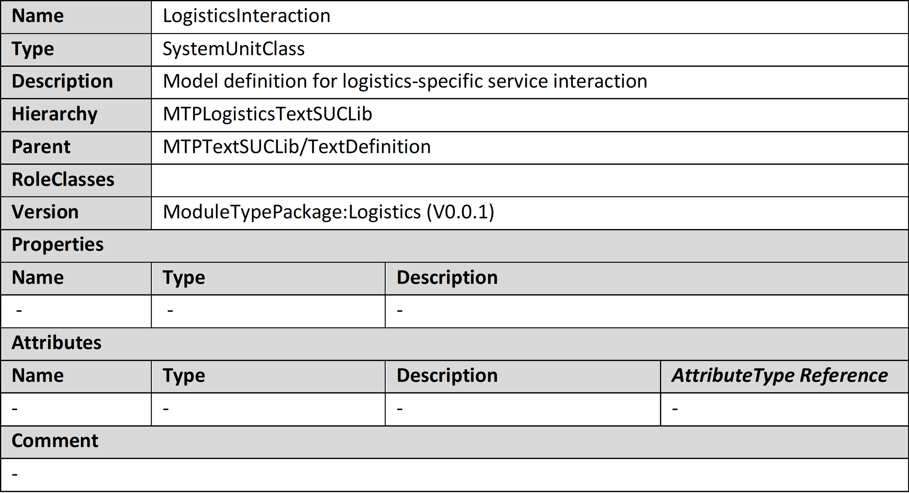](./Tab_10.2_Model_Logistics_Interaction.png)

#### 10.7.3	LogisticsQuestion

The SUC *LogisticsQuestion* (see Table 10.3) is an abstract class derived from the SUC *Text* from VD/VDE/NAMUR 2658-4 [3] representing a logistics-specific question that a LEA can pose to a LOL. There are three specific questions derived from the *LogisticsQuestion* so far – *ParameterRequest*, *ParameterUpdatedInfo*, and *TransportNodeRequest*. Each of these questions can occur either not at all or exactly once in a LEA.

*Table 10.3: Model definition of LogisticsQuestion*

#### 10.7.4	ParameterRequest

The SUC *ParameterRequest* (see Table 10.4) is derived from *LogisticsQuestion* and is used to request parameter sets from a LOL. In contrast to the *Question* specified in VDI/VDE/NAMUR 2658-4, no answers are modelled in the MTP for the *ParameterRequest*. Instead, a value in the number range of DINT is expected as an answer. Numbers greater than or equal to 0 indicate the index at which the LOL has written the requested parameter set to the parameter data storage of the equipment assembly. Thereby the limits of the array (minimum and maximum index) must not be exceeded or undercut. Value “-1” indicates that there is no response yet. Value “-2” indicates that an error occurred during the request. Other responses so far are not necessary and not valid.

*Table 10.4: Model definition of ParameterRequest*

#### 10.7.5	ParameterUpdatedInfo

The SUC *ParameterUpdatedInfo* (see Table 10.5) is derived from the *LogisticsQuestion* and is used to inform a LOL that a parameter set in the LEA has changed. In contrast to the *Question* specified in VDI/VDE/NAMUR 2658-4 [3], no *Answers* are modelled in the MTP for the *ParameterUpdatedInfo*. Instead, the value “1” is expected as confirmation that the LOL has acknowledged the parameter change. Value “-1” indicates that there is no response yet. Value -2 indicates that an error occurred during the request. Other responses so far are not necessary and not valid.

*Table 10.5: Model definition of ParameterUpdatedInfo*

#### 10.7.6	TransportNodeRequest

The SUC *TransportNodeRequest* (see Table 10.6) is derived from the *LogisticsQuestion* and is used to request the next transport node to be approached from a LOL. In contrast to the *Question* specified in VDI/VDE/NAMUR 2658-4 [3], no answers are modelled in the MTP for the *TransportNodeRequest*. Instead, a value in the number range of DINT is expected as answer. Numbers greater than 0 indicate the ID of the next transport node to be approached. Thereby, only values that correspond to the ID of a transport node in the respective logistics system may be returned as answer. Value “-1” indicates that there is no response yet. Value “-2” indicates that an error occurred during the request. Other responses so far are not necessary and not valid.

*Table 10.6: Model definition of TransportNodeRequest*

#### 10.7.7	HasLogisticsInteraction

The RC *HasLogisticsInteraction* (see Table 10.7) is derived from the RC *HasTextReference* specified in the VDI/VDE/NAMUR 2658-4 [3]. *HasLogisticsInteraction* is used to assign a logistics interaction to the model definition *Service* (specified in VDI/VDE/NAMUR 2658-4 [3]). For this purpose, a *LogisticsInteraction* interface definition is referenced by means of a text reference. If a logistics interaction of the LEA is intended, exactly one *HasLogisticsInteraction* is to be assigned to the service as RoleRequirement, otherwise none. 

*Table 10.7: Model definition of HasLogisticsInteraction*

### 10.8 Interface Definitions

#### 10.8.1	StructServParam

The SUC *StructServParam* (see Table 10.8) is used to pass parameters of a user-defined structured data type from a LOL to a LEA.

*Table 10.8: Interface definition of StructServParam*

The special characteristic of this interface definition is the use of a user-defined data type. Figure 10.14 shows how such a data type can be modelled. The rules for modelling complex data types from VDI/VDE/NAMUR 2658-1 [8] are used.

[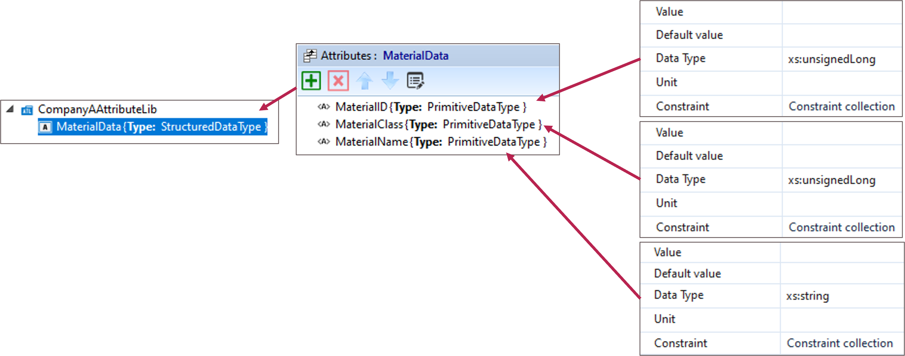](./Fig_10.14_Complex_Data_Types.png)

*Figure 10.14: Modelling a custom data type*

The used complex data type must be derived from the AT *StructuredDataType* defined in VDI/VDE/NAMUR 2658-1 [8]. When using this interface, a user-defined ATL (here: CompanyAAttributeLib) must be created. Within this ATL, the structured data type to be used later in the instance of the *StructServParam* interface definition must be specified. With the assignment of this user-defined AT to the attribute *VType* of the *StructServParam* the used structured data type is defined. This data type is then expected behind the variables *VExt*, *VInt*, *VOp*, *VReq* and *VOut*. The setting of a parameter of the *StructServParam* type is done via the access channels Automatic Internal, Automatic External or Operator in the same way as the setting of all other service parameters defined in VDI/VDE/NAMUR 2658-4 [3].

#### 10.8.2	ArrayServParam

The SUC *ArrayServParam* (see Table 10.9) is used for the LOL to manage an array located in a LEA.

*Table 10.9: Interface definition of ArrayServParam*

The challenge with this interface definition is the management of an array of variables with undefined length. This is often not possible in common automation solutions or only under certain conditions. Therefore, a multiplexer mechanism is used, which can access an array of arbitrary length via a structurally static interface. 

With the variables *IndexExt*, *IndexInt* and *IndexOp* a pointer-like reference to an array element is defined considering the operation mode. Depending on the active access channel, the variable *IndexCur* is set to one of these three values. The variables of all three access channels are checked to see if they lie in the range between *IndexMin* and *IndexMax*. If an index is set that lies outside this range, the last valid index remains, and the Worst Quality Code (*WQC*) is set to "Out of Specification".

Depending on the value of the *IndexCur* variable, the array element with the corresponding index is selected for editing. The selected array element is processed according to the parameter transfer mechanism specified in VDI/VDE/NAMUR 2658-4 [3]. *VOut* always displays the set value of the array element located at the position of the array defined by *IndexCur*. It should be noted that this value does not necessarily have to match the value currently used in the LEA.

All primitive data types provided in the MTP concept as well as all complex data types according to the conventions from VDI/VDE/NAMUR 2658-1 [8] can be used as data type for the individual array elements. The selection of the data type used is made via the *VType* variable. In the case of a structured data type, the conventions described in Section 10.8.1 for creating a user-defined data type must be followed.

#### 10.8.3	StructView

The SUC StructView (see Table 10.10) is used for a LOL to display a LEA variable of a user-defined structured data type.

*Table 10.10: Interface definition of StructView*

The special feature of this interface is the use of a user-defined data type. The modelling and use of such a type has already been described in Section 10.8.1 in the context of the *StructServParam* and shall be done in the same way for the *StructView* interface.

#### 10.8.4	ArrayView

The SUC *ArrayView* (see Table 10.11) is used for the LOL to view the value at a specific position of an array located in a LEA.

*Table 10.11: Interface definition of ArrayView*

[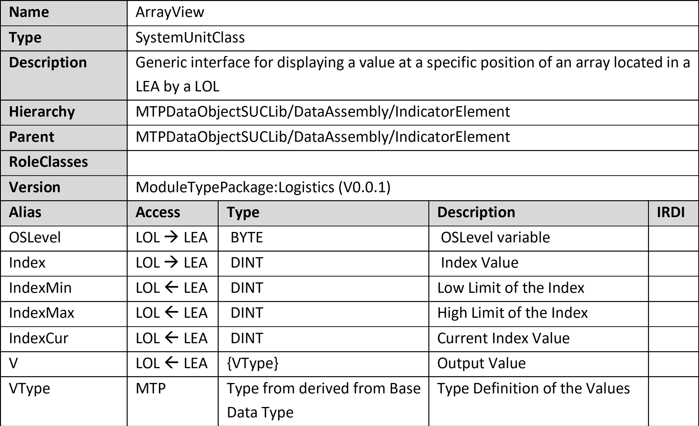](./Tab_10.11_Interface_ArrayView.png)

Similar to the description in Section 10.8.2 for the *ArrayServParam*, the challenge for this interface is to access an array within a LEA, which can have an arbitrary length. As described in Section 10.8.2, access to this array should also be done in an index-based manner in case of the *ArrayView* interface.

The array position to be displayed is selected via the *Index* variable. The *IndexMin* and *IndexMax* variables indicate the upper and lower limits of the array. The *IndexCur* variable indicates the currently selected index, the value of the array at this point is displayed in *V*. *VType* defines the data type that all array elements have. This can be a primitive data type, or a user-defined data type as introduced in Section 10.8.1.

#### 10.8.5	StructMan

The SUC *StructMan* (see Table 10.12) is used for the LOL to manipulate a LEA variable of a user-defined structured data type.

*Table 10.12: Interface definition of StructMan*

*VMan* is used to enter the desired value of the variable. Following the concept specified in VDI/VDE/NAMUR 2658-3 [5], *VRbk* is used to verify the communication between a LOL and the StructMan interface within a LEA and displays the raw value communicated to the LEA. *VOut* displays the value given to a further LEA internal block possibly with limitations applied. *VFbk* variable is used to display the current value of the structure affected by the *StructMan* interface. The special feature of this interface is the use of a user-defined data type. The modelling and use of such a type has already been described in Section 10.8.1 in the context of the *StructServParam* and shall be done in the same way for the *StructMan* interface.

#### 10.8.6	StructManInt

The SUC *StructManInt* (see Table 10.13) is used for manipulating a LEA variable of a user-defined structured data type from inside the LEA or by the LOL.

*Table 10.13: Interface definition of StructManInt[^1]*

The *StructManInt* interface extends the *StructMan* interface, described in Section 10.8.5, by the internal value specification and a source mode in accordance with VDI/VDE/NAMUR 2658-3 [5]. If the internal access channel is selected, a LEA internal value is used instead of the external value setting. Apart from that, the function of this interface is the same as that of the *StructMan* interface.

#### 10.8.7	ArrayMan

The SUC *ArrayMan* (see Table 10.14) is used for the LOL to manipulate a value at a specific position of an array located in a LEA.

*Table 10.14: Interface definition of ArrayMan*

Similar to the description in Section 10.8.2 for the *ArrayServParam*, the challenge for this interface is to access an array within a LEA, which can have an arbitrary length. As described in Section 10.8.2, access to this array should also be done in an index-based manner in the case of the *ArrayMan* interface.

The array position to be manipulated is selected via the *Index* variable. The *IndexMin* and *IndexMax* variables indicate the upper and lower limits of the array. The *IndexCur* variable indicates the currently selected index of variable to be manipulated. The *VMan* variable is used to enter the desired value of this variable. Following the concept specified in VDI/VDE/NAMUR 2658-3 [5], *VRbk* is used to verify the communication between a LOL and the *ArrayMan* interface within a LEA and displays the raw value of the variable communicated to the LEA. When a new Index is selected, the *VMan* and *VRbk* variables are set to the value at the selected position in the array. *VOut* displays the value given to a further LEA internal block possibly with limitations applied. *VFbk* variable is used to display the current value of the structure affected by the *ArrayMan* interface. *VType* defines the data type that all array elements have. This can be a primitive data type, or a user-defined data type as introduced in Section 10.8.1.

#### 10.8.8	ArrayManInt

The SUC *ArrayManInt* (see Table 10.15) is used for the LOL or for a LEA internal logic to manipulate a value at a specific position of an array located in a LEA.

*Table 10.15: Interface definition of ArrayManInt[^2]*

The *ArrayManInt* interface extends the *ArrayMan* interface, described in Section 10.8.7, by the internal value specification and a source mode in accordance with VDI/VDE/NAMUR 2658-3 [5]. If the internal access channel is selected, a LEA internal value is used instead of the external value setting. Apart from that, the function of this interface is the same as that of the *ArrayMan* interface.

#### 10.8.9	StructReportValue

According to VDI/VDE/NAMUR 2658-4 [3], the same interface definitions are used for report values as for the corresponding *IndicatorElements*. However, the value of a report value can be frozen triggered by a variable on the *ServiceControl* interface. Optionally, a *MissedValueFlag* can be added to the interface definition of a report value. This principle is also adopted for the *StructReportvalue* interface definition. This is based on the *StructView* interface definition described in Section 10.8.3.

#### 10.8.10 ArrayReportValue

According to VDI/VDE/NAMUR 2658-4 [3], the same interface definitions are used for report values as for the corresponding *IndicatorElements*. However, the value of a report value can be frozen triggered by a variable on the *ServiceControl* interface. Optionally, a *MissedValueFlag* can be added to the interface definition of a report value. This principle is also adopted for the *ArrayReportValue* interface definition. This is based on the *ArrayView* interface definition described in Section 10.8.4. 

If several or all values of an array shall be read out for documentation purposes, several, or all indices between *IndexMin* and *IndexMax* have to be set at the *ArrayReportValue* interface one after the other by the LOL. Afterwards they can be stored one after the other.

#### 10.8.11 StructProcessValueIn

The SUC *StructProcessValueIn* (see Table 10.16) is used for a LEA to access the value of structured data type of another LEA.

*Table 10.16: Interface definition of StructProcessValueIn*

In the *V* variable the desired value is transferred. The special feature of this interface is the use of a user-defined data type. The modelling and use of such a type has already been described in Section 10.8.1 in the context of the *StructServParam* and shall be done in the same way for the *StructProcessValueIn* interface.

#### 10.8.12 StructProcessValueOut

According to VDI/VDE/NAMUR 2658-4 [3], the interface definitions of the *IndicatorElement* or its derivatives are used for process value outputs. Accordingly, for *StructProcessValueOuts* the *StructView* interface definition specified in Section 10.8.3 is used.

#### 10.8.13 ArrayProcessValueIn

The SUC *ArrayProcessValueIn* (see Table 10.17) is used for a LEA to access a value at a specific position of an array located in another LEA.

*Table 10.17: Interface definition of ArrayProcessValueIn*

Similar to the description in Section 10.8.2 for the *ArrayServParam*, the challenge for this interface is to access an array within a LEA, which can have an arbitrary length. As described in Section 10.8.2, access to this array should also be done in an index-based manner in case of the *ArrayProcessValueIn* interface.

The array position to be displayed is selected via the *Index* variable. The *IndexMin* and *IndexMax* variables indicate the upper and lower limits of the array. The *IndexCur* variable indicates the currently selected index, the value of the array at this point is displayed in *V*. *VType* defines the data type that all array elements have. This can be a primitive data type, or a user-defined data type as introduced in Section 10.8.1.

***Note 1:*** So far, no use case exists for this interface definition, it is only listed here for the sake of completeness. If a use case for such an interface is identified, it should be implemented as shown in Table 10.17.

***Note 2:*** This interface definition differs from all other interfaces derived from InputElement interface definitions, as it includes information flows from the LEA to the LOL. This is not intended so far.

#### 10.8.14 OutputElement

The SUC *OutputElement* (see Table 10.18) is an abstract interface from which specific process value outputs of different data type can be derived. The interface definition itself fulfils only an organizational purpose and does not involve any own variables.

*Table 10.18: Interface definition of OutputElement*

***Note:*** Although the *IndicatorElements* of all other MTP data types and of the structured data type have the same interface definitions as the corresponding process value outputs, it may be useful to model separate process value output interfaces in the interest of unambiguous semantics. These should then also be derived from this newly specified *OutputElement*.

#### 10.8.15 ArrayProcessValueOut

The SUC *ArrayProcessValueOut* (see Table 10.19) is used for a LEA to make the values of a LEA-internal array available to other LEAs.

*Table 10.19: Interface definition of ArrayProcessValueOut*

The *ArrayProcessValueOut* interface definition works nearly the same as the *ArrayView* interface definition (see Section 10.8.4). The only difference is that the *ArrayProcessValueOut* interface definition does not contain an *OSLevel* variable as it is always controlled by another LEA. When considering the use of the *ArrayProcessValueOut* interface the notes on the *ArrayProcessValueIn* (see Section 10.8.13) also shall be taken into account.

#### 10.8.16 LogisticsInteractionExtension

The RC *LogisticsInteractionExtension* (see Table 10.20) extends the *ServiceControl* interface definition (from VDI/VDE/NAMUR 2658-4 [3]) with the variables that are necessary for logistics interactions. If a logistics interaction is provided in the LEA, exactly one *LogisticsInteractionExtension* must be assigned to the *ServiceControl* as SupportedRoleClass, otherwise none.

*Table 10.20: Interface definition of LogisticsInteractionExtension*

A logistics interaction follows a similar principle to the service interaction described in VDI/VDE/NAMUR 2658-4 [3]. However, values in the value range of DINT (instead of DWORD) are provided for the IDs of the questions (*LogisticsQuestionID*) and answers (*LogisticsAnswerID*), whereby the value 0 and also negative values can be valid IDs. The value -1 signals that currently no question or no answer is pending. By means of the *LogisticsQuestionParam* (in the same way as by means of the *InteractAddInfo* from the VDI/VDE/NAMUR 2658-4 [3]) an additional information can be added to a request. The variable *LogisticsAnswerTimeout* allows the input of a time period, which the LEA should wait for the answer of a LOL. After this time has elapsed, the LEA can execute an alternative program sequence without the response of the LOL, if necessary. Setting the timeout to the value 0 is interpreted as deactivating the timeout function.

[< Previous](../09_MTP_Enhancements/README.md) | [Home](../README.md) | [Next >](../11_Choreography_Aspect/README.md)

[^1]: The *VMan* variable is inherited from the *StructMan* interface. However, its meaning changes slightly in this case since it is only used when the *SourceMode* is set to manual.

[^2]: The *VMan* variable is inherited from the *ArrayMan* interface. However, its meaning changes slightly in this case since it is only used when the SourceMode is set to manual.