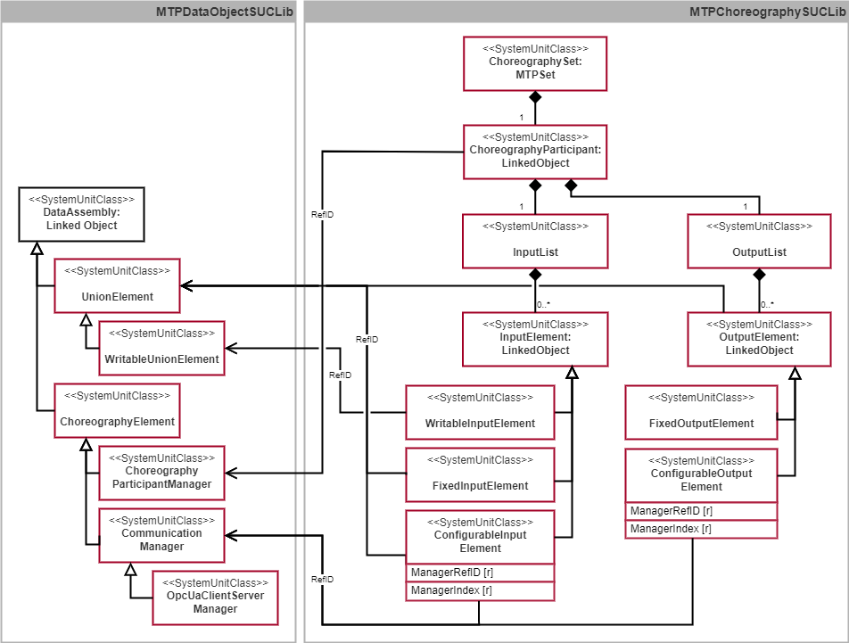
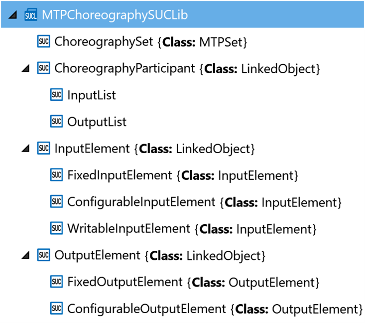
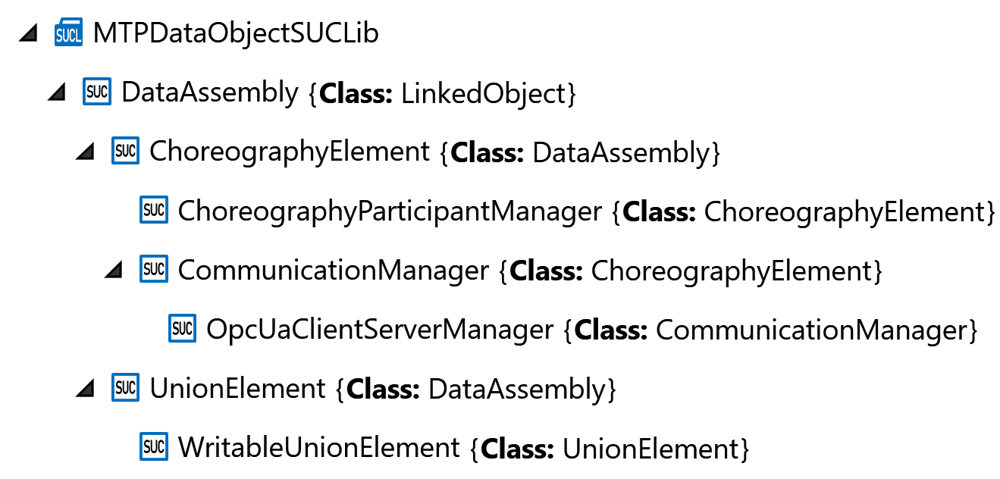

[< Previous](../10_Logistics_Aspect/README.md) | [Home](../README.md) | [Next >](../12_Transport_Aspect/README.md)

## 11 Specifications of the Choreography Aspect

For mapping the choreography aspect in the IH of an MTP, the SUCs shown in Figure 11.1 have been developed. 

*Figure 11.1: SUCs of the choreography aspect*

The *ChoreographySet* is derived from the abstract SUC *MTPSet*, which is specified in VDI/VDE/NAMUR 2658-1 [8]. The *ChoreographySet* always contains exactly one *ChoreographyParticipant* derived from the *LinkedObject* specified in VDI/VDE/NAMUR 2658-1 [8]. The *ChoreographyParticipant* organizes all further model definitions necessary for the choreography aspect. These are in the first instance exactly one *InputList* and one *OutputList* containing the incoming and outgoing system variables of the choreography participant. Any number of *InputElements* or *OutputElements* can be included in these lists. These are derived from the *LinkedObject* and each represent an incoming or outgoing system variable. The *InputElements* and *OutputElements* exist in a statically defined (*FixedInputElement* or *FixedOutputElement*) and in a configurable (*ConfigurableInputElement* or *ConfigurableOutputElement*) variant each. In addition, there is a *WritableInputElement* which is passive and can be written to from another LEA.

These model definitions are based on the types of MTPChoreographySUCLib shown in Figure 11.2.

*Figure 11.2: Model definitions of the choreography aspect in MTPChoreographySUCLib*

In addition, new interface definitions are required for the implementation of choreographies, which are to be specified in the MTPDataObjectSUCLib (see Figure 11.1 and Figure 11.3). The *UnionElement* and the *ChoreographyElement* are directly derived from the *DataAssembly*, which is specified in VDI/VDE/NAMUR 2658-1 [8]. The *ChoreographyParticipantManager* and the *CommunicationManager* are in turn derived from the *ChoreographyElement*. As a specific derivation of the *CommunicationManager*, only the *OpcUaClientServerManager* has been implemented so far; others are conceivable. Especially for *WritableInputLements*, a *WritableUnionElement* is foreseen, which is derived from *UnionElement*. Interface definitions and their associated model definitions are linked by RefID relations.

*Figure 11.3: Interface definitions of the choreography aspect in MTPDataObjectSUCLib*

All model and interface definitions necessary for the choreography aspect are specified in the following Sections 11.1 and 11.2.

### 11.1 Model Definitions

#### 11.1.1	ChoreographySet

The SUC *ChoreographySet* (see Table 11.1) as a new aspect set of the MTP specification is derived from *MTPSet* and organizes all necessary model definitions to describe an LEA as participant of a choreography.

*Table 11.1: Model definition of ChoreographySet*

#### 11.1.2	ChoreographyParticipant

The SUC *ChoreographyParticipant* (see Table 11.2) describes a LEA a choreography participant. The *ChoreographyParticipantManager* interface definition is assigned to this model definition via RefID relation, which can be used to pass the choreography-relevant configuration to the participant.

*Table 11.2: Model definition of ChoreographyParticipant*

#### 11.1.3	InputList

The SUC *InputList* (see Table 11.3) organizes all incoming system variables that are relevant for the adaptive logic of a choreography participant. The MTP of a choreography participant always contains exactly one *InputList*.

*Table 11.3: Model definition of InputList*

#### 11.1.4	InputElement

The SUC *InputElement* (see Table 11.4) describes an incoming system variable that is relevant for the adaptive logic of a choreography participant. This can be a statically defined internal process variable of the participant or a configurable process variable the participant obtains from another participant.

*Table 11.4: Model definition of InputElement*

#### 11.1.5	FixedInputElement

The SUC *FixedInputElement* (see Table 11.5) is derived from the *InputElement* and describes a statically defined incoming system variable that is provided by the choreography participant itself. A *FixedInputElement* is assigned to the *UnionElement* interface definition via RefID relation.

*Table 11.5: Model definition of FixedInputElement*

#### 11.1.6	ConfigurableInputElement

The SUC *ConfigurableInputElement* (see Table 11.6) is derived from the *InputElement* and describes a configurable incoming system variable that the choreography participant obtains from another choreography participant. A *ConfigurableInputElement* is assigned to a *CommunicationManager* interface definition via RefID relation. A *ManagerIndex* is used to refer to a specific communication element (e.g., reader) within the manager. In this way, the communication is configured to exchange the necessary system variable. The interpretation for the *ManagerIndex* depends on the concrete derivation of the *CommunicationManager*. In the case of the *OpcUaClientServer* manager, e.g., this is the index of the used reader. A *FixedInputElement* is assigned to the *UnionElement* interface definition via RefID relation.

*Table 11.6: Model definition of ConfigurableInputElement*

#### 11.1.7	WritableInputElement

The SUC *WritableInputElement* (see Table 11.7) is derived from the *InputElement* and describes an incoming system variable to which values can be written by another choreography participant. A *WritableInputElement* is assigned to a *WritableUnionElement* interface definition via RefID relation.

*Table 11.7: Model definition of WritableInputElement*

#### 11.1.8	OutputList

The SUC *OutputList* (see Table 11.8) organizes all outgoing system variables of the adaptive logic of a choreography participant. The MTP of a choreography participant always contains exactly one *OutputList*.

*Table 11.8: Model definition of OutputList*

#### 11.1.9	OutputElement

The SUC *OutputElement* (see Table 11.9) describes an outgoing system variable from the adaptive logic of a choreography participant. This can be a statically defined internal process variable of the participant, or a configurable process variable the participant sends to another participant. An *OutputElement* is assigned to the *UnionElement* interface definition via RefID relation.

*Table 11.9: Model definition of OutputElement*

#### 11.1.10 FixedOutputElement

The SUC *FixedOutputElement* (see Table 11.10) is derived from the *OutputElement* and describes a statically defined outgoing system variable that is used by the internal program of the choreography participant.

*Table 11.10: Model definition of FixedOutputElement*

#### 11.1.11 ConfigurableOutputElement

The SUC *ConfigurableOutputElement* (see Table 11.11) is derived from the *OutputElement* and describes a configurable outgoing system variable that the choreography participant sends to another choreography participant. A *ConfigurableOutputElement* is associated with a *CommunicationManager* interface definition via RefID relation. A *ManagerIndex* is used to refer to a specific communication element (e.g., writer) within the manager. In this way, the communication is configured to exchange the necessary system variable. The interpretation for the *ManagerIndex* depends on the concrete derivation of the *CommunicationManager*. In the case of the *OpcUaClientServerManager*, e.g., this is the index of the used writer.

*Table 11.11: Model definition of ConfigurableOutputElement*

### 11.2 Interface Definitions

#### 11.2.1	ChoreographyElement

The SUC *ChoreographyElement* (see Table 11.12) is an abstract class derived from the *DataAssembly* interface specified in VDI/VDE/NAMUR 2658-1 [8]. The choreography-relevant interface definitions *ChoreographyParticipantManager* and *CommunicationManager* are derived from the *ChoreographyElement*.

*Table 11.12: Interface definition of ChoreographyElement*

#### 11.2.2	ChoreographyParticipantManager

The SUC *ChoreographyParticipantManager* (see Table 11.13) is derived from the *ChoreographyElement* and is used to pass the choreography-relevant configuration to a choreography participant. This interface definition is assigned to a *ChoreographyParticipant* in the *ChoreographySet* via RefID relation.

*Table 11.13: Interface definition of ChoreographyParticipantManager*

#### 11.2.3	CommunicationManager

The SUC *CommunicationManager* (see Table 11.14) is an abstract class derived from the *ChoreographyElement*. It is to be understood as a generic interface definition for the communication between different Choreography participants. In order to use the *CommunicationManager* interface definition, a concrete manager for a specific communication technology must be derived from it. So far, only the *OpcUAClientServerManager* has been implemented for communication via OPC UA Client/Server; others will be developed in the future.

*Table 11.14: Interface definition of CommunicationManager*

#### 11.2.4	OpcUaClientServerManager

The SUC *OpcUaClientServerManager* (see Table 11.15) is derived from the abstract *CommunicationManager*. It is used to configure the OPC UA Client/Server communication between different choreography participants and the necessary system variables to be exchanged. The manager is assigned to the model definition of *ConfigurableInputElements* and *ConfigurableOutputElements* in the *ChoreographySet* via RefID relation. In addition, a *ManagerIndex* is specified by each of the model definitions, which refers to a concrete communication element within the manager. In the case of the *OpcUaClientServerManager*, these communication elements are the OPC UA readers and writers managed by the manager, which are referenced by means of their index. The readers are each assigned to a *ConfigurableInputElement* and the writers are each assigned to a *ConfigurableOutputElement*.

*Table 11.15: Interface definition of OpcUaClientServerManager*

#### 11.2.5	UnionElement

The SUC *UnionElement* (see Table 11.16) is used to display the value of an *InputElement* or *OutputElement*. Accordingly, the *UnionElement* is assigned to these model definitions by means of RefID relation.

*Table 11.16: Interface definition of UnionElement*

*VReal*, *VDInt*, *VDWord*, *VBool* and *VString* variables are used to display the desired value. *DataType* variable specifies which data type is activated at the moment and as a consequence which of the previously mentioned variables shall be interpreted. Thus, the *UnionElement* can only display one value of a defined data type at a time. *VQC* provides information about the quality code of the displayed value.

#### 11.2.6	WritableUnionElement

The SUC *WritableUnionElement* (see Table 11.17) is derived from *UnionElement* and used to write a value to a *WritableInputElement*. Accordingly, the *WritableUnionElementis* assigned to this model definition by means of RefID relation. 

*Table 11.17: Interface definition of WritableUnionElement*

*VReal*, *VDInt*, *VDWord*, *VBool* and *VString* variables are used to enter the desired value. *DataType* variable specifies which data type is activated at the moment and as a consequence which of the previously mentioned variables shall be used in the LEA program. Thus, the *WritableUnionElement* only accepts one value of a defined data type at a time. *VQC* can be used to enter information about the quality code of the entered value.

[< Previous](../10_Logistics_Aspect/README.md) | [Home](../README.md) | [Next >](../12_Transport_Aspect/README.md)