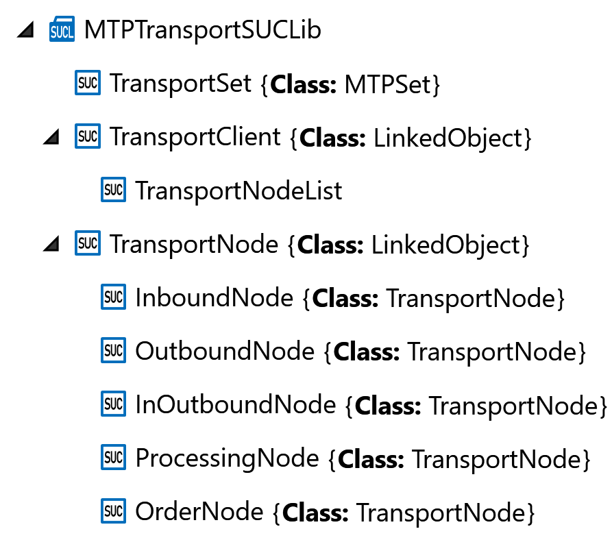

[< Previous](../11_Choreography_Aspect/README.md) | [Home](../README.md) | [Next >](../13_References/README.md)

## 12 Specifications of the Transport Aspect

To model the transportation aspect in the IH of an MTP, the SUCs shown in Figure 12.1 have been developed.

*Figure 12.1: SUCs of the transport aspect*

The *TransportSet* is derived from the abstract SUC *MTPSet*, which is specified in VDI/VDE/NAMUR 2658-1 [8]. The *TransportSet* always contains exactly one *TransportClient*, derived from the *LinkedObject* specified in VDI/VDE/NAMUR 2658-1 [8]. The *TransportClient* organizes all further model definitions necessary for the transport aspect. This is in first instance exactly one list *TransportNodes*, which contains all transport nodes available in the LEA. Subordinate to this list any number of *TransportNode* model definitions is listed. These are derived from the *LinkedObject* and represent one available transport node each. There are model definitions for 5 different specific transport nodes derived from the abstract *TransportNode* - *InboundNode*, *OutboundNode*, *InOutboundNode*, *ProcessingNode* and *OrderNode*.

These model definitions are based on the types of MTPTransportSUCLib shown in Figure 12.2.

*Figure 12.2: Model definitions of the transport aspect in MTPTransportSUCLib*

In addition, new interface definitions are required for the implementation of flexible transport processes, which must be specified in the MTPDataObjectSUCLib (see Figure 12.1 and Figure 12.3). The *TransportElement* is derived directly from the *DataAssembly* specified in VDI/VDE/NAMUR 2658-1 [8]. The *TransportClientManager* and the *TransportNodeManager* are in turn derived from the *TransportElement*. The interface definitions and their associated model definitions are linked via RefID relations. The *TransportClientManager* is a generic client that is used to establish a communication connection between a LEA and a transport system. Different communication technologies can be used for this purpose. So far, only one variant based on OPC UA Client/Server has been implemented. The associated interface definition is the *OpcUaCSTransportClientManager*, which is derived from the generic *TransportClientManager*.

*Figure 12.3: Interface definitions of the transport aspect in MTPDataObjectSUCLib*

All model and interface definitions necessary for the transport aspect are specified in the following Sections 12.1 and 12.2.

### 12.1 Model Definitions

#### 12.1.1	TransportSet

The SUC *TransportSet* (see Table 12.1) as a new aspect set of the MTP specification contains all necessary model definitions to enable a LEA to interact with a flexible transport system.

*Table 12.1: Model definition of TransportSet*

#### 12.1.2	TransportClient

The SUC *TransportClient* (see Table 12.2) describes the client of a LEA for the communication connection to a flexible transport system. RefID relation is used to assign the *TransportClientManager* interface definition to this model definition, which can be used to configure the necessary communication connection to the transport system.

*Table 12.2: Model definition of TransportClient*

#### 12.1.3	TransportNodes 

The SUC *TransportNodes* (see Table 12.3) organizes all transport nodes available in a LEA within one list. The MTP of a LEA that is capable of interacting with flexible transport systems always contains exactly one *TransportNodes* list.

*Table 12.3: Model definition of TransportNodes*

#### 12.1.4	TransportNode

The SUC *TransportNode* (see Table 12.4) is an abstract model definition to describe a transport node available in a LEA. As of today, 5 concrete types of transport nodes are derived from this model definition – *InboundNode*, *OutboundNode*, *InOutBoundNode*, *ProcessingNode* and *OrderNode*. A *TransportNode* is assigned to the *TransportNodeManager* interface definition via RefID relation, which enables the assignment of transport orders to the transport node.

*Table 12.4: Model definition of TransportNode*

#### 12.1.5	InboundNode

The SUC *InboundNode* (see Table 12.5) is derived from *TransportNode* and describes a transport node for transferring an object from a transport system to the LEA.

*Table 12.5: Model definition of InboundNode*

#### 12.1.6	OutboundNode

The SUC *OutboundNode* (see Table 12.6) is derived from *TransportNode* and describes a transport node for transferring an object from the LEA to a transport system.

*Table 12.6: Model definition of OutboundNode*

#### 12.1.7	InOutboundNode

The SUC *InOutboundNode* (see Table 12.7) is derived from *TransportNode* and describes a transport node for transferring objects between the LEA and a transport system in both directions.

*Table 12.7: Model definition of InOutboundNode*

#### 12.1.8	ProcessingNode

The SUC *ProcessingNode* (see Table 12.8) is derived from *TransportNode* and describes a transport node for processing an object by the LEA without taking this object from the transport system.

*Table 12.8: Model definition of ProcessingNode*

#### 12.1.9	OrderNode

The SUC *OrderNode* (see Table 12.9) is derived from *TransportNode* and describes a node for indicating transport demands and initializing corresponding transport processes.

*Table 12.9: Model definition of OrderNode*

### 12.2 Interface Definitions

#### 12.2.1	TransportElement

The SUC *TransportElement* (see Table 12.10) is an abstract class that is derived from *DataAssembly*. The transport-relevant interface definitions *TransportClientManager* and *TransportNodeManager* are derived from *TransportElement*. The *TransportElement* interface definition cannot be used independently, but only in the form of one of its derivations.

*Table 12.10: Interface definition of TransportElement*

#### 12.2.2	TransportClientManager

The SUC *TransportClientManager* (see Table 12.11) is derived from the *TransportElement* and is an abstract interface definition for configuring the communication connection between the LEA and a transport system. In order to implement this interface definition, a concrete manager must be derived from it. So far, only the *OpcUaCSTransportClientManager* has been implemented. The *TransportClientManager* and thus also its derivatives are assigned to a *TransportClient* in the *ChoreographySet* via RefID relation.

*Table 12.11: Interface definition of TransportClientManager*

#### 12.2.3	OpcUaCSTransportClientManager

The SUC *OpcUaCSTransportClientManager* (see Table 12.12) is derived from the *TransportClientManager* and is used to configure an OPC UA Client/Server communication connection between the LEA and a transport system.

*Table 12.12: Interface definition of OpcUaCSTransportClientManager*

#### 12.2.4	TransportNodeManager

The SUC *TransportNodeManager* (see Table 12.13) is derived from the *TransportElement* and is used to assign a transport order to a specific transport node. This interface definition is assigned to a *TransportNode* in the *ChoreographySet* via RefID relation.

*Table 12.13: Interface definition of TransportNodeManager*

[< Previous](../11_Choreography_Aspect/README.md) | [Home](../README.md) | [Next >](../13_References/README.md)