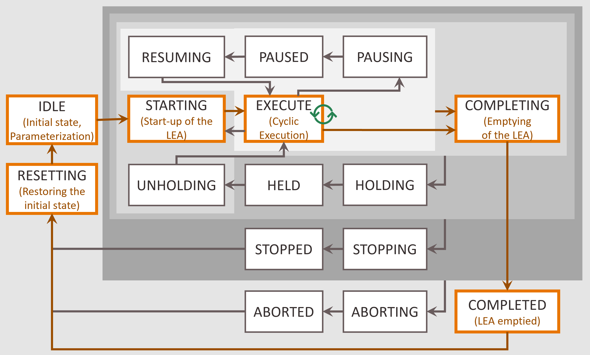
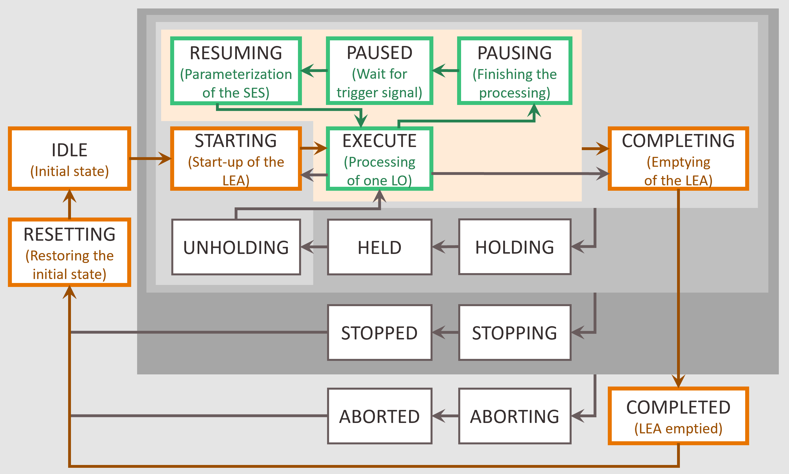
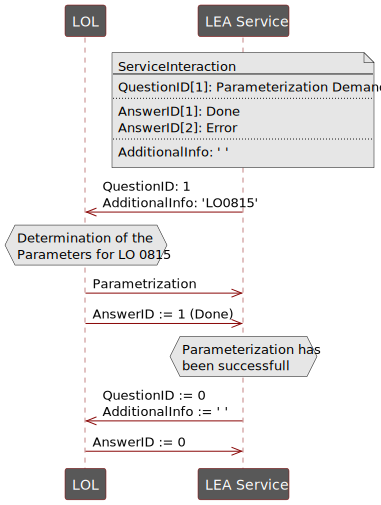

## 3 Automation Services for Logistics Equipment Assemblies
### State-based Automation
Since LEAs usually implement only one specific logistical function, such as filling, transporting, or palletiz-ing, it is reasonable to equip each LEA with only one service in the sense of the MTP concept. According to [6], this can be operated in two execution types – the order-oriented Cyclic Execution Service (CES) and the demand-oriented Single Execution Service (SES).

For some LEA types, it is useful to offer their logistics functionality as both CES and SES operations [6]. Since CES and SES cannot be executed simultaneously, they are implemented as different procedures of the MTP service. CES and SES procedures conform to the existing MTP concept. However, they are based on special interpretations of the MTP state machine, which are described in more detail in Sections 3.1.1 and 3.1.2.

#### Cyclic Execution Service
The Cyclic Execution Service (CES) is used to automate LEAs of a packaging line. It is designed to accept an order and then process all LOs belonging to this order identically. For example, in the case of the order "Pack 500 bags on 10 pallets", the service of the Form Fill Seal Machine (see Figure 2.1) would cyclically fill 500 bags in one service run. A characteristic feature of CES operation is that the service is parameter-ized once at the start of a service run according to the order data and then cyclically processes a specific or unspecified number of similar LOs. The necessary interpretation of the MTP state machine for a normal service run (without exception handling) is depicted in Figure 3.1.

Like every MTP service, a logistics service in CES mode initially is in IDLE state. Since a CES procedure works order-oriented, all order data required for execution must be transferred to it before it can be started. For this purpose, a corresponding parameterization must be carried out according to Section 3.2. After starting the procedure in the STARTING state, LOs are processed cyclically with the same previously set order data in the EXECUTE state. CES procedures can be self-terminating or continuous. Accordingly, the processing can be terminated by a Complete command or after a defined number of processed LOs. The LO currently being processed may be finished in COMPLETING state and afterwards the completion is signalled with COMPLETED state. Finally, a Reset command sets the procedure back to the IDLE state.

The orange-marked states in Figure 3.1 represent the state of the LEA and not the state of the LO pro-cessing, in contrast to MTP applications in the process industry. The unmarked states, in particular the pause, hold, stop and abort loops, have the semantics described in VDI/VDE/NAMUR 2658-4 [3].

#### Single Execution Service
The Single Execution Service (SES) is used to automate stand-alone LEAs in a logistics area. It is designed to process individual LOs on demand according to their individual order data. For example, the stretch hood shown in Figure 2.1 must be able to stretch both pallets with bags and pallets with an octabin with different parameters. For this purpose, a SES is parameterized individually for each LO. In this way, LOs from different orders can be processed according to their different order data. The number and sequence of LOs that are processed within a service run is undefined when the service is started and is determined on demand at runtime. The necessary operation of an SES is illustrated in Figure 3.2.

At the beginning, a logistics service in SES mode is in the initial state IDLE. In this state, all parameters that are independent of the type of LO to be processed can be passed to the service using the parameterization mechanisms described in Section 3.2. Subsequently, the SES procedure is started independently of any order and changes through the STARTING and PAUSING states to the PAUSED state. Now the SES waits for an external trigger that indicates the demand to process an LO. Such a trigger could be, for example, an incoming AGV that intends to pick up a LO or to transfer it to the LEA. If such a trigger occurs, the service state changes to RESUMING and the SES is parameterized for the individual processing of the re-spective LO. In the following EXECUTE state, the processing of the LO is executed as required. After pro-cessing has been completed, the SES switches back to the PAUSED state via the PAUSING state and waits for the next trigger. If no further LOs need to be processed, the SES can be terminated by means of a Complete command. If necessary, the LO currently being processed is completed in the COMPLETING state. SES procedures are always executed continuously, since at the beginning of the service run it is not known how many LOs must be processed in which order.

The states marked in orange in Figure 3.2 reflect the state of the LEA, like in the CES case. The states marked in green, on the other hand, reflect the current processing state of an LO. The unmarked states, in particular the hold, stop and abort loops, have the semantics described in VDI/VDE/NAMUR 2658-4 [3].

### Parameterization
This section specifies all relevant topics regarding parameterization of logistic services. Therefore, logistic-specific parameter types and the applicable parameterization mechanism are introduced.

#### Parameter Types
To adapt a logistics function to order-, product- and machine-specific conditions, appropriate parameter-ization is required. Accordingly, three types of parameters can be differentiated.

Order-specific parameters are used to transfer order data to the service. They result from customer or-ders and therefore change with each order. Essentially, they specify the organizational data of an order (e.g., the order number), the product to be packed and its quantity (e.g., the number of bags or pallets). Due to their order-related character, these parameters shall be implemented as procedure parameters according to VDI/VDE/NAMUR 2658-4 [3].

Product-specific parameters result from the LO to be packaged including its customer- and country-spe-cific characteristics (hereinafter referred to as “Product”). These parameters must be adapted if a differ-ent product needs to be packed. Examples are stretch parameters or packing patterns. Depending on the parameterization mechanism (see Section 3.2.2), these parameters can be implemented as procedure or configuration parameters according to VDI/VDE/NAMUR 2658-4 [3].

Construction-specific parameters are dependent on the physical structure of the LEA. They change when the LEA is physically modified or equipped. Essentially, they can specify which Functional Equipment As-semblies (FEAs) are assigned to the LEA (e.g., which filling spout is connected) or which supplies (e.g., pallet type) the LEA is equipped with. They are set at the time of commissioning of the LEA and must therefore be implemented by means of configuration parameters according to VDI/VDE/NAMUR 2658-4 [3].

#### Parameterization Mechanisms
The introduced parameter types can be transferred to the LEA by different parameterization mechanisms. In particular, the following variants can be distinguished.

##### Variant 1 - Transfer of Individual Variables
This variant is based on transferring all parameters to the service via separate parameter interfaces.

Advantages: Metainformation (e.g., minimum/maximum value or unit) can be provided for each param-eter.

Disadvantages: A large number of parameters may be required for parameterizing a LEA, making the ser-vice interface extensive and the parameterization time-consuming. In addition, each parameter is trans-ferred individually to the LEA service. Thus, it must always be ensured that a consistent, valid data set is available at the service across all parameters.

This variant corresponds to the parameterization envisaged in the previous MTP concepts. Thus, corre-sponding parameter interfaces are already available in VDI/VDE/NAMUR 2658-4 [3].

##### Variant 2 - Transfer of Parameter Sets
This variant envisages that parameters are not transferred to the service as individual variables but as a parameter set with an LEA-specific structured data type.

Advantages: Especially for LEAs with large parameter sets, the service interface is simplified, and the ef-fort required for parameterization is reduced. In addition, consistent writing and applying of the complete parameter set is possible.

Disadvantages: No meta information can be given to the individual parameters of the parameter set. This would require read and write access to individual variables in the parameter set, which is not possible in complex data types according to VDI/VDE/NAMUR 2658-1 [7]. In addition, the entire parameter set must always be transferred for parameterization, which can lead to a high network load.

So far, no parameter interfaces for structured data types are provided in the MTP concept. However, VDI/VDE/NAMUR 2658-1 [7] describes the possibility of modelling complex data types. Based on this, a StructuredServParam interface is presented in Section 9.1.

##### Variant 3 - Selection of Parameter Sets
This variant combines the use of structured data types with the possibility of selection via a single variable. Parameter sets for different products are stored in the LEA in the form of an array. These parameter sets can be downloaded into the LEA at any time. An ID can then be used to select which parameter set should be applied for the current packaging process. This principle has already been implemented in many logis-tics systems (proprietarily).

Advantages: A quick and easy selection of the parameter set to be used is possible. In addition, the con-sistency of the parameter sets is always ensured.

Disadvantages: Two interfaces are necessary - one for loading the parameter sets into the LEA and one for the ID-based selection of one parameter set. Currently, there is no way to model the relationship between these two interfaces.

For the MTP-based implementation of the interface for ID selection, the DIntServParam interface speci-fied in VDI/VDE/NAMUR 2658-4 [3] can be used. For loading the parameter sets, a configuration parame-ter is required to access an array located in the LEA. A corresponding interface is currently not provided in the MTP concept and is therefore specified in Section 9.2 as ArrayServParam. The individual parameter sets of the array have an LEA-specific structured data type, as described in variant 2.

In addition to the three variants for transferring parameters, the parameterization of LEAs can be distin-guished by whether it is initiated by the LOL or by the LEA.

Parameterization by the LOL is equivalent to the variant currently provided in the MTP environment. Here, the LOL knows when which parameters are to be transferred to the LEAs and initiates the parame-terization accordingly.

Since in logistics systems there is sometimes no continuous control from the LOL, but the LEAs operate largely autonomously, a request for parameters by the LEA is also useful in some cases. Such a mechanism is not yet foreseen in the MTP specification, but can be implemented based on the service interaction mechanism described in VDI/VDE/NAMUR 2658-4 [3] as shown in Figure 3.3.

The LEA informs the LOL of its parameterization demand in the form of a Question and provides infor-mation about the LO to be processed as Additional Information to the request. The LOL then sets the necessary parameters at the LEA via a parameter interface according to variants 1-3 and confirms the successful parameterization to the LEA by setting a corresponding Answer.

The parameterization mechanisms presented here show the spectrum of how LEAs can be parameterized. All six combinations between variants 1-3 and the possibilities for parameterization from the LOL and from the LEAs are conceivable. Best practices when which variant should be selected do not yet exist.

### Report Values and Process Information
According to current knowledge, the already specified mechanism for report values is also suitable for use in the area of production-related logistics. Any new findings regarding this will be published here.

### Process Values
According to current knowledge, the already specified mechanism for process values is also suitable for use in the area of production-related logistics. Any new findings regarding this will be published here.

[Back](../README.md)