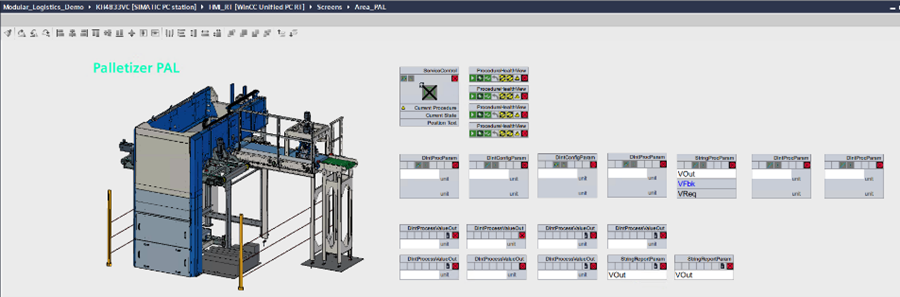

## 4 Machine-oriented Human Machine Interfaces
Due to the origin of the MTP concept in the process industry, the concept for vendor-neutral Human Machine Interface (HMI) modelling described in the VDI/VDE/NAMUR 2658-2 [6] is designed for P&ID-like HMIs. For the field of logistics, however, machine-oriented HMIs, as shown in Figure 4.1 for a palletizer, are more appropriate.

*Figure 4.1: Human Machine Interface of a Layer Palletizer based on a Custom ECLASS Element*

This HMI contains an image of the LEA as a static HMI object and several dynamic objects for parameters and report values. The latter can be implemented with the mechanisms from VDI/VDE/NAMUR 2658-2 [4].

Static objects are positioned as VisualObjects in the HMI according to VDI/VDE/NAMUR 2658-2 and are provided with an ECLASS reference. The integrating system (here: LOL) must have this reference available in a graphics library to be able to display the static object accordingly.

In the case of machine HMIs, this ECLASS reference must refer to a very specific machine from a very specific manufacturer to ensure suitable visualization. To avoid having to keep images of many different machines in the LOL, it makes sense to include them in the MTPs of the LEAs as attachments according to VDI/VDE/NAMUR 2658-1 [7]. The file names of those attachments should correspond to the ECLASS ref-erence, which is used for the HMI modelling. Here, numbers in the number range 90-90-XX-YY are to be selected, since these are not occupied with official coding. The images must be stored in the attachments folder in a separate HMI folder. If a visual object with an ECLASS reference starting with 90-90-* is then placed in the HMI image, the LOL knows that this object must be obtained from the MTP.

[Back](../README.md)