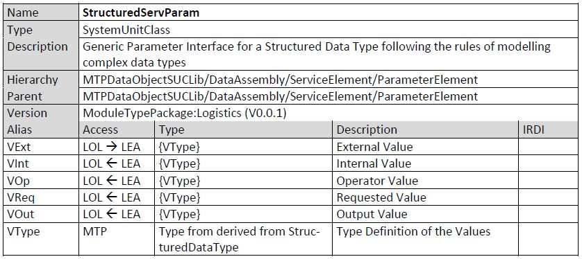
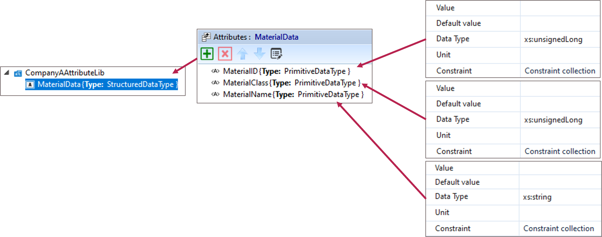
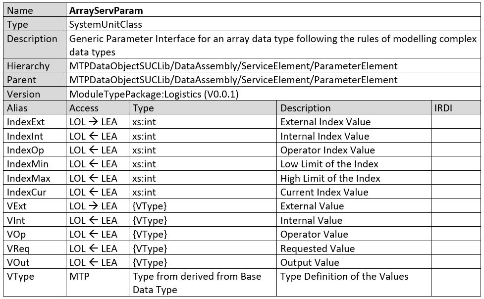

## 9 Interface Definitions for Logistics Equipment Assemblies
This section defines necessary data assembly definitions for Logistics Equipment Assemblies. The descrip-tion of those interfaces is based on the notation also used in the MTP specification. As a basis for under-standing this notation, the concepts of AutomationML [9] and the associated abbreviations (see also List of Abbreviations) are required.

This version of the document only contains the interface definitions of StructuredServParam in Section 9.1 and ArrayServParam in Section 9.2. Further definitions will follow in future versions of this document.

### StructuredServParam
The StructuredServParam interface is intended to transfer parameters of a user-defined structured data type from a higher-level system (here: LOL) to a MTP-based module (here: LEA). The corresponding inter-face definition can be found in Table 9.1.

The data assembly definition SUC StructuredServParam is derived from the SUC ParameterElement and represents a generic parameter interface for complex data types. The used complex data type has to be derived from the AT StructuredDataType defined in VDI/VDE/NAMUR 2658-1 [7].

When using this interface a user-defined ATL, like “CompanyAAttributeLib” must be created. Within this ATL the structured data type that should be later used in the instance of the StructuredServParam inter-face must be specified. An example of this modelling is shown in Figure 9.1.

With the assignment of this user-defined AT to the Attribute VType of the StructuredServParam interface the used structured data type is defined. This data type is then expected behind the VExt, VInt, VOp, VReq and VOut variables shown in the specification in Table 9.1.

With the variables VExt, VInt, VOp three access channels to the structured parameter are offered, which are also provided in VDI/VDE/NAMUR 2658-4 [3]. The current operation mode of the parameter defines which of these channels is currently in use. Consequently, the data to be set can be passed to the corre-sponding variable (VExt, VInt or VOp). After the processing of the controller the input data is transferred to the attribute VReq to indicate the successful data transfer. If the value of VReq is equal to the active access channel variable (VExt, VInt or VOp), the values are consistent and can be applied. After applying has been successful, the active parameter value is transferred to the variable VOut. This procedure of applying parameter is equal to all other parameter element derivations of VDI/VDE/NAMUR 2658-4 [3].

### ArrayServParam
The ArrayServParam interface is intended to manage an array located in a module (here: LEA) using a higher-level system (here: LOL). The corresponding interface definition can be found in Table 9.2.

The data assembly definition SUC ArrayServParam is derived from the SUC ParameterElement and repre-sents a generic parameter interface for an derivation of the AT BaseDataType defined in VDI/VDE/NAMUR 2658-1 [7].

The challenge with this interface is the implementation of a list of variables with undefined length. This is often not possible at all in common automation solutions or only under certain conditions. Therefore, a multiplexer mechanism is used, which can access an array of arbitrary length by means of a structurally static interface.

Within the IndexExt, IndexInt and IndexOp variables a pointer-like reference one array item can be defined under consideration of the operation mode mechanism of the VDI/VDE/NAMUR 2658-4 [3]. Depending on the active access channel the IndexCur variable is updated with one of those three channel variables. Each variable is checked if it is in the range between IndexMin and IndexMax. IndexMin represents the lowest but valid index and IndexMax the highest valid index. If an index is set which is out of this scope the last valid index persists and the worst quality code is set to Out of Specification.

Depending on the value of the IndexCur variable, the array item with this index is used for the processing of the VExt, VInt, VOp, VReq, and VOut variables following the operation mode mechanism of VDI/VDE/NAMUR 2658-4 [3]. The current operation mode of the parameter defines which of the channels (Ext, Int, Op) is currently in use. Consequently, the data to be set can be passed to the corresponding variable (VExt, VInt or VOp). After the processing of the controller the input data is transferred to the attribute VReq to indicate the successful data transfer. If the value of VReq is equal to the active access channel variable (VExt, VInt or VOp), the values are consistent and can be applied to the selected array item. The ApplyEn variable (derived from the SUC ParameterElement) can be used to temporarily block the updating of an array item, e.g., if it is currently in use at the service. After applying has been successful, the active parameter value is transferred to the variable VOut. Thus, VOut always shows the value cur-rently set at the selected array item. It should be noted that this value does not necessarily have to cor-respond to the value currently used in the module (here: LEA). This procedure of applying parameter is equal to all other parameter element derivations of VDI/VDE/NAMUR 2658-4 [3].

As data type for the individual array items all primitive data types provided in the MTP concept as well as all complex data types according to the conventions from VDI/VDE/NAMUR 2658-1 [7] can be used. The used data type is selected via the VType variable. In the case of a structured data type, the conventions for creating a user-defined data type described in Section 9.1 must be followed. This data type can then be assigned to the VType variable of the ArrayServParam interface.

[Back](../README.md)